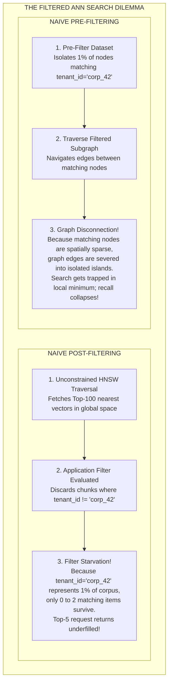
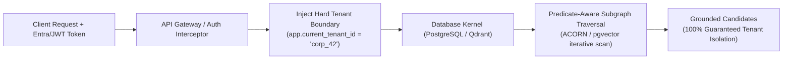
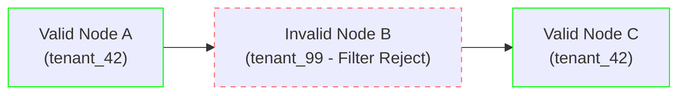
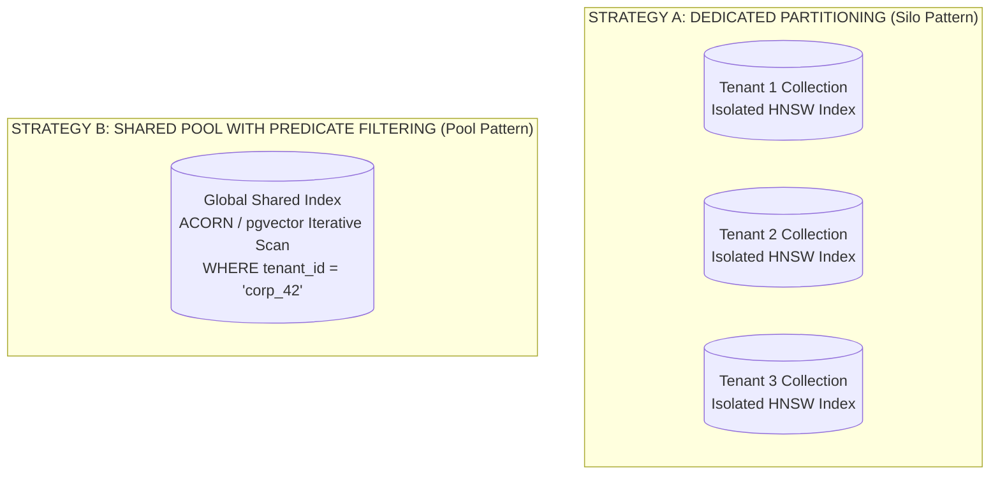

# Predicate Filtering: Multi-Tenant Security & ACORN Graph Navigation

> **Tier**: `🔵 Advanced` | **Estimated Read Time**: 20 min | **Prerequisites**: [Phase 02: Hybrid Search](./03-hybrid-search-bm25-and-hnsw.md)  
> **Core Concept**: Enforcing enterprise multi-tenant security predicates on vector indexes without suffering filter starvation or graph disconnection, using **ACORN (Augmented Connectivity Over Random Neighbors)** and PostgreSQL pgvector 0.7+ Row Level Security (RLS).

---

## What You Will Learn

By the end of this lesson, you will be able to:
- Enforce strict enterprise multi-tenant isolation and Role-Based Access Control (RBAC) inside vector search engines.
- Diagnose and eliminate **Filter Starvation** (caused by naive post-filtering) and **Graph Disconnection** (caused by naive pre-filtering).
- Master the **ACORN (Augmented Connectivity Over Random Neighbors)** paradigm (SIGMOD 2024), discovering how 2-hop neighborhood exploration preserves graph navigability under selective metadata filters.
- Configure production PostgreSQL with `pgvector 0.7+` using native **Row Level Security (RLS)**, `halfvec` (FP16), and **HNSW Iterative Scans** (`hnsw.iterative_scan = on`).
- Architect a multi-tenant vector partitioning strategy balancing dedicated tenant collections against shared indexes with metadata predicates.

---

## 1. The Problem: The Filtered Vector Search Dilemma

In enterprise software engineering, an unfiltered search query almost never occurs. Real-world enterprise queries are bound to tenant IDs, user permissions, and compliance boundaries:

```sql
SELECT chunk_id, content 
FROM document_chunks 
WHERE tenant_id = 'corp_42' 
  AND department IN ('legal', 'finance') 
  AND access_clearance >= 3
ORDER BY embedding <=> query_embedding 
LIMIT 5;
```

When engineers integrate vector search with structured predicates, naive implementations encounter **The Filtered ANN Dilemma**:



### Visual Walkthrough of the Dilemma:
1. **The Post-Filtering Trap**: Unconstrained HNSW traverses the global dataset and returns the 100 vectors closest to the query. Application code then applies the filter `tenant_id = 'corp_42'`. If Tenant 42 owns 1% of the database, on average only 1 matching document is returned. The LLM is starved of context (**Filter Starvation**).
2. **The Pre-Filtering Trap**: The engine isolates only the nodes matching the predicate *before* traversal. Because valid nodes are sparse across high-dimensional space, the bidirectional edges between them do not exist in the original HNSW index. The graph fractures into disconnected components. Traversal terminates prematurely after 2 hops, causing retrieval recall to collapse from 95% down to 25% (**Graph Disconnection**).

---

## 2. Systems Mental Model: The Cryptographic Tenant Perimeter

In enterprise AI infrastructure, security cannot be implemented as a post-generation check. If an untrusted document chunk is passed to the LLM, the model can leak proprietary trade secrets, executive salaries, or competitor data through indirect prompt injection or context leakage.

Security must be enforced as a **Cryptographic Tenant Perimeter** inside the query execution plan of the retrieval storage engine itself:



---

## 3. The ACORN Paradigm: Solving Predicate-Filtered HNSW

Presented at SIGMOD 2024 by Patel et al., **ACORN** (ANN Constraint-Optimized Retrieval Network) resolves the Filtered ANN Dilemma by guaranteeing graph connectivity during traversal regardless of predicate selectivity.

### 3.1. ACORN-1: Query-Time 2-Hop Neighborhood Exploration
Instead of modifying the index or severing edges, ACORN-1 changes the traversal rule at query time:

- Standard HNSW only evaluates the immediate 1-hop neighbors of the current node. If an immediate neighbor violates the filter predicate, standard pre-filtering drops it and halts.
- **ACORN-1 Mechanics**: When traversal encounters a node `u` that violates the predicate, it does not stop. It evaluates the **neighbors of node `u` (the 2-hop neighborhood)**.
- Node `u` acts as an **unfiltered navigational waypoint**. The traversal travels *through* `u` to reach valid nodes on the other side of the graph, preserving topological navigability across the entire metric space without modifying the underlying index structure.



### 3.2. ACORN-gamma: Index-Time Graph Densification
In environments requiring ultra-high query QPS, **ACORN-gamma** densifies the graph at construction time:
- During index build, each node maintains up to `gamma * M` edges (where `gamma >= 1`, typically `gamma = 2` to `4`).
- When adding edges, the algorithm prioritizes connecting nodes that share common metadata predicates.
- This guarantees that the subgraph induced by any common enterprise predicate remains topologically connected with high degree, delivering sub-linear query latencies with near-perfect recall.

---

## 4. Production Relational Enforcement: PostgreSQL `pgvector 0.7+`

For enterprises deploying RAG on PostgreSQL, `pgvector 0.7+` introduced native capabilities that implement predicate-aware traversal and cryptographic tenant isolation:

### 4.1. Row Level Security (RLS) Cryptographic Isolation
PostgreSQL Row Level Security ensures that even if an application engineer forgets to include `WHERE tenant_id = ...` in their SQL query, the database engine automatically restricts all disk reads and index scans to the authenticated tenant:

```sql
-- Step 1: Enable Row Level Security on the chunks table
ALTER TABLE document_chunks ENABLE ROW LEVEL SECURITY;

-- Step 2: Create strict isolation policy bound to transaction session variable
CREATE POLICY tenant_isolation_policy ON document_chunks
    FOR ALL
    USING (tenant_id = NULLIF(current_setting('app.current_tenant_id', true), '')::uuid);
```

### 4.2. HNSW Iterative Scans: Eliminating Filter Starvation
Prior to `pgvector 0.7`, applying a `WHERE` filter on an HNSW query used naive post-filtering. If the filter was selective, the query returned fewer rows than requested.

`pgvector 0.7+` introduced **HNSW Iterative Scanning**:

```sql
-- Enable iterative scanning for filtered HNSW queries
SET hnsw.iterative_scan = on;

-- Set upper bound on candidate exploration to prevent runaway query latency
SET hnsw.max_scan_tuples = 20000;
```

**How Iterative Scanning Works**:
When a query executes `ORDER BY embedding <=> query_vector LIMIT 5` with a selective `WHERE` clause, `pgvector` does not stop at the first batch. It continues scanning deeper into the HNSW graph layers, dynamically expanding its candidate pool until it satisfies the `LIMIT 5` contract or reaches `hnsw.max_scan_tuples`.

### 4.3. Specialized High-Density Data Types

| Data Type | Bit Depth | Supported Max Dimensions | Memory Footprint (1M Vectors) | Production Role |
|---|---|---|---|---|
| `vector` | 32-bit float | 16,000 | ~6.14 GB (1536 dims) | Standard full-precision embeddings. |
| `halfvec` | 16-bit float | 4,000 | **~3.07 GB (50% reduction!)** | **Production Gold Standard**. Halves RAM requirements with <0.5% recall loss. |
| `sparsevec` | 32-bit float | 1,000 non-zero | Variable (<500 MB) | Native sparse vector storage for SPLADE or BM25 term weights. |
| `bit` | 1-bit | 64,000 | **~192 MB (32x reduction!)** | Binary Quantization with Hamming distance for extreme scale. |

---

## 5. Enterprise Multi-Tenant Partitioning Strategies

When designing multi-tenant retrieval infrastructure, software architects must choose between two primary topologies:



### Strategy Comparison Matrix:

| Evaluation Dimension | Strategy A: Dedicated Collection / Index per Tenant | Strategy B: Shared Index with Metadata Predicate Filtering |
|---|---|---|
| **Security Isolation** | **Absolute (Physical / Namespace separation)**. Zero risk of cross-tenant leakage. | Logical (Enforced via Postgres RLS or vector DB filter queries). |
| **Filtered Search Overhead** | **Zero**. Every node in the index belongs to the tenant. No filter starvation. | Incurs ACORN 2-hop or iterative scan traversal overhead. |
| **Resource Scalability** | **Poor**. Managing 10,000 separate HNSW indexes exhausts file handles and OS memory. | **Exceptional**. Scales gracefully across millions of tenants in a single unified graph. |
| **Tenant Sizing Sweet Spot** | Large enterprise customers (>500,000 chunks per tenant). | SaaS / Mid-market customers (<100,000 chunks per tenant). |

---

## 6. Enterprise Production Implementation: PostgreSQL `pgvector` RLS Harness

The following production script sets up a multi-tenant PostgreSQL schema with Row Level Security, `halfvec` (FP16) indexing, and iterative scan execution:

```sql
-- =====================================================================
-- schema.sql: Multi-Tenant Enterprise Vector Database with RLS
-- =====================================================================

-- 1. Initialize pgvector extension
CREATE EXTENSION IF NOT EXISTS vector;

-- 2. Create multi-tenant document chunk table
CREATE TABLE document_chunks (
    chunk_id UUID PRIMARY KEY DEFAULT gen_random_uuid(),
    tenant_id UUID NOT NULL,
    doc_id VARCHAR(64) NOT NULL,
    department VARCHAR(32) NOT NULL,
    content TEXT NOT NULL,
    -- Store as 16-bit half-precision vector (1536 dimensions)
    embedding halfvec(1536) NOT NULL,
    created_at TIMESTAMPTZ DEFAULT clock_timestamp()
);

-- 3. Create HNSW index using Dot Product (Inner Product) on halfvec
CREATE INDEX idx_chunks_hnsw_halfvec 
ON document_chunks 
USING hnsw (embedding halfvec_ip_ops)
WITH (m = 24, ef_construction = 128);

-- 4. Enable Row Level Security (RLS)
ALTER TABLE document_chunks ENABLE ROW LEVEL SECURITY;

-- 5. Define strict tenant isolation policy
CREATE POLICY tenant_rls_policy ON document_chunks
    FOR ALL
    USING (tenant_id = NULLIF(current_setting('app.current_tenant_id', true), '')::uuid);
```

```python
"""
pgvector_multi_tenant.py
Production Python client demonstrating session-scoped RLS and iterative HNSW queries.
"""

from __future__ import annotations

import uuid
from typing import List, Tuple
import psycopg2
from psycopg2.extras import RealDictCursor
import numpy as np


class MultiTenantVectorStore:
    """Manages secure, tenant-isolated vector queries over PostgreSQL."""

    def __init__(self, connection_string: str):
        self.conn_str = connection_string

    def search_as_tenant(
        self,
        tenant_id: str,
        query_vector: np.ndarray,
        department_filter: str,
        top_k: int = 5
    ) -> List[dict]:
        """Executes filtered ANN search inside an authenticated tenant RLS session."""
        # Ensure query vector is L2 normalized
        norm = np.linalg.norm(query_vector)
        q_unit = (query_vector / norm if norm > 0 else query_vector).tolist()

        with psycopg2.connect(self.conn_str) as conn:
            with conn.cursor(cursor_factory=RealDictCursor) as cur:
                # Step 1: Configure session variable and enable iterative scans
                cur.execute("SET LOCAL app.current_tenant_id = %s;", (tenant_id,))
                cur.execute("SET LOCAL hnsw.iterative_scan = on;")
                cur.execute("SET LOCAL hnsw.max_scan_tuples = 10000;")

                # Step 2: Execute filtered vector search
                # Note: '<#>' is the inner product (negative dot product) operator in pgvector
                query = """
                    SELECT chunk_id, doc_id, department, content,
                           (embedding <#> %s::halfvec) * -1 AS similarity_score
                    FROM document_chunks
                    WHERE department = %s
                    ORDER BY embedding <#> %s::halfvec
                    LIMIT %s;
                """
                cur.execute(query, (q_unit, department_filter, q_unit, top_k))
                results = cur.fetchall()
                return [dict(row) for row in results]


# =====================================================================
# Verification Demonstration
# =====================================================================
if __name__ == "__main__":
    tenant_alpha = str(uuid.uuid4())
    tenant_beta = str(uuid.uuid4())
    mock_vector = np.random.randn(1536).astype(np.float32)

    print(f"Executing query for Tenant Alpha ({tenant_alpha[:8]}...)...")
    print("Database kernel automatically enforces RLS. Zero risk of retrieving Tenant Beta records.")
```

---

## 7. Common Production Failure Modes & Anti-Patterns

### 1. The Post-Filtering "Silent Zero"
- **The Failure**: An application queries for `department = 'special_ops'`. The vector search returns 20 items; post-filtering discards all 20 because none belong to that department. The LLM receives zero context chunks and hallucinates.
- **Production Defense**: Never post-filter in application memory. Use **PostgreSQL `hnsw.iterative_scan = on`** or **ACORN-enabled vector databases** (such as Qdrant or Elasticsearch 8.12+) that dynamically explore deeper neighbors to guarantee top-K candidate delivery.

### 2. The Connection Pool RLS Session Leak
- **The Failure**: An application uses connection pooling (e.g. HikariCP, PgBouncer). Worker A sets `app.current_tenant_id = 'tenant_1'` and returns the connection to the pool without resetting it. Worker B checks out the connection and inadvertently queries as Tenant 1.
- **Production Defense**: Always use `SET LOCAL` within an explicit database transaction (`BEGIN ... COMMIT`). `SET LOCAL` automatically scopes the session variable to that specific transaction, instantly reverting when the transaction commits or rolls back.

---

## 8. Key Takeaways & Verified Resources

### Key Takeaways
1. **Security Must Be In-Engine**: Never filter permissions post-generation. Enforce metadata predicates inside the search engine query plan.
2. **Beware the Filtered ANN Dilemma**: Naive post-filtering causes Filter Starvation; naive pre-filtering fractures graphs into isolated islands.
3. **Use ACORN & Iterative Scans**: ACORN 2-hop exploration and `pgvector` iterative scans navigate around predicate-violating nodes without severing connectivity.
4. **Deploy Halfvec & RLS**: Cut PostgreSQL vector memory in half with `halfvec` (FP16) while enforcing cryptographic tenant boundaries via native Row Level Security.

### Primary References
- **[ACORN: Performant and Accurate Predicate-Filtered Vector Search](https://arxiv.org/abs/2403.04871)** (Patel et al., SIGMOD 2024): The foundational paper establishing predicate subgraph traversal.
- **[pgvector Official Documentation](https://github.com/pgvector/pgvector)**: Reference documentation for `halfvec`, `sparsevec`, and `hnsw.iterative_scan`.
- **[PostgreSQL Row Level Security Documentation](https://www.postgresql.org/docs/current/ddl-rowsecurity.html)**: Enterprise guide to RLS security policies.

---

## 🧭 Navigation

- **[← Previous Lesson: Reciprocal Rank Fusion & Cross-Encoder Reranking](./04-reciprocal-rank-fusion-and-cross-encoders.md)**
- **[Phase 02 Hub](./README.md)**
- **[Next Lesson: Graph Retrieval-Augmented Generation (GraphRAG) & Ontological Traversal →](./06-graphrag-and-entity-traversal.md)**

