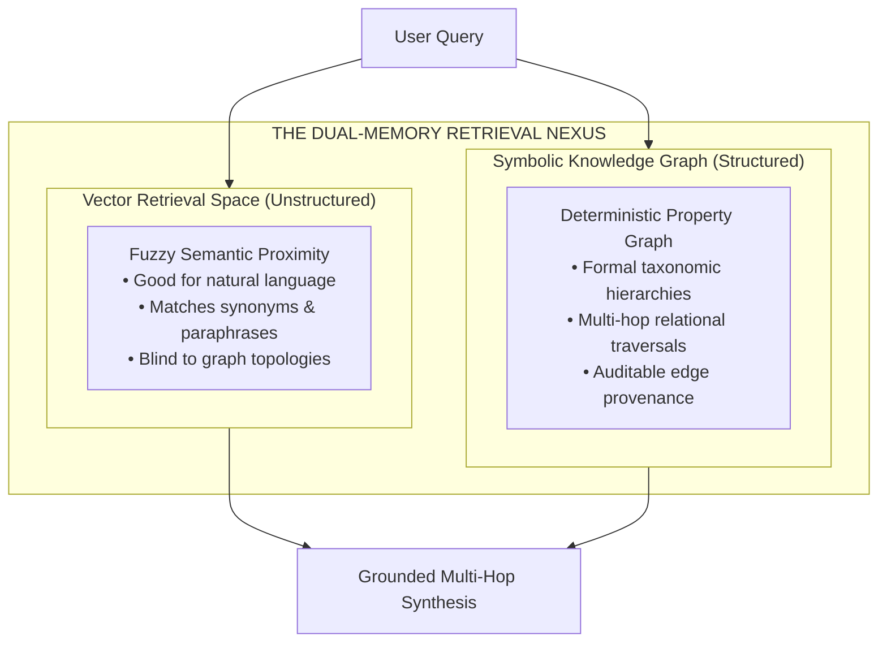
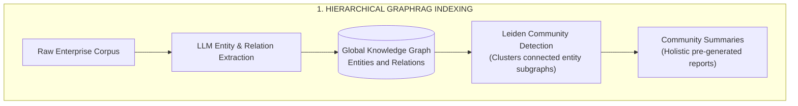
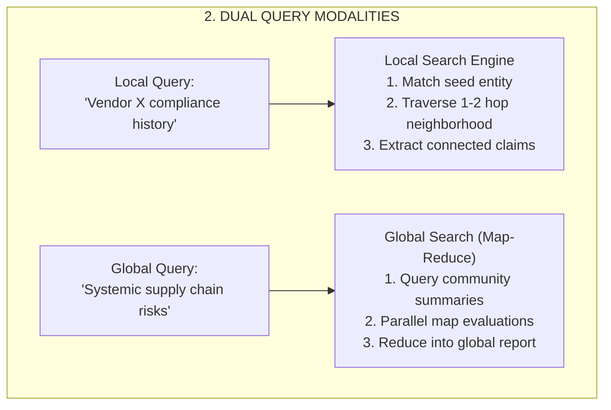
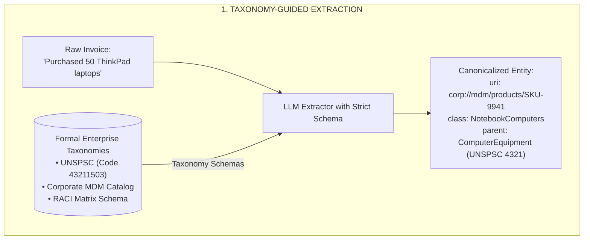

# Lesson 06: Graph Retrieval-Augmented Generation (GraphRAG) and Entity Traversal

> **Tier**: `🔵 Advanced` | **Estimated Read Time**: 24 min | **Prerequisites**: [Phase 02 Lesson 03: Hybrid Search](./03-hybrid-search-bm25-and-hnsw.md), [Phase 02 Lesson 05: Predicate Filtering and ACORN Graph Navigation](./05-predicate-filtering-and-acorn.md)  
> **Core Concept**: Synthesizing dataset-wide insights using GraphRAG (Graph Retrieval-Augmented Generation)—combining hierarchical community clustering (Leiden algorithm) with enterprise schemas to answer holistic queries without semantic drift.  
> **New AI terms introduced**: GraphRAG, Leiden Community Detection, Community Summaries, Global Search (Map-Reduce), Local Search (Entity Traversal), Semantic Bleed, Dual-Level Retrieval (LightRAG).  
> **AI terms assumed from earlier lessons**: RAG, Vector Database, Dense Retrieval, Embedding, HNSW, Predicate Filtering, Context Window.

---

## What You Will Learn

By the end of this lesson, you will be able to:
- Identify why standard vector search fails completely on **global, dataset-wide aggregation queries**.
- Master the **Microsoft GraphRAG (Graph Retrieval-Augmented Generation)** architecture, distinguishing between **Local Search** (entity-centric traversal) and **Global Search** (map-reduce synthesis over hierarchical community summaries).
- Diagnose the failure modes of naive LLM triple extraction (entity aliasing, relational ambiguity, and **semantic bleed**).
- Constrain knowledge graph extraction and multi-hop traversals using **formal enterprise taxonomies and schemas** (UNSPSC product taxonomies, MDM catalogs, RACI matrices).
- Author production Cypher queries enforcing semantic boundary pruning to answer complex multi-hop enterprise audit questions without hallucination.

---

## 1. The Problem: The Global Aggregation Blind Spot

Standard vector search excels at **local, pinpoint semantic queries**:
- Query: *"What is Acme Corp's cancellation policy under Section 4?"*
- Result: The vector search locates the specific chunk defining the cancellation fee and passes it to the LLM.

However, consider this typical executive or compliance audit question:

> **"What are the top five systemic supply chain risks across all vendor contracts signed in 2024?"**

Under standard RAG, this query **fails completely**:
1. **No Single Chunk Contains the Answer**: The answer does not exist in any isolated 500-token chunk. It is distributed across hundreds of contracts, addenda, and risk assessments.
2. **Top-K Vector Retrieval is Blind**: Vector search retrieves 5 random chunks mentioning "supply chain" or "vendor risk." The model synthesizes an incomplete, biased summary based on 0.5% of the data. Systemic patterns are completely lost.
3. **The Token Window Barrier**: Ingesting all 500 contracts into a 2M token context window costs tens of dollars per request, takes 30+ seconds, and suffers severe attention degradation.

---

## 2. Systems Mental Model: The Dual-Memory Nexus

To bridge statistical vectors and deterministic relational structures, enterprise AI architects deploy the **Dual-Memory Nexus**:

> **The Dual-Memory Nexus**:  
> **Dense Vectors** represent *statistical, associative similarity* (what concepts feel alike).  
> **Knowledge Graphs** represent *deterministic, symbolic relationships* (who owns what, what inherits from what, and what violates which policy).



#### Diagram Walkthrough:
1. **Dual Dispatch**: The user query is dispatched to both unstructured vector space and structured graph storage.
2. **Vector Memory**: Resolves fuzzy synonyms and informal natural language to identify relevant entry entities.
3. **Graph Memory**: Traverses strictly typed relationships to gather auditable, multi-hop evidence across corporate entities.
4. **Synthesis**: Both streams merge to provide grounded synthesis with deterministic provenance.

> [!NOTE]
> **Where this analogy breaks**: In human memory, associative recall and logical reasoning operate seamlessly in the same biological neural network. In AI systems engineering, vectors and knowledge graphs are physically separate database engines (e.g. pgvector alongside Neo4j or Memgraph) that require distinct query languages, network calls, and synchronization pipelines.

---

## 3. Microsoft GraphRAG: Architecture & Search Modalities

Developed by Microsoft Research (Edge et al., April 2024, arXiv:2404.16130), **GraphRAG** solves the global aggregation problem by transforming unstructured text into hierarchical knowledge graph summaries.



#### Diagram Walkthrough:
1. **Corpus Extraction**: Text chunks are processed by an LLM to extract discrete entities, relations, and factual claims into a graph.
2. **Community Detection**: The **Leiden algorithm** clusters densely connected entity subgraphs into hierarchical community tiers.
3. **Pre-Generated Summaries**: An LLM pre-generates executive summaries for every detected community cluster before any query is asked.



#### Diagram Walkthrough:
1. **Local Search (Entity Traversal)**: For entity-specific queries, search navigates local 1-hop and 2-hop graph neighborhoods around the target entity.
2. **Global Search (Map-Reduce)**: For corpus-wide questions, the engine bypasses raw chunks, queries pre-computed community summaries in parallel, and reduces them into an auditable final report.

---

## 4. The Breakdown of Naive GraphRAG in the Enterprise

When engineers deploy open-ended GraphRAG without schema constraints, enterprise systems quickly degrade into chaotic, unusable **"knowledge hairballs"**:

1. **Entity Aliasing & Duplication**:
   - The model extracts `IBM`, `International Business Machines`, `Big Blue`, and `IBM Corp` as 4 separate nodes with disconnected edges, severing relational continuity.
2. **Relational Ambiguity**:
   - Edges are labeled with vague natural language verbs (`associated_with`, `has_dealings_in`, `handles`, `talked_to`). These relationships carry zero mathematical or formal semantic meaning.
3. **Semantic Bleed (Catastrophic Multi-Hop Drift)**:
   - When answering a 3-hop query, unconstrained traversal drifts across vague associative links into completely irrelevant domains (e.g. from a procurement audit into a corporate sponsorship and charity golf tournament).
4. **Taxonomic Blindness**:
   - Query: *"List all IT hardware spend."*
   - Naive GraphRAG fails to connect the query to an invoice for *"ThinkPad T14 Gen 4"* because the document never explicitly contains the exact phrase "IT hardware."

---

## 5. Enterprise Schema Grounding: Taxonomy-Guided Extraction

**Schema-Constrained GraphRAG** resolves the breakdown of naive graph extraction by constraining entity extraction and graph traversal with **formal enterprise taxonomies, domain schemas, and controlled Master Data vocabularies**.



#### Diagram Walkthrough:
1. **Taxonomy Schema Enforcement**: Raw document text is processed by an LLM strictly constrained by predefined corporate schemas.
2. **Entity Resolution**: The informal text `"ThinkPad laptops"` is resolved to its canonical corporate Master Data URI and mapped to UNSPSC Code `43211503`.
3. **Deterministic Output**: Extracted entities and relationships carry verifiable, standardized attributes ready for multi-hop graph queries.

### 5.1. Standardized Taxonomic Integration: UNSPSC
The **United Nations Standard Products and Services Code (UNSPSC)** is an 8-digit, four-level global classification hierarchy:

```text
Segment (43: Information Technology) 
   └── Family (21: Computer Equipment) 
         └── Class (15: Computers) 
               └── Commodity (03: Notebook Computers - Code: 43211503)
```

By extracting and linking product entities to UNSPSC codes:
- An auditor asking for *"IT Equipment"* automatically traverses down to laptops, servers, routers, and monitors without relying on fuzzy vector similarity.

---

## 6. Constrained Multi-Hop Cypher Traversal

The following production Cypher query demonstrates how structured schema constraints prevent semantic drift during a complex multi-hop audit:

```cypher
// Query: Which EMEA subsidiaries procured IT equipment from vendors with unresolved SOC 2 violations?
MATCH (sub:Subsidiary {region: "EMEA"})-[:PROCURED_ASSET]->(po:PurchaseOrder)
MATCH (po)-[:INCLUDES_ITEM]->(item:ProcuredItem)
MATCH (item)-[:CLASSIFIED_AS]->(c:UNSPSC_Class)

// Structured Taxonomy Constraint: Restrict to IT Equipment Family (UNSPSC 4321)
WHERE c.code STARTS WITH "4321"

MATCH (po)-[:FULFILLED_BY]->(v:Vendor)
MATCH (v)-[:HAS_COMPLIANCE_AUDIT]->(a:AuditReport {audit_type: "SOC2"})

// Compliance Boundary Constraint
WHERE a.status = "UNRESOLVED"

RETURN sub.legal_name AS Subsidiary, 
       v.vendor_name AS Vendor, 
       item.product_name AS Product, 
       c.class_name AS TaxonomyClass,
       a.finding_summary AS Finding;
```

**Why This Succeeds in Production**:
1. **Zero Hallucination**: The query traverses explicit, verified edges in the knowledge graph.
2. **Bounded Traversal**: The traversal cannot drift into marketing or unrelated subsidiary operations because edge types (`:PROCURED_ASSET`, `:INCLUDES_ITEM`, `:FULFILLED_BY`) and property filters (`c.code STARTS WITH "4321"`) strictly constrain the search path.

---

## 7. Enterprise Production Implementation: Schema-Validated Extraction

The following complete, runnable Python 3.12+ script uses Pydantic v2 to enforce strict schemas during knowledge graph extraction and generate idempotent Cypher `MERGE` statements without external dependencies.

```python
from __future__ import annotations

from typing import List, Literal, Optional
from pydantic import BaseModel, Field


class CanonicalEntity(BaseModel):
    """Represents an extracted entity resolved against enterprise Master Data."""
    entity_id: str
    name: str
    canonical_uri: str = Field(description="Internal corporate URI, e.g. corp://mdm/vendors/V-102")
    entity_type: Literal["Subsidiary", "Vendor", "ProcuredItem", "AuditReport"]
    unspsc_code: Optional[str] = Field(default=None, description="8-digit UNSPSC code if applicable")


class SchemaRelation(BaseModel):
    """Represents a strictly typed relationship between canonical entities."""
    source_uri: str
    target_uri: str
    predicate: Literal["PROCURED_ASSET", "INCLUDES_ITEM", "FULFILLED_BY", "HAS_COMPLIANCE_AUDIT"]
    confidence: float = Field(ge=0.0, le=1.0)


class DocumentKnowledgeGraph(BaseModel):
    """Structured extraction payload conforming to enterprise domain schema."""
    doc_id: str
    entities: List[CanonicalEntity]
    relations: List[SchemaRelation]

    def to_cypher_inserts(self) -> List[str]:
        """Generates idempotent Cypher MERGE statements."""
        cypher_statements: List[str] = []
        for e in self.entities:
            unspsc_val = e.unspsc_code or ""
            stmt = (
                f"MERGE (n:{e.entity_type} {{uri: '{e.canonical_uri}'}}) "
                f"SET n.name = '{e.name}', n.unspsc = '{unspsc_val}';"
            )
            cypher_statements.append(stmt)

        for r in self.relations:
            stmt = (
                f"MATCH (src {{uri: '{r.source_uri}'}}), (tgt {{uri: '{r.target_uri}'}}) "
                f"MERGE (src)-[:{r.predicate} {{confidence: {r.confidence}}}]->(tgt);"
            )
            cypher_statements.append(stmt)

        return cypher_statements


if __name__ == "__main__":
    # Simulated extraction from invoice text:
    # "Acme EMEA BV purchased 100 ThinkPad T14 laptops from Lenovo Logistics Inc."
    kg = DocumentKnowledgeGraph(
        doc_id="invoice_emea_9941",
        entities=[
            CanonicalEntity(
                entity_id="sub_1",
                name="Acme EMEA BV",
                canonical_uri="corp://mdm/subsidiaries/SUB-04",
                entity_type="Subsidiary"
            ),
            CanonicalEntity(
                entity_id="item_1",
                name="ThinkPad T14 Gen 4",
                canonical_uri="corp://mdm/products/SKU-9941",
                entity_type="ProcuredItem",
                unspsc_code="43211503"  # Notebook Computers
            ),
            CanonicalEntity(
                entity_id="ven_1",
                name="Lenovo Logistics Inc",
                canonical_uri="corp://mdm/vendors/VEN-882",
                entity_type="Vendor"
            ),
        ],
        relations=[
            SchemaRelation(
                source_uri="corp://mdm/subsidiaries/SUB-04",
                target_uri="corp://mdm/products/SKU-9941",
                predicate="PROCURED_ASSET",
                confidence=0.98
            ),
            SchemaRelation(
                source_uri="corp://mdm/products/SKU-9941",
                target_uri="corp://mdm/vendors/VEN-882",
                predicate="FULFILLED_BY",
                confidence=0.95
            ),
        ]
    )

    print("--- Generated Idempotent Cypher Statements ---")
    for stmt in kg.to_cypher_inserts():
        print(stmt)
```

### Execution Output:
```text
--- Generated Idempotent Cypher Statements ---
MERGE (n:Subsidiary {uri: 'corp://mdm/subsidiaries/SUB-04'}) SET n.name = 'Acme EMEA BV', n.unspsc = '';
MERGE (n:ProcuredItem {uri: 'corp://mdm/products/SKU-9941'}) SET n.name = 'ThinkPad T14 Gen 4', n.unspsc = '43211503';
MERGE (n:Vendor {uri: 'corp://mdm/vendors/VEN-882'}) SET n.name = 'Lenovo Logistics Inc', n.unspsc = '';
MATCH (src {uri: 'corp://mdm/subsidiaries/SUB-04'}), (tgt {uri: 'corp://mdm/products/SKU-9941'}) MERGE (src)-[:PROCURED_ASSET {confidence: 0.98}]->(tgt);
MATCH (src {uri: 'corp://mdm/products/SKU-9941'}), (tgt {uri: 'corp://mdm/vendors/VEN-882'}) MERGE (src)-[:FULFILLED_BY {confidence: 0.95}]->(tgt);
```

---

## 8. Common Production Failure Modes & Anti-Patterns

### 1. The Knowledge Hairball Catastrophe
- **The Failure**: Letting an LLM extract free-form triples (`subject, predicate, object`) without an explicit schema. After indexing 1,000 documents, the graph contains 500,000 nodes with 12,000 distinct predicate strings (`purchased_from`, `bought_at`, `supplied_by`, `vendor_of`).
- **Production Defense**: Restrict the extraction prompt with a **strict JSON schema** (Pydantic v2) defining an explicit enumerated list of permitted node labels and relationship predicates. Any edge not in the schema is discarded.

### 2. Multi-Hop Semantic Bleed
- **The Failure**: Executing an open graph traversal `(start)-[*1..4]->(target)`. By Hop 3, traversal hops across an associative edge into completely irrelevant corporate marketing or personnel records.
- **Production Defense**: **Never execute unbounded `[*1..N]` traversals in production.** Explicitly specify the permitted sequence of relationship types for each multi-hop query pattern (e.g. `-[:PROCURED_ASSET]->()-[:FULFILLED_BY]->()`).

---

## 🧠 Quick Check

Test your architectural intuition:

> **Scenario**: An executive asks: *"What are the top three systemic antitrust liabilities across all 500 commercial partnerships executed over the last decade?"*
>
> 1. Why does standard Top-K vector retrieval fail to answer this question accurately?
> 2. How does GraphRAG Global Search synthesize an accurate, auditable response?

<details>
<summary><b>View Solution</b></summary>

1. **Why Vector Retrieval Fails**:
   The answer does not exist in any single chunk or cluster. Vector search retrieves 5–10 random chunks mentioning "antitrust" or "liability," representing less than 1% of the agreements. The model extrapolates a narrow, biased response based on that tiny sample.

2. **How GraphRAG Global Search Resolves It**:
   During ingestion, GraphRAG extracts partnership entities, builds a global knowledge graph, and applies the **Leiden algorithm** to detect hierarchical communities. It pre-generates executive summaries for each community. At query time, Global Search maps the query across all community summaries in parallel, scores systemic antitrust risks, and reduces intermediate findings into a comprehensive corpus-wide report.
</details>

---

## 9. Key Takeaways & Verified Resources

### Key Takeaways
1. **Vectors Find Chunks; Graphs Connect Systems**: Vector search fails on holistic, global aggregation queries. Use GraphRAG to synthesize thematic summaries across communities.
2. **Local vs. Global Search**: Use **Local Search** for entity-centric relationship expansion; use **Global Search (Map-Reduce)** over community summaries for dataset-wide analysis.
3. **Constrain with Formal Schemas**: Unconstrained graphs become chaotic knowledge hairballs. Bind entities to canonical MDM URIs and taxonomies (such as UNSPSC).
4. **Prune Traversals Strictly**: Bound multi-hop Cypher queries to explicit edge sequences to prevent semantic drift.

### Primary References
- **[From Local to Global: A Graph RAG Approach to Query-Focused Summarization](https://arxiv.org/abs/2404.16130)** (Edge et al., Microsoft Research 2024): The foundational GraphRAG paper.
- **[LightRAG: Simple and Fast Retrieval-Augmented Generation](https://arxiv.org/abs/2410.05779)** (Guo et al., EMNLP 2025): Fast dual-level retrieval and incremental knowledge graph updates.
- **[UNSPSC Code Directory](https://www.unspsc.org/)**: United Nations Standard Products and Services Code global taxonomy.

---

## 🧭 Navigation

- **[← Previous Lesson: Predicate Filtering: Multi-Tenant Security and Augmented Connectivity Over Random Neighbors (ACORN) Graph Navigation](./05-predicate-filtering-and-acorn.md)**
- **[Phase 02 Hub: Overview & Architecture Directory](./README.md)**
- **[Next Lesson: Query Planning, Adaptive Routing, and Corrective Retrieval (CRAG) →](./07-query-planning-adaptive-routing-and-crag.md)**
- **[Capstone Lab: Enterprise Multi-Tenant Hybrid RAG](./labs/capstone-enterprise-rag-pipeline.md)**
