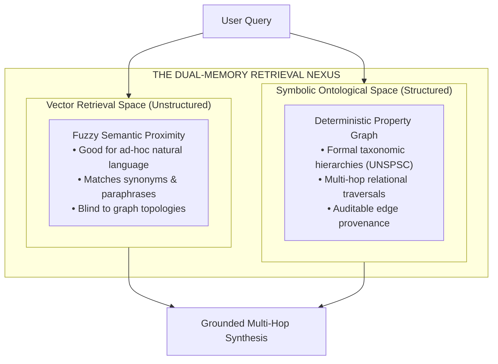
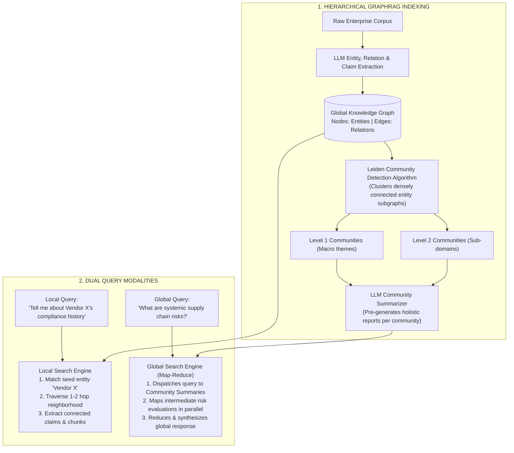
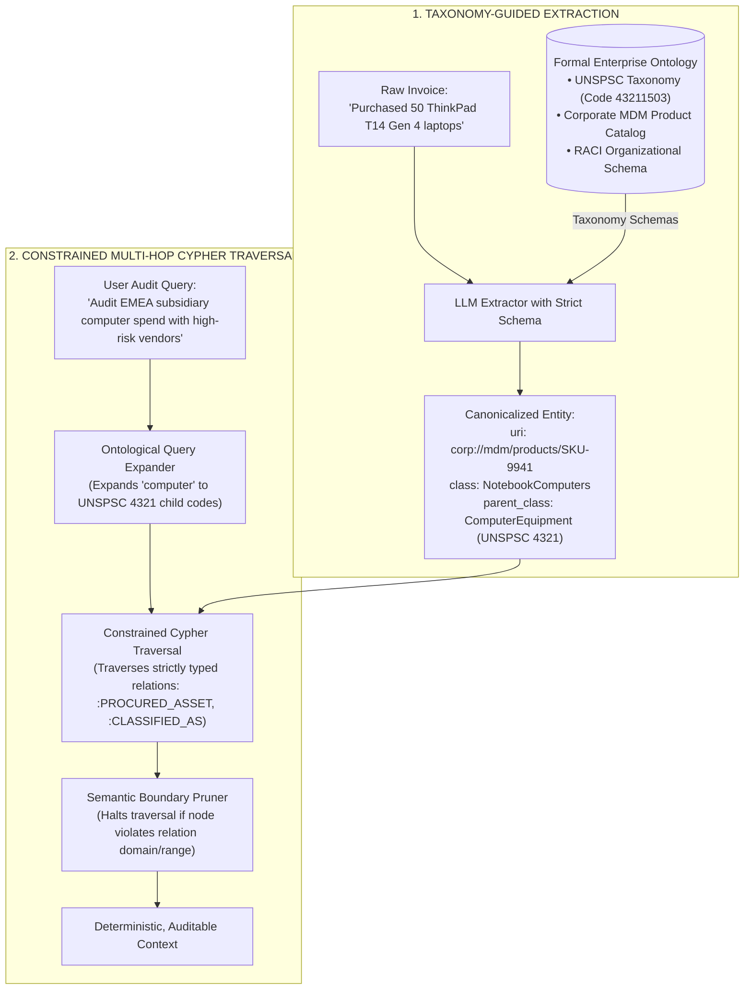

# Graph Retrieval-Augmented Generation (GraphRAG) & Ontological Entity Traversal

> **Tier**: `🔵 Advanced` | **Estimated Read Time**: 24 min | **Prerequisites**: [Phase 02: Hybrid Search](./03-hybrid-search-bm25-and-hnsw.md), [Phase 02: Predicate Filtering](./05-predicate-filtering-and-acorn.md)  
> **Core Concept**: Synthesizing dataset-wide insights using **GraphRAG (Graph Retrieval-Augmented Generation)**—combining hierarchical community clustering (Leiden algorithm) with enterprise ontological constraints to answer holistic queries without semantic drift.

---

## What You Will Learn

By the end of this lesson, you will be able to:
- Identify why standard vector search fails completely on **global, dataset-wide aggregation queries**.
- Master the **Microsoft GraphRAG (Graph Retrieval-Augmented Generation)** architecture, distinguishing between **Local Search** (entity-centric traversal) and **Global Search** (map-reduce synthesis over hierarchical community summaries).
- Diagnose the failure modes of naive LLM triple extraction (entity aliasing, relational ambiguity, and **semantic bleed**).
- Constrain knowledge graph extraction and multi-hop traversals using **formal enterprise ontologies** (UNSPSC product taxonomies, MDM catalogs, RACI matrices).
- Author production Cypher queries enforcing semantic boundary pruning to answer complex multi-hop enterprise audit questions without hallucination.

---

## 1. The Problem: The Global Aggregation Blind Spot

Standard vector search excels at **local, pinpoint semantic queries**:
- Query: *"What is Acme Corp's cancellation policy under Section 4?"*
- Result: The vector search locates the specific chunk defining the cancellation fee and passes it to the LLM.

However, consider this typical executive or compliance audit question:

> **"What are the top five systemic supply chain risks across all vendor contracts signed in 2024?"**

Under standard RAG, this query **fails completely**:
1. **No Single Chunk Contains the Answer**: The answer does not exist in any isolated 500-token chunk. It is distributed across hundreds of contracts, addenda, and risk assessments.
2. **Top-K Vector Retrieval is Blind**: Vector search retrieves 5 random chunks mentioning "supply chain" or "vendor risk." The model synthesizes an incomplete, biased summary based on 0.5% of the data, completely missing systemic patterns.
3. **The Token Window Barrier**: Ingesting all 500 contracts into a 2M token context window costs tens of dollars per request, takes 30+ seconds, and suffers severe attention degradation.

---

## 2. Systems Mental Model: The Dual-Memory Nexus

To bridge statistical vectors and deterministic relational structures, enterprise AI architects deploy the **Dual-Memory Nexus**:

> **The Dual-Memory Nexus**:  
> **Dense Vectors** represent *statistical, associative similarity* (what concepts feel alike).  
> **Knowledge Graphs** represent *deterministic, symbolic relationships* (who owns what, what inherits from what, and what violates which policy).



---

## 3. Microsoft GraphRAG: Architecture & Search Modalities

Developed by Microsoft Research (Edge et al., 2024), **GraphRAG** solves the global aggregation problem by transforming unstructured text into hierarchical knowledge graph summaries.



### Visual Walkthrough of GraphRAG:
1. **Hierarchical Indexing**: Text is passed to an LLM that extracts entities, relations, and claims. The resulting graph is clustered into communities using the **Leiden algorithm**. The LLM pre-generates holistic summaries for every community cluster at multiple granularities.
2. **Global Search (Map-Reduce)**: For corpus-wide questions, GraphRAG bypasses raw chunks. It queries the pre-computed community summaries in parallel, executes a map step to generate candidate answers, and reduces them into a unified response.
3. **Local Search (Entity Traversal)**: For entity-specific questions, GraphRAG finds the seed entity in vector space, gathers its direct relational neighbors and associated text units, and delivers precise, localized evidence.

---

## 4. The Breakdown of Naive GraphRAG in the Enterprise

When engineers deploy open-ended GraphRAG without constraints, enterprise systems quickly degrade into chaotic, unusable **"knowledge hairballs"**:

1. **Entity Aliasing & Duplication**:
   - The model extracts `IBM`, `International Business Machines`, `Big Blue`, and `IBM Corp` as 4 separate nodes with disconnected edges, severing relational continuity.
2. **Relational Ambiguity**:
   - Edges are labeled with vague natural language verbs (`associated_with`, `has_dealings_in`, `handles`, `talked_to`). These relationships carry zero mathematical or formal semantic meaning.
3. **Semantic Bleed (Catastrophic Multi-Hop Drift)**:
   - When answering a 3-hop query, unconstrained traversal drifts across vague associative links into completely irrelevant domains (e.g. from a procurement audit → into a corporate sponsorship → into a charity golf tournament).
4. **Taxonomic Blindness**:
   - Query: *"List all IT hardware spend."*
   - Naive GraphRAG fails to connect the query to an invoice for *"ThinkPad T14 Gen 4"* because the document never explicitly contains the exact phrase "IT hardware."

---

## 5. Enterprise Ontological Grounding

**Ontological RAG** resolves the breakdown of naive GraphRAG by constraining entity extraction and graph traversal with **formal enterprise ontologies, domain taxonomies, and controlled vocabularies**.



### Visual Walkthrough of Ontological RAG:
1. **Taxonomy-Guided Extraction**: Raw text is forced through a formal ontology. The informal entity `"ThinkPad T14"` is resolved to its canonical corporate Master Data Management (MDM) URI and classified under UNSPSC Code `43211503` (Notebook Computers).
2. **Constrained Path Traversal**: When an auditor queries for "computer spend," the query planner queries the ontology to expand the term to all sub-classes under Family `4321`. Traversal proceeds strictly across verified ontological relationships (`:PROCURED_ASSET`, `:FULFILLED_BY`), terminating automatically if an edge violates relation domain constraints.

### 5.1. Standardized Taxonomic Integration: UNSPSC
The **United Nations Standard Products and Services Code (UNSPSC)** is an 8-digit, four-level global classification hierarchy:

```text
Segment (43: Information Technology) 
   └── Family (21: Computer Equipment) 
         └── Class (15: Computers) 
               └── Commodity (03: Notebook Computers - Code: 43211503)
```

By extracting and linking product entities to UNSPSC codes:
- An auditor asking for *"IT Equipment"* automatically traverses down to laptops, servers, routers, and monitors without relying on fuzzy vector similarity.

---

## 6. Constrained Multi-Hop Cypher Traversal

The following production Cypher query demonstrates how ontological constraints prevent semantic drift during a complex multi-hop audit:

```cypher
// Query: Which EMEA subsidiaries procured IT equipment from vendors with unresolved SOC 2 violations?
MATCH (sub:Subsidiary {region: "EMEA"})-[:PROCURED_ASSET]->(po:PurchaseOrder)
MATCH (po)-[:INCLUDES_ITEM]->(item:ProcuredItem)
MATCH (item)-[:CLASSIFIED_AS]->(c:UNSPSC_Class)

// Ontological Constraint: Restrict to IT Equipment Family (UNSPSC 4321)
WHERE c.code STARTS WITH "4321"

MATCH (po)-[:FULFILLED_BY]->(v:Vendor)
MATCH (v)-[:HAS_COMPLIANCE_AUDIT]->(a:AuditReport {audit_type: "SOC2"})

// Compliance Boundary Constraint
WHERE a.status = "UNRESOLVED"

RETURN sub.legal_name AS Subsidiary, 
       v.vendor_name AS Vendor, 
       item.product_name AS Product, 
       c.class_name AS TaxonomyClass,
       a.finding_summary AS Finding;
```

**Why This Succeeds in Production**:
1. **Zero Hallucination**: The query traverses explicit, verified edges in the knowledge graph.
2. **Bounded Traversal**: The traversal cannot drift into marketing or unrelated subsidiary operations because edge types (`:PROCURED_ASSET`, `:INCLUDES_ITEM`, `:FULFILLED_BY`) and property filters (`c.code STARTS WITH "4321"`) strictly constrain the search path.

---

## 7. Enterprise Production Code: Taxonomy-Validated Entity Extraction

The following Python 3.12+ module demonstrates how to enforce strict ontological schemas during entity extraction using Pydantic v2:

```python
"""
ontological_extractor.py
Production-grade taxonomy-constrained entity and relationship extraction.
"""

from __future__ import annotations

import re
from typing import List, Literal, Optional
from pydantic import BaseModel, Field


class CanonicalEntity(BaseModel):
    """Represents an extracted entity resolved against enterprise Master Data."""
    entity_id: str
    name: str
    canonical_uri: str = Field(description="Internal corporate URI, e.g. corp://mdm/vendors/V-102")
    entity_type: Literal["Subsidiary", "Vendor", "ProcuredItem", "AuditReport"]
    unspsc_code: Optional[str] = Field(default=None, description="8-digit UNSPSC code if applicable")


class OntologicalRelation(BaseModel):
    """Represents a strictly typed relationship between canonical entities."""
    source_uri: str
    target_uri: str
    predicate: Literal["PROCURED_ASSET", "INCLUDES_ITEM", "FULFILLED_BY", "HAS_COMPLIANCE_AUDIT"]
    confidence: float = Field(ge=0.0, le=1.0)


class DocumentKnowledgeGraph(BaseModel):
    """Structured extraction payload conforming to enterprise ontology."""
    doc_id: str
    entities: List[CanonicalEntity]
    relations: List[OntologicalRelation]

    def to_cypher_inserts(self) -> List[str]:
        """Generates idempotent Cypher MERGE statements."""
        cypher_statements = []
        for e in self.entities:
            stmt = (
                f"MERGE (n:{e.entity_type} {{uri: '{e.canonical_uri}'}}) "
                f"SET n.name = '{e.name}', n.unspsc = '{e.unspsc_code or ''}';"
            )
            cypher_statements.append(stmt)

        for r in self.relations:
            stmt = (
                f"MATCH (src {{uri: '{r.source_uri}'}}), (tgt {{uri: '{r.target_uri}'}}) "
                f"MERGE (src)-[:{r.predicate} {{confidence: {r.confidence}}}]->(tgt);"
            )
            cypher_statements.append(stmt)

        return cypher_statements


# =====================================================================
# Verification Demonstration
# =====================================================================
if __name__ == "__main__":
    # Simulated extraction from invoice text:
    # "Acme EMEA BV purchased 100 ThinkPad T14 laptops from Lenovo Logistics Inc."
    kg = DocumentKnowledgeGraph(
        doc_id="invoice_emea_9941",
        entities=[
            CanonicalEntity(
                entity_id="sub_1",
                name="Acme EMEA BV",
                canonical_uri="corp://mdm/subsidiaries/SUB-04",
                entity_type="Subsidiary"
            ),
            CanonicalEntity(
                entity_id="item_1",
                name="ThinkPad T14 Gen 4",
                canonical_uri="corp://mdm/products/SKU-9941",
                entity_type="ProcuredItem",
                unspsc_code="43211503"  # Notebook Computers
            ),
            CanonicalEntity(
                entity_id="ven_1",
                name="Lenovo Logistics Inc",
                canonical_uri="corp://mdm/vendors/VEN-882",
                entity_type="Vendor"
            ),
        ],
        relations=[
            OntologicalRelation(
                source_uri="corp://mdm/subsidiaries/SUB-04",
                target_uri="corp://mdm/products/SKU-9941",
                predicate="PROCURED_ASSET",
                confidence=0.98
            ),
            OntologicalRelation(
                source_uri="corp://mdm/products/SKU-9941",
                target_uri="corp://mdm/vendors/VEN-882",
                predicate="FULFILLED_BY",
                confidence=0.95
            ),
        ]
    )

    print("--- Generated Idempotent Cypher Statements ---")
    for stmt in kg.to_cypher_inserts():
        print(stmt)
```

---

## 8. Common Production Failure Modes & Anti-Patterns

### 1. The Knowledge Hairball Catastrophe
- **The Failure**: Letting an LLM extract free-form triples (`subject, predicate, object`) without an ontology. After indexing 1,000 documents, the graph contains 500,000 nodes with 12,000 distinct predicate strings (`purchased_from`, `bought_at`, `supplied_by`, `vendor_of`).
- **Production Defense**: Restrict the extraction prompt with a **strict JSON schema** (Pydantic v2) defining an explicit enumerated list of permitted node labels and relationship predicates. Any edge not in the ontology is discarded.

### 2. Multi-Hop Semantic Bleed
- **The Failure**: Executing an open graph traversal `(start)-[*1..4]->(target)`. By Hop 3, traversal hops across an associative edge into completely irrelevant corporate marketing or personnel records.
- **Production Defense**: **Never execute unbounded `[*1..N]` traversals in production.** Explicitly specify the permitted sequence of relationship types for each multi-hop query pattern (e.g. `-[:PROCURED_ASSET]->()-[:FULFILLED_BY]->()`).

---

## 9. Key Takeaways & Verified Resources

### Key Takeaways
1. **Vectors Find Chunks; Graphs Connect Systems**: Vector search fails on holistic, global aggregation queries. Use GraphRAG to synthesize thematic summaries across communities.
2. **Local vs. Global Search**: Use **Local Search** for entity-centric relationship expansion; use **Global Search (Map-Reduce)** over community summaries for dataset-wide analysis.
3. **Constrain with Formal Ontologies**: Unconstrained graphs become chaotic knowledge hairballs. Bind entities to canonical MDM URIs and taxonomies (such as UNSPSC).
4. **Prune Traversals Strictly**: Bound multi-hop Cypher queries to explicit edge sequences to prevent semantic drift.

### Primary References
- **[From Local to Global: A Graph RAG Approach to Query-Focused Summarization](https://arxiv.org/abs/2404.16130)** (Edge et al., Microsoft Research 2024): The foundational GraphRAG paper.
- **[Microsoft GraphRAG Official Repository](https://github.com/microsoft/graphrag)**: Reference data pipelines and community summary algorithms.
- **[UNSPSC Code Directory](https://www.unspsc.org/)**: United Nations Standard Products and Services Code global taxonomy.

---

## 🧭 Navigation

- **[← Previous Lesson: Predicate Filtering: Multi-Tenant Security & ACORN Graph Navigation](./05-predicate-filtering-and-acorn.md)**
- **[Phase 02 Hub](./README.md)**
- **[Cloud Appendix: Managed Retrieval Architectures](./reference/cloud-retrieval-architectures.md)**
- **[Capstone Lab: Enterprise Multi-Tenant Hybrid RAG →](./labs/capstone-enterprise-rag-pipeline.md)**

