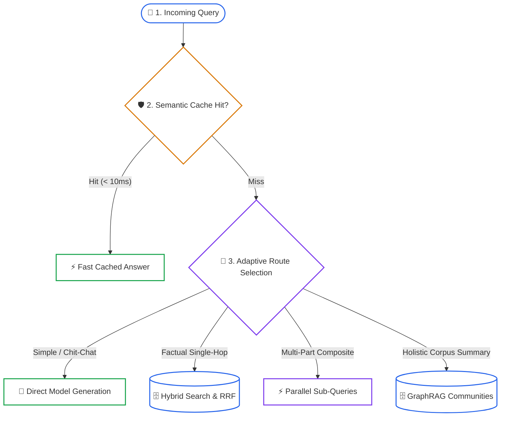
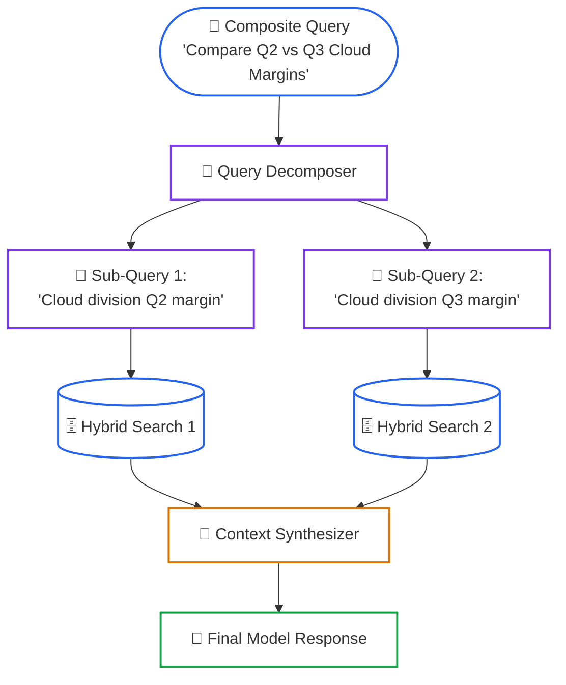
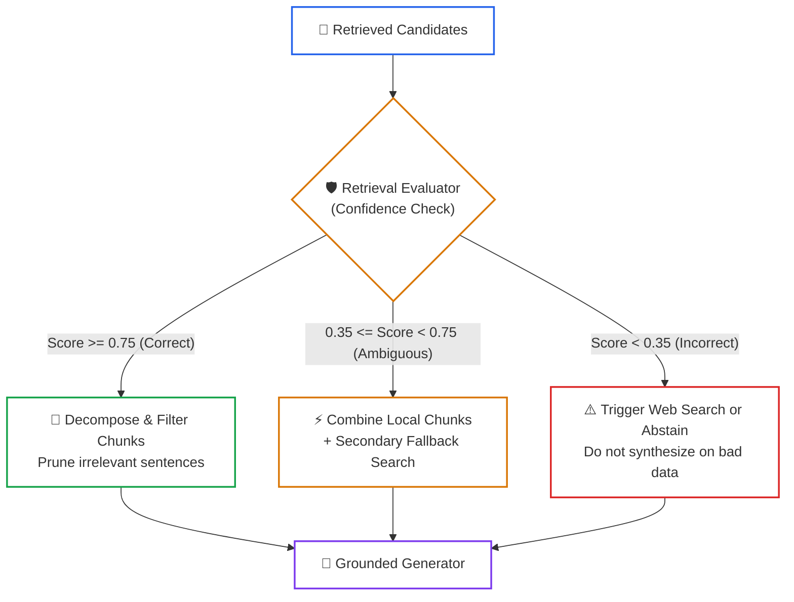

# Lesson 07: Query Planning, Adaptive Routing, and Corrective Retrieval (CRAG)

> **Tier**: `🟡 Engineering Depth` | **Estimated Read Time**: 22 min | **Prerequisites**: [Phase 02 Lesson 04: RRF & Cross-Encoders](./04-reciprocal-rank-fusion-and-cross-encoders.md), [Phase 02 Lesson 05: Predicate Filtering](./05-predicate-filtering-and-acorn.md), [Phase 02 Lesson 06: GraphRAG](./06-graphrag-and-entity-traversal.md)  
> **Core Concept**: Production RAG replaces static linear retrieval with adaptive query routing, multi-question decomposition, and pre-generation confidence evaluators (Corrective RAG) that prune noise or trigger fallback search.  
> **New AI terms introduced**: Query Decomposition, Adaptive Routing, Corrective RAG (CRAG), Self-RAG, Semantic Cache, Sub-Query.  
> **AI terms assumed from earlier lessons**: RAG, Vector Database, Dense Retrieval, BM25, Cross-Encoder, GraphRAG, Token, Cosine Similarity, Prompt Caching.

---

## What You Will Learn

By the end of this lesson, you will be able to:
- Diagnose and eliminate retrieval failures caused by composite, multi-part queries (**Semantic Dilution**).
- Implement an **Adaptive Query Router** that dispatches queries to direct generation, hybrid search, filtered search, or GraphRAG.
- Deconstruct complex comparative queries into independent **Sub-Queries** using automated query decomposition.
- Architect a **Corrective RAG (CRAG)** pipeline with confidence evaluation gates to prune irrelevant text or trigger search fallbacks.
- Design an in-memory **Semantic Cache** that matches incoming query embeddings to cut inference latency and costs.

---

## 1. The Problem: The Static Linear Retrieval Fallacy

Most initial RAG applications follow a single rigid path:
```text
User Query ➔ Embed Query ➔ Search Database ➔ Pass Top Chunks to Model
```

In enterprise environments, this static linear approach breaks down on complex questions:

### 1. The Multi-Part Semantic Dilution Failure
Consider an analyst asking:
> *"Compare the Q3 2024 gross margins of our Cloud and Hardware divisions, and identify the supply chain bottlenecks cited by each leader."*

A standard vector database cannot retrieve clean evidence for this query in one step. The single embedding averages four distinct concepts:
1. Cloud gross margins
2. Hardware gross margins
3. Cloud supply chain bottlenecks
4. Hardware supply chain bottlenecks

The resulting vector represents an average blend. It retrieves high-level overviews while missing the specific tables and operational paragraphs needed for each division.

### 2. The Overkill Latency Waste
Not every prompt requires querying an expensive retrieval pipeline. 
When a user asks: *"What does HTTP 504 mean?"* or *"Draft an email acknowledging this ticket"*, running hybrid search across gigabytes of enterprise documents wastes compute and adds 400 milliseconds of latency.

### 3. The Unchecked Evidence Fallacy
Static RAG pipelines trust that whatever the retriever returns is relevant. If the retriever fetches irrelevant or ambiguous text, the model attempts to synthesize an answer from low-quality context. This behavior produces confident hallucinations.

---

## 2. Systems Mental Model: The Query Planning Dispatcher

Do not send every raw prompt down the same retrieval path. 
Instead, treat your runtime system as a **Query Planning Dispatcher**:



#### Diagram Walkthrough:
1. **Cache Inspection**: The query vector is compared against past queries stored in a semantic cache.
2. **Intent Routing**: If uncached, a lightweight classifier checks if the query requires direct generation, hybrid search, multi-question decomposition, or GraphRAG.
3. **Targeted Dispatch**: The execution engine dispatches the query exclusively to the optimal retrieval mechanism.

> [!NOTE]
> **Where this analogy breaks**: A postal dispatcher routes physical parcels with fixed destinations. A query router generates new synthetic sub-queries on the fly and often combines results from multiple disparate storage systems.

---

## 3. Adaptive Query Routing

**Adaptive Routing** classifies incoming queries to balance speed, cost, and retrieval accuracy:

| Query Intent Category | Typical Query Structure | Optimal Execution Route | Target Latency |
|---|---|---|---|
| **Direct Synthesis** | Common knowledge, formatting, greetings, code syntax. | Skip retrieval; call generator directly. | < 200ms |
| **Single-Hop Factual** | Clear entities, specific error codes, SKU lookups. | Dual-engine Hybrid Search (BM25 + HNSW) with RRF. | < 80ms |
| **Multi-Hop Comparative** | "Compare X vs Y", multi-period quarterly trends. | Query Decomposition into parallel Sub-Queries. | < 250ms |
| **Filtered Security Scope** | Tenant-restricted queries, department policies. | Predicate Filtering via ACORN or PostgreSQL RLS. | < 120ms |
| **Global Thematic** | "What are the common failure patterns across all incidents?" | GraphRAG Community Summaries and Entity Traversal. | < 800ms |

### Routing Mechanics
A production router can be implemented using two architectural patterns:
1. **Lightweight Rule & Keyword Classifier**: Uses regular expressions and exact keyword triggers. It runs in under 1 millisecond with zero API cost.
2. **Small Model Function Classifier**: Uses a fast model (such as Claude 3.5 Haiku as of 2024-10 or Gemini 2.0 Flash as of 2025-01) to output a structured JSON routing decision.

---

## 4. Query Decomposition: Solving Multi-Hop Questions

When a query contains multiple intents, **Query Decomposition** breaks the composite question into independent, atomic **Sub-Queries**:



#### Diagram Walkthrough:
1. **Plan Generation**: The decomposer identifies independent sub-goals within the composite query.
2. **Parallel Dispatch**: Sub-queries execute simultaneously against the underlying search indexes.
3. **Context Harmonization**: Retrieved chunks from each branch are combined and passed to the generator.

---

## 5. Corrective RAG (CRAG) & Self-Reflection

Introduced by Yan et al. (arXiv:2401.15884), **Corrective RAG (CRAG)** adds an automated evaluation step between retrieval and generation:



#### Diagram Walkthrough:
1. **Confidence Grading**: A lightweight evaluator inspects retrieved chunks against the original user query.
2. **Correct Route**: High-confidence chunks are filtered to strip out internal sentence noise.
3. **Ambiguous Route**: Medium-confidence chunks trigger secondary fallback search before synthesis.
4. **Incorrect Route**: Low-confidence results halt generation or trigger external search to avoid hallucination.

### 5.1. Confidence Threshold Actions
- **Correct (`Score >= 0.75`)**: The retrieved text contains clear answers. The system extracts relevant sentences and discards conversational padding.
- **Ambiguous (`0.35 <= Score < 0.75`)**: The retrieved text has partial matches. The system augments local chunks with external search or query expansion.
- **Incorrect (`Score < 0.35`)**: The retriever fetched irrelevant text. The system aborts generation and executes a fallback strategy.

---

## 6. Semantic Caching Mechanics

A **Semantic Cache** stores query embeddings and their verified answers in memory or a fast cache tier (such as Redis):
1. **Incoming Query**: Compute the query vector embedding.
2. **Cosine Lookup**: Compare against all cached query embeddings.
3. **Threshold Gate**: If cosine similarity exceeds `0.92`, return the cached response immediately.
4. **Cache Miss**: On lower similarity, execute the full retrieval pipeline and store the result.

This reduces LLM token consumption and slashes response latency from 1,200 milliseconds to under 15 milliseconds for repeated questions.

---

## 7. Enterprise Production Implementation

The following complete Python 3.12+ script implements adaptive query routing, query decomposition, corrective evaluation, and semantic caching using Pydantic v2 schemas:

```python
from __future__ import annotations

import enum
import math
from typing import Any, Dict, List, Optional
from pydantic import BaseModel, Field


class RoutingDecision(str, enum.Enum):
    DIRECT_SYNTHESIS = "direct_synthesis"
    HYBRID_SEARCH = "hybrid_search"
    PREDICATE_FILTERED = "predicate_filtered"
    GRAPH_RAG_COMMUNITY = "graph_rag_community"


class RetrievalConfidence(str, enum.Enum):
    CORRECT = "correct"
    AMBIGUOUS = "ambiguous"
    INCORRECT = "incorrect"


class SubQuery(BaseModel):
    """An atomic sub-query generated by the query planner."""
    sub_id: str
    target_engine: RoutingDecision
    query_text: str
    metadata_filters: Dict[str, Any] = Field(default_factory=dict)


class QueryPlan(BaseModel):
    """Execution plan containing routed sub-queries."""
    original_query: str
    is_composite: bool
    sub_queries: List[SubQuery] = Field(default_factory=list)


class ChunkEvaluation(BaseModel):
    """Relevance assessment for a retrieved document chunk."""
    chunk_id: str
    confidence_score: float
    decision: RetrievalConfidence
    rationale: str


class SemanticCacheEntry(BaseModel):
    """Stored query embedding and verified answer."""
    query_text: str
    embedding: List[float]
    cached_answer: str


class AdaptiveQueryPlanner:
    """Classifies queries and decomposes complex questions into parallel sub-queries."""

    def route_query(self, query: str) -> RoutingDecision:
        lower = query.lower()
        if any(w in lower for w in ["theme", "across all", "holistic", "summarize"]):
            return RoutingDecision.GRAPH_RAG_COMMUNITY
        if any(w in lower for w in ["tenant:", "confidential", "restricted"]):
            return RoutingDecision.PREDICATE_FILTERED
        if any(w in lower for w in ["hello", "thank you", "who are you"]):
            return RoutingDecision.DIRECT_SYNTHESIS
        return RoutingDecision.HYBRID_SEARCH

    def decompose(self, query: str) -> QueryPlan:
        lower = query.lower()
        plan = QueryPlan(original_query=query, is_composite=False)

        # Detect comparative questions
        if "compare" in lower and " vs " in lower:
            plan.is_composite = True
            parts = query.split(" vs ")
            plan.sub_queries = [
                SubQuery(
                    sub_id="sub_1",
                    target_engine=self.route_query(parts[0]),
                    query_text=parts[0].strip(),
                ),
                SubQuery(
                    sub_id="sub_2",
                    target_engine=self.route_query(parts[1]),
                    query_text=parts[1].strip(),
                ),
            ]
        else:
            plan.sub_queries = [
                SubQuery(
                    sub_id="sub_1",
                    target_engine=self.route_query(query),
                    query_text=query,
                )
            ]
        return plan


class CorrectiveEvaluator:
    """Implements CRAG quality gating over retrieved chunks."""

    def __init__(self, high_threshold: float = 0.70, low_threshold: float = 0.30):
        self.high_threshold = high_threshold
        self.low_threshold = low_threshold

    def evaluate_chunk(self, query: str, chunk_id: str, text: str) -> ChunkEvaluation:
        # Heuristic term overlap proxy for offline testing
        query_words = set(query.lower().split())
        text_words = set(text.lower().split())
        overlap = len(query_words & text_words)
        score = min(1.0, overlap / max(1, len(query_words)))

        if score >= self.high_threshold:
            decision = RetrievalConfidence.CORRECT
            rationale = "Retrieved text contains strong term overlap."
        elif score >= self.low_threshold:
            decision = RetrievalConfidence.AMBIGUOUS
            rationale = "Retrieved text contains partial signals; refine content."
        else:
            decision = RetrievalConfidence.INCORRECT
            rationale = "Retrieved text lacks required keywords; fallback needed."

        return ChunkEvaluation(
            chunk_id=chunk_id,
            confidence_score=round(score, 2),
            decision=decision,
            rationale=rationale,
        )


class SemanticCache:
    """Cosine similarity cache for fast retrieval bypass."""

    def __init__(self, similarity_threshold: float = 0.90):
        self.threshold = similarity_threshold
        self.cache: List[SemanticCacheEntry] = []

    def _cosine_similarity(self, a: List[float], b: List[float]) -> float:
        dot = sum(x * y for x, y in zip(a, b))
        norm_a = math.sqrt(sum(x * x for x in a))
        norm_b = math.sqrt(sum(y * y for y in b))
        if norm_a == 0.0 or norm_b == 0.0:
            return 0.0
        return dot / (norm_a * norm_b)

    def lookup(self, query_vector: List[float]) -> Optional[str]:
        best_score = 0.0
        best_entry: Optional[SemanticCacheEntry] = None

        for entry in self.cache:
            sim = self._cosine_similarity(query_vector, entry.embedding)
            if sim > best_score:
                best_score = sim
                best_entry = entry

        if best_entry and best_score >= self.threshold:
            return best_entry.cached_answer
        return None

    def store(self, query_text: str, vector: List[float], answer: str) -> None:
        self.cache.append(SemanticCacheEntry(
            query_text=query_text,
            embedding=vector,
            cached_answer=answer,
        ))


# =====================================================================
# Verification & Execution Demonstration
# =====================================================================
if __name__ == "__main__":
    planner = AdaptiveQueryPlanner()
    evaluator = CorrectiveEvaluator()
    cache = SemanticCache()

    # 1. Test Semantic Cache
    mock_vec_1 = [0.1, 0.8, 0.3]
    mock_vec_near = [0.12, 0.79, 0.31]
    cache.store("reset password", mock_vec_1, "Go to Settings -> Security -> Reset Password.")
    hit = cache.lookup(mock_vec_near)
    print(f"Cache Lookup Result: {hit}")

    # 2. Test Adaptive Planning & Decomposition
    query = "Compare Acme Q2 Cloud Margins vs Acme Q3 Hardware Margins"
    plan = planner.decompose(query)
    print(f"\nDecomposed Plan for '{query}':")
    for sq in plan.sub_queries:
        print(f"  [{sq.sub_id}] Target: {sq.target_engine.value} | Text: '{sq.query_text}'")

    # 3. Test Corrective Evaluator
    eval_result = evaluator.evaluate_chunk(
        query="Acme Q2 Cloud Margins",
        chunk_id="chk_901",
        text="Acme Q2 Cloud Margins reached 24.2 percent according to financial filings.",
    )
    print(f"\nCRAG Evaluation for Chunk '{eval_result.chunk_id}':")
    print(f"  Confidence: {eval_result.confidence_score} ({eval_result.decision.value})")
    print(f"  Action: {eval_result.rationale}")
```

---

## 8. Architectural Trade-Off Analysis

| Retrieval Architecture Pattern | Latency (P95) | Infrastructure Cost | Multi-Hop Accuracy | Failure Recovery |
|---|---|---|---|---|
| **Static Naive RAG** | Low (50–150ms) | Low (Single vector query) | Poor (Severe semantic dilution) | None (Hallucinates on bad chunks) |
| **Adaptive Routing** | Low (20–120ms) | Low to Medium | Good on single intents | Fast bypass on simple queries |
| **Query Decomposition** | Medium (150–350ms) | Medium (N parallel queries) | High (Isolates separate targets) | High precision across entities |
| **Full Corrective RAG (CRAG)**| Medium to High (250–600ms)| Higher (Evaluator call per chunk)| Highest (Guaranteed quality gate) | Triggers web search or abstention |

---

## 9. Common Production Failure Modes & Anti-Patterns

### 1. The Sub-Query Combinatorial Explosion
- **The Failure**: An unconstrained decomposer splits a user question into 12 micro-queries. Each micro-query triggers hybrid search and reranking, exhausting connection pools and causing latency spikes.
- **Architectural Remedy**: Impose a hard ceiling on decomposition (maximum 3 to 4 sub-queries). If a query requires more than 4 steps, route it to an asynchronous agentic workflow in Phase 04.

### 2. Evaluator Self-Justification Bias
- **The Failure**: Using the same foundation model for retrieval, chunk evaluation, and generation. The model marks its own retrieved chunks as high confidence even when they contain hallucinations.
- **Architectural Remedy**: Use an independent, smaller model (such as a fine-tuned classifier or cross-encoder) to evaluate chunks before passing them to the generator.

### 3. Semantic Cache Stale Invalidation
- **The Failure**: A document is updated in the database, but the semantic cache continues serving responses based on outdated chunks.
- **Architectural Remedy**: Assign a Time-to-Live (TTL) to semantic cache entries, and invalidate cached query entries when document change events occur.

---

## 10. Quick Check to See if it Clicked

> **Scenario**: A user submits this prompt:
> *"What were our total warranty claims in Q1 2024, and did our supplier contract with Titan Steel require them to reimburse shipping costs for defective parts?"*
>
> If this prompt is passed directly to a single vector search, why is it likely to fail, and how does query decomposition resolve it?

<details>
<summary><b>View Solution</b></summary>

1. **Why Single Vector Search Fails**:
   The prompt combines two completely separate information targets:
   - A numerical accounting figure from a quarterly financial filing (Warranty claims).
   - A legal indemnification clause from an operational vendor agreement (Titan Steel contract).
   A single embedding blurs these two topics together. It will likely retrieve general warranty overviews or general Titan Steel notices, missing the specific financial tables and legal clauses.

2. **How Query Decomposition Resolves It**:
   The planner detects the conjunction and splits the query into two atomic sub-queries:
   - `Sub-Query 1`: *"Total warranty claims Q1 2024"* (Routed to financial filings index).
   - `Sub-Query 2`: *"Titan Steel supplier contract defective parts shipping reimbursement"* (Routed to legal contracts index).
   Both queries execute in parallel, gathering verified evidence from distinct sources before synthesis.
</details>

---

## 11. Key Takeaways & Verified Resources

### Key Takeaways
1. **Never Assume One Pipeline Fits All**: Use adaptive routing to bypass retrieval for simple questions and save compute.
2. **Decompose Multi-Part Questions**: Break composite queries into atomic sub-queries to prevent semantic dilution in vector space.
3. **Verify Evidence Before Generation**: Implement Corrective RAG (CRAG) quality gates to filter ambiguous text or trigger fallback search.
4. **Leverage Semantic Caching**: Store query embeddings to return instant cached answers for repetitive organizational questions.

### Primary References
- **[Corrective Retrieval Augmented Generation (CRAG)](https://arxiv.org/abs/2401.15884)** (Yan et al., 2024): Foundational paper introducing retrieval confidence evaluators and corrective action loops.
- **[Self-RAG: Learning to Retrieve, Generate, and Critique through Self-Reflection](https://arxiv.org/abs/2310.11511)** (Asai et al., ICLR 2024): Reflection tokens for dynamic retrieval and answer verification.

---

## 🧭 Navigation

- **[← Lesson 06: Graph Retrieval-Augmented Generation (GraphRAG)](./06-graphrag-and-entity-traversal.md)**
- **[Phase 02 Hub: Overview & Architecture Directory](./README.md)**
- **[Platform Appendix: Enterprise Cloud Retrieval Architectures](./reference/cloud-retrieval-architectures.md)**
- **[Capstone Lab: Enterprise Multi-Tenant Hybrid RAG](./labs/capstone-enterprise-rag-pipeline.md)**
