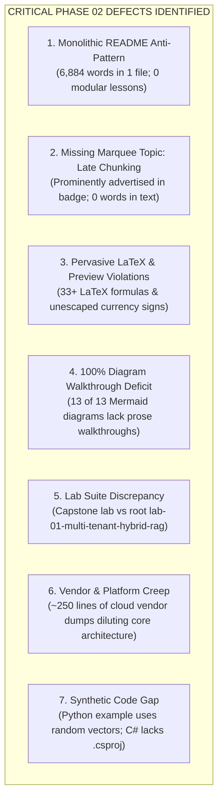
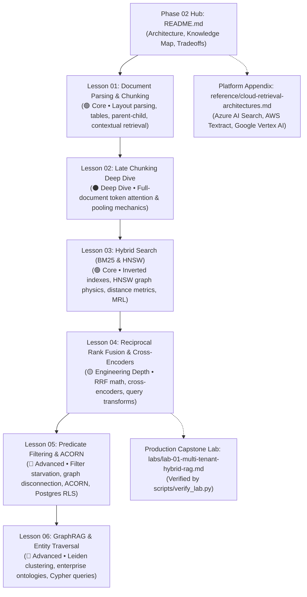

# Phase 02: Enterprise Retrieval & Knowledge Systems — Deep Curriculum Audit Report

> **Execution Mode**: AUDIT MODE (Read-Only Inspection)  
> **Auditor**: AI Curriculum Architect  
> **Target Scope**: `02-*` (`02-rag-and-knowledge-systems/`)  
> **Baseline References**: `CURRICULUM_AUDIT.md`, `CURRICULUM_REFACTORING_PLAN.md`, `01-prompt-and-context-engineering/PHASE_1_AUDIT.md`, and the `ai-curriculum-refactoring` skill standards.  
> **Target Learner**: Senior Developers, Staff Software Engineers, and Solutions Architects (7–10+ years experience) transitioning to AI Systems Engineering.  
> **Rule Compliance**: Read-only inspection. No existing curriculum lessons, labs, or code files have been modified.

---

## 1. Executive Summary & Repository Context

A comprehensive architectural and pedagogical audit of **Phase 02 (`02-rag-and-knowledge-systems`)** was executed under **AUDIT MODE**. In strict compliance with curriculum audit protocols, no curriculum content, labs, or code examples were modified during this inspection.

### 1.1. Exact Directory Identification
The canonical Phase 2 directory within the repository structure is:
`c:\Repos\Ai_Native_Engineer\02-rag-and-knowledge-systems\`

### 1.2. Complete Inventory of Audited Artifacts
The audit inspected every artifact residing within Phase 02 and its direct ecosystem touchpoints:
1. **Primary Courseware**: `02-rag-and-knowledge-systems/README.md` (860 lines, 6,884 words, 58,311 bytes).
2. **Phase Capstone Lab**: `02-rag-and-knowledge-systems/labs/capstone-enterprise-rag-pipeline.md` (46 lines, 3,211 bytes).
3. **Reference Implementations**:
   - `02-rag-and-knowledge-systems/examples/hybrid_rag_pipeline.py` (268 lines, Python 3.11+, BM25 + dense cosine + RRF + Cohere rerank).
   - `02-rag-and-knowledge-systems/examples/HybridSearchService.cs` (141 lines, C# / .NET 9, Azure AI Search + Semantic Kernel).
   - `02-rag-and-knowledge-systems/examples/README.md` (11 lines, overview index).
4. **Cross-Repository Alignment Touchpoints**:
   - `labs/lab-01-multi-tenant-hybrid-rag.md` (Root lab suite counterpart covering Multi-Tenant Hybrid RAG).
   - `agent-forge/agent_forge/retrieval/` (`bm25.py`, `embeddings.py`, `hybrid_engine.py`, `vector_store.py`).
   - `scripts/verify_lab.py` (Automated evaluation test runner for Lab 1).
   - `architecture/adrs/ADR-001-pgvector-vs-dedicated-vector-database.md`.

### 1.3. High-Level Audit Verdict: Monolithic Architecture with World-Class Engineering Substance
Phase 02 exhibits exceptional systems engineering intuitions. It rejects "naive RAG" (blind character slicing, single-pass dense vector search, and ungrounded generation) and grounds retrieval in authentic information retrieval (IR) physics:
- Decoupling non-parametric storage from probabilistic parametric weights.
- Unifying lexical precision (BM25) and semantic recall (HNSW) via rank-harmonic fusion (Reciprocal Rank Fusion, `k=60`).
- Two-stage pipelines with deep cross-attention reranking (Cross-Encoders).
- Query-time access control list (ACL) filtering to prevent multi-tenant information leakage and filter starvation.
- Symbolic enterprise knowledge representation via formal ontologies (UNSPSC, MDM) to constrain multi-hop graph traversals.

However, Phase 02 suffers from **seven severe architectural, pedagogical, and structural defects**:



#### Diagram Walkthrough:
1. **Monolithic README Anti-Pattern**: All 11 major topics, 13 diagrams, 2 code blocks, and 5 tradeoff tables are compressed into a single 860-line file, severely violating the 3,500-word cognitive load budget.
2. **Missing Marquee Topic (CRIT-03)**: Late Chunking is prominently advertised in the phase metadata badge on line 52, yet the term never appears again anywhere in the document.
3. **Pervasive LaTeX Violations (CRIT-02 / Gate 13)**: Over 33 raw LaTeX occurrences (`$$...$$`, `$...$`, `\text`, `\sum`, `\cos`, `\mathbb{R}^d`) break standard Markdown preview engines.
4. **Diagram Walkthrough Deficit (IMP-01 / Gate 07)**: Every single Mermaid diagram (13 out of 13) lacks an accompanying numbered step-by-step prose explanation.
5. **Lab Suite Discrepancy (CRIT-04)**: The phase contains its own internal capstone lab, while the root repository has `labs/lab-01-multi-tenant-hybrid-rag.md` wired to `agent-forge` and `verify_lab.py`.
6. **Vendor Platform Creep**: Detailed setup for Azure AI Search, AWS Textract, and Google Vertex AI Grounding is interleaved with core vendor-neutral algorithms.
7. **Synthetic Code Gap**: The Python reference script uses `np.random.randn(128)` for vectors instead of real embeddings, generating random retrieval outputs, while the C# service lacks a `.csproj` to compile.

---

## 2. Learning Analysis

### 2.1. Learning Objectives
- **Current State**: The monolithic README opens with a generic subtitle (*"A comprehensive architectural handbook for Lead Developers, Solutions Architects, and AI Engineers..."*) and an executive summary. There are no outcome-oriented, behavioral learning objectives declared at the top of the phase or per topic.
- **Defect**: The learner is not given explicit engineering contracts (e.g. *"By the end of this module, you will be able to construct a two-stage hybrid retrieval engine fusing BM25 and HNSW via RRF, implement layout-aware document ingestion and late chunking, enforce query-time RBAC metadata pre-filtering without graph disconnection or filter starvation, and design an ontologically-constrained knowledge graph for multi-hop reasoning"*).
- **Remediation**: Each refactored modular lesson must open with a concise, outcome-oriented **"What You Will Learn"** section adhering to the golden lesson standard.

### 2.2. Prerequisite Knowledge & Gaps
- **Current State**: Phase 02 contains no `Prerequisites & Knowledge Map` section. It operates as an isolated silo.
- **Missing Prerequisite Bridges**:
  1. *Connection to Phase 00 (Foundations & Token Mechanics)*:
     - Section 3.2 mentions token chunk sizes (e.g., 500 tokens), but fails to connect to BPE tokenization (`00/02-tokenization-and-bpe-mechanics.md`). Learners are not reminded why token counts do not equal character counts, leading to chunk truncation.
     - Section 3.3 introduces vector embeddings without grounding them in the dense latent space representations established in Phase 00 transformer physics.
  2. *Connection to Phase 01 (Prompt & Context Engineering)*:
     - Section 2 (Line 175) and Section 6.1 (Line 727) discuss the "Lost in the Middle" phenomenon and context budgeting, but do not reference the deep analysis of Maximal Effective Context Window (MECW) and U-shaped attention curves established in `01/05-mecw-and-context-rot.md`.
     - Section 6.3 discusses wrapping retrieved chunks in XML tags (`<context_document id="...">`), but fails to link back to the typed Context Abstract Syntax Tree (AST) compiled in `01/01-context-ast-architecture.md`.
  3. *Downstream Bridges to Phase 03 & Phase 04*:
     - Active retrieval patterns (CRAG and Self-RAG in Section 3.7) require dynamic branching and external API calls (e.g. web search fallback). The text does not explain that this is an early agentic loop that will be formalized in Phase 03 (MCP tools) and Phase 04 (Stateful ReAct orchestration).

### 2.3. Conceptual Progression & Cognitive Inversions
The current sequential layout inside `02-rag-and-knowledge-systems/README.md` forces severe cognitive friction:

```text
Current Monolith Sequence:
Sec 1: Executive Summary & Naive RAG Fallacy
  → Sec 2: Why This Matters (Hallucination, Fine-Tuning vs RAG, RBAC, Context Noise, Exact Match)
  → Sec 3.1: Ingestion, Extraction & Document Parsing
  → Sec 3.2: Chunking Strategies (Fixed, Recursive, Semantic, Hierarchical)
  → Sec 3.3: Embeddings & Vector Representations (Dense, Sparse, ColBERT, Distance Metrics)
  → Sec 3.4: Vector Indexing & Storage Engine Architecture (HNSW, ACORN, DiskANN)
  → Sec 3.5: Advanced Multi-Stage Retrieval (RRF, Cross-Encoders)
  → Sec 3.6: Query Transformation (Rewriting, HyDE, Sub-Query, Step-Back)
  → Sec 3.7: Advanced RAG Architectures (CRAG, Self-RAG, GraphRAG)
  → Sec 3.8: Enterprise Ontological RAG & GraphRAG (UNSPSC, Cypher)
  → Sec 3.9: Cloud Retrieval Architecture (Azure AI Search)
  → Sec 3.10: Enterprise Document Parsing (Azure Doc Intelligence vs AWS Textract)
  → Sec 3.11: Enterprise Cloud Grounding Platforms (Vertex AI, Azure AI Search)
  → Sec 4: System Architecture & Visual Flows (Hybrid RAG, CRAG)
  → Sec 5: Comparative Analysis & Tradeoff Matrices (Paradigms, Vector DBs)
  → Sec 6: Production Failure Modes & Anti-Patterns (Lost in middle, CDC, Poisoning, ACL pruning)
  → Sec 7: Enterprise Production Code Implementations (Python, C#)
  → Sec 8: Curated Resources
  → Sec 9: Capstone Engineering Challenge
```

**Cognitive Inversions & Structural Disconnects Identified**:
1. **Document Parsing Fragmented Across 350 Lines**: Document parsing theory is introduced in Section 3.1 (lines 190–216), but concrete parsing engines (Azure Document Intelligence vs AWS Textract) are delayed until Section 3.10 (lines 540–595), separated by over 320 lines of embedding geometry, graph traversal, and reranking theory!
2. **Theory Disconnected from Code and Failure Modes**: All theoretical mechanics are dumped in Section 3 (lines 190–608), while their associated architecture diagrams are delayed to Section 4, tradeoff tables to Section 5, failure modes to Section 6, and code to Section 7. A learner reading about RRF in Section 3.5 has to scroll down 470 lines to find the code in Section 7.1, and 400 lines to find the failure modes.
3. **GraphRAG Introduced Before Index Filtering**: Ontological GraphRAG (Section 3.8) is taught *before* cloud retrieval architectures, parser comparisons, and core failure modes, creating an uneven difficulty spike in the middle of the document.
4. **Missing Marquee Anchor**: Late Chunking is promised as a core innovation in the metadata badge (line 52) but never taught anywhere in the progression.

### 2.4. Mental Models Evaluation
- **Strengths**:
  - *Non-Parametric vs. Parametric Memory (Lines 137–142)*: Framing RAG as an "open-book exam" where non-parametric external memory grounds lossy probabilistic neural weights is a compelling, durable mental model.
  - *Fine-Tuning vs. RAG Matrix (Lines 149–159)*: The rule of thumb (*"Fine-tuning teaches style/behavior; RAG teaches facts/knowledge"*) immediately resolves executive and architectural confusion.
  - *Asymmetric Information Retrieval (Lines 114–130)*: Treating RAG as decoupled, asymmetric stages (Ingest → Lexical/Semantic Retrieve → Fuse → Rerank → Generate) anchors the engineering discipline.
- **Weaknesses & Gaps**:
  - *Missing Late Chunking Mental Model*: Fails to explain the core intuition: standard chunking is "chunk first, embed second" (contextually blind), whereas Late Chunking is "embed first, chunk second" (contextually aware via full-document self-attention).
  - *Missing Inverted Index vs. Metric Space Spatial Graph Mental Model*: Fails to provide senior developers with a direct systems comparison between Lucene inverted index postings lists (`term → [doc_id, doc_id]`) and metric-space proximity graphs (HNSW skip-list routing).
  - *Missing Predicate Filtering Topology Model*: Lacks an intuitive visual mental model explaining why naive pre-filtering fractures graphs into isolated islands while naive post-filtering causes filter starvation.

### 2.5. Explanation Quality & Pacing
- The conceptual prose is highly authoritative and speaks directly to senior systems architects.
- Pacing is severely compromised by interleaving high-level algorithms (RRF, ColBERT, HNSW) with proprietary cloud vendor API parameters (Azure AI Search OData syntax, Textract `KEY_VALUE_SET` blocks).
- Because theory, diagrams, tradeoffs, failure modes, and code are segregated into rigid top-level chapters, individual topics lack holistic encapsulation.

### 2.6. Target Lesson Ordering & Modular Architecture
To resolve cognitive load issues and establish a logical progression, the monolithic README must be decomposed into **6 modular lessons** anchored by an **Orientation Hub (`README.md`)**:

```text
Recommended Phase 02 Modular Architecture:
├── README.md                                      (Phase Hub, Knowledge Map, Prerequisites)
├── 01-document-parsing-and-chunking.md            (🟢 Core: Layout parsing, tables, parent-child, contextual retrieval)
├── 02-late-chunking-deep-dive.md                  (⚫ Deep Dive: Long-context attention, token pooling, implementation)
├── 03-hybrid-search-bm25-and-hnsw.md              (🟢 Core: Inverted indexes, HNSW skip lists, distance metrics, MRL)
├── 04-reciprocal-rank-fusion-and-cross-encoders.md (🟡 Engineering Depth: RRF rank math, cross-encoders, query transforms)
├── 05-predicate-filtering-and-acorn.md            (🔵 Advanced: Pre/post filtering failure, ACORN, Postgres RLS, multi-tenancy)
├── 06-graphrag-and-entity-traversal.md            (🔵 Advanced: Leiden community detection, formal ontologies, Cypher)
└── reference/
    └── cloud-retrieval-architectures.md           (Platform Appendix: Azure AI Search, AWS Textract, Doc Intelligence)
```

---

## 3. Content Analysis

### 3.1. Unnecessary Verbosity & Cognitive Overload
- **Monolithic Scale**: At 6,884 words, the README is almost double the 3,500-word ceiling for a single technical document.
- **Cloud Vendor Intrusion**: Sections 3.9, 3.10, and 3.11 occupy ~250 lines detailing vendor-specific schemas (Azure OData filters, AWS Textract block relationships, Vertex AI Search). While valuable for cloud practitioners, embedding them in the primary conceptual guide dilutes the durable systems principles. They belong in a dedicated reference appendix.
- **Repetitive Framing**: The failure of naive RAG is stated in Section 1 (Table & text), re-stated in Section 1.1 (Mermaid diagram), re-stated in Section 2 (Bullet points), and re-stated in Section 6.

### 3.2. Missing Concepts
1. **CRITICAL DEFECT (CRIT-03) — Late Chunking Deep Dive**:
   - Advertised in the phase header badge (Line 52) as a core primitive, but completely omitted from the curriculum body!
   - Must cover: The mathematical and architectural mechanics of feeding an entire document (e.g. up to 8,192 tokens) through a long-context transformer encoder (e.g. `jina-embeddings-v3`), computing token-level contextual representations where tokens attend across paragraph boundaries, and subsequently mean-pooling the token vectors within defined chunk boundaries. Include runnable Python implementation comparing cosine similarity with naive chunking.
2. **Anthropic Contextual Retrieval**:
   - Linked as an external URL (Line 835) but never taught in the courseware.
   - Must teach: The production pattern of prepending a 50–100 token model-generated context summary to every chunk before embedding and indexing, drastically reducing retrieval failure rates on underspecified chunks.
3. **RAM & Storage Footprint Physics for Vector Databases**:
   - Section 3.4 explains HNSW parameters (`M`, `efConstruction`), but provides zero engineering formulas for calculating index memory requirements:
     ```text
     RAM_Per_Vector ≈ (dimensions × 4 bytes [FP32]) + (M × 2 × 8 bytes [links]) + overhead
     For 1,000,000 vectors at 1536 dims (M=32):
     Vector RAM ≈ 1M × 6,144 bytes = 6.14 GB
     Graph RAM  ≈ 1M × 512 bytes   = 0.51 GB
     Total Memory ≈ 6.65 GB to 8.0 GB resident DRAM
     ```
   - Must show how Scalar Quantization (SQ8) and Product Quantization (PQ) reduce this footprint by 4x–8x at the cost of slight recall degradation.
4. **Information Retrieval (IR) Evaluation Metrics**:
   - Section 1 mentions `P(Retrieval Recall @ K) × P(Rerank Precision @ N)`, but the curriculum never formally defines standard IR evaluation metrics:
     - Mean Reciprocal Rank (MRR@K)
     - Normalized Discounted Cumulative Gain (NDCG@K)
     - Hit Rate @ K
     - Mean Average Precision (MAP)
5. **ColPali & Vision-Language Document Retrieval**:
   - Modern enterprise document retrieval (2024–2026) increasingly bypasses brittle OCR pipelines using Vision-Language Models (ColPali, PaliGemma) that embed document page images directly into multi-vector patch spaces. This paradigm shift should be noted in document parsing.

### 3.3. Duplicated Concepts
- **"Lost in the Middle"**: Explained in Section 2 (Lines 175–176) and re-explained in Section 6.1 (Lines 727–735). Also covered extensively in Phase 01 Lesson 05.
- **Multi-Tenant ACL & RBAC Filtering**: Introduced in Section 2 (Lines 160–167), re-introduced in Section 3.4 (Lines 285–293, ACORN), re-introduced in Section 3.9 (Lines 517–536, Azure OData), and re-introduced in Section 6.4 (Lines 767–783).
- **Hybrid Retrieval Architecture**: Described conceptually in Section 1 (Table), Section 3.5 (Text), Section 4.1 (Diagram), Section 5.1 (Table), and Section 7.1 (Code).

### 3.4. Concepts That Belong in Later Phases
1. **Context Poisoning & Adversarial Chunks (Section 6.3, Lines 749–765)**:
   - *Audit Finding*: Discusses prompt injection embedded in retrieved chunks, system prompt anchoring, and semantic firewall anomaly detection.
   - *Remediation*: **MOVE** deep threat models, jailbreak signatures, and dual-LLM quarantine to **Phase 05 (`05-ai-security-and-guardrails`)**. In Phase 02, retain only the baseline operational rule: treat retrieved context as untrusted data using explicit XML delimiter encapsulation.
2. **Active Retrieval Routing & Agentic Reasoning Loops (Section 3.7, Lines 355–381)**:
   - *Audit Finding*: Corrective RAG (CRAG) and Self-RAG evaluate retrieved documents and dynamically trigger external web search APIs or query rewrites. This is an agentic loop.
   - *Remediation*: **FRAME AS RETRIEVAL GATES & BRIDGE TO PHASE 04**. In Phase 02, teach the deterministic decision tree and confidence scoring thresholds; explicitly note that the autonomous orchestration, tool invocation, and state machine transitions belong in Phase 04 (`04-agentic-systems-and-orchestration`).

### 3.5. Advanced Material Introduced Too Early
- **ACORN Graph Mechanics (Section 3.4, Lines 285–293)**:
  - Introducing `ACORN-\gamma` densified graphs with $\gamma \cdot M$ edges per node in the middle of a general vector indexing section causes cognitive whiplash before the learner understands the basic failure of SQL `WHERE` clauses combined with ANN search. ACORN should be the centerpiece of dedicated Lesson 05.
- **Ontological GraphRAG (Section 3.8, Lines 383–459)**:
  - Deep UNSPSC taxonomy hierarchies and Cypher query pruning are presented before the learner has mastered hybrid search, reranking, and vector metadata filtering.

### 3.6. Shallow Explanations
- **ColBERT / Late Interaction (Lines 254–260)**:
  - The MaxSim formula is presented in raw LaTeX, but there is no visual diagram or step-by-step trace showing the query-token by document-token cosine similarity matrix and how the column-wise maximums are summed.
- **DiskANN & Vamana Graphs (Lines 294–298)**:
  - Stating in 4 lines that DiskANN uses `io_uring` and NVMe SSDs provides zero engineering intuition on why Vamana graph construction allows random-access disk reads without thrashing the OS page cache.
- **Matryoshka Representation Learning (MRL, Line 247)**:
  - Explains dimension slicing (3072 to 512) but omits the training physics: multi-granularity loss functions that force information density into the earliest vector dimensions.
- **Query Transformations (Lines 339–352)**:
  - Lists HyDE, Step-Back, and Sub-Query in a disconnected flowchart box without concrete prompt templates, latency costs (requiring an extra LLM call), or failure modes (e.g. HyDE hallucinating fake entities that hijack vector retrieval).

### 3.7. Overly Detailed Implementation Material
- **C# Semantic Kernel & Azure AI Search Boilerplate (`HybridSearchService.cs`)**:
  - The C# implementation contains repetitive configuration and object mapping that obscures the core hybrid query options. It lacks a `.csproj` project file, rendering it uncompilable in CI.
- **In-Memory BM25 from Scratch (`hybrid_rag_pipeline.py`, Lines 35–97)**:
  - While educational, having 62 lines of custom TF-IDF/BM25 tokenization and scoring inside a hybrid RAG script diverts focus from the primary production pattern: fusing dense and sparse candidate sets via RRF and invoking a Cross-Encoder.

---

## 4. Terminology Analysis

### 4.1. Unexplained AI Terminology
- **"Matryoshka Representation Learning (MRL)" (Line 247)**: Used without explaining why arbitrary vector truncation works only for models trained with nested dimension loss.
- **"Non-parametric memory" (Line 137)**: Used without defining the term against neural network weights for software engineers unfamiliar with machine learning taxonomy.
- **"Bi-Encoder" (Line 333)**: Contrasted with Cross-Encoders without explaining that standard embedding models (e.g. OpenAI `text-embedding-3`, Voyage, BERT encoders) are bi-encoders.
- **"Leiden community detection" (Line 377)**: Mentioned in GraphRAG without explaining that it is a modularity-maximization graph clustering algorithm that groups densely connected entities.
- **"Extractive Captions" (Line 498)**: Azure-specific proprietary terminology introduced without explaining that it refers to highlighted text spans with character offsets.

### 4.2. Unexplained Abbreviations
The following acronyms appear across Phase 02 without expansion on first use:

| Acronym | File Location | Definition / Expansion Required | Pedagogical Context |
|---|---|---|---|
| **ACORN** | README.md:285 | Accelerated Correlation-Aware Predicate-Filtered Vector Search | Graph-based filtered vector search algorithm (SIGMOD 2024). |
| **MRL** | README.md:247 | Matryoshka Representation Learning | Technique enabling vector truncation while preserving similarity. |
| **ANN** | README.md:273 | Approximate Nearest Neighbor | Algorithmic family bypassing exhaustive O(N) linear vector scans. |
| **HNSW** | README.md:22 | Hierarchical Navigable Small World | Multi-layer graph data structure for low-latency vector search. |
| **RRF** | README.md:22 | Reciprocal Rank Fusion | Rank-based score fusion algorithm for merging disparate search lists. |
| **CRAG** | README.md:26 | Corrective Retrieval-Augmented Generation | Retrieval pattern with automated quality grading and fallback. |
| **HyDE** | README.md:26 | Hypothetical Document Embeddings | Query transformation technique generating hypothetical answers. |
| **MDM** | README.md:397 | Master Data Management | Enterprise discipline and systems maintaining core business entity definitions. |
| **UNSPSC** | README.md:397 | United Nations Standard Products and Services Code | Global hierarchical 8-digit taxonomy for products and services. |
| **MRR** | README.md:792 | Mean Reciprocal Rank | Information retrieval benchmark metric evaluating top result position. |
| **SPLADE** | README.md:94 | Sparse Lexical and Expansion Model | Neural sparse retrieval model predicting vocabulary expansion weights. |
| **PQ / SQ** | README.md:296 | Product Quantization / Scalar Quantization | Compression techniques reducing vector dimensionality and bit depth. |
| **CDC** | README.md:18 | Change Data Capture | Software design pattern tracking and capturing database mutations. |

### 4.3. Terminology Introduced Without Context
- **"Vamana Graph" (Line 296)**: Mentioned under DiskANN without explaining how its degree bounds and long-range α-pruning differ from standard HNSW layers.
- **"SPLADE" (Line 94)**: Used in the Naive RAG comparison table 150 lines before it is defined as a learned sparse model in Section 3.3.2.
- **"OData Filter" (Line 473)**: Introduced in the Azure AI Search architecture diagram without defining what OData expression syntax is.

### 4.4. Inconsistent Terminology
- **Retrieval Engine Layering**: Alternating use of "Two-Stage Retrieval", "Multi-Stage Retrieval", and "Hybrid Semantic Fusion" without establishing a clear taxonomy.
- **Chunk Linking Patterns**: "Parent-Child Chunking", "Hierarchical Chunking", and "Small-to-Big Retrieval" are used interchangeably across sections without explicitly noting they describe the same architectural pattern.
- **Graph RAG Nomenclature**: "GraphRAG", "Knowledge Graph RAG", and "Ontological RAG" are blended without clarifying that Ontological RAG is a constrained subset of GraphRAG.

---

## 5. Diagrams Analysis

### 5.1. Diagram Inventory & Walkthrough Deficit
There are **13 Mermaid diagrams** in `02-rag-and-knowledge-systems/README.md`. Exactly **13 of 13 diagrams (100%) lack an accompanying numbered step-by-step prose walkthrough**, severely violating Quality Gate 07 and skill guidelines.

```mermaid
flowchart TD
    D1["Diag 1: Line 7 (Overview Landscape)"] -->|No Walkthrough| F1["Violates Gate 07"]
    D2["Diag 2: Line 101 (Naive RAG Failures)"] -->|No Walkthrough| F1
    D3["Diag 3: Line 118 (Formula Box)"] -->|Misused Flowchart| F2["Unnecessary Box Diagram"]
    D4["Diag 4: Line 194 (Ingestion Tree)"] -->|No Walkthrough| F1
    D5["Diag 5: Line 222 (Chunking Boxes)"] -->|Disconnected Nodes| F2
    D6["Diag 6: Line 305 (Multi-Stage Retrieval)"] -->|No Walkthrough| F1
    D7["Diag 7: Line 343 (Query Transform Boxes)"] -->|Disconnected Nodes| F2
    D8["Diag 8: Line 389 (Ontological RAG)"] -->|No Walkthrough| F1
    D9["Diag 9: Line 465 (Azure AI Search)"] -->|No Walkthrough| F1
    D10["Diag 10: Line 546 (Doc Parsing Pipeline)"] -->|No Walkthrough| F1
    D11["Diag 11: Line 599 (Cloud Grounding Boxes)"] -->|Disconnected Nodes| F2
    D12["Diag 12: Line 613 (Full Hybrid Architecture)"] -->|No Walkthrough| F1
    D13["Diag 13: Line 654 (CRAG Decision Flow)"] -->|No Walkthrough| F1
```



#### Diagram Walkthrough:
1. **Gate 07 Violations**: Diagrams 1, 2, 4, 6, 8, 9, 10, 12, and 13 represent valid systems topologies but fail because they provide zero numbered prose breakdown explaining what occurs at each boundary.
2. **Unnecessary Box Diagrams**: Diagrams 3, 5, 7, and 11 misuse Mermaid flowcharts to render isolated text boxes or single formulas with zero directional flow.

### 5.2. Unnecessary & Disconnected Box Diagrams
- **Diagram 3 (Line 118)**: Flowchart containing a single node with an equation: `Eq["System Quality = P(Retrieval Recall @ K) × ..."]`. A Mermaid flowchart is not an equation renderer. This should be formatted as clean text in a code block.
- **Diagram 5 (Line 222)**: A subgraph labeled `CHUNKING METHODOLOGIES` containing 4 completely disconnected nodes (`Fixed`, `Recursive`, `Semantic`, `Hierarchical`). There are no arrows, no sequence, and no data flow. This adds zero pedagogical value and should be a standard comparison table.
- **Diagram 7 (Line 343)**: A subgraph labeled `QUERY TRANSFORMATION SUITE` with 4 disconnected nodes (`Rewrite`, `HyDE`, `Sub`, `StepBack`).
- **Diagram 11 (Line 599)**: A subgraph labeled `ENTERPRISE CLOUD GROUNDING CAPABILITIES` containing 2 disconnected boxes (`Google`, `Azure`).

### 5.3. Overly Complex & Nested Diagrams
- **Diagram 8 (Line 389, Ontological RAG)**: Features 3 large subgraphs with 12 nodes and cross-cutting edges connecting extraction and multi-hop Cypher querying. Without edge labels and a numbered walkthrough, the diagram is unreadable.
- **Diagram 9 (Line 465, Azure AI Search)**: Contains 3 levels of nested subgraphs (`AzureAISearch` → `Stage1` → `DenseEngine` / `SparseEngine`). While structurally sound, the deep nesting causes rendering clipping in narrow viewports.

### 5.4. Missing Diagrams Where Visuals Would Materially Improve Understanding
1. **Late Chunking vs. Standard Chunking**:
   - Needs a visual comparison showing how standard chunking splits text before the transformer, creating contextual boundaries, whereas Late Chunking feeds the full text into the encoder, allows all tokens to attend to each other, and then pools token vectors into chunk embeddings.
2. **Predicate Filtering: Pre-Filtering Disconnection vs. Post-Filtering Starvation vs. ACORN**:
   - Needs a diagram illustrating:
     - Pre-filtering: Valid nodes are isolated; search terminates prematurely.
     - Post-filtering: Top-K returned has no matching predicates; LLM context is starved.
     - ACORN: Traversal dynamically explores 2-hop neighborhoods of predicate-violating nodes.
3. **Bi-Encoder vs. Cross-Encoder Attention Matrix**:
   - Needs a matrix diagram contrasting dual independent encodings (dot product) with full bidirectional self-attention where every query token attends to every document token.
4. **Parent-Child (Small-to-Big) Chunking Architecture**:
   - Needs a flowchart showing small child chunks indexed for high-precision ANN retrieval, with a database pointer retrieving the larger parent section for LLM synthesis.

---

## 6. Engineering Rigor & Implementation Analysis

### 6.1. Practical Code Implementations
The repository provides two code artifacts in `02-rag-and-knowledge-systems/examples/`:
1. `hybrid_rag_pipeline.py`: Python 3.11+ script implementing an in-memory BM25 index, dense cosine similarity search, Reciprocal Rank Fusion, and Cohere reranker integration.
2. `HybridSearchService.cs`: C# / .NET 9 service integrating Azure AI Search semantic hybrid queries and Semantic Kernel prompt synthesis.

### 6.2. Python Code Gaps
- **Synthetic Vector Mocking**: In `hybrid_rag_pipeline.py` (Lines 234, 241, 248, 254), document embeddings and query vectors are generated via `np.random.randn(128)`.
  - *Engineering Impact*: When a learner runs the script, the dense vector similarity search returns purely random, meaningless results. The script fails to demonstrate real semantic proximity.
  - *Remediation*: Utilize a lightweight, zero-API-key local embedding library (such as `fastembed` or deterministic hashing/embeddings) so running the script produces genuine semantic retrieval.
- **Missing Pydantic v2 Schemas**: The script uses standard `@dataclass` (`DocumentChunk`, `ScoredChunk`) rather than typed Pydantic v2 models with runtime field validation and JSON schema export, violating Quality Gate 08.
- **Missing OpenTelemetry Spans**: The retrieval pipeline emits no telemetry spans or metrics (e.g. `retrieval.duration_ms`, `candidates.count`, `rrf.score.distribution`), missing an opportunity to ground code in production observability.

### 6.3. Polyglot C# Build Barrier
- `HybridSearchService.cs` is a well-structured C# implementation using Azure SDK and Semantic Kernel.
- However, there is no accompanying `.csproj` or solution file in `02-rag-and-knowledge-systems/examples/` or repository root.
- A senior .NET engineer cannot run `dotnet build` or `dotnet run` without manually creating project scaffolding and resolving package dependencies (`Azure.Search.Documents`, `Microsoft.SemanticKernel`).

### 6.4. Trade-off Analysis & Decision Matrices
- **Strengths**: The phase includes 5 structured comparison tables:
  - Document format challenges (Line 210)
  - Chunking strategies (Line 232)
  - Distance metrics (Line 263)
  - Document parsers (Line 586)
  - Retrieval paradigms (Line 698)
  - Vector databases (Line 712)
- **Gaps**:
  - Missing memory sizing formulas comparing DRAM footprints across indexing algorithms (HNSW, IVFFlat, DiskANN).
  - Missing latency breakdown analyzing the cost of multi-stage retrieval:
    - Stage 1: Parallel Dense (HNSW 15ms) + Sparse (BM25 5ms) = 15ms.
    - Stage 2: RRF Fusion (< 1ms).
    - Stage 3: Cross-Encoder Reranking (50 candidates × 2ms = 100ms!). Total retrieval latency ≈ 116ms.

### 6.5. Failure Modes & Anti-Patterns
- Section 6 covers 4 failure modes:
  1. *Lost in the Middle* (Primacy/recency attention bias)
  2. *Out-of-Date Chunks* (OLTP vs vector index desynchronization; solved via CDC)
  3. *Context Poisoning* (Untrusted context hijacking prompts)
  4. *Multi-Tenant ACL Pruning* (Filter starvation)
- **Missing Operational Failure Modes**:
  1. *Embedding Model Drift*: Updating or switching an embedding model without re-indexing the entire corpus breaks vector space geometry, causing retrieval recall to collapse to near zero.
  2. *Tokenizer Mismatch Truncation*: Using a text chunker calibrated to token counts from one tokenizer (e.g. tiktoken cl100k) with an embedding model that uses a different tokenizer (e.g. BERT WordPiece with 512 token ceiling), causing silent head-truncation of knowledge chunks.
  3. *HNSW Index Memory Exhaustion (OOM)*: Graph link memory growing quadratically under high $M$ parameters, crashing vector database pods during background index compaction.

### 6.6. Production Relevance & Telemetry
- The phase lacks guidance on OpenTelemetry GenAI semantic conventions for retrieval operations (`gen_ai.retrieval.query`, `gen_ai.retrieval.documents_returned`, `gen_ai.retrieval.top_k`).

---

## 7. Curated Resources & Reference Index

### 7.1. Relevance Assessment
The existing resources section (Lines 830–855) contains foundational, high-signal literature:
- Foundational RAG: Lewis et al. (NeurIPS 2020)
- Advanced Reasoning RAG: Yan et al. CRAG (2024), Asai et al. Self-RAG (2024), Gao et al. HyDE (2023)
- Graph Retrieval: Edge et al. GraphRAG (Microsoft Research 2024)
- Context Degradation: Liu et al. Lost in the Middle (TACL 2023)
- Industry Practice: Hamel Husain RAG evaluations, Eugene Yan LLM patterns, Pinecone RRF guide.

### 7.2. Missing Authoritative Literature
The reference index is missing pivotal papers that support modern 2024–2026 enterprise retrieval architectures:

| Topic | Missing Seminal Reference | Rationale for Inclusion |
|---|---|---|
| **Late Chunking** | *Late Chunking: Contextual Chunk Embeddings Using Long-Context Embedding Models* (Günther et al., Jina AI, 2024, arXiv:2409.04701) | Foundational paper defining document-level transformer token contextualization before chunk pooling. |
| **Filtered Search** | *ACORN: Performant and Accurate Predicate-Filtered Vector Search* (Patel et al., SIGMOD 2024, arXiv:2403.04871) | Establishes the 2-hop neighborhood exploration paradigm for filtered HNSW. |
| **Late Interaction** | *ColBERTv2: Effective and Efficient Retrieval via Lightweight Late Interaction* (Santhanam et al., NAACL 2022) | Seminal paper on token-level MaxSim retrieval and centroid compression. |
| **Embedding Quantization** | *Matryoshka Representation Learning* (Kusupati et al., NeurIPS 2022) | Theoretical foundation for variable-dimension vector truncation. |
| **Contextual Prepending** | *Contextual Retrieval: Reducing RAG Failures by 49%* (Anthropic Research, September 2024) | Primary engineering benchmark for chunk context enrichment. |
| **Vision Document Retrieval** | *ColPali: Efficient Document Retrieval with Vision Language Models* (Faysse et al., 2024, arXiv:2407.01449) | Landmark paper demonstrating direct visual patch embedding over complex PDF layouts. |

---

## 8. Lab Suite & Alignment Analysis

### 8.1. The Dual Lab Suite Confusion (CRIT-04)
A major point of confusion identified across the repository is the existence of two parallel lab structures:

1. **Phase 02 Internal Lab**: `02-rag-and-knowledge-systems/labs/capstone-enterprise-rag-pipeline.md`
   - Defines a standalone 46-line challenge: Parse 10 enterprise policies, run BM25 + dense search, merge with RRF ($k=60$), rerank with cross-encoder, and verify citations.
   - Contains broken navigation anchor on line 45 (`[Return to Module 02](../README.md#9-capstone-engineering-challenge)`).
2. **Root Repository Lab 01**: `labs/lab-01-multi-tenant-hybrid-rag.md`
   - A comprehensive 270-line production-grade lab covering Multi-Tenant Hybrid RAG with RRF and tenant isolation.
   - Directly wired into `agent-forge/agent_forge/retrieval/hybrid_engine.py`.
   - Automatically tested and graded by `python scripts/verify_lab.py --lab 1`.

### 8.2. Automated Verification Integration
In `scripts/verify_lab.py`:
- `verify_lab_01()` validates:
  1. Indexing multi-tenant documents with `tenant_id` metadata.
  2. Executing hybrid retrieval with strict tenant filtering (`tenant_a` queries cannot retrieve `tenant_b` documents).
  3. Fusing BM25 and dense scores using RRF constant $k=60$.
  4. Returning high-confidence chunks.

### 8.3. Recommended Lab Alignment Strategy
- **Harmonization**: Designate `labs/lab-01-multi-tenant-hybrid-rag.md` as the **Canonical Production Capstone Lab** for Phase 02.
- Update `02-rag-and-knowledge-systems/labs/capstone-enterprise-rag-pipeline.md` to serve as a focused, hands-on walkthrough lab, or link directly to `labs/lab-01-multi-tenant-hybrid-rag.md` as the automated evaluation testbed.
- Ensure all relative navigation links resolve cleanly between Phase 02 documentation, `examples/hybrid_rag_pipeline.py`, and `agent-forge/agent_forge/retrieval/`.

---

## 9. Pervasive LaTeX & Preview Violations (Zero-LaTeX Audit)

Phase 02 contains **33+ violations of the Zero-LaTeX Standard (Quality Gate 13)** in `02-rag-and-knowledge-systems/README.md` and `labs/capstone-enterprise-rag-pipeline.md`. These break standard GitHub web previewers, Antigravity IDE previews, and mobile Markdown viewers:

### 9.1. Block Math Violations (`$$...$$`)
1. **Line 251**: BM25 Okapi equation:
   `$$\text{Score}(D, Q) = \sum_{i=1}^{N} \text{IDF}(q_i) \cdot \frac{f(q_i, D) \cdot (k_1 + 1)}{f(q_i, D) + k_1 \cdot \left(1 - b + b \cdot \frac{|D|}{\text{avgdl}}\right)}$$`
2. **Line 258**: ColBERT MaxSim operator equation:
   `$$\text{Score}(Q, D) = \sum_{i \in Q} \max_{j \in D} \left( E(q_i) \cdot E(d_j)^T \right)$$`
3. **Line 326**: Reciprocal Rank Fusion (RRF) formula:
   `$$RRF\_Score(d \in D) = \sum_{m \in M} \frac{1}{k + r_m(d)}$$`
4. **Line 430**: UNSPSC Taxonomy transition arrow equation:
   `$$\text{Segment (e.g., 43: Information Technology)} \to \text{Family (21: Computer Equipment)} \to \text{Class (15: Computers)} \to \text{Commodity (03: Notebook Computers)}$$`

### 9.2. Inline Math Violations (`$...$`)
- Line 234: `$N$`, `$k$`
- Line 243: `$\mathbb{R}^d$`
- Line 265: `$\cos(\theta) = \frac{\mathbf{u} \cdot \mathbf{v}}{\|\mathbf{u}\|_2 \|\mathbf{v}\|_2}$`, `$[-1, 1]$`
- Line 266: `$\mathbf{u} \cdot \mathbf{v} = \sum_{i=1}^{d} u_i v_i$`
- Line 267: `$d(\mathbf{u}, \mathbf{v}) = \sqrt{\sum (u_i - v_i)^2}$`
- Line 273: `$O(N)$`
- Line 281: `$M$`
- Line 292: `$\gamma \cdot M$`
- Line 323: `$[0, 1]$`, `$[0, \infty)$`
- Lines 328–330: `$M$`, `$r_m(d)$`, `$k$`
- Lines 333–334: `$O(1)$`, `$O(N)$`
- Line 363: `$0.4 \le \text{Confidence} \le 0.8$`
- Line 515: `$0.00$ and $4.00$`
- Line 732: `Top-$K$`
- Line 792: `$k=60$`
- `labs/capstone-enterprise-rag-pipeline.md`: Line 27: `$RRF(d) = \sum \frac{1}{60 + \text{rank}(d)}$`

### 9.3. Unescaped Multiple Dollar Signs
- Line 173: `\$3.00 to \$15.00 per request. At 10,000 daily requests, that is \$30,000–\$150,000/day.` (Triggers markdown math mode in several parsers).
- Line 592: `\$0.00 (Self-hosted CPU) | ~\$10.00 | ~\$15.00–\$20.00 | ~\$10.00–\$30.00`

### 9.4. Zero-LaTeX Remediation Standard
All formulas must be reformatted using clean text code blocks (`text`) and standard Unicode symbols (`→`, `⟷`, `Σ`, `≈`, `α`, `≤`, `≥`, `×`):

```text
// Standard Zero-LaTeX Format for RRF:
RRF_Score(d) = Σ [ 1 / (k + rank_m(d)) ]  for each ranking system m in M
(Default constant: k = 60)
```

---

## 10. Content Transformation Taxonomy

Every section, diagram, and code block in Phase 02 is classified into the standard refactoring taxonomy:

| Section / Artifact | Current Location | Action | Target Destination & Remediation Rationale |
|---|---|---|---|
| **Phase Title & Badges** | `README.md:1–58` | **REWRITE** | Replace legacy 3-tier tags (`[MUST-HAVE]`, `[GOOD-TO-KNOW]`) with 4-Tier Depth Model (`🟢 Core` to `⚫ Deep Dive`) and outcome-oriented objectives. |
| **Section 1: Executive Summary & Naive RAG** | `README.md:85–130` | **REORGANIZE & REWRITE** | Retain as the foundational problem statement in Phase `README.md`. Eliminate single-node formula diagram (Line 118). |
| **Section 2: Why This Matters (Lead Developer View)** | `README.md:133–185` | **REORGANIZE & MERGE** | Move fine-tuning vs. RAG cost matrix to Phase Hub; distribute specific failure modes into respective modular lessons. |
| **Section 3.1: Ingestion & Document Parsing** | `README.md:190–216` | **REWRITE & EXPAND** | Core component of `01-document-parsing-and-chunking.md` (`🟢 Core`). Add layout-aware boundary detection, tabular extraction, and vision OCR. |
| **Section 3.2: Chunking Strategies** | `README.md:218–240` | **REORGANIZE & EXPAND** | Merge into `01-document-parsing-and-chunking.md`. Expand parent-child (small-to-big) chunking and Anthropic Contextual Retrieval. Eliminate disconnected box diagram (Line 222). |
| **Late Chunking Deep-Dive** | *Missing in repo* | **CREATE (NEW LESSON)** | Author `02-late-chunking-deep-dive.md` (`⚫ Deep Dive`). Provide long-context transformer token attention mechanics, chunk mean-pooling, and runnable Python code. |
| **Section 3.3: Embeddings & Vector Representations** | `README.md:241–270` | **REORGANIZE & SIMPLIFY** | Move Dense, Sparse (BM25), and MRL into `03-hybrid-search-bm25-and-hnsw.md` (`🟢 Core`). Convert distance metrics table to Zero-LaTeX. Move ColBERT to Lesson 04. |
| **Section 3.4: Vector Indexing (HNSW, DiskANN)** | `README.md:271–284, 294–298` | **REORGANIZE & EXPAND** | Move HNSW graph mechanics, parameters (`M`, `efSearch`), and memory calculations to `03-hybrid-search-bm25-and-hnsw.md`. Deepen DiskANN Vamana routing. |
| **Section 3.4: ACORN & Predicate Filtering** | `README.md:285–293` | **REORGANIZE & EXPAND** | Form `05-predicate-filtering-and-acorn.md` (`🔵 Advanced`). Explain pre-filtering graph disconnection, post-filtering starvation, ACORN 2-hop traversal, and Postgres RLS. |
| **Section 3.5: Multi-Stage Retrieval (RRF, Cross-Encoders)** | `README.md:301–338` | **REWRITE & EXPAND** | Becomes `04-reciprocal-rank-fusion-and-cross-encoders.md` (`🟡 Engineering Depth`). Deepen rank-harmonic math, score normalization failure, and cross-encoder self-attention matrix. |
| **Section 3.6: Query Transformation (HyDE, Sub-Query)** | `README.md:339–353` | **SIMPLIFY & REORGANIZE** | Merge into `04-reciprocal-rank-fusion-and-cross-encoders.md` as pre-retrieval routing. Add prompt schemas and latency cost analysis. Eliminate disconnected box diagram (Line 343). |
| **Section 3.7: Advanced RAG (CRAG, Self-RAG)** | `README.md:355–381` | **SIMPLIFY & REORGANIZE** | Include in `04-reciprocal-rank-fusion-and-cross-encoders.md` as active retrieval gates. Clearly frame as decision trees; bridge autonomous execution loops to Phase 04. |
| **Section 3.8: Enterprise Ontological RAG & GraphRAG** | `README.md:383–459` | **REWRITE & EXPAND** | Becomes `06-graphrag-and-entity-traversal.md` (`🔵 Advanced`). Teach Leiden community clustering, UNSPSC domain ontologies, MDM canonicalization, and constrained Cypher traversal. |
| **Sections 3.9, 3.10, 3.11: Cloud Platforms (Azure, AWS, GCP)** | `README.md:461–608` | **MOVE & MODULARIZE** | Move proprietary cloud reference material out of core lessons into `reference/cloud-retrieval-architectures.md` to safeguard platform-agnostic engineering purity. |
| **Section 4: System Architecture & Visual Flows** | `README.md:609–692` | **REORGANIZE & DISTRIBUTE** | Disassemble monolithic architecture section. Place focused diagrams with numbered prose walkthroughs directly inside their respective modular lessons. |
| **Section 5: Tradeoff Matrices** | `README.md:694–723` | **DISTRIBUTE** | Distribute parser matrix to Lesson 01, vector DB matrix to Lesson 03, and retrieval paradigm matrix to Lesson 04. |
| **Section 6.1: Lost in the Middle** | `README.md:727–736` | **MERGE & SHORTEN** | Merge into `04-reciprocal-rank-fusion-and-cross-encoders.md` as context compaction rationale; cross-reference Phase 01 Lesson 05. |
| **Section 6.2: Out-of-Date Chunks & CDC** | `README.md:738–747` | **MERGE** | Merge into `01-document-parsing-and-chunking.md` and Phase Hub as data lifecycle engineering. |
| **Section 6.3: Context Poisoning & Adversarial Chunks** | `README.md:749–765` | **MOVE** | Retain brief XML encapsulation in Lesson 01; transfer deep adversarial prompt injection and semantic firewalls to **Phase 05**. |
| **Section 6.4: Multi-Tenant ACL Pruning** | `README.md:767–783` | **MERGE** | Integrate into `05-predicate-filtering-and-acorn.md` as the primary failure mode and problem motivation. |
| **Section 7.1: Python Reference Implementation** | `README.md:789–805`, `examples/` | **KEEP & REFINE** | Replace random numpy vectors with real embedding generation (e.g. `fastembed`), upgrade dataclasses to Pydantic v2 schemas, and add OpenTelemetry telemetry spans. |
| **Section 7.2: C# Reference Implementation** | `README.md:807–828`, `examples/` | **KEEP & ENHANCE** | Retain `HybridSearchService.cs`; add `.csproj` project manifest so it builds cleanly under `dotnet build`. |
| **Section 8: Verified Curated Resources** | `README.md:830–855` | **EXPAND** | Add missing papers (Late Chunking, ACORN, ColBERTv2, MRL, ColPali, Anthropic Contextual Retrieval). |
| **Section 9 & Capstone Lab** | `README.md:857–860`, `labs/` | **REORGANIZE & ALIGN** | Align `labs/capstone-enterprise-rag-pipeline.md` with `labs/lab-01-multi-tenant-hybrid-rag.md` and `scripts/verify_lab.py`. |

---

## 11. Target Modular Curriculum Blueprint

Following the refactoring taxonomy and the authoritative repository architecture, Phase 02 must be structured into an **Orientation Hub** and **6 Modular Lessons**:



#### Diagram Walkthrough:
1. **Hub Entry (`README.md`)**: Establishes the non-parametric memory mental model, fine-tuning vs. RAG cost equations, and prerequisite knowledge maps.
2. **Foundations (Lessons 01 & 02)**: Moves from document parsing and structural chunking into the deep mechanics of Late Chunking, solving chunk boundary contextual blindness.
3. **Core Retrieval (Lessons 03 & 04)**: Builds the two-stage hybrid retrieval engine—fusing lexical BM25 and dense HNSW via Reciprocal Rank Fusion, followed by deep Cross-Encoder reranking.
4. **Advanced Enterprise Systems (Lessons 05 & 06)**: Addresses production scaling challenges—multi-tenant predicate filtering without filter starvation (ACORN), and structured multi-hop reasoning over enterprise ontologies (GraphRAG).
5. **Decoupled Reference & Lab**: Proprietary cloud configurations are isolated in a reference appendix, while hands-on mastery is validated against `agent-forge` via `verify_lab.py`.

### Detailed Lesson Specifications

#### 1. `02-rag-and-knowledge-systems/README.md` (Orientation Hub)
- **Role**: Phase orientation, mental models, knowledge map, and navigation.
- **Key Concepts**:
  - The Naive RAG Fallacy vs. Enterprise Grounding.
  - Non-parametric vs. Parametric memory economics.
  - Fine-Tuning vs. Enterprise RAG architectural decision matrix.
  - 4 decoupled subsystems of enterprise IR.
  - Prerequisites and downstream connections to Phase 03 and Phase 04.

#### 2. `01-document-parsing-and-chunking.md` (`🟢 Core`)
- **Target Word Count**: ~1,500–2,200 words.
- **Learning Objective**: Master layout-aware document decomposition, tabular reconstruction, chunk boundary strategies, and chunk context enrichment.
- **Key Concepts**:
  - Document format failure modes: multi-column PDF cross-bleeding, borderless tables.
  - Chunking strategies: Fixed, Recursive Character, Semantic boundary jumps.
  - Hierarchical / Parent-Child (Small-to-Big) chunking architecture.
  - Anthropic Contextual Retrieval: Prepending LLM-generated document context to chunks.
  - Event-driven Change Data Capture (CDC) for vector index synchronization.
- **Code**: Runnable Python chunking pipeline using Pydantic v2 schemas and parent-child linking.

#### 3. `02-late-chunking-deep-dive.md` (`⚫ Deep Dive`)
- **Target Word Count**: ~1,800–2,500 words.
- **Learning Objective**: Understand and implement Late Chunking, eliminating contextual blindness by embedding documents before chunk boundary pooling.
- **Key Concepts**:
  - The Chunking-Embedding Dilemma: Why standard chunking destroys cross-chunk token relationships.
  - Transformer self-attention across long contexts (8K+ tokens).
  - Algorithmic mechanics: Computing token embeddings for the full document, then mean-pooling token vectors within chunk span offsets.
  - Boundary comparison: Naive chunking vs. Late chunking on ambiguous pronouns and distributed definitions.
  - Trade-offs: Ingestion compute overhead vs. retrieval recall gain.
- **Code**: Complete, runnable Python script using a long-context embedding model (or local transformer) demonstrating token pooling across chunk slice boundaries.

#### 4. `03-hybrid-search-bm25-and-hnsw.md` (`🟢 Core`)
- **Target Word Count**: ~1,800–2,500 words.
- **Learning Objective**: Architect two-engine retrieval combining lexical inverted indexes (BM25) and approximate nearest neighbor vector graphs (HNSW).
- **Key Concepts**:
  - Why dense vectors fail on exact matches, serial numbers, and negation.
  - Sparse lexical search: BM25 Okapi mechanics, TF-IDF curves, and inverted index structures.
  - Dense semantic search: Metric spaces, Cosine vs Dot Product vs L2 Euclidean.
  - HNSW graph internals: Multi-layer probabilistic skip-list routing, $M$, $efConstruction$, and $efSearch$ tuning.
  - Matryoshka Representation Learning (MRL): Dimension truncation and memory optimization.
  - Memory budgeting physics: DRAM footprint per 1M vectors across FP32, FP16, and INT8/SQ8.
- **Code**: Dual-index search engine querying BM25 and vector stores in parallel.

#### 5. `04-reciprocal-rank-fusion-and-cross-encoders.md` (`🟡 Engineering Depth`)
- **Target Word Count**: ~1,800–2,500 words.
- **Learning Objective**: Implement rank-harmonic candidate fusion and cross-attention reranking with strict relevance thresholding.
- **Key Concepts**:
  - The Score Normalization Fallacy: Why combining raw BM25 scores with cosine similarities breaks.
  - Reciprocal Rank Fusion (RRF): Mathematical mechanics, rank calibration, and the $k=60$ constant.
  - Bi-Encoder vs. Cross-Encoder: Dual independent embeddings vs. all-to-all query-document self-attention matrices.
  - Query transformation: HyDE, Sub-query decomposition, and step-back prompting.
  - Latency budgeting: Managing P99 latency overhead of cross-encoder rerankers.
  - Active retrieval decision gates: CRAG and Self-RAG confidence grading.
- **Code**: Production Python pipeline combining RRF candidate fusion and cross-encoder reranking.

#### 6. `05-predicate-filtering-and-acorn.md` (`🔵 Advanced`)
- **Target Word Count**: ~1,800–2,400 words.
- **Learning Objective**: Enforce multi-tenant access control and metadata filtering without triggering filter starvation or graph disconnection.
- **Key Concepts**:
  - The Multi-Tenant Isolation Imperative: Hard security boundaries inside the retrieval engine.
  - The Filtered ANN Dilemma:
    - Naive Post-Filtering: Why highly selective filters cause Filter Starvation.
    - Naive Pre-Filtering: Why sparse valid nodes trigger Graph Disconnection.
  - The ACORN Paradigm: 2-hop neighborhood exploration and graph densification ($\gamma \cdot M$).
  - Relational vector implementations: PostgreSQL `pgvector` with Row Level Security (RLS) policies.
  - Enterprise partitioning: Dedicated tenant namespaces vs. shared index metadata predicates.
- **Code**: Python / SQL implementation demonstrating Postgres RLS vector isolation and filtered traversal benchmarks.

#### 7. `06-graphrag-and-entity-traversal.md` (`🔵 Advanced`)
- **Target Word Count**: ~2,000–2,800 words.
- **Learning Objective**: Construct ontologically-constrained knowledge graphs to answer global aggregation and multi-hop associative queries.
- **Key Concepts**:
  - Vector search limitations on global queries (*"What are the top 5 systemic risks across all audit reports?"*).
  - Microsoft GraphRAG: LLM triple extraction, Leiden hierarchical community clustering, and multi-level community summaries.
  - The Breakdown of Naive GraphRAG: Entity aliasing, relational ambiguity, and semantic bleed.
  - Enterprise Ontological Grounding: Constraining extraction and traversal with UNSPSC codes, MDM hierarchies, and RACI matrices.
  - Constrained multi-hop Cypher / GQL graph traversals with semantic boundary pruning.
- **Code**: Knowledge graph generation script with Pydantic ontology validation and Cypher query execution.

#### 8. `reference/cloud-retrieval-architectures.md` (Platform Appendix)
- **Role**: Reference architectures for managed cloud search platforms.
- **Content**: Azure AI Search (Push/Pull indexers, OData, Turing Semantic Ranker), AWS Textract (BLOCK relationships), Azure Document Intelligence (`prebuilt-layout`), and Google Cloud Vertex AI Search & Grounding.

---

## 12. Actionable Remediation Roadmap & Defect Triage

The identified defects in Phase 02 are triaged into three severity tiers in accordance with curriculum quality gates:

### 🔴 Critical Defects (Blocks Certification)

| Defect ID | Description | Impact | Action Required |
|---|---|---|---|
| **CRIT-P2-01** | **Monolithic README Bloat** | 6,884 words in a single file exceeds cognitive capacity and prevents modular navigation. | Decompose `02-rag-and-knowledge-systems/README.md` into 6 modular lessons and an Orientation Hub. |
| **CRIT-P2-02** | **Pervasive Zero-LaTeX Violations** | 33+ raw LaTeX delimiters (`$$`, `$`, `\text`, `\sum`) break preview rendering. | Eliminate all LaTeX syntax; reformat all formulas in clean `text` blocks and standard Unicode. |
| **CRIT-P2-03** | **Missing Late Chunking Lesson** | Prominently advertised in phase badge but omitted from the entire text. | Author `02-late-chunking-deep-dive.md` (`⚫ Deep Dive`) with full mathematical and code implementation. |
| **CRIT-P2-04** | **Synthetic Vector Code Anti-Pattern** | `examples/hybrid_rag_pipeline.py` uses `np.random.randn(128)`, producing random results. | Upgrade example with real embedding model (e.g. `fastembed`) and Pydantic v2 schemas. |
| **CRIT-P2-05** | **Dual Lab Suite Disconnect** | Phase capstone lab contains broken anchor and is disconnected from root `lab-01` and `verify_lab.py`. | Harmonize `capstone-enterprise-rag-pipeline.md` with `labs/lab-01-multi-tenant-hybrid-rag.md`. |

### 🟡 Important Defects (Requires Structural Remediation)

| Defect ID | Description | Impact | Action Required |
|---|---|---|---|
| **IMP-P2-01** | **100% Diagram Walkthrough Deficit** | 13 of 13 Mermaid diagrams lack numbered step-by-step prose walkthroughs. | Add numbered prose breakdowns beneath every retained Mermaid diagram. |
| **IMP-P2-02** | **Disconnected Subgraph Box Diagrams** | Diagrams 3, 5, 7, and 11 use flowcharts to render disconnected text boxes. | Replace disconnected box diagrams with structured Markdown tables or genuine dataflows. |
| **IMP-P2-03** | **Unexplained AI Acronyms** | ACORN, MRL, ANN, HNSW, RRF, CRAG, HyDE, MDM, UNSPSC, MRR, SPLADE lack expansion on first use. | Expand every acronym on first mention and provide intuitive systems context. |
| **IMP-P2-04** | **Unbuildable C# Polyglot Implementation** | `HybridSearchService.cs` lacks a `.csproj` file, preventing compilation in CI. | Add `.csproj` project manifest with Azure SDK and Semantic Kernel package references. |
| **IMP-P2-05** | **Cloud Vendor Domain Creep** | Over 250 lines of proprietary Azure/AWS/GCP documentation diluting vendor-neutral concepts. | Extract platform-specific implementations to `reference/cloud-retrieval-architectures.md`. |
| **IMP-P2-06** | **Missing Prerequisites & Knowledge Map** | Phase 02 lacks formal linking back to Phase 00 and Phase 01. | Add explicit prerequisite map and downstream bridges in the Orientation Hub. |

### 🟢 Minor Defects (Editorial Polish)

| Defect ID | Description | Impact | Action Required |
|---|---|---|---|
| **MIN-P2-01** | **Unescaped Currency Dollar Signs** | `$3.00`, `$15.00`, `$30,000`, `$150,000` trigger math mode in markdown previewers. | Escape dollar signs (`\$`) or wrap monetary values in backticks. |
| **MIN-P2-02** | **Inconsistent Chunking Terminology** | "Parent-child", "hierarchical", and "small-to-big" used without synonym mapping. | Standardize terminology and provide clear cross-referencing. |
| **MIN-P2-03** | **Missing Modern Retrieval Literature** | References omit Late Chunking (Günther 2024), ACORN (Patel 2024), and ColPali (Faysse 2024). | Add seminal papers to verified resources index. |

---

## 13. Audit Sign-Off & Next Steps

This deep audit confirms that **Phase 02 (`02-rag-and-knowledge-systems`)** possesses premier technical substance and industry relevance, but requires modular decomposition, Zero-LaTeX remediation, diagram walkthrough integration, and the implementation of the missing Late Chunking marquee lesson.

Upon approval of this audit report:
1. Proceed to **PLAN MODE** to finalize `CURRICULUM_REFACTORING_PLAN.md` for Phase 02.
2. Execute **REFACTOR MODE** across Phase 02 to build the 6 modular lessons and Orientation Hub in strict adherence to the golden lesson standard.
3. Validate against the 13-point quality gate in **VALIDATION MODE**.
