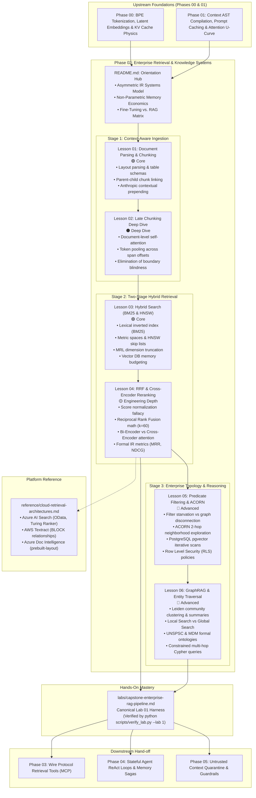
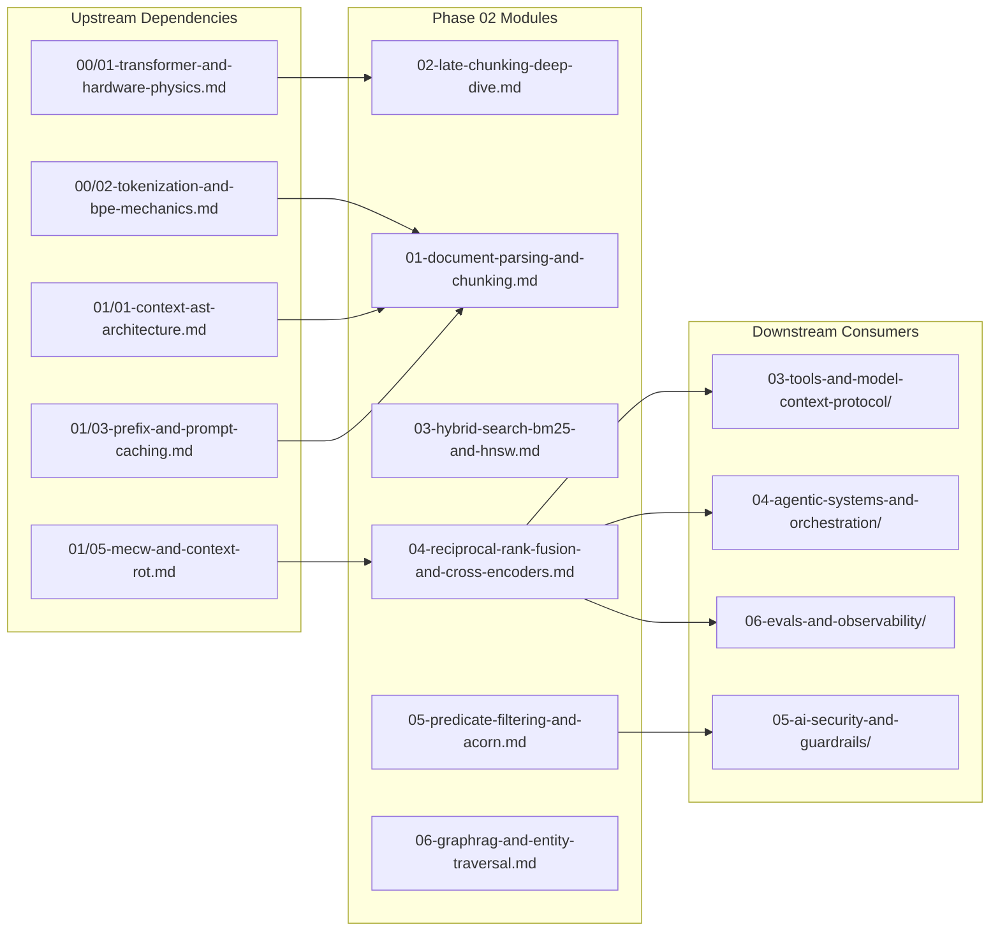

# Phase 02: Enterprise Retrieval & Knowledge Systems — Architectural Refactoring Plan

> **Execution Mode**: PLAN MODE  
> **Author**: AI Curriculum Architect  
> **Target Scope**: Phase 02 (`02-rag-and-knowledge-systems/`)  
> **Date**: September 2026  
> **Target Audience**: Senior Developers, Staff Software Engineers, and Solutions Architects (7–10+ years experience) transitioning to AI Systems Engineering.  
> **Upstream Inputs**: [`CURRICULUM_AUDIT.md`](../CURRICULUM_AUDIT.md), [`PHASE_2_AUDIT.md`](./PHASE_2_AUDIT.md), [`PHASE_2_RESEARCH.md`](./PHASE_2_RESEARCH.md), and `.agents/skills/ai-curriculum-refactoring/`.  
> **Output Blueprint Target**: Transition to `REFACTOR MODE`.

---

## 1. Executive Blueprint & Refactoring Mission

This refactoring plan establishes the architectural and pedagogical blueprint to restructure **Phase 02: Enterprise Retrieval & Knowledge Systems (RAG)** into a modular, production-grade curriculum.

Phase 02 currently suffers from the **Monolithic README Anti-Pattern**: a single 860-line file (6,884 words) containing 11 major topics, 13 diagrams, 2 embedded code blocks, 5 isolated tradeoff tables, and pervasive raw LaTeX math formatting. Despite world-class engineering substance—treating RAG as an asymmetric Information Retrieval (IR) and evidence synthesis system—the monolith creates severe cognitive overload, inverts conceptual prerequisites, buries code at the bottom of the document, completely omits its advertised marquee topic (**Late Chunking**), and violates repository quality gates.

### Core Pedagogical Axiom
> **"Do not teach less. Teach better."**  
> We do not simplify by cutting out mathematical mechanics, HNSW graph physics, or distributed production code. We eliminate monolithic sprawl, sequence concepts in strict order of technical dependencies, eradicate unrenderable LaTeX delimiters, provide step-by-step prose walkthroughs for every diagram, and integrate verified 2024–2026 systems breakthroughs (Late Chunking, Anthropic Contextual Retrieval, ACORN predicate-filtered search, PostgreSQL `pgvector` 0.7+ iterative scans, ColPali vision retrieval, and Microsoft GraphRAG community summaries).

---

## 2. Phase Purpose & Target Learner Outcomes

### 2.1. Phase Purpose
Equip senior systems engineers, technical leads, and solutions architects with the systems architecture, mathematical mechanics, and operational patterns required to design, scale, and govern enterprise-grade Grounded Retrieval Systems. Replace naive single-pass dense vector search with multi-stage asymmetric Information Retrieval pipelines combining layout-aware ingestion, Late Chunking, dense-sparse hybrid fusion via Reciprocal Rank Fusion, cross-attention reranking, predicate-filtered vector traversal, and ontologically-constrained knowledge graphs.

### 2.2. Target Learner Outcomes
Upon completing Phase 02, the learner will be able to:
1. **Design Layout-Aware Ingestion Pipelines**: Deconstruct complex multi-column PDFs, financial statements, and borderless tables into structural Markdown while maintaining parent-child document hierarchies and metadata provenance.
2. **Implement Late Chunking**: Pass long-context documents through transformer encoders before chunk pooling, computing contextualized token embeddings that eliminate chunk-boundary contextual blindness.
3. **Architect Two-Stage Hybrid Retrieval Engines**: Pair sparse inverted indexes (BM25 Okapi) with dense approximate nearest neighbor graphs (HNSW), fusing candidate rankings using Reciprocal Rank Fusion ($k=60$).
4. **Deploy Cross-Attention Reranking**: Apply full-attention Cross-Encoders (Cohere rerank, BGE-reranker) to prune candidate pools, manage P99 latency budgets, and measure retrieval quality using formal IR metrics (MRR@K, NDCG@K, Hit Rate@K).
5. **Solve Predicate-Filtered Vector Search**: Enforce strict multi-tenant access control lists (ACL) without filter starvation or graph disconnection using the ACORN paradigm (2-hop neighborhood exploration) and PostgreSQL `pgvector` iterative scans (`hnsw.iterative_scan`).
6. **Construct Ontologically-Constrained GraphRAG Systems**: Combine Microsoft GraphRAG hierarchical community summaries (Leiden clustering) with formal domain ontologies (UNSPSC, MDM) to execute hallucination-free multi-hop Cypher queries.

---

## 3. Prerequisites & Knowledge Map

### 3.1. Upstream Prerequisites (Phases 00 & 01)
- **Phase 00 (Foundations & Token Mechanics)**:
  - *BPE Tokenization*: Understanding why character slicing severs subword tokens (`00/02-tokenization-and-bpe-mechanics.md`).
  - *Transformer Representations & Latent Space*: High-dimensional geometric embeddings and cosine similarity (`00/01-transformer-and-hardware-physics.md`).
  - *KV-Cache Hardware Physics*: Understanding memory bandwidth saturation and prompt prefill economics (`00/03-kv-cache-vram-and-bandwidth-physics.md`).
- **Phase 01 (Prompt & Context Engineering)**:
  - *Context AST Compilation*: Structured prompt layers and XML boundary sandboxing (`01/01-context-ast-architecture.md`).
  - *Token Budgeting & Compaction*: Allocating token portfolios for retrieved context (`01/02-token-budgeting-and-compaction.md`).
  - *Prompt Caching*: Reusing static document prefixes in context generation (`01/03-prefix-and-prompt-caching.md`).
  - *Attention U-Curve & Lost in the Middle*: Why stuffing raw retrieved chunks causes attention degradation (`01/05-mecw-and-context-rot.md`).

### 3.2. Downstream Connections (Phases 03, 04, 05, 06)
- **Phase 03 (Tools & Model Context Protocol)**: Exposing retrieval pipelines as standardized MCP tools with JSON-RPC schemas and access control.
- **Phase 04 (Stateful Agent Orchestration)**: Fusing hybrid retrieval into autonomous ReAct loops; executing multi-turn Corrective RAG (CRAG) and Self-RAG state machines.
- **Phase 05 (AI Security & Guardrails)**: Hardening the retrieval perimeter against adversarial context injection and untrusted document payloads via Dual-LLM quarantine.
- **Phase 06 (GenAI Evals & Observability)**: Implementing LLM-as-a-judge evaluation flywheels for faithfulness, groundedness, and hallucination detection.

---

## 4. Target Phase Architecture & Modular Progression

Phase 02 will be decomposed into an **Orientation Hub (`README.md`)**, **6 modular lessons**, a **Platform Reference Appendix**, a **harmonized Capstone Lab**, and **production reference implementations**:

```text
02-rag-and-knowledge-systems/
├── README.md                                      # Phase Orientation, Architecture & Navigation Hub (~500 words)
├── 01-document-parsing-and-chunking.md            # 🟢 Core (~1,800 words)
├── 02-late-chunking-deep-dive.md                  # ⚫ Deep Dive (~2,200 words) [NEW MARQUEE TOPIC]
├── 03-hybrid-search-bm25-and-hnsw.md              # 🟢 Core (~2,200 words)
├── 04-reciprocal-rank-fusion-and-cross-encoders.md # 🟡 Engineering Depth (~2,200 words)
├── 05-predicate-filtering-and-acorn.md            # 🔵 Advanced (~2,000 words)
├── 06-graphrag-and-entity-traversal.md            # 🔵 Advanced (~2,400 words)
├── reference/
│   └── cloud-retrieval-architectures.md           # Platform Appendix: Azure AI Search, AWS Textract, Doc Intelligence (~1,500 words)
├── labs/
│   └── capstone-enterprise-rag-pipeline.md        # Capstone Specification (Aligned with root lab-01 & verify_lab.py)
├── examples/
│   ├── README.md                                  # Examples Manifest
│   ├── hybrid_rag_pipeline.py                     # Production Python (Real embeddings + Pydantic v2 + OTel spans)
│   ├── HybridSearchService.cs                     # C# / .NET 9 Service (Azure AI Search + Semantic Kernel)
│   └── EnterpriseRag.csproj                       # C# .NET 9 Project Manifest (Enables automated dotnet build)
├── PHASE_2_AUDIT.md                               # Deep Audit Report
├── PHASE_2_RESEARCH.md                             # Controlled Frontier Research Report
└── PHASE_2_REFACTORING_PLAN.md                    # This Engineering Plan
```

### 4.1. End-to-End Conceptual Flowchart



#### Diagram Walkthrough:
1. **Prerequisite Entry**: The learner enters with foundational token mechanics (Phase 00) and context compilation principles (Phase 01).
2. **Phase Orientation (Hub README)**: Frames RAG as an asymmetric Information Retrieval pipeline, establishes non-parametric memory economics, and provides role-based navigation.
3. **Stage 1 (Ingestion)**: Solves layout destruction in Lesson 01 (tables, columns, parent-child, contextual prepending), then masters the deep mechanics of Late Chunking in Lesson 02.
4. **Stage 2 (Two-Stage Hybrid Search)**: Combines exact keyword precision (BM25) and semantic recall (HNSW) in Lesson 03, then fuses candidate pools via Reciprocal Rank Fusion ($k=60$) and reranks with deep Cross-Encoders in Lesson 04.
5. **Stage 3 (Enterprise Systems)**: Solves multi-tenant predicate filtering without filter starvation (ACORN and Postgres RLS in Lesson 05), then enables global multi-hop reasoning over formal enterprise ontologies (GraphRAG in Lesson 06).
6. **Platform Isolation & Lab Verification**: Cloud vendor schemas are isolated in a platform appendix, while engineering mastery is validated against `agent-forge` via `verify_lab.py --lab 1`.

---

## 5. Lesson-by-Lesson Design Specifications

In accordance with the **Structural Flexibility Rule**, each lesson uses an intentional structure designed for its specific pedagogical objective rather than a rigid template.

---

### Lesson 01: Document Parsing & Structural Chunking Strategies
* **Target File**: `02-rag-and-knowledge-systems/01-document-parsing-and-chunking.md`
* **Depth Tier**: `🟢 Core` (Tier 1)
* **Target Word Budget**: ~1,800 words
* **Systems Mental Model**: **The Compaction AST & Relational Knowledge Normalizer**. Document parsing is not text extraction; it is structural decomposition that normalizes multi-modal, spatial artifacts into clean semantic trees with preserved parentage.
* **Core Topics & Engineering Progression**:
  1. *The Problem*: Naive text extraction (`pdfminer`, `pypdf`) collapses multi-column pages into scrambled sentences, destroys borderless financial tables, and severs footnotes from claims.
  2. *Layout-Aware Extraction Mechanics*:
     - Multi-column reading order detection using geometric polygon boundaries.
     - Table reconstruction: Converting coordinate matrices into clean GitHub Flavored Markdown (`| H1 | H2 |`) or semantic HTML tables.
  3. *Chunking Methodologies & Tradeoffs*:
     - Fixed-size token chunking with overlap (why it destroys tabular schemas).
     - Recursive character splitting (hierarchical paragraph/sentence delimiters).
     - Semantic chunking (embedding distance variance between adjacent sentences).
  4. *Hierarchical / Parent-Child (Small-to-Big) Architecture*:
     - Indexing small child chunks (100–200 tokens) for high semantic resolution.
     - Storing relational pointers to larger parent sections (1,000–2,000 tokens) returned to the LLM context window.
  5. *Anthropic Contextual Retrieval (Chunk Prepending)*:
     - The "context loss" failure mode of isolated chunks.
     - Prepending 50–100 token model-generated context summaries.
     - Leveraging parent document prompt caching to cut context generation cost by 90%.
  6. *Frontier Architectural Alternative: ColPali*:
     - Bypassing OCR entirely: embedding document page images directly via PaliGemma patches and ColBERT MaxSim interaction.
* **Deliverable Code**: Production Python 3.12+ document chunker using Pydantic v2 schemas (`DocumentChunk`, `ParentDocument`, `ContextualEnrichment`) with parent-child relational linking.
* **Required Visual**: Mermaid `flowchart TD` contrasting naive text flattening against layout-aware structural chunking, with a 5-step numbered walkthrough.
* **Failure Modes Covered**:
  - *The Column Bleed Catastrophe*: Text from column A merging horizontally with text from column B.
  - *Table Schema Severance*: Fixed chunk boundary slicing directly through a financial balance sheet row.
  - *Isolated Chunk Amnesia*: Chunk stating "Revenue rose 4%" without identifying company, division, or quarter.

---

### Lesson 02: Late Chunking Deep Dive
* **Target File**: `02-rag-and-knowledge-systems/02-late-chunking-deep-dive.md`
* **Depth Tier**: `⚫ Deep Dive` (Tier 4)
* **Target Word Budget**: ~2,200 words
* **Systems Mental Model**: **Document-Level Transformer Self-Attention with Deferred Boundary Pooling**. Inverting the classic pipeline from "chunk first, embed second" to "embed first, chunk second."
* **Core Topics & Engineering Progression**:
  1. *The Root Physics of Chunking Blindness*:
     - In traditional chunking, text is split before being passed to the transformer encoder. Tokens in Chunk B cannot attend to tokens in Chunk A.
     - Pronouns ("it", "they", "this agreement") lose their antecedents; condition qualifiers ("subject to Section 4.2") are severed.
  2. *The Late Chunking Algorithmic Mechanics (Günther et al., Jina AI 2024)*:
     - Step 1: Ingest the full text document (up to 8,192 tokens) into a long-context embedding model (e.g. `jina-embeddings-v3`).
     - Step 2: Compute full bidirectional self-attention across all token positions, generating contextualized token representations.
     - Step 3: Define chunk span boundaries (token start/end offsets) based on document structure.
     - Step 4: Perform mean-pooling exclusively over the contextualized token vectors *within each span offset*.
  3. *Mathematical Formulation (Zero-LaTeX)*:
     - Express token attention representations and span pooling using clean `text` code blocks and Unicode symbols:
       ```text
       Token Representations: H = TransformerEncoder(t_1, t_2, ..., t_N) where H in R^(N x d)
       Chunk Embedding:       v_chunk = (1 / |C_k|) * Σ [ H_i ]  for i in C_k
       ```
  4. *Empirical Verification: Naive vs. Late Chunking*:
     - Scenario: A 3-paragraph contract where Paragraph 1 defines "Contractor: ACME Global" and Paragraph 3 states "The Contractor is liable for all indemnity costs."
     - Cosine similarity benchmark showing how Late Chunking preserves the entity bond while naive chunking fails.
  5. *Engineering Trade-offs & Hardware Realities*:
     - Compute cost: Processing 8,192 tokens in a single transformer pass incurs quadratic $O(N^2)$ attention compute during ingestion.
     - Context window limits: Constrained by embedding model maximum sequence length.
     - Storage footprint: Identical vector storage in the vector DB (standard $d$-dimensional vectors).
* **Deliverable Code**: Complete, runnable Python 3.12+ script implementing Late Chunking over a long text string using Hugging Face `transformers` or simulated token-level mean pooling.
* **Required Visual**: Mermaid `flowchart LR` comparing the standard chunking flow vs. the Late Chunking flow, with a 4-step numbered walkthrough.
* **Failure Modes Covered**:
  - *Context Window Truncation*: Documents exceeding the embedding model's maximum sequence length silently truncating trailing tokens.
  - *Mean-Pooling Dilution*: Very large chunk spans washing out specific entity signals.

---

### Lesson 03: Hybrid Search — BM25, HNSW & Vector Memory Physics
* **Target File**: `02-rag-and-knowledge-systems/03-hybrid-search-bm25-and-hnsw.md`
* **Depth Tier**: `🟢 Core` (Tier 1)
* **Target Word Budget**: ~2,200 words
* **Systems Mental Model**: **Dual Coordinate Retrieval: Lexical Inverted Postings Lists paired with Metric-Space Navigable Proximity Graphs**.
* **Core Topics & Engineering Progression**:
  1. *The Vector Search Fallacy*:
     - Why dense vectors fail on alphanumeric IDs (`SKU-90812`, error codes `0x80070005`, email addresses).
     - Dense vector semantic blur: `Error 0x80070005` (Access Denied) and `Error 0x80070002` (File Not Found) having cosine similarity > 0.94.
     - Negation blindness: "Show me policies that do NOT apply to contractors."
  2. *Sparse Lexical Retrieval: BM25 Okapi Mechanics*:
     - Term Frequency saturation ($k_1$) and Document Length normalization ($b$).
     - Inverted index data structures: Postings lists and dictionary lookups.
     - Mathematical scoring formatted in Zero-LaTeX text blocks.
  3. *Dense Approximate Nearest Neighbor (ANN): HNSW Physics*:
     - Why exhaustive $O(N)$ linear scans fail production latency budgets.
     - Hierarchical Navigable Small World (HNSW) graph skip-list architecture.
     - Key engineering knobs: `M` (max bidirectional links), `efConstruction` (build exploration factor), `efSearch` (query exploration factor).
  4. *Distance Metrics & Normalization*:
     - Cosine Similarity vs. Inner Dot Product vs. Euclidean (L2).
     - Performance optimization: L2 normalization enabling Dot Product SIMD/AVX-512 acceleration.
  5. *Matryoshka Representation Learning (MRL)*:
     - Dimension truncation (3072 to 512) retaining 98% accuracy while slashing memory footprint by 6x.
  6. *Vector Database RAM & Storage Sizing Physics*:
     - Concrete formula for calculating resident DRAM per 1M vectors across FP32, FP16 (`halfvec`), INT8/SQ8, and Binary Quantization (`bit`).
* **Deliverable Code**: Python 3.12+ dual-index search engine querying an in-memory BM25 index and a normalized vector store in parallel, returning calibrated candidate pools.
* **Required Visual**: Mermaid `flowchart TD` illustrating multi-layer HNSW graph routing from sparse top layers to dense bottom layers, with a 5-step numbered walkthrough.
* **Failure Modes Covered**:
  - *Vector Index Memory Exhaustion (OOM)*: Graph link memory growing quadratically under high $M$ parameters, crashing database pods.
  - *Unnormalized Dot Product Distortion*: Calculating inner product on unnormalized vectors, allowing document length to distort semantic ranking.

---

### Lesson 04: Reciprocal Rank Fusion & Cross-Encoder Reranking
* **Target File**: `02-rag-and-knowledge-systems/04-reciprocal-rank-fusion-and-cross-encoders.md`
* **Depth Tier**: `🟡 Engineering Depth` (Tier 2)
* **Target Word Budget**: ~2,200 words
* **Systems Mental Model**: **Rank-Harmonic Calibration paired with Full-Attention Cross-Encoding**. Decoupling candidate gathering from definitive evidence scoring.
* **Core Topics & Engineering Progression**:
  1. *The Score Normalization Fallacy*:
     - Why combining raw BM25 scores (unbounded positive $[0, \infty)$) and dense cosine similarities (bounded $[-1, 1]$) via linear weighting fails under distribution shifts.
  2. *Reciprocal Rank Fusion (RRF) Mechanics*:
     - Positional rank math: Operating exclusively on 1-indexed ranks rather than arbitrary scores.
     - The rank-harmonic constant $k=60$: Why it prevents runaway rank dominance.
     - Zero-LaTeX RRF formula:
       ```text
       RRF_Score(d) = Σ [ 1 / (k + rank_m(d)) ]  for each ranking system m in M
       ```
  3. *Bi-Encoder vs. Cross-Encoder Architecture*:
     - Bi-Encoder: Independent query and document embeddings. Fast ($O(1)$ cosine check), but zero cross-token interaction.
     - Cross-Encoder: Query and document concatenated into a single transformer input. Full bidirectional self-attention matrix ($O((L_q + L_d)^2)$).
     - The Two-Stage Production Pipeline: Retrieve top-50 candidates via Hybrid BM25+HNSW; rerank top-50 down to top-5 via Cross-Encoder.
  4. *Query Transformation & Strategic Routing*:
     - Query Rewriting (resolving conversational pronouns via chat history).
     - Hypothetical Document Embeddings (HyDE): When it helps and when it hallucinates.
     - Sub-query decomposition for multi-part questions.
  5. *Active Retrieval Decision Gates: CRAG & Self-RAG*:
     - Confidence threshold evaluation: Correct (>0.80), Ambiguous (0.40–0.80), Incorrect (<0.40).
     - Bridging active decision gates to Phase 04 agent loops.
  6. *Information Retrieval (IR) Evaluation Metrics*:
     - Mean Reciprocal Rank (MRR@K).
     - Normalized Discounted Cumulative Gain (NDCG@K).
     - Hit Rate @ K and Mean Average Precision (MAP).
* **Deliverable Code**: Production Python 3.12+ pipeline implementing RRF candidate fusion ($k=60$), cross-encoder reranking (Cohere API or SentenceTransformers), and MRR@10 scoring diagnostics.
* **Required Visual**: Mermaid `flowchart TD` illustrating the complete Two-Stage Hybrid Search & Reranking pipeline, with a 6-step numbered walkthrough.
* **Failure Modes Covered**:
  - *The Cross-Encoder Latency Spike*: Feeding 500 candidates into a cross-encoder, causing P99 latency to blow past 2,000ms SLAs.
  - *HyDE Entity Poisoning*: Model hallucinating plausible but fake product part numbers in hypothetical documents, corrupting downstream vector retrieval.

---

### Lesson 05: Predicate Filtering, ACORN & Multi-Tenant Isolation
* **Target File**: `02-rag-and-knowledge-systems/05-predicate-filtering-and-acorn.md`
* **Depth Tier**: `🔵 Advanced` (Tier 3)
* **Target Word Budget**: ~2,000 words
* **Systems Mental Model**: **The Filtered Metric Subgraph & Cryptographic Tenant Isolation**. Enforcing relational security predicates within high-dimensional geometric spaces.
* **Core Topics & Engineering Progression**:
  1. *The Multi-Tenant Security Imperative*:
     - Hard security boundaries: Why post-generation filtering is an information security disaster.
     - Real-world enterprise queries: `tenant_id = 'corp_42' AND department IN ('legal', 'hr')`.
  2. *The Filtered ANN Dilemma*:
     - *Naive Post-Filtering*: Running unconstrained HNSW to retrieve top-100, then discarding non-matching vectors. Causes **Filter Starvation** (0 to 2 matching items survive) when predicates are selective.
     - *Naive Pre-Filtering*: Restricting the graph to matching vectors before traversal. Causes **Graph Disconnection**; the surviving subgraph fractures into isolated islands, terminating search prematurely with catastrophic recall collapse.
  3. *The ACORN Paradigm (SIGMOD 2024)*:
     - Predicate-agnostic subgraph traversal.
     - ACORN-1: Query-time 2-hop neighborhood exploration around predicate-violating nodes.
     - ACORN-$\gamma$: Index-time graph densification with $\gamma \cdot M$ edges to guarantee subgraph connectivity.
  4. *Production Relational Vector Search: PostgreSQL `pgvector` 0.7+*:
     - Enforcing multi-tenant isolation via **Row Level Security (RLS)** policies.
     - HNSW Iterative Scans (`hnsw.iterative_scan = on`, `hnsw.max_scan_tuples`): Dynamically scanning deeper into the graph to satisfy the query `LIMIT` without recall drops.
     - Specialized data types: `halfvec` (16-bit float) and `sparsevec` (sparse lexical weights).
  5. *Enterprise Partitioning Strategies*:
     - Dedicated index/namespace per tenant vs. shared index with metadata predicates.
* **Deliverable Code**: Python 3.12+ and SQL scripts demonstrating PostgreSQL RLS vector table setup, `hnsw.iterative_scan` query execution, and simulated ACORN 2-hop traversal.
* **Required Visual**: Mermaid `flowchart TD` contrasting Naive Pre-filtering (graph fracture), Naive Post-filtering (starvation), and ACORN 2-hop routing, with a 5-step numbered walkthrough.
* **Failure Modes Covered**:
  - *The Filter Starvation Silent Zero*: Application returning empty context to the LLM because post-filtering pruned all 100 returned candidates.
  - *Cross-Tenant Memory Bleed*: Accidental omission of tenant predicates in application queries leaking confidential competitor records.

---

### Lesson 06: GraphRAG & Ontological Entity Traversal
* **Target File**: `02-rag-and-knowledge-systems/06-graphrag-and-entity-traversal.md`
* **Depth Tier**: `🔵 Advanced` (Tier 3)
* **Target Word Budget**: ~2,400 words
* **Systems Mental Model**: **The Dual-Memory Nexus: Associative Vector Proximity constrained by Symbolic Enterprise Ontologies**.
* **Core Topics & Engineering Progression**:
  1. *The Limits of Vector Search on Global Queries*:
     - Local queries (*"What is ACME's cancellation fee?"*) succeed with vector search.
     - Global queries (*"What are the top 5 systemic operational risks across all clinical trial reports?"*) fail completely with vector search because no single chunk contains the answer.
  2. *Microsoft GraphRAG Architecture*:
     - LLM-powered entity, relationship, and claim extraction.
     - Hierarchical community detection using the **Leiden algorithm**.
     - Pre-generating multi-level **Community Summaries**.
     - **Global Search**: Map-reduce synthesis over community summaries.
     - **Local Search**: Entity seed identification followed by 1-to-2 hop relationship expansion.
  3. *The Breakdown of Naive GraphRAG in the Enterprise*:
     - Entity Duplication & Aliasing (`IBM`, `International Business Machines`, `Big Blue` extracted as disconnected nodes).
     - Relational Ambiguity (vague edges like `associated_with`, `has_dealings_in`).
     - **Semantic Bleed**: Multi-hop queries drifting into irrelevant domains across associative edges.
  4. *Enterprise Ontological Grounding*:
     - Constraining extraction and traversal with formal taxonomies:
       - **UNSPSC** (8-digit procurement code hierarchy).
       - **MDM** (Master Data Management product catalogs).
       - **RACI** (Organizational authority matrices).
  5. *Constrained Multi-Hop Cypher Traversal*:
     - Structured Neo4j Cypher / GQL queries enforcing semantic boundary pruning.
     - Limiting traversals to formal relationship semantics (`owl:ObjectProperty` domain/range constraints).
* **Deliverable Code**: Python 3.12+ script extracting entities validated against a strict Pydantic ontology schema, generating Cypher queries with taxonomic pruning.
* **Required Visual**: Mermaid `flowchart TD` illustrating taxonomy-guided entity resolution and constrained multi-hop Cypher traversal, with a 5-step numbered walkthrough.
* **Failure Modes Covered**:
  - *The Knowledge Hairball*: Unconstrained entity extraction producing millions of duplicated nodes and meaningless relational edges.
  - *Multi-Hop Semantic Bleed*: 3-hop traversal drifting from procurement audit into corporate marketing fluff via ambiguous associative edges.

---

### Platform Reference Appendix
* **Target File**: `02-rag-and-knowledge-systems/reference/cloud-retrieval-architectures.md`
* **Target Word Budget**: ~1,500 words
* **Role**: Platform-specific implementation appendix for cloud enterprise deployments.
* **Coverage**:
  - **Azure AI Search**: Push vs. Pull indexers, OData security pre-filtering, Microsoft Turing Semantic Ranker configuration, Extractive Captions.
  - **AWS Textract**: `AnalyzeDocument` API, `BLOCK` geometry trees, `KEY_VALUE_SET` form extraction, multi-page table reconstruction.
  - **Azure Document Intelligence**: `prebuilt-layout` model, reading order polygon sorting, Markdown output serialization.
  - **Google Cloud Vertex AI Search & Grounding**: Enterprise datastores, Google Search grounding, dynamic retrieval thresholds.

---

## 6. Major Changes & Engineering Rationale Matrix

For every architectural modification across Phase 02, the engineering rationale and learning benefit are defined below:

| # | Major Change | Current Problem | Proposed Change | Reason & Engineering Rationale | Expected Learning Benefit |
|---|---|---|---|---|---|
| **1** | **Monolithic README Modularization** | 6,884 words in a single file exceeds cognitive capacity; zero modular lessons. | Decompose `README.md` into 6 modular lessons + Orientation Hub. | Matches Phase 00/01 architecture; aligns with 4-Tier Depth Model; allows targeted study. | Learners digest discrete, production-ready modules (~1,800–2,400 words) with immediate code feedback. |
| **2** | **Add Late Chunking (`NEW_TOPIC`)** | Prominently advertised in phase badge (`README.md:52`), but 0 words exist in the text (`CRIT-03`). | Author `02-late-chunking-deep-dive.md` (`⚫ Deep Dive`) with full math and runnable Python code. | Landmark 2024 Jina AI innovation eliminating chunk boundary blindness via document-level self-attention. | Learners master a cutting-edge technique that solves one of the oldest failure modes in text chunking. |
| **3** | **Integrate Anthropic Contextual Retrieval** | Linked as an external URL (Line 835) but never taught in the courseware. | Embed contextual prepending mechanics and prompt caching economics into Lesson 01. | Prepending 50–100 token LLM context reduces retrieval failure by 49%–67% while cutting cost via caching. | Engineers learn how to enrich chunks at ingest time without blowing operational budgets. |
| **4** | **Dedicated Predicate Filtering Lesson (`ADVANCED_TOPIC`)** | ACORN mentioned in 9 lines (`README.md:285–293`) without diagrams, failure traces, or code. | Form `05-predicate-filtering-and-acorn.md` (`🔵 Advanced`) detailing ACORN and pgvector RLS. | Multi-tenant security predicates represent the #1 production failure point (filter starvation vs graph fracture). | Senior architects understand how to enforce enterprise RBAC inside vector search without recall collapse. |
| **5** | **Isolate Cloud Vendor Dumps to Appendix** | ~250 lines of Azure/AWS/GCP documentation dilutes vendor-neutral systems architecture. | Move cloud-specific setup to `reference/cloud-retrieval-architectures.md`. | Curriculum must teach durable distributed systems primitives, not ephemeral cloud portal menus. | Preserves vendor-neutral engineering purity while providing deep reference material for cloud practitioners. |
| **6** | **Move Context Poisoning to Phase 05 (`MOVE_TOPIC`)** | Prompt injection defense and semantic firewalls in retrieved chunks taught in Section 6.3 before security phase. | Retain basic XML delimiters in Phase 02; transfer deep threat models to Phase 05. | Prompt injection defense, jailbreaks, and dual-LLM quarantine belong fundamentally in Phase 05. | Eliminates cross-phase concept duplication and preserves prerequisite progression. |
| **7** | **Move Autonomous Agent Loops to Phase 04 (`MOVE_TOPIC`)** | CRAG and Self-RAG execution loops taught in Section 3.7 before tool calling (Phase 03) and agents (Phase 04). | Teach confidence decision trees in Phase 02; move multi-turn execution loops to Phase 04. | Autonomous looping, tool fallback, and reflection tokens are agentic orchestration primitives. | Clean separation between retrieval decision gates and stateful agent execution runtimes. |
| **8** | **Zero-LaTeX Remediation** | 33+ raw LaTeX occurrences (`$$...$$`, `$...$`, `\text`, `\sum`) break Markdown previewers. | Reformat all formulas in clean `text` blocks and native Unicode symbols (`→`, `Σ`, `≈`, `α`). | Adheres strictly to repository Quality Gate 13; ensures flawless rendering across all markdown viewers. | Seamless reading experience in VS Code, GitHub, and Antigravity IDE without broken math tags. |
| **9** | **100% Diagram Walkthrough Coverage** | 13 of 13 Mermaid diagrams lack numbered step-by-step prose walkthroughs (`IMP-01`). | Provide numbered prose walkthroughs beneath every retained diagram; eliminate disconnected box diagrams. | Diagrams without explanations create ambiguity; flowcharts must illustrate genuine data flows. | Visual models are directly anchored to step-by-step systems mechanics. |
| **10** | **Harmonize Capstone Lab with Root Lab 01** | Internal capstone lab has broken anchor and exists in parallel with root `labs/lab-01` and `verify_lab.py`. | Designate `labs/lab-01-multi-tenant-hybrid-rag.md` as the canonical verified evaluation testbed. | Eliminates dual-lab confusion (`CRIT-04`); wires Phase 02 directly to `agent-forge` verification. | Learners have an automated CI grading script (`python scripts/verify_lab.py --lab 1`) to prove mastery. |
| **11** | **Upgrade Python Reference Implementation** | Uses `np.random.randn(128)` for vectors, producing random retrieval outputs. | Upgrade with real embeddings (e.g. `fastembed`), Pydantic v2 validation, and OTel spans. | Toy mock code fails senior engineers; code must produce genuine semantic search results. | Production-grade, copy-pasteable reference code adhering to Python 3.12+ enterprise standards. |
| **12** | **Add C# Project Manifest (`.csproj`)** | `HybridSearchService.cs` exists without a `.csproj`, preventing compilation in CI. | Add `examples/EnterpriseRag.csproj` targeting `net9.0` with Azure and Semantic Kernel packages. | Resolves `IMP-06`; allows .NET engineers to compile and test the code with `dotnet build`. | Full polyglot build verification in CI pipelines. |

---

## 7. Cross-Phase Reference Integrity Map

To ensure rock-solid link integrity across the curriculum, the following cross-phase reference map is established:



#### Walkthrough of Cross-Phase Links:
1. `01-document-parsing-and-chunking.md` links back to `00/02-tokenization-and-bpe-mechanics.md` (why character counts != tokens), `01/01-context-ast-architecture.md` (XML delimiter boundaries), and `01/03-prefix-and-prompt-caching.md` (Anthropic contextual prepending prompt caching).
2. `02-late-chunking-deep-dive.md` links back to `00/01-transformer-and-hardware-physics.md` (transformer attention matrices and token latent space).
3. `04-reciprocal-rank-fusion-and-cross-encoders.md` links back to `01/05-mecw-and-context-rot.md` (Lost in the Middle U-curves) and bridges forward to `04-agentic-systems-and-orchestration/` (CRAG/Self-RAG agent loops) and `06-evals-and-observability/` (LLM-as-a-judge faithfulness evals).
4. `05-predicate-filtering-and-acorn.md` bridges forward to `05-ai-security-and-guardrails/` (multi-tenant zero-trust perimeter defense).

---

## 8. Verified Curated Resources & Primary Source Index

The refactored Phase 02 will feature an authoritative reference index of peer-reviewed papers, official specifications, and production benchmarks:

### 1. Seminal Research Papers
- **Late Chunking**: Günther et al., *Late Chunking: Contextual Chunk Embeddings Using Long-Context Embedding Models*, arXiv:2409.04701 (Jina AI, Sept 2024).
- **ACORN Predicate Search**: Patel et al., *ACORN: Performant and Accurate Predicate-Filtered Vector Search*, SIGMOD 2024 (arXiv:2403.04871).
- **Microsoft GraphRAG**: Edge et al., *From Local to Global: A Graph RAG Approach to Query-Focused Summarization*, Microsoft Research, arXiv:2404.16130 (2024).
- **ColPali Visual Retrieval**: Faysse et al., *ColPali: Efficient Document Retrieval with Vision Language Models*, arXiv:2407.01449 (ICLR 2025).
- **ColBERTv2**: Santhanam et al., *ColBERTv2: Effective and Efficient Retrieval via Lightweight Late Interaction*, NAACL 2022.
- **Matryoshka Embeddings**: Kusupati et al., *Matryoshka Representation Learning*, NeurIPS 2022.
- **Lost in the Middle**: Liu et al., *Lost in the Middle: How Language Models Use Long Contexts*, TACL 2023.
- **Corrective RAG (CRAG)**: Yan et al., *Corrective Retrieval Augmented Generation*, arXiv:2401.15884 (2024).
- **Self-RAG**: Asai et al., *Self-RAG: Learning to Retrieve, Generate, and Critique through Self-Reflection*, ICLR 2024.
- **HyDE**: Gao et al., *Precise Zero-Shot Dense Retrieval without Relevance Labels*, ACL 2023.

### 2. Official Specifications & Upstream Implementations
- **Anthropic Contextual Retrieval**: Official Research Guide, September 2024.
- **PostgreSQL `pgvector`**: Official Documentation & Release Specs (`github.com/pgvector/pgvector`).
- **OpenTelemetry GenAI Semantic Conventions**: `github.com/open-telemetry/semantic-conventions-genai`.
- **Microsoft GraphRAG Implementation**: `github.com/microsoft/graphrag`.
- **Jina AI Late Chunking Implementation**: `github.com/jina-ai/late-chunking`.
- **Qdrant Filtered Search Architecture**: `qdrant.tech/documentation/concepts/filtering/`.

---

## 9. Refactoring Execution Checklist (Transition to REFACTOR MODE)

Upon approval of this plan, the execution will proceed in **REFACTOR MODE** following these sequenced steps:

- [ ] **Step 1: Scaffolding Phase Hub & Directory Structure**
  - Rewrite `02-rag-and-knowledge-systems/README.md` into the Orientation Hub (4-Tier Depth Model, Prerequisite Map, Learning Paths).
  - Create `02-rag-and-knowledge-systems/reference/` directory.
- [ ] **Step 2: Author Lesson 01 (`🟢 Core`)**
  - Write `01-document-parsing-and-chunking.md` (Layout parsing, table schemas, parent-child chunking, Anthropic contextual prepending).
- [ ] **Step 3: Author Lesson 02 (`⚫ Deep Dive`)**
  - Write `02-late-chunking-deep-dive.md` (Transformer token self-attention, span mean-pooling, implementation).
- [ ] **Step 4: Author Lesson 03 (`🟢 Core`)**
  - Write `03-hybrid-search-bm25-and-hnsw.md` (BM25 Okapi, HNSW skip lists, distance metrics, MRL, vector RAM physics).
- [ ] **Step 5: Author Lesson 04 (`🟡 Engineering Depth`)**
  - Write `04-reciprocal-rank-fusion-and-cross-encoders.md` (RRF rank math, cross-encoders, query transforms, IR eval metrics).
- [ ] **Step 6: Author Lesson 05 (`🔵 Advanced`)**
  - Write `05-predicate-filtering-and-acorn.md` (Filter starvation, ACORN 2-hop exploration, pgvector RLS & iterative scans).
- [ ] **Step 7: Author Lesson 06 (`🔵 Advanced`)**
  - Write `06-graphrag-and-entity-traversal.md` (Leiden community clustering, UNSPSC ontologies, constrained Cypher).
- [ ] **Step 8: Author Platform Reference Appendix**
  - Write `reference/cloud-retrieval-architectures.md` (Azure AI Search, AWS Textract, Doc Intelligence).
- [ ] **Step 9: Align Capstone Lab & Upstream Root Lab**
  - Reconcile `labs/capstone-enterprise-rag-pipeline.md` with `labs/lab-01-multi-tenant-hybrid-rag.md` and `scripts/verify_lab.py`.
- [ ] **Step 10: Enhance Production Code Examples**
  - Upgrade `examples/hybrid_rag_pipeline.py` with real embeddings, Pydantic v2 schemas, and OTel spans.
  - Add `examples/EnterpriseRag.csproj` for C# build verification.
- [ ] **Step 11: Validation Mode Verification**
  - Execute pre-merge checks against the 13-point quality gate, verifying zero-LaTeX compliance and link integrity.
