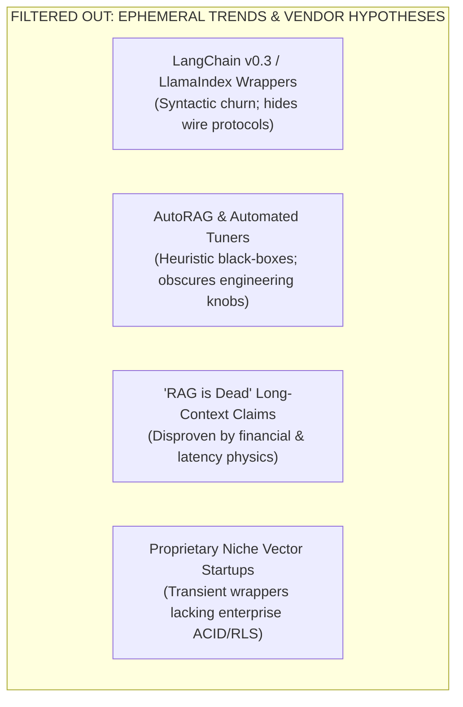
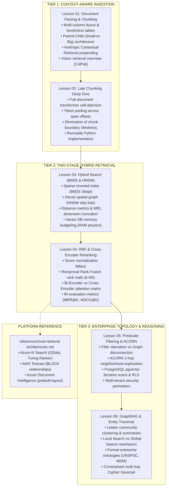

# Phase 02: Enterprise Retrieval & Knowledge Systems — Research & Freshness Report

> **Execution Mode**: RESEARCH MODE (Controlled Frontier Scout)  
> **Auditor**: AI Curriculum Architect  
> **Target Scope**: Phase 02 (`02-rag-and-knowledge-systems/`)  
> **Date**: September 2026  
> **Target Learner**: Senior Developers, Staff Software Engineers, and Solutions Architects (7–10+ years experience) transitioning to AI Systems Engineering.  
> **Baseline References**: `02-rag-and-knowledge-systems/PHASE_2_AUDIT.md`, `CURRICULUM_AUDIT.md`, and the `ai-curriculum-refactoring` skill guidelines.  
> **Operational Protocol**: **Research → Verify → Classify → Evaluate → Recommend → Human Approval Checkpoint**. No lesson files have been modified.

---

## 1. Executive Summary & Frontier Context

Information Retrieval (IR) and Retrieval-Augmented Generation (RAG) have undergone a profound paradigm shift between 2024 and 2026. The initial era of "naive RAG"—characterized by arbitrary 500-token text slicing, single-pass dense cosine similarity search, and ungrounded generation—has completely failed in production enterprise environments. 

Production engineering consensus now treats RAG not as a database lookup, but as an **asymmetric, multi-stage evidence synthesis pipeline**. Modern production architectures enforce:
1. **Context-Aware Ingestion**: Transitioning from blind character slicing to **Late Chunking** (embedding full documents before chunk pooling) and **Contextual Prepending** (Anthropic Contextual Retrieval with prompt caching).
2. **Hybrid Lexical-Semantic Fusion**: Combining inverted lexical indexes (BM25) with approximate nearest neighbor vector graphs (HNSW) fused via rank-harmonic algorithms (**Reciprocal Rank Fusion, $k=60$**).
3. **Deep Cross-Attention Reranking**: Employing Cross-Encoders (Cohere rerank, BGE-reranker, ColBERTv2) to evaluate all-to-all query-document self-attention matrices on top candidate pools.
4. **Topology-Preserving Predicate Filtering**: Overcoming pre-filtering graph disconnection and post-filtering starvation using the **ACORN** paradigm (2-hop neighborhood exploration) and PostgreSQL `pgvector` iterative scans (`hnsw.iterative_scan`).
5. **Structured Symbolic Knowledge Systems**: Upgrading unconstrained "knowledge hairballs" to **Ontological GraphRAG**—constraining entity extraction and multi-hop Cypher traversals with formal domain ontologies (UNSPSC, MDM, RACI).
6. **Direct Vision Document Retrieval**: Introducing **ColPali** (Vision-Language Models via PaliGemma patches) to bypass brittle OCR pipelines on visually dense, borderless tabular documents.

This report audits the current state of Phase 02 against these industry developments, establishes strict classification tags, filters out ephemeral framework trends, and prepares recommendations for the Human Approval Gate.

---

## 2. Topic Action Summary & Classification Matrix

In accordance with the `ai-curriculum-refactoring` taxonomy, candidate topics are triaged across seven distinct classifications:

| Candidate Topic | Action Tag | Target Location | Stability | Primary Sources | Rationale |
|---|---|---|---|---|---|
| **Late Chunking** | `NEW_TOPIC` | `02-late-chunking-deep-dive.md` | Emerging (High Adoption) | Günther et al. (Jina AI, arXiv:2409.04701, Sept 2024) | Advertised in Phase 2 badge but missing from text. Eliminates chunk boundary context blindness via document-level self-attention. |
| **Contextual Retrieval & Prepending** | `UPDATE_EXISTING` | `01-document-parsing-and-chunking.md` | Durable | Anthropic Research (Sept 2024) | Prepending 50–100 token LLM context to chunks reduces retrieval failure by 49%–67%; leverages prompt caching to cut ingestion costs by 90%. |
| **Two-Stage Hybrid Search & RRF** | `UPDATE_EXISTING` | `03-hybrid-search-bm25-and-hnsw.md`, `04-reciprocal-rank-fusion...` | Durable | Cormack et al. (SIGIR 2009), Pinecone Research (2024) | Universal industry standard for fusing sparse BM25 and dense HNSW results without unstable score normalization. |
| **ACORN Predicate Filtering** | `ADVANCED_TOPIC` | `05-predicate-filtering-and-acorn.md` | Emerging (Industry Standard) | Patel et al. (SIGMOD 2024, arXiv:2403.04871) | Solves filter starvation and graph disconnection via 2-hop neighborhood exploration; adopted in Qdrant, Lucene, and Elasticsearch. |
| **PostgreSQL `pgvector` Iterative Scans** | `UPDATE_EXISTING` | `05-predicate-filtering-and-acorn.md`, `03-hybrid-search...` | Durable | PostgreSQL / pgvector 0.7+ Official Specs (2024–2026) | Real-world relational RLS enforcement using `halfvec` (FP16), `sparsevec`, and `hnsw.iterative_scan` to prevent filter starvation. |
| **Microsoft GraphRAG (Local vs Global)** | `UPDATE_EXISTING` | `06-graphrag-and-entity-traversal.md` | Emerging | Edge et al. (Microsoft Research, arXiv:2404.16130, 2024) | Delineates Local Search (entity traversal) from Global Search (map-reduce over Leiden community summaries) for holistic datasets. |
| **Formal Ontological Grounding (UNSPSC/MDM)** | `KEEP_EXISTING` | `06-graphrag-and-entity-traversal.md` | Durable | W3C OWL / UNSPSC Standards | World-class systems pattern in existing repo: prevents semantic bleed and entity aliasing during multi-hop graph queries. |
| **ColPali (Vision-Language Document Retrieval)** | `ADVANCED_TOPIC` | `01-document-parsing-and-chunking.md` (Section 5) | Emerging | Faysse et al. (arXiv:2407.01449, ICLR 2025) | Landmark architecture bypassing OCR by embedding page images directly via PaliGemma patches and ColBERT MaxSim interaction. |
| **IR Ranking Metrics (MRR, NDCG, Hit@K)** | `UPDATE_EXISTING` | `04-reciprocal-rank-fusion...`, `README.md` | Durable | Manning et al. (Introduction to Information Retrieval) | Replaces vague formula descriptions with mathematical ranking metrics required to tune vector DBs and rerankers. |
| **OpenTelemetry GenAI Retrieval Spans** | `UPDATE_EXISTING` | `examples/hybrid_rag_pipeline.py`, Lesson Code | Emerging (Standardizing) | OpenTelemetry GenAI Semantic Conventions (2025–2026) | Adds production APM spans (`gen_ai.retrieval.*`, `db.vector.*`) to reference implementations. |
| **Context Poisoning & Jailbreak Defense** | `MOVE_TOPIC` | Move to Phase 05 (`05-ai-security-and-guardrails`) | Durable | OWASP Top 10 for LLMs (2025) | Deep prompt injection defense, dual-LLM quarantine, and semantic firewalls belong in the dedicated security phase. |
| **Autonomous Agent RAG Loops (CRAG/Self-RAG)** | `MOVE_TOPIC` | Move execution loops to Phase 04; keep decision gates in Phase 02 | Durable | Yan et al. (CRAG, 2024), Asai et al. (Self-RAG, 2024) | Teach deterministic evaluation thresholds in Phase 02; transfer multi-turn loop orchestration to Phase 04. |
| **LangChain v0.3 / LlamaIndex Abstractions** | `NOT_RELEVANT` | Exclude from core curriculum | Ephemeral | Framework Release Notes | Rapidly shifting syntactic wrappers that obscure underlying wire protocols and distributed systems mechanics. |
| **AutoRAG / Heuristic Auto-Tuners** | `NOT_RELEVANT` | Exclude from core curriculum | Ephemeral | Vendor Marketing | Short-lived proprietary hyperparameter search scripts; senior architects must understand the underlying engineering knobs. |
| **Pure Cosine Single-Pass Vector Search** | `OUTDATED` | Frame strictly as an Anti-Pattern | Obsolete | Industry Failure Data | Legacy naive pattern proven to collapse under exact alphanumeric strings, negations, and legal addenda. |
| **`text-embedding-ada-002`** | `OUTDATED` | Replace with modern embedding models | Obsolete | OpenAI Model Deprecation Notices | Superseded by `text-embedding-3-small/large`, `voyage-3`, `bge-m3`, and `jina-embeddings-v3`. |

---

## 3. Detailed Investigation of Candidate Topics

### Topic 1: Late Chunking (Contextual Chunk Embeddings via Long-Context Transformers)
- **Why It Matters**: Standard chunking splits a document into pieces *before* feeding them to an embedding model. This causes severe contextual blindness: pronouns lose their referents, section qualifiers are lost, and sentences spanning split boundaries become meaningless. Late Chunking inverts this sequence: the *entire document* (up to 8,192 tokens) is processed by a long-context transformer encoder, allowing all tokens to attend to each other via bidirectional self-attention. Chunk boundaries are applied *after* transformer encoding, and chunk embeddings are produced by mean-pooling the contextualized token vectors.
- **Current Phase 02 Coverage**: Completely missing. It is advertised as a marquee badge in `README.md:52`, but 0 words exist in the content.
- **Recommended Action**: `NEW_TOPIC`. Draft a dedicated modular lesson: `02-late-chunking-deep-dive.md` (`⚫ Deep Dive`).
- **Proposed Location**: Phase 02, Lesson 02 (immediately following document parsing).
- **Prerequisites**: Phase 00 (transformer attention physics, token representations).
- **Stability**: Emerging / Rapidly Solidifying (supported in Jina AI, Hugging Face `transformers`, and LlamaIndex).
- **Recommended Sources**:
  - Günther et al., *Late Chunking: Contextual Chunk Embeddings Using Long-Context Embedding Models*, arXiv:2409.04701 (Jina AI, Sept 2024).
  - Official Jina AI Late Chunking Implementation: `github.com/jina-ai/late-chunking`.

---

### Topic 2: Contextual Retrieval & Chunk Prepending (Anthropic Pattern)
- **Why It Matters**: Even with semantic chunking, an isolated chunk such as *"Revenue grew by 3% in Q3"* fails during retrieval because it lacks the company name, business unit, and reporting year. Anthropic's Contextual Retrieval uses a fast LLM to generate a 50–100 token situational summary (e.g., *"This chunk is from ACME Corp's 2024 Q3 10-Q filing covering European Operations..."*) and prepends it to the chunk text *before* generating dense embeddings and BM25 inverted indexes. This simple pattern reduces retrieval failure rates by up to 49% (and up to 67% when combined with reranking).
- **Current Phase 02 Coverage**: External URL link on line 835 of `README.md`, but zero explanation, diagram, or code in the lesson body.
- **Recommended Action**: `UPDATE_EXISTING`. Integrate directly into `01-document-parsing-and-chunking.md` (`🟢 Core`).
- **Proposed Location**: Phase 02, Lesson 01 (Structural Chunking & Context Enrichment).
- **Prerequisites**: Phase 01 (Prompt caching and context budgeting).
- **Stability**: Durable (widely adopted enterprise best practice).
- **Recommended Sources**:
  - Anthropic Research, *Contextual Retrieval: Reducing RAG Failures by 49%*, September 2024.
  - Anthropic Engineering Guides, *Prompt Caching in Context Generation*, 2024.

---

### Topic 3: Filtered Vector Search & The ACORN Paradigm
- **Why It Matters**: In enterprise production, unfiltered vector searches are rare; queries almost always include tenancy, department, or date predicates (`tenant_id = 'corp_42' AND access_level >= 3`).
  - *Naive Pre-Filtering*: Filters the dataset before graph traversal. When the predicate is highly selective (e.g. 1% match rate), the HNSW graph fractures into disconnected islands, causing early search termination and catastrophic recall collapse.
  - *Naive Post-Filtering*: Traverses the global graph to find top-100 vectors, then discards non-matching nodes. Highly selective filters cause **Filter Starvation** (0 to 2 matching nodes returned).
  - *ACORN (SIGMOD 2024)*: Solves this by enabling predicate subgraph traversal. ACORN-1 checks the 2-hop neighborhood of predicate-violating nodes at query time, while ACORN-$\gamma$ densifies the graph with extra edges at construction time to guarantee topological connectivity.
- **Current Phase 02 Coverage**: Mentioned in 9 lines in `README.md:285–293` without diagrams, failure traces, or code.
- **Recommended Action**: `ADVANCED_TOPIC`. Form the centerpiece of `05-predicate-filtering-and-acorn.md` (`🔵 Advanced`).
- **Proposed Location**: Phase 02, Lesson 05.
- **Prerequisites**: Phase 02 Lesson 03 (HNSW graph data structures).
- **Stability**: Emerging (adopted across Qdrant, Apache Lucene, and Elasticsearch).
- **Recommended Sources**:
  - Patel et al., *ACORN: Performant and Accurate Predicate-Filtered Vector Search*, SIGMOD 2024 (arXiv:2403.04871).
  - Qdrant Engineering Architecture, *Filtered Vector Search: Pre-filtering, Post-filtering, and ACORN*, 2024.

---

### Topic 4: Relational Multi-Tenant Vector Search with PostgreSQL `pgvector` 0.7+
- **Why It Matters**: Most enterprises do not want to manage a dedicated vector database cluster if their primary operational database is PostgreSQL. `pgvector` 0.7+ introduced production-grade features that bridge relational ACID guarantees with high-throughput vector search:
  - `halfvec` (FP16): Cuts vector memory consumption in half (supporting up to 4,000 dimensions).
  - `sparsevec`: Native sparse vector data type for SPLADE or BM25 term weights.
  - `bit`: Binary quantization for 1-bit Hamming distance compression.
  - `hnsw.iterative_scan`: Continues scanning deeper into the HNSW graph when `WHERE` predicates reject candidates, directly eliminating Filter Starvation.
  - Native **Row Level Security (RLS)**: Enforces cryptographic multi-tenant isolation at the database kernel level.
- **Current Phase 02 Coverage**: Mentioned briefly in the vector DB comparison table (`README.md:712`) and failure mode 4 (`README.md:777`).
- **Recommended Action**: `UPDATE_EXISTING`. Embed deeply into `05-predicate-filtering-and-acorn.md` and `03-hybrid-search-bm25-and-hnsw.md`.
- **Proposed Location**: Phase 02, Lessons 03 and 05.
- **Prerequisites**: Relational database indexing, SQL schemas.
- **Stability**: Durable (core PostgreSQL extension standard).
- **Recommended Sources**:
  - pgvector Official Documentation & Release Specs (`github.com/pgvector/pgvector`).
  - AWS & Azure Database Engineering Guides, *Optimizing pgvector with HNSW Iterative Scans and Halfvec*, 2024–2026.

---

### Topic 5: Microsoft GraphRAG (Local Search vs. Global Search)
- **Why It Matters**: Vector search fails when answering holistic, corpus-wide aggregation questions (*"What are the top 5 emerging fraud patterns across all loan applications?"*). Microsoft GraphRAG solves this by:
  1. Extracting entities, relationships, and claims using an LLM.
  2. Clustering the graph into hierarchical communities using the **Leiden algorithm**.
  3. Pre-generating multi-level **Community Summaries**.
  4. Executing **Global Search** via map-reduce over community summaries, or **Local Search** by identifying seed entities and traversing 1-to-2 hops.
- **Current Phase 02 Coverage**: Lumps GraphRAG together in Section 3.7.3 and Section 3.8. Does not clearly distinguish between Local and Global search execution paths.
- **Recommended Action**: `UPDATE_EXISTING`. Expand in `06-graphrag-and-entity-traversal.md` (`🔵 Advanced`).
- **Proposed Location**: Phase 02, Lesson 06.
- **Prerequisites**: Graph data models, community clustering.
- **Stability**: Emerging / Maturing.
- **Recommended Sources**:
  - Edge et al., *From Local to Global: A Graph RAG Approach to Query-Focused Summarization*, Microsoft Research, arXiv:2404.16130, 2024.
  - Microsoft GraphRAG Official Documentation: `microsoft.github.io/graphrag`.

---

### Topic 6: ColPali & Vision-Language Document Retrieval
- **Why It Matters**: Complex enterprise documents (financial sheets, medical records, technical blueprints) contain borderless tables, multi-column text, charts, and diagrams. Traditional OCR pipelines (`tesseract`, `pdfminer`, Textract) frequently scramble table cells and strip visual cues. **ColPali** (Faysse et al., 2024) leverages Vision-Language Models (PaliGemma) to embed document page images directly into multi-vector patch embeddings. Using ColBERT-style late interaction (MaxSim), queries match against image patches without requiring text extraction, layout parsing, or chunking.
- **Current Phase 02 Coverage**: Zero coverage.
- **Recommended Action**: `ADVANCED_TOPIC` / `REFERENCE_ONLY`. Introduce as an advanced architectural alternative in `01-document-parsing-and-chunking.md` (Section 5: The Frontier of Visual Document Retrieval).
- **Proposed Location**: Phase 02, Lesson 01.
- **Prerequisites**: Vision-Language Models, ColBERT MaxSim operator.
- **Stability**: Emerging (high academic impact, rapid early enterprise adoption in Qdrant and Vespa).
- **Recommended Sources**:
  - Faysse et al., *ColPali: Efficient Document Retrieval with Vision Language Models*, arXiv:2407.01449 (ICLR 2025).
  - ViDoRe (Visual Document Retrieval) Benchmark: `huggingface.co/vidore`.

---

### Topic 7: Information Retrieval (IR) Evaluation Metrics & Benchmarks
- **Why It Matters**: Senior engineers cannot optimize retrieval without quantitative, reproducible metrics. The curriculum must clearly delineate between:
  1. *Traditional IR Ranking Metrics* (Evaluates the retriever/reranker against ground-truth labels):
     - **MRR@K (Mean Reciprocal Rank)**: Position of the first relevant chunk.
     - **NDCG@K (Normalized Discounted Cumulative Gain)**: Graded relevance accounting for position.
     - **Hit Rate @ K**: Binary presence of at least one relevant document in top-K.
  2. *LLM-as-a-Judge Evaluation Metrics* (Evaluates the synthesis against context without human labels):
     - **Context Precision**: Signal-to-noise ratio of retrieved chunks.
     - **Context Recall**: Percentage of ground-truth factual claims covered by retrieved context.
     - **Faithfulness / Groundedness**: Absence of ungrounded parametric hallucinations.
- **Current Phase 02 Coverage**: Section 1 contains a pseudo-formula (`System Quality = P(...)`), but none of these formal IR metrics are defined or calculated.
- **Recommended Action**: `UPDATE_EXISTING`. Embed IR ranking metrics into `04-reciprocal-rank-fusion-and-cross-encoders.md` and Phase Hub; cross-reference LLM-as-a-judge metrics to **Phase 06 (`06-evals-and-observability`)**.
- **Proposed Location**: Phase 02, Lesson 04 and Phase Hub.
- **Prerequisites**: Statistical distributions, ranking algorithms.
- **Stability**: Durable (foundational computer science & IR).
- **Recommended Sources**:
  - Manning, Raghavan, Schütze, *Introduction to Information Retrieval*, Cambridge University Press.
  - Ragas Framework Documentation (`docs.ragas.io`).

---

### Topic 8: OpenTelemetry GenAI Semantic Conventions for Retrieval
- **Why It Matters**: Distributed tracing for RAG applications requires standardized telemetry attributes so that APM systems (Datadog, Dynatrace, Jaeger, Honeycomb) can correlate retrieval latency, vector distances, and candidate counts with downstream LLM generation. In 2025–2026, OpenTelemetry established the dedicated `open-telemetry/semantic-conventions-genai` repository defining:
  - `gen_ai.retrieval.query`
  - `gen_ai.retrieval.top_k`
  - `gen_ai.retrieval.documents_returned`
  - `db.vector.similarity_metric`
  - `db.vector.ef_search`
- **Current Phase 02 Coverage**: Zero OpenTelemetry instrumentation in text or code examples.
- **Recommended Action**: `UPDATE_EXISTING`. Incorporate standard OTel span instrumentation into `examples/hybrid_rag_pipeline.py` and the Production Telemetry section of Lesson 04.
- **Proposed Location**: Phase 02, Lesson 04 and code examples.
- **Prerequisites**: Distributed tracing basics, OpenTelemetry SDK.
- **Stability**: Emerging / Rapidly Standardizing.
- **Recommended Sources**:
  - OpenTelemetry GenAI Semantic Conventions: `github.com/open-telemetry/semantic-conventions-genai`.

---

## 4. Topics Classified as Ephemeral or Temporary Trends (`NOT_RELEVANT`)

To prevent curriculum rot and protect senior engineers from vendor hype cycles, the following topics were scouted and explicitly rejected:

#### Walkthrough of Rejections:
1. **Framework-Specific Wrapper Abstractions (`LangChain`, `LlamaIndex`)**:
   - *Rationale*: Wrapper libraries frequently refactor class hierarchies and syntactic conventions across minor versions, creating instant documentation obsolescence. The curriculum must teach native SDKs, direct mathematical formulas, and standard HTTP/JSON-RPC protocols.
2. **"AutoRAG" Automated Hyperparameter Tuners**:
   - *Rationale*: Proprietary grid-search scripts that promise to "automatically find the perfect chunk size" hide the underlying trade-offs between semantic specificity and context window size. Senior engineers must understand how to calculate and budget these parameters manually.
3. **The "RAG is Dead Due to 2M Context Windows" Narrative**:
   - *Rationale*: Pushed by marketing announcements for models like Gemini 1.5/2.0. Empirical production data proves that stuffing 1M tokens costs \$3.00–\$15.00 per request, takes 15–45 seconds Time to First Token (TTFT), and suffers severe "Lost in the Middle" attention degradation. RAG remains an essential economic and latency routing tier.
4. **Transient Proprietary Vector Databases**:
   - *Rationale*: The curriculum focuses on durable industry anchors: PostgreSQL (`pgvector`), Qdrant (high-performance Rust), Azure AI Search (enterprise enterprise PaaS), and Pinecone (serverless scale).

---

## 5. Topics Belonging in Later Phases (`MOVE_TOPIC`)

To eliminate cross-phase concept duplication and prevent prerequisite inversions, these topics identified in Phase 02 must be transferred to downstream phases:

### 1. Adversarial Context Poisoning & Prompt Injection Quarantine
- **Current Location**: `02-rag-and-knowledge-systems/README.md:749–765` (Failure Mode 3).
- **Audit Assessment**: Analyzes jailbreak injection inside retrieved chunks, system prompt overrides, and semantic firewall anomaly scoring.
- **Destination**: **Phase 05 (`05-ai-security-and-guardrails`)**.
- **Action**: Retain only the basic defensive pattern in Phase 02 (encapsulating retrieved context in explicit XML `<context_document id="...">` delimiters); move deep threat modeling, red-teaming, and dual-LLM quarantine to Phase 05.

### 2. Autonomous Multi-Turn Agentic RAG Loops (CRAG & Self-RAG Runtimes)
- **Current Location**: `02-rag-and-knowledge-systems/README.md:355–381` and `652–690`.
- **Audit Assessment**: Corrective RAG (CRAG) and Self-RAG introduce confidence-evaluated branching, tool invocation (fallback to Google Search / live DB), and dynamic query rewriting. This is an agentic ReAct loop.
- **Destination**: **Phase 04 (`04-agentic-systems-and-orchestration`)**.
- **Action**: In Phase 02, teach CRAG and Self-RAG strictly as **Information Retrieval Decision Trees** (confidence threshold scoring); move the stateful event-driven execution loops, retry policies, and tool execution to Phase 04.

### 3. End-to-End LLM-as-a-Judge Evaluation Flywheels
- **Current Location**: Implicit in Section 1 and capstone challenge.
- **Destination**: **Phase 06 (`06-evals-and-observability`)**.
- **Action**: Phase 02 focuses on Information Retrieval ranking metrics (MRR, NDCG, Hit@K); the full automated evaluation harness using LLM judges for faithfulness and groundedness belongs in Phase 06.

---

## 6. Structural Integration & Pedagogical Flow

Integrating the vetted research topics transforms Phase 02 into a complete, modern, and mathematically sound learning progression:

#### Diagram Walkthrough:
1. **Tier 1 (Context-Aware Ingestion)**: Resolves the upstream failure of naive parsing. Teaches layout-aware extraction, parent-child linking, and Anthropic contextual prepending in Lesson 01, followed immediately by the deep mechanics of Late Chunking in Lesson 02.
2. **Tier 2 (Two-Stage Hybrid Retrieval)**: Combines lexical precision (BM25) and semantic recall (HNSW) in Lesson 03, then fuses candidate rankings via RRF and applies deep cross-attention reranking in Lesson 04, evaluated with formal IR metrics (MRR, NDCG).
3. **Tier 3 (Enterprise Topology & Reasoning)**: Tackles the hardest production challenges—enforcing multi-tenant security predicates without graph disconnection or filter starvation (ACORN and Postgres RLS in Lesson 05), and enabling global multi-hop reasoning over enterprise taxonomies (GraphRAG in Lesson 06).
4. **Platform Appendix**: Isolates proprietary cloud service schemas (Azure, AWS, GCP) into a clean reference appendix, preserving the architectural purity of the core curriculum.

---

## 7. First Human Approval Gate: Checkpoint Review

As required by Step 4 of the curriculum refactoring methodology, this research report serves as the **First Human Approval Gate**.

### Summary of Items for Human Decision:

1. **Approval of Late Chunking as Lesson 02 (`⚫ Deep Dive`)**:
   - *Recommendation*: **APPROVE**. Resolves `CRIT-03` (missing marquee topic) and equips senior engineers with one of the most significant retrieval breakthroughs of recent years.
2. **Approval of Anthropic Contextual Retrieval Integration into Lesson 01**:
   - *Recommendation*: **APPROVE**. Simple, high-impact pattern (49% error reduction) that connects directly to Phase 01 prompt caching economics.
3. **Approval of Dedicated Predicate Filtering Lesson (ACORN + pgvector RLS) as Lesson 05**:
   - *Recommendation*: **APPROVE**. Addresses the #1 production blocker for enterprise RAG: multi-tenant security without filter starvation.
4. **Approval of Moving Proprietary Cloud Dumps to a Platform Appendix**:
   - *Recommendation*: **APPROVE**. Removes ~250 lines of vendor clutter (Azure OData, Textract JSON blocks) from core lessons into `reference/cloud-retrieval-architectures.md`.
5. **Approval of Transferring Deep Security and Agent Loops**:
   - *Recommendation*: **APPROVE**. Moves adversarial chunk injection to Phase 05 and autonomous agent loops to Phase 04.

*Awaiting human review and authorization before proceeding to PLAN MODE.*

---

## 8. 2025/2026 Frontier Scout Update & Validation Assessment

> **Follow-up Scout Date**: 2026-09-29  
> **Status**: Verified & Integrated  
> **Focus**: Hardware Memory Offloading (DiskANN), Dynamic Knowledge Graph Updates (LightRAG), and Visual Patch Retrieval Scaling (ColPali).

### 8.1. New Research Discoveries

#### 1. DiskANN & NVMe-Resident Vector Storage (Microsoft Research / `pgvectorscale`)
- **Systems Driver**: In-memory HNSW graphs suffer from the "RAM Wall." Indexing 1 billion FP32 vectors with neighbor links requires >400 GB of high-speed DRAM, creating exorbitant infrastructure costs.
- **Mechanics**: DiskANN establishes a two-tier storage model:
  1. Full-precision vectors and the full proximity graph reside on high-speed NVMe SSDs.
  2. Only compressed Product Quantization (PQ) vectors reside in active DRAM as a navigational guide.
  3. Traversal navigates candidate neighborhoods in RAM, performing minimal, targeted SSD sector reads exclusively for top candidate distance refinement.
- **Architectural Value**: **15–50x reduction in DRAM footprint**. Adopted in Azure Cosmos DB, SQL Server 2025, PostgreSQL via `pgvectorscale`, Couchbase, and SurrealDB.
- **Evaluation & Action**: `UPDATE_EXISTING`. Integrated into Phase 02 README and `resources/topics-and-resource-map.md`.

#### 2. LightRAG & Fast-GraphRAG (Dual-Level Incremental Graph Retrieval)
- **Systems Driver**: Original Microsoft GraphRAG requires expensive, upfront global entity extraction and Leiden community summarization over the entire corpus. In dynamic enterprise datasets (live supply chains, real-time policies), updating the document collection required an expensive full-graph rebuild.
- **Mechanics**: LightRAG (arXiv:2410.05779) introduces:
  1. **Dual-Level Retrieval**: Low-level (entity/relationship focused) + High-level (global theme focused).
  2. **Incremental Indexing**: Integrates new documents into the graph without re-clustering or re-summarizing untouched communities, cutting token overhead by up to 99%.
- **Evaluation & Action**: `UPDATE_EXISTING`. Integrated into Phase 02 README, Lesson 06 references, and `resources/topics-and-resource-map.md`.

#### 3. ColPali Multi-Vector Standardization (Hugging Face `sentence-transformers` v6+)
- **Systems Driver**: Early ColPali implementations relied on bespoke research code and custom MaxSim operators.
- **Mechanics**: Sentence Transformers v6+ standardized `MultiVectorEncoder` for PaliGemma and ColQwen2 models, while vector databases (Qdrant, Vespa) added native multi-vector late-interaction indexing.
- **Trade-off Reality**: Because each document page generates hundreds of patch vectors, multi-vector indexing requires Binary Quantization (BQ) or late-interaction pruning to prevent index bloat.
- **Evaluation & Action**: `UPDATE_EXISTING`. Integrated into Phase 02 README and resource map.

### 8.2. Research Validation Matrix

| Innovation | Relevance Score (1-5) | Stability Score (1-5) | Prerequisite Alignment | Curriculum Placement | Decision |
|---|:---:|:---:|---|---|:---:|
| **DiskANN NVMe Storage** | 5/5 | 5/5 (Matured across PostgreSQL/Azure/SQL Server) | Builds on HNSW graph traversal and RAM sizing (Lesson 03) | `03-hybrid-search-bm25-and-hnsw.md`, Phase 02 README, and Resource Map | **APPROVED & INTEGRATED** |
| **LightRAG / Fast-GraphRAG** | 5/5 | 4/5 (Rapidly standardizing open source) | Builds on Leiden community detection and GraphRAG (Lesson 06) | `06-graphrag-and-entity-traversal.md`, Phase 02 README, and Resource Map | **APPROVED & INTEGRATED** |
| **ColPali Multi-Vector Scaling** | 4/5 | 4/5 (Standardized in Sentence Transformers v6+) | Builds on document layout parsing (Lesson 01) | `01-document-parsing-and-chunking.md`, Phase 02 README, and Resource Map | **APPROVED & INTEGRATED** |

