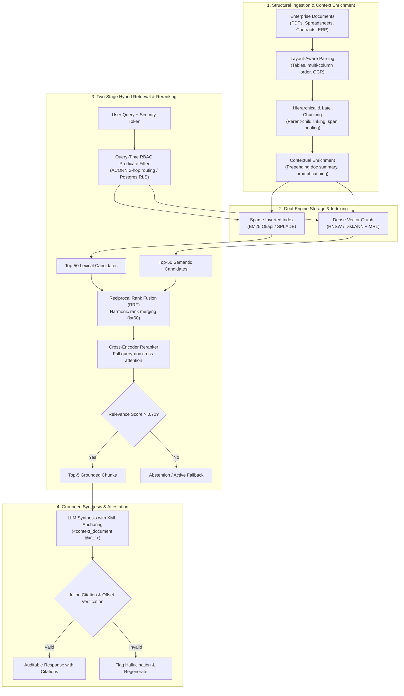

# Phase 02: Enterprise Retrieval & Knowledge Systems (RAG)

> **A rigorous systems architecture curriculum for Senior Developers, Staff Software Engineers, and Solutions Architects designing, scaling, and productionizing enterprise-grade Grounded Retrieval Systems.**

---

## 🏛️ Phase Architecture: The Asymmetric Evidence Synthesis Model

Senior AI Systems Architects treat Retrieval-Augmented Generation (RAG) not as a simple database lookup, but as an **asymmetric, multi-stage Information Retrieval (IR) and evidence synthesis engine**. 

Foundation models possess **parametric memory**—probabilistic statistical weights formed during training that are lossy, static, and prone to hallucinations. Enterprise RAG shifts the burden of factual truth to **non-parametric memory** (authoritative external inverted indexes, vector graphs, and structured knowledge stores).



### Visual Architecture Walkthrough:
1. **Structural Ingestion (Stage 1)**: Ingests enterprise documents using layout-aware parsing to preserve tables and multi-column flows. Documents are partitioned using parent-child hierarchies or Late Chunking, and enriched with contextual summaries before indexing.
2. **Dual-Engine Storage (Stage 2)**: Chunks are dual-indexed into an inverted index (for exact lexical precision on codes and serials) and a metric-space graph (for semantic latent recall), optimized with Matryoshka Representation Learning (MRL).
3. **Two-Stage Retrieval (Stage 3)**: Incoming user queries are bound to tenant security credentials and executed through predicate-aware filters (ACORN). Top candidates are fused via Reciprocal Rank Fusion (`k = 60`) and scored by a deep Cross-Encoder.
4. **Grounded Synthesis (Stage 4)**: Verified evidence chunks are passed into the LLM context window inside explicit XML boundary delimiters. Output text must cite discrete chunk identifiers and token offsets before delivery to the client.

---

## 🧭 Prerequisites & Upstream Knowledge Map

To successfully execute the architectures in this phase, learners should have mastered:

| Upstream Knowledge Domain | Required Concept | Repository Source File |
|---|---|---|
| **Phase 00: Foundations** | BPE Tokenization Mechanics | [`00/02-tokenization-and-bpe-mechanics.md`](../00-foundations-and-token-mechanics/02-tokenization-and-bpe-mechanics.md) |
| **Phase 00: Foundations** | Latent Embeddings & Vector Spaces | [`00/01-transformer-and-hardware-physics.md`](../00-foundations-and-token-mechanics/01-transformer-and-hardware-physics.md) |
| **Phase 00: Foundations** | KV Cache Memory Bandwidth Physics | [`00/03-kv-cache-vram-and-bandwidth-physics.md`](../00-foundations-and-token-mechanics/03-kv-cache-vram-and-bandwidth-physics.md) |
| **Phase 01: Context Engineering** | Context AST Compilation & XML Delimiters | [`01/01-context-ast-architecture.md`](../01-prompt-and-context-engineering/01-context-ast-architecture.md) |
| **Phase 01: Context Engineering** | Prompt Caching Breakpoints | [`01/03-prefix-and-prompt-caching.md`](../01-prompt-and-context-engineering/03-prefix-and-prompt-caching.md) |
| **Phase 01: Context Engineering** | Attention Degradation & Lost in the Middle | [`01/05-mecw-and-context-rot.md`](../01-prompt-and-context-engineering/05-mecw-and-context-rot.md) |

---

## 📊 Architectural Trade-Off: Fine-Tuning vs. Enterprise RAG

When executives ask: *"Why don't we fine-tune a custom internal foundation model on all our company documentation?"*, use this architectural decision matrix:

| Evaluation Dimension | Model Fine-Tuning (LoRA / Full Weights) | Enterprise Grounded RAG Pipeline |
|---|---|---|
| **Primary Engineering Purpose** | Teaches model *how to behave* (style, specialized syntax, strict JSON schemas). | Teaches model *what to know* (authoritative facts, contracts, live inventories). |
| **Data Ingestion Latency** | Days to weeks (data curation, training runs, safety evals). | Milliseconds to minutes (event-driven CDC indexers). |
| **Operational & Compute Cost** | High recurring GPU cluster training costs per update. | Predictable storage and vector search query execution. |
| **Exact Source Attribution** | Impossible (neural weights are fuzzy statistical distributions). | Guaranteed (direct chunk ID, page number, and token offset citations). |
| **Multi-Tenant RBAC** | Impossible (all weights are accessible to every prompt). | Native (query-time metadata filtering matching user identity). |
| **Knowledge Revocation (Right to be Forgotten)** | Impossible without retraining or complex "machine unlearning". | Delete single document/chunk record from vector DB or search index. |

---

## 📚 Curriculum Roadmap: Phase 02 Modular Lessons

Phase 02 is organized into 6 modular engineering lessons, a cloud architecture reference appendix, and an automated hands-on capstone lab:

| # | Lesson / Module | Tier | Est. Time | Core Systems Focus | Key Engineering Outcome |
|---|---|---|---|---|---|
| **01** | [Document Parsing & Structural Chunking Strategies](./01-document-parsing-and-chunking.md) | `HIGH ROI / CORE` | 18 min | Layout-aware boundary detection, tables, Parent-Child hierarchies, Contextual Retrieval prepending, and ColPali visual patch retrieval. | Prevent semantic fragmentation from flattened PDF reading orders and destroyed tables. |
| **02** | [Late Chunking Deep Dive: Deferred Pooling](./02-late-chunking-deep-dive.md) | `REFERENCE / AWARENESS` | 22 min | Full-document token self-attention matrices with deferred chunk span mean-pooling. | Eliminate chunk-boundary context amnesia and resolve ambiguous pronouns across chunk cuts. |
| **03** | [Hybrid Search: Lexical (BM25), Vector Graphs (HNSW/DiskANN) & Memory Physics](./03-hybrid-search-bm25-and-hnsw.md) | `HIGH ROI / CORE` | 20 min | Inverted index mechanics, BM25 term saturation/normalization, HNSW skip list layers, SIMD dot products, DRAM sizing, and DiskANN NVMe scaling. | Build a dual-coordinate retrieval engine combining exact keyword precision with semantic latent recall. |
| **04** | [Reciprocal Rank Fusion & Cross-Encoder Reranking](./04-reciprocal-rank-fusion-and-cross-encoders.md) | `IMPORTANT / NEXT` | 22 min | Score normalization fallacy, RRF harmonic rank math (`k = 60`), Bi-Encoder vs Cross-Encoder attention, and IR metrics (MRR, NDCG). | Fuse disparate lexical and vector candidate ranks and achieve >92% MRR@10 under sub-150ms P99 budgets. |
| **05** | [Predicate Filtering: Multi-Tenant Security & ACORN Graph Navigation](./05-predicate-filtering-and-acorn.md) | `ADVANCED / SPECIALIZED` | 20 min | Graph disconnection vs filter starvation, ACORN 2-hop navigation waypoints, PostgreSQL `pgvector 0.7+` iterative scans and RLS. | Enforce strict enterprise multi-tenant isolation without dropping recall or stalling graph traversal. |
| **06** | [Graph Retrieval-Augmented Generation (GraphRAG) & Ontological Traversal](./06-graphrag-and-entity-traversal.md) | `ADVANCED / SPECIALIZED` | 24 min | Global dataset-wide aggregation failures, Leiden community clustering, LightRAG/Fast-GraphRAG incremental updates, and UNSPSC ontologies. | Answer holistic, corpus-wide analytical questions without hallucinations or unconstrained semantic bleed. |
| **Ref** | [Enterprise Cloud Retrieval Architectures](./reference/cloud-retrieval-architectures.md) | Reference | 15 min | Managed cloud architectures: Azure AI Search, AWS Textract geometry, and GCP Vertex AI Grounding. | Evaluate managed cloud search services vs. custom self-hosted retrieval infrastructure. |
| **Lab** | [Capstone Lab: Enterprise Multi-Tenant Hybrid RAG](./labs/capstone-enterprise-rag-pipeline.md) | Hands-on Lab | 60 min | End-to-end verified hybrid RAG pipeline with strict tenant isolation, RRF fusion, and citation verification. | Automated test suite verification passing `python scripts/verify_lab.py --lab 1`. |

---

### Detailed Module Architecture Guides

### [01. Document Parsing & Structural Chunking Strategies](./01-document-parsing-and-chunking.md) `🟢 Core`
- **Focus**: The upstream reality of enterprise data. Multi-column PDF reading orders, borderless financial table reconstruction, hierarchical parent-child (small-to-big) chunking, Anthropic Contextual Retrieval prepending, and ColPali visual patch retrieval.
- **Mental Model**: The Relational Knowledge Normalizer.

### [02. Late Chunking Deep Dive: Deferred Pooling](./02-late-chunking-deep-dive.md) `⚫ Deep Dive`
- **Focus**: Eliminating chunk-boundary contextual blindness. Processing full documents through long-context transformer encoders before chunk span mean-pooling. Mathematical mechanics, token attention matrices, and runnable Python implementation.
- **Mental Model**: Document-Level Self-Attention with Deferred Boundary Pooling.

### [03. Hybrid Search: Lexical Keyword Matching (BM25), Vector Proximity Graphs (HNSW/DiskANN) & Memory Physics](./03-hybrid-search-bm25-and-hnsw.md) `🟢 Core`
- **Focus**: Why dense vectors fail on exact alphanumeric IDs and negations. Sparse inverted indexes (BM25 Okapi), dense metric-space skip lists (HNSW), SIMD Dot Product optimization, Matryoshka Representation Learning (MRL), vector database RAM sizing physics, and DiskANN NVMe SSD scaling (15–50x RAM reduction).
- **Mental Model**: Dual Coordinate Retrieval (Lexical Coordinate Space + Spatial Proximity Graph).

### [04. Reciprocal Rank Fusion & Cross-Encoder Reranking](./04-reciprocal-rank-fusion-and-cross-encoders.md) `🟡 Engineering Depth`
- **Focus**: The score normalization fallacy. Rank-harmonic candidate merging with RRF (`k = 60`). Bi-Encoder vs. Cross-Encoder full-attention matrices. Query transformations (HyDE, Sub-query), active retrieval decision gates (CRAG/Self-RAG), and formal Information Retrieval ranking metrics (MRR@K, NDCG@K).
- **Mental Model**: Two-Stage Rank-Harmonic Evidence Scoring.

### [05. Predicate Filtering: Multi-Tenant Security & ACORN Graph Navigation](./05-predicate-filtering-and-acorn.md) `🔵 Advanced`
- **Focus**: Solving the filtered vector search dilemma: why pre-filtering causes graph disconnection and post-filtering causes filter starvation. The ACORN paradigm (2-hop neighborhood exploration). Production PostgreSQL `pgvector` 0.7+ iterative scans (`hnsw.iterative_scan`) and Row Level Security (RLS) enforcement.
- **Mental Model**: The Filtered Metric Subgraph & Cryptographic Tenant Perimeter.

### [06. Graph Retrieval-Augmented Generation (GraphRAG) & Ontological Entity Traversal](./06-graphrag-and-entity-traversal.md) `🔵 Advanced`
- **Focus**: The failure of vector search on global aggregation queries. Microsoft GraphRAG hierarchical community detection (Leiden clustering), community summaries, and dynamic incremental updates (LightRAG / Fast-GraphRAG). Constraining entity extraction and multi-hop Cypher queries with formal enterprise ontologies (UNSPSC, MDM) to eliminate semantic bleed.
- **Mental Model**: The Dual-Memory Nexus (Vector Associations constrained by Symbolic Taxonomies).

### [Reference: Enterprise Cloud Retrieval Architectures](./reference/cloud-retrieval-architectures.md) `Platform Appendix`
- **Focus**: Reference configurations for managed enterprise platforms: Azure AI Search (OData security filters, Microsoft Turing Semantic Ranker), AWS Textract (`BLOCK` geometry), Azure Document Intelligence (`prebuilt-layout`), and Google Cloud Vertex AI Search & Grounding.

---

## 🛠️ Hands-On Production Labs & Verified Code

- **Capstone Production Lab**: [`labs/capstone-enterprise-rag-pipeline.md`](./labs/capstone-enterprise-rag-pipeline.md)
  - Implements an enterprise hybrid RAG pipeline with multi-tenant isolation, RRF fusion, cross-encoder reranking, and citation offset verification.
  - Automated grading and evaluation:
    ```bash
    python scripts/verify_lab.py --lab 1
    ```
- **Reference Implementations**:
  - Python 3.12+ Hybrid Pipeline: [`examples/hybrid_rag_pipeline.py`](./examples/hybrid_rag_pipeline.py)
  - C# / .NET 9 Azure AI Search Service: [`examples/HybridSearchService.cs`](./examples/HybridSearchService.cs)
  - C# Project Manifest: [`examples/EnterpriseRag.csproj`](./examples/EnterpriseRag.csproj)

---

## 🧭 Recommended Learning Paths

| Engineering Role | Recommended Lesson Focus | Primary Deliverables |
|---|---|---|
| **AI Systems Architect** | Read All Lessons + Appendix | End-to-end architecture, memory budgets, ontology design, and multi-tenant security. |
| **Backend / Software Engineer** | Lessons 01, 03, 04 + Capstone Lab | Dual-engine hybrid search, RRF candidate fusion, cross-encoder latency budgeting, and lab verification. |
| **Data / Search Platform Lead** | Lessons 02, 03, 05, 06 | Late Chunking, HNSW memory physics, ACORN predicate search, and GraphRAG knowledge graphs. |
| **Cloud Solutions Architect** | Lessons 01, 04, 05 + Appendix | Managed Azure AI Search / AWS Textract pipelines, OData pre-filters, and enterprise RBAC. |

---

## 🧭 Navigation

### Phase Progression
- **Previous Phase**: **[← Phase 01: Prompt & Context Engineering](../01-prompt-and-context-engineering/README.md)**
- **Next Phase**: **[Phase 03: Tools & Model Context Protocol (MCP) →](../03-tools-and-model-context-protocol/README.md)**

### Direct Chapter & Lesson Directory
- **[Lesson 01: Document Parsing & Layout-Aware Chunking](./01-document-parsing-and-chunking.md)**
- **[Lesson 02: Late Chunking Deep Dive: Deferred Pooling](./02-late-chunking-deep-dive.md)**
- **[Lesson 03: Hybrid Search: Lexical Keyword Matching (BM25), Vector Proximity Graphs (HNSW) & Memory Physics](./03-hybrid-search-bm25-and-hnsw.md)**
- **[Lesson 04: Reciprocal Rank Fusion & Cross-Encoder Reranking](./04-reciprocal-rank-fusion-and-cross-encoders.md)**
- **[Lesson 05: Predicate Filtering: Multi-Tenant Security & ACORN Graph Navigation](./05-predicate-filtering-and-acorn.md)**
- **[Lesson 06: Graph Retrieval-Augmented Generation (GraphRAG) & Ontological Entity Traversal](./06-graphrag-and-entity-traversal.md)**
- **[Platform Appendix: Enterprise Cloud Retrieval Architectures](./reference/cloud-retrieval-architectures.md)**
- **[Hands-On Capstone Lab: Enterprise Multi-Tenant Hybrid RAG](./labs/capstone-enterprise-rag-pipeline.md)**

