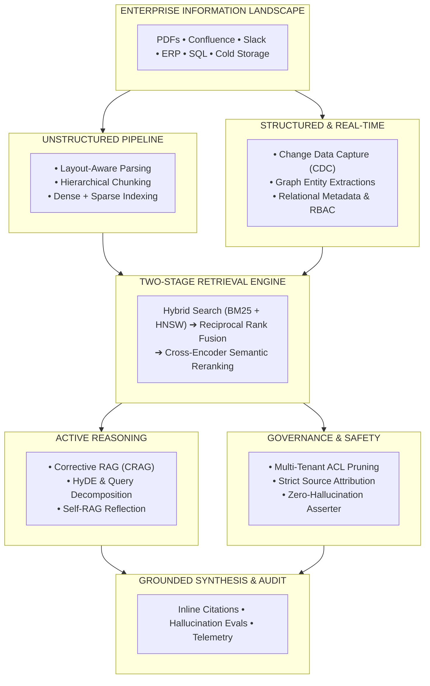
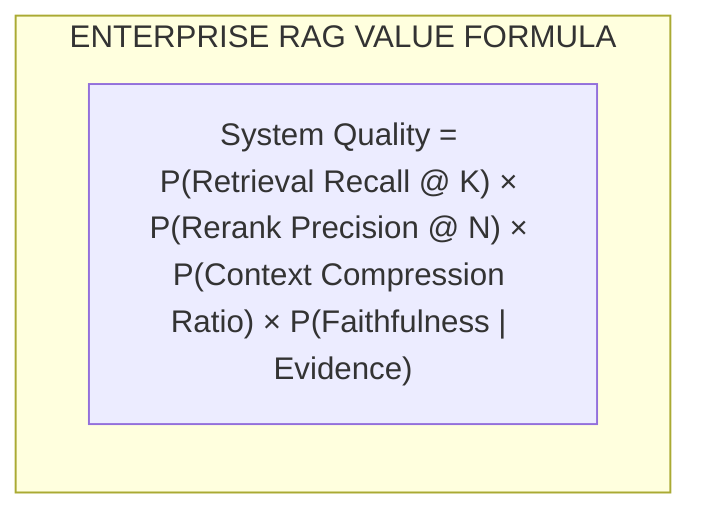
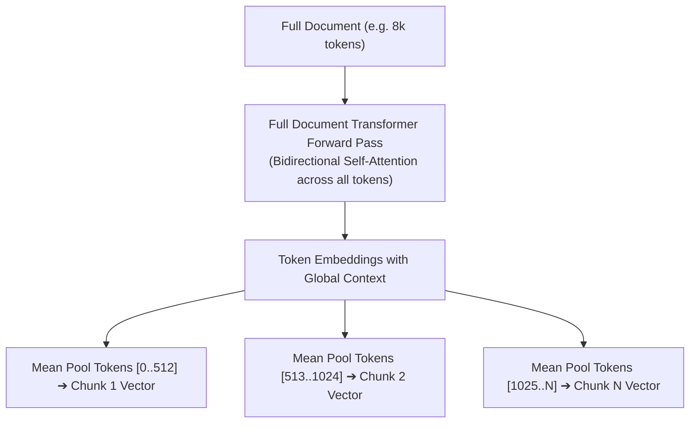
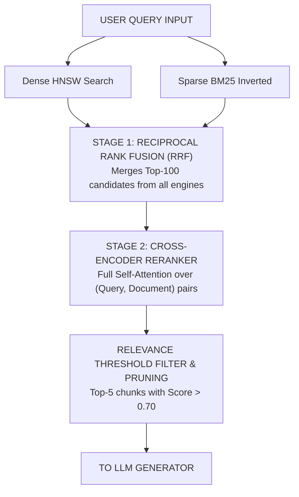

# Phase 02: Enterprise RAG & Knowledge Systems: The Masterclass

> **Hey there! If you're building RAG for the real world, you've probably realized by now that the "hello world" tutorials lied to us. Let's dig into the dirty truth of production RAG and how to actually build knowledge systems that don't hallucinate when things get nuanced.**

---



---

## 1. The Dirty Truth of Naive RAG

Let’s be honest: building a naive RAG pipeline is easy. You take a PDF, slice it into 500-token chunks, embed it with an API, toss it into a vector DB, and run a cosine similarity search. It works perfectly for simple demos. 

But then you deploy it to production. A user asks, "What was our EMEA revenue in Q3 2024 for SKU-90812?" and the system spectacularly fails. It confidently retrieves three random pages mentioning "EMEA", "revenue", or "Q3 2023", completely misses the alphanumeric SKU string, and the LLM hallucinates an extrapolated revenue number. 

Why? Because naive vector search is fundamentally a semantic similarity engine, not an exact-match keyword finder. It blurs precise alphanumeric strings like "SKU-90812" into fuzzy semantic neighborhoods. Moreover, when you stuff 15 retrieved chunks into a prompt, you hit the **"Lost in the Middle"** effect: LLMs pay attention to the beginning and the end of the context window, completely ignoring the crucial facts buried in chunk #7. 

In enterprise engineering, RAG isn't just a database lookup. It's a distributed Information Retrieval and Evidence Synthesis System. 



---

## 2. Late Chunking: Stop Shredding the Book Before Reading It

Think about how naive chunking works. It's like taking a textbook, shredding every page into confetti strips (fixed-size chunks), throwing them in a bin, and then picking one out and trying to understand it out of context. *"The company's revenue grew by 3% in Q2"* — wait, which company? Which year?

**Late Chunking** is a much more intuitive paradigm. Instead of shredding the pages first, imagine reading the *entire book*, understanding the full plot and context, and *then* taking out your highlighter to mark the important paragraphs. 

In practice, this means passing the entire document (e.g., 8,192 tokens) through a long-context embedding encoder first. The transformer’s bidirectional self-attention allows all tokens to attend to the global document context. We then apply chunk boundary mean-pooling at the final layer. The resulting chunks aren't isolated fragments—they carry the global DNA of the whole document.



---

## 3. Hybrid Search & RRF: The Librarian and the Brainstormer

If you rely solely on dense vectors, you'll lose exact keyword matching. Dense vectors are like your highly associative brainstorming friend—great at concepts ("contractor policies"), terrible at exact serial numbers.

On the other hand, Sparse Lexical search (like **BM25**) is the exact, strict librarian. It demands absolute keyword matches and TF-IDF precision.

In a production system, we run a **Two-Stage Multi-Engine Pipeline**. We ask the brainstormer (Dense) and the librarian (Sparse) for their top 50 results. But how do we merge their scores? BM25 scores go from zero to infinity, while cosine similarity is bounded between -1 and 1. 

Enter **Reciprocal Rank Fusion (RRF)**. RRF ignores the arbitrary raw scores and instead looks at the *rank* (position) of the results. 

$$RRF\_Score(d \in D) = \sum_{m \in M} \frac{1}{k + r_m(d)}$$

After fusing, we take the top results and pass them through a **Cross-Encoder Reranker**, which is computationally expensive but incredibly precise because it performs full self-attention over the (Query, Document) pair.



---

## 4. GraphRAG: Why Vectors Can't Draw Org Charts

Vectors are fantastic for local, semantic queries like, *"What is John Doe's phone number?"* 

But what happens when you ask a global aggregation query like, *"How many employees report to VP Sarah across all departments?"* or *"What are the top five systemic risks in our supply chain?"*

A vector database fails miserably here because the answer isn't localized in one chunk; it's scattered across hundreds of relational mentions. To answer this, you need a knowledge graph. 

**GraphRAG** extracts entities and relationships, mapping them out. Then, using community detection algorithms (like Leiden), it clusters the graph into hierarchical communities and pre-generates summaries for each. When a global question arrives, the system routes it across these community summaries instead of raw text, providing a holistic answer.

---

## 5. Security: Multi-Tenant RBAC is Not Optional 🔴

Enterprise knowledge isn't a public library. If an intern searches the assistant, they shouldn't accidentally retrieve the CEO's compensation draft or a restricted HR file. 

You can't just filter the LLM's output after the fact. Security must happen inside the retrieval engine:
- Implement **Query-Time Filter Predicates**. Inject user security tokens (e.g., `user_groups IN ['eng_leads']`) directly into the search engine's query plan *before* it calculates vector distance.

If you filter *after* retrieving the top 100 chunks, you might find that 98 of them get pruned because they belonged to other departments, leaving the LLM starved for context.

---

## 6. The Economics: Fine-Tuning vs. RAG

Execs love asking, *"Why don't we just fine-tune an internal model on all our docs?"*

As a Tech Lead, here is your rule of thumb: 
- Use **Fine-Tuning** to teach a model *how to behave* (style, tone, JSON schemas). 
- Use **RAG** to teach a model *what to know* (real-time metrics, documents, facts).

Fine-tuning takes days, costs a fortune in GPU compute per run, and hallucinates facts. RAG is millisecond-fast, cheap to update (just delete a row in the vector DB), and guarantees exact source attribution. Ingesting a 1M token context window every query costs \$3.00 to \$15.00 per request. RAG costs fractions of a cent.

---

## 7. Production Code Implementations

Complete, production-tested implementations are available in the [`examples/`](./examples/) directory.

### Python: Production Hybrid Search + RRF + Cohere Reranking
> **Implementation**: [`examples/hybrid_rag_pipeline.py`](./examples/hybrid_rag_pipeline.py)

```python
# Reciprocal Rank Fusion (RRF) core algorithm from examples/hybrid_rag_pipeline.py
def reciprocal_rank_fusion(dense_ranks: List[str], sparse_ranks: List[str], k: int = 60) -> List[Tuple[str, float]]:
    scores: Dict[str, float] = defaultdict(float)
    for rank, doc_id in enumerate(dense_ranks):
        scores[doc_id] += 1.0 / (k + rank + 1)
    for rank, doc_id in enumerate(sparse_ranks):
        scores[doc_id] += 1.0 / (k + rank + 1)
    return sorted(scores.items(), key=lambda item: item[1], reverse=True)
```

---

> Build a production enterprise RAG pipeline. See the [full capstone specification](./labs/capstone-enterprise-rag-pipeline.md) for detailed requirements.
