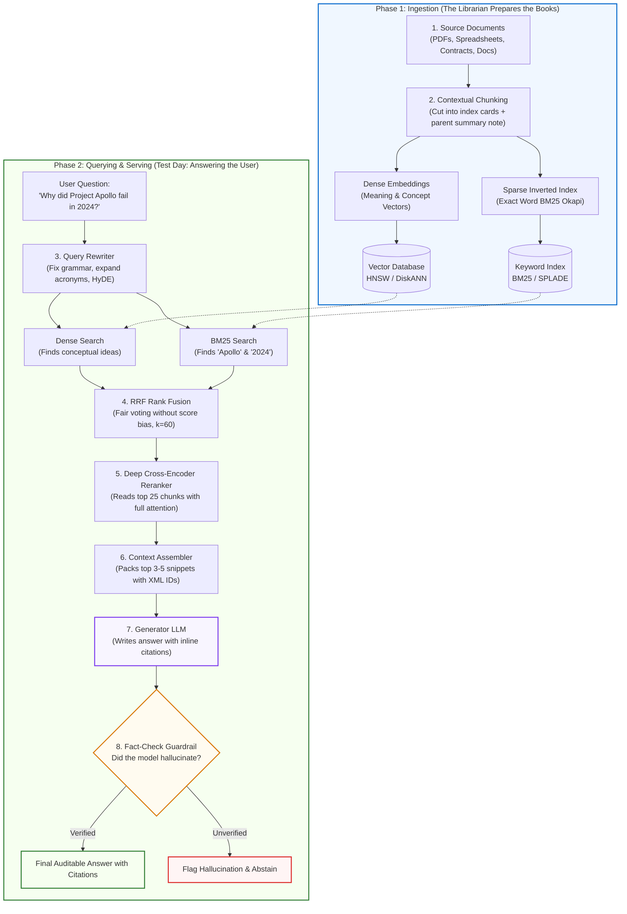

# Phase 02: Enterprise Retrieval & Knowledge Systems (RAG)

> **A rigorous systems architecture curriculum for Senior Developers, Staff Software Engineers, and Solutions Architects designing, scaling, and productionizing enterprise-grade Grounded Retrieval Systems.**

---

## 🧒 What is RAG? (Explain Like I'm 10)

Imagine you have to take the hardest history exam in the world:

* **Without RAG (Closed-Book Exam):** The teacher takes away all your books. You have to answer purely from memory. If you forget a date or who won a battle, your brain panics and might invent a fake answer that sounds convincing. That is called **hallucination**.
* **With RAG (Open-Book Exam):** The teacher lets you bring the entire school library. But the library has 100,000 books, and you only have 30 seconds to answer. You have a super-fast librarian helper who runs into the library stacks, pulls out the exact 3 pages you need, hands them to you, and you read those 3 pages to write down the perfect, verified answer.

**RAG** stands for **Retrieval-Augmented Generation**:
1. **Retrieval**: Finding the exact right pages in the library.
2. **Augmented**: Sticking those pages directly into the model's hand (prompt context).
3. **Generation**: Reading those pages and writing an accurate response with citations.

---

## 🗺️ The Modern RAG Blueprint

Modern production RAG is split into two distinct operational phases: **Phase 1: The Librarian's Prep** (offline ingestion before any question is asked) and **Phase 2: The Student's Test Day** (online runtime when a user asks a question).



### Visual Architecture Walkthrough:
1. **Structural Ingestion (Phase 1)**: Documents are parsed while preserving layout geometry (tables and multi-column order). Chunks are tagged with contextual summaries before being dual-indexed into dense vector graphs (HNSW) and sparse inverted text indexes (BM25).
2. **Online Querying (Phase 2)**: The raw user query is rewritten and expanded before simultaneously searching both indexes.
3. **Rank Harmonization (RRF)**: Reciprocal Rank Fusion combines lexical and semantic candidate lists without score distribution distortion.
4. **Cross-Attention Reranking**: A deep cross-encoder inspects the top candidates token-by-token to weed out false positives.
5. **Grounded Synthesis & Verification**: The LLM synthesizes an answer referencing explicit chunk identifiers, subject to an automated fact-checking gate before delivery.

---

## 🔍 Explaining Every Block (The Story & The Engineering)

### Block 1: Contextual Chunking (Cutting Books into Sticky Notes)
* 🧒 **The Analogy:** If you rip a sentence out of a book that says *"It grew by 15%,"* nobody knows what "It" means! Was it a tomato plant? A company's revenue? A balloon? So, before filing that sentence away, the librarian pastes a tiny sticky note on top: *"This page is from the 2024 Apple Financial Report about iPhone sales."* Now, that sentence makes sense all by itself.
* ⚙️ **The Engineering:** Modern systems use **Contextual Retrieval** (Anthropic) or **Late Chunking**. An LLM reads the entire document first and prepends 50–100 tokens of background context to every small chunk before embedding it, or defers mean-pooling until after full-document transformer self-attention.
* ⚠️ **What happens if you skip this?** Search algorithms get confused by pronouns and isolated fragments, retrieving chunks that mention "it" or "revenue" without knowing which company or topic they belong to.

### Block 2: The Two Catalogs (Vector Embeddings + BM25 Keywords)
* 🧒 **The Analogy:** Imagine a library with two catalogs:
  1. **The Idea Catalog (Vector Search):** You search for *"cute little furry pets that bark,"* and it leads you to dogs, puppies, and golden retrievers, even though you never typed the word "dog".
  2. **The Exact-Word Catalog (BM25 Keyword Search):** You search for error code `0x80070002` or part number `AB-9921`. The Idea Catalog gets confused by random letters and numbers, but the Exact-Word Catalog knows precisely which drawer holds `AB-9921`.
* ⚙️ **The Engineering:** Modern RAG never relies on dense vector search alone. It indexes every chunk twice: into a **Dense Vector Database** (HNSW or DiskANN using `text-embedding-3-small` or `bge-large`) and a **Sparse Inverted Index** (BM25 Okapi or SPLADE).
* ⚠️ **What happens if you skip this?** If you use vector-only search, users searching for serial numbers, invoice IDs, legal statute numbers, or function names will get completely irrelevant results.

### Block 3: The Query Detective (Query Rewriting & HyDE)
* 🧒 **The Analogy:** If a kid asks: *"Why did it break yesterday?"* A human librarian says: *"What broke? What system were you using?"* The detective helper rewrites the question to: *"Troubleshoot error 502 on Payment Gateway Server on Sept 29."*
* ⚙️ **The Engineering:** Raw user prompts are often vague or follow multi-turn conversations (*"What about its battery?"* ➔ *"What is the battery life of the iPhone 16 Pro?"*). We can also use **HyDE** (Hypothetical Document Embeddings), where a small model guesses what a textbook answer might look like, and we search using that fake answer!
* ⚠️ **What happens if you skip this?** Short, conversational questions return low-quality search results because the user's brief question doesn't share vocabulary with technical manuals.

### Block 4: The Twin Search & The Judge (Hybrid Search + RRF)
* 🧒 **The Analogy:** Both helpers run into the stacks. The Idea Helper brings back 20 books. The Keyword Helper brings back 20 books. How do you decide who wins? You don't try to compare their feelings; you look at the rankings. If a book was in the top 3 on **both** helpers' lists, that book is almost certainly the winner!
* ⚙️ **The Engineering:** This is **Reciprocal Rank Fusion (RRF)**. It ignores raw score numbers (which can't be added together) and adds inverse rank scores:
  ```text
  Score(doc) = Σ [ 1 / (60 + Rank_i) ]
  ```
* ⚠️ **What happens if you skip this?** One search method will dominate and drown out the other because vector cosine scores (0.0 to 1.0) and BM25 scores (0 to 50+) are completely incompatible.

### Block 5: The Magnifying Glass (Cross-Encoder Reranker)
* 🧒 **The Analogy:** The fast helpers grabbed 25 possible pages in 10 milliseconds. Now, a master inspector puts on glasses, reads the user's question, carefully reads all 25 candidate pages one by one, and picks the top 3 absolute gold-standard pages.
* ⚙️ **The Engineering:** Fast retrieval uses bi-encoders (vectors computed separately). A **Cross-Encoder Reranker** (like `Cohere Rerank`, `BGE-Reranker-v2`, or `FlashRank`) feeds the query and document chunk into the transformer attention mechanism together, calculating full token-to-token attention.
* ⚠️ **What happens if you skip this?** Top candidates often contain the right keywords in the wrong context. Rerankers boost retrieval precision by 20% to 35%.

### Block 6: Smart Packing & Open-Book Generation
* 🧒 **The Analogy:** The student gets the top 3 pages, neatly arranged on their desk. The teacher says: *"Answer the question. If the answer is on page 4, write [Page 4]. If the answer is not in these pages, say 'I don't know'—do not make up a story!"*
* ⚙️ **The Engineering:** Context assembly packs the chunks with explicit metadata IDs into structured XML boundary tags:
  ```text
  Context Snippets:
  <document id="doc_1" source="manual.pdf#page=12">
  To reset, hold power for 10 seconds.
  </document>

  Instruction: Base your response exclusively on the context above. Include citations.
  ```
* ⚠️ **What happens if you skip this?** If you stuff 50 messy chunks into the model, the model suffers from the **"Lost in the Middle"** phenomenon—it remembers the first and last chunk, but completely ignores what is in the center.

### Block 7: The Fact-Checker Bouncer (Evaluations & Guardrails)
* 🧒 **The Analogy:** Before the student hands their test paper to the teacher, an independent hall monitor checks every single sentence against the open textbook. If the student wrote something that isn't highlighted in the book, the monitor erases it!
* ⚙️ **The Engineering:** An automated judge model checks **Groundedness & Faithfulness**:
  1. *Is every claim in the response directly supported by the retrieved snippets?*
  2. *Did the answer actually address what the user originally asked?*
* ⚠️ **What happens if you skip this?** Silent hallucinations slip through into production customer chats without anyone noticing until a customer complains.

---

## 📊 Old RAG (2023) vs. Modern Production RAG (2026)

| Feature / Dimension | Naive RAG Prototype (2023) | Modern Enterprise RAG Pipeline (2026) |
|---|---|---|
| **Chunking** | Blind fixed 500-character slices | Layout-aware semantic parsing + Contextual summary prepending |
| **Search Engine** | Dense vector search only | **Hybrid Search**: Dense Vectors (HNSW) + Sparse Keywords (BM25) |
| **Score Merging** | Heuristic distance thresholds | **Reciprocal Rank Fusion (RRF)** (`k = 60`) |
| **Precision Filter** | None (sends raw top-k to LLM) | **Cross-Encoder Reranker** (token-to-token attention) |
| **Security & RBAC** | None (searches entire corpus) | **Predicate-aware filtering** (ACORN graph routing / Postgres RLS) |
| **Safety Net** | "Trust the model's vibes" | **Groundedness & Faithfulness Evals** with abstention |

---

## 🧠 Quick Check to See if it Clicked

Test your architectural intuition:

> **Scenario:** A customer searches: *"Why is transaction tx_9941a failing with status code 504?"*
> 
> If our system only used **Dense Vector Search (Ideas)**, why would it struggle to find the right document, and which block in our modern workflow saves the day?

<details>
<summary><b>View Solution</b></summary>

1. **Why Dense Vector Search Fails**: Dense embeddings excel at broad conceptual intent (e.g. *"payment failed timeout"*), but compress exact alphanumeric transaction IDs (`tx_9941a`) and status codes (`504`) into fuzzy subword tokens. It is likely to return unrelated error documents that happen to discuss 500-series errors.
2. **Which Block Saves the Day**: **Block 2 (BM25 Keyword Search)** and **Block 4 (Reciprocal Rank Fusion)**! BM25 maintains a photographic inverted index matching the exact alphanumeric string `"tx_9941a"`. RRF merges the BM25 exact match with the vector semantic context, rocketing the true log entry to Rank #1.
</details>

---

## 🧭 Prerequisites & Upstream Knowledge Map

To successfully execute the architectures in this phase, learners should have mastered:

| Upstream Knowledge Domain | Required Concept | Repository Source File |
|---|---|---|
| **Phase 00: Foundations** | BPE Tokenization Mechanics | [`00/02-tokenization-and-bpe-mechanics.md`](../00-foundations-and-token-mechanics/02-tokenization-and-bpe-mechanics.md) |
| **Phase 00: Foundations** | Latent Embeddings & Vector Spaces | [`00/01-transformer-and-hardware-physics.md`](../00-foundations-and-token-mechanics/01-transformer-and-hardware-physics.md) |
| **Phase 00: Foundations** | KV Cache Memory Bandwidth Physics | [`00/03-kv-cache-vram-and-bandwidth-physics.md`](../00-foundations-and-token-mechanics/03-kv-cache-vram-and-bandwidth-physics.md) |
| **Phase 01: Context Engineering** | Context AST Compilation & XML Delimiters | [`01/01-context-ast-architecture.md`](../01-prompt-and-context-engineering/01-context-ast-architecture.md) |
| **Phase 01: Context Engineering** | Prompt Caching Breakpoints | [`01/03-prefix-and-prompt-caching.md`](../01-prompt-and-context-engineering/03-prefix-and-prompt-caching.md) |
| **Phase 01: Context Engineering** | Attention Degradation & Lost in the Middle | [`01/05-mecw-and-context-rot.md`](../01-prompt-and-context-engineering/05-mecw-and-context-rot.md) |

---

## 📊 Architectural Trade-Off: Fine-Tuning vs. Enterprise RAG

When executives ask: *"Why don't we fine-tune a custom internal foundation model on all our company documentation?"*, use this architectural decision matrix:

| Evaluation Dimension | Model Fine-Tuning (LoRA / Full Weights) | Enterprise Grounded RAG Pipeline |
|---|---|---|
| **Primary Engineering Purpose** | Teaches model *how to behave* (style, specialized syntax, strict JSON schemas). | Teaches model *what to know* (authoritative facts, contracts, live inventories). |
| **Data Ingestion Latency** | Days to weeks (data curation, training runs, safety evals). | Milliseconds to minutes (event-driven CDC indexers). |
| **Operational & Compute Cost** | High recurring GPU cluster training costs per update. | Predictable storage and vector search query execution. |
| **Exact Source Attribution** | Impossible (neural weights are fuzzy statistical distributions). | Guaranteed (direct chunk ID, page number, and token offset citations). |
| **Multi-Tenant RBAC** | Impossible (all weights are accessible to every prompt). | Native (query-time metadata filtering matching user identity). |
| **Knowledge Revocation (Right to be Forgotten)** | Impossible without retraining or complex "machine unlearning". | Delete single document/chunk record from vector DB or search index. |

---

## 📚 Curriculum Roadmap: Phase 02 Modular Lessons

Phase 02 is organized into 6 modular engineering lessons, a cloud architecture reference appendix, and an automated hands-on capstone lab:

| # | Lesson / Module | Tier | Est. Time | Core Systems Focus | Key Engineering Outcome |
|---|---|---|---|---|---|
| **01** | [Document Parsing & Structural Chunking Strategies](./01-document-parsing-and-chunking.md) | `HIGH ROI / CORE` | 18 min | Layout-aware boundary detection, tables, Parent-Child hierarchies, Contextual Retrieval prepending, and ColPali visual patch retrieval. | Prevent semantic fragmentation from flattened PDF reading orders and destroyed tables. |
| **02** | [Late Chunking Deep Dive: Deferred Pooling](./02-late-chunking-deep-dive.md) | `REFERENCE / AWARENESS` | 22 min | Full-document token self-attention matrices with deferred chunk span mean-pooling. | Eliminate chunk-boundary context amnesia and resolve ambiguous pronouns across chunk cuts. |
| **03** | [Hybrid Search: Lexical (BM25), Vector Graphs (HNSW/DiskANN) & Memory Physics](./03-hybrid-search-bm25-and-hnsw.md) | `HIGH ROI / CORE` | 20 min | Inverted index mechanics, BM25 term saturation/normalization, HNSW skip list layers, SIMD dot products, DRAM sizing, and DiskANN NVMe scaling. | Build a dual-coordinate retrieval engine combining exact keyword precision with semantic latent recall. |
| **04** | [Reciprocal Rank Fusion & Cross-Encoder Reranking](./04-reciprocal-rank-fusion-and-cross-encoders.md) | `IMPORTANT / NEXT` | 22 min | Score normalization fallacy, RRF harmonic rank math (`k = 60`), Bi-Encoder vs Cross-Encoder attention, and IR metrics (MRR, NDCG). | Fuse disparate lexical and vector candidate ranks and achieve >92% MRR@10 under sub-150ms P99 budgets. |
| **05** | [Predicate Filtering: Multi-Tenant Security & ACORN Graph Navigation](./05-predicate-filtering-and-acorn.md) | `ADVANCED / SPECIALIZED` | 20 min | Graph disconnection vs filter starvation, ACORN 2-hop navigation waypoints, PostgreSQL `pgvector 0.7+` iterative scans and RLS. | Enforce strict enterprise multi-tenant isolation without dropping recall or stalling graph traversal. |
| **06** | [Graph Retrieval-Augmented Generation (GraphRAG) & Ontological Traversal](./06-graphrag-and-entity-traversal.md) | `ADVANCED / SPECIALIZED` | 24 min | Global dataset-wide aggregation failures, Leiden community clustering, LightRAG/Fast-GraphRAG incremental updates, and UNSPSC ontologies. | Answer holistic, corpus-wide analytical questions without hallucinations or unconstrained semantic bleed. |
| **Ref** | [Enterprise Cloud Retrieval Architectures](./reference/cloud-retrieval-architectures.md) | Reference | 15 min | Managed cloud architectures: Azure AI Search, AWS Textract geometry, and GCP Vertex AI Grounding. | Evaluate managed cloud search services vs. custom self-hosted retrieval infrastructure. |
| **Lab** | [Capstone Lab: Enterprise Multi-Tenant Hybrid RAG](./labs/capstone-enterprise-rag-pipeline.md) | Hands-on Lab | 60 min | End-to-end verified hybrid RAG pipeline with strict tenant isolation, RRF fusion, and citation verification. | Automated test suite verification passing `python scripts/verify_lab.py --lab 1`. |

---

### Detailed Module Architecture Guides

### [01. Document Parsing & Structural Chunking Strategies](./01-document-parsing-and-chunking.md) `🟢 Core`
- **Focus**: The upstream reality of enterprise data. Multi-column PDF reading orders, borderless financial table reconstruction, hierarchical parent-child (small-to-big) chunking, Anthropic Contextual Retrieval prepending, and ColPali visual patch retrieval.
- **Mental Model**: The Relational Knowledge Normalizer.

### [02. Late Chunking Deep Dive: Deferred Pooling](./02-late-chunking-deep-dive.md) `⚫ Deep Dive`
- **Focus**: Eliminating chunk-boundary contextual blindness. Processing full documents through long-context transformer encoders before chunk span mean-pooling. Mathematical mechanics, token attention matrices, and runnable Python implementation.
- **Mental Model**: Document-Level Self-Attention with Deferred Boundary Pooling.

### [03. Hybrid Search: Lexical Keyword Matching (BM25), Vector Proximity Graphs (HNSW/DiskANN) & Memory Physics](./03-hybrid-search-bm25-and-hnsw.md) `🟢 Core`
- **Focus**: Why dense vectors fail on exact alphanumeric IDs and negations. Sparse inverted indexes (BM25 Okapi), dense metric-space skip lists (HNSW), SIMD Dot Product optimization, Matryoshka Representation Learning (MRL), vector database RAM sizing physics, and DiskANN NVMe SSD scaling (15–50x RAM reduction).
- **Mental Model**: Dual Coordinate Retrieval (Lexical Coordinate Space + Spatial Proximity Graph).

### [04. Reciprocal Rank Fusion & Cross-Encoder Reranking](./04-reciprocal-rank-fusion-and-cross-encoders.md) `🟡 Engineering Depth`
- **Focus**: The score normalization fallacy. Rank-harmonic candidate merging with RRF (`k = 60`). Bi-Encoder vs. Cross-Encoder full-attention matrices. Query transformations (HyDE, Sub-query), active retrieval decision gates (CRAG/Self-RAG), and formal Information Retrieval ranking metrics (MRR@K, NDCG@K).
- **Mental Model**: Two-Stage Rank-Harmonic Evidence Scoring.

### [05. Predicate Filtering: Multi-Tenant Security & ACORN Graph Navigation](./05-predicate-filtering-and-acorn.md) `🔵 Advanced`
- **Focus**: Solving the filtered vector search dilemma: why pre-filtering causes graph disconnection and post-filtering causes filter starvation. The ACORN paradigm (2-hop neighborhood exploration). Production PostgreSQL `pgvector` 0.7+ iterative scans (`hnsw.iterative_scan`) and Row Level Security (RLS) enforcement.
- **Mental Model**: The Filtered Metric Subgraph & Cryptographic Tenant Perimeter.

### [06. Graph Retrieval-Augmented Generation (GraphRAG) & Ontological Entity Traversal](./06-graphrag-and-entity-traversal.md) `🔵 Advanced`
- **Focus**: The failure of vector search on global aggregation queries. Microsoft GraphRAG hierarchical community detection (Leiden clustering), community summaries, and dynamic incremental updates (LightRAG / Fast-GraphRAG). Constraining entity extraction and multi-hop Cypher queries with formal enterprise ontologies (UNSPSC, MDM) to eliminate semantic bleed.
- **Mental Model**: The Dual-Memory Nexus (Vector Associations constrained by Symbolic Taxonomies).

### [Reference: Enterprise Cloud Retrieval Architectures](./reference/cloud-retrieval-architectures.md) `Platform Appendix`
- **Focus**: Reference configurations for managed enterprise platforms: Azure AI Search (OData security filters, Microsoft Turing Semantic Ranker), AWS Textract (`BLOCK` geometry), Azure Document Intelligence (`prebuilt-layout`), and Google Cloud Vertex AI Search & Grounding.

---

## 🛠️ Hands-On Production Labs & Verified Code

- **Capstone Production Lab**: [`labs/capstone-enterprise-rag-pipeline.md`](./labs/capstone-enterprise-rag-pipeline.md)
  - Implements an enterprise hybrid RAG pipeline with multi-tenant isolation, RRF fusion, cross-encoder reranking, and citation offset verification.
  - Automated grading and evaluation:
    ```bash
    python scripts/verify_lab.py --lab 1
    ```
- **Reference Implementations**:
  - Python 3.12+ Hybrid Pipeline: [`examples/hybrid_rag_pipeline.py`](./examples/hybrid_rag_pipeline.py)
  - C# / .NET 9 Azure AI Search Service: [`examples/HybridSearchService.cs`](./examples/HybridSearchService.cs)
  - C# Project Manifest: [`examples/EnterpriseRag.csproj`](./examples/EnterpriseRag.csproj)

---

## 🧭 Recommended Learning Paths

| Engineering Role | Recommended Lesson Focus | Primary Deliverables |
|---|---|---|
| **AI Systems Architect** | Read All Lessons + Appendix | End-to-end architecture, memory budgets, ontology design, and multi-tenant security. |
| **Backend / Software Engineer** | Lessons 01, 03, 04 + Capstone Lab | Dual-engine hybrid search, RRF candidate fusion, cross-encoder latency budgeting, and lab verification. |
| **Data / Search Platform Lead** | Lessons 02, 03, 05, 06 | Late Chunking, HNSW memory physics, ACORN predicate search, and GraphRAG knowledge graphs. |
| **Cloud Solutions Architect** | Lessons 01, 04, 05 + Appendix | Managed Azure AI Search / AWS Textract pipelines, OData pre-filters, and enterprise RBAC. |

---

## 🧭 Navigation

### Phase Progression
- **Previous Phase**: **[← Phase 01: Prompt & Context Engineering](../01-prompt-and-context-engineering/README.md)**
- **Next Phase**: **[Phase 03: Tools & Model Context Protocol (MCP) →](../03-tools-and-model-context-protocol/README.md)**

### Direct Chapter & Lesson Directory
- **[Lesson 01: Document Parsing & Layout-Aware Chunking](./01-document-parsing-and-chunking.md)**
- **[Lesson 02: Late Chunking Deep Dive: Deferred Pooling](./02-late-chunking-deep-dive.md)**
- **[Lesson 03: Hybrid Search: Lexical Keyword Matching (BM25), Vector Proximity Graphs (HNSW) & Memory Physics](./03-hybrid-search-bm25-and-hnsw.md)**
- **[Lesson 04: Reciprocal Rank Fusion & Cross-Encoder Reranking](./04-reciprocal-rank-fusion-and-cross-encoders.md)**
- **[Lesson 05: Predicate Filtering: Multi-Tenant Security & ACORN Graph Navigation](./05-predicate-filtering-and-acorn.md)**
- **[Lesson 06: Graph Retrieval-Augmented Generation (GraphRAG) & Ontological Entity Traversal](./06-graphrag-and-entity-traversal.md)**
- **[Platform Appendix: Enterprise Cloud Retrieval Architectures](./reference/cloud-retrieval-architectures.md)**
- **[Hands-On Capstone Lab: Enterprise Multi-Tenant Hybrid RAG](./labs/capstone-enterprise-rag-pipeline.md)**

