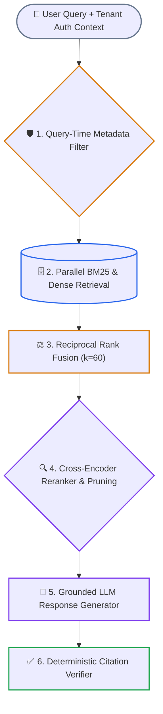

# Capstone Engineering Challenge: Multi-Tenant Enterprise Hybrid RAG

> **Lab Type**: Production Verification & Implementation | **Automated Test Runner**: `python scripts/verify_lab.py --lab 1`  
> **Prerequisites**: [Phase 02: Hybrid Search](../03-hybrid-search-bm25-and-hnsw.md), [Phase 02: RRF & Reranking](../04-reciprocal-rank-fusion-and-cross-encoders.md), [Phase 02: Predicate Filtering](../05-predicate-filtering-and-acorn.md)

---

## 1. Challenge Objective

Build a standalone, production-grade **Enterprise Multi-Tenant Hybrid RAG Pipeline** that enforces:
1. **Layout-Aware Ingestion**: Preserving structural metadata (`document_id`, `tenant_id`, `section_title`, `chunk_id`).
2. **Two-Stage Hybrid Retrieval**: Combining lexical BM25 search with dense vector similarity, fused via **Reciprocal Rank Fusion** (`k = 60`).
3. **Multi-Tenant Security Isolation**: Enforcing query-time tenant metadata pre-filtering to prevent cross-tenant information leakage and filter starvation.
4. **Cross-Encoder Reranking & Quality Cutoff**: Scoring the top-20 fused candidates and discarding low-relevance chunks (< 0.70 threshold).
5. **Deterministic Citation Verification**: Checking that generated responses include explicit inline citations (`[DocTitle:ChunkId]`) matching verified evidence.

---

## 🏛️ Pipeline System Architecture



### Diagram Walkthrough: Enterprise Hybrid RAG Execution Pipeline

1. **User Query + Tenant Auth Context**: Intercepts user query and strictly binds caller tenant credentials.
2. **Query-Time Metadata Filter**: Enforces hard SQL-level or payload-level partitioning before scoring vectors to eliminate cross-tenant leakage.
3. **Parallel BM25 & Dense Retrieval**: Executes lexical keyword search and cosine similarity concurrently against tenant-isolated indexes.
4. **Reciprocal Rank Fusion**: Merges candidate rankings using the harmonic RRF formula (`k = 60`) to balance exact keyword hits and semantic associations.
5. **Cross-Encoder Reranker**: Performs full-attention cross-scoring on top-20 candidates, discarding irrelevant chunks below the 0.70 threshold.
6. **Citation Verifier**: Validates that all generated inline citations (`[DocId:ChunkId]`) match retrieved evidence, rejecting or abstaining if unsupported claims are made.

---

## 2. Architectural Specifications & Acceptance Criteria

| Inspection Dimension | Production Acceptance Standard | Automated Verification Check |
|---|---|---|
| **1. Dual-Index Ingestion** | Ingest documents into parallel BM25 lexical postings and normalized dense vector storage. | `agent_forge.retrieval.hybrid_engine.HybridRetriever.index_documents()` |
| **2. Multi-Tenant Filtering** | Given Tenant A and Tenant B documents containing identical search terms, a search authorized for Tenant A **must return 0% Tenant B documents**. | Query-time predicate enforcement with zero cross-tenant contamination. |
| **3. Rank-Harmonic Fusion** | Fuse BM25 and Dense candidate ranks using Reciprocal Rank Fusion (`k = 60`):<br>`RRF_Score(d) = Σ [ 1 / (60 + rank_m(d)) ]` | Concordant top documents achieve elevated rank. |
| **4. Relevance Pruning** | Filter out candidates scoring below the minimum threshold (0.65–0.70) to prevent prompt noise pollution. | Low-relevance candidate suppression. |
| **5. Citation & Abstention** | Responses must cite evidence chunks using `[DocId:ChunkId]`. If evidence is insufficient, system must return an explicit abstention. | Zero hallucination on unanswerable out-of-domain queries. |

---

## 3. Automated Verification via `scripts/verify_lab.py`

This capstone challenge is harmonized with the canonical repository evaluation harness.

To test and grade your implementation:

```bash
# Run automated verification for Lab 1 (Multi-Tenant Hybrid RAG)
python scripts/verify_lab.py --lab 1
```

### Expected Test Harness Output:
```text
[✅ PASS] Lab 1: Multi-Tenant Hybrid RAG with RRF & Isolation
       Successfully indexed multi-tenant corpus. Tenant A query returned 1 hits, 0 leakage. RRF score = 0.03226.
```

---

## 4. Hands-On Step-by-Step Implementation Blueprint

### Step 1: Document Indexing & Tenant Metadata Binding
- Parse the enterprise knowledge corpus into discrete chunks.
- Bind every chunk to a strict metadata schema:
  ```python
  {
      "id": "doc_sec_001",
      "content": "SKU-9942 enterprise high-performance database cluster specs...",
      "metadata": {
          "tenant_id": "tenant_a",
          "department": "infrastructure",
          "classification": "confidential"
      }
  }
  ```
- Index chunks into the BM25 inverted index and normalized vector store.

### Step 2: Query-Time Predicate Enforcement
- Intercept the incoming query and bind the authenticated `tenant_id`.
- Execute parallel lexical and dense searches restricted *strictly* to matching tenant chunks.

### Step 3: Reciprocal Rank Fusion & Reranking
- Extract top-20 ranks from BM25 and top-20 ranks from vector search.
- Merge lists using the RRF formula:
  ```text
  RRF_Score(d) = (1 / (60 + rank_bm25(d))) + (1 / (60 + rank_dense(d)))
  ```
- Pass top fused candidates through the Cross-Encoder reranker.

### Step 4: Grounded Synthesis with Citation Verifier
- Wrap retrieved chunks in explicit XML tags:
  ```xml
  <context_document id="doc_sec_001" tenant="tenant_a">
    ...content...
  </context_document>
  ```
- Enforce inline citation format: `[doc_sec_001:p1]`.
- Implement deterministic post-verification:
  1. Does the response contain at least one valid citation?
  2. Are all cited IDs present in the retrieved evidence set?
  3. If verification fails, return: *"I do not have sufficient verified evidence to answer this question."*

---

## 5. Evaluation Protocol

To validate your pipeline, execute an evaluation test suite containing 20 test questions:
- **10 In-Domain Answerable Questions**: Target: 100% precision, 0 hallucinations, valid inline citations.
- **5 Out-of-Domain Unanswerable Questions**: Target: 100% correct abstention, zero guesses.
- **5 Adversarial Trick Questions**: Questions with contradictory or negated premises (Target: 100% detection of contradiction).

---

## 6. Navigation
- [Return to Phase 02 Hub](../README.md)
- [Canonical Root Lab Specification](../../labs/lab-01-multi-tenant-hybrid-rag.md)
- [Reference Implementation: `examples/hybrid_rag_pipeline.py`](../examples/hybrid_rag_pipeline.py)
