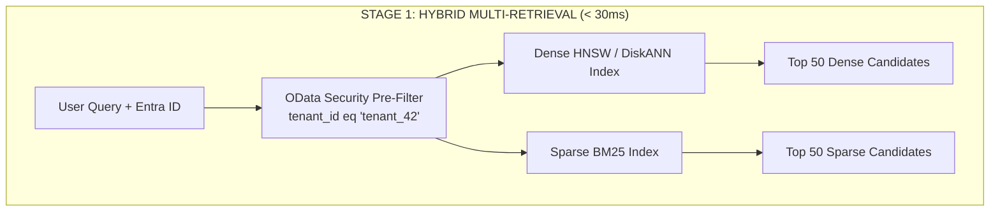
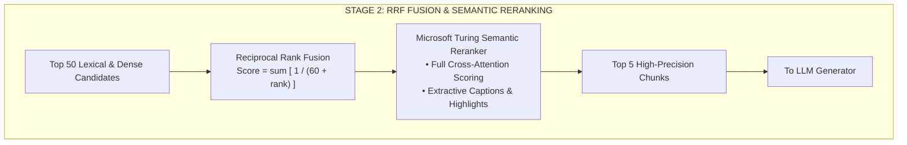
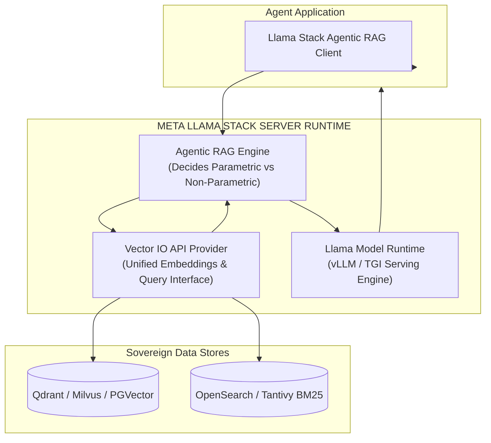

# Reference Architecture: Enterprise Cloud Retrieval Platforms

> **Role**: Platform Reference Appendix | **Focus**: Azure AI Search, AWS Textract, Azure Document Intelligence, Google Cloud Vertex AI, Meta Llama Stack

---

## 1. Overview & Cloud Grounding Role

While Lessons 00 through 06 establish the universal, platform-agnostic algorithms and data structures of enterprise Information Retrieval, many enterprise organizations standardize on managed cloud retrieval platforms.

This appendix provides reference deployment architectures, query specifications, and ingestion patterns for:
1. **Azure AI Search & Microsoft Foundry** (Enterprise Hybrid Search & Semantic Reranking)
2. **Azure Document Intelligence** (`prebuilt-layout` Document Decomposition)
3. **AWS Textract** (`AnalyzeDocument` Spatial Geometry Trees)
4. **Google Cloud Vertex AI Search & Grounding** (Enterprise Datastores & Web Grounding)
5. **Meta Llama Stack** (`vector_io` API & Agentic RAG)

---

## 2. Azure AI Search Architecture (Microsoft Ecosystem)

In Microsoft Azure enterprise environments, **Azure AI Search** serves as the managed retrieval engine, providing native two-stage hybrid search, multi-tenant RBAC, and integrated deep cross-attention semantic reranking.



#### Diagram Walkthrough:
1. **Security Pre-Filter**: Client requests arrive with an Entra ID JWT token. Azure AI Search evaluates an OData security filter expression *before* vector traversal, ensuring zero cross-tenant contamination.
2. **Parallel Hybrid Retrieval**: The query executes simultaneously against the Lucene-based BM25 inverted index and the HNSW/DiskANN vector index.
3. **Candidate Output**: Both engines return independent top-50 candidate pools for rank harmonization.



#### Diagram Walkthrough:
1. **RRF Merging**: Top candidate ranks from dense and sparse search are combined using Reciprocal Rank Fusion.
2. **Turing Semantic Reranker**: Microsoft's proprietary Turing cross-encoder scores token-to-token semantic relevance.
3. **Extractive Captions**: The reranker returns the definitive top-5 chunks with character highlight offsets for prompt context assembly.

### Production Query Payload Example
```json
{
  "search": "enterprise security policy remote work",
  "vectorQueries": [
    {
      "kind": "vector",
      "vector": [0.0124, -0.0482, 0.0891, 0.1142],
      "fields": "content_vector",
      "k": 50
    }
  ],
  "filter": "tenant_id eq 'tenant-corp-01' and security_principals/any(p: search.in(p, 'group-infosec,group-engineering,user-alice'))",
  "queryType": "semantic",
  "semanticConfiguration": "default-semantic-config",
  "queryCaption": "extractive|highlight-true",
  "top": 5
}
```

---

## 3. Cloud Document Layout Extraction: Azure vs. AWS

Enterprise pipelines ingest complex artifacts: multi-column whitepapers, financial statements with borderless tables, and scanned forms.

### 3.1. Azure Document Intelligence (`prebuilt-layout`)
- **Reading Order Detection**: Reconstructs multi-column pages into natural reading order using geometric bounding polygons (`[x1, y1, x2, y2, x3, y4]`), eliminating horizontal cross-bleeding.
- **Tabular Markdown Serialization**: Recognizes cell spans (`rowSpan`, `columnSpan`) and converts complex financial statements into clean GitHub Flavored Markdown tables (`| H1 | H2 |`), preserving coordinate alignment.
- **Selection Mark Recognition**: Detects checkbox and radio button states (`selected` vs `unselected`) in corporate compliance forms.

### 3.2. AWS Textract (`AnalyzeDocument`)
- **Block Relationship Graph**: Textract outputs a JSON graph of `BLOCK` objects linked by `Relationships`:
  - `PAGE` blocks link to `LAYOUT_SECTION_HEADER`, `LAYOUT_TEXT`, and `TABLE` blocks.
  - `TABLE` blocks contain `CELL` blocks referencing coordinate matrices with `RowIndex` and `ColumnIndex`.
  - `KEY_VALUE_SET` blocks link `KEY` (question label) to `VALUE` (form answer) via spatial proximity heuristics.
- **Assembly Pattern**: A serverless AWS Lambda reconstructs this block hierarchy into semantic Markdown, wrapping tables in isolated chunks to guarantee they are never sliced mid-row.

---

## 4. Document Parser Architectural Comparison Matrix

| Architectural Feature | Naive Text Extractors (`pypdf`, `pymupdf`) | Azure Document Intelligence (`prebuilt-layout`) | AWS Textract (`AnalyzeDocument`) | Frontier Multimodal Vision (ColPali) |
|---|---|---|---|---|
| **Multi-Column Reading Order** | Fails (merges lines horizontally) | **Near Perfect (Geometric polygon sort)** | **Near Perfect (Layout blocks)** | Excellent (Native visual attention) |
| **Complex Borderless Tables** | Completely scrambled | **Exceptional (Outputs valid Markdown/HTML)** | **Exceptional (Cell coordinate grid)** | Good (Risk of hallucinating numbers) |
| **Form Key-Value Pairs** | Lost in raw text | Extracted via `prebuilt-document` | **Native `FORMS` block extraction** | Excellent with prompt extraction |
| **Processing Latency** | **Fastest (< 100ms/page)** | 1.5–3.0s / page | 2.0–4.0s / page | 3.0–8.0s / page |
| **Processing Cost (1,000 pgs)** | Free (Self-hosted CPU) | ~USD 10.00 | ~USD 15.00–20.00 | ~USD 10.00–30.00 |
| **Best Production Fit** | Plain text single-column novels/logs | **Enterprise PDFs, financial reports, contracts** | **Government forms, claims, loan documents** | Complex diagrams, engineering blueprints |

---

## 5. Google Cloud Vertex AI Search & Grounding

In Google Cloud environments, **Vertex AI Search & Grounding** enables hybrid enterprise retrieval paired with live Google Search grounding:

1. **Enterprise Datastores**:
   - Automated ingestion connectors for Cloud Storage (GCS), BigQuery, Google Drive, Jira, and Confluence.
   - Built-in layout chunking, semantic embedding generation, and managed vector indexing.
2. **Dynamic Retrieval Thresholding**:
   - The model dynamically evaluates query complexity: straightforward queries are answered directly from parametric memory; queries requiring enterprise evidence trigger grounding calls.
3. **Attribution & Grounding Metadata**:
   - Vertex AI Grounding returns structured grounding metadata including **Grounding Chunks**, **Confidence Scores**, and **Web Search Sources** linked directly to generated response tokens.

---

## 6. Open-Source & Sovereign Enterprise Retrieval: Meta Llama Stack

For enterprises operating under strict data sovereignty, financial banking privacy, or defense air-gap requirements, managed hyperscaler clouds may be prohibited. The **Meta Llama Stack (`llama-stack`)** provides an open-weights enterprise retrieval architecture:



#### Diagram Walkthrough:
1. **Client Dispatch**: The agent client dispatches queries to the Llama Stack runtime.
2. **Dynamic RAG Router**: Evaluates whether external knowledge is needed for the query.
3. **Unified Vector IO**: Queries sovereign vector databases and inverted text indices through a standardized API.
4. **Attributed Synthesis**: Passes grounded evidence to the inference engine for response generation.

### Key Architectural Components:
1. **Unified Vector IO Provider Interface**: Abstracted API allowing organizations to switch seamlessly between Milvus, Qdrant, Chroma, and PostgreSQL `pgvector` without altering application code.
2. **Native Agentic RAG**: Unlike naive static pipelines that retrieve chunks on every prompt, the Llama Stack Agent dynamically inspects user queries. It determines if external knowledge is required, queries the vector provider, and synthesizes answers with attribution.
3. **128K Context Exploitation**: Leverages native 128K context windows to ingest larger, enriched document spans while maintaining sub-second inference via prompt caching and vLLM integration.
4. **Safety & Compliance Moderation**: Plugs directly into **Llama Guard** and **Prompt Guard** to sanitize incoming retrieval queries and filter toxic or compromised external data before context insertion.

---

## 🧭 Navigation

- **[← Phase 02 Hub](../README.md)**
- **[Lesson 00: RAG Fundamentals and Memory Architectures](../00-rag-fundamentals-and-retrieval-architectures.md)**
- **[Lesson 01: Document Parsing and Structural Chunking Strategies](../01-document-parsing-and-chunking.md)**
- **[Capstone Lab: Enterprise Multi-Tenant Hybrid RAG →](../labs/capstone-enterprise-rag-pipeline.md)**
