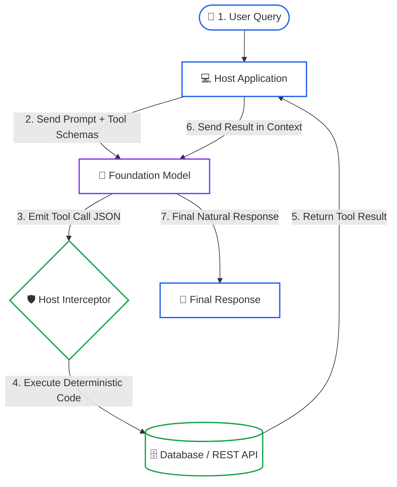
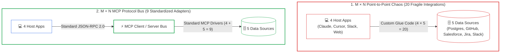

# Lesson 00: Tool Use Fundamentals & The Model Context Protocol (MCP)

> **Tier**: `🟢 Core`  
> **Estimated Reading Time**: 25 minutes  
> **Prerequisites**: [Phase 00 Lesson 01](../00-foundations-and-token-mechanics/01-tokenization-and-bpe-mechanics.md) (Tokens & Inference), [Phase 01 Lesson 00](../01-prompt-and-context-engineering/00-prompt-engineering-fundamentals-roles-and-in-context-learning.md) (Prompt Engineering)  
> **Target Audience**: Backend Engineers, Systems Architects  
> 
> **Core Concept**: Language models predict words based on probabilities. They cannot run code, execute SQL, or access network sockets. **Tool use** (or **function calling**) solves this limitation: the model outputs structured JSON declaring which function it wants to call and what arguments to pass. Your host application intercepts that JSON, runs the real code safely, and feeds the result back to the model. The **Model Context Protocol (MCP)** provides an open, universal standard for this host-to-tool communication.
> 
> **Term Ledger**:
> - `New AI terms introduced`: `Tool Use` / `Function Calling`, `Tool Schema`, `Tool Call`, `Tool Execution Loop`, `Model Context Protocol (MCP)`.
> - `AI terms assumed from earlier lessons`: `Token`, `Prompt`, `Inference`, `Context Window`, `Hallucination`.

---

## 1. Conceptual Foundation & Mental Model

In traditional software, your code executes deterministically. When you call `db.query("SELECT * FROM users")`, the database driver opens a TCP socket, sends wire bytes, and receives rows.

A Large Language Model (LLM) cannot open sockets or execute system calls. It is an autoregressive token predictor. It takes a sequence of input tokens and calculates probability distributions to emit the next token. 

If you ask an LLM *"What is the current balance of account 4821?"*, the model cannot check a database. Without tools, it must guess based on its training weights. This guess causes hallucinations.

```text
Stochastic AI World                          Deterministic Software World
+------------------------------------+      +-------------------------------+
| Foundation Model                   |      | Host Application Runtime      |
|  - Predicts token text             |      |  - Holds DB credentials       |
|  - Emits: {"tool": "get_balance",  | ===> |  - Opens TCP connection       |
|            "account_id": 4821}     |      |  - Executes: SELECT balance   |
+------------------------------------+      +-------------------------------+
```

### The Coprocessor Analogy
Think of an LLM as a brilliant general-purpose processor paired with an external hardware coprocessor. 

In computer architecture, a main CPU delegates floating-point arithmetic or graphics rendering to specialized coprocessors. The CPU prepares the operands, triggers the coprocessor, waits for the calculation to finish, and collects the result.

In modern AI engineering:
1. The **Model** is the reasoning core.
2. The **Tools** are the external coprocessors (databases, REST APIs, calculators).
3. The **Host Application** is the motherboard bus that moves data between them.

> **Where this analogy breaks**: A hardware bus transfers deterministic binary signals across copper traces. In contrast, an LLM selects tools based on fuzzy semantic pattern matching against textual tool descriptions. If your tool description is vague, the model may hallucinate arguments or pick the wrong tool entirely.

---

## 2. Why the Naive Approach Fails

When developers first connect an LLM to external systems, they often try raw string parsing.

```python
# Naive approach: asking the model for plain text commands
prompt = """
User: Check the status of order 892.
Instructions: If you need to check an order, output: RUN_ORDER_CHECK(order_id)
"""
```

This naive pattern fails immediately in production:
1. **Unreliable Output Syntax**: The model might output `RUN_ORDER_CHECK(892)`, `RunOrderCheck(892)`, or wrap the command in markdown ````RUN_ORDER_CHECK("892")````.
2. **Type Confusion**: The model may pass strings when your function requires integers or booleans.
3. **No Execution Guarantee**: The model might apologize instead of running the command, leaving the user with an unresolved request.
4. **Security Vulnerability**: Untrusted text can manipulate string commands, causing arbitrary code execution or SQL injection.

To achieve production reliability, foundation model providers and the AI engineering ecosystem replaced string parsing with **Schema-Driven Function Calling**.

---

## 3. Core Mechanisms

### 1. The 5-Step Tool Execution Loop

Tool calling is not a single API call. It is an iterative, multi-turn loop governed by your host application.



#### Walkthrough
1. **User Query**: The human or client system sends a natural-language request to the host application.
2. **Schema Injection**: The host attaches available tool definitions formatted as strict JSON Schema to the prompt.
3. **Model Decision**: The model evaluates the prompt. If it needs external data, it emits a structured JSON payload specifying the tool name and arguments. It sets the stop reason to `tool_calls`.
4. **Host Execution**: The host catches this response before returning anything to the user. It validates the arguments against typed schemas and executes the local or remote function.
5. **Context Feedback**: The host appends the tool's execution result back into the conversation context as a new message.
6. **Final Synthesis**: The model processes the tool result and generates a grounded, factual answer for the user.

---

### 2. The M x N Integration Crisis vs. MCP

As enterprises deploy multiple AI applications, tool integration complexity explodes.

Imagine an enterprise with 4 AI interfaces (Claude Desktop, Cursor, an internal Slack bot, and a customer support web app) and 5 corporate data sources (PostgreSQL, GitHub, Salesforce, Jira, and Slack).



#### Walkthrough
1. **The M x N Trap**: Without a shared standard, every host app must implement custom code for every data source. For 4 hosts and 5 sources, engineers must build and maintain 20 separate adapters (4 x 5 = 20).
2. **The M + N Solution**: The Model Context Protocol (MCP) standardizes this connection. Data sources expose standard MCP servers, and host apps act as MCP clients. The maintenance burden drops to 9 components (4 + 5 = 9).

---

## 4. Runnable Python 3.12 Implementation

The following complete Python 3.12 program implements the full 5-step tool execution loop offline. It uses Pydantic v2 to enforce strict schema contracts without external LLM dependencies.

```python
"""
tool_execution_loop.py
Demonstrates the 5-step Function Calling loop with strict Pydantic v2 validation.
Python 3.12+ compatible, runnable offline.
"""

from typing import Any, Callable, Dict
import json
from pydantic import BaseModel, Field, ValidationError


# 1. Define Typed Tool Schemas using Pydantic v2
class GetAccountBalance(BaseModel):
    """Schema for querying an account balance."""
    account_id: int = Field(description="Unique numeric customer identifier", ge=1000)
    include_pending: bool = Field(default=False, description="Whether to include pending charges")


# 2. Implement Deterministic Business Logic
def get_account_balance(account_id: int, include_pending: bool = False) -> Dict[str, Any]:
    # Mock system of record
    ledger = {
        1001: {"available_usd": 1450.25, "pending_usd": -120.00},
        1002: {"available_usd": 8920.00, "pending_usd": 0.00},
    }
    
    if account_id not in ledger:
        return {"error": f"Account {account_id} not found"}
    
    record = ledger[account_id]
    balance = record["available_usd"]
    if include_pending:
        balance += record["pending_usd"]
        
    return {
        "account_id": account_id,
        "balance_usd": balance,
        "currency": "USD"
    }


# 3. Host Tool Registry
class HostToolRegistry:
    def __init__(self) -> None:
        self._tools: Dict[str, tuple[type[BaseModel], Callable[..., Any]]] = {}

    def register(self, name: str, schema: type[BaseModel], func: Callable[..., Any]) -> None:
        self._tools[name] = (schema, func)

    def get_tool_definitions(self) -> list[Dict[str, Any]]:
        definitions = []
        for name, (schema, _) in self._tools.items():
            definitions.append({
                "name": name,
                "description": schema.__doc__ or "",
                "parameters": schema.model_json_schema()
            })
        return definitions

    def execute_tool(self, name: str, raw_json_args: str) -> Dict[str, Any]:
        if name not in self._tools:
            return {"error": f"Unknown tool: {name}"}
        
        schema, func = self._tools[name]
        try:
            parsed_dict = json.loads(raw_json_args)
            validated_args = schema.model_validate(parsed_dict)
            return func(**validated_args.model_dump())
        except ValidationError as e:
            return {"error": "Invalid arguments", "details": e.errors()}
        except json.JSONDecodeError:
            return {"error": "Malformed JSON argument string"}


# 4. Mock Inference Engine (Simulating LLM Output)
def mock_llm_inference(user_prompt: str, available_tools: list[Dict[str, Any]]) -> Dict[str, Any]:
    # Simulates the model inspecting prompt and emitting a tool call
    if "1001" in user_prompt:
        return {
            "finish_reason": "tool_calls",
            "tool_call": {
                "name": "get_account_balance",
                "arguments": json.dumps({"account_id": 1001, "include_pending": True})
            }
        }
    return {
        "finish_reason": "stop",
        "content": "I do not recognize that account number."
    }


# 5. Run the 5-Step Host Orchestration Loop
def run_loop() -> None:
    registry = HostToolRegistry()
    registry.register("get_account_balance", GetAccountBalance, get_account_balance)
    
    user_query = "What is the available balance for account 1001 including pending?"
    print(f"Step 1 (User Query): '{user_query}'")
    
    tool_schemas = registry.get_tool_definitions()
    print(f"Step 2 (Schema Export): Registered {len(tool_schemas)} tools")
    
    llm_response = mock_llm_inference(user_query, tool_schemas)
    
    if llm_response.get("finish_reason") == "tool_calls":
        tool_call = llm_response["tool_call"]
        print(f"Step 3 (Model Tool Call): {tool_call['name']} with args {tool_call['arguments']}")
        
        # Step 4: Host executes tool
        tool_result = registry.execute_tool(tool_call["name"], tool_call["arguments"])
        print(f"Step 4 (Execution Result): {tool_result}")
        
        # Step 5: Final synthesis
        synthesized_text = (
            f"Account {tool_result['account_id']} balance is "
            f"${tool_result['balance_usd']:.2f} {tool_result['currency']}."
        )
        print(f"Step 5 (Final Grounded Synthesis): {synthesized_text}")


if __name__ == "__main__":
    run_loop()
```

---

## 5. Architectural Trade-offs & Failure Modes

Connecting tools to language models introduces distinct systems trade-offs:

| Engineering Decision | Positive Impact | Negative Trade-off / Failure Mode |
|---|---|---|
| **Pydantic Schema Validation** | Catches malformed arguments before database queries execute. | Rejects calls if model emits integers as string literals without coercion. |
| **Multi-Turn Context Feedback** | Enables the model to ground its final answer in verified facts. | Increases end-to-end latency by 2x due to a mandatory second inference pass. |
| **Strict Parameter Bounds (`ge=1000`)** | Prevents boundary attacks and invalid ID queries. | Model may enter retry loops if it fails to generate valid bounds. |
| **Granular Micro-Tools** | Keeps function responsibilities focused and testable. | Consumes context window tokens; too many tools degrades selection accuracy. |

---

## 6. Quick Check

An engineer configures an LLM to call `execute_sql_query(query: str)`. When a user asks *"Show me our top 5 revenue clients"*, the user receives an HTTP 500 error after 30 seconds. The server logs show the database connection timed out during execution. 

Which architectural tier failed, and what defense should be added to the tool loop?

<details>
<summary>Suggested Answer</summary>

**Failure Tier**: The Host Application Execution Plane. The LLM generated the tool call successfully, but the host dispatched an unindexed, unbounded SQL query directly to the database without execution bounds.

**Required Defense**:
1. **Host-Side Query Timeouts**: Set strict execution limits (for example, 3 seconds) on tool execution threads.
2. **Parameter Restriction**: Do not allow the model to emit raw SQL strings. Instead, expose parameterized tools such as `get_top_revenue_clients(limit: int = 5)` with a hard ceiling (`le=50`).
3. **Compaction & Pagination**: Prevent runaway query results from overwhelming the LLM's context window.

</details>

---

## 🧭 Navigation

| Previous | Hub | Next | Capstone Lab |
|---|---|---|---|
| [← Phase 02 Lesson 07: Adaptive RAG](../02-rag-and-knowledge-systems/07-query-planning-adaptive-routing-and-crag.md) | [Phase 03 Overview](README.md) | [Lesson 01: Function Calling & JSON-RPC Wire Protocols →](01-function-calling-and-json-rpc-wire-protocols.md) | [Capstone Lab: MCP Tool Server →](labs/capstone-mcp-tool-server.md) |
