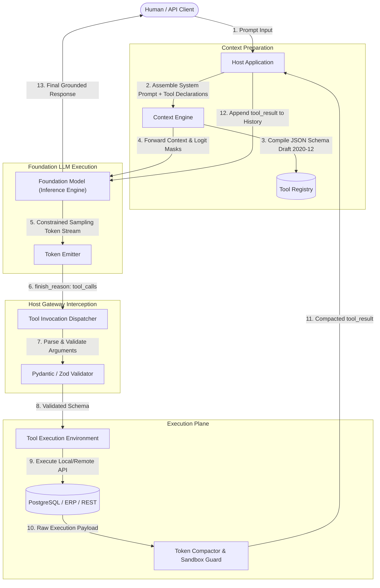

# Lesson 01: Function Calling & JSON-RPC Wire Protocols

> **Tier**: `HIGH ROI / CORE`  
> **Estimated Reading Time**: 40 minutes  
> **Prerequisites**: Phase 00 (Tokenization, Inference Latency), Phase 01 (Structured Outputs, Prompt Templates)  
> **Target Audience**: Senior Software Engineers, Systems Architects  

---

> **Core Concept**: Language models generate text — they cannot directly execute code, call APIs, or query databases. **Function calling** (also called tool calling) bridges this gap. The model generates a structured JSON request describing which function it wants to call and its parameters. Your application code executes that function and feeds the result back to the model. Under the hood, this communication often follows the **JSON-RPC 2.0** standard.

---

## 1. Conceptual Foundation & Mental Model

In traditional software systems, a function call is direct and deterministic: arguments are passed, instructions run, and a value returns.

Large Language Models (LLMs) do not have direct access to your CPU or systems. An LLM simply predicts the next word. To enable a model to interact with the external world—like querying a database or calling a REST API—we must bridge its text generation with your deterministic runtime code.

This bridge is **Function Calling** (or *Tool Calling*). 

```text
Language Model World                        Application Code World
+-------------------------+                 +---------------------------+
| Generates JSON:         |   JSON-RPC 2.0  | Executes real function:   |
| '{"name": "fetch_user", | --------------> | def fetch_user(id):       |
|   "args": {"id": 104}}' |                 |     return user_data      |
+-------------------------+                 +---------------------------+
```

### The Remote Procedure Call (RPC) Mental Model
Think of function calling as an asynchronous **Remote Procedure Call (RPC)**:
1. The **Application** sends a list of available tools (described as JSON Schemas) to the model.
2. The **Model** decides whether to respond with regular text, or request to call one of the tools.
3. The **Application** receives this request, validates the arguments, runs the actual code, and sends the result back into the model's chat history.
4. The **Model** reads the result and uses it to generate a final natural language response or trigger another tool.

The common wire protocol powering this communication is **JSON-RPC 2.0**.

---

## 2. Architecture & Wire Topology

The single-turn tool invocation loop establishes a clear boundary between model reasoning and application execution:



### Visual Walkthrough
1. **Prompt Input & Schema Compilation (Steps 1–3)**: The user issues a query. The Host context engine inspects its internal tool registry, serializes tool signatures into strict JSON Schema, and binds them into the inference payload.
2. **Constrained Model Inference (Steps 4–5)**: The LLM runs auto-regressive decoding. When it decides to invoke a tool, modern inference engines apply grammar-constrained logit masking (Finite State Automata) to force the output into a valid JSON object matching the requested tool's schema.
3. **Gateway Interception & Validation (Steps 6–7)**: The model stops generating (`finish_reason: "tool_calls"`). The host intercepts the raw string, deserializes it, and validates every argument against strongly typed Pydantic models.
4. **Execution & Context Compaction (Steps 8–11)**: The host dispatches the call to the actual database or API. The response is intercepted by a Token Compactor to prevent "Context Bombing" (truncating or summarizing massive outputs) before feeding the result back to the model context.
5. **Grounded Answer Synthesis (Steps 12–13)**: The LLM processes its previous tool call alongside the deterministic runtime output, generating a verified natural language answer for the user.

---

## 3. Core Engineering Mechanics: The JSON-RPC 2.0 Wire Specification

Function calling engines and the Model Context Protocol (MCP) standardize on the **JSON-RPC 2.0** protocol ([RFC specification](https://www.jsonrpc.org/specification)). Understanding its exact wire structure is essential for debugging socket streams and raw network frames.

### 1. Request Frame
A client requesting a tool execution transmits a JSON object with four mandatory keys:

```json
{
  "jsonrpc": "2.0",
  "id": "req-9842a-7c",
  "method": "tools/call",
  "params": {
    "name": "query_database",
    "arguments": {
      "table": "customer_ledger",
      "limit": 10
    }
  }
}
```

* `jsonrpc`: Must be exactly `"2.0"`.
* `id`: An identifier established by the client (string, integer, or null). Used to correlate responses with requests in asynchronous multiplexed streams.
* `method`: A string indicating the RPC method being invoked.
* `params`: A structured object or array holding invocation arguments.

### 2. Success Response Frame
When the tool execution completes successfully, the server responds with the matching `id`:

```json
{
  "jsonrpc": "2.0",
  "id": "req-9842a-7c",
  "result": {
    "content": [
      {
        "type": "text",
        "text": "{\"rows_returned\": 2, \"records\": [{\"id\": 101, \"balance\": 450.00}]}"
      }
    ],
    "isError": false
  }
}
```

### 3. Error Response Frame & Standard Error Codes
If parsing fails, the method does not exist, or validation fails, the server must emit a formal error object:

```json
{
  "jsonrpc": "2.0",
  "id": "req-9842a-7c",
  "error": {
    "code": -32602,
    "message": "Invalid params",
    "data": {
      "field": "limit",
      "issue": "Must be an integer less than or equal to 100"
    }
  }
}
```

#### Standardized JSON-RPC 2.0 Error Code Spectrum
```text
+-----------------------+--------------------+------------------------------------------------+
| Code Range            | Error Category     | Systems Meaning                                |
+-----------------------+--------------------+------------------------------------------------+
| -32700                | Parse Error        | Invalid JSON received by the server.           |
| -32600                | Invalid Request    | Payload is not a valid JSON-RPC 2.0 object.   |
| -32601                | Method Not Found   | The requested tool or RPC method is missing.   |
| -32602                | Invalid Params     | Arguments fail JSON Schema / Pydantic checks.  |
| -32603                | Internal Error     | Unhandled server exception during execution.   |
| -32000 to -32099      | Server Error Range | Reserved for custom protocol/application codes.|
+-----------------------+--------------------+------------------------------------------------+
```

### 4. Notifications (Fire-and-Forget)
A notification is a request object **without an `id` field**:
```json
{
  "jsonrpc": "2.0",
  "method": "notifications/progress",
  "params": {
    "progressToken": 1,
    "progress": 50,
    "total": 100
  }
}
```
The receiver **must not** return a response to a notification. Notifications are used for streaming telemetry, logging to stderr, or real-time progress indicators.

---

## 4. Provider-Native Tool Schemas & Constrained Decoding

Before an LLM can generate a JSON-RPC request, it must be provided with a catalog of available tools. Frontier and open-weights providers (OpenAI, xAI, Anthropic, Gemini, Meta Llama) accept tool declarations structured under **JSON Schema Draft 2020-12**.

### Provider Tool Schema Comparison Matrix
```text
+-------------------+----------------------------+------------------------------------+------------------------------------+
| Dimension         | Anthropic Claude           | OpenAI & xAI Grok-3                | Meta Llama 3.x / Llama Stack       |
+-------------------+----------------------------+------------------------------------+------------------------------------+
| Top-level Key     | `tools`: [...]             | `tools`: [{"type": "function"}]    | `tools`: [...] or `tool_prompt`    |
| Parameter Schema  | `input_schema`: {...}      | `function`: {"parameters": {...}}  | `parameters`: {...} (JSON Schema)  |
| Strict Enforcement| Native JSON Schema         | `strict: true` (Grammar DFA)       | XGrammar / Llama Stack validation  |
| Choice Directive  | `tool_choice`: {"type":...}| `tool_choice`: "auto" | "required" | Native `<|python_tag|>` dispatch   |
| Wire Format       | JSON-RPC / Claude Messages | OpenAI-compatible REST / Tools API | Special tokens or Llama Stack API  |
+-------------------+----------------------------+------------------------------------+------------------------------------+
```

### Frontier Tool Invocation Primitives:
1. **xAI Grok-3 API**: Follows the OpenAI-compatible function calling standard. Grok-3 supports parallel tool execution, built-in search and code execution, and strict JSON Schema parameter compilation (`strict: true`).
2. **Meta Llama 3.x & Llama Stack**: Meta Llama models provide dual-mode tool invocation:
   - *Native Text Tokens*: Emits tool calls via `<|python_tag|>` for code interpreter and structured function calls between `<|start_header_id|>ipython<|end_header_id|>` tokens.
   - *Meta Llama Stack (`llama-stack`)*: Abstracted tool engine that translates standardized tool schemas into provider-agnostic execution requests, with native support for the Model Context Protocol (MCP).

### Constrained Decoding (FSM Logit Masking)
When a model is instructed to output JSON matching a schema, naive prompting produces occasional syntax errors (trailing commas, unescaped quotes). Production inference engines solve this using **Grammar-Constrained Decoding**:
1. At each token step t, the inference engine converts the target JSON Schema into a **Context-Free Grammar (CFG)** or **Finite State Machine (FSM)**.
2. The FSM determines the exact set of valid subsequent tokens according to JSON syntax and the schema.
3. The engine applies a **Logit Bias Mask** (-infinity) over all invalid tokens in the vocabulary before softmax normalization:

```text
Raw Logits -> [Mask tokens that violate JSON syntax or Schema] -> Softmax -> Sample
```
This guarantees **mathematically 100% syntactically valid JSON** from the model output.

---

## 5. Scaling Tool Catalogs: Dynamic Discovery & "Think in Code"

In enterprise architectures, exposing 100+ tools directly inside the system prompt causes catastrophic failure:
1. **Token Context Overhead**: 100 schemas consume 20,000–50,000 tokens per turn before user interaction starts.
2. **Lost in the Middle**: The model suffers attention dilution and selects the wrong tool or hallucinates invalid combinations.

### Pattern 1: Progressive Semantic Tool Discovery
Instead of feeding all 100 tools into the prompt, the host provides a single discovery tool: `search_tools(query: str)`.
- Tool names, descriptions, and tag metadata are embedded in a local vector database or SQLite FTS5 table.
- When the user asks: *"Check invoice status for PO-9002"*, the model calls `search_tools("invoice purchase order")`.
- The host retrieves the top 3 relevant tools and injects their complete schemas into the active context dynamically.

### Pattern 2: The "Think in Code" Execution Pattern
When a tool returns large payloads (such as querying a 50,000-row telemetry table), injecting raw JSON into the prompt causes **Context Bombing** (exhausting token limits and costing tens of dollars per query).

Under the **Think in Code** pattern:
1. The tool returns an ephemeral reference token: `{"data_handle": "s3://warehouse/telemetry_q3.parquet", "rows": 50000}`.
2. The LLM generates a sandboxed Python script utilizing `pandas` or `duckdb` to filter and aggregate the data.
3. The host executes the script inside an isolated microVM/container and returns only the final summary (e.g., 5 lines of text).
4. **Token reduction: 98% lower context footprint**.

---

## 6. Production Implementation: Typed Tool Dispatcher & Circuit Breaker

The following production Python implementation demonstrates an industrial-grade tool dispatcher featuring:
- Strict Pydantic v2 argument validation.
- JSON-RPC 2.0 framing and standard error mapping.
- An **Execution Governor Circuit Breaker** that detects duplicate oscillation deadlocks.

```python
"""
production_tool_dispatcher.py
Production-grade JSON-RPC 2.0 Tool Dispatcher with Circuit Breaking.
Requirements: pip install pydantic>=2.0.0
"""

from typing import Dict, Any, Callable, Optional, Tuple, List
import json
import hashlib
from pydantic import BaseModel, Field, ValidationError

# ---------------------------------------------------------------------------
# 1. Pydantic Schemas for JSON-RPC 2.0 Wire Frames
# ---------------------------------------------------------------------------

class JsonRpcRequest(BaseModel):
    jsonrpc: str = Field(default="2.0", pattern=r"^2\.0$")
    id: Optional[str | int] = Field(default=None)
    method: str
    params: Dict[str, Any] = Field(default_factory=dict)

class JsonRpcError(BaseModel):
    code: int
    message: str
    data: Optional[Any] = None

class JsonRpcResponse(BaseModel):
    jsonrpc: str = "2.0"
    id: Optional[str | int]
    result: Optional[Any] = None
    error: Optional[JsonRpcError] = None

# ---------------------------------------------------------------------------
# 2. Tool Parameter Schemas (Application Domain)
# ---------------------------------------------------------------------------

class QueryLedgerParams(BaseModel):
    account_id: str = Field(..., pattern=r"^ACC-[0-9]{4,8}$", description="Customer account ID")
    limit: int = Field(default=10, ge=1, le=100, description="Max rows to return")

# ---------------------------------------------------------------------------
# 3. Execution Governor (Circuit Breaker)
# ---------------------------------------------------------------------------

class CircuitBreakerOpenException(Exception):
    pass

class ToolExecutionGovernor:
    """
    Prevents infinite oscillation loops where a model invokes
    the same failing tool with identical arguments repeatedly.
    """
    def __init__(self, max_consecutive_duplicates: int = 2, max_total_calls: int = 10):
        self.max_duplicates = max_consecutive_duplicates
        self.max_total = max_total_calls
        self.call_history: List[str] = []

    def compute_signature(self, tool_name: str, arguments: Dict[str, Any]) -> str:
        serialized = json.dumps({"name": tool_name, "args": arguments}, sort_keys=True)
        return hashlib.sha256(serialized.encode("utf-8")).hexdigest()

    def record_and_verify(self, tool_name: str, arguments: Dict[str, Any]) -> None:
        if len(self.call_history) >= self.max_total:
            raise CircuitBreakerOpenException(
                f"Global execution budget exceeded ({self.max_total} calls). Halting execution."
            )

        sig = self.compute_signature(tool_name, arguments)
        
        # Check consecutive duplicates
        consecutive = 0
        for prior_sig in reversed(self.call_history):
            if prior_sig == sig:
                consecutive += 1
            else:
                break

        if consecutive >= self.max_duplicates:
            raise CircuitBreakerOpenException(
                f"Oscillation deadlock detected: Tool '{tool_name}' called with identical "
                f"arguments {consecutive + 1} times consecutively. Execution aborted."
            )

        self.call_history.append(sig)

# ---------------------------------------------------------------------------
# 4. Production Tool Dispatcher
# ---------------------------------------------------------------------------

class ProductionToolDispatcher:
    def __init__(self):
        self._registry: Dict[str, Tuple[Callable, type[BaseModel]]] = {}
        self.governor = ToolExecutionGovernor()

    def register_tool(self, name: str, schema: type[BaseModel]):
        def decorator(func: Callable):
            self._registry[name] = (func, schema)
            return func
        return decorator

    async def dispatch_raw_json(self, raw_payload: str) -> str:
        """Parses, validates, executes, and frames JSON-RPC 2.0 invocations."""
        # 1. Parse JSON wire framing
        try:
            payload_dict = json.loads(raw_payload)
        except json.JSONDecodeError as err:
            err_resp = JsonRpcResponse(
                id=None,
                error=JsonRpcError(code=-32700, message="Parse error: Invalid JSON payload.", data=str(err))
            )
            return err_resp.model_dump_json(exclude_none=True)

        # 2. Validate JSON-RPC 2.0 structure
        try:
            rpc_req = JsonRpcRequest.model_validate(payload_dict)
        except ValidationError as val_err:
            err_resp = JsonRpcResponse(
                id=payload_dict.get("id"),
                error=JsonRpcError(code=-32600, message="Invalid Request envelope.", data=val_err.errors())
            )
            return err_resp.model_dump_json(exclude_none=True)

        # 3. Method resolution
        tool_name = rpc_req.params.get("name")
        arguments = rpc_req.params.get("arguments", {})

        if tool_name not in self._registry:
            err_resp = JsonRpcResponse(
                id=rpc_req.id,
                error=JsonRpcError(
                    code=-32601,
                    message=f"Method/Tool '{tool_name}' not found.",
                    data={"available_tools": list(self._registry.keys())}
                )
            )
            return err_resp.model_dump_json(exclude_none=True)

        func, schema_cls = self._registry[tool_name]

        # 4. Enforce Circuit Breaker
        try:
            self.governor.record_and_verify(tool_name, arguments)
        except CircuitBreakerOpenException as cb_err:
            err_resp = JsonRpcResponse(
                id=rpc_req.id,
                error=JsonRpcError(code=-32000, message=str(cb_err))
            )
            return err_resp.model_dump_json(exclude_none=True)

        # 5. Validate Domain Parameters via Pydantic
        try:
            validated_params = schema_cls.model_validate(arguments)
        except ValidationError as param_err:
            err_resp = JsonRpcResponse(
                id=rpc_req.id,
                error=JsonRpcError(
                    code=-32602,
                    message="Invalid tool parameters.",
                    data=param_err.errors()
                )
            )
            return err_resp.model_dump_json(exclude_none=True)

        # 6. Execute Tool Handler within Error Boundary
        try:
            execution_result = await func(validated_params)
            success_resp = JsonRpcResponse(
                id=rpc_req.id,
                result={"content": [{"type": "text", "text": json.dumps(execution_result)}], "isError": False}
            )
            return success_resp.model_dump_json(exclude_none=True)
        except Exception as exec_err:
            err_resp = JsonRpcResponse(
                id=rpc_req.id,
                error=JsonRpcError(code=-32603, message="Internal execution failure.", data=str(exec_err))
            )
            return err_resp.model_dump_json(exclude_none=True)

# ---------------------------------------------------------------------------
# 5. Usage Demonstration
# ---------------------------------------------------------------------------

dispatcher = ProductionToolDispatcher()

@dispatcher.register_tool(name="query_ledger", schema=QueryLedgerParams)
async def handle_query_ledger(params: QueryLedgerParams) -> Dict[str, Any]:
    # Simulated database lookup
    return {
        "account_id": params.account_id,
        "rows": [{"date": "2026-03-01", "amount": 1250.00, "status": "SETTLED"}],
        "total_records": 1
    }
```

---

## 7. Systems Failure Modes & Anti-Patterns

### Failure Mode 1: The Infinite Oscillation Deadlock
* **Root Cause**: When a tool invocation returns an error (e.g., `404 Not Found`), unconstrained models frequently retry the identical failing call with the exact same arguments in an infinite loop, exhausting API rate limits and token budgets.
* **Production Fix**: Implement the `ToolExecutionGovernor` sliding-window signature hasher demonstrated above. Trip the circuit breaker if consecutive identical calls exceed 2 turns.

### Failure Mode 2: Unhandled Runtime Exceptions Dropping Agent Context
* **Root Cause**: Backend database connection timeouts or REST API `504 Gateway Timeout` errors throw raw Python/Node exceptions. The host process crashes, wiping out the entire multi-turn conversation memory.
* **Production Fix**: Never let exceptions escape the tool runner. Trap all exceptions and serialize them into standard JSON-RPC `-32603` or `{ "isError": true, "content": "..." }` frames. This allows the model to reason about the failure and explain it gracefully to the user.

### Failure Mode 3: Output Context Bombing (Denial of Wallet)
* **Root Cause**: An agent calls `search_logs(pattern="error")` on an enterprise Elasticsearch cluster, which returns 85,000 raw log lines (15MB of text). The host naively injects the full string into the prompt context, burning $3.50 in a single turn and pushing all system instructions out of the attention window.
* **Production Fix**: Enforce strict output truncation middleware. If a tool output exceeds 16KB (or ~4,000 tokens), automatically truncate and append:
  ```text
  [WARNING: Output truncated. 45,210 characters omitted. Use specific filters or pagination.]
  ```

---

## 8. Architectural Trade-off Matrix

| Architectural Dimension | Provider-Native Function Calling | Model Context Protocol (MCP) | Custom In-Process Reflection |
|---|---|---|---|
| **Ecosystem Portability** | Low (Bound to OpenAI / Anthropic format) | Universal (Standardized JSON-RPC 2.0 client/server) | Zero (Custom proprietary wrappers) |
| **Language Decoupling** | Monolithic (Host and tool share execution stack) | Polyglot (Host in C#, Tool in Python, Service in Go) | Monolithic (Host language only) |
| **Process Isolation** | In-process memory (Crash risks host process) | Out-of-process (OS subprocess pipes or Streamable HTTP) | In-process memory |
| **Execution Latency** | Sub-millisecond (In-process pointer dispatch) | 0.5–2ms (`stdio` pipes) / 5–25ms (HTTP) | Sub-millisecond |
| **Security Surface** | Direct execution privilege on host | Sandboxed OS boundary, tokenized ABAC scopes | Direct execution privilege |

---

## 9. Hands-On Lab Exercise

### Objective
Implement a resilient tool execution runner that parses a stream of raw JSON-RPC 2.0 payloads, executes an arithmetic aggregation tool, and trips a circuit breaker when an oscillation deadlock occurs.

### Acceptance Criteria
1. Use Python 3.12+ and Pydantic v2 to validate an `AggregateMetricsRequest` schema (`metric_name: str`, `window_minutes: int <= 60`).
2. Implement a mock handler that simulates an external database timeout error.
3. Verify that submitting the exact same failing request 3 times consecutively trips the `CircuitBreakerOpenException` and returns a `-32000` JSON-RPC error.
4. Verify that diagnostic logs are written exclusively to `sys.stderr` without corrupting standard output frames.

---

## 10. Enterprise Production Checklist

- [ ] Every tool parameter schema declares `"additionalProperties": false` and uses strict regex patterns or enums for discrete identifiers.
- [ ] Tool execution results pass through a hard size cap (e.g. 16KB / 4,000 tokens) before prompt context injection.
- [ ] An execution governor circuit breaker enforces a maximum tool count per turn (no more than 10) and consecutive duplicate threshold (no more than 2).
- [ ] All diagnostic and debugging logs write exclusively to `stderr`, leaving `stdout` dedicated strictly to valid JSON-RPC 2.0 frames.
- [ ] Provider constrained decoding (`strict: true`) is enabled on all structured output definitions.

---

[Next: Lesson 02 — MCP Architecture, Transports & Protocol Lifecycle](./02-mcp-architecture-transports-and-lifecycle.md) | [Back to Phase 03 Hub](./README.md)
