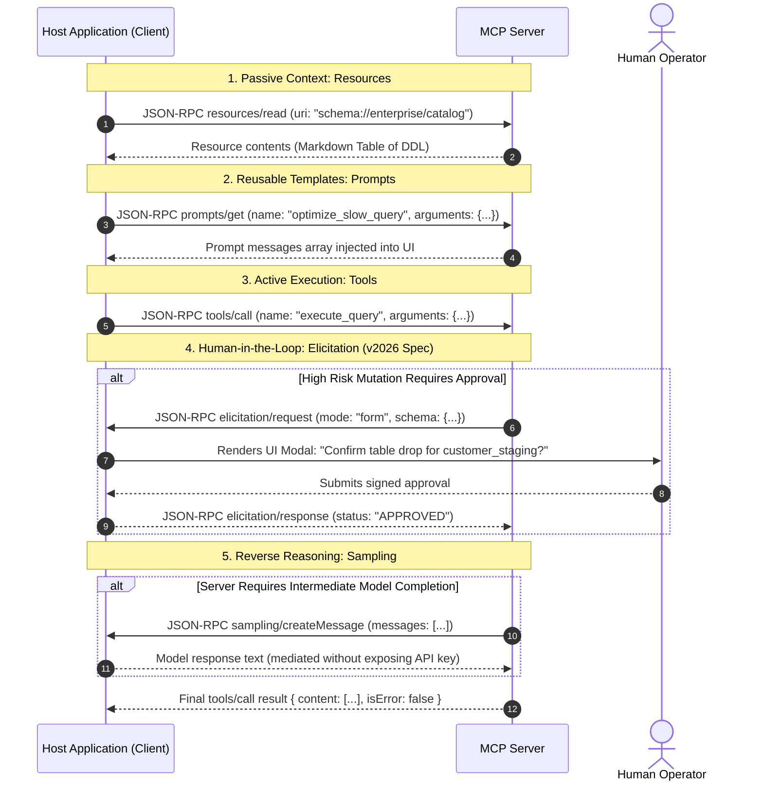

# Lesson 03: MCP Server Primitives: Tools, Resources, Prompts & Elicitation

> **Tier**: `🟡 Tier 2: Engineering Depth`  
> **Estimated Reading Time**: 50 minutes  
> **Prerequisites**: Lesson 02 (MCP Architecture, Transports & Protocol Lifecycle)  
> **Target Audience**: Senior Software Engineers, Systems Architects  

---

## 1. Conceptual Foundation & Mental Model

In classic web and API development, architectures separate concerns into distinct abstractions:
- **HTTP POST / RPC**: For executing stateful actions (mutations).
- **HTTP GET / REST**: For fetching passive representations of state (queries).
- **Templates / Views**: For structuring dynamic user presentation (rendering).
- **OAuth / Webhooks**: For delegating authentication and human step-up authorization.

The Model Context Protocol (MCP) organizes capabilities into **Five Foundational Primitives**:

```text
+-----------------------------------------------------------------------------------------+
|                                 The 5 MCP Primitives                                    |
+-----------------------------------------------------------------------------------------+
| 1. TOOLS       | Active Execution | Model-initiated actions and database mutations      |
| 2. RESOURCES   | Passive Context  | Host-attached documents, URI schemas, and live feeds|
| 3. PROMPTS     | Reusable Logic   | Parameterized workflow templates for user/host UIs  |
| 4. SAMPLING    | Reverse LLM      | Server requests host-mediated model completions     |
| 5. ELICITATION | Human-in-the-Loop| Server pauses to request user input or auth approval|
+-----------------------------------------------------------------------------------------+
```

Understanding when to expose a capability as a **Tool** versus a **Resource** or **Prompt** is the hallmark of senior AI systems architecture. Exposing everything as a Tool wastes model tokens and introduces severe operational risk.

---

## 2. Architecture & Wire Specifications of the 5 Primitives

The following sequence traces how an enterprise Host negotiates each primitive with an MCP Server:



### Prose Walkthrough
1. **Passive Context via Resources (Lines 1–2)**: The host reads dynamic system state (such as database schemas) into the context window *before* the model runs, avoiding expensive exploratory tool calls.
2. **Prompts Primitive (Lines 3–4)**: The server exposes curated prompt recipes. When a user selects a prompt in Cursor or Claude Desktop, the server populates system and user messages deterministically.
3. **Tools Primitive (Line 5)**: The model issues an active mutation or query command over JSON-RPC.
4. **Elicitation Gate (Lines 6–9)**: If the requested tool action is destructive or requires credentials, the server initiates an `elicitation/request`. The host presents a modal dialog to the user. Only when the human authorizes it does execution proceed.
5. **Sampling Primitive (Lines 10–11)**: If the server needs an LLM to summarize a text fragment, it asks the Host to run an inference step via `sampling/createMessage`, shielding proprietary API keys from the server.
6. **Result Payload (Line 12)**: The server completes execution and returns a structured result envelope.

---

## 3. Deep Dive into the 5 MCP Primitives

### Primitive 1: Tools (`tools/list` & `tools/call`)
Tools represent callable functions that produce side effects or fetch computed results.
* **Discovery (`tools/list`)**: Returns an array of tool objects with a `name`, `description`, and `inputSchema` compliant with JSON Schema Draft 2020-12.
* **Invocation (`tools/call`)**: Requires `name` and an `arguments` map.
* **Error Semantics**: If a tool fails (e.g., SQL syntax error or connection timeout), the server **must not** return a top-level JSON-RPC protocol error (`-32603`) if the tool executed. Instead, it must return a valid result object with `"isError": true`:
  ```json
  {
    "jsonrpc": "2.0",
    "id": 42,
    "result": {
      "content": [
        {
          "type": "text",
          "text": "DATABASE_ERROR: Column 'created_at' does not exist in table 'users'."
        }
      ],
      "isError": true
    }
  }
  ```
  This distinction allows the model to inspect the error text and self-correct on its next turn.

### Primitive 2: Resources (`resources/list` & `resources/read`)
Resources provide passive data context to the model, analogous to reading a file or GET-ing a REST endpoint.
* **URI Identification**: Every resource is addressed via a unique URI scheme (`postgres://customers/schema`, `file:///logs/app.log`, `git://repo/commit/head`).
* **MIME Types**: Resources declare content formats (`application/json`, `text/markdown`, `text/plain`).
* **Live Subscriptions**: Clients can subscribe to dynamic resources via `resources/subscribe`. When the underlying asset changes, the server fires a `notifications/resources/updated` event.

### Primitive 3: Prompts (`prompts/list` & `prompts/get`)
Prompts allow MCP servers to expose pre-engineered prompt workflows directly into the Host's UI or slash-command menu (e.g., `/optimize-sql`, `/triage-incident`).
* **Dynamic Arguments**: Prompts declare required input arguments (e.g., `table_name`, `severity_level`).
* **Message Templates**: Calling `prompts/get` returns an array of structured prompt messages (`role: "user" | "assistant"`) ready for direct inclusion in the LLM's conversation history.

### Primitive 4: Sampling (`sampling/createMessage`)
Historically, if a tool needed an LLM completion (e.g., to generate an embedding or extract entities from an unstructured PDF), the tool developer had to hardcode an API key into the tool service. This presented immense security risks:
- API keys leaked into logs or environment variables.
- The host application lost visibility into nested LLM token spending.

With **Sampling**, the server asks the **Host** to generate an LLM completion on its behalf:
- The server sends `sampling/createMessage` with messages, max tokens, and temperature.
- The Host reviews the request, verifies token quotas, applies its own security guardrails, invokes its primary foundation model, and returns the generated text to the server.
- **Zero API credentials exist inside the MCP server process.**

### Primitive 5: Elicitation (`elicitation/request`) (v2025/2026 HITL Standard)
Standardized in the **v2026-07-28 specification**, Elicitation is the formal protocol primitive for **Human-in-the-Loop (HITL)** interaction. It transforms AI execution from an unmonitored script into a governed, interactive collaboration.

Elicitation supports two primary interaction modes:
1. **Form Mode (`mode: "form"`)**: The server passes a JSON Schema describing required input or confirmation fields. The host client renders an in-app form (e.g., confirmation checkbox, date picker, or budget ceiling selector).
2. **URL Mode (`mode: "url"`)**: The server returns a secure external URL. The client opens a secure browser window for interactions that must bypass model context completely (e.g., OAuth 2.0 step-up consent, SSO login, banking 2FA).

```json
// Example: Server initiates Form Mode Elicitation
{
  "jsonrpc": "2.0",
  "id": "elicit-01",
  "method": "elicitation/request",
  "params": {
    "mode": "form",
    "title": "Production Service Restart Authorization",
    "description": "An agent has requested an automated restart of the Payment Gateway service.",
    "inputSchema": {
      "type": "object",
      "properties": {
        "authorized_by": { "type": "string", "description": "Operator employee ID" },
        "confirm_service_drop": { "type": "boolean", "const": true }
      },
      "required": ["authorized_by", "confirm_service_drop"]
    }
  }
}
```

---

## 4. Multi-Language SDK Implementations

### 1. Python: FastMCP & Official MCP SDK

In Python, developers have two production approaches:
* **Standalone `fastmcp` Library (`pip install fastmcp`)**: Best for enterprise middleware, server composition, and advanced decorators.
* **Official MCP Python SDK (`pip install mcp`)**: Standard reference implementation (`MCPServer` in v2.0+).

```python
"""
enterprise_mcp_server.py
Production Python FastMCP Server exposing Tools, Resources, and Prompts.
Requirements: pip install fastmcp pydantic
"""

from typing import Dict, Any, List
from pydantic import BaseModel, Field
from fastmcp import FastMCP, Context

# Initialize FastMCP Server with identity
mcp = FastMCP(
    name="EnterpriseFinOpsServer",
    version="2.0.0"
)

# ---------------------------------------------------------------------------
# 1. MCP Resource: Passive Catalog Context
# ---------------------------------------------------------------------------
@mcp.resource("schema://finops/catalog")
def get_finops_catalog() -> str:
    """Returns billing table schemas as markdown to prevent exploratory tool calls."""
    return """
    # Enterprise FinOps Catalog
    - `cloud_spend`: Hourly cloud resource costs across AWS/GCP (columns: timestamp, service, cost_usd).
    - `cost_centers`: Departmental billing codes (columns: center_id, department, budget_limit).
    """

# ---------------------------------------------------------------------------
# 2. MCP Tool: Active Query Execution
# ---------------------------------------------------------------------------
class SpendQueryRequest(BaseModel):
    service_name: str = Field(..., description="Cloud service name, e.g., 'EC2', 'BigQuery'")
    days: int = Field(default=7, ge=1, le=90, description="Historical query window in days")

@mcp.tool()
async def query_cloud_spend(request: SpendQueryRequest, ctx: Context) -> Dict[str, Any]:
    """Retrieves aggregated cloud spend with deterministic token compaction."""
    await ctx.info(f"Querying cloud spend for service: {request.service_name}")
    
    # Defensive data compaction
    return {
        "service": request.service_name,
        "window_days": request.days,
        "total_spend_usd": 1420.50,
        "status": "WITHIN_BUDGET"
    }

# ---------------------------------------------------------------------------
# 3. MCP Prompt: Parameterized Workflow Template
# ---------------------------------------------------------------------------
@mcp.prompt()
def budget_anomaly_triage(service_name: str, cost_spike_percent: float) -> str:
    """Pre-engineered prompt template for investigating unexpected cloud cost spikes."""
    return f"""You are a Principal Cloud FinOps Architect.
A cost spike of {cost_spike_percent}% has been detected in service '{service_name}'.
1. Inspect the 'schema://finops/catalog' resource.
2. Formulate a targeted query via 'query_cloud_spend'.
3. Identify top cost drivers and propose remediations."""

if __name__ == "__main__":
    mcp.run()
```

---

### 2. TypeScript SDK: `@modelcontextprotocol/sdk`

The official TypeScript SDK provides end-to-end type safety using [Zod](https://zod.dev/):

```typescript
// server.ts
// Production TypeScript MCP Server using @modelcontextprotocol/sdk
// Install: npm install @modelcontextprotocol/sdk zod

import { McpServer } from "@modelcontextprotocol/sdk/server/mcp.js";
import { StdioServerTransport } from "@modelcontextprotocol/sdk/server/stdio.js";
import { z } from "zod";

const server = new McpServer({
  name: "enterprise-audit-server",
  version: "1.0.0",
});

// Expose a typed Tool with Zod validation
server.registerTool(
  "query-audit-log",
  {
    description: "Fetches security audit events for a target principal.",
    inputSchema: z.object({
      principalId: z.string().regex(/^usr_[a-zA-Z0-9]+$/),
      maxEvents: z.number().int().min(1).max(100).default(20),
    }),
  },
  async ({ principalId, maxEvents }) => {
    // Simulated database query
    const events = [
      { event: "LOGIN_SUCCESS", ip: "192.168.1.10", timestamp: "2026-03-29T12:00:00Z" }
    ];
    return {
      content: [{ type: "text", text: JSON.stringify(events) }],
    };
  }
);

// Connect over local stdio
const transport = new StdioServerTransport();
await server.connect(transport);
```

---

### 3. C# / .NET 9: Microsoft Semantic Kernel Plugin Architecture

In .NET 9 enterprise architectures, tools are exposed through Semantic Kernel plugins:

```csharp
// TelemetryPlugin.cs
// Production C# .NET 9 Function Calling Plugin
using System.ComponentModel;
using System.Text.Json;
using Microsoft.SemanticKernel;

public sealed class TelemetryPlugin
{
    [KernelFunction, Description("Queries health metrics for an enterprise container cluster.")]
    public static string GetClusterHealth(
        [Description("Cluster namespace identifier.")] string clusterNamespace,
        [Description("Include pod logs if unhealthy.")] bool includeDiagnostics = false)
    {
        var healthReport = new
        {
            Namespace = clusterNamespace,
            Status = "HEALTHY",
            ActiveNodes = 12,
            CpuSaturation = 0.64
        };
        return JsonSerializer.Serialize(healthReport);
    }
}
```

---

### 4. Meta Llama Stack: MCP Tool Engine Provider

In the open-weights ecosystem, **Meta Llama Stack (`llama-stack`)** provides first-class support for the Model Context Protocol, enabling Llama 3.1/3.3 models to consume standard MCP servers as dynamic tool providers:

```python
"""
llama_stack_mcp_client.py
Configuring an MCP Server inside the Meta Llama Stack Tool Engine.
Requirements: pip install llama-stack-client
"""

from llama_stack_client import LlamaStackClient

client = LlamaStackClient(base_url="http://localhost:5000")

# Register an external MCP server into the Llama Stack agent catalog
client.toolgroups.register(
    toolgroup_id="enterprise::observability_mcp",
    provider_id="model-context-protocol",
    mcp_endpoint={
        "uri": "http://localhost:8080/mcp",
        "protocol_version": "2026-07-28"
    }
)

# Agents instantiated in Llama Stack automatically discover all tools
# exposed by the registered MCP server via tools/list
```

---

## 5. Systems Failure Modes & Anti-Patterns

### Failure Mode 1: Tool Overloading (Using Tools Where Resources Belong)
* **Root Cause**: Exposing static documentation, API schemas, or configuration tables as dynamic Tools (`get_table_schema`, `read_config`). The model burns 2–3 reasoning turns calling exploratory tools before attempting the user's primary objective.
* **Production Fix**: Expose static or slowly changing assets as **Resources** (`schema://`, `docs://`). Hosts automatically bind resources into initial context or allow direct retrieval with zero tool-calling latency.

### Failure Mode 2: Returning Unstructured String Errors
* **Root Cause**: When a tool fails, returning a raw Python stack trace as plain text. The model cannot determine whether the database query succeeded with no rows or crashed, leading to hallucinated recovery attempts.
* **Production Fix**: Always format error results with `"isError": true` and a structured error prefix:
  ```json
  { "content": [{ "type": "text", "text": "ERROR_AUTH: Token expired." }], "isError": true }
  ```

### Failure Mode 3: Silent Side Effects without Elicitation
* **Root Cause**: Providing an agent with unrestricted mutating tools (`delete_staging_database`, `revoke_all_tokens`) without an approval step. A prompt injection in untrusted input executes the mutation immediately.
* **Production Fix**: Gate all state-changing or destructive tools with **Elicitation (Form Mode)** or an ephemeral cryptographic HMAC step-up approval token.

---

## 6. Architectural Trade-off Matrix: Primitive Selection

| Primitive | Primary Purpose | State Mutation | Token Cost Model | Host UI Presentation |
|---|---|:---:|---|---|
| **Tool** | Dynamic computation or side-effect execution | Permitted (Should be audited/gated) | Incurred per invocation (arguments + result payload) | Rendered as tool call / execution badge |
| **Resource** | Passive context ingestion (Schemas, DDL, files) | Strictly Read-Only | Fixed cost incurred when resource is loaded | Rendered as document preview / context chip |
| **Prompt** | Reusable parameterized workflow injection | None (Template only) | Zero until rendered into conversation history | Rendered as slash-command / dropdown recipe |
| **Sampling** | Host-mediated LLM completion for servers | None | Consumes Host's model quota (Zero server API key) | Internal background execution |
| **Elicitation** | Human-in-the-Loop approval & missing inputs | Intercepts mutations | Minimal (JSON Schema form definition) | Rendered as interactive modal dialog |

---

## 7. Hands-On Lab Exercise

### Objective
Build a multi-primitive MCP server in Python (FastMCP) or TypeScript that exposes a database schema as a Resource, a read query as a Tool, and gates service restarts behind an Elicitation form.

### Acceptance Criteria
1. Expose `schema://inventory/database` returning a Markdown table of database columns.
2. Expose a tool `get_inventory_levels(sku: str)` validating that SKU matches `^SKU-[0-9]{5}$`.
3. If an invalid SKU is supplied, return `isError: true` with an explanatory diagnostic message.
4. Expose a parameterized prompt `triage_inventory_shortage(sku: str, threshold: int)` returning an expert triage instruction.

---

## 8. Enterprise Production Checklist

- [ ] Static schemas and catalogs are exposed as **Resources**, reserving **Tools** strictly for computations and mutations.
- [ ] Tool error responses return `"isError": true` inside the result envelope rather than crashing the JSON-RPC pipe.
- [ ] Server-initiated LLM reasoning uses the **Sampling** primitive to avoid embedding API keys in tool services.
- [ ] Mutating or destructive operations enforce Human-in-the-Loop verification via **Elicitation**.
- [ ] All tool schemas declare `"additionalProperties": false` and use strict regex patterns or enums for discrete parameters.

---

[Previous: Lesson 02 — MCP Architecture, Transports & Protocol Lifecycle](./02-mcp-architecture-transports-and-lifecycle.md) | [Next: Lesson 04 — Reverse Sampling & Host Orchestration](./04-reverse-sampling-and-host-orchestration.md) | [Back to Phase 03 Hub](./README.md)
