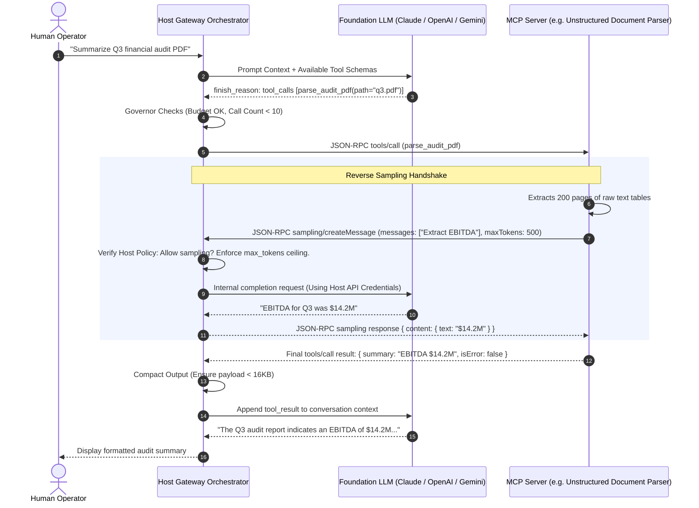

# Lesson 04: Reverse Sampling & Host Orchestration

> **Tier**: `⚫ Tier 3: Systems Deep Dive`  
> **Estimated Reading Time**: 45 minutes  
> **Prerequisites**: Lesson 02 (MCP Architecture & Transports), Lesson 03 (MCP Server Primitives)  
> **Target Audience**: Senior Software Engineers, Systems Architects  

---

> **Core Concept**: In most AI applications, the flow goes one way: the model calls tools. **Reverse sampling** flips this direction — an MCP tool server can request the host application to generate a model completion on its behalf. This is useful when a tool needs AI assistance mid-execution (for example, a code analysis tool asking the model to summarize a complex diff). This lesson covers how the MCP host application orchestrates these bidirectional flows, manages multiple concurrent tool servers, and prevents runaway resource consumption.

---

## 1. Conceptual Foundation & Mental Model

Most developers view the Model Context Protocol purely from the perspective of an **MCP Server** author. However, in enterprise agent platforms, the most complex systems engineering occurs on the other side of the wire: inside the **MCP Host Application**.

The Host is the operating system for AI agents. It does not simply pass strings back and forth; it acts as an **Ingress Gateway, Security Supervisor, and Resource Allocator**:
- **Process Multiplexer**: Spawns and manages lifecycles for dozens of local child processes and remote Streamable HTTP connections simultaneously.
- **Reverse Sampling Mediator**: Grants servers intelligent reasoning capabilities without ever leaking third-party API keys to server processes.
- **Execution Governor**: Intercepts tool loops, breaks oscillation deadlocks, and compacts bloated outputs to prevent token exhaustion.

```text
Host as Kernel & Hypervisor:
+--------------------------------------------------------------------------+
| HOST APPLICATION (Supervisor Kernel)                                     |
|  - Manages Process Pool (Postgres Server, Git Server, CRM Microservice)  |
|  - Controls Token Budgets & Context Injection                            |
|  - Mediates Reverse LLM Sampling (No API Keys to Servers)                |
|  - Halts Rogue Oscillation Loops (Circuit Breaker)                       |
+--------------------------------------------------------------------------+
       | stdio                  | stdio                  | Streamable HTTP
       v                        v                        v
 [Server: Database]       [Server: Git]            [Server: Remote SAP]
```

---

## 2. Architecture & Wire Topology: The Host Orchestration Loop

The sequence diagram below traces the full orchestration loop, including a Server requesting a reverse **Sampling** completion from the Host:



### Prose Walkthrough
1. **Tool Invocation Dispatch (Steps 1–4)**: The user initiates a request. The Primary LLM determines that `parse_audit_pdf` is needed. The Host checks execution governors before dispatching the JSON-RPC request to the tool server.
2. **Reverse Sampling Request (Steps 5–7)**: The server extracts raw PDF data. Rather than context-bombing the Host with 200 pages of text, the server asks the Host to run a focused extraction step via `sampling/createMessage`.
3. **Host Mediation & Credential Shielding (Steps 8–10)**: The Host inspects the sampling request. Crucially, the Host uses its **own LLM client credentials**. The MCP server never sees the provider API key.
4. **Intermediate Reason Synthesized (Steps 11–12)**: The Host returns the sampled string to the server. The server packages this into a clean 200-word tool result.
5. **Context Compaction & Final Grounding (Steps 13–15)**: The Host verifies that the result respects token budgets and appends it to the primary conversation. The model emits a final grounded answer to the user.

---

## 3. Reverse Sampling Protocol Deep Dive

The Sampling primitive allows an MCP server to request text generation from an LLM **through the client**.

### 1. The `sampling/createMessage` Request
```json
{
  "jsonrpc": "2.0",
  "id": "samp-492",
  "method": "sampling/createMessage",
  "params": {
    "messages": [
      {
        "role": "user",
        "content": {
          "type": "text",
          "text": "Extract all IPv4 addresses from this firewall log fragment:\n2026-03-29 10:14:02 DROP 198.51.100.4 to 10.0.0.1"
        }
      }
    ],
    "modelPreferences": {
      "hints": [
        { "name": "claude-3-5-haiku" },
        { "name": "gpt-4o-mini" }
      ],
      "costPriority": 0.8,
      "speedPriority": 0.9,
      "intelligencePriority": 0.3
    },
    "systemPrompt": "You are a specialized security entity extraction filter.",
    "maxTokens": 256,
    "temperature": 0.1
  }
}
```

### 2. Client Governance & Interception
When the Host receives `sampling/createMessage`, it **must not** blindly forward the request to an LLM. Production Host gateways enforce three security gates:
1. **Capability Authorization**: Did the client declare `"sampling": {}` in its initial `initialize` handshake? If not, reject with error code `-32601`.
2. **Model Routing via Preferences**: The server can express preferences (`costPriority`, `speedPriority`). For lightweight tasks (entity extraction), the Host routes the call to a small, fast model (e.g., Haiku or Flash).
3. **Safety & Token Budgets**: The Host caps `maxTokens` to prevent rogue servers from initiating massive multi-thousand-token recursive loops.

### 3. The `sampling/createMessage` Response
```json
{
  "jsonrpc": "2.0",
  "id": "samp-492",
  "result": {
    "role": "assistant",
    "content": {
      "type": "text",
      "text": "198.51.100.4, 10.0.0.1"
    },
    "model": "claude-3-5-haiku-20241022",
    "stopReason": "endTurn"
  }
}
```

---

## 4. Host-Side Tool Governors: Circuit Breakers & Compaction

A resilient Host must guard itself against rogue or buggy tools.

### 1. Oscillation Deadlock Detection
When an agent encounters a failing tool, it often calls it again with identical arguments. The Host must track invocations using a sliding window and trip a circuit breaker if identical signatures repeat:

```text
Turn 1: query_db(table="users") -> ERROR: Connection refused
Turn 2: query_db(table="users") -> ERROR: Connection refused
Turn 3: [TRIPWIRE ACTIVATED] Host halts loop and injects intervention into prompt
```

### 2. Token Compaction & Truncation Middleware
If an unconstrained tool returns 500KB of JSON, injecting it into the context window causes severe degradation. The Host compactor enforces a strict ceiling:

```python
def compact_tool_payload(raw_content: str, max_bytes: int = 16384) -> str:
    """Enforces strict byte limits on tool outputs before context insertion."""
    encoded = raw_content.encode("utf-8")
    if len(encoded) <= max_bytes:
        return raw_content
    
    truncated = encoded[:max_bytes].decode("utf-8", errors="ignore")
    omitted = len(encoded) - max_bytes
    return (
        f"{truncated}\n\n"
        f"[SYSTEM ALERT: Tool output exceeded budget. {omitted} bytes truncated. "
        f"Instruct model to refine search criteria or apply pagination.]"
    )
```

---

## 5. Production Implementation: Enterprise Host Gateway

The following script implements an enterprise-grade MCP Host Gateway in Python 3.12+ demonstrating multi-server management, sampling interception, and execution governance:

```python
"""
enterprise_host_gateway.py
Production-grade MCP Host Gateway with Reverse Sampling and Circuit Breaking.
Requirements: pip install pydantic httpx
"""

import asyncio
import json
import sys
from typing import Dict, Any, List, Optional
from pydantic import BaseModel, Field

# ---------------------------------------------------------------------------
# 1. Host Orchestrator Configuration & Models
# ---------------------------------------------------------------------------

class SamplingMessage(BaseModel):
    role: str
    content: Dict[str, str]

class SamplingRequest(BaseModel):
    messages: List[SamplingMessage]
    maxTokens: int = Field(default=256, le=1024)
    temperature: float = Field(default=0.0, ge=0.0, le=1.0)

# ---------------------------------------------------------------------------
# 2. Host Orchestrator Gateway
# ---------------------------------------------------------------------------

class McpHostGateway:
    def __init__(self, api_key: str, max_turn_budget: int = 10):
        self.api_key = api_key
        self.max_turn_budget = max_turn_budget
        self.call_history: List[str] = []

    async def handle_server_sampling_request(self, req_id: str, params: Dict[str, Any]) -> Dict[str, Any]:
        """
        Intercepts reverse sampling calls from the server, enforces safety ceilings,
        and invokes the LLM using the Host's credentials.
        """
        sys.stderr.write(f"[HOST GATEWAY] Intercepted sampling/createMessage (ID: {req_id})\n")
        
        sampling_req = SamplingRequest.model_validate(params)
        
        # Simulate invocation of foundation model using host credentials
        # In production: response = await client.messages.create(...)
        simulated_model_output = "Extracted Entity: Customer ID CUST-9021"
        
        return {
            "jsonrpc": "2.0",
            "id": req_id,
            "result": {
                "role": "assistant",
                "content": {"type": "text", "text": simulated_model_output},
                "model": "claude-3-5-haiku-20241022",
                "stopReason": "endTurn"
            }
        }

    def verify_turn_budget(self, tool_name: str, args: Dict[str, Any]) -> None:
        """Enforces limits on tool loops and prevents infinite oscillation."""
        if len(self.call_history) >= self.max_turn_budget:
            raise RuntimeError(f"Global tool budget exceeded ({self.max_turn_budget} calls). Halting turn.")
        
        sig = f"{tool_name}:{json.dumps(args, sort_keys=True)}"
        if self.call_history.count(sig) >= 2:
            raise RuntimeError(f"Oscillation deadlock detected: Tool '{tool_name}' invoked with duplicate parameters.")
        
        self.call_history.append(sig)

    def compact_output(self, output_text: str, max_chars: int = 8000) -> str:
        """Prevents context bombing by truncating oversized tool responses."""
        if len(output_text) <= max_chars:
            return output_text
        return output_text[:max_chars] + f"\n\n[TRUNCATED: Exceeded {max_chars} character context limit.]"
```

---

## 6. Systems Failure Modes & Anti-Patterns

### Failure Mode 1: Recursive Sampling Amplification Attack
* **Root Cause**: An untrusted MCP server invokes `sampling/createMessage`. Inside the sampling prompt, it instructs the model to call another tool, which in turn calls sampling again, creating an exponential fork-bomb of billable LLM requests.
* **Production Fix**: **Strict Non-Recursion Invariant**: Sampling requests must be evaluated using static completion endpoints without tool-calling capabilities. Disallow nested tool calls inside sampling invocations.

### Failure Mode 2: Credential Leakage via Server-Side API Keys
* **Root Cause**: Server developers embed OpenAI or Anthropic API keys directly into their MCP server code to summarize data before returning tool results.
* **Production Fix**: Mandate the **Sampling** primitive across all internal platforms. Revoke external API access from tool container network namespaces, forcing all model completions to route through the Host Client Gateway.

### Failure Mode 3: Host Hang on Server Lockup
* **Root Cause**: A child process running over `stdio` enters an infinite loop or deadlocks on a database lock. The Host `await reader.readline()` awaits indefinitely, freezing the entire application UI.
* **Production Fix**: Wrap all JSON-RPC calls in strict timeouts (`asyncio.wait_for(..., timeout=30.0)`). If a server fails to respond within 30 seconds, emit a cancellation notification and terminate the subprocess.

---

## 7. Architectural Trade-off Matrix

| Architecture Pattern | Embedded Server API Keys | MCP Host Sampling (`sampling/createMessage`) | Multi-Agent Delegation (A2A) |
|---|---|---|---|
| **Secret Management** | High Risk (Keys distributed to every tool) | **Zero Risk** (Keys remain in Host boundary) | Moderate (Mutual TLS / Agent IDs) |
| **Token Cost Visibility** | Blind (Host cannot track server spend) | **Complete** (All tokens metered at Host) | Variable across agents |
| **Model Selection** | Hardcoded by tool developer | **Dynamic** (Host selects model based on cost hints)| Negotiated between peers |
| **Latency** | Direct API call (100–300ms) | IPC hop + Host API call (105–320ms) | Multi-hop network bus (200–600ms) |

---

## 8. Hands-On Lab Exercise

### Objective
Build a mock Host Gateway in Python that connects to an MCP tool server, intercepts a `sampling/createMessage` request, completes it with a simulated lightweight model response, and returns the grounded answer to the server.

### Acceptance Criteria
1. Launch an MCP server subprocess communicating over `stdio`.
2. Execute the `initialize` handshake, advertising `"sampling": {}` in client capabilities.
3. Call a tool `summarize_incident_report(incident_id: str)`.
4. Capture the server's incoming `sampling/createMessage` JSON-RPC frame, format a valid result, and send it back to the server's `stdin`.
5. Verify that the server successfully incorporates the sampled text into its final `tools/call` response.

---

## 9. Enterprise Production Checklist

- [ ] The Host Gateway advertises `"sampling": {}` only to authorized, internally audited MCP servers.
- [ ] Sampling completions are restricted to lightweight models (e.g. Haiku / Flash) with strict token ceilings (maximum 512 tokens).
- [ ] All tool dispatches are wrapped in deterministic timeouts (maximum 30 seconds) with automated process termination on breach.
- [ ] An execution governor sliding window tracks tool call signatures and trips before 3 duplicate invocations occur.
- [ ] Tool outputs are compacted and truncated before injection into the foundation model context window.

---

[Previous: Lesson 03 — MCP Server Primitives: Tools, Resources, Prompts & Elicitation](./03-mcp-server-primitives-tools-resources-prompts.md) | [Next: Lesson 05 — Sandboxing, Security & Confused Deputy Defenses](./05-sandboxing-security-and-confused-deputy-defenses.md) | [Back to Phase 03 Hub](./README.md)
