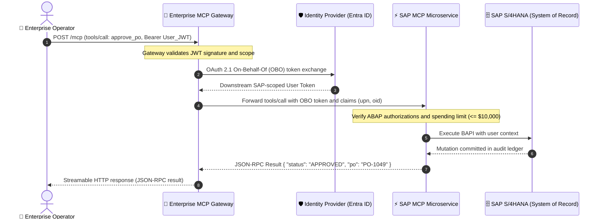

# Lesson 06: Enterprise PaaS Bridges and Serverless Model Context Protocol (MCP)

> **Tier**: `🔵 Advanced`  
> **Estimated Reading Time**: 40 minutes  
> **Prerequisites**: [Lesson 02 (Transports and Lifecycle)](./02-mcp-architecture-transports-and-lifecycle.md), [Lesson 05 (Sandboxing and Security)](./05-sandboxing-security-and-confused-deputy-defenses.md)  
> **Target Audience**: Senior Software Engineers, Enterprise Solutions Architects  
> 
> **Core Concept**: Enterprise organizations store their critical business records in massive Platform-as-a-Service (PaaS) platforms such as SAP, Salesforce, and ServiceNow. Connecting AI agents to these systems requires building Model Context Protocol (MCP) tool servers that act as secure bridges. These bridges translate natural language tool calls into audited, authenticated enterprise API transactions. This lesson covers identity propagation using OAuth 2.1 On-Behalf-Of flows, parameter and value boundaries, and cloud-native serverless deployments using Streamable HTTP.
> 
> **Term Ledger**:
> - `New AI terms introduced`: `Identity Propagation`, `On-Behalf-Of (OBO) Flow`, `OAuth 2.1 Resource Server`, `Enterprise-Managed Authorization (EMA)`, `Serverless MCP`.
> - `AI terms assumed from earlier lessons`: `Tool Calling`, `Model Context Protocol (MCP)`, `Streamable HTTP`, `JSON-RPC 2.0`, `Host`, `Server`, `Elicitation`.

---

## 1. Conceptual Foundation and Mental Model

In local hobbyist development, tools query local SQLite files or mock weather endpoints. In enterprise systems, AI agents must interact directly with multi-billion-dollar **Systems of Record (SoR)**:
- **SAP S/4HANA**: The enterprise resource planning core managing global supply chains, purchase orders, and ledger balances.
- **ServiceNow**: The IT service management center governing production change requests, incident escalations, and configuration databases.
- **Salesforce CRM**: The customer database holding sensitive customer accounts, pipeline opportunities, contacts, and contract terms.

Exposing these platforms directly to a foundation model without architectural controls is hazardous. A hallucinating model could approve fraudulent purchase orders, close active security incidents, or exfiltrate private customer databases.

To connect AI models safely to enterprise backends, engineers use a familiar software design pattern: the **API Gateway and Service Bridge**. In standard microservice architectures, an API gateway terminates incoming client requests, authenticates identity tokens, enforces rate limits, and routes requests to private backend services. 

An Enterprise MCP Bridge performs this same duty for AI models. It acts as an **OAuth 2.1 Resource Server**. It terminates incoming JSON-RPC 2.0 tool requests, validates caller identities, enforces business rule boundaries, and calls downstream enterprise platforms.

> [!NOTE]
> **Where this analogy breaks**: In standard web architectures, the client is deterministic software following rigid, pre-tested code paths. In an AI agent system, the client is a probabilistic foundation model. The model may generate tool calls with novel parameter combinations, out-of-order state transitions, or hallucinated record IDs. Traditional perimeter firewalls only check whether a token is valid; an Enterprise MCP Bridge must also inspect payload semantics, enforce parameter-level financial limits, and trigger human-in-the-loop step-up verification before allowing mutations.

Enterprise MCP engineering introduces three core architectural controls:
1. **User Identity Continuity**: Tools must execute under the calling user's authenticated identity via OAuth 2.1 On-Behalf-Of flows, never under a shared service account.
2. **State Transition Guards**: Agents are restricted to valid business workflows (such as appending work notes rather than closing tickets directly).
3. **Serverless Scalability**: MCP servers run as cloud-native microservices scaling elastically on AWS Lambda or Azure Container Apps using the stateless Streamable HTTP transport.

---

## 2. Architecture and Identity Propagation Topology

The sequence diagram below traces an enterprise tool invocation. It moves from an agent host through an MCP Gateway to an enterprise ERP system, preserving user identity using an OAuth 2.1 On-Behalf-Of flow:



### Architectural Walkthrough
1. **SSO Ingress (Step 1)**: The enterprise user signs into the host environment using company Single Sign-On. The host sends the tool call payload with the user's JSON Web Token (JWT) in the `Authorization` header.
2. **Gateway Interception and Scope Validation (Step 2)**: The Enterprise MCP Gateway validates that the incoming JWT bearer token possesses the registered Application URI and the required scope (`MCP.Tools.Execute`).
3. **On-Behalf-Of (OBO) Token Exchange (Steps 3–4)**: The gateway exchanges the incoming user token with the Identity Provider (such as Entra ID or Okta). The resulting token is scoped strictly to the downstream SAP ERP system.
4. **Audit Claims Injection (Step 5)**: The gateway forwards the tool call with the new token, injecting caller claims (`upn`: User Principal Name, `oid`: Object ID) into the downstream execution context.
5. **Authorization and Limit Verification (Step 6)**: The MCP server checks that the caller possesses the necessary business role and verifies that the transaction does not exceed autonomous monetary thresholds (such as 10,000 USD).
6. **Backend Execution and Ledger Commit (Steps 7–8)**: The MCP server executes the SAP Business Application Programming Interface (BAPI) using the caller's verified permissions. The change commits to the SAP audit ledger under the operator's identity.
7. **Audited Response Stream (Steps 9–10)**: The MCP server returns a typed JSON-RPC 2.0 result to the gateway, which forwards it to the host user interface over Streamable HTTP.

---

## 3. Systems of Record Connector Patterns

Connecting foundation models to enterprise systems requires distinct connector patterns for each platform architecture.

### 1. SAP S/4HANA ERP Connector Pattern
- **Technology**: SAP NetWeaver RFC via native connectors or modern SAP OData v4 REST services.
- **Boundary Rules**:
  - **Read Operations** (`sap_check_stock`, `sap_get_po_status`): Available autonomously to the agent.
  - **Write Operations** (`sap_create_po`, `sap_post_goods_receipt`): Gated by strict parameter bounds (for example, maximum order value <= 10,000 USD). Any order exceeding the threshold requires Human-in-the-Loop step-up Elicitation.
  - **Input Sanitization**: Material numbers must be validated as 18-character alphanumeric strings with leading zeros; Company Codes (`BUKRS`) must match uppercase 4-character strings.
- **ABAP Authorization**: The tool executes using SAP authorization objects (`M_MATE_STA`, `M_EIKP_KAP`), ensuring the user cannot read materials outside their authorized plant.

### 2. ServiceNow ITIL Connector Pattern
- **Technology**: ServiceNow REST Table API and Scripted REST endpoints.
- **Boundary Rules**:
  - **Field-Level Masking**: When querying incidents (`sn_query_incident`), internal work notes, customer passwords, or API keys stored in description fields are scrubbed via regular expressions before reaching the model context.
  - **State Transition Guard**: Agents are strictly prohibited from setting an Incident to `Resolved` (State 6) or `Closed` (State 7) directly. The agent can only append proposed resolution steps to `work_notes` (`POST /api/now/table/incident/{id}/work_notes`).

### 3. Salesforce CRM Connector Pattern
- **Technology**: Salesforce REST API and Tooling API.
- **Boundary Rules**:
  - **SOQL Injection Prevention**: Agents must never generate raw Salesforce Object Query Language (SOQL) strings. The MCP tool accepts typed filter arguments and compiles them using a deterministic query builder with bind variables.
  - **Field-Level Security (FLS) Enforcement**: Strips restricted fields (such as social security numbers or credit card tokens) from query projections before returning data to the model.

The following Python script illustrates a safe, parameterized Salesforce query builder that enforces input sanitization and parameter binding:

```python
"""
safe_crm_query_builder.py
Parameterized SOQL query builder preventing SOQL injection and enforcing Field-Level Security.
"""
import re
from typing import Dict, Any
from pydantic import BaseModel, Field, field_validator


class ContactQueryRequest(BaseModel):
    account_name: str = Field(..., description="Enterprise account identifier")
    region: str = Field(..., description="Sales operational region")

    @field_validator("account_name")
    def sanitize_account_name(cls, value: str) -> str:
        cleaned = re.sub(r"[^a-zA-Z0-9\s]", "", value).strip()
        if not cleaned:
            raise ValueError("Account name must contain valid alphanumeric characters.")
        return cleaned

    @field_validator("region")
    def validate_region(cls, value: str) -> str:
        normalized = value.upper().strip()
        allowed = {"NORTH_AMERICA", "EMEA", "APAC", "LATAM"}
        if normalized not in allowed:
            raise ValueError(f"Invalid region: {normalized}. Allowed: {sorted(allowed)}")
        return normalized


class SafeSalesforceBridge:
    """Enterprise Salesforce bridge enforcing parameter binding and row limits."""

    def build_parameterized_query(self, request: ContactQueryRequest) -> Dict[str, Any]:
        """Compiles validated request into parameterized SOQL with bind variables."""
        soql = (
            "SELECT Id, FirstName, LastName, Title, Email "
            "FROM Contact "
            "WHERE Account.Name LIKE :acc_name AND Region__c = :region "
            "LIMIT 25"
        )
        bind_params = {
            "acc_name": f"%{request.account_name}%",
            "region": request.region,
        }
        return {"soql": soql, "bind_params": bind_params}


if __name__ == "__main__":
    bridge = SafeSalesforceBridge()
    query_req = ContactQueryRequest(account_name="Acme Corp", region="EMEA")
    compiled = bridge.build_parameterized_query(query_req)
    print(f"Compiled SOQL: {compiled['soql']}")
    print(f"Bind parameters: {compiled['bind_params']}")
```

---

## 4. Enterprise Connectors Governance Matrix

The table below outlines required autonomy boundaries and security controls across primary enterprise systems:

| System of Record | MCP Tool Scope | Permitted Agent Autonomy | Forbidden or Gated Actions (Requires HITL) | Mandatory Security Control |
|---|---|---|---|---|
| **SAP S/4HANA** | Inventory, Purchase Orders, Material Ledger | Read status, verify stock, calculate invoice totals | Create purchase orders > 10,000 USD, post manual ledger adjustments, alter vendor bank details | BAPI parameter type validation, SAP RFC connection pool isolation, ABAP authorization object verification |
| **ServiceNow** | Incidents, Change Requests, CMDB Assets | Read tickets, search knowledge articles, append work notes | Resolve incidents, approve emergency RFC changes, modify CMDB configuration baselines | Sensitive data regex masking, state transition validation, read-only REST service accounts |
| **Salesforce CRM** | Leads, Accounts, Opportunities, Contacts | Query contact info, summarize account history, draft email tasks | Delete contact records, modify deal commission splits, export bulk CSV reports | Parameterized SOQL (No raw query input), Field-Level Security enforcement, maximum 25-row limit |

---

## 5. Cloud-Native Serverless MCP Deployments

Deploying MCP servers on persistent virtual machines wastes compute budget when agent tool traffic is bursty. Modern enterprise architectures deploy remote MCP servers as **Serverless Stateless Containers**.

```text
+-------------------------------------------------------------------------------+
| Serverless MCP Architecture (AWS / Azure)                                     |
|                                                                               |
| [Agent Host Application]                                                      |
|      |                                                                        |
|      v HTTPS POST /mcp (Streamable HTTP, JSON-RPC tools/call)                 |
| [Enterprise API Gateway / Application Load Balancer]                          |
|      |                                                                        |
|      +---> [Serverless Container: AWS Lambda / Azure Container Apps]         |
|                 - Cold Start: < 250ms with pre-warmed runtimes                |
|                 - Scales to 0 when idle                                       |
|                 - Stateless: session context passed via _meta headers         |
+-------------------------------------------------------------------------------+
```

### Key Serverless Engineering Principles
1. **Stateless Core**: In accordance with the MCP specification, remote HTTP servers maintain zero in-memory conversational session state between requests. All state and authorization tokens are passed in request headers or metadata envelopes.
2. **Cold Start Budgeting**: To prevent LLM tool calling timeouts (which typically occur after 10–30 seconds), container initialization must stay well under 1,000 milliseconds. Keep container images lean by avoiding heavy machine learning frameworks inside tool servers.
3. **Response Streaming**: Tools producing large responses (such as multi-row database outputs) stream chunked HTTP responses using Transfer-Encoding: chunked or Server-Sent Events, avoiding gateway buffer limits.

---

## 6. Production Implementation: Enterprise ERP Authorization Gateway

The following complete script demonstrates an enterprise-grade ERP tool gateway in Python 3.12+. It implements JWT claim inspection, spending ceiling validation, and audited execution logging:

```python
"""
enterprise_erp_gateway.py
Production Enterprise MCP Gateway with JWT Identity Propagation and Value Bounds.
"""
import asyncio
from typing import Dict, Any, List, Optional
from pydantic import BaseModel, Field, field_validator


class PurchaseOrderApprovalRequest(BaseModel):
    """Schema for purchase order approval tool calls."""
    po_number: str = Field(..., pattern=r"^PO-[0-9]{4,8}$", description="SAP PO identifier")
    total_amount_usd: float = Field(..., gt=0.0, description="Total invoice amount to approve")
    cost_center: str = Field(..., pattern=r"^CC-[A-Z]{3}-[0-9]{3}$", description="Cost center code")

    @field_validator("total_amount_usd")
    def validate_spending_ceiling(cls, amount: float) -> float:
        max_autonomous_limit = 10000.00
        if amount > max_autonomous_limit:
            raise ValueError(
                f"Autonomous spending limit exceeded (${amount:,.2f} > ${max_autonomous_limit:,.2f}). "
                "Action requires cryptographic human-in-the-loop step-up approval."
            )
        return amount


class EnterpriseSapConnector:
    """Simulated enterprise SAP bridge enforcing caller permissions and audit trails."""

    def __init__(self, sap_gateway_url: str):
        self.gateway_url = sap_gateway_url

    async def execute_po_approval(
        self,
        request: PurchaseOrderApprovalRequest,
        user_jwt_claims: Dict[str, Any]
    ) -> Dict[str, Any]:
        """Executes purchase order approval under the caller's specific identity."""
        upn = user_jwt_claims.get("upn", "UNKNOWN_PRINCIPAL")
        roles: List[str] = user_jwt_claims.get("roles", [])

        if "ERP.Approver" not in roles:
            return {
                "is_error": True,
                "error_code": "ABAP_AUTH_FAILURE",
                "message": f"Principal '{upn}' lacks the required 'ERP.Approver' role in enterprise directory."
            }

        # Simulated successful enterprise mutation
        return {
            "is_error": False,
            "status": "APPROVED",
            "po_number": request.po_number,
            "amount_usd": request.total_amount_usd,
            "audited_by_upn": upn,
            "cost_center": request.cost_center,
            "bapi_return_code": "BAPI_000_SUCCESS"
        }


class EnterpriseMcpGatewayHandler:
    """Gateway dispatch handler simulating JSON-RPC tools/call processing."""

    def __init__(self, connector: EnterpriseSapConnector):
        self.connector = connector

    async def handle_tool_call(
        self,
        tool_name: str,
        arguments: Dict[str, Any],
        user_jwt_claims: Dict[str, Any]
    ) -> Dict[str, Any]:
        """Dispatches validated tool execution requests."""
        if tool_name == "sap_approve_purchase_order":
            try:
                validated_req = PurchaseOrderApprovalRequest(**arguments)
                execution_result = await self.connector.execute_po_approval(
                    validated_req, user_jwt_claims
                )
                return {
                    "jsonrpc": "2.0",
                    "result": {"content": [{"type": "text", "text": str(execution_result)}]},
                    "id": 1
                }
            except Exception as exc:
                return {
                    "jsonrpc": "2.0",
                    "error": {"code": -32602, "message": f"Invalid tool arguments: {str(exc)}"},
                    "id": 1
                }

        return {
            "jsonrpc": "2.0",
            "error": {"code": -32601, "message": f"Unknown tool: {tool_name}"},
            "id": 1
        }


async def main():
    connector = EnterpriseSapConnector("https://erp-gateway.corp.internal/sap/bc/mcp")
    gateway = EnterpriseMcpGatewayHandler(connector)

    # 1. Valid invocation by an authorized engineer
    authorized_claims = {
        "upn": "alice.architect@corp.internal",
        "roles": ["ERP.Approver", "Engineering.Lead"]
    }
    valid_args = {
        "po_number": "PO-104928",
        "total_amount_usd": 4500.00,
        "cost_center": "CC-FIN-101"
    }
    res1 = await gateway.handle_tool_call("sap_approve_purchase_order", valid_args, authorized_claims)
    print("Test 1 (Authorized):", res1["result"]["content"][0]["text"])

    # 2. Unauthorized invocation by a viewer
    unauthorized_claims = {
        "upn": "charlie.contractor@external.com",
        "roles": ["Viewer"]
    }
    res2 = await gateway.handle_tool_call("sap_approve_purchase_order", valid_args, unauthorized_claims)
    print("Test 2 (Unauthorized Role):", res2["result"]["content"][0]["text"])

    # 3. Invocation exceeding autonomous spending limit
    excessive_args = {
        "po_number": "PO-994821",
        "total_amount_usd": 25000.00,
        "cost_center": "CC-OPS-202"
    }
    res3 = await gateway.handle_tool_call("sap_approve_purchase_order", excessive_args, authorized_claims)
    print("Test 3 (Spending Limit Exceeded):", res3["error"]["message"])


if __name__ == "__main__":
    asyncio.run(main())
```

---

## 7. Systems Failure Modes and Anti-Patterns

### Failure Mode 1: The Shared God-Account Service Credential
* **Root Cause**: The MCP server connects to SAP or Salesforce using a single hardcoded system administrator credential (`sa_admin`). Every tool action across all enterprise users executes under this superuser.
* **Impact**: Total loss of auditability. Compliance failure under SOC2, HIPAA, or ISO 27001. A compromised agent can read or mutate any record across the entire company.
* **Production Fix**: Always implement OAuth 2.1 On-Behalf-Of (OBO) token exchange. The MCP server must execute tools using the specific calling user's delegated credentials.

### Failure Mode 2: Unbounded Bulk Data Exfiltration
* **Root Cause**: A tool `query_crm_contacts(filter: str)` allows unpaginated queries. An agent manipulated by prompt injection executes `filter: "all"` and streams 500,000 corporate customer contacts out of the database.
* **Impact**: Data privacy breach and high token consumption costs.
* **Production Fix**: Enforce strict query pagination with hard limits (such as `LIMIT 25`) and block wildcard projections in the query compiler.

### Failure Mode 3: State Desynchronization in Long-Running Mutations
* **Root Cause**: An agent initiates a multi-step ERP order across three separate tool calls: `create_order` -> `reserve_inventory` -> `charge_credit_card`. If step 2 fails, the agent halts, leaving orphaned unbilled purchase orders in the ERP system.
* **Impact**: Financial inconsistency and database corruption.
* **Production Fix**: Encapsulate multi-step mutations into atomic backend sagas or stored procedures, or execute them through transactional orchestration engines.

---

## 8. Architectural Trade-off Matrix

| Architecture Dimension | Direct PaaS API Calling | Enterprise MCP Gateway | Custom RPA Bot Scripts |
|---|---|---|---|
| **Identity Delegation** | Difficult to coordinate across tools | **Standardized OAuth 2.1 OBO Flow** | Shared bot service account (High risk) |
| **Audit Compliance** | Fragmented across individual scripts | **Centralized OpenTelemetry Tracing** | Fragile screen-scrape audit logs |
| **Maintenance Burden** | High (Each model needs custom SDK) | **Low (Uniform JSON-RPC 2.0 interfaces)** | Extremely high (Breaks on UI updates) |
| **Deployment Model** | Embedded in client application | **Serverless Microservice (Lambda / ACA)** | Dedicated Windows VM workers |

---

## 9. Hands-On Lab Exercise

### Objective
Implement an enterprise MCP connector for purchase order approval that extracts caller claims from simulated JWT headers, rejects approvals exceeding 10,000 USD, and commits verified orders to an audit log.

### Acceptance Criteria
1. Define a Pydantic schema enforcing PO pattern `^PO-[0-9]{4,8}$` and cost center formatting.
2. Assert that requests exceeding 10,000 USD are rejected with a structured validation error.
3. Assert that callers lacking the `ERP.Approver` claim in their JWT are rejected with `ABAP_AUTH_FAILURE`.
4. Ensure the output payload contains the caller's verified `upn` for corporate audit trails.

---

## 10. Enterprise Production Checklist

- [ ] All enterprise MCP servers authenticate callers via OAuth 2.1 Bearer JWTs and validate registered audience and scope claims.
- [ ] Delegated user identities (`upn`, `oid`) are propagated to downstream Systems of Record via On-Behalf-Of token flows.
- [ ] Mutating tools in ERP and CRM systems enforce strict financial and operational threshold boundaries (such as maximum transaction amounts).
- [ ] Systems of Record connectors implement parameterized query builders to eliminate SOQL and SQL injection vulnerabilities.
- [ ] Cloud MCP services are deployed on serverless stateless platforms (AWS Lambda or Azure Container Apps) scaling horizontally behind Layer-7 load balancers.

---

## 11. Quick Check

**Question 1**: Why should an enterprise MCP server use an OAuth 2.1 On-Behalf-Of (OBO) flow rather than a shared service account?
- A) A shared service account is slower because it requires repeated database handshakes.
- B) An OBO flow ensures mutations in systems of record are audited under the individual user's identity and constrained by the user's permissions.
- C) Foundation models cannot generate tool calls when connected to a service account.
- D) OBO flows eliminate the need for an enterprise API gateway.

*Answer*: **B**. Using a shared service account (the "god-account" anti-pattern) causes complete loss of auditability and allows prompt-injected agents to bypass individual user permission boundaries. An OBO flow ensures the tool executes under the user's authenticated principal.

**Question 2**: When an agent attempts an ERP mutation exceeding the autonomous spending threshold (such as a 25,000 USD purchase order), what architectural pattern must the tool server enforce?
- A) Silently round the order down to the 10,000 USD maximum.
- B) Execute the order anyway and log a warning to standard output.
- C) Reject autonomous execution and trigger Human-in-the-Loop step-up verification via MCP Elicitation.
- D) Retrain the model on enterprise spending guidelines.

*Answer*: **C**. High-value financial mutations must never execute autonomously. The server rejects autonomous completion and requests cryptographic step-up approval from an authorized human operator via the Elicitation primitive.

**Question 3**: In a serverless MCP deployment running on AWS Lambda or Azure Container Apps, how should the server maintain session state between tool calls?
- A) Store session state on local container disk (`/tmp`).
- B) Maintain zero server-side session state, passing necessary context and credentials statelessly via request headers and metadata envelopes.
- C) Keep persistent TCP socket connections open indefinitely between calls.
- D) Write state to local process memory across requests.

*Answer*: **B**. Serverless containers scale to zero when idle and cannot rely on local process memory or disk persistence. The Stateless MCP Core standardizes passing context statelessly via headers and metadata.

---

## 🧭 Navigation

[Previous: Lesson 05 — Sandboxing, Security & Confused Deputy Defenses](./05-sandboxing-security-and-confused-deputy-defenses.md) | [Next: Phase 03 Capstone Lab Challenge](./labs/capstone-mcp-tool-server.md) | [Back to Phase 03 Hub](./README.md)
