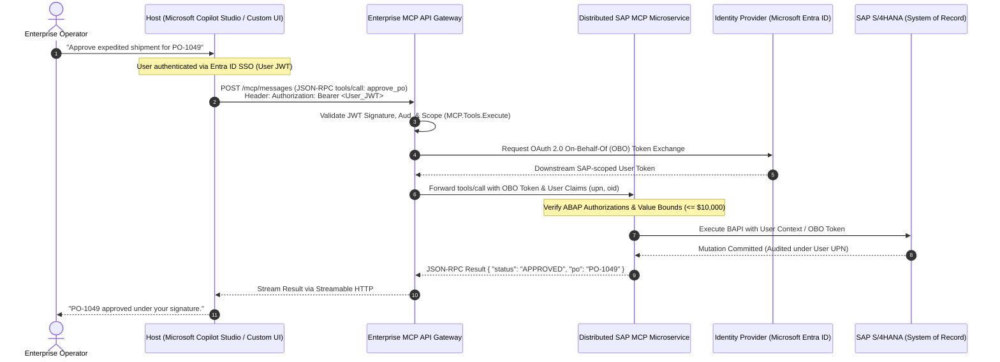

# Lesson 06: Enterprise PaaS Bridges & Serverless MCP

> **Tier**: `🔵 Tier 4: Frontier & Advanced Systems`  
> **Estimated Reading Time**: 50 minutes  
> **Prerequisites**: Lesson 02 (Transports & Stateless Core), Lesson 05 (Security & Confused Deputy Defenses)  
> **Target Audience**: Senior Software Engineers, Enterprise Solutions Architects  

---

## 1. Conceptual Foundation & Mental Model

In hobbyist AI development, tools query local SQLite files or mock weather APIs. In the enterprise, AI agents must interact directly with multi-billion-dollar **Systems of Record (SoR)**:
- **SAP S/4HANA**: The core ERP managing global supply chains, purchase orders, and ledger balances.
- **ServiceNow**: The ITIL nerve center governing production change requests, incident escalations, and CMDB assets.
- **Salesforce CRM**: The customer database holding sensitive pipeline data, contacts, and contract terms.

Exposing these systems directly to an LLM without architectural controls is catastrophic. A hallucinating agent could execute unapproved purchases, close active security incidents, or exfiltrate customer databases.

Enterprise MCP engineering introduces **Strict Authorization Boundaries and Identity Propagation**:
1. **User Identity Continuity**: Tools must execute under the calling user's authenticated identity (via OAuth 2.0 On-Behalf-Of flows), never under a high-privilege god-mode service account.
2. **State Transition Guards**: Agents are restricted to valid business workflows (e.g. drafting work notes rather than closing tickets).
3. **Serverless Scalability**: MCP servers run as cloud-native microservices scaling elastically on AWS Lambda or Azure Container Apps using the **Stateless MCP Core (Specification v2026-07-28)**.

---

## 2. Architecture & Identity Propagation Topology

The sequence diagram below traces an end-to-end enterprise tool invocation from Microsoft Copilot Studio through an MCP Gateway to SAP S/4HANA, preserving user identity via an OAuth 2.0 On-Behalf-Of (OBO) flow:



### Architectural Walkthrough
1. **SSO Ingress (Step 1)**: The enterprise user authenticates to the host environment using company Single Sign-On (Microsoft Entra ID / Okta).
2. **Gateway Interception & Scope Validation (Steps 2–3)**: The host transmits the tool call over HTTPS. The Enterprise MCP Gateway validates that the incoming JWT bearer token possesses the registered Application URI (`api://mcp-enterprise-gateway`) and the required scope (`MCP.Tools.Execute`).
3. **On-Behalf-Of (OBO) Token Exchange (Steps 4–5)**: The gateway exchanges the incoming user token with the Identity Provider for a specialized token scoped strictly to the downstream SAP ERP system.
4. **Audit Claims Injection (Step 6)**: The gateway injects user claims (`upn`: User Principal Name, `oid`: Object ID) into downstream execution context.
5. **ABAP Authorization Verification (Steps 7–8)**: The MCP server executes SAP BAPIs using the caller's specific permissions, ensuring the user cannot approve orders outside their plant authorization.
6. **Audited Response Stream (Steps 9–11)**: The mutation commits to the database ledger with an auditable user signature, returning a streamable JSON-RPC result to the user.

---

## 3. Systems of Record Connector Patterns

### 1. SAP S/4HANA ERP Connector Pattern
- **Technology**: SAP NetWeaver RFC via `pyrfc` / SAP Cloud SDK (.NET/Java) or SAP OData v4 Services.
- **Boundary Rules**:
  - **Read Operations** (`sap_check_stock`, `sap_get_po_status`): Available autonomously to the agent.
  - **Write Operations** (`sap_create_po`, `sap_post_goods_receipt`): Gated by strict parameter bounds (e.g., maximum order value $\le \$10,000$). Any order exceeding the threshold requires Human-in-the-Loop step-up Elicitation.
  - **Input Sanitization**: Material numbers must be validated as 18-character alphanumeric strings with leading zeros; Company Codes (`BUKRS`) must match uppercase 4-character strings.
- **ABAP Authorization**: The tool executes using SAP authorization objects (`M_MATE_STA`, `M_EIKP_KAP`), ensuring the user cannot read materials outside their plant authorization.

### 2. ServiceNow ITIL Connector Pattern
- **Technology**: ServiceNow REST Table API & Scripted REST endpoints.
- **Boundary Rules**:
  - **Field-Level Masking**: When querying incidents (`sn_query_incident`), internal work notes, customer passwords, or API keys stored in description fields are scrubbed via regex before the payload reaches the model context.
  - **State Transition Guard**: Agents are strictly prohibited from setting an Incident to `Resolved` (State 6) or `Closed` (State 7) directly. The agent can only append proposed resolution steps to `work_notes` (`POST /api/now/table/incident/{id}/work_notes`).

### 3. Salesforce CRM Connector Pattern
- **Technology**: Salesforce REST API / Tooling API.
- **Boundary Rules**:
  - **SOQL Injection Prevention**: Agents must never generate raw SOQL strings. The MCP tool accepts typed filter arguments and compiles them using a deterministic query builder:
    ```python
    # Safe Parameterized SOQL Builder in MCP Tool
    @mcp.tool()
    async def find_crm_contacts(account_name: str, region: str) -> str:
        """Finds active customer contacts within an authorized account and region."""
        safe_name = re.sub(r"[^a-zA-Z0-9\s]", "", account_name).strip()
        safe_region = region.upper()
        if safe_region not in ["NORTH_AMERICA", "EMEA", "APAC", "LATAM"]:
            raise ValueError(f"Invalid region: {safe_region}")
        
        # Parameterized query prevents SOQL injection
        soql = (
            "SELECT Id, FirstName, LastName, Title, Email "
            "FROM Contact "
            "WHERE Account.Name LIKE :acc_name AND Region__c = :region "
            "LIMIT 25"
        )
        return await salesforce_client.query(soql, acc_name=f"%{safe_name}%", region=safe_region)
    ```
  - **FLS & OLS Enforcement**: Enforces Field-Level Security (FLS) to ensure restricted fields (e.g., `Social_Security_Number__c`) are stripped from query projections.

---

## 4. Enterprise Connectors Governance Matrix

| System of Record | MCP Tool Scope | Permitted Agent Autonomy | Forbidden / Gated Actions (Requires HITL) | Mandatory Security Control |
|---|---|---|---|---|
| **SAP S/4HANA** | Inventory, Purchase Orders, Material Ledger | Read status, verify stock, calculate invoice totals | Create purchase orders > \$10,000, post manual ledger adjustments, alter vendor bank details | BAPI parameter type validation, SAP RFC connection pool isolation, ABAP authorization object verification |
| **ServiceNow** | Incidents, Change Requests, CMDB Assets | Read tickets, search knowledge articles, append work notes | Resolve incidents, approve emergency RFC changes, modify CMDB configuration baselines | PII/Secret regex masking, state transition validation, read-only REST service accounts |
| **Salesforce CRM** | Leads, Accounts, Opportunities, Contacts | Query contact info, summarize account history, draft email tasks | Delete contact records, modify deal commission splits, export bulk CSV reports | Parameterized SOQL (No raw query input), Field-Level Security (FLS) enforcement, maximum 50-row limit |

---

## 5. Cloud-Native Serverless MCP Deployments

Deploying MCP servers as long-running VMs wastes cloud compute when agent traffic is bursty. Modern enterprise architectures deploy MCP servers using **Serverless Stateless Containers**.

```text
+-------------------------------------------------------------------------------+
| Serverless MCP Architecture (AWS / Azure)                                     |
|                                                                               |
| [Agent Host]                                                                  |
|      |                                                                        |
|      v HTTPS POST /mcp (Header: Mcp-Method: tools/call)                       |
| [AWS Application Load Balancer / Azure Ingress]                               |
|      |                                                                        |
|      +---> [AWS Lambda (Response Streaming) / Azure Container Apps]          |
|                 - Cold Start: < 250ms                                         |
|                 - Scales to 0 when idle                                       |
|                 - Uses Streamable HTTP (Stateless Core v2026-07-28)           |
+-------------------------------------------------------------------------------+
```

### AWS Lambda with Response Streaming
Using AWS Lambda with Node.js or Python runtime and Response Streaming, an MCP server can stream chunked JSON-RPC frames directly to the client:
- Employs **Streamable HTTP** with `awslambdaruntime` streaming.
- Scales automatically from 0 to 1,000 concurrent tool executions.
- Zero state maintained on disk; context passed via `_meta` headers.

---

## 6. Production Implementation: Enterprise ERP Authorization Gateway

The following script implements an enterprise-grade ERP tool gateway in Python 3.12+ demonstrating JWT claim extraction, value threshold validation, and parameterized query execution:

```python
"""
enterprise_erp_gateway.py
Production Enterprise MCP Gateway with JWT Identity Propagation & Value Bounds.
Requirements: pip install pydantic
"""

from typing import Dict, Any, Optional
import re
from pydantic import BaseModel, Field, field_validator

# ---------------------------------------------------------------------------
# 1. Pydantic Schemas for Enterprise Tool Invocations
# ---------------------------------------------------------------------------

class PurchaseOrderApprovalRequest(BaseModel):
    po_number: str = Field(..., pattern=r"^PO-[0-9]{4,8}$", description="SAP PO identifier")
    total_amount_usd: float = Field(..., gt=0.0, description="Total invoice amount to approve")
    cost_center: str = Field(..., pattern=r"^CC-[A-Z]{3}-[0-9]{3}$", description="Cost center code")

    @field_validator("total_amount_usd")
    def validate_spending_ceiling(cls, amount: float) -> float:
        MAX_AUTONOMOUS_LIMIT = 10000.00
        if amount > MAX_AUTONOMOUS_LIMIT:
            raise ValueError(
                f"Autonomous spending limit exceeded (${amount:,.2f} > ${MAX_AUTONOMOUS_LIMIT:,.2f}). "
                "Action requires two-phase cryptographic step-up approval."
            )
        return amount

# ---------------------------------------------------------------------------
# 2. Enterprise SAP Connector
# ---------------------------------------------------------------------------

class EnterpriseSapConnector:
    def __init__(self, sap_gateway_url: str):
        self.gateway_url = sap_gateway_url

    async def execute_po_approval(
        self,
        request: PurchaseOrderApprovalRequest,
        user_jwt_claims: Dict[str, Any]
    ) -> Dict[str, Any]:
        """
        Executes SAP BAPI under the caller's specific User Principal Name (UPN).
        """
        upn = user_jwt_claims.get("upn", "UNKNOWN_PRINCIPAL")
        roles = user_jwt_claims.get("roles", [])

        if "ERP.Approver" not in roles:
            return {
                "is_error": True,
                "error_code": "ABAP_AUTH_FAILURE",
                "message": f"Principal '{upn}' lacks the required 'ERP.Approver' role in Entra ID."
            }

        # Simulated SAP RFC / BAPI execution
        return {
            "status": "APPROVED",
            "po_number": request.po_number,
            "amount_usd": request.total_amount_usd,
            "audited_by_upn": upn,
            "bapi_return_code": "BAPI_000_SUCCESS"
        }
```

---

## 7. Systems Failure Modes & Anti-Patterns

### Failure Mode 1: The "God Account" Service Credential Anti-Pattern
* **Root Cause**: The MCP server connects to SAP or Salesforce using a single hardcoded system administrator credential (`sa_admin`). Every tool action across all enterprise users executes under this superuser.
* **Impact**: Total loss of auditability. Compliance failure under SOC2 / ISO 27001. A compromised agent can read or mutate any record across the entire enterprise.
* **Production Fix**: Always implement OAuth 2.0 On-Behalf-Of (OBO) token exchange. The MCP server must execute tools using the specific user's delegated credentials.

### Failure Mode 2: Unbounded Bulk Data Exfiltration
* **Root Cause**: A tool `query_crm_contacts(filter: str)` allows unpaginated queries. An agent manipulated by prompt injection executes `filter: "all"` and streams 500,000 corporate customer contacts out of the system.
* **Production Fix**: Enforce strict query pagination with hard limits (e.g. `LIMIT 50`) and block wildcard projections.

### Failure Mode 3: State Desynchronization in Long-Running Mutations
* **Root Cause**: An agent initiates a multi-step ERP order across three separate tool calls: `create_order` → `reserve_inventory` → `charge_credit_card`. If step 2 fails, the agent abandons the loop, leaving orphaned unbilled purchase orders in SAP.
* **Production Fix**: Encapsulate multi-step mutations into atomic backend sagas, or require the agent to operate through transactional orchestration engines (explored in Phase 04).

---

## 8. Architectural Trade-off Matrix

| Architecture Dimension | Direct PaaS API Calling | Enterprise MCP Gateway | Custom RPA Bot Scripts |
|---|---|---|---|
| **Identity Delegation** | Difficult to coordinate across tools | **Standardized OBO Flow** | Shared bot service account (High risk) |
| **Audit Compliance** | Fragmented across individual scripts | **Centralized OpenTelemetry Tracing** | Fragile screen-scrape audit logs |
| **Maintenance Burden** | High (Every model needs custom SDK) | **Low (Uniform JSON-RPC 2.0 interfaces)**| Extremely high (Breaks on UI updates) |
| **Deployment Model** | Embedded in client application | **Serverless Microservice (Lambda / ACA)** | Dedicated Windows VM workers |

---

## 9. Hands-On Lab Exercise

### Objective
Implement an enterprise MCP connector for purchase order approval that extracts caller claims from simulated JWT headers, rejects approvals exceeding \$10,000, and commits verified orders to an audit log.

### Acceptance Criteria
1. Define a Pydantic schema enforcing PO pattern `^PO-[0-9]{4,8}$` and cost center formatting.
2. Assert that requests exceeding \$10,000 are rejected with a structured `is_error: True` payload.
3. Assert that callers lacking the `ERP.Approver` claim in their JWT are rejected with `ABAP_AUTH_FAILURE`.
4. Ensure the output payload contains the caller's verified `upn` for corporate audit trails.

---

## 10. Enterprise Production Checklist

- [ ] All enterprise MCP servers authenticate callers via OAuth 2.0 Bearer JWTs and validate registered audience and scope claims.
- [ ] Delegated user identities (`upn`, `oid`) are propagated to downstream Systems of Record via On-Behalf-Of (OBO) token flows.
- [ ] Mutating tools in ERP/CRM systems enforce strict financial and operational threshold boundaries (e.g. maximum transaction amounts).
- [ ] Systems of Record connectors implement parameterized query builders to eliminate SOQL / SQL injection vulnerabilities.
- [ ] Cloud MCP services are deployed on serverless stateless platforms (AWS Lambda / Azure Container Apps) scaling horizontally behind Layer-7 ALBs.

---

[Previous: Lesson 05 — Sandboxing, Security & Confused Deputy Defenses](./05-sandboxing-security-and-confused-deputy-defenses.md) | [Next: Phase 03 Capstone Lab Challenge](./labs/capstone-mcp-tool-server.md) | [Back to Phase 03 Hub](./README.md)
