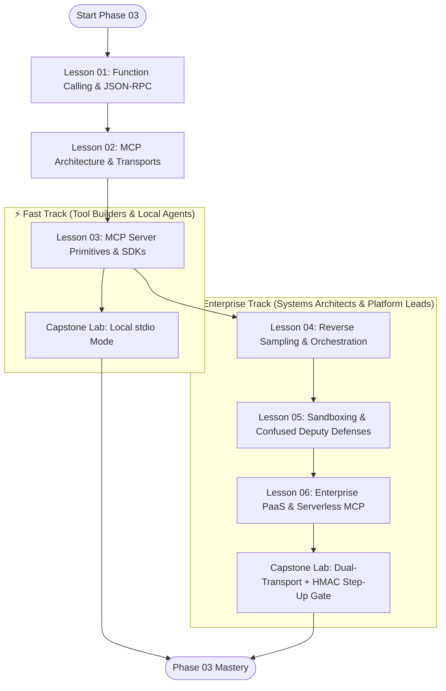

# Phase 03: Tools and Model Context Protocol — Comprehensive Refactoring Plan

**Planning Mode**: Curricular & Structural Plan  
**Target Phase**: `03-tools-and-model-context-protocol/`  
**Architect**: AI Curriculum Architect  
**Audience**: Senior Software Engineers, Staff Architects (7–10+ years experience)  
**Date**: September 2026  
**Status**: READY FOR REFACTORING  

---

## 1. Executive Summary & Goals

The goal of this refactoring is to transition Phase 03 from an unstructured 1,220-line monolithic README into an authoritative, modular 6-lesson curriculum aligned with the repository's 4-Tier Depth Architecture and the latest 2025/2026 Model Context Protocol standards.

### Key Objectives
1. **Decompose the Monolith**: Break `README.md` into 6 distinct, self-contained lesson files with dedicated code benchmarks, failure modes, and breadcrumb navigation.
2. **Purge Internal Metadata**: Eliminate all author-facing meta-directive tags (`[MUST-HAVE] 🔴`, `[GOOD-TO-KNOW] 🟡`) and enforce Zero-LaTeX compliance.
3. **Incorporate 2025/2026 Advancements**:
   - Modernize transports: contrast local `stdio` with **Streamable HTTP (Specification v2026-07-28 / v2025-03-26)** rather than relying solely on legacy HTTP+SSE.
   - Introduce the **Stateless MCP Core** (header-based routing with `Mcp-Protocol-Version`, `_meta` request envelopes, horizontal scaling without sticky sessions).
   - Standardize Human-in-the-Loop on the official **Elicitation primitive** (`form` and `url` modes).
   - Address context window limits via **Dynamic Tool Discovery** (meta-tools, schema vector indexing) and the **"Think in Code"** pattern.
   - Establish a concrete architectural comparison between **MCP (vertical agent-to-tool)** and **A2A (horizontal agent-to-peer)**.
4. **Preserve Production Depth**: Maintain all existing enterprise code implementations (FastMCP SQLGlot AST safety, .NET 9 Semantic Kernel filters, SAP BAPI / ServiceNow governance, and the dual-transport capstone challenge).

---

## 2. Target Lesson Breakdown & Depth Calibration

| Lesson File | Title | Depth Tier | Est. Time | Core Systems Concepts Covered |
|---|---|:---:|:---:|---|
| **`README.md`** | **Phase 03: Tools & Model Context Protocol Hub** | `Phase Hub` | 10 min | Architecture map, modular lesson directory, prerequisite/downstream dependency graph, learning paths, capstone guide. |
| **`01-function-calling-and-json-rpc-wire-protocols.md`** | **Function Calling & JSON-RPC 2.0 Wire Protocols** | `🟢 Tier 1: Core` | 35–45 min | Single-turn tool execution mechanics; JSON-RPC 2.0 framing & error codes; tool schema compilation; constrained decoding (FSM logit masking); dynamic tool discovery; "Think in Code" data sandboxing. |
| **`02-mcp-architecture-transports-and-lifecycle.md`** | **MCP Architecture, Transports & Protocol Lifecycle** | `🟢 Tier 1: Core` | 40–50 min | Client-Host-Server topology; capability negotiation; `stdio` IPC pipes; Streamable HTTP (Single POST); Stateless Core v2026-07-28; header routing; MCP vs A2A architectural matrix. |
| **`03-mcp-server-primitives-tools-resources-prompts.md`** | **MCP Server Primitives: Tools, Resources, Prompts & Elicitation** | `🟡 Tier 2: Engineering Depth` | 45–55 min | The 5 core primitives: Tools (`tools/call`), Resources (`schema://`), Prompts (`prompts/get`), Sampling, and Elicitation (`form` & `url` HITL standard); FastMCP Python, TypeScript, and .NET 9 Semantic Kernel. |
| **`04-reverse-sampling-and-host-orchestration.md`** | **Reverse Sampling & Host Orchestration** | `⚫ Tier 3: Deep Dive` | 40–50 min | Host Client Gateway; reverse LLM completions (`sampling/createMessage`); execution governors; oscillation deadlock circuit breakers; tool output compaction (token bombing defense). |
| **`05-sandboxing-security-and-confused-deputy-defenses.md`** | **Sandboxing, Security & Confused Deputy Defenses** | `🔵 Tier 4: Advanced` | 45–55 min | Confused Deputy attacks; indirect prompt injection; SQLGlot AST validation; microVM sandboxing (gVisor vs Firecracker vs WASM); HMAC-SHA256 two-phase execution gates. |
| **`06-enterprise-paas-bridges-and-serverless-mcp.md`** | **Enterprise PaaS Bridges & Serverless MCP** | `🔵 Tier 4: Advanced` | 45–55 min | Systems of Record (SAP S/4HANA BAPI RFC, ServiceNow ITIL, Salesforce CRM); Entra ID OAuth 2.0 OBO identity propagation; Copilot Studio & Agentforce bridges; serverless AWS Lambda response streaming. |

---

## 3. Migration & Source Mapping

This table outlines where every section of the monolithic 1,220-line `README.md` will be migrated and enhanced:

```text
Old Monolith Section                              -> Target Destination
------------------------------------------------------------------------------------------------------------------------
Lines 1-23: Phase Title & Intro                   -> 03-.../README.md (Modernized Phase Hub)
Lines 24-138: Function Calling & JSON-RPC         -> 01-function-calling-and-json-rpc-wire-protocols.md
Lines 140-265: MCP Core Spec & Transports         -> 02-mcp-architecture-transports-and-lifecycle.md
Lines 266-475: Language SDKs & Primitives         -> 03-mcp-server-primitives-tools-resources-prompts.md
Lines 477-598: Desktop & IDE Integration          -> 02-mcp-architecture... & 03-mcp-server... (Practical configs)
Lines 600-705: Sandboxing & Context Invalidation  -> 05-sandboxing-security-and-confused-deputy-defenses.md
Lines 707-820: Enterprise PaaS & Connectors       -> 06-enterprise-paas-bridges-and-serverless-mcp.md
Lines 822-885: Architecture Diagram & Flows       -> 02-mcp-architecture-transports-and-lifecycle.md
Lines 887-934: Execution Sequence Diagram         -> 04-reverse-sampling-and-host-orchestration.md
Lines 936-964: Tradeoff Matrices                  -> 01 (Calling vs MCP) & 02 (stdio vs Streamable HTTP)
Lines 966-1144: Failure Modes & Mitigations       -> Distributed across Lessons 01, 04, 05
Lines 1146-1185: Production Code Implementations  -> Referenced in Lessons 03, 05, and examples/
Lines 1187-1212: Curated Resources                -> 03-.../README.md (Curated Bibliography)
Lines 1214-1220: Capstone Lab Challenge           -> labs/capstone-mcp-tool-server.md & 03-.../README.md
```

---

## 4. Learning Paths

To accommodate senior developers with different learning objectives, Phase 03 provides two distinct pathways:



1. **⚡ Fast Track: AI Tool & Desktop Agent Developer (1.5–2 hours)**
   - Focus: Building local tools for Cursor, Claude Desktop, and CLI scripts.
   - Sequence: `Lesson 01` → `Lesson 02` → `Lesson 03` → `Capstone Lab (stdio Mode)`.
2. **🏢 Enterprise Track: AI Systems Architect & Platform Engineer (3.5–4.5 hours)**
   - Focus: Distributed multi-tenant MCP microservices, serverless deployments, security perimeters, and SAP/CRM enterprise governance.
   - Sequence: `Lesson 01` → `Lesson 02` → `Lesson 03` → `Lesson 04` → `Lesson 05` → `Lesson 06` → `Capstone Lab (Full Dual-Transport + HITL Step-Up)`.

---

## 5. Diagram Enhancement Plan

Every diagram across Phase 03 will include a structured, numbered prose walkthrough explaining data flow, invariants, and failure edges:

1. **Lesson 01: Single-Turn Function Calling vs AST "Think in Code" Pipeline**
   - *Type*: Flowchart (`flowchart TD`).
   - *Walkthrough*: Traces client intent, model tool selection via constrained logit masking, execution sandbox, AST data filtering, and prompt context grounding.
2. **Lesson 02: MCP Host-Client-Server Topology & Streamable HTTP**
   - *Type*: Architecture Flowchart (`flowchart TD`).
   - *Walkthrough*: Contrasts POSIX stdio kernel pipes with Streamable HTTP single-POST endpoints, explaining header-based routing (`Mcp-Protocol-Version`, `_meta`) and load balancing.
3. **Lesson 02: MCP (Vertical) vs A2A (Horizontal) Systems Map**
   - *Type*: Boundary Flowchart (`flowchart LR`).
   - *Walkthrough*: Illustrates an orchestrator receiving an A2A task delegation from a peer agent, then using local MCP servers to query enterprise databases.
4. **Lesson 03: The 5 MCP Primitives Interaction Lifecycle**
   - *Type*: Sequence Diagram (`sequenceDiagram`).
   - *Walkthrough*: Demonstrates Tools, Resources, Prompts, Sampling, and the newly standardized Elicitation primitive (Form vs URL mode).
5. **Lesson 04: Host Orchestration, Reverse Sampling & Circuit Breaking**
   - *Type*: Sequence Diagram (`sequenceDiagram`).
   - *Walkthrough*: Step-by-step trace of server invoking `sampling/createMessage`, Host policy interception, and execution governor sliding-window duplicate tripwire.
6. **Lesson 05: Confused Deputy Attack & Defense Pipeline**
   - *Type*: Sequence Diagram (`sequenceDiagram`).
   - *Walkthrough*: Attacker payload injection into untrusted data source, interception by SQLGlot AST validator and microVM isolation boundary, and HITL step-up escalation.
7. **Lesson 06: Enterprise Identity Propagation (Entra ID OBO Flow)**
   - *Type*: Sequence Diagram (`sequenceDiagram`).
   - *Walkthrough*: Copilot Studio / custom host passing user JWT, MCP gateway signature validation, OBO token exchange, and auditable BAPI execution in SAP S/4HANA.

---

## 6. Zero-LaTeX Compliance Plan

To enforce the repository-wide Pure Markdown / Zero-LaTeX constraint:
- Convert line 776 (`maximum order value $\le \$10,000$`) to Unicode: `maximum order value ≤ $10,000`.
- Format all equations using clean text blocks:
  ```text
  Token Context Overhead = Base Prompt Tokens + Sum(Tool Schema Tokens [1..N])
  ```
- Escape all standalone dollar signs (`\$10,000`, `\$15+`, `\$0.50`) or enclose values within markdown backticks (`$10,000`).
- Use standard GitHub Flavored Markdown pipe tables for all comparative matrices.

---

## 7. Implementation Roadmap & Execution Checklist

### Phase 1: Planning & Approval (Current Milestone)
- [x] Repository & Phase Audit (`PHASE_3_AUDIT.md`)
- [x] Frontier Research Scout (`PHASE_3_RESEARCH.md`)
- [x] Findings Validation & Conflict Resolution (`FINDINGS_VALIDATION.md`)
- [x] Curricular Refactoring Plan (`PHASE_3_REFACTORING_PLAN.md`)

### Phase 2: Modular Lesson Authoring (Next Milestone - Controlled Write Mode)
- [ ] Author `01-function-calling-and-json-rpc-wire-protocols.md`
- [ ] Author `02-mcp-architecture-transports-and-lifecycle.md`
- [ ] Author `03-mcp-server-primitives-tools-resources-prompts.md`
- [ ] Author `04-reverse-sampling-and-host-orchestration.md`
- [ ] Author `05-sandboxing-security-and-confused-deputy-defenses.md`
- [ ] Author `06-enterprise-paas-bridges-and-serverless-mcp.md`

### Phase 3: Hub & Lab Overhaul
- [ ] Overhaul `03-tools-and-model-context-protocol/README.md` as the unified phase hub.
- [ ] Update `labs/capstone-mcp-tool-server.md` with Elicitation and Streamable HTTP support.
- [ ] Verify runnable status of `examples/mcp_database_server.py` and `examples/SemanticKernelTools.cs`.

### Phase 4: Quality Gate & Cross-Phase Validation
- [ ] Execute 13-point Quality Gate verification.
- [ ] Run Dual-Lens Review (Senior AI Learner + Principal Systems Architect).
- [ ] Generate `03-tools-and-model-context-protocol/REFACTORING_REPORT.md`.
