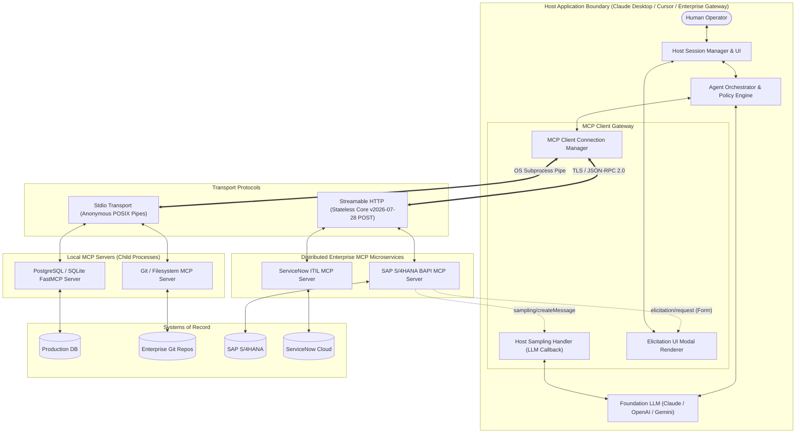
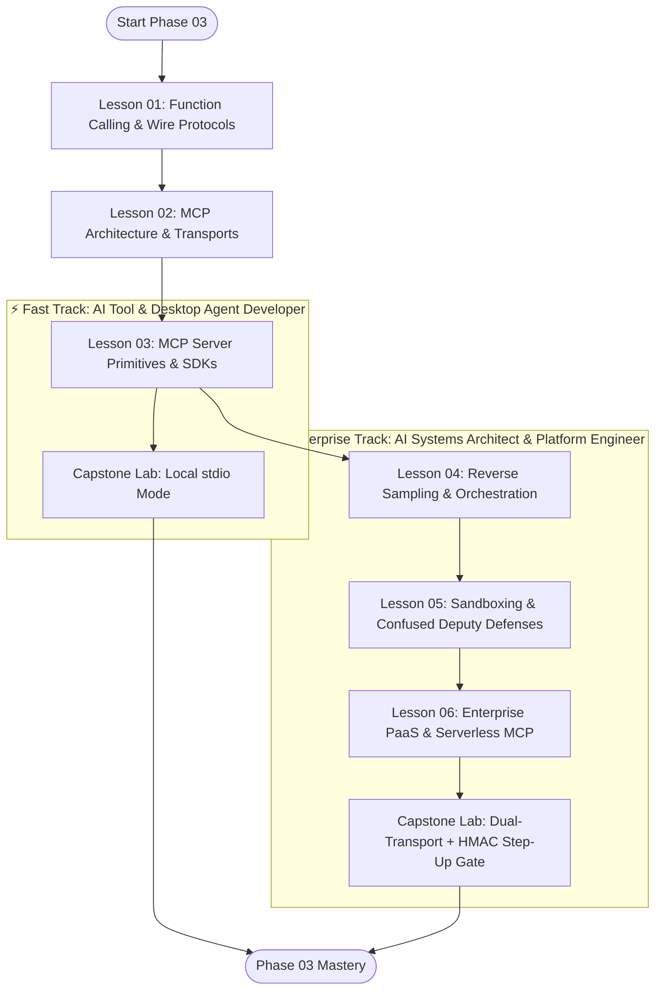

# Phase 03: Tools and Model Context Protocol (MCP)

> **Level**: Advanced Systems Engineering  
> **Estimated Duration**: 4.5–5.5 hours  
> **Prerequisites**: Phase 00 (Inference Latency & KV Physics), Phase 01 (Structured Outputs & JSON Schema), Phase 02 (Enterprise Knowledge Systems)  
> **Downstream Dependencies**: Phase 04 (Stateful Agent Orchestration), Phase 05 (AI Security & Firewalls)  

---

## 1. Phase Mission & Mental Model

Foundation models are probabilistic text generators. By themselves, they cannot execute code, query an ERP ledger, read a file, or restart an infrastructure container.

```text
The AI Systems Stack:
+-------------------------------------------------------------------------------+
| Autonomous Multi-Agent Orchestration (Phase 04)                               |
+-------------------------------------------------------------------------------+
| TOOLS & MODEL CONTEXT PROTOCOL (Phase 03) <=== [YOU ARE HERE]                 |
|  - JSON-RPC 2.0 Wire Protocols & Framing                                      |
|  - MCP Core: Host, Client, Server Topology                                    |
|  - 5 Primitives: Tools, Resources, Prompts, Sampling, Elicitation              |
|  - Transports: Local stdio Pipes vs Streamable HTTP (Stateless Core)           |
|  - Sandboxing: AST Semantic Safety (SQLGlot), MicroVMs (gVisor/Firecracker)    |
|  - Enterprise Bridges: SAP BAPI, ServiceNow ITIL, Entra ID OAuth OBO Flows     |
+-------------------------------------------------------------------------------+
| Enterprise Knowledge Systems & RAG (Phase 02)                                 |
+-------------------------------------------------------------------------------+
| Context Engineering & Structured Outputs (Phase 01)                           |
+-------------------------------------------------------------------------------+
| Foundations & Token Mechanics (Phase 00)                                      |
+-------------------------------------------------------------------------------+
```

Phase 03 transforms senior software engineers into **AI Integration Architects**. You will master how to connect foundation models to deterministic systems of record through standardized wire protocols, resilient execution governors, and defense-in-depth sandboxes.

---

## 2. Modular Curriculum Directory

Phase 03 is structured into six self-contained, progressively sequenced lessons:

| Lesson | Title | Tier Badge | Est. Time | Core Systems Concepts |
|:---:|---|:---:|:---:|---|
| **01** | [Function Calling & JSON-RPC 2.0 Wire Protocols](./01-function-calling-and-json-rpc-wire-protocols.md) | `🟢 Tier 1: Core` | 40 min | Single-turn wire mechanics; JSON-RPC 2.0 framing & error codes; tool schema compilation; constrained decoding (FSM logit masking); dynamic tool discovery; "Think in Code" data sandboxing. |
| **02** | [MCP Architecture, Transports & Protocol Lifecycle](./02-mcp-architecture-transports-and-lifecycle.md) | `🟢 Tier 1: Core` | 45 min | Client-Host-Server topology; capability negotiation; `stdio` IPC pipes; Streamable HTTP (Single POST); Stateless Core v2026-07-28; header routing; MCP vs A2A architectural matrix. |
| **03** | [MCP Server Primitives: Tools, Resources, Prompts & Elicitation](./03-mcp-server-primitives-tools-resources-prompts.md) | `🟡 Tier 2: Depth` | 50 min | The 5 core primitives: Tools (`tools/call`), Resources (`schema://`), Prompts (`prompts/get`), Sampling, and Elicitation (`form` & `url` HITL standard); FastMCP Python, TypeScript, and .NET 9 SDKs. |
| **04** | [Reverse Sampling & Host Orchestration](./04-reverse-sampling-and-host-orchestration.md) | `⚫ Tier 3: Deep Dive` | 45 min | Host Client Gateway; reverse LLM completions (`sampling/createMessage`); execution governors; oscillation deadlock circuit breakers; tool output compaction (token bombing defense). |
| **05** | [Sandboxing, Security & Confused Deputy Defenses](./05-sandboxing-security-and-confused-deputy-defenses.md) | `🔵 Tier 4: Advanced` | 50 min | Confused Deputy attacks; indirect prompt injection; SQLGlot AST validation; microVM sandboxing (gVisor vs Firecracker vs WASM); HMAC-SHA256 two-phase execution gates. |
| **06** | [Enterprise PaaS Bridges & Serverless MCP](./06-enterprise-paas-bridges-and-serverless-mcp.md) | `🔵 Tier 4: Advanced` | 50 min | Systems of Record (SAP S/4HANA BAPI RFC, ServiceNow ITIL, Salesforce CRM); Entra ID OAuth 2.0 OBO identity propagation; Copilot Studio & Agentforce bridges; serverless AWS Lambda response streaming. |

---

## 3. Systems Architecture & Wire Topology

The diagram below illustrates the full Model Context Protocol ecosystem, demonstrating how local IDE agents and remote cloud orchestrators interact with enterprise tools and systems of record:



### Architectural Walkthrough
1. **The Host Boundary**: The Host application houses the user interface, session state, and model orchestrator. The internal MCP Client Gateway coordinates multiple server connections.
2. **Local Transport (`stdio`)**: Local tools run as child processes. Direct OS pipes provide sub-millisecond roundtrips with zero network attack surface. All server telemetry writes strictly to `stderr`.
3. **Remote Transport (Streamable HTTP)**: Enterprise microservices communicate over single-connection HTTP POST requests. Self-contained request envelopes (`_meta`) and Layer-7 headers (`Mcp-Method`) enable standard cloud load balancers to scale pods horizontally without sticky sessions.
4. **Governed Execution & Callbacks**: Remote tools can safely request intermediate LLM completions via **Sampling** (without seeing API keys) or halt destructive mutations to demand human authorization via **Elicitation**.

---

## 4. Dual-Track Learning Paths

Choose the path tailored to your engineering objectives:



* **⚡ Fast Track (1.5–2 hours)**: For developers building local tools for Cursor, Claude Desktop, and CLI agent workflows. Covers Lessons 01–03 and the local `stdio` Capstone Lab.
* **🏢 Enterprise Track (3.5–4.5 hours)**: For platform engineers and cloud architects building multi-tenant microservices, serverless agent backends, security sandboxes, and SAP/Salesforce bridges. Covers the full 6-lesson sequence and the complete Capstone Lab.

---

## 5. Enterprise Production Code Implementations

Tested, production-grade reference implementations are available in the [`examples/`](./examples/) directory:

1. **Python FastMCP Database Server** ([`examples/mcp_database_server.py`](./examples/mcp_database_server.py)):
   - FastMCP server exposing database schema discovery as a passive Resource (`schema://database/catalog`).
   - Read-only SQL query tool validated against SQLGlot Abstract Syntax Trees (ASTs).
   - Strict Pydantic v2 schemas enforcing pagination ceilings.

2. **C# / .NET 9 Semantic Kernel Tools** ([`examples/SemanticKernelTools.cs`](./examples/SemanticKernelTools.cs)):
   - Native C# tools exposed to LLMs via Semantic Kernel plugins.
   - `IAutoFunctionInvocationFilter` middleware for OpenTelemetry audit logging and security boundaries.

---

## 6. Capstone Engineering Challenge

> **Challenge**: Build a production-grade, dual-transport **Enterprise Observability & Schema Model Context Protocol (MCP) Server** in Python or TypeScript implementing read-only database inspection, secure telemetry fetching, and cryptographically signed Human-in-the-Loop (HITL) step-up gates using the official **Elicitation primitive**.
> 
> 👉 **[Start Capstone Challenge Specification](./labs/capstone-mcp-tool-server.md)**

---

## 7. Verified Curated Bibliography & Standards Index

* [Model Context Protocol — Official Specification](https://modelcontextprotocol.io/specification/latest): The formal JSON-RPC 2.0 schema for Tools, Resources, Prompts, Sampling, and Elicitation.
* [JSON-RPC 2.0 Specification](https://www.jsonrpc.org/specification): Authoritative wire protocol RFC for all MCP communication.
* [JSON Schema Draft 2020-12](https://json-schema.org/draft/2020-12/release-notes): The standard governing structural constraints for tool parameters.
* [Meta Llama Stack (`llama-stack`)](https://github.com/meta-llama/llama-stack): Unified open-weights agent tooling framework with native MCP provider integration.
* [xAI Developer Documentation (Grok-3 Tools)](https://docs.x.ai/): Reference specifications for OpenAI-compatible function calling, structured schemas, and reasoning models.
* [OWASP Top 10 for Large Language Models](https://genai.owasp.org/): Security guide covering Indirect Prompt Injection (LLM01) and Excessive Agency (LLM08).
* [Sqlglot AST Parser](https://github.com/tobymao/sqlglot): Python SQL parser and transpiler for deterministic read-only query enforcement.
* [FastMCP Library](https://github.com/PrefectHQ/fastmcp): High-level Python framework for building MCP servers and clients.

---

[Start Lesson 01: Function Calling & JSON-RPC 2.0 Wire Protocols](./01-function-calling-and-json-rpc-wire-protocols.md)
