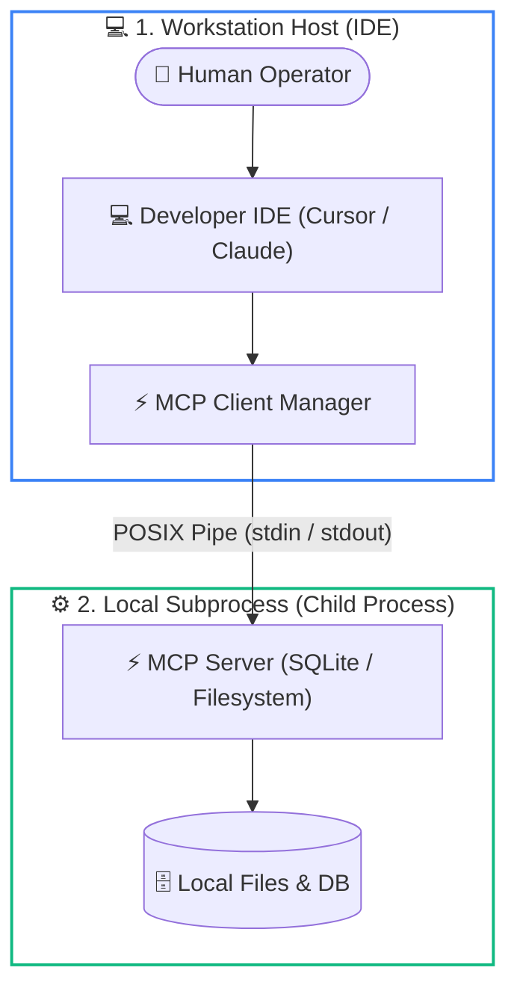
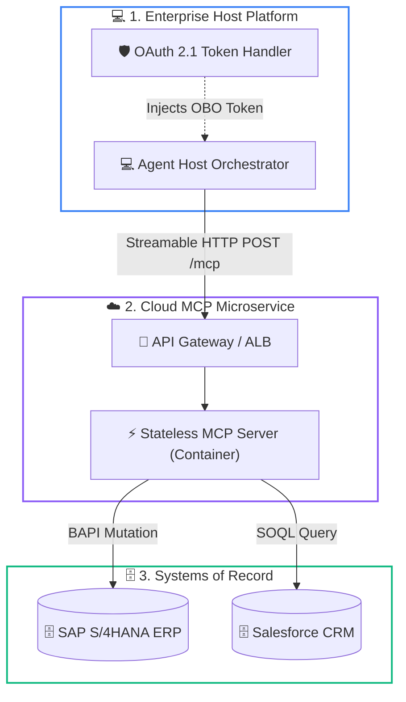
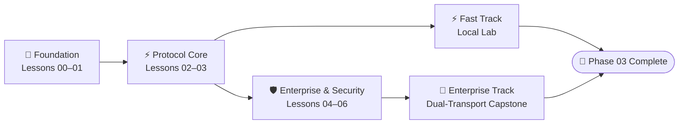

# Phase 03: Tools and Model Context Protocol (MCP)

> **Level**: Advanced Systems Engineering  
> **Estimated Duration**: 5.0–6.0 hours  
> **Prerequisites**: Phase 00 (Inference Latency & KV Physics), Phase 01 (Structured Outputs & JSON Schema), Phase 02 (Enterprise Knowledge Systems)  
> **Downstream Dependencies**: Phase 04 (Stateful Agent Orchestration), Phase 05 (AI Security & Firewalls)  

---

## 1. Phase Mission & Mental Model

Foundation models generate text. By themselves, they cannot execute code, query a database, read a file, or restart a server. 

To make models useful in production, we must connect them to external systems. This phase covers how to build those connections safely and reliably using standard protocols.

```text
The AI Systems Stack:
+-------------------------------------------------------------------------------+
| Autonomous Multi-Agent Orchestration (Phase 04)                               |
+-------------------------------------------------------------------------------+
| TOOLS & MODEL CONTEXT PROTOCOL (Phase 03) <=== [YOU ARE HERE]                 |
|  - JSON-RPC 2.0 Wire Protocols & Framing                                      |
|  - MCP Core: Host, Client, Server Topology                                    |
|  - 5 Primitives: Tools, Resources, Prompts, Sampling, Elicitation              |
|  - Transports: Local standard I/O (stdio) vs Streamable HTTP                   |
|  - Sandboxing: Abstract Syntax Tree (AST) validation and MicroVMs              |
|  - Enterprise Bridges: OAuth, identity propagation, and legacy integrations    |
+-------------------------------------------------------------------------------+
| Enterprise Knowledge Systems & RAG (Phase 02)                                 |
+-------------------------------------------------------------------------------+
| Context Engineering & Structured Outputs (Phase 01)                           |
+-------------------------------------------------------------------------------+
| Foundations & Token Mechanics (Phase 00)                                      |
+-------------------------------------------------------------------------------+
```

You will learn how to connect foundation models to deterministic systems of record through standardized wire protocols, execution limits, and defense-in-depth security.

---

## 2. Modular Curriculum Directory

Phase 03 is structured into seven self-contained, progressively sequenced lessons:

| Lesson | Title | Tier Badge | Est. Time | Core Systems Concepts |
|:---:|---|:---:|:---:|---|
| **00** | [Tool Use & MCP Fundamentals](./00-tool-use-and-mcp-fundamentals.md) | `🟢 Core` | 30 min | Tool use execution loop; M x N connector problem; coprocessor mental model; JSON Schema tool definition; Python execution loop. |
| **01** | [Function Calling & JSON-RPC Wire Protocols](./01-function-calling-and-json-rpc-wire-protocols.md) | `🟡 Engineering Depth` | 40 min | Function calling mechanics; JSON-RPC 2.0; tool schemas; constrained decoding; tool discovery; data sandboxing. |
| **02** | [MCP Architecture, Transports & Lifecycle](./02-mcp-architecture-transports-and-lifecycle.md) | `🟡 Engineering Depth` | 45 min | Client-Host-Server topology; capability negotiation; local standard I/O pipes (`stdio`); HTTP transports; header routing. |
| **03** | [MCP Server Primitives: Tools, Resources, Prompts](./03-mcp-server-primitives-tools-resources-prompts.md) | `🟡 Engineering Depth` | 50 min | The core primitives: Tools (`tools/call`), Resources (`schema://`), Prompts (`prompts/get`), Sampling, and Elicitation; server SDKs. |
| **04** | [Reverse Sampling & Host Orchestration](./04-reverse-sampling-and-host-orchestration.md) | `⚫ Deep Dive` | 45 min | Host Client Gateways; reverse completions (`sampling/createMessage`); circuit breakers; protecting against massive tool outputs. |
| **05** | [Sandboxing & Confused Deputy Defenses](./05-sandboxing-security-and-confused-deputy-defenses.md) | `🔵 Advanced` | 50 min | Confused Deputy attacks; indirect prompt injection; validating database queries; isolated execution environments; execution gates. |
| **06** | [Enterprise Bridges & Serverless MCP](./06-enterprise-paas-bridges-and-serverless-mcp.md) | `🔵 Advanced` | 40 min | Connecting to legacy systems (ERP, CRM); OAuth 2.1 identity propagation; serverless response streaming. |

---

## 3. Systems Architecture & Wire Topology

The Model Context Protocol establishes clear separation of concerns across local development environments and cloud enterprise deployments.

### 1. Local Subprocess Architecture (`stdio`)

For developer workstations and local IDE agents, MCP servers execute as local child processes using standard I/O pipes:



### Architectural Walkthrough (Local `stdio`)
1. **User Action**: The developer submits a prompt or inspection request inside their local IDE.
2. **Subprocess Management**: The MCP Client Manager spawns the tool server as an OS child process.
3. **Pipe Transport**: Requests and responses flow through standard input (`stdin`) and standard output (`stdout`) as newline-delimited JSON-RPC 2.0 messages.
4. **Log Isolation**: Diagnostic logging is directed exclusively to `stderr` to prevent stream framing errors.
5. **Direct Access**: The server interacts with local files or databases under the developer's workstation permissions.

---

### 2. Cloud Enterprise Gateway Architecture (Streamable HTTP)

In distributed cloud environments, MCP servers deploy as stateless microservices behind Layer-7 API gateways:



### Architectural Walkthrough (Remote Enterprise Gateway)
1. **Host Dispatch**: The agent orchestrator transmits tool invocations over HTTPS using Streamable HTTP.
2. **Identity Propagation**: The OAuth 2.1 token handler exchanges client credentials for an On-Behalf-Of (OBO) token scoped to backend services.
3. **Perimeter Routing**: The Enterprise API Gateway validates JWT scopes, terminates TLS, and routes requests to containerized tool microservices.
4. **Stateless Processing**: The serverless MCP container parses the JSON-RPC frame, verifies business rules, and executes transactions against systems of record.
5. **Audited Commit**: Mutations are recorded in enterprise ledgers under the calling user's principal name.

---

## 4. Dual-Track Learning Paths

Choose the path tailored to your engineering objectives:



### Track Details
1. **⚡ Fast Track (1.5–2 hours)**: Focuses on core mechanics for developers building local workstation tools. Complete Lessons 00–03 and implement the local `stdio` capstone lab.
2. **🏢 Enterprise Track (4.0–5.5 hours)**: Designed for platform engineers building production systems. Complete all seven lessons (00–06) and build the full dual-transport capstone with human-in-the-loop step-up gates.

---

## 5. Reference Implementations

Tested reference implementations are available in the [`examples/`](./examples/) directory:

1. **Python Database Server** ([`examples/mcp_database_server.py`](./examples/mcp_database_server.py)):
   - Server exposing database schema discovery.
   - Read-only SQL query tool validated against parsed syntax trees.

2. **C# / .NET Tools** ([`examples/SemanticKernelTools.cs`](./examples/SemanticKernelTools.cs)):
   - Native C# tools exposed to models via standard plugins.
   - Middleware for audit logging and security boundaries.

---

## 6. Capstone Engineering Challenge

> **Challenge**: Build an **Enterprise Observability Model Context Protocol (MCP) Server** in Python or TypeScript implementing read-only database inspection, telemetry fetching, and Human-in-the-Loop (HITL) authorization gates.
> 
> 👉 **[Start Capstone Challenge Specification](./labs/capstone-mcp-tool-server.md)**

---

## 7. Standard References

* [Model Context Protocol Specification](https://modelcontextprotocol.io/specification/latest): The schema for Tools, Resources, Prompts, Sampling, and Elicitation.
* [JSON-RPC 2.0 Specification](https://www.jsonrpc.org/specification): Standard wire protocol for all MCP communication.
* [JSON Schema Draft 2020-12](https://json-schema.org/draft/2020-12/release-notes): The standard for tool parameters.
* [OWASP Top 10 for Large Language Models](https://genai.owasp.org/): Security guide covering Indirect Prompt Injection (LLM01) and Excessive Agency (LLM08).

---

## 🧭 Navigation

- [← Previous Phase: Phase 02 Enterprise Knowledge Systems](../02-rag-and-knowledge-systems/README.md)
- [Start Phase 03: Lesson 00 Tool Use & MCP Fundamentals](./00-tool-use-and-mcp-fundamentals.md)
- [Next Phase: Phase 04 Stateful Agent Orchestration](../04-agentic-systems-and-orchestration/README.md) →

