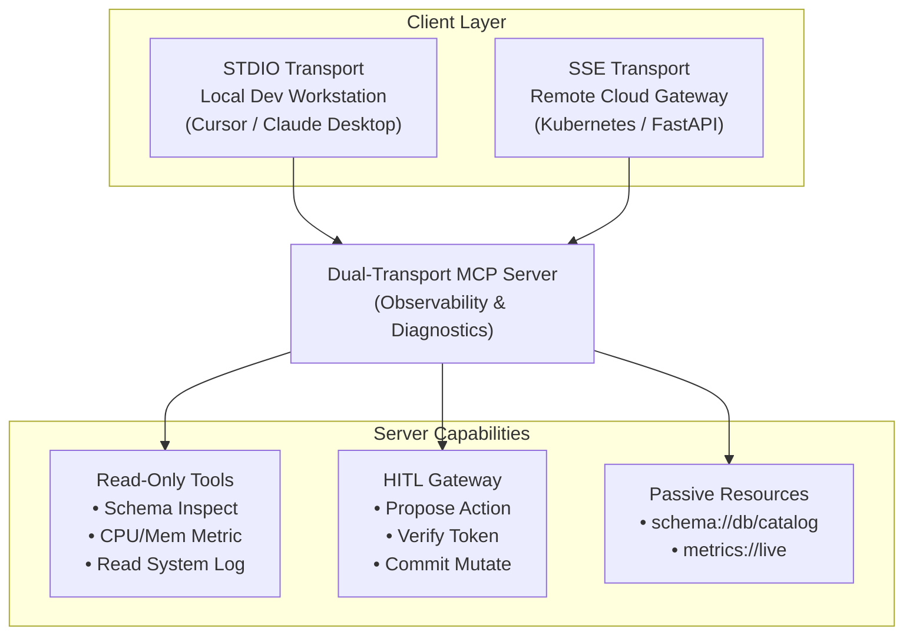

# Capstone Engineering Challenge: The Production MCP Tool Server

### Objective
Build and test a production-grade, dual-transport **Enterprise Observability & Schema Model Context Protocol (MCP) Server** in Python (FastMCP) or C# (.NET 9) implementing read-only database inspection, secure telemetry fetching, and cryptographically signed Human-in-the-Loop (HITL) step-up gates.

---

### The Scenario
You are the Principal AI Architect for a high-growth fintech enterprise. The software engineering organization wants to empower internal AI agents (running in Claude Desktop, Cursor, and internal web dashboards) to investigate production outages.

However, your Chief Information Security Officer (CISO) has issued a strict mandate:
> *"Agents may freely inspect database schemas and read server telemetry. However, any action that queries customer tables or restarts services must require cryptographically signed human authorization. Furthermore, the server must support both local stdio for developer IDEs and remote SSE over HTTPS for cloud agents."*

---

### Architectural Requirements

---

### Implementation Checklist & Verification Criteria

#### 1. Dual Transport Capability
- [ ] Implement an entrypoint that inspects CLI arguments:
  - Default: runs over `stdio` for local Claude Desktop / Cursor usage.
  - `--sse --port 8080`: launches an HTTP ASGI server exposing `/sse` and `/messages` endpoints.
- [ ] Ensure all diagnostic logging writes exclusively to `stderr` to prevent JSON-RPC frame corruption on stdio.

#### 2. Passive Context Resources
- [ ] Expose `schema://enterprise/database` returning the full database DDL as a clean markdown table.
- [ ] Expose `metrics://cluster/health` returning live CPU, Memory, and Network throughput metrics in JSON format.

#### 3. Read-Only Diagnostic Tools
- [ ] `inspect_table_schema(table_name: str)`: Returns column types, primary keys, and index metadata with strict Pydantic input validation.
- [ ] `read_system_logs(service_name: str, lines: int = 50)`: Returns the tail of simulated service logs with a hard ceiling of 100 lines to prevent token bombing.

#### 4. Two-Phase Mutating Operations with Human-in-the-Loop (HITL)
- [ ] Implement `propose_service_restart(service_name: str, reason: str)`:
  - Generates a time-bound (5-minute expiration) HMAC-SHA256 **Approval Ticket**.
  - Returns the ticket ID and a formatted confirmation prompt.
- [ ] Implement `execute_approved_service_restart(ticket_id: str, confirmation_token: str)`:
  - Validates the signature and timestamp of the token.
  - Rejects expired or forged tokens.
  - Only executes the restart upon verified approval.

#### 5. Verification & Test Suite
- [ ] Create a test client script using the MCP Python SDK (`ClientSession`) or C# client that:
  1. Performs the initialization handshake.
  2. Queries `tools/list` and asserts that input schemas match declared Pydantic models.
  3. Executes `inspect_table_schema` and verifies successful response parsing.
  4. Triggers `propose_service_restart`, verifies ticket generation, and validates that `execute_approved_service_restart` rejects an invalid confirmation token.

---

[Return to Module 03: Tools and Model Context Protocol](../README.md#9-capstone-engineering-challenge-the-production-mcp-tool-server-must-have-)
