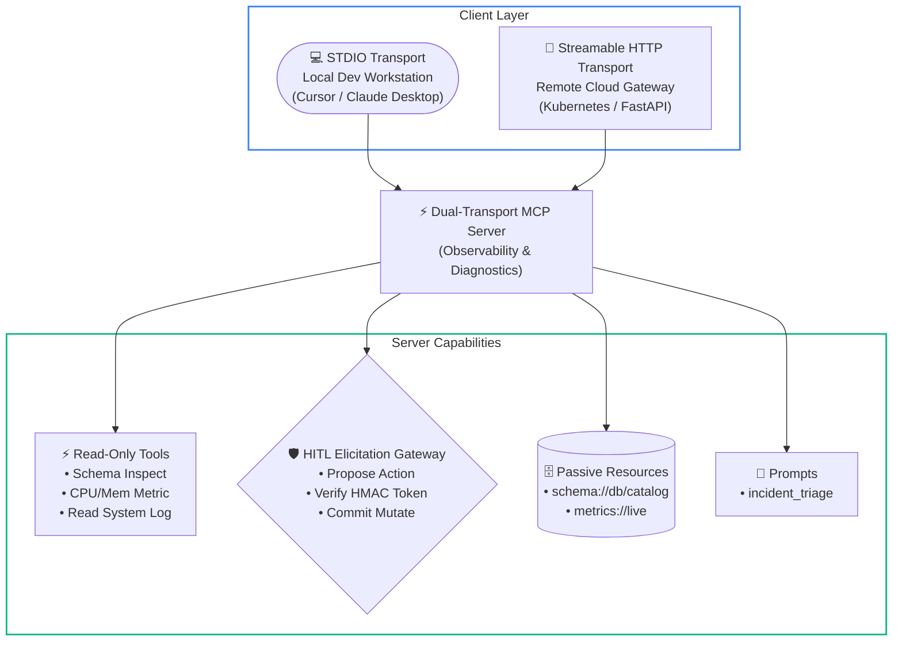

# Capstone Engineering Challenge: The Production MCP Tool Server

### Objective
Build and test a production-grade, dual-transport **Enterprise Observability & Schema Model Context Protocol (MCP) Server** in Python or TypeScript. The server implements read-only database inspection, secure telemetry fetching, and cryptographically signed Human-in-the-Loop (HITL) step-up gates using the official **Elicitation primitive**.

---

### The Scenario
You are the Principal AI Architect for a high-growth fintech enterprise. The software engineering organization wants to empower internal AI agents (running in Claude Desktop, Cursor, and internal web dashboards) to investigate production outages.

However, your Chief Information Security Officer (CISO) has issued a strict mandate:
> *"Agents may freely inspect database schemas and read server telemetry. However, any action that queries customer tables or restarts services must require cryptographically signed human authorization. Furthermore, the server must support both local stdio for developer IDEs and remote Streamable HTTP over HTTPS for cloud agents."*

---

### Architectural Requirements

### Architectural Walkthrough
1. **Client Ingress**: The server accepts incoming requests either via anonymous POSIX pipes (`stdio`) for local development tools or over Streamable HTTP (`POST /mcp` with `Mcp-Protocol-Version: 2026-07-28`) for cloud orchestrators.
2. **Passive Context (Resources)**: Database schemas and system health baselines are exposed as passive URI resources (`schema://`, `metrics://`) to prevent unnecessary exploratory tool calls.
3. **Active Diagnostics (Tools)**: Read-only diagnostic tools provide bounded, paginated access to table schemas and system logs, rejecting multi-statement queries and enforcing 100-line ceilings.
4. **Governed Mutations (Elicitation & HMAC)**: Destructive actions (service restarts) trigger an MCP Elicitation form modal, demanding a time-bound HMAC-SHA256 authorization token before execution commits.

---

### Implementation Checklist & Verification Criteria

#### 1. Dual Transport Capability
- [ ] Implement an entrypoint that inspects CLI arguments:
  - Default: runs over `stdio` for local Claude Desktop / Cursor usage.
  - `--http --port 8080`: launches an HTTP ASGI server exposing a Streamable HTTP POST endpoint supporting the Stateless MCP Core (`_meta` headers).
- [ ] Ensure all diagnostic logging writes exclusively to `stderr` to prevent JSON-RPC frame corruption on `stdio`.

#### 2. Passive Context Resources
- [ ] Expose `schema://enterprise/database` returning the full database DDL as a clean markdown table.
- [ ] Expose `metrics://cluster/health` returning live CPU, Memory, and Network throughput metrics in JSON format.

#### 3. Read-Only Diagnostic Tools
- [ ] `inspect_table_schema(table_name: str)`: Returns column types, primary keys, and index metadata with strict Pydantic/Zod input validation.
- [ ] `read_system_logs(service_name: str, lines: int = 50)`: Returns the tail of simulated service logs with a hard ceiling of 100 lines to prevent context bombing.

#### 4. Two-Phase Mutating Operations with Elicitation (HITL)
- [ ] Implement `propose_service_restart(service_name: str, reason: str)`:
  - Generates a time-bound (5-minute expiration) HMAC-SHA256 **Approval Ticket**.
  - Initiates an `elicitation/request` (Form Mode) requesting operator approval and ticket signature.
- [ ] Implement `execute_approved_service_restart(ticket_id: str, confirmation_token: str)`:
  - Validates the signature, nonce, and timestamp of the token.
  - Rejects expired or forged tokens with `PermissionError`.
  - Only executes the restart upon verified approval.

#### 5. Verification & Test Suite
- [ ] Create an automated test client script using the MCP Python SDK (`ClientSession`) or TypeScript client that:
  1. Performs the initialization handshake (`initialize` -> `notifications/initialized`).
  2. Queries `tools/list` and asserts that input schemas declare `"additionalProperties": false`.
  3. Executes `inspect_table_schema` and verifies successful response parsing.
  4. Triggers `propose_service_restart`, verifies ticket generation, and validates that `execute_approved_service_restart` rejects an invalid confirmation token.

---

## 🧭 Navigation

[Back to Phase 03 Hub](../README.md)

