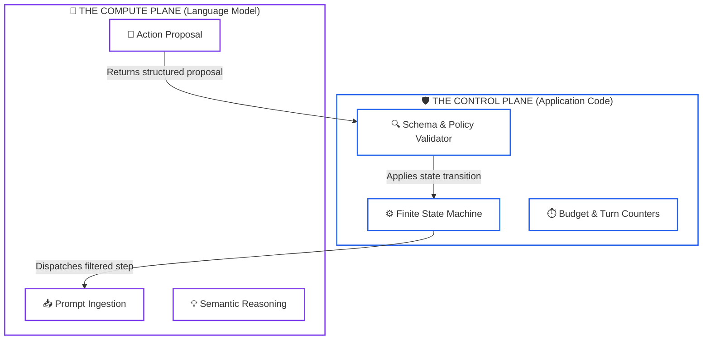
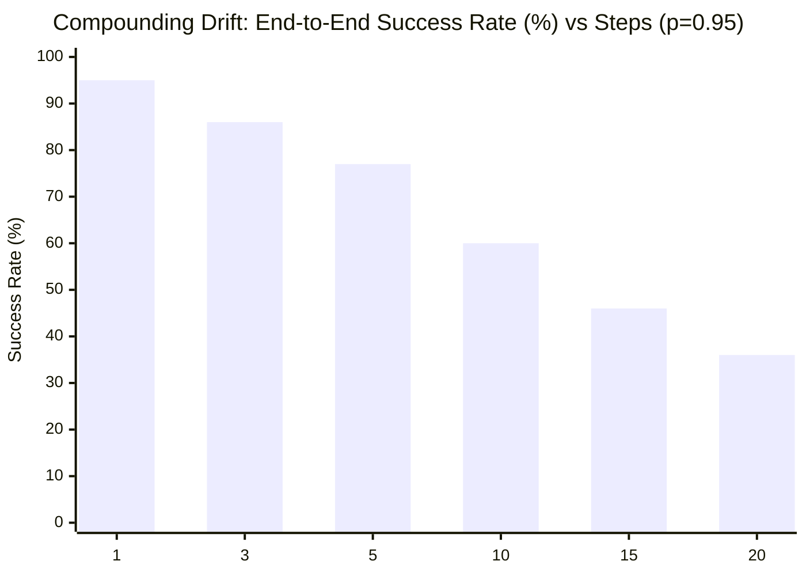

# Lesson 00: Agentic Systems Fundamentals & Control Plane Architecture

> **Tier**: `🟢 Core` | Estimated Reading Time: 20 min
>
> **Prerequisites**: [Phase 01: Prompt Engineering](../01-prompt-and-context-engineering/README.md), [Phase 02: Retrieval Systems](../02-rag-and-knowledge-systems/README.md), [Phase 03: Tools & Model Context Protocol](../03-tools-and-model-context-protocol/README.md)
>
> **Core Concept**: An AI agent is a software loop where a language model proposes actions and application code executes them. Enterprise reliability requires separating the Control Plane from the Compute Plane. Application code manages state, enforces security, and halts loops. The model only provides semantic reasoning.
>
> **Term Ledger**:
> * **New AI terms introduced**: `AI Agent`, `Autonomous Loop`, `Control Plane`, `Compute Plane`, `Compounding Error Drift`, `Agency Spectrum`.
> * **AI terms assumed from earlier lessons**: `Prompt`, `Token`, `Context Window`, `Hallucination`, `Function Calling`, `Tool Schema`.

---

## 1. The Real-World Problem: The Runaway Apprentice

Imagine hiring a brilliant apprentice machinist in a high-precision manufacturing shop. The apprentice can read blueprints and suggest adjustments.

Now imagine giving this apprentice the master keys to the shop floor. You let them turn on high-speed CNC lathes and hydraulic presses without physical guards.

```text
[BLUEPRINT] ──> [APPRENTICE (LLM)] ──> [UNGUARDED HEAVY MACHINERY (APIs)]
                     │                             │
                     └── "Let me try this!" ───────┘ (DISASTER)
```

In software, teams often build their first AI agent by wrapping a language model in a naive loop:

```python
# The dangerous naive pattern: Model controls its own execution
def call_llm(prompt: str) -> str:
    return "STOP"

context = "system: run maintenance tasks"
while True:
    model_response = call_llm(context)
    if "STOP" in model_response:
        break
```

Within days of deploying this loop to production, three catastrophic failures occur:
1. **Compounding Drift**: A single incorrect parameter in step two corrupts step three. By step six, the agent attempts to delete production tables.
2. **Ping-Pong Deadlock**: An API returns a `400 Bad Request`. The model retries with the same invalid arguments twelve times, exhausting budgets.
3. **Context Explosion**: Each failed attempt dumps raw error traces into the prompt. The context window fills up, driving latency past 45 seconds per turn.

To prevent these failures, software engineers must never let a language model act as its own control plane.

---

## 2. The Mental Model: Safety Interlocks and The Machine Shop

The proper architecture separates the shop into two distinct zones:



### Walkthrough
1. **Step Dispatch**: The Control Plane inspects its internal state machine and sends only the relevant context for the current step to the model.
2. **Proposal Generation**: The Compute Plane reasons over the prompt and returns a typed action proposal. It has no direct access to network sockets or databases.
3. **Policy Gate**: The Control Plane intercepts the proposal, verifies token budgets, validates parameters against business rules, and executes the underlying tool safely.

> [!NOTE]
> **Where this analogy breaks**: A human machinist feels physical resistance when a drill bit binds. A language model feels nothing. It generates text purely on statistical probability. If an invalid action generates high probability tokens, the model will output it with absolute grammatical confidence.

---

## 3. Why Naive Fails: The Mathematics of Compounding Drift

Why cannot we rely on an intelligent model to self-correct in a loop? The answer lies in elementary probability.

Consider a multi-step workflow with `n` independent steps. Let `p` represent the probability that the model chooses the correct tool and parameters at any single step:

```text
P(total_success) = p^n
```

If your model is accurate 95% of the time (`p = 0.95`):



### Visualizing Compounding Drift:
1. **Step 1 (95%)**: High reliability for simple prompt completions.
2. **Step 5 (77%)**: Noticeable drop; nearly one out of four runs experiences a failure.
3. **Step 10 (60%)**: Total coin flip in production without deterministic state machine guards.
4. **Step 20 (36%)**: Complete operational breakdown under unconstrained autonomous loops.

| Steps (`n`) | Individual Step Accuracy (`p`) | End-to-End Success Rate | Production Verdict |
|---|---|---|---|
| **1** | 95.0% | 95.0% | Acceptable for basic tasks |
| **3** | 95.0% | 85.7% | Requires retry mechanisms |
| **5** | 95.0% | 77.4% | Frequent human escalations |
| **10** | 95.0% | 59.9% | Total coin flip in production |
| **20** | 95.0% | 35.8% | Complete operational failure |

When an autonomous agent runs a 10-step sequence, a 95% per-step model fails four times out of ten. In an unguarded loop, early errors corrupt downstream context, driving subsequent accuracy far below 95%.

---

## 4. Core Architecture: Control Plane vs. Compute Plane

We establish three architectural pillars to govern agentic systems.

### Pillar 1: Plane Separation
- 🧒 **Analogy**: The autopilot on a commercial airliner suggests steering inputs to the flight computer, but the physical hydraulic limits and altitude alarms belong to the flight computer hardware.
- ⚙️ **Engineering**: Keep orchestration logic, retries, and database writes inside deterministic code (Python, Go, Java). Treat the foundation model as a remote, stateless RPC worker that returns text proposals.
- ⚠️ **What happens if you skip this?**: The model decides when tasks complete. A confused model may claim "Database migration complete" without running any SQL.

### Pillar 2: The Agency Spectrum
Not every problem requires an autonomous agent. Choose the simplest pattern on the spectrum:

```text
[Prompt Chaining] ➔ [Routing] ➔ [Parallel Voting] ➔ [Orchestrator-Workers] ➔ [Autonomous ReAct]
    (Deterministic Code)                                                (Model Decides Path)
```

- 🧒 **Analogy**: A train on tracks versus a delivery van with GPS. The train cannot steer off course. The van can navigate roadblocks, but it can also take a wrong turn.
- ⚙️ **Engineering**: Use hardcoded workflows for known business processes (invoicing, customer onboarding). Reserve open-ended autonomous loops for exploratory tasks (deep research, bug hunting).
- ⚠️ **What happens if you skip this?**: You pay 10x higher latency and unpredictable costs for processes that regular `if/else` statements solve in two milliseconds.

### Pillar 3: Hard Execution Governors
- 🧒 **Analogy**: A dead-man's switch on a locomotive that stops the train if the engineer becomes unresponsive.
- ⚙️ **Engineering**: Impose hard ceilings on step counts, maximum wall-clock time, and cumulative token budgets. Hash each proposed action to detect duplicate calls immediately.
- ⚠️ **What happens if you skip this?**: A malformed API error causes an infinite loop, burning through API credits in minutes.

---

## 5. Working Implementation: Bounded Control Plane

This complete Python 3.12+ example demonstrates a deterministic Control Plane supervising a simulated Compute Plane. It enforces step limits and parameter validation offline.

```python
"""
Bounded Control Plane Harness
Demonstrating state machine boundaries and execution governors over an LLM.
"""

from dataclasses import dataclass
from typing import Any, Callable
from pydantic import BaseModel, Field


class ToolActionProposal(BaseModel):
    tool_name: str = Field(description="Target tool identifier")
    account_id: str = Field(description="Target account identifier")
    amount: float = Field(ge=0.0, description="Transaction magnitude")


@dataclass
class StepResult:
    step_number: int
    tool_name: str
    success: bool
    details: str


class SafeControlPlane:
    def __init__(self, max_turns: int = 3, max_budget_usd: float = 0.50):
        self.max_turns = max_turns
        self.max_budget_usd = max_budget_usd
        self.current_turn = 0
        self.spent_usd = 0.0
        self.action_history: set[str] = set()

    def mock_compute_plane(self, turn: int) -> ToolActionProposal:
        """Simulates an LLM proposing actions across successive turns."""
        if turn == 1:
            return ToolActionProposal(
                tool_name="verify_account", account_id="ACC-9481", amount=0.0
            )
        elif turn == 2:
            return ToolActionProposal(
                tool_name="transfer_funds", account_id="ACC-9481", amount=150.00
            )
        return ToolActionProposal(
            tool_name="verify_account", account_id="ACC-9481", amount=0.0
        )

    def execute_governed_task(self) -> list[StepResult]:
        results: list[StepResult] = []

        while self.current_turn < self.max_turns:
            self.current_turn += 1
            self.spent_usd += 0.05  # Approximate cost per turn

            # 1. Budget Governor Check
            if self.spent_usd > self.max_budget_usd:
                results.append(
                    StepResult(
                        self.current_turn, "HALT", False, "Budget ceiling exceeded"
                    )
                )
                break

            # 2. Query Compute Plane
            proposal = self.mock_compute_plane(self.current_turn)

            # 3. Action Hashing (Ping-Pong Detection)
            action_signature = f"{proposal.tool_name}:{proposal.account_id}:{proposal.amount}"
            if action_signature in self.action_history:
                results.append(
                    StepResult(
                        self.current_turn,
                        proposal.tool_name,
                        False,
                        "Cycle detected: Duplicate action rejected",
                    )
                )
                break
            self.action_history.add(action_signature)

            # 4. Safe Execution Gate
            if proposal.tool_name == "transfer_funds" and proposal.amount > 1000.0:
                results.append(
                    StepResult(
                        self.current_turn,
                        proposal.tool_name,
                        False,
                        "Policy violation: Transfer exceeds limit",
                    )
                )
                break

            # Success
            results.append(
                StepResult(
                    self.current_turn,
                    proposal.tool_name,
                    True,
                    f"Executed successfully for {proposal.account_id}",
                )
            )

            # Terminal condition check
            if proposal.tool_name == "transfer_funds":
                break

        return results


if __name__ == "__main__":
    controller = SafeControlPlane(max_turns=5, max_budget_usd=0.25)
    execution_log = controller.execute_governed_task()

    print("=== Execution Trace ===")
    for step in execution_log:
        status = "PASSED" if step.success else "BLOCKED"
        print(f"Turn {step.step_number} [{step.tool_name}]: {status} - {step.details}")
```

### Verification Output
```text
=== Execution Trace ===
Turn 1 [verify_account]: PASSED - Executed successfully for ACC-9481
Turn 2 [transfer_funds]: PASSED - Executed successfully for ACC-9481
```

---

## 6. Architecture Trade-Off Matrix

| Architectural Pattern | Latency Overhead | Cost Profile | Failure Surface | Best Use Case |
|---|---|---|---|---|
| **Deterministic Pipeline** | Low (1x model call) | Minimal (\$0.001–\$0.01) | Static code bugs | Data transformation, ETL, classification |
| **Orchestrator-Workers** | Moderate (2–3x calls) | Predictable | Worker schema mismatch | Parallel research, modular report synthesis |
| **Autonomous ReAct Loop** | High (5–15x calls) | Unbounded without caps | Compounding drift, infinite cycles | Dynamic debugging, exploratory troubleshooting |

---

## 7. Quick Check

An engineer builds an incident response agent. They instruct the model to "inspect our Kubernetes cluster and resolve active outage alerts". They wrap the model in a loop with full `kubectl` admin rights.

What critical architecture violation occurred, and what happens when an alert triggers?

<details>
<summary>View Answer</summary>

**Violation**: The engineer collapsed the Control Plane into the Compute Plane and granted unguarded write access.

**Failure Mode**: Under pressure from high-severity alerts, the model suffers from compounding error drift. It attempts an unverified remediation command (such as deleting stateful pods or modifying secrets). Because no control plane validates or limits actions, the loop amplifies the outage rather than resolving it. 

**Fix**: Keep write operations behind strict approval gates. Allow the agent to read logs autonomously, but require human confirmation or hardcoded remediation playbooks for cluster modifications.
</details>

---

## 🧭 Navigation

* **Previous Phase**: [← Phase 03: Tools & Model Context Protocol (MCP)](../03-tools-and-model-context-protocol/README.md)
* **Phase 04 Hub**: [Phase 04 Overview](README.md)
* **Next Lesson**: [Lesson 01: Workflows vs. Autonomous Agents & Orchestration Patterns →](01-workflows-vs-agents-and-orchestration-patterns.md)
* **Capstone Lab**: [Capstone Challenge: Code Review Agent Engine](labs/capstone-code-review-engine.md)
