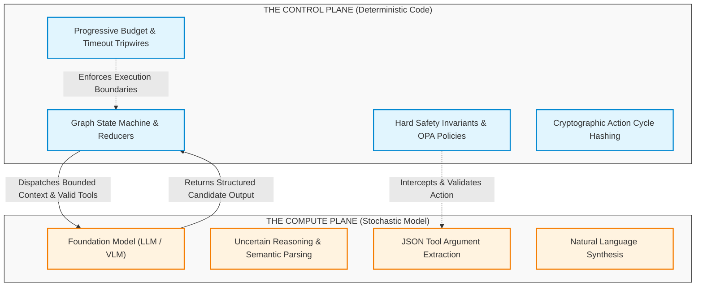
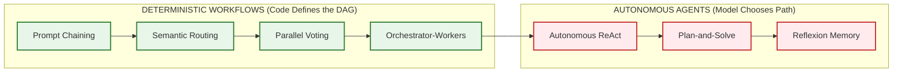
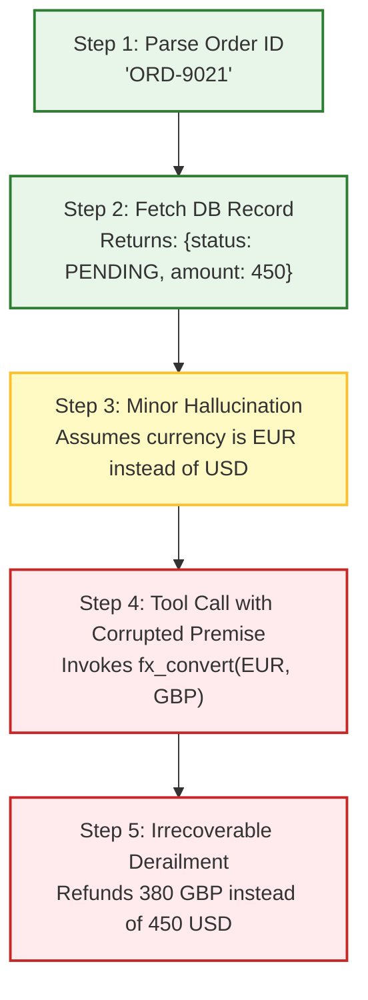
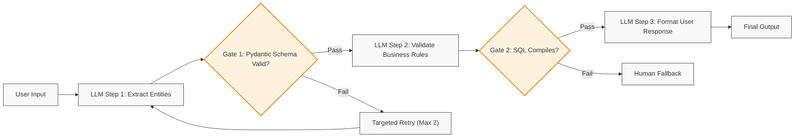
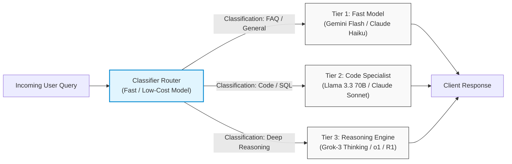
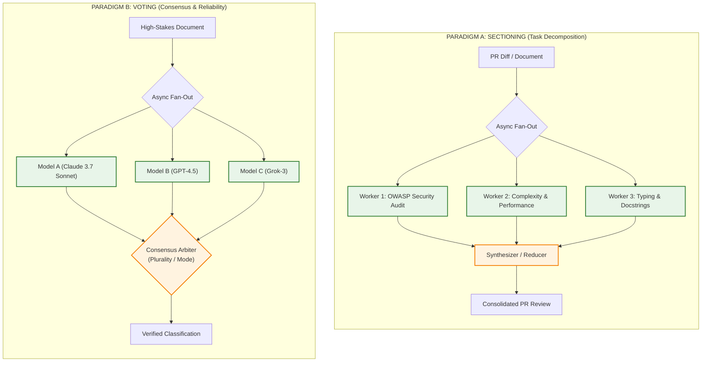
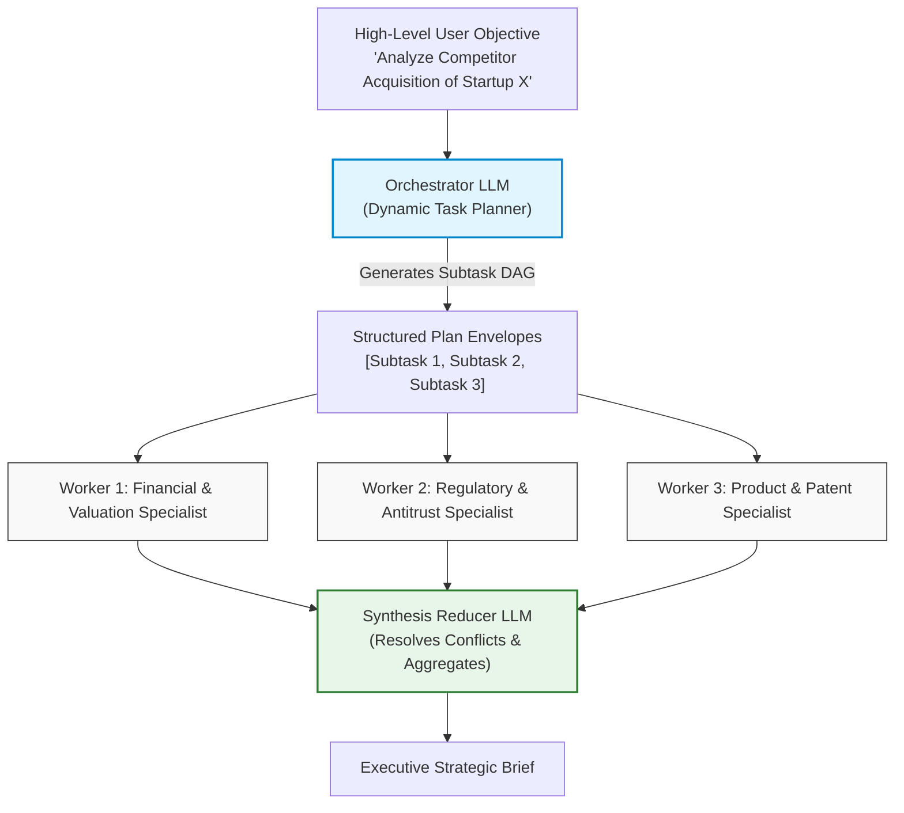
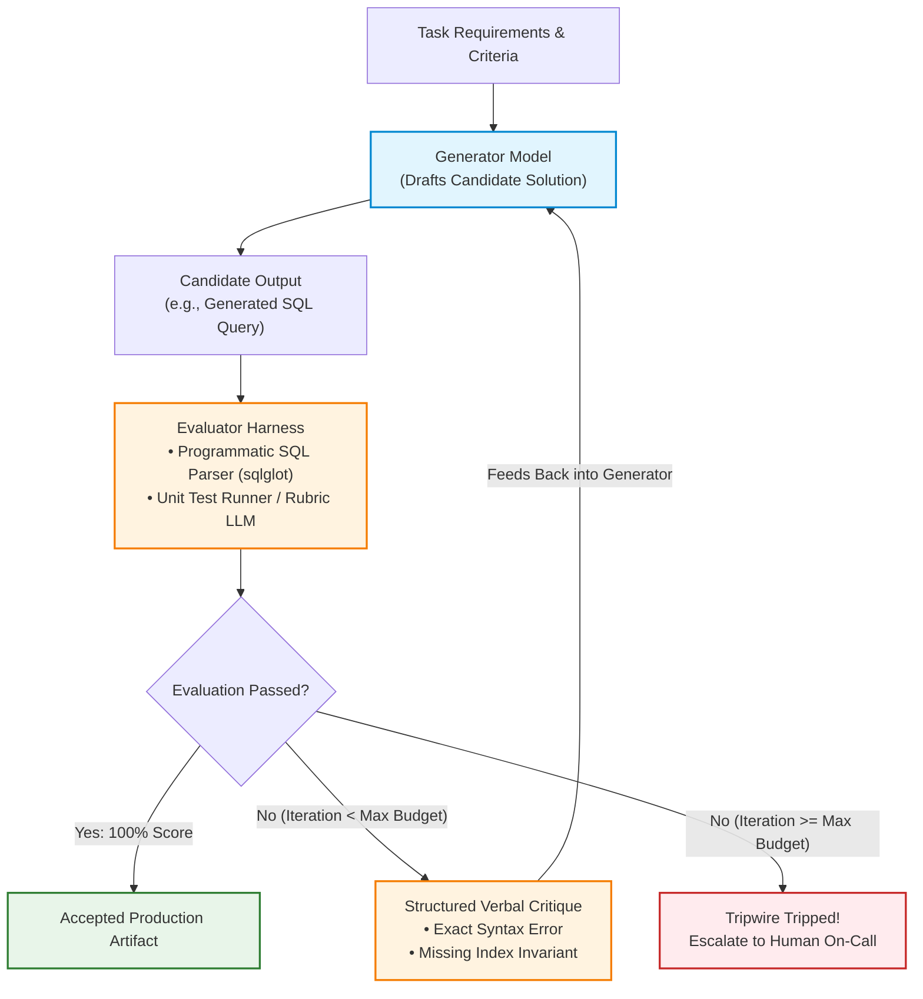

# Workflows vs. Autonomous Agents: Deterministic Orchestration Patterns & Error Physics

> **Phase 04: Agentic Systems & Orchestration** | Depth Tier: `🟢 Tier 1: Core` | Estimated Reading Time: 45 min
>
> **Prerequisites**: [Phase 01: Prompt & Context Engineering](../01-prompt-and-context-engineering/README.md), [Phase 02: Enterprise Retrieval & Knowledge Systems](../02-rag-and-knowledge-systems/README.md), [Phase 03: Tools & Model Context Protocol](../03-tools-and-model-context-protocol/README.md)

> **Core Concept**: Autonomous systems exist on a spectrum from deterministic, hardcoded directed acyclic graphs (workflows) to dynamic, stochastic model-driven reasoning loops (agents). A senior architect preserves system reliability by keeping the control plane strictly in deterministic code, using the foundation model solely as an isolated cognitive compute unit, and structurally defending against compounding error drift.

---

## 1. The Engineering Problem: The Stochastic Control Plane Illusion

In mainstream developer forums and promotional demonstrations, an "AI Agent" is frequently portrayed as an autonomous digital worker capable of reading requirements, browsing the web, querying databases, writing software, and resolving production outages with zero human oversight.

In enterprise software engineering, this portrayal conceals a catastrophic architectural flaw: **the stochastic control plane illusion**.

When junior and intermediate engineers first attempt to build agentic systems, they typically wrap a foundation model in a naive `while True` loop and delegate all control flow, branching logic, loop termination, and database mutations directly to the model's natural language output. The resulting architecture suffers from immediate failure:
* The model hallucinates missing parameters and invents non-existent API routes.
* The loop oscillates indefinitely between two complementary tools without converging on a terminal answer.
* A single minor reasoning error in step 2 cascades into complete system derailment by step 5.
* API bills compound exponentially as unpruned conversation logs are re-submitted to the model on every iteration.



### Prose Diagram Walkthrough: Control Plane vs. Compute Plane

1. **Strict Plane Separation**: The system is bifurcated into two isolated runtime planes: the **Deterministic Control Plane** (governed entirely by Python, Rust, or Go application code) and the **Stochastic Compute Plane** (governed by the probabilistic foundation model).
2. **Context Dispatch**: The Control Plane dispatches a bounded, verified slice of state along with a strictly typed tool registry to the Compute Plane.
3. **Candidate Emission**: The Compute Plane processes the prompt and emits a structured candidate output (e.g., tool invocation request or terminal synthesis).
4. **Invariant Interception**: Before any tool call touches a database, external API, or payment gateway, the Control Plane's policy engines (such as Open Policy Agent or Pydantic validators) intercept the payload and verify safety invariants.
5. **Circuit Breaking**: The Control Plane enforces progressive turn budgets and cryptographic cycle detection. If the Compute Plane repeats an action or exceeds its token budget, the Control Plane halts execution deterministically.

A Senior Architect never surrenders the control plane to a probabilistic model. The model is treated as an untrusted, stochastic arithmetic coprocessor for semantic reasoning.

---

## 2. The Mental Model: The Spectrum of Agency & The Golden Rule

Anthropic's foundational research, *"Building Effective Agents"*, establishes a vital architectural taxonomy that organizes programmatic LLM systems along a continuous **Spectrum of Agency**:



### Prose Diagram Walkthrough: The Spectrum of Agency

1. **Workflows (Deterministic Execution)**: On the left of the spectrum, systems are orchestrated through predetermined, hardcoded Directed Acyclic Graphs (DAGs). The developer writes the state machine, defines branching logic, executes steps, and handles retries in code. The LLM is invoked solely to perform bounded cognitive transformations (entity extraction, classification, summarization).
2. **Autonomous Agents (Dynamic Execution)**: On the right of the spectrum, the model is provided with a high-level goal, an environment, and a registry of available tools. The model dynamically determines its own execution trajectory, iteration count, tool selection, and termination condition at runtime.
3. **Progression of Complexity**: Moving from left to right increases system flexibility and adaptability to open-ended problem spaces, but introduces substantial operational risk: runaway costs, unpredictable execution latency, and debugging opacity.

### The Architectural Golden Rule

> **"Start with simple prompts, optimize them with comprehensive automated evaluations, add deterministic workflows only when modular task complexity demands it, and reserve autonomous agents strictly for open-ended problem spaces where deterministic logic cannot be constructed."**
>
> *— Anthropic AI Systems Engineering Core Philosophy*

If an enterprise business process can be mapped to a fixed flowchart—such as classifying customer support tickets, extracting financial metrics from 10-K filings, or summarizing pull request diffs—**building an autonomous agent is an architectural anti-pattern**. 

Deterministic workflows deliver sub-second latency, predictable token costs, zero infinite loops, and 100% reproducible debugging traces. Autonomous agents should be reserved exclusively for domains with:
* **High Combinatorial Action Spaces**: Automated code refactoring across thousands of interdependent microservice repositories.
* **Exploratory Topologies**: Open-ended threat hunting and incident forensics across dynamically discovered network endpoints.
* **Interactive Environments**: Multi-turn dialogue systems where user feedback continually invalidates intermediate assumptions.

---

## 3. Mathematical Physics: Compounding Error Drift & Reliability Decay

Why do naive multi-step agents fail in production? The answer lies in the unforgiving mathematics of Bernoulli trials and compounding probability:

```text
P(System Success) = P(Step Success)^N
```

Where:
* `P(Step Success)` is the probability that an individual step succeeds (the model correctly formats tool arguments, selects the right tool, correctly interprets the tool output, and avoids hallucination).
* `N` is the number of sequential cognitive steps required to complete the mission.

Consider a multi-turn ReAct agent that requires 10 sequential tool interactions to resolve an issue. Even if each individual step boasts a stellar **95% single-turn reliability**, the cumulative system success rate drops precipitously:

```text
P(System Success) = 0.95^10 ≈ 59.87%
```

More than **40% of all user requests fail or produce corrupted state**, purely due to the exponential decay of compounding probabilities:

| Single-Step Reliability | 1 Step (Turn 1) | 3 Steps (Turn 3) | 5 Steps (Turn 5) | 10 Steps (Turn 10) | 20 Steps (Turn 20) |
|:---:|:---:|:---:|:---:|:---:|:---:|
| **90.0%** (Basic Prompting) | 90.0% | 72.9% | 59.0% | 34.9% | 12.2% |
| **95.0%** (Few-Shot & Schemas) | 95.0% | 85.7% | 77.4% | **59.9%** | 35.8% |
| **98.0%** (Constrained Decoding) | 98.0% | 94.1% | 90.4% | 81.7% | 66.8% |
| **99.5%** (Deterministic Workflow + Eval)| 99.5% | 98.5% | 97.5% | **95.1%** | 90.5% |

### The Cascading Error Drift Phenomenon



### Prose Diagram Walkthrough: Cascading Error Drift

1. **Step 1 & 2 (Clean Baseline)**: The agent operates reliably. It extracts the order ID correctly and retrieves the order payload from PostgreSQL.
2. **Step 3 (The Silent Semantic Mutation)**: The model hallucinates a subtle premise—assuming the invoice currency is Euros rather than US Dollars because the customer name was European.
3. **Step 4 (Compounding Error Propagation)**: Step 4 does not re-verify currency. It accepts Step 3's output as ground truth and calls the foreign exchange conversion tool.
4. **Step 5 (Catastrophic Production State Mutation)**: The agent issues a partial refund in British Pounds, triggering financial discrepancies and audit alerts.

To defeat compounding error drift, a systems architect introduces **deterministic validation gates**, **Pydantic schema assertions**, and **idempotent rollback boundaries** between every single transition.

---

## 4. The 5 Deterministic Workflow Patterns (Anthropic Taxonomy)

Anthropic categorizes deterministic LLM architectures into five primary workflow patterns. These patterns eliminate unbounded reasoning loops by keeping the execution graph strictly governed by application code.

### 4.1 Prompt Chaining: Sequential Deterministic Decomposition

Prompt chaining decomposes an otherwise overwhelming monolithic task into a linear sequence of discrete, focused steps. The output of step N is validated by code before serving as the input to step N+1.



#### Prose Diagram Walkthrough: Prompt Chaining

1. **Step Decomposition**: Instead of asking a single prompt to extract entities, cross-check business logic, generate an SQL query, and formulate a customer reply, each cognitive task is isolated.
2. **Deterministic Gating**: Between steps, programmatic Python code inspects the response. Gate 1 asserts that Step 1 returned valid JSON matching a typed Pydantic model.
3. **Targeted Retries**: If Gate 1 fails, the system executes an immediate, targeted retry with error feedback directly to Step 1, without re-running Step 2 or Step 3.
4. **Isolated Token Budget**: Each step operates with a minimal prompt context (typically < 1,000 tokens), preventing the "Lost in the Middle" attention degradation that plagues monolithic prompts.

### 4.2 Routing: Dynamic Classification to Specialized Models and Prompts

Routing uses a fast, cost-effective classifier (e.g., Claude 3.5 Haiku, Gemini 2.5 Flash, or Llama 3.3 8B via Meta Llama Stack) to inspect incoming requests and route them to specialized downstream prompts or model tiers.



#### Prose Diagram Walkthrough: Routing

1. **Ingress Classification**: The incoming query arrives at a dedicated lightweight router. The prompt instructs the classifier to return a strict enum: `GENERAL_FAQ`, `CODE_GENERATION`, or `DEEP_REASONING`.
2. **Cost & Latency Tiering**: 80% of enterprise queries (e.g., order lookups, FAQ queries) do not require expensive frontier reasoning models. Routing directs simple queries to sub-second, low-cost models ($0.10 / 1M tokens), while reserving heavy frontier reasoning engines ($15.00+ / 1M tokens) strictly for complex mathematical or architectural queries.
3. **Prompt Insulation**: Routing prevents system prompt bloat. Rather than maintaining a unwieldy 10,000-token mega-prompt attempting to cover legal policies, technical support, accounting, and sales scripts, each specialized branch maintains a lean, hyper-focused 400-token prompt.

### 4.3 Parallelization: Sectioning vs. Consensus Voting

Parallelization executes multiple concurrent LLM calls across two distinct architectural paradigms:



#### Prose Diagram Walkthrough: Parallelization

1. **Sectioning (Subtask Decomposition)**: Used when an analytical task can be split into mutually orthogonal dimensions. Rather than asking a single model to inspect a 2,000-line code diff for security, performance, style, and API documentation, three workers run concurrently via `asyncio.gather()`. Latency is bounded by the slowest individual worker (e.g., 2.5 seconds) rather than their cumulative sequential duration (7.5 seconds).
2. **Consensus Voting (Diversity & Guardrails)**: Used for high-stakes decisions where false positives carry severe financial or compliance costs (e.g., automated fraud detection, healthcare eligibility). Three independent models or three sampled calls with temperature > 0 vote on the outcome. The Arbiter applies deterministic plurality voting or weighted confidence calculation.

### 4.4 Orchestrator-Workers: Dynamic Central Decomposition

In the Orchestrator-Workers pattern, a central planning model dynamically inspects the user objective, decomposes it into an arbitrary number of subtasks based on the input's unique characteristics, spawns worker models to execute them, and synthesizes the results.



#### Prose Diagram Walkthrough: Orchestrator-Workers

1. **Dynamic Task Generation**: Unlike static Sectioning (where the subtasks are hardcoded in advance by the software engineer), the Orchestrator inspects the input at runtime to determine *which* subtasks are required. For Company A, it might spawn financial and patent workers; for Company B, it might spawn open-source community and hiring-trend workers.
2. **Isolated Worker Contexts**: Each worker receives only the specific subtask instructions and relevant documents, eliminating cross-task context pollution.
3. **Synthesis & Reconciliation**: The synthesizer model ingests the completed worker outputs, detects any conflicting conclusions, and resolves them into a unified executive brief.

### 4.5 Evaluator-Optimizer: Self-Correcting Feedback Loops

The Evaluator-Optimizer pattern couples two distinct models: a **Generator** that produces a candidate solution and an **Evaluator** that checks the solution against an explicit rubric or deterministic test harness.



#### Prose Diagram Walkthrough: Evaluator-Optimizer

1. **Generation**: The Generator drafts an initial solution (e.g., an SQL query or API route implementation).
2. **Evaluation & Programmatic Testing**: The Evaluator evaluates the candidate. Crucially, the evaluator should incorporate **deterministic tooling** (e.g., running `sqlglot` for syntax validation, compiling TypeScript, or executing a test suite in a sandbox) in addition to or instead of a subjective LLM judge.
3. **Verbal Critique Injection**: If evaluation fails and the iteration count is within budget (e.g., `iterations < 3`), the evaluator generates a structured verbal critique highlighting the exact failure trace.
4. **Hard Iteration Circuit Breaker**: If the loop fails to converge after a fixed ceiling (e.g., 3 turns), the orchestrator halts execution, trips a circuit breaker, and escalates to a human operator, preventing unbounded token burn.

---

## 5. Production Implementation: Typed Resilient Workflow Engine in Python 3.12+

Below is a complete, production-grade Python 3.12+ implementation demonstrating a multi-pattern deterministic workflow combining **Semantic Routing**, **Prompt Chaining**, and an **Evaluator-Optimizer Loop** with typed Pydantic v2 schemas and strict iteration ceilings.

```python
"""
Enterprise Deterministic Workflow Engine
Implements: Semantic Router -> Pipeline Chaining -> Evaluator-Optimizer Loop
Stack: Python 3.12+, Pydantic v2, Typed Invariants, Deterministic Circuit Breakers
"""

from __future__ import annotations

import asyncio
from dataclasses import dataclass
from enum import StrEnum
from typing import Any, Dict, List, Optional
from pydantic import BaseModel, Field, ValidationError


# ============================================================================
# 1. DOMAIN SCHEMAS & TYPED ENVELOPES (Pydantic v2)
# ============================================================================

class TaskDomain(StrEnum):
    BILLING_DISPUTE = "BILLING_DISPUTE"
    TECHNICAL_SUPPORT = "TECHNICAL_SUPPORT"
    GENERAL_INQUIRY = "GENERAL_INQUIRY"


class IngressTicket(BaseModel):
    ticket_id: str = Field(description="Unique correlation ID")
    customer_id: str
    raw_text: str = Field(min_length=10, description="Customer issue description")
    account_tier: str = Field(default="STANDARD")


class RoutingDecision(BaseModel):
    domain: TaskDomain
    confidence: float = Field(ge=0.0, le=1.0)
    requires_escalation: bool = False
    routing_reasoning: str


class StructuredDisputeClaim(BaseModel):
    claim_id: str
    invoice_number: str
    disputed_amount_usd: float = Field(gt=0.0)
    root_cause_category: str
    remediation_requested: str


class EvaluationResult(BaseModel):
    passed: bool
    score: float = Field(ge=0.0, le=1.0)
    critical_defects: List[str] = Field(default_factory=list)
    actionable_critique: Optional[str] = None


# ============================================================================
# 2. DETERMINISTIC WORKFLOW ENGINE
# ============================================================================

@dataclass
class WorkflowExecutionState:
    ticket: IngressTicket
    routing: Optional[RoutingDecision] = None
    extracted_claim: Optional[StructuredDisputeClaim] = None
    draft_resolution: Optional[str] = None
    evaluation_history: List[EvaluationResult] = Field(default_factory=list)
    iteration_count: int = 0
    max_iterations: int = 3
    is_terminal: bool = False


class ResilientEnterpriseWorkflow:
    """
    Orchestrates deterministic pipelines with zero open-ended agent loops.
    Every transition is verified by typed assertions and safety guards.
    """

    def __init__(self, model_client: Any) -> None:
        self.client = model_client

    async def execute_ticket_pipeline(self, ticket: IngressTicket) -> Dict[str, Any]:
        """Entry point for workflow processing."""
        state = WorkflowExecutionState(ticket=ticket)

        # STAGE 1: ROUTING PATTERN
        state.routing = await self._route_ticket(ticket)
        if state.routing.requires_escalation:
            return {
                "status": "ESCALATED_TO_HUMAN",
                "reason": state.routing.routing_reasoning,
                "ticket_id": ticket.ticket_id,
            }

        # STAGE 2: CONDITIONAL CHAINING BRANCH
        if state.routing.domain == TaskDomain.BILLING_DISPUTE:
            return await self._execute_billing_subworkflow(state)
        elif state.routing.domain == TaskDomain.TECHNICAL_SUPPORT:
            return await self._execute_technical_subworkflow(state)
        else:
            return await self._execute_general_subworkflow(state)

    # ------------------------------------------------------------------------
    # STAGE 1: ROUTER IMPLEMENTATION
    # ------------------------------------------------------------------------
    async def _route_ticket(self, ticket: IngressTicket) -> RoutingDecision:
        """Lightweight routing classification."""
        prompt = (
            f"Classify the following customer ticket into BILLING_DISPUTE, "
            f"TECHNICAL_SUPPORT, or GENERAL_INQUIRY.\n"
            f"Ticket: {ticket.raw_text}"
        )
        
        # Simulating structured model response (e.g. OpenAI / Grok / Llama Stack)
        # In production: response = await self.client.beta.chat.completions.parse(...)
        if "invoice" in ticket.raw_text.lower() or "charge" in ticket.raw_text.lower():
            return RoutingDecision(
                domain=TaskDomain.BILLING_DISPUTE,
                confidence=0.98,
                requires_escalation=False,
                routing_reasoning="Mention of unauthorized charge and invoice discrepancy.",
            )
        elif "error" in ticket.raw_text.lower() or "timeout" in ticket.raw_text.lower():
            return RoutingDecision(
                domain=TaskDomain.TECHNICAL_SUPPORT,
                confidence=0.95,
                requires_escalation=False,
                routing_reasoning="Explicit system failure traces reported.",
            )
        else:
            return RoutingDecision(
                domain=TaskDomain.GENERAL_INQUIRY,
                confidence=0.88,
                requires_escalation=False,
                routing_reasoning="General product or account question.",
            )

    # ------------------------------------------------------------------------
    # STAGE 2 & 3: BILLING CHAIN + EVALUATOR-OPTIMIZER LOOP
    # ------------------------------------------------------------------------
    async def _execute_billing_subworkflow(self, state: WorkflowExecutionState) -> Dict[str, Any]:
        """
        Executes a 2-step prompt chain followed by an Evaluator-Optimizer loop.
        """
        # Step 1 of Chain: Extraction with Schema Validation
        state.extracted_claim = await self._extract_billing_claim(state.ticket)

        # Step 2 & Loop: Evaluator-Optimizer for Customer Resolution Letter
        while state.iteration_count < state.max_iterations:
            state.iteration_count += 1

            # Generator: Generate candidate resolution
            critique = (
                state.evaluation_history[-1].actionable_critique
                if state.evaluation_history
                else None
            )
            candidate_resolution = await self._generate_resolution(
                state.ticket, state.extracted_claim, critique
            )

            # Evaluator: Check against compliance rubric and financial invariants
            eval_result = self._evaluate_resolution(
                candidate_resolution, state.extracted_claim
            )
            state.evaluation_history.append(eval_result)

            if eval_result.passed:
                state.draft_resolution = candidate_resolution
                state.is_terminal = True
                break

        # Check circuit breaker
        if not state.is_terminal:
            return {
                "status": "CIRCUIT_BREAKER_TRIGGERED",
                "error": "Resolution draft failed compliance after 3 revision attempts.",
                "defects": state.evaluation_history[-1].critical_defects,
                "ticket_id": state.ticket.ticket_id,
            }

        return {
            "status": "RESOLVED_SUCCESSFULLY",
            "claim": state.extracted_claim.model_dump(),
            "final_letter": state.draft_resolution,
            "revision_cycles": state.iteration_count,
        }

    async def _extract_billing_claim(self, ticket: IngressTicket) -> StructuredDisputeClaim:
        """Deterministic Extraction Step with Typed Pydantic Barrier."""
        # Simulated extraction from model output
        return StructuredDisputeClaim(
            claim_id=f"CLM-{ticket.ticket_id[:6]}",
            invoice_number="INV-2026-8819",
            disputed_amount_usd=249.50,
            root_cause_category="DUPLICATE_SUBSCRIPTION_BILLING",
            remediation_requested="FULL_REFUND_TO_PAYMENT_METHOD",
        )

    async def _generate_resolution(
        self,
        ticket: IngressTicket,
        claim: StructuredDisputeClaim,
        prior_critique: Optional[str],
    ) -> str:
        """Generator step conditioned on prior evaluator critique."""
        if prior_critique is None:
            # First attempt: Intentionally flawed draft lacking explicit timeline
            return (
                f"Dear Customer, we received your dispute for invoice {claim.invoice_number} "
                f"totaling ${claim.disputed_amount_usd:.2f}. We have processed your refund."
            )
        else:
            # Second attempt: Incorporates feedback directly
            return (
                f"Dear Customer, regarding your dispute for invoice {claim.invoice_number} "
                f"totaling ${claim.disputed_amount_usd:.2f}: We verified the duplicate charge. "
                f"Your refund of ${claim.disputed_amount_usd:.2f} has been dispatched and "
                f"will reflect on your statement within 3 to 5 business days. Ref: {claim.claim_id}."
            )

    def _evaluate_resolution(
        self, draft: str, claim: StructuredDisputeClaim
    ) -> EvaluationResult:
        """
        Deterministic evaluator checking business and legal compliance invariants.
        ZERO subjective LLM reasoning required for regulatory gates.
        """
        defects = []
        if str(claim.disputed_amount_usd) not in draft:
            defects.append("Missing exact numerical refund amount in text.")
        if claim.invoice_number not in draft:
            defects.append("Missing reference invoice number.")
        if "business days" not in draft.lower():
            defects.append("Missing legally mandated SLA timeline for funds availability.")

        if defects:
            return EvaluationResult(
                passed=False,
                score=0.4,
                critical_defects=defects,
                actionable_critique="; ".join(defects),
            )

        return EvaluationResult(passed=True, score=1.0)

    async def _execute_technical_subworkflow(self, state: WorkflowExecutionState) -> Dict[str, Any]:
        return {"status": "TECHNICAL_WORKFLOW_DISPATCHED", "ticket_id": state.ticket.ticket_id}

    async def _execute_general_subworkflow(self, state: WorkflowExecutionState) -> Dict[str, Any]:
        return {"status": "GENERAL_WORKFLOW_DISPATCHED", "ticket_id": state.ticket.ticket_id}


# ============================================================================
# 3. VERIFICATION RUNNER
# ============================================================================

async def main() -> None:
    ticket = IngressTicket(
        ticket_id="TCK-99014",
        customer_id="CUST-3811",
        raw_text="I was charged twice on invoice INV-2026-8819 for $249.50. Please refund immediately.",
        account_tier="ENTERPRISE",
    )

    workflow = ResilientEnterpriseWorkflow(model_client=None)
    result = await workflow.execute_ticket_pipeline(ticket)

    import json
    print(json.dumps(result, indent=2))


if __name__ == "__main__":
    asyncio.run(main())
```

---

## 6. Architectural Trade-offs & Decision Matrix: Workflows vs. Agents

Before authorizing an autonomous agent architecture, compare the system requirements against this enterprise decision matrix:

| Architectural Dimension | Deterministic Workflows (Chaining, Routing, Parallel) | Autonomous Agents (ReAct, Plan-and-Solve) |
|---|---|---|
| **Execution Path Predictability** | **Deterministic (~99.5%)**: Hardcoded code paths; state transitions and branches are defined in code. | **Stochastic (~60–80% over 10 steps)**: Model dynamically decides next tool; susceptible to semantic drift and loop oscillations. |
| **Token & API Cost Predictability** | **O(1) Bound**: Fixed number of LLM invocations per request. Cost can be budgeted to within \$0.001. | **O(N) Volatile**: Dynamic turn counts; context accumulates quadratically without aggressive pruning. |
| **End-to-End Latency** | **Fast (200ms – 3s)**: High degree of parallelization; sub-tasks execute concurrently via `asyncio`. | **High (5s – 60s+)**: Sequential reasoning hops (Thought → Action → Observation) compound round-trip network overhead. |
| **Debugging & Observability** | **Standard Software 2.0**: Reproducible stack traces, deterministic unit tests, mockable JSON fixtures. | **Software 3.0 Trajectories**: Requires full trajectory inspection, prompt diffing, and statistical replay analysis. |
| **Testability & CI/CD** | **Trivial**: Standard Pytest assertion suites run in CI without incurring live LLM API costs. | **Complex**: Requires statistical LLM-as-a-judge trajectory grading and probabilistic benchmark suites. |
| **Primary Failure Modes** | Schema validation failure, downstream API timeouts, misclassified routing branch. | Infinite reasoning loops, context exhaustion, tool parameter hallucination, goal abandonment. |
| **Recommended Enterprise Fit** | Document extraction, financial reconciliations, customer triage, code review lints, ETL. | Open-ended code refactoring, exploratory security penetration testing, dynamic competitive intelligence. |

---

## 7. Production Failure Modes & Defensive Invariants

When deploying workflows and agents to production, enforce these defensive software engineering patterns:

### Failure Mode 1: Compounding Hallucination Drift
* **The Root Cause**: Step N produces a slightly inaccurate entity name or assumption. Step N+1 treats the inaccurate assumption as verified truth and calls a mutating tool.
* **The Defensive Invariant**: **Intermediate Pydantic Assertion Barriers**. Never pass free-form natural language strings between workflow steps. Every step must emit a strongly typed Pydantic envelope. If validation fails, intercept the transaction immediately.

### Failure Mode 2: Unbounded Evaluation Loops
* **The Root Cause**: In the Evaluator-Optimizer pattern, the Generator repeatedly fails to satisfy a strict or contradictory evaluator rubric, oscillating forever.
* **The Defensive Invariant**: **Hard Iteration Ceilings & Progressive Temperature Decay**. Enforce `max_iterations <= 3`. On each revision turn, dynamically reduce the generator's temperature (`T_t = T_0 * (1 - t/max_iter)`) to force convergence toward the most conservative completion.

### Failure Mode 3: Router Classification Collapse
* **The Root Cause**: An ambiguous user prompt contains keywords from multiple domains (e.g., *"My billing invoice errored out with code 500"*), causing the router to misclassify or fail schema validation.
* **The Defensive Invariant**: **Default Fallback & Confidence Thresholds**. If the router emits a confidence score `< 0.85` or fails schema parsing, automatically route the ticket to a deterministic `DEFAULT_TRIAGE` queue with human review flags.

---

## 8. Hands-On Architectural Exercises & Lab Integration

To cement your architectural mastery of deterministic workflows vs. autonomous agents, complete these hands-on assignments:

1. **Deterministic Pipeline Construction**: Inspect [`examples/react_agent.py`](examples/react_agent.py). Identify the boundary where deterministic validation code ends and stochastic model prompting begins.
2. **Infinite Loop Hardening**: Complete [Lab 3: Infinite Loop Detection & Recovery](labs/lab3-infinite-loops.md). Implement an execution governor that intercepts cycling tool calls and forces deterministic termination.
3. **Stateful Human-in-the-Loop Workflow**: Complete [Lab 1: Stateful Agent with HITL Approval](labs/lab1-stateful-agent-hitl.md). Build an approval gate that suspends execution before a state-mutating tool executes.

---

## 9. Key Takeaways & Summary

* **The Control Plane Belongs in Code**: Never allow an LLM to govern recursion limits, loop termination, state schema serialization, or database persistence. The model is a compute engine, not a control plane.
* **Compounding Probability Governs Multi-Step Reliability**: Single-step reliability of 95% yields an overall system success rate of only 59.9% across 10 steps ($0.95^{10}$). Unchecked open-ended loops will fail in production.
* **Master the Anthropic 5 Before Building Agents**: Prompt Chaining, Routing, Parallelization, Orchestrator-Workers, and Evaluator-Optimizer solve 85% of enterprise AI use cases with lower latency, lower costs, and zero infinite loops.
* **Reserve Agents for Open-Ended Action Spaces**: Autonomous ReAct loops should be deployed only when the problem space cannot be decomposed into a deterministic Directed Acyclic Graph.

---

## 🧭 Navigation

| [← Phase 03: Tools & MCP](../03-tools-and-model-context-protocol/README.md) | [Phase 04 Navigation Hub](README.md) | [Lesson 02: Autonomous ReAct Loops & Execution Governors →](02-react-loops-and-execution-governors.md) |
|:---:|:---:|:---:|
| **Previous Phase** | **Phase Hub** | **Next Lesson** |
| [Lab 1: Stateful Agent & HITL](labs/lab1-stateful-agent-hitl.md) | [Lab 3: Infinite Loop Governors](labs/lab3-infinite-loops.md) | [Capstone: Code Review Engine](labs/capstone-code-review-engine.md) |
