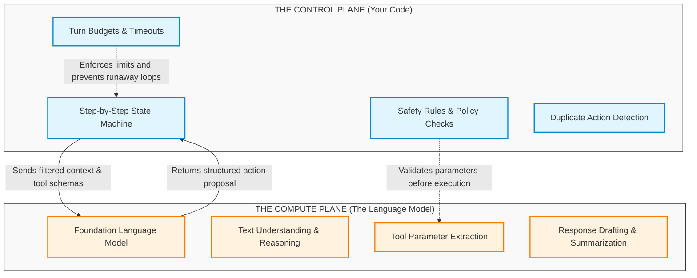
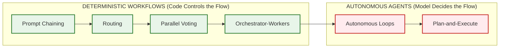
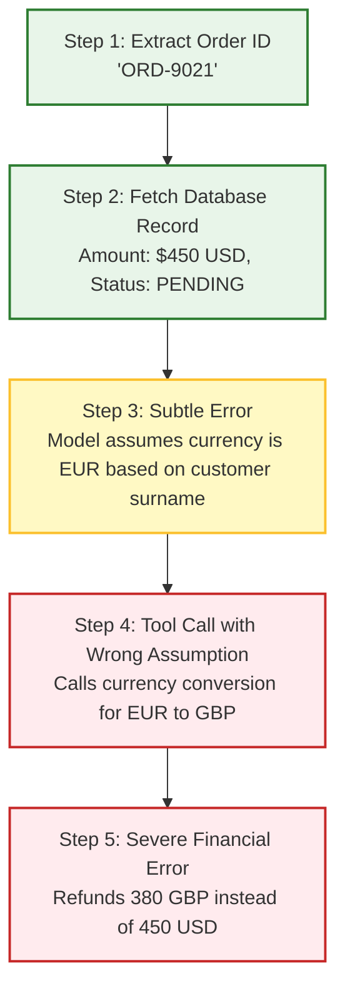
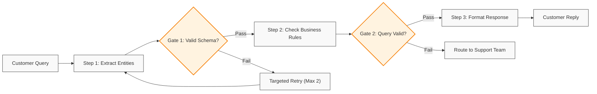
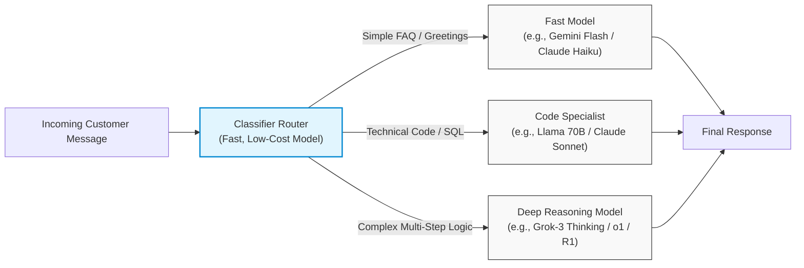
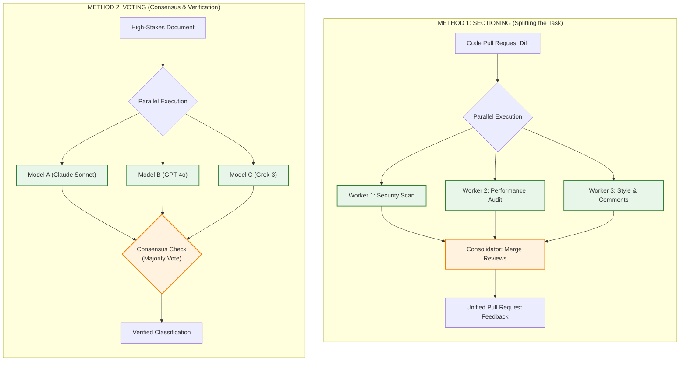
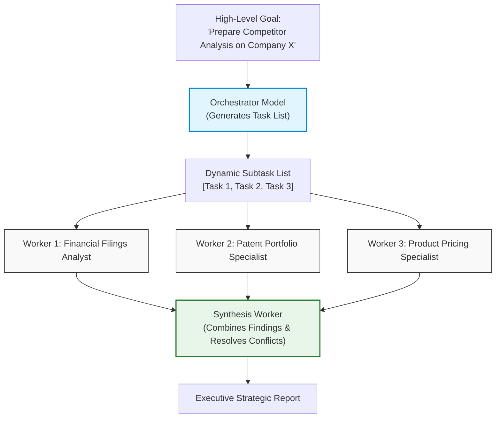
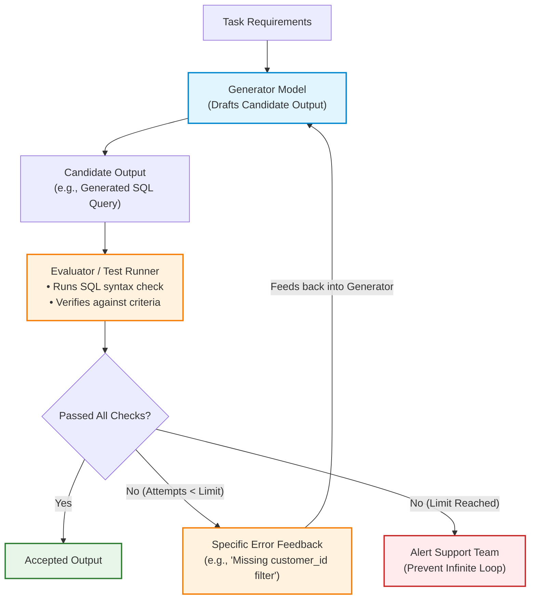

# Workflows vs. Autonomous Agents: Deterministic Orchestration Patterns & Reliability Physics

> **Phase 04: Agentic Systems & Orchestration** | Depth Tier: `🟢 Tier 1: Core` | Estimated Reading Time: 40 min
>
> **Prerequisites**: [Phase 01: Prompt & Context Engineering](../01-prompt-and-context-engineering/README.md), [Phase 02: Enterprise Retrieval & Knowledge Systems](../02-rag-and-knowledge-systems/README.md), [Phase 03: Tools & Model Context Protocol](../03-tools-and-model-context-protocol/README.md)

> **Core Concept**: Autonomous systems exist on a spectrum. On one side are deterministic workflows—step-by-step pipelines where regular software code directs the execution path. On the other side are autonomous agents—where the language model itself chooses which tools to run, in what order, and when to stop. For enterprise systems, reliability begins by keeping the control plane in code, using the language model as a specialized reasoning engine, and guarding against compounding errors.

### Key AI Terms for This Lesson

Before diving in, here are the core AI terms used throughout this lesson:

* **Language Model (Large Language Model / LLM / Foundation Model)**: A neural network trained on massive text datasets. Given an input prompt (a block of text), it predicts the statistically most likely next words—one piece at a time—without any built-in memory, database connections, or ability to execute code on its own. Think of it as a very sophisticated text-completion engine.
* **Token**: The basic unit that a language model reads and generates. Tokens are not whole words—they are sub-word fragments. For example, the word "embedding" becomes two tokens: "embed" + "ding". Models charge per token (both input and output), so managing token counts directly controls cost and latency. A rough rule of thumb: 1,000 tokens ≈ 750 English words.
* **Context Window**: The maximum amount of text (measured in tokens) that a model can process in a single request. Think of it as the model's short-term working memory—everything beyond this limit is invisible to the model. Current models range from 8,000 to 2 million tokens. Managing what goes into this window is one of the most critical AI engineering tasks.
* **Hallucination**: When a model generates text that appears confident and plausible but is factually wrong. This is not a bug—it is a fundamental property of how language models work. Because they predict statistically likely words rather than looking up verified facts, they can confidently "invent" database IDs, API parameter names, or function signatures that do not exist.
* **AI Agent**: A software system that uses a language model to autonomously decide which actions to take in pursuit of a goal. Unlike a simple chatbot that responds once, an agent operates in a loop: it reasons about what to do next, executes an action (like calling an API or querying a database), observes the result, and decides whether to continue or stop.

---

## 1. The Real-World Problem: The Illusion of Autonomous Control

When you watch demonstrations of AI agents, they often look almost magical: an agent is given a vague goal, browses the web, queries a database, writes some code, and resolves an outage without any human intervention.

In real-world software engineering, giving a language model full control over your application's execution logic quickly leads to production failures:
* **Invented Parameters (Hallucination)**: The model generates statistically plausible but non-existent database IDs or API parameters—a behavior called hallucination. Because the model predicts likely-looking text rather than looking up real values, it produces output that sounds correct but fails at runtime.
* **Infinite Loops**: When an API returns an error, the model continues generating tool calls to the same endpoint with slightly different wording, wasting API credits without making progress.
* **Cascading Errors**: A small erroneous inference in step 2 snowballs into a completely wrong action by step 5.
* **Runaway Costs**: Re-sending conversation histories on every turn causes the number of input tokens to balloon, resulting in unexpected API bills.

To build reliable systems, we must separate two distinct parts of the architecture: the **Control Plane** and the **Compute Plane**.



### How the Planes Work Together: Step-by-Step

1. **Separation of Concerns**: Your application code acts as the **Control Plane**. It maintains the master state, checks security rules, sets timeouts, and manages database connections. The language model acts as the **Compute Plane**—a specialized worker called to understand natural language or draft responses.
2. **Filtered Dispatch**: The control plane does not dump all application data into the prompt. It sends only the specific context and tool definitions needed for the immediate step.
3. **Structured Proposal**: The model processes the input and proposes an action (such as invoking an API or providing an answer) using a strongly typed schema.
4. **Validation Barrier**: Before any tool touches a production database, payment gateway, or file system, your application code inspects the proposed arguments to ensure they satisfy all safety and business rules.
5. **Enforced Boundaries**: If the model attempts an invalid action or exceeds its budget, your code catches the issue, halts the cycle, and either tries a fallback or alerts an engineer.

The core lesson: **Never let an AI model act as your control plane.** Your application code must direct the flow, enforce safety checks, and decide when to stop.

---

## 2. The Mental Model: The Spectrum of Agency

In their research guide, *"Building Effective Agents"*, Anthropic established a helpful mental model called the **Spectrum of Agency**. This framework categorizes AI systems by how much autonomy the model possesses:



### Understanding the Spectrum

1. **Deterministic Workflows (Left Side)**: Systems where the execution path is fixed in code. The developer writes the flowchart: step A runs, then step B, with clear branching rules (`if/else`). The language model is called only within discrete steps to handle text transformation, classification, or extraction.
2. **Autonomous Agents (Right Side)**: Systems where the model is given an overarching goal, a set of tools, and an execution loop. The model dynamically decides which tool to call next, evaluates intermediate observations, and determines when the task is complete.
3. **The Practical Rule**: As you move from left to right, systems become more flexible in open-ended domains, but they also become harder to test, more expensive, and prone to non-deterministic edge cases.

### The Architectural Golden Rule

> **"Start with simple prompts. If that is not enough, add deterministic workflows in code. Reserve autonomous agents strictly for open-ended problem spaces where fixed code pathways cannot be anticipated."**

If your business task can be drawn as a flowchart—such as classifying incoming support tickets, extracting line items from invoices, or summarizing code pull requests—**you do not need an autonomous agent**. A deterministic workflow is faster, costs a fraction of the price, never gets stuck in infinite loops, and can be tested with standard unit tests.

Autonomous agents should be used when the steps cannot be predicted in advance, such as:
* Investigating an open-ended security alert across hundreds of unknown server logs.
* Iteratively writing, running, and fixing code across a complex multi-file codebase.
* Researching topics across the web where each discovery dictates the next search query.

---

## 3. The Math of Compounding Errors: Why Open Loops Drift

Why do unconstrained multi-step agents fail so often in production? The answer comes down to basic probability:

```text
Overall System Success = (Single Step Success Rate) ^ (Number of Steps)
```

Suppose each individual tool call has a very respectable **95% success rate** (meaning the model extracts the right parameters, calls the right tool, and interprets the result correctly 19 times out of 20).

If a task requires 10 sequential tool steps to finish, what is the probability of the entire sequence succeeding without error?

```text
Overall Success = 0.95 ^ 10 ≈ 59.9%
```

Even with 95% step accuracy, **over 40% of multi-step runs will derail or produce corrupted output**!

| Single-Step Accuracy | 1 Step (Turn 1) | 3 Steps (Turn 3) | 5 Steps (Turn 5) | 10 Steps (Turn 10) | 20 Steps (Turn 20) |
|:---:|:---:|:---:|:---:|:---:|:---:|
| **90.0%** (Basic Prompting) | 90.0% | 72.9% | 59.0% | 34.9% | 12.2% |
| **95.0%** (Typed Schemas) | 95.0% | 85.7% | 77.4% | **59.9%** | 35.8% |
| **98.0%** (Constrained Decoding) | 98.0% | 94.1% | 90.4% | 81.7% | 66.8% |
| **99.5%** (Code Workflow + Validation) | 99.5% | 98.5% | 97.5% | **95.1%** | 90.5% |

### How Errors Cascade Through a System



### Step-by-Step Error Cascade

1. **Steps 1 & 2**: The agent performs well. It extracts the order ID correctly and retrieves the record from the database.
2. **Step 3 (The Unchecked Assumption)**: The model makes a small erroneous inference—it assumes the order is in Euros because the customer's email domain is German.
3. **Step 4 (Compounding Drift)**: Step 4 accepts Step 3's output as fact and converts the assumed Euros to British Pounds.
4. **Step 5 (Production Failure)**: The agent issues an incorrect refund, triggering accounting discrepancies.

To eliminate this compounding drift, engineers insert **validation barriers** and **schema assertions** between steps. If step 3 produces data that fails validation, the system catches it immediately rather than letting bad assumptions propagate.

---

## 4. The 5 Core Workflow Patterns (Anthropic Taxonomy)

Anthropic categorizes deterministic AI architectures into five core patterns. These patterns solve most enterprise tasks without the risks of unconstrained agent loops.

### 4.1 Prompt Chaining: Sequential Pipelines with Validation Gates

Prompt chaining breaks a large task into a linear series of focused steps. Each step takes the output of the previous step as its input.



#### How Prompt Chaining Works

* **Narrow Cognitive Focus**: Models perform significantly better when given a single, specific task (such as extracting names and dates) rather than asking one prompt to extract data, check policies, run queries, and draft an email all at once.
* **Validation Gates**: Between steps, programmatic code verifies the output. If Step 1 returns invalid JSON, your code immediately retries Step 1 with targeted feedback without re-running the rest of the pipeline.
* **Context Efficiency**: Each step only receives the tokens it needs, avoiding prompt bloat and keeping token costs minimal.

### 4.2 Routing: Classifying to Specialized Models and Prompts

Routing uses a fast, low-cost classifier to inspect the incoming request and direct it to the most suitable handler.



#### How Routing Works

* **Cost and Latency Optimization**: Around 80% of customer questions (such as checking business hours or resetting passwords) do not need expensive, high-latency reasoning models. Routing simple queries to sub-second models cuts costs by 70–80% and delivers faster response times.
* **Clean System Prompts**: Instead of maintaining an enormous 6,000-token prompt that attempts to cover billing, tech support, refunds, and security policies, routing directs the user to a lean, 400-token prompt specifically crafted for that topic.

### 4.3 Parallelization: Sectioning and Consensus Voting

Parallelization runs multiple calls concurrently using two distinct methods:



#### How Parallelization Works

* **Sectioning (Task Splitting)**: When analyzing a large code review or legal contract, splitting the review into independent dimensions (security, performance, naming) lets you run them all at the same time using asynchronous execution (`asyncio.gather`). Total turnaround time is limited only by the single slowest check, rather than waiting for them sequentially.
* **Consensus Voting**: For high-stakes decisions where an error has severe business impact (such as automated compliance or fraud detection), multiple models can evaluate the same item. The system selects the majority decision, catching edge cases where a single model might hallucinate.

### 4.4 Orchestrator-Workers: Dynamic Subtask Decomposition

In the Orchestrator-Workers pattern, a central planner model looks at the user's objective, decides which subtasks are needed, assigns those subtasks to worker models, and summarizes the results.



#### How Orchestrator-Workers Differs from Fixed Parallelization

* In **Sectioning**, the developer hardcodes the exact tasks in advance (Worker 1 always does security, Worker 2 always does performance).
* In **Orchestrator-Workers**, the orchestrator model **decides at runtime which tasks are needed** based on the prompt. For one company, it might research patents and financial filings; for another, it might examine developer documentation and open-source repositories.

### 4.5 Evaluator-Optimizer: Self-Correcting Feedback Loops

The Evaluator-Optimizer pattern pairs two models: a **Generator** that creates a candidate answer and an **Evaluator** that checks the work against clear criteria or runs automated tests.



#### How Evaluator-Optimizer Works

* **Objective Verification**: The evaluator checks the candidate against explicit rules. Wherever possible, use deterministic software tools (such as linters, compiler checks, or SQL syntax checkers) alongside or instead of an LLM evaluator.
* **Targeted Feedback**: If the candidate fails, the evaluator generates specific, actionable feedback (e.g., *"Line 4 is missing a table alias"*), and the generator tries again.
* **Hard Iteration Limits**: To avoid infinite loops, the system enforces a strict ceiling (e.g., maximum 3 attempts). If the candidate still fails after 3 tries, the system gracefully escalates to a human engineer.

---

## 5. Production Implementation: A Resilient Workflow Engine in Python

Here is a complete, runnable Python 3.12+ implementation demonstrating a resilient workflow combining **Routing**, **Prompt Chaining**, and an **Evaluator-Optimizer Loop** using typed Pydantic v2 schemas:

```python
"""
Enterprise Deterministic Workflow Engine
Implements: Semantic Router -> Pipeline Chaining -> Evaluator-Optimizer Loop
Tech Stack: Python 3.12+, Pydantic v2, Typed Schemas, Circuit Breakers
"""

from __future__ import annotations

import asyncio
from dataclasses import dataclass
from enum import StrEnum
from typing import Any, Dict, List, Optional
from pydantic import BaseModel, Field


# ============================================================================
# 1. TYPED DATA SCHEMAS
# ============================================================================

class TaskDomain(StrEnum):
    BILLING_DISPUTE = "BILLING_DISPUTE"
    TECHNICAL_SUPPORT = "TECHNICAL_SUPPORT"
    GENERAL_INQUIRY = "GENERAL_INQUIRY"


class SupportTicket(BaseModel):
    ticket_id: str = Field(description="Unique tracking identifier")
    customer_id: str
    message: str = Field(min_length=10, description="Customer request text")


class RoutingDecision(BaseModel):
    domain: TaskDomain
    confidence: float = Field(ge=0.0, le=1.0)
    routing_reason: str


class ExtractedBillingClaim(BaseModel):
    claim_id: str
    invoice_number: str
    disputed_amount: float = Field(gt=0.0)
    dispute_reason: str


class EvaluationResult(BaseModel):
    passed: bool
    score: float = Field(ge=0.0, le=1.0)
    issues_found: List[str] = Field(default_factory=list)
    actionable_feedback: Optional[str] = None


# ============================================================================
# 2. DETERMINISTIC WORKFLOW ORCHESTRATOR
# ============================================================================

@dataclass
class WorkflowState:
    ticket: SupportTicket
    routing: Optional[RoutingDecision] = None
    extracted_claim: Optional[ExtractedBillingClaim] = None
    draft_response: Optional[str] = None
    evaluation_history: List[EvaluationResult] = Field(default_factory=list)
    attempts: int = 0
    max_attempts: int = 3
    is_complete: bool = False


class ResilientSupportWorkflow:
    """
    Executes a structured customer support workflow.
    Control flow is governed by code, with strict safety checks.
    """

    async def process_ticket(self, ticket: SupportTicket) -> Dict[str, Any]:
        state = WorkflowState(ticket=ticket)

        # STAGE 1: ROUTING PATTERN
        state.routing = await self._route_ticket(ticket)
        print(f"[Workflow] Routed to: {state.routing.domain.value} (Confidence: {state.routing.confidence:.2f})")

        # STAGE 2: CONDITIONAL EXECUTION
        if state.routing.domain == TaskDomain.BILLING_DISPUTE:
            return await self._run_billing_pipeline(state)
        else:
            return {"status": "FORWARDED_TO_QUEUE", "domain": state.routing.domain.value}

    async def _route_ticket(self, ticket: SupportTicket) -> RoutingDecision:
        """Lightweight routing classification."""
        text = ticket.message.lower()
        if "invoice" in text or "charge" in text or "refund" in text:
            return RoutingDecision(
                domain=TaskDomain.BILLING_DISPUTE,
                confidence=0.97,
                routing_reason="Customer mentioned charges and invoices.",
            )
        elif "error" in text or "crash" in text or "timeout" in text:
            return RoutingDecision(
                domain=TaskDomain.TECHNICAL_SUPPORT,
                confidence=0.92,
                routing_reason="Customer reported technical error signals.",
            )
        return RoutingDecision(
            domain=TaskDomain.GENERAL_INQUIRY,
            confidence=0.85,
            routing_reason="General inquiry or question.",
        )

    async def _run_billing_pipeline(self, state: WorkflowState) -> Dict[str, Any]:
        """Runs prompt chaining and self-correcting evaluation."""
        
        # Step 1 of Chain: Extraction with validation
        state.extracted_claim = ExtractedBillingClaim(
            claim_id=f"CLM-{state.ticket.ticket_id[:6]}",
            invoice_number="INV-2026-8819",
            disputed_amount=249.50,
            dispute_reason="Duplicate subscription fee charge",
        )

        # Step 2: Evaluator-Optimizer Loop for customer email draft
        while state.attempts < state.max_attempts:
            state.attempts += 1
            feedback = (
                state.evaluation_history[-1].actionable_feedback
                if state.evaluation_history
                else None
            )

            # Generator drafts response
            draft = await self._draft_email(state.extracted_claim, feedback)

            # Evaluator verifies against company policy
            eval_result = self._evaluate_email_draft(draft, state.extracted_claim)
            state.evaluation_history.append(eval_result)

            if eval_result.passed:
                state.draft_response = draft
                state.is_complete = True
                break

        if not state.is_complete:
            return {
                "status": "ESCALATED_TO_HUMAN",
                "reason": "Email draft could not satisfy quality checks after 3 attempts.",
                "issues": state.evaluation_history[-1].issues_found,
            }

        return {
            "status": "SUCCESS",
            "claim_id": state.extracted_claim.claim_id,
            "final_email": state.draft_response,
            "revision_cycles": state.attempts,
        }

    async def _draft_email(
        self, claim: ExtractedBillingClaim, previous_feedback: Optional[str]
    ) -> str:
        """Simulates drafting and revising an email based on feedback."""
        if previous_feedback is None:
            # First attempt: Missing required timeline information
            return (
                f"Hello, we received your dispute for invoice {claim.invoice_number} "
                f"in the amount of ${claim.disputed_amount:.2f}. Your refund is approved."
            )
        else:
            # Revised attempt: Fixes the missing timeline
            return (
                f"Hello, regarding invoice {claim.invoice_number} for ${claim.disputed_amount:.2f}: "
                f"We verified the duplicate fee and processed your refund. "
                f"Funds will reflect in your account within 3 to 5 business days. "
                f"Claim reference: {claim.claim_id}."
            )

    def _evaluate_email_draft(
        self, draft: str, claim: ExtractedBillingClaim
    ) -> EvaluationResult:
        """Deterministic policy validation without subjective guesswork."""
        issues = []
        if str(claim.disputed_amount) not in draft:
            issues.append("Missing exact numerical refund amount.")
        if claim.invoice_number not in draft:
            issues.append("Missing reference invoice number.")
        if "business days" not in draft.lower():
            issues.append("Missing mandatory expected timeline for funds availability.")

        if issues:
            return EvaluationResult(
                passed=False,
                score=0.5,
                issues_found=issues,
                actionable_feedback="; ".join(issues),
            )
        return EvaluationResult(passed=True, score=1.0)


# ============================================================================
# 3. VERIFICATION RUNNER
# ============================================================================

async def main() -> None:
    ticket = SupportTicket(
        ticket_id="TCK-99014",
        customer_id="CUST-3811",
        message="I was billed twice on invoice INV-2026-8819 for $249.50. Please refund.",
    )

    workflow = ResilientSupportWorkflow()
    result = await workflow.process_ticket(ticket)

    import json
    print("\n=== Workflow Execution Result ===")
    print(json.dumps(result, indent=2))


if __name__ == "__main__":
    asyncio.run(main())
```

---

## 6. Architectural Trade-offs: Workflows vs. Agents

Before building an autonomous agent, compare your project requirements against this decision matrix:

| Architectural Dimension | Deterministic Workflows (Chaining, Routing, Parallel) | Autonomous Agents (Dynamic Reasoning Loops) |
|---|---|---|
| **Execution Path Predictability** | **High (~99%)**: Every step and branch is defined in software code. | **Variable (~60–80% over 10 steps)**: The model chooses its own tools dynamically. |
| **Cost Predictability** | **Fixed**: Known number of model calls per request. | **Variable**: Turn count varies based on task complexity; needs strict token caps. |
| **Latency** | **Fast (200ms – 2s)**: Steps can be parallelized; no intermediate reasoning pauses. | **Higher (5s – 60s+)**: Multi-turn reasoning loops require sequential network round-trips. |
| **Ease of Debugging** | **Straightforward**: Standard stack traces, repeatable unit tests, and mockable fixtures. | **More Complex**: Requires inspecting multi-turn reasoning logs and token traces. |
| **Testing in CI/CD** | **Simple**: Deterministic assertion suites run in automated pipelines without live API costs. | **Requires Evaluation Datasets**: Needs statistical benchmarking and automated grading checks. |
| **Primary Failure Modes** | Schema validation errors, external API timeouts, misclassified routes. | Infinite tool loops, parameter hallucinations, losing focus on the original goal. |
| **Best Production Fit** | Structured extraction, customer triage, code linting, standard business forms. | Open-ended code refactoring, incident root-cause investigations, dynamic research. |

---

## 7. Production Failure Modes & Invariant Defenses

When deploying workflows to production, enforce these defensive software practices:

### Failure Mode 1: Compounding Hallucination Drift
* **The Cause**: Step 1 outputs a slightly inaccurate assumption. Step 2 treats it as verified fact and calls an external API with bad parameters.
* **The Defense**: **Typed Schema Barriers**. Never pass loose natural language strings between steps. Every step must emit a validated Pydantic model. If validation fails, intercept the transaction immediately.

### Failure Mode 2: Unbounded Evaluation Loops
* **The Cause**: In an Evaluator-Optimizer loop, the generator repeatedly fails to satisfy a contradictory or overly strict evaluation rubric, looping endlessly.
* **The Defense**: **Hard Iteration Ceilings**. Enforce a maximum attempt limit (e.g., `max_attempts = 3`). If the candidate fails after 3 tries, gracefully exit and escalate to an on-call engineer.

### Failure Mode 3: Misclassified Routing
* **The Cause**: An ambiguous prompt contains keywords from multiple domains, leading to an incorrect branch.
* **The Defense**: **Confidence Scoring with Default Fallbacks**. If the router's confidence falls below `0.85`, send the request to a default general triage queue with human review flags.

---

## 8. Key Takeaways & Summary

* **Keep the Control Plane in Code**: Let your application code manage flow, state, retries, and permissions. Use the language model as a reasoning worker, not the system manager.
* **Compounding Errors Compound Fast**: A 95% single-step accuracy results in only ~60% success across 10 steps (0.95^10 ≈ 59.9%). Unchecked open loops quickly drift off course.
* **Master Workflows First**: Prompt Chaining, Routing, Parallelization, Orchestrator-Workers, and Evaluator-Optimizer solve most business problems with lower cost, lower latency, and zero infinite loops.
* **Save Agents for Open-Ended Tasks**: Reserve autonomous agent loops for situations where the execution path genuinely cannot be planned in advance.

---

## 🧭 Navigation

| [← Phase 03: Tools & MCP](../03-tools-and-model-context-protocol/README.md) | [Phase 04 Navigation Hub](README.md) | [Lesson 02: Agent Architecture: Harnesses & Loops →](02-react-loops-and-execution-governors.md) |
|:---:|:---:|:---:|
| **Previous Phase** | **Phase Hub** | **Next Lesson** |
| [Lab 1: Stateful Agent & Human Approvals](labs/lab1-stateful-agent-hitl.md) | [Lab 3: Infinite Loop Governors](labs/lab3-infinite-loops.md) | [Capstone: Code Review Engine](labs/capstone-code-review-engine.md) |
