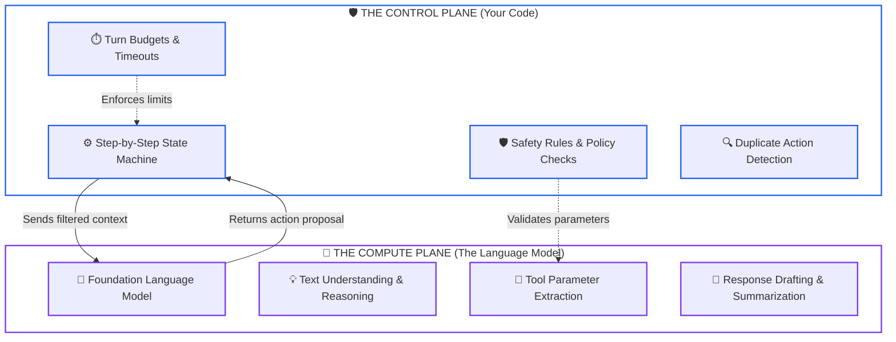
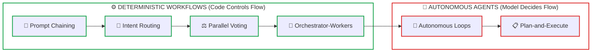
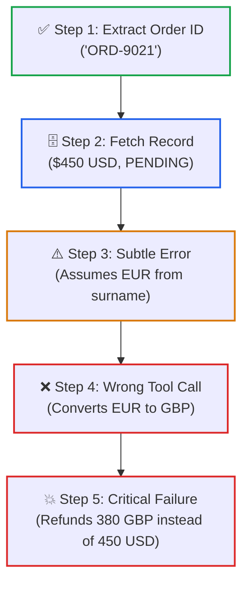
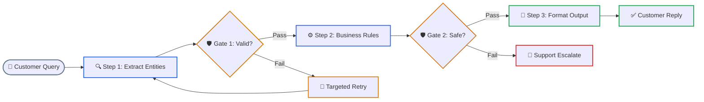
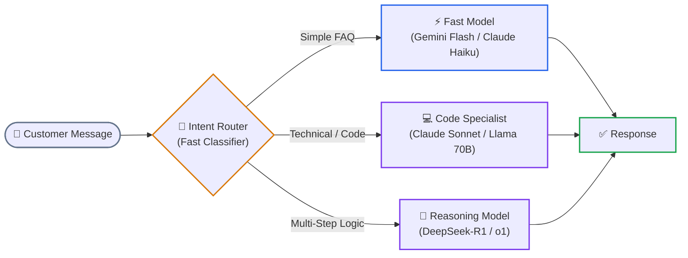
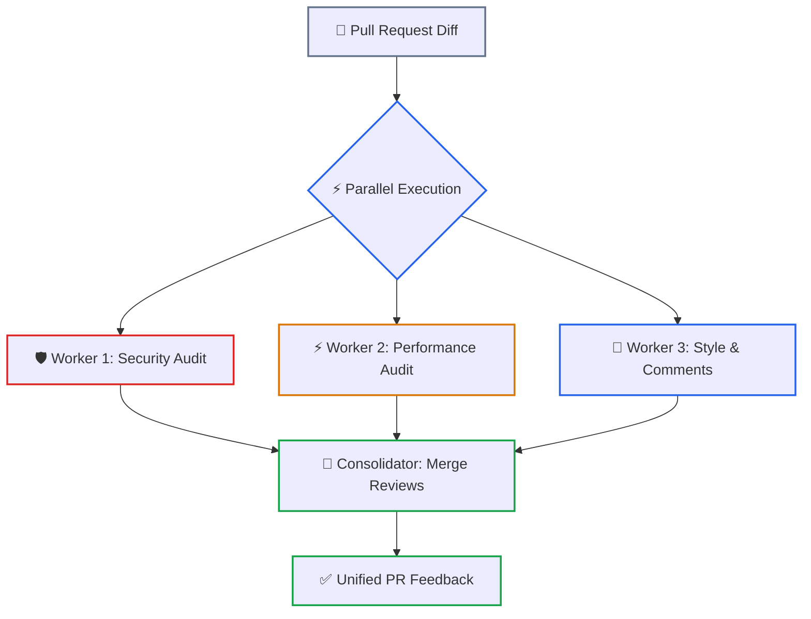
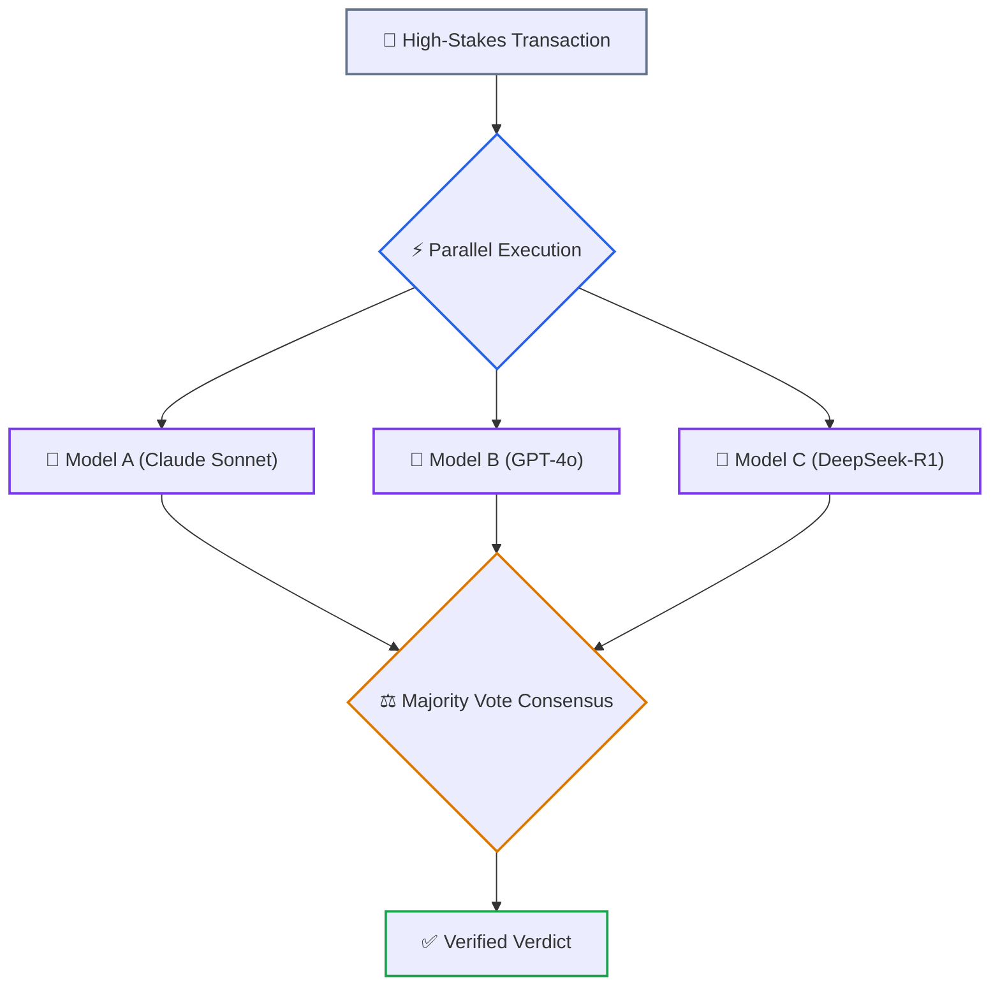
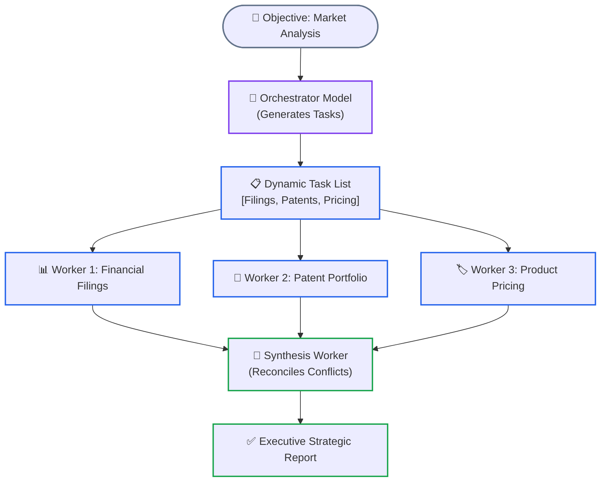
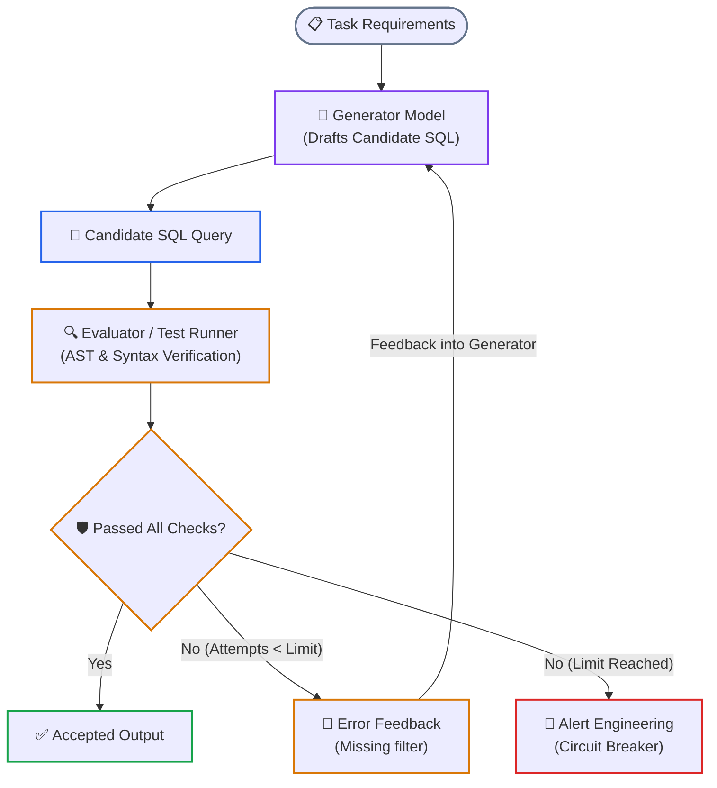

# Lesson 01: Workflows vs. Autonomous Agents & Orchestration Patterns

> **Tier**: `🟡 Engineering Depth` | Estimated Reading Time: 35 min
>
> **Prerequisites**: [Lesson 00: Agentic Systems Fundamentals](00-agentic-systems-and-control-plane-fundamentals.md), [Phase 01: Prompt & Context Engineering](../01-prompt-and-context-engineering/README.md), [Phase 03: Tools & Model Context Protocol](../03-tools-and-model-context-protocol/README.md)
>
> **Core Concept**: Autonomous AI systems exist on a spectrum. On one side are deterministic workflows—step-by-step pipelines directed by regular software code. On the other side are autonomous agents—where the language model itself chooses which tools to run and when to stop. For enterprise systems, reliability means keeping the control flow in code, using the language model as a reasoning engine, and guarding against compounding errors.
>
> **Term Ledger**:
> * **New AI terms introduced**: `Prompt Chaining`, `Routing Pattern`, `Parallel Voting`, `Orchestrator-Workers`, `Evaluator-Optimizer`.
> * **AI terms assumed from earlier lessons**: `AI Agent`, `Control Plane`, `Compute Plane`, `Prompt`, `Token`, `Context Window`, `Hallucination`, `Compounding Error Drift`.

---

## 1. The Real-World Problem: The Illusion of Autonomous Control

When you watch demonstrations of AI agents, they often look magical: an agent is given a vague goal, browses the web, queries a database, writes some code, and resolves an issue without human intervention.

In real-world software engineering, giving a language model full control over your application's logic quickly leads to failures:
* **Invented Parameters (Hallucination)**: The model guesses plausible but non-existent database IDs or API parameters.
* **Infinite Loops**: When an API returns an error, the model repeatedly calls it with slight variations, wasting money.
* **Cascading Errors**: A small mistake early on snowballs into a completely wrong action.
* **Runaway Costs**: Sending long conversation histories on every turn causes token costs to balloon.

To build reliable systems, we must separate the **Control Plane** (your code) from the **Compute Plane** (the model).



### How the Planes Work Together: Step-by-Step

1. **Separation of Concerns**: Your application code acts as the **Control Plane**. It maintains the master state, checks security rules, sets timeouts, and manages database connections. The language model acts as the **Compute Plane**—a specialized worker called to understand natural language or draft responses.
2. **Filtered Dispatch**: The control plane does not dump all application data into the prompt. It sends only the specific context and tool definitions needed for the immediate step.
3. **Structured Proposal**: The model processes the input and proposes an action (such as invoking an API or providing an answer) using a strongly typed schema.
4. **Validation Barrier**: Before any tool touches a production database, payment gateway, or file system, your application code inspects the proposed arguments to ensure they satisfy all safety and business rules.
5. **Enforced Boundaries**: If the model attempts an invalid action or exceeds its budget, your code catches the issue, halts the cycle, and either tries a fallback or alerts an engineer.

The core lesson: **Never let an AI model act as your control plane.** Your application code must direct the flow, enforce safety checks, and decide when to stop.

---

## 2. The Mental Model: The Spectrum of Agency

In their research guide, *"Building Effective Agents"*, Anthropic established a helpful mental model called the **Spectrum of Agency**. This framework categorizes AI systems by how much autonomy the model possesses:



### Understanding the Spectrum

1. **Deterministic Workflows (Left Side)**: Systems where the execution path is fixed in code. The developer writes the flowchart: step A runs, then step B, with clear branching rules (`if/else`). The language model is called only within discrete steps to handle text transformation, classification, or extraction.
2. **Autonomous Agents (Right Side)**: Systems where the model is given an overarching goal, a set of tools, and an execution loop. The model dynamically decides which tool to call next, evaluates intermediate observations, and determines when the task is complete.
3. **The Practical Rule**: As you move from left to right, systems become more flexible in open-ended domains, but they also become harder to test, more expensive, and prone to non-deterministic edge cases.

> [!NOTE]
> **Where this analogy breaks**: A spectrum implies a smooth slider. In production engineering, the shift from a deterministic workflow to an autonomous agent represents a step-function jump in non-determinism, failure risk, and operational cost.

### The Architectural Golden Rule

> **"Start with simple prompts. If that is not enough, add deterministic workflows in code. Reserve autonomous agents strictly for open-ended problem spaces where fixed code pathways cannot be anticipated."**

If your business task can be drawn as a flowchart—such as classifying incoming support tickets, extracting line items from invoices, or summarizing code pull requests—**you do not need an autonomous agent**. A deterministic workflow is faster, costs a fraction of the price, never gets stuck in infinite loops, and can be tested with standard unit tests.

Autonomous agents should be used when the steps cannot be predicted in advance, such as:
* Investigating an open-ended security alert across hundreds of unknown server logs.
* Iteratively writing, running, and fixing code across a complex multi-file codebase.
* Researching topics across the web where each discovery dictates the next search query.

---

## 3. The Math of Compounding Errors: Why Open Loops Drift

Why do unconstrained multi-step agents fail so often in production? The answer comes down to basic probability:

```text
Overall System Success = (Single Step Success Rate) ^ (Number of Steps)
```

Suppose each individual tool call has a very respectable **95% success rate** (meaning the model extracts the right parameters, calls the right tool, and interprets the result correctly 19 times out of 20).

If a task requires 10 sequential tool steps to finish, what is the probability of the entire sequence succeeding without error?

```text
Overall Success = 0.95 ^ 10 ≈ 59.9%
```

Even with 95% step accuracy, **over 40% of multi-step runs will derail or produce corrupted output**!

| Single-Step Accuracy | 1 Step (Turn 1) | 3 Steps (Turn 3) | 5 Steps (Turn 5) | 10 Steps (Turn 10) | 20 Steps (Turn 20) |
|:---:|:---:|:---:|:---:|:---:|:---:|
| **90.0%** (Basic Prompting) | 90.0% | 72.9% | 59.0% | 34.9% | 12.2% |
| **95.0%** (Typed Schemas) | 95.0% | 85.7% | 77.4% | **59.9%** | 35.8% |
| **98.0%** (Constrained Decoding) | 98.0% | 94.1% | 90.4% | 81.7% | 66.8% |
| **99.5%** (Code Workflow + Validation) | 99.5% | 98.5% | 97.5% | **95.1%** | 90.5% |

### How Errors Cascade Through a System



### Step-by-Step Error Cascade

1. **Steps 1 & 2**: The agent performs well. It extracts the order ID correctly and retrieves the record from the database.
2. **Step 3 (The Unchecked Assumption)**: The model makes a small erroneous inference—it assumes the order is in Euros because the customer's email domain is German.
3. **Step 4 (Compounding Drift)**: Step 4 accepts Step 3's output as fact and converts the assumed Euros to British Pounds.
4. **Step 5 (Production Failure)**: The agent issues an incorrect refund, triggering accounting discrepancies.

To eliminate this compounding drift, engineers insert **validation barriers** and **schema assertions** between steps. If step 3 produces data that fails validation, the system catches it immediately rather than letting bad assumptions propagate.

---

## 4. The 5 Core Workflow Patterns (Anthropic Taxonomy)

Anthropic categorizes deterministic AI architectures into five core patterns. These patterns solve most enterprise tasks without the risks of unconstrained agent loops.

### 4.1 Prompt Chaining: Sequential Pipelines with Validation Gates

Prompt chaining breaks a large task into a linear series of focused steps. Each step takes the output of the previous step as its input.



### Walkthrough
1. **Entity Extraction**: The first model call isolates parameters (names, account numbers) into typed fields.
2. **Schema Gate**: Application code validates the JSON payload. If invalid, it retries Step 1 directly without re-running the entire sequence.
3. **Business Rule Verification**: Step 2 evaluates business permissions and database constraints.
4. **Final Formatting**: Validated parameters pass to Step 3, which synthesizes a clean customer-facing response.

#### How Prompt Chaining Works

* **Narrow Cognitive Focus**: Models perform significantly better when given a single, specific task. Asking one prompt to extract data, check policies, run queries, and draft an email all at once leads to frequent errors.
* **Validation Gates**: Between steps, programmatic code verifies the output. If Step 1 returns invalid JSON, your code immediately retries Step 1 with targeted feedback without re-running the rest of the pipeline.
* **Context Efficiency**: Each step only receives the tokens it needs, avoiding prompt bloat and keeping token costs minimal.

### 4.2 Routing: Classifying to Specialized Models and Prompts

Routing uses a fast, low-cost classifier to inspect the incoming request and direct it to the most suitable handler.



### Walkthrough
1. **Ingestion & Classification**: The incoming prompt is evaluated by a lightweight router model within 100 milliseconds.
2. **Dynamic Dispatch**: Based on intent and complexity, the query routes to an appropriate model tier.
3. **Execution & Return**: The specialized model answers using a domain-specific system prompt, avoiding bloated universal instructions.

#### How Routing Works

* **Cost and Latency Optimization**: Most customer questions do not need expensive reasoning models. Routing simple queries to sub-second models cuts costs by up to 80% and delivers rapid response times.
* **Clean System Prompts**: Routing directs the user to a lean, 400-token prompt specifically crafted for that topic. This eliminates massive 6,000-token system prompts attempting to cover billing, tech support, and refunds simultaneously.

### 4.3 Parallelization: Sectioning and Consensus Voting

Parallelization runs multiple calls concurrently using two distinct methods:

#### Method 1: Sectioning (Task Splitting)



### Walkthrough
1. **Fan-Out**: A single code change diff is simultaneously dispatched to three independent specialized prompts.
2. **Concurrent Evaluation**: Security, performance, and formatting run in parallel via `asyncio.gather`.
3. **Consolidation**: The reducer merges independent findings into one coherent review, with latency bounded by the single slowest worker.

#### Method 2: Consensus Voting



### Walkthrough
1. **Redundant Dispatch**: High-stakes inputs (e.g. wire transfer authorizations) are sent to three distinct model providers.
2. **Independent Scoring**: Each model reaches a verdict in isolation without seeing peer outputs.
3. **Majority Arbitration**: Deterministic code checks for consensus. If models disagree, the request escalates to human review.

#### How Parallelization Works

* **Sectioning (Task Splitting)**: Splitting reviews into independent dimensions allows asynchronous execution. Total turnaround time is limited only by the single slowest check, rather than waiting for them sequentially.
* **Consensus Voting**: For high-stakes decisions where an error has severe business impact, multiple models evaluate the same item. The system selects the majority decision, catching edge cases where a single model might hallucinate.

### 4.4 Orchestrator-Workers: Dynamic Subtask Decomposition

In the Orchestrator-Workers pattern, a central planner model looks at the user's objective, decides which subtasks are needed, assigns those subtasks to worker models, and summarizes the results.



### Walkthrough
1. **Dynamic Task Decomposition**: An orchestrator LLM analyzes a complex objective and emits a dynamic task queue.
2. **Worker Dispatch**: Distinct worker models receive scoped prompts targeting their assigned subtasks in parallel.
3. **Synthesis**: A final aggregator LLM gathers all worker outputs, reconciles contradictions, and formats the executive deliverable.

#### How Orchestrator-Workers Differs from Fixed Parallelization

* In **Sectioning**, the developer hardcodes the exact tasks in advance (Worker 1 always does security, Worker 2 always does performance).
* In **Orchestrator-Workers**, the orchestrator model **decides at runtime which tasks are needed** based on the prompt. For one company, it might research patents and financial filings; for another, it might examine developer documentation and open-source repositories.

### 4.5 Evaluator-Optimizer: Self-Correcting Feedback Loops

The Evaluator-Optimizer pattern pairs two models: a **Generator** that creates a candidate answer and an **Evaluator** that checks the work against clear criteria or runs automated tests.



### Walkthrough
1. **Candidate Generation**: The generator creates an initial solution based on task requirements.
2. **Automated Verification**: An evaluator (such as an AST parser, unit test runner, or critic LLM) verifies the solution.
3. **Iterative Refinement**: If checks fail and turn limits remain, targeted feedback is piped back to the generator.
4. **Circuit Breaker**: If attempts hit the maximum retry threshold, execution terminates and alerts engineering.

#### How Evaluator-Optimizer Works

* **Objective Verification**: The evaluator checks the candidate against explicit rules. Wherever possible, use deterministic software tools (such as linters, compiler checks, or SQL syntax checkers) alongside or instead of an LLM evaluator.
* **Targeted Feedback**: If the candidate fails, the evaluator generates specific, actionable feedback (e.g., *"Line 4 is missing a table alias"*), and the generator tries again.
* **Hard Iteration Limits**: To avoid infinite loops, the system enforces a strict ceiling (e.g., maximum 3 attempts). If the candidate still fails after 3 tries, the system gracefully escalates to a human engineer.

---

## 5. Production Implementation: A Resilient Workflow Engine in Python

Here is a complete, runnable Python 3.12+ implementation demonstrating a resilient workflow combining **Routing**, **Prompt Chaining**, and an **Evaluator-Optimizer Loop** using typed Pydantic v2 schemas:

```python
"""
Enterprise Deterministic Workflow Engine
Implements: Semantic Router -> Pipeline Chaining -> Evaluator-Optimizer Loop
Tech Stack: Python 3.12+, Pydantic v2, Typed Schemas, Circuit Breakers
"""

from __future__ import annotations

import asyncio
from dataclasses import dataclass, field
from enum import StrEnum
from typing import Any, Dict, List, Optional
from pydantic import BaseModel, Field


# ============================================================================
# 1. TYPED DATA SCHEMAS
# ============================================================================

class TaskDomain(StrEnum):
    BILLING_DISPUTE = "BILLING_DISPUTE"
    TECHNICAL_SUPPORT = "TECHNICAL_SUPPORT"
    GENERAL_INQUIRY = "GENERAL_INQUIRY"


class SupportTicket(BaseModel):
    ticket_id: str = Field(description="Unique tracking identifier")
    customer_id: str
    message: str = Field(min_length=10, description="Customer request text")


class RoutingDecision(BaseModel):
    domain: TaskDomain
    confidence: float = Field(ge=0.0, le=1.0)
    routing_reason: str


class ExtractedBillingClaim(BaseModel):
    claim_id: str
    invoice_number: str
    disputed_amount: float = Field(gt=0.0)
    dispute_reason: str


class EvaluationResult(BaseModel):
    passed: bool
    score: float = Field(ge=0.0, le=1.0)
    issues_found: List[str] = Field(default_factory=list)
    actionable_feedback: Optional[str] = None


# ============================================================================
# 2. DETERMINISTIC WORKFLOW ORCHESTRATOR
# ============================================================================

@dataclass
class WorkflowState:
    ticket: SupportTicket
    routing: Optional[RoutingDecision] = None
    extracted_claim: Optional[ExtractedBillingClaim] = None
    draft_response: Optional[str] = None
    evaluation_history: List[EvaluationResult] = field(default_factory=list)
    attempts: int = 0
    max_attempts: int = 3
    is_complete: bool = False


class ResilientSupportWorkflow:
    """
    Executes a structured customer support workflow.
    Control flow is governed by code, with strict safety checks.
    """

    async def process_ticket(self, ticket: SupportTicket) -> Dict[str, Any]:
        state = WorkflowState(ticket=ticket)

        # STAGE 1: ROUTING PATTERN
        state.routing = await self._route_ticket(ticket)
        print(f"[Workflow] Routed to: {state.routing.domain.value} (Confidence: {state.routing.confidence:.2f})")

        # STAGE 2: CONDITIONAL EXECUTION
        if state.routing.domain == TaskDomain.BILLING_DISPUTE:
            return await self._run_billing_pipeline(state)
        else:
            return {"status": "FORWARDED_TO_QUEUE", "domain": state.routing.domain.value}

    async def _route_ticket(self, ticket: SupportTicket) -> RoutingDecision:
        """Lightweight routing classification."""
        text = ticket.message.lower()
        if "invoice" in text or "charge" in text or "refund" in text:
            return RoutingDecision(
                domain=TaskDomain.BILLING_DISPUTE,
                confidence=0.97,
                routing_reason="Customer mentioned charges and invoices.",
            )
        elif "error" in text or "crash" in text or "timeout" in text:
            return RoutingDecision(
                domain=TaskDomain.TECHNICAL_SUPPORT,
                confidence=0.92,
                routing_reason="Customer reported technical error signals.",
            )
        return RoutingDecision(
            domain=TaskDomain.GENERAL_INQUIRY,
            confidence=0.85,
            routing_reason="General inquiry or question.",
        )

    async def _run_billing_pipeline(self, state: WorkflowState) -> Dict[str, Any]:
        """Runs prompt chaining and self-correcting evaluation."""
        
        # Step 1 of Chain: Extraction with validation
        state.extracted_claim = ExtractedBillingClaim(
            claim_id=f"CLM-{state.ticket.ticket_id[:6]}",
            invoice_number="INV-2026-8819",
            disputed_amount=249.50,
            dispute_reason="Duplicate subscription fee charge",
        )

        # Step 2: Evaluator-Optimizer Loop for customer email draft
        while state.attempts < state.max_attempts:
            state.attempts += 1
            feedback = (
                state.evaluation_history[-1].actionable_feedback
                if state.evaluation_history
                else None
            )

            # Generator drafts response
            draft = await self._draft_email(state.extracted_claim, feedback)

            # Evaluator verifies against company policy
            eval_result = self._evaluate_email_draft(draft, state.extracted_claim)
            state.evaluation_history.append(eval_result)

            if eval_result.passed:
                state.draft_response = draft
                state.is_complete = True
                break

        if not state.is_complete:
            return {
                "status": "ESCALATED_TO_HUMAN",
                "reason": "Email draft could not satisfy quality checks after 3 attempts.",
                "issues": state.evaluation_history[-1].issues_found,
            }

        return {
            "status": "SUCCESS",
            "claim_id": state.extracted_claim.claim_id,
            "final_email": state.draft_response,
            "revision_cycles": state.attempts,
        }

    async def _draft_email(
        self, claim: ExtractedBillingClaim, previous_feedback: Optional[str]
    ) -> str:
        """Simulates drafting and revising an email based on feedback."""
        if previous_feedback is None:
            # First attempt: Missing required timeline information
            return (
                f"Hello, we received your dispute for invoice {claim.invoice_number} "
                f"in the amount of ${claim.disputed_amount:.2f}. Your refund is approved."
            )
        else:
            # Revised attempt: Fixes the missing timeline
            return (
                f"Hello, regarding invoice {claim.invoice_number} for ${claim.disputed_amount:.2f}: "
                f"We verified the duplicate fee and processed your refund. "
                f"Funds will reflect in your account within 3 to 5 business days. "
                f"Claim reference: {claim.claim_id}."
            )

    def _evaluate_email_draft(
        self, draft: str, claim: ExtractedBillingClaim
    ) -> EvaluationResult:
        """Deterministic policy validation without subjective guesswork."""
        issues = []
        if str(claim.disputed_amount) not in draft:
            issues.append("Missing exact numerical refund amount.")
        if claim.invoice_number not in draft:
            issues.append("Missing reference invoice number.")
        if "business days" not in draft.lower():
            issues.append("Missing mandatory expected timeline for funds availability.")

        if issues:
            return EvaluationResult(
                passed=False,
                score=0.5,
                issues_found=issues,
                actionable_feedback="; ".join(issues),
            )
        return EvaluationResult(passed=True, score=1.0)


# ============================================================================
# 3. VERIFICATION RUNNER
# ============================================================================

async def main() -> None:
    ticket = SupportTicket(
        ticket_id="TCK-99014",
        customer_id="CUST-3811",
        message="I was billed twice on invoice INV-2026-8819 for $249.50. Please refund.",
    )

    workflow = ResilientSupportWorkflow()
    result = await workflow.process_ticket(ticket)

    import json
    print("\n=== Workflow Execution Result ===")
    print(json.dumps(result, indent=2))


if __name__ == "__main__":
    asyncio.run(main())
```

---

## 6. Architectural Trade-offs: Workflows vs. Agents

Before building an autonomous agent, compare your project requirements against this decision matrix:

| Architectural Dimension | Deterministic Workflows (Chaining, Routing, Parallel) | Autonomous Agents (Dynamic Reasoning Loops) |
|---|---|---|
| **Execution Path Predictability** | **High (~99%)**: Every step and branch is defined in software code. | **Variable (~60–80% over 10 steps)**: The model chooses its own tools dynamically. |
| **Cost Predictability** | **Fixed**: Known number of model calls per request. | **Variable**: Turn count varies based on task complexity; needs strict token caps. |
| **Latency** | **Fast (200ms – 2s)**: Steps can be parallelized; no intermediate reasoning pauses. | **Higher (5s – 60s+)**: Multi-turn reasoning loops require sequential network round-trips. |
| **Ease of Debugging** | **Straightforward**: Standard stack traces, repeatable unit tests, and mockable fixtures. | **More Complex**: Requires inspecting multi-turn reasoning logs and token traces. |
| **Testing in CI/CD** | **Simple**: Deterministic assertion suites run in automated pipelines without live API costs. | **Requires Evaluation Datasets**: Needs statistical benchmarking and automated grading checks. |
| **Primary Failure Modes** | Schema validation errors, external API timeouts, misclassified routes. | Infinite tool loops, parameter hallucinations, losing focus on the original goal. |
| **Best Production Fit** | Structured extraction, customer triage, code linting, standard business forms. | Open-ended code refactoring, incident root-cause investigations, dynamic research. |

---

## 7. Production Failure Modes & Invariant Defenses

When deploying workflows to production, enforce these defensive software practices:

### Failure Mode 1: Compounding Hallucination Drift
* **The Cause**: Step 1 outputs a slightly inaccurate assumption. Step 2 treats it as verified fact and calls an external API with bad parameters.
* **The Defense**: **Typed Schema Barriers**. Never pass loose natural language strings between steps. Every step must emit a validated Pydantic model. If validation fails, intercept the transaction immediately.

### Failure Mode 2: Unbounded Evaluation Loops
* **The Cause**: In an Evaluator-Optimizer loop, the generator repeatedly fails to satisfy a contradictory or overly strict evaluation rubric, looping endlessly.
* **The Defense**: **Hard Iteration Ceilings**. Enforce a maximum attempt limit (e.g., `max_attempts = 3`). If the candidate fails after 3 tries, gracefully exit and escalate to an on-call engineer.

### Failure Mode 3: Misclassified Routing
* **The Cause**: An ambiguous prompt contains keywords from multiple domains, leading to an incorrect branch.
* **The Defense**: **Confidence Scoring with Default Fallbacks**. If the router's confidence falls below `0.85`, send the request to a default general triage queue with human review flags.

---

## 8. Quick Check

A payment processing platform needs to extract line items and tax totals from vendor invoice PDFs. A junior developer proposes an autonomous ReAct agent with unrestricted shell access to iteratively OCR and parse the documents.

Which orchestration pattern should the senior architect mandate instead, and why?

<details>
<summary>View Answer</summary>

**Recommended Pattern**: **Prompt Chaining** with typed Pydantic validation gates (or an **Orchestrator-Workers** workflow if multiple invoice pages are processed in parallel).

**Engineering Rationale**: Invoice parsing is a structured, bounded business process with a predictable flowchart. An autonomous agent introduces compounding error drift, variable latency (10s+ vs <1s), and severe security risks from unrestricted shell execution. A deterministic Prompt Chain enforces typed extraction schemas, isolated retries on failure, and predictable sub-second latency.
</details>

---

## 9. Key Takeaways & Summary

* **Keep the Control Plane in Code**: Let your application code manage flow, state, retries, and permissions. Use the language model as a reasoning worker, not the system manager.
* **Compounding Errors Compound Fast**: A 95% single-step accuracy results in only ~60% success across 10 steps (0.95^10 ≈ 59.9%). Unchecked open loops quickly drift off course.
* **Master Workflows First**: Prompt Chaining, Routing, Parallelization, Orchestrator-Workers, and Evaluator-Optimizer solve most business problems with lower cost, lower latency, and zero infinite loops.
* **Save Agents for Open-Ended Tasks**: Reserve autonomous agent loops for situations where the execution path genuinely cannot be planned in advance.

---

## 🧭 Navigation

* **Previous Lesson**: [← Lesson 00: Agentic Systems Fundamentals & Control Plane Architecture](00-agentic-systems-and-control-plane-fundamentals.md)
* **Phase 04 Hub**: [Phase 04 Overview](README.md)
* **Next Lesson**: [Lesson 02: Autonomous ReAct Loops & Execution Governors →](02-react-loops-and-execution-governors.md)
* **Capstone Lab**: [Capstone Challenge: Code Review Agent Engine](labs/capstone-code-review-engine.md)
