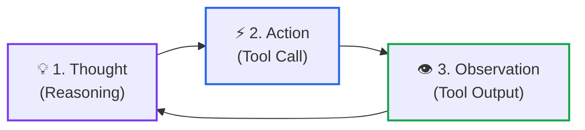
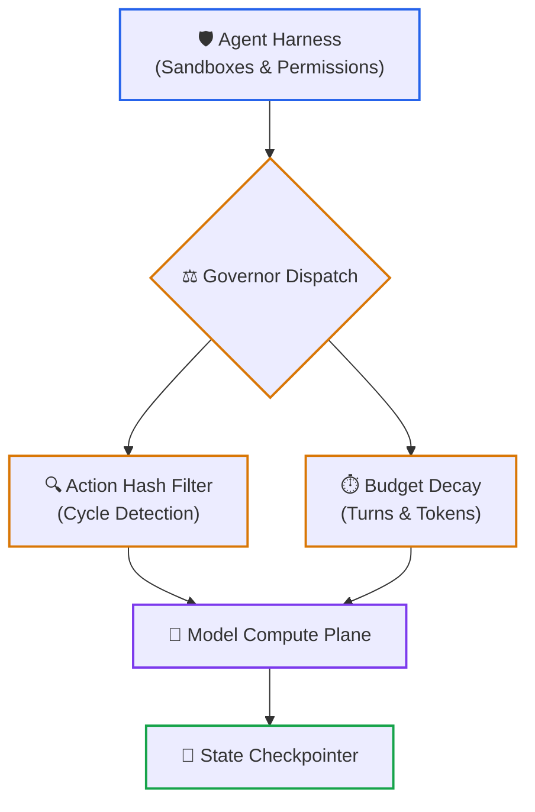
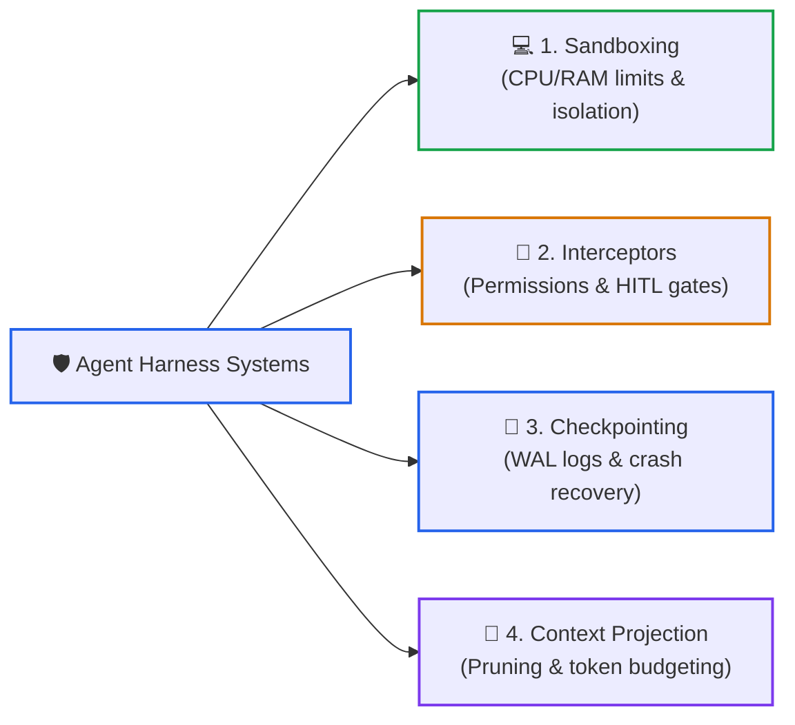
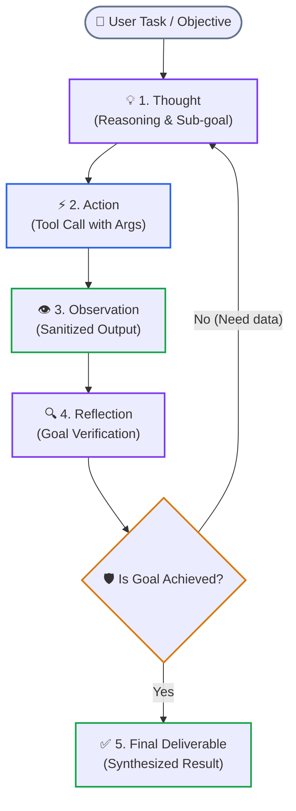
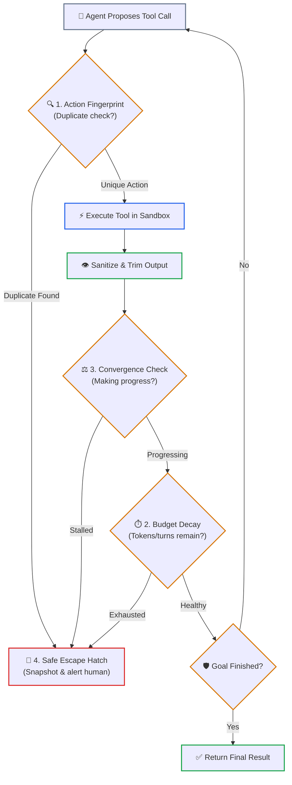

# Lesson 02: Autonomous ReAct Loops & Execution Governors

> **Tier**: `🟡 Engineering Depth` | Estimated Reading Time: 35 min
>
> **Prerequisites**: [Lesson 00: Agentic Systems Fundamentals](00-agentic-systems-and-control-plane-fundamentals.md), [Lesson 01: Workflows vs. Autonomous Agents](01-workflows-vs-agents-and-orchestration-patterns.md), [Phase 03: Tools & Model Context Protocol](../03-tools-and-model-context-protocol/README.md)
>
> **Core Concept**: Autonomous agents rely on two complementary pillars: the Harness (the operational runtime, sandboxes, and permission tiers wrapping the model) and Loop Engineering (recursive reasoning cycles that prevent infinite loops, detect stalled progress, and guarantee convergence). Without both, an agent is an unconstrained while-loop that burns through API budgets.
>
> **Term Ledger**:
> * **New AI terms introduced**: `ReAct Pattern`, `Harness Engineering`, `Loop Engineering`, `Execution Governor`, `Action Hashing`, `Budget Decay`, `Ping-Pong Cycle`.
> * **AI terms assumed from earlier lessons**: `AI Agent`, `Control Plane`, `Compute Plane`, `Prompt`, `Token`, `Context Window`, `Function Calling`, `Tool Schema`.

---

## 1. The Core Problem: The Ungoverned Loop Trap

In many beginner tutorials, an autonomous agent is built using a simple while-loop:

```python
# Illustrative anti-pattern: An ungoverned while loop
task_finished = True  # In production, this flag depends on model output
messages: list[dict[str, str]] = []
tools: list[str] = []

while not task_finished:
    # An ungoverned loop continues until budget or context is exhausted
    break
```

In production, this naive loop causes severe outages:
* **Failing Retries**: When an external service returns an error, the model rephrases slightly and repeats the failing action indefinitely.
* **Context Saturation**: Accumulated messages inflate token costs and slow down inference, diluting the original prompt instructions.
* **Unguarded Mutations**: Unconstrained loops can duplicate database writes or payment authorizations before engineers notice.

To build agents that run safely in production, we need two engineering disciplines:
1. **Harness Engineering**: The protective environment and safety mechanisms that wrap around the model.
2. **Loop Engineering**: The structured design of the iterative cycle itself to ensure the agent makes progress and terminates cleanly.

### The ReAct Cycle



### Walkthrough: The ReAct Cycle
1. **Thought**: The model evaluates current context and decides its next strategic step.
2. **Action**: The model outputs a typed tool call with specific arguments.
3. **Observation**: The external environment executes the tool and returns output data.
4. **Re-evaluation**: The observation is appended to context, driving the next iteration.

### The Governed Agent Architecture



### Walkthrough: The Governed Agent Architecture
1. **Harness Boundary**: Tool executions pass through sandboxes and permission gates.
2. **Governor Dispatch**: Incoming action requests are inspected by execution governors.
3. **Action Hash & Budget Gates**: Duplicate calls and budget overruns are caught before hitting external APIs.
4. **Model Execution & Checkpoint**: Approved steps run through the model and persist to the state log.

---

## 2. Deep Dive: Harness Engineering (The Operational Armor)

In construction, workers cleaning windows on a skyscraper use two different pieces of equipment:
* **The Scaffold**: The catwalk, pulleys, and structural railings that allow workers to move along the building.
* **The Harness**: The heavy-duty fall-arrest harness, carabiners, and safety lifelines clipped to an independent cable. If the catwalk shudders or a cable snaps, the harness catches the worker and prevents a fatal fall.

In software:
* **The Scaffold** is your graph topology, node definitions, routing edges, and message queues (for example, LangGraph nodes or custom event routers). It defines *how data moves*.
* **The Harness** is your sandbox, memory ceiling, duplicate action detector, timeout token, and database rollback coordinator. It defines *how safety and limits are enforced*.

> **The Scaffold Fallacy**:
> Engineering teams often spend weeks debating which agent framework to use (switching between LangChain, CrewAI, AutoGen, and LangGraph) while completely neglecting the harness. When their agent burns through $1,000 in an hour or loops on a failing database write, they blame "model hallucinations." The model did not fail—their system lacked a safety harness.

> [!NOTE]
> **Where this analogy breaks**: A physical window washer's harness is passive hardware that arrests a fall via gravity and tension. An AI software harness is an active software control plane that must continuously intercept, parse, sanitize, and validate every inbound token stream and outbound API call.

### The 4 Core Systems of an Agent Harness



### Walkthrough: Harness Subsystems
1. **Execution Sandboxing**: Runs unvetted tools inside isolated processes with strict CPU, memory, and timeout caps.
2. **Safety Interceptors**: Divides tools into read vs write tiers and blocks high-risk mutations without human authorization.
3. **Checkpointing & State**: Maintains Write-Ahead Logs to allow session resumption and rollback after system crashes.
4. **Context Projection**: Compresses and cleans large tool payloads to prevent context window saturation.

#### 1. Execution Sandboxing and Resource Limits
Never execute model-generated scripts or unvetted tools directly in your main application process. A production harness enforces:
* **Process Isolation**: Spawning tool actions in separate subprocesses or isolated containers (such as Google gVisor or minimal micro-virtual machines).
* **Hard Timeouts**: Using asynchronous cancellation tokens (for example, 10-second limits per tool execution) so a hanging network request cannot stall the entire system.
* **Resource Ceilings**: Limiting memory (e.g., 512MB maximum) and process counts to prevent accidental resource exhaustion.

#### 2. Safety Interceptors and Human Approval Gates
Not all tools carry the same risk. A robust harness establishes two distinct privilege tiers:
* **Read-Only Tier**: Inspecting records, querying indexes, reading files. These can execute automatically.
* **State-Mutating Tier**: Charging credit cards, updating production databases, deleting files. The harness intercepts these calls, pauses execution, and sends an approval request to a human operator before proceeding.

#### 3. Checkpointing and State Persistence
If a container restarts or an approval takes four hours, the agent must not lose its progress. The harness saves a snapshot of the session state to a durable database (such as PostgreSQL or SQLite) before and after every action.

#### 4. Observation Cleaning and Context Projection
When an external API returns a large 20-page JSON payload, feeding that entire payload into the prompt context wastes tokens and causes the model to lose focus. The harness cleans the payload:
* Stripping out tracking metadata and null values.
* Limiting array results to the top 5 relevant items.
* Replacing outputs older than 2 turns with a simple reference pointer (such as `[Output saved in record #9021]`), fetching full details only if specifically requested.

---

## 3. Deep Dive: Loop Engineering (Governing Autonomous Iterations)

### What is Loop Engineering?

> **Loop Engineering** is the deliberate design of recursive **Perceive → Plan → Act → Observe → Reflect** cycles. It ensures that an autonomous agent converges on an accurate result, avoids repetitive deadlocks, stays within budget limits, and gracefully escalates to humans when stuck.

### The Foundation: The ReAct Cycle

Formalized by Yao et al. (2022), the **ReAct (Reasoning + Acting)** pattern combines natural language deliberation with structured tool actions:



### Walkthrough: ReAct Reasoning Loop
1. **Thought**: The model evaluates current context and formulates a specific sub-goal.
2. **Action**: The model emits a structured tool call with typed parameters.
3. **Observation**: The harness executes the tool in an isolated sandbox and returns sanitized results.
4. **Reflection**: The model checks if the observation satisfies the goal or requires further iteration.

#### Why ReAct Outperforms Simple Approaches

* **Pure Reasoning**: Without tools, models hallucinate when encountering missing data.
* **Pure Action**: Calling tools without intermediate reasoning prevents error diagnosis and multi-step planning.
* **The ReAct Combination**: Reasoning guides tool selection; observations ground reasoning in real data.

### Overcoming Short-Sighted Drift: Plan-and-Execute

While simple ReAct works well for 2 to 4 turns, it often drifts off course on complex tasks with 10+ turns. Because ReAct decides each step based only on the immediate observation, it can easily wander down unproductive paths.

To prevent this, production systems decouple planning from execution:
1. **The Planner**: A high-level prompt breaks the goal into a small list of concrete milestones with clear success criteria.
2. **The Executor**: An agent focused entirely on completing the active milestone. It cannot change the overall roadmap.
3. **The Verifier**: A separate check that confirms whether the milestone criteria were actually satisfied before moving to the next item.

### The Real-World War Story: The 2:14 AM Vault Meltdown

To understand why loop governance is essential, consider this real-world production incident:

> *"It is 2:14 AM on a Sunday. PagerDuty alerts go off across the engineering team. An automated incident-response agent deployed to inspect a failing Kubernetes worker node encountered a permissions issue: the corporate secrets vault returned an HTTP 403 `PermissionDenied` error on a credential lookup.*
>
> *The agent's system prompt had been written with great enthusiasm: 'You are an elite reliability engineer. Be thorough, explore all possibilities, and resolve the issue autonomously.'*
>
> *So the agent was thorough. It reasoned: 'Perhaps the secret path needs a trailing slash.' Failed with 403. 'Perhaps I should query the vault using the raw REST API.' Failed with 403. 'Perhaps I should base64-encode the token parameter.' Failed with 403. 'Perhaps I should test every path under /v1/secret/.'*
>
> *By 2:45 AM, the agent had executed **240 autonomous loop cycles**, consumed **38 million tokens**, generated **$570 in API charges**, and flooded the internal secrets vault with **950 requests per second**—tripping enterprise rate limiters and locking human engineers out of the system!"*

With loop governance, Turn 3 would detect the repetitive failure. The governor applies budget decay, halts the cycle, and escalates to an on-call engineer within 45 seconds at a cost of $0.04.

---

## 4. The 4 Pillars of Loop Governance

To prevent infinite loops, deadlocks, and runaway costs, a production agent runtime implements four deterministic controls:



### Walkthrough: Loop Governance Execution Flow
1. **Action Fingerprinting**: Computes a SHA-256 hash of tool name and canonical arguments. If repeated, execution halts.
2. **Tool Execution**: Approved actions run inside the sandboxed harness.
3. **Convergence Check**: Evaluates whether the model is making measurable progress towards the target objective.
4. **Budget Decay**: Verifies remaining turn and token allotments before authorizing another reasoning iteration.
5. **Escape Routing**: Stalled or exhausted runs route cleanly to safe exit routines rather than throwing unhandled exceptions.

### 1. Action Fingerprinting (Detecting Duplicate Tool Calls)
When a tool fails, models tend to retry the exact same tool call with trivial cosmetic changes. To prevent this, the runtime calculates a cryptographic hash of the tool name and its sorted parameters:

```text
ActionHash = SHA256( tool_name + "::" + CanonicalJSON(sorted_parameters) )
```

The runtime maintains a sliding-window buffer of the last 4 tool calls. If the incoming action matches an action already in the buffer and the external environment has not changed:
* The execution is **blocked immediately** without hitting the network.
* The runtime injects an explicit error: `"You already attempted this exact tool call with identical parameters and it failed. You are prohibited from repeating it. Please formulate an alternative strategy."`

### 2. Progressive Budget Decay
Agents given a flat budget of 10 turns often spend turns 1 through 7 wandering through exploratory queries, only to run out of turns before writing down the final answer.

**Progressive Budget Decay** dynamically tightens runtime parameters as the remaining budget decreases.

> **What is Temperature?** Temperature is a model configuration parameter that controls output randomness. At temperature `0.0`, the model always picks the single most probable next token (fully deterministic output). At temperature `1.0`, it samples from a wider probability distribution, producing more varied but less predictable outputs. Lowering temperature forces the agent toward safer, more focused responses as it approaches its budget limit.

| Budget Phase | Turns Remaining | Model Temperature | Available Tooling | System Guidance |
|---|:---:|:---:|---|---|
| **Phase 1: Exploration** | Turns 1 – 3 | `0.6` | All read tools available | *"Explore broadly. Formulate testable hypotheses."* |
| **Phase 2: Convergence** | Turns 4 – 6 | `0.3` | Targeted inspection tools only | *"Focus on validating your primary hypothesis. Do not branch."* |
| **Phase 3: Finalization** | Turns 7 – 8 | `0.1` | Mutating tools disabled | *"Budget 80% spent. Synthesize verified findings into final answer."* |
| **Phase 4: Emergency Stop** | Turn 9+ | `0.0` | Zero tools allowed | *"Budget exhausted. Summarize current findings immediately."* |

### 3. Convergence Monitoring (Detecting Thought Stalls)
An agent can avoid exact duplicate tool calls while still producing semantically equivalent queries that make no real progress—for example, searching for "error in pod", then "pod error log", then "pod crash trace".

To catch this, the runtime measures whether the agent is actually moving closer to the goal:
* **Semantic Similarity**: The runtime compares the vector embedding of the current "Thought" against the previous turn's thought. If similarity exceeds `0.94` across three consecutive turns, the model is simply repeating the same reasoning in different words.
* **Milestone Progress**: If the planner maintains an ordered list of tasks and zero tasks have transitioned to completed after 3 tool turns, the system flags a stall.

### 4. Safe Escape Hatch Synthesis
When a limit is reached or a loop is detected, a poorly designed system crashes with a stack trace. A properly engineered system executes a **Safe Escape Hatch**:
1. Suppresses the unhandled exception.
2. Injects a structured fallback prompt into the context:
   ```text
   [SYSTEM NOTICE: EXECUTION HALTED BY SAFETY GOVERNOR]
   Reason: Duplicate action cycle detected on tool 'query_vault'.
   Instruction: Synthesize an immediate Partial Deliverable containing:
   1. Confirmed Facts: What has been definitively verified so far.
   2. Blockers: What specific assumption or dependency failed.
   3. Next Steps: Exact actions required by a human engineer.
   ```
3. Saves the session to durable storage and alerts an on-call engineer with full tracing identifiers.

---

## 5. Reasoning Models and Tool Stacks in Autonomous Loops

Reasoning models with test-time compute (such as o1, o3, Grok-3 Thinking) change loop dynamics:
* **Latency Trade-offs**: Generating internal reasoning tokens before every tool invocation adds 15–30 seconds per turn. Reserve reasoning models for high-level plan decomposition, and route standard tool extraction to low-latency models.
* **Standardized Tool Engines**: Tool execution runtimes (like Meta Llama Stack and PydanticAI) standardize security checks, running guardrails on tool arguments before dispatch.

---

## 6. Production Implementation: A Governed Agent Harness and Loop Engine

Below is a complete, production-grade Python 3.12+ implementation demonstrating an **Agent Harness** coupled with an **Execution Governor** that enforces action fingerprinting, progressive budget decay, and escape hatch synthesis:

```python
"""
Production Agent Harness and Execution Governor
Implements: SHA-256 Action Hashing, Sliding-Window Cycle Detection,
Progressive Budget Decay, and Safe Escape Hatch Synthesis.
Tech Stack: Python 3.12+, Pydantic v2, Typed Schemas
"""

from __future__ import annotations

import hashlib
import json
from collections import deque
from dataclasses import dataclass
from enum import StrEnum
from typing import Any, Dict, List, Optional
from pydantic import BaseModel, Field


# ============================================================================
# 1. DATA MODELS & STATUS SCHEMAS
# ============================================================================

class LoopPhase(StrEnum):
    EXPLORATION = "EXPLORATION"
    CONVERGENCE = "CONVERGENCE"
    FINALIZATION = "FINALIZATION"
    EMERGENCY_STOP = "EMERGENCY_STOP"


class GovernorStatus(StrEnum):
    ACTIVE = "ACTIVE"
    CYCLE_DETECTED = "CYCLE_DETECTED"
    BUDGET_EXHAUSTED = "BUDGET_EXHAUSTED"
    COMPLETED = "COMPLETED"


class CycleDetectedException(Exception):
    """Raised when an agent attempts an identical action within the sliding window."""
    def __init__(self, tool_name: str, action_hash: str):
        super().__init__(
            f"Cycle detected! Tool '{tool_name}' was called with identical arguments "
            f"(hash: {action_hash[:8]}). Repeating identical failed calls is prohibited."
        )
        self.tool_name = tool_name
        self.action_hash = action_hash


class PartialDeliverable(BaseModel):
    ticket_id: str
    status: GovernorStatus
    confirmed_facts: List[str]
    blockers: List[str]
    recommended_human_actions: List[str]
    estimated_cost_usd: float


# ============================================================================
# 2. THE EXECUTION GOVERNOR & HARNESS
# ============================================================================

@dataclass
class GovernorConfig:
    max_turns: int = 8
    max_tokens: int = 40_000
    history_window_size: int = 4
    cost_per_1k_input: float = 0.003
    cost_per_1k_output: float = 0.015


class ExecutionGovernor:
    """
    Supervises the execution loop to enforce safety and prevent infinite cycles.
    """

    def __init__(self, ticket_id: str, config: Optional[GovernorConfig] = None) -> None:
        self.ticket_id = ticket_id
        self.config = config or GovernorConfig()
        self.current_turn = 0
        self.total_tokens_used = 0
        self.accumulated_cost_usd = 0.0
        self.action_history: deque[str] = deque(maxlen=self.config.history_window_size)
        self.confirmed_facts: List[str] = []
        self.status = GovernorStatus.ACTIVE

    # ------------------------------------------------------------------------
    # CONTROL 1: ACTION FINGERPRINTING & CYCLE DETECTION
    # ------------------------------------------------------------------------
    def generate_fingerprint(self, tool_name: str, arguments: Dict[str, Any]) -> str:
        """Computes a canonical SHA-256 hash of the tool name and sorted arguments."""
        canonical_json = json.dumps(
            {"tool": tool_name, "args": arguments},
            sort_keys=True,
            ensure_ascii=True,
            default=str,
        )
        return hashlib.sha256(canonical_json.encode("utf-8")).hexdigest()

    def validate_action(self, tool_name: str, arguments: Dict[str, Any]) -> str:
        """
        Verifies whether an action is permitted.
        Raises CycleDetectedException if identical arguments were run recently.
        """
        if self.status != GovernorStatus.ACTIVE:
            raise RuntimeError(f"Governor is not active (current status: {self.status})")

        action_hash = self.generate_fingerprint(tool_name, arguments)

        if action_hash in self.action_history:
            self.status = GovernorStatus.CYCLE_DETECTED
            raise CycleDetectedException(tool_name, action_hash)

        # Store in sliding window
        self.action_history.append(action_hash)
        return action_hash

    # ------------------------------------------------------------------------
    # CONTROL 2: PROGRESSIVE BUDGET DECAY
    # ------------------------------------------------------------------------
    def record_turn(self, input_tokens: int, output_tokens: int) -> None:
        """Tracks turn counts and token spend, tripping limits when needed."""
        self.current_turn += 1
        self.total_tokens_used += (input_tokens + output_tokens)

        cost = (
            (input_tokens / 1000.0 * self.config.cost_per_1k_input) +
            (output_tokens / 1000.0 * self.config.cost_per_1k_output)
        )
        self.accumulated_cost_usd += cost

        if self.current_turn >= self.config.max_turns:
            self.status = GovernorStatus.BUDGET_EXHAUSTED
        elif self.total_tokens_used >= self.config.max_tokens:
            self.status = GovernorStatus.BUDGET_EXHAUSTED

    def get_active_phase(self) -> LoopPhase:
        """Returns the current operating phase based on remaining turns."""
        if self.current_turn <= 3:
            return LoopPhase.EXPLORATION
        elif self.current_turn <= 6:
            return LoopPhase.CONVERGENCE
        elif self.current_turn <= 8:
            return LoopPhase.FINALIZATION
        return LoopPhase.EMERGENCY_STOP

    def get_temperature(self) -> float:
        """Dynamically reduces temperature as turns progress to force convergence."""
        match self.get_active_phase():
            case LoopPhase.EXPLORATION:
                return 0.6
            case LoopPhase.CONVERGENCE:
                return 0.3
            case LoopPhase.FINALIZATION:
                return 0.1
            case LoopPhase.EMERGENCY_STOP:
                return 0.0

    # ------------------------------------------------------------------------
    # CONTROL 4: SAFE ESCAPE HATCH
    # ------------------------------------------------------------------------
    def synthesize_escape_deliverable(
        self, blocker_message: str, next_steps: List[str]
    ) -> PartialDeliverable:
        """Builds a structured deliverable for human handoff instead of crashing."""
        return PartialDeliverable(
            ticket_id=self.ticket_id,
            status=self.status,
            confirmed_facts=self.confirmed_facts,
            blockers=[blocker_message],
            recommended_human_actions=next_steps,
            estimated_cost_usd=round(self.accumulated_cost_usd, 4),
        )


# ============================================================================
# 3. VERIFICATION RUNNER & INCIDENT SIMULATION
# ============================================================================

def simulate_incident_response() -> None:
    print("=== Simulating Autonomous Agent with Loop Governor ===")
    governor = ExecutionGovernor(ticket_id="INCIDENT-SRE-882")

    # Turn 1: Agent inspects vault path
    governor.validate_action("query_vault", {"path": "secret/data/database", "role": "sre"})
    governor.record_turn(input_tokens=1200, output_tokens=140)
    governor.confirmed_facts.append("Kubernetes pod 'worker-07' is crashing with out-of-memory errors.")
    print(f"Turn 1 Complete. Phase: {governor.get_active_phase().value}, Cost: ${governor.accumulated_cost_usd:.4f}")

    # Turn 2: Agent tries slightly different path
    governor.validate_action("query_vault", {"path": "secret/data/database/", "role": "sre"})
    governor.record_turn(input_tokens=1500, output_tokens=180)
    print(f"Turn 2 Complete. Phase: {governor.get_active_phase().value}, Cost: ${governor.accumulated_cost_usd:.4f}")

    # Turn 3: Agent repeats Turn 1 action exactly!
    print("\nTurn 3: Agent attempts duplicate action from Turn 1...")
    try:
        governor.validate_action("query_vault", {"path": "secret/data/database", "role": "sre"})
    except CycleDetectedException as err:
        print(f"🚨 GOVERNOR INTERCEPTED: {err}")
        deliverable = governor.synthesize_escape_deliverable(
            blocker_message=str(err),
            next_steps=[
                "Check HashiCorp Vault access permissions for the SRE role.",
                "Inspect worker pod environment variables using kubectl logs.",
            ],
        )
        print("\n=== Clean Partial Deliverable Escalate to Human ===")
        print(deliverable.model_dump_json(indent=2))


if __name__ == "__main__":
    simulate_incident_response()
```

---

## 7. Quick Check

An AI coding agent enters an infinite loop trying to fix a failing test suite. On every turn, it changes a variable name in `utils.py`, runs `pytest`, receives the same syntax error, and repeats.

Which loop governor mechanism catches this failure earliest, and how does it prevent cost explosion?

<details>
<summary>View Answer</summary>

**Mechanism**: **Action Fingerprinting with a SHA-256 Sliding Window Buffer**.

**Engineering Operation**: The governor hashes the tool name (`run_test`) and its sorted parameters (`{"target": "utils.py"}`) or tracks code diff hashes. If the exact same action and error signature recur within the last $N$ turns without environment changes, the runtime blocks the network call immediately. It injects a synthetic error message prompting an alternative strategy or escalates to a human engineer, preventing runaway token consumption.
</details>

---

## 8. Key Takeaways & Summary

* **Harness vs. Loop**: The **Harness** is the operational armor (sandboxes, permission tiers, checkpointing, and output trimming). The **Loop** is the iterative behavior (deliberation, action selection, and cycle management). You need both for production systems.
* **ReAct Combines Thinking and Action**: Thinking guides which tool to select; tool observations ground the thinking in real facts. Pure reasoning hallucinates; pure action lacks planning.
* **Decouple Planning from Execution**: Use high-level milestones to guide long multi-turn sessions and keep the agent focused on the goal.
* **The 4 Pillars of Loop Governance**:
  1. *Action Fingerprinting*: SHA-256 parameter hashing to block repetitive tool calls.
  2. *Progressive Budget Decay*: Lowering temperature and tool access as turns elapse.
  3. *Convergence Monitoring*: Checking that the agent is making real progress, not just repeating thoughts.
  4. *Safe Escape Hatches*: Gracefully synthesizing partial deliverables and escalating to humans instead of crashing.

---

## 🧭 Navigation

* **Previous Lesson**: [← Lesson 01: Workflows vs. Autonomous Agents & Orchestration Patterns](01-workflows-vs-agents-and-orchestration-patterns.md)
* **Phase 04 Hub**: [Phase 04 Overview](README.md)
* **Next Lesson**: [Lesson 03: Stateful Sessions, Durable WAL & Distributed Sagas →](03-stateful-sessions-and-durable-wal-persistence.md)
* **Capstone Lab**: [Capstone Challenge: Code Review Agent Engine](labs/capstone-code-review-engine.md)
