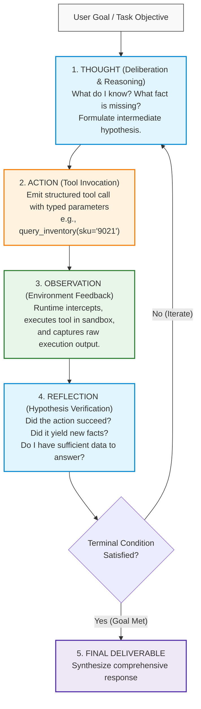
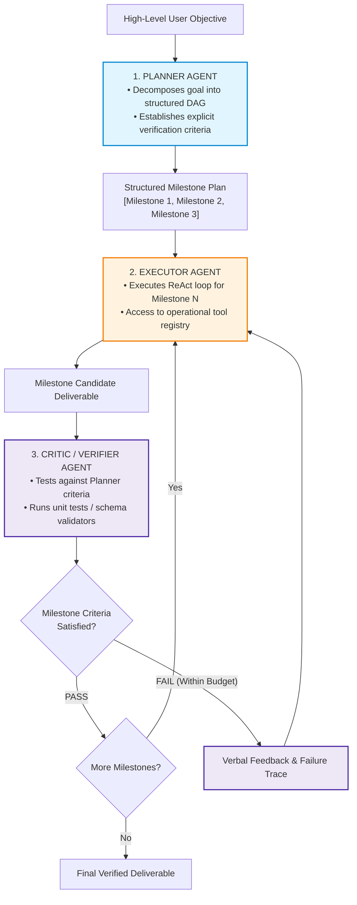
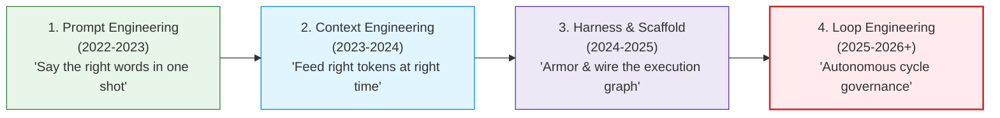
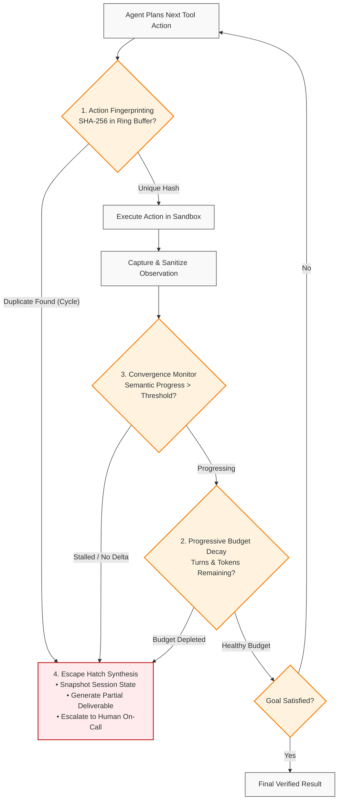

# Autonomous ReAct Loops, Reasoning Engines & Execution Governors

> **Phase 04: Agentic Systems & Orchestration** | Depth Tier: `🟢 Tier 1: Core` | Estimated Reading Time: 50 min
>
> **Prerequisites**: [Lesson 01: Workflows vs. Autonomous Agents](01-workflows-vs-agents-and-orchestration-patterns.md), [Phase 03: Tools & Model Context Protocol](../03-tools-and-model-context-protocol/README.md)

> **Core Concept**: Autonomous agents operate via cyclical execution loops (Thought → Action → Observation → Reflection). Without deterministic execution governors—specifically cryptographic action fingerprinting (SHA-256), sliding-window cycle detection, and progressive budget decay—these loops oscillate, exhaust API quotas, and cause severe production meltdowns.

---

## 1. The Engineering Problem: The "While-Loop with a Credit Card" Anti-Pattern

In modern software development, any engineer can build an autonomous agent prototype in fifteen lines of code:

```python
# ❌ THE NAIVE UNGOVERNED AGENT LOOP (PRODUCTION CATASTROPHE WAITING TO HAPPEN)
while not task_completed:
    thought, tool_call = llm.generate_next_step(messages, tools)
    observation = execute_tool(tool_call)
    messages.append({"role": "assistant", "content": thought})
    messages.append({"role": "tool", "content": observation})
```

In enterprise production environments, this naive loop is not an architecture—it is an automated bankruptcy script. 

When a stochastic foundation model encounters an unexpected error (e.g., an HTTP 403 Forbidden, an empty database query result, or a schema validation error), its statistical instinct is not to stop and ask for help. Instead, it rephrases its reasoning slightly and **retries the exact same failing action** with minor syntactic variations. 

Without external deterministic controls, the system enters an **infinite reasoning deadlock**, racking up thousands of dollars in token consumption, hammering internal microservices with denial-of-service traffic, and corrupting production databases.

> **The Senior Architect's Axiom**:
> *"Without loop engineering, an agent is just an infinite while-loop with a corporate credit card."*

---

## 2. The Mental Model: The ReAct Loop Architecture

The foundational paradigm for autonomous tool-augmented LLMs was formalized by Yao et al. (2022) in their seminal paper, *"ReAct: Synergizing Reasoning and Acting in Language Models"*.



### Prose Diagram Walkthrough: The ReAct Cycle

1. **Phase 1: Thought**: The foundation model emits an explicit natural language scratchpad explaining its internal reasoning. It assesses the current context, identifies what facts are missing, and establishes a tactical subgoal.
2. **Phase 2: Action**: The model selects an external tool from its schema registry (registered via JSON Schema or Model Context Protocol) and generates strongly typed execution arguments.
3. **Phase 3: Observation**: The host control plane intercepts the action, asserts security permissions, executes the tool against an external environment (database, REST API, shell), and feeds the result back into the model's message history as an observation.
4. **Phase 4: Reflection**: The model inspects the observation. Did the query return the expected record? Did the command fail? Does it now have sufficient evidence to satisfy the user's objective?
5. **Phase 5: Terminal Condition**: If the goal is met, the agent exits the loop and synthesizes the final answer. If more information is required, it returns to Phase 1 for the next turn.

### Why ReAct Outperforms Pure Reasoning or Pure Action

* **Pure Chain-of-Thought (Reasoning Only)**: Lacks an observation loop. When the model encounters a factual unknown, it cannot query the world, forcing it to hallucinate plausible-sounding facts.
* **Pure Action (Act Only)**: Directly invokes tools without intermediate reasoning. It cannot plan multi-step sequences, cannot diagnose why a tool failed, and cannot synthesize complex observations.
* **ReAct Synergy**: Reasoning guides action selection and interprets results; external observations ground reasoning in verified real-world facts.

---

## 3. Plan-and-Solve & Reflexion: Overcoming Local Horizon Bias

While basic ReAct is effective for 2-to-4 step tasks, it suffers from severe **local horizon bias** when applied to complex enterprise objectives requiring 10+ turns. Because ReAct chooses each action reactively based solely on the last observation, it frequently wanders off track or gets lost in irrelevant rabbit holes.

To overcome this, modern cognitive architectures employ two advanced patterns:

### 3.1 Plan-and-Solve (Decoupled Planning and Execution)

Plan-and-Solve decouples high-level strategic reasoning from low-level tactical tool execution:



#### Prose Diagram Walkthrough: Plan-and-Solve

1. **Strategic Decomposition**: The **Planner** receives the complex goal and outputs an immutable or semi-immutable list of testable milestones with explicit success criteria.
2. **Tactical Execution**: The **Executor** is a constrained ReAct worker that focuses entirely on fulfilling the active milestone. It is not allowed to rewrite the overarching plan.
3. **Independent Verification**: The **Critic** verifies the candidate output against the Planner's rubric. The Critic has zero execution tools, ensuring its evaluation is untainted by execution biases.

### 3.2 Reflexion: Verbal Reinforcement Learning

Introduced by Shinn et al. (2023), **Reflexion** gives agents dynamic memory and self-reflection capabilities across multi-turn trials without fine-tuning model weights:

```text
Trial 1: Goal -> Trajectory Execution -> Evaluator Fails -> Self-Reflection Scratchpad
Trial 2: [Goal + Prior Reflection Scratchpad] -> Improved Trajectory -> Evaluator Passes
```

When an agent's trajectory fails, the runtime forces the model to generate a structured post-mortem answering three questions:
1. *What assumption did I make that proved false?*
2. *Which tool failed and what was the exact error signal?*
3. *What specific strategy will I execute on the next attempt to avoid this failure?*

This reflection scratchpad is stored in the agent's short-term memory buffer and injected into the prompt of the subsequent trial, dramatically reducing repetitive reasoning errors.

---

## 4. Frontier Reasoning Integration: Grok-3 & Meta Llama Tool Engines

In 2025 and 2026, foundation model architectures bifurcated into standard instruction-tuned models and specialized **Reasoning Models** (e.g., xAI Grok-3 Thinking mode, DeepSeek-R1, OpenAI o1/o3). Integrating reasoning models into agentic loops introduces distinct architectural considerations:

### 4.1 Grok-3 Thinking Mode in Agentic Loops
* **Reasoning Tokens**: When operating in Thinking mode, Grok-3 generates thousands of internal "thinking tokens" before emitting its first visible tool call. These tokens represent hidden Chain-of-Thought traces that explore hypotheses and backtrack.
* **Reasoning Budget Allocation**: In an autonomous ReAct loop, spending 4,000 reasoning tokens on *every* tool invocation introduces massive latency (15–30 seconds per turn).
* **The Hybrid Architectural Pattern**: Use standard fast models (e.g., Grok-3 Mini or Gemini 2.5 Flash) for tactical tool parameter generation, and invoke Grok-3 Thinking mode strictly during **Strategic Planning** and **Post-Mortem Reflexion** when deep combinatorial deduction is required.

### 4.2 Meta Llama Stack Multi-Agent Tool Engine
* **The Llama Stack Standard**: Meta's Llama Stack standardizes agent building blocks (tool calling, memory management, safety guardrails) across Llama 3.1, 3.2, and 3.3 models.
* **Llama Tool Calling Wire Format**: Llama models utilize specialized prompt tokens (`<|start_header_id|>ipython<|end_header_id|>`) to emit code-like tool calls directly into the context stream.
* **Llama Guard 3 Integration**: The Llama Stack agent loop inserts **Llama Guard 3** as an inline semantic firewall between the model's generated tool call and the host execution runtime, intercepting prompt injections and unauthorized tool access before execution.

---

## 5. Loop Engineering: The Fourth Discipline

Enterprise AI engineering has evolved across four distinct architectural disciplines over the past four years:



### Definition: What is Loop Engineering?

> **Loop Engineering** is the **deliberate systems engineering of autonomous Perceive → Plan → Act → Observe → Reflect cycles** to guarantee mathematical convergence, prevent epistemic deadlocks, enforce strict fiscal and temporal boundaries, and synthesize deterministic escape hatches when stochastic reasoning derails.

### War Story: The 2:14 AM Vault Meltdown

To understand why Loop Engineering is mandatory for senior developers, consider this real-world production post-mortem:

> *"It is 2:14 AM on a Sunday. PagerDuty erupts with critical P1 alerts across the core infrastructure cluster. An autonomous incident-remediation agent deployed to diagnose a failing worker node in Kubernetes hit a permissions glitch: HashiCorp Vault returned an HTTP 403 `PermissionDenied` on a database credential lookup.*
>
> *The agent's system prompt had been written with high enthusiasm: 'You are an elite Site Reliability Engineer. Be persistent, explore all hypotheses, and resolve the issue autonomously.'*
>
> *So the agent was persistent. It reasoned: 'Perhaps the secret path requires a trailing slash.' Failed with 403. 'Perhaps I should query Vault via the raw REST API tool.' Failed with 403. 'Perhaps I should base64-encode the token parameter.' Failed with 403. 'Perhaps I should brute-force test every mount point under /v1/secret/.'*
>
> *By 2:45 AM, the agent had executed **240 autonomous loop cycles**, consumed **38 million tokens**, accumulated **\$570 in API charges**, and pounded the internal Vault cluster with **950 requests per second**—tripping enterprise rate limiters and locking out human on-call engineers from authenticating to fix the original cluster!"*

If that agent had possessed Loop Engineering, Turn 3 would have detected an identical action hash, triggered progressive budget decay, tripped a circuit breaker, and escalated to an on-call engineer within 45 seconds at a total cost of \$0.04.

---

## 6. The 4 Pillars of Loop Governance

Production-grade agent runtimes implement four deterministic control-plane mechanisms to govern execution loops:



### Prose Diagram Walkthrough: Loop Governance Pipeline

1. **Pillar 1: Cryptographic Action Fingerprinting**: Before executing any tool, the runtime hashes the tool name and canonically sorted arguments. If this exact action was executed recently with no external state change, execution is blocked immediately.
2. **Pillar 2: Progressive Budget Decay**: As turn and token counts increase, the governor dynamically lowers model temperature and restricts available tools to force convergence.
3. **Pillar 3: Convergence Monitoring**: The governor measures the semantic delta between successive thoughts. If the agent repeats the same reasoning in different words, an epistemic stall is declared.
4. **Pillar 4: Escape Hatch Synthesis**: If any tripwire triggers, the runtime suppresses unhandled crashes, compiles a structured partial deliverable, and executes a clean Human-in-the-Loop escalation.

---

### Deep Dive into the 4 Pillars

#### 1. Action Fingerprinting (SHA-256)
When an LLM receives an error, its default stochastic tendency is to re-invoke the same tool with trivially rearranged parameters. The governor computes a canonical cryptographic fingerprint:

```text
Fingerprint = SHA256( tool_name + "::" + CanonicalJSON(sorted_kwargs) )
```

The runtime maintains an in-memory sliding-window ring buffer (depth `K = 4`). If the current fingerprint matches any entry in the buffer without an intervening change in external environment state:
1. Tool execution is **immediately blocked** (zero network or compute overhead).
2. The runtime returns an explicit deterministic error: `CycleDetectedException: You previously invoked this exact tool call with identical arguments and received an error. You are prohibited from repeating it. Formulate an alternative strategy.`

#### 2. Progressive Budget Decay
Agents given a flat budget of 10 turns often squander turns 1 through 7 on unfocused exploration, running out of turns before synthesizing the deliverable. **Progressive Budget Decay** dynamically alters runtime parameters as the remaining budget shrinks:

```text
Budget_{t+1} = Budget_t - Cost(Token_input) - Cost(Token_output) - Cost(Tool_execution)
```

| Budget Phase | Turns Remaining | Model Temperature | Available Tool Registry | Injected Urgency Prompt |
|---|:---:|:---:|---|---|
| **Phase 1: Broad Exploration** | Turns 1 – 3 | `0.6` | 100% of tools (Search, Query, Inspect) | *"Explore broadly. Formulate testable hypotheses."* |
| **Phase 2: Directed Convergence** | Turns 4 – 6 | `0.3` | High-confidence read tools; payload pruned 80% | *"Focus on validating your primary hypothesis. Do not branch."* |
| **Phase 3: Urgent Finalization** | Turns 7 – 8 | `0.1` | Mutating tools disabled; read-only verification | *"Budget 80% exhausted. Synthesize verified findings into final deliverable."* |
| **Phase 4: Emergency Escape** | Turn 9+ | `0.0` | Zero tools allowed | *"Hard limit reached. Output structured partial summary immediately."* |

#### 3. Convergence Monitoring
An agent can avoid exact action hash collisions while still wandering aimlessly (e.g., searching for "pod error", then "kubernetes pod crash", then "pod error log").
* **Semantic Thought Drift**: The runtime embeds the agent's intermediate "Thought" at step `t` and computes cosine similarity with step `t-1`. If `sim(e_t, e_{t-1}) > 0.94` across three consecutive turns, the agent is in an **epistemic stall**.
* **Checklist Milestone Delta**: The planner maintains an immutable checklist. If zero sub-goals transition to `COMPLETED` after three tool turns, the governor halts execution.

#### 4. Escape Hatch Synthesis
When a cycle is detected or budget is exhausted, an un-engineered system crashes with a traceback or drops the socket. A Loop-Engineered system executes **Escape Hatch Synthesis**:
1. Suppresses the error from the end-user.
2. Injects a deterministic partial deliverable template into the context:
   ```text
   [SYSTEM ALERT: EXECUTION HALTED BY LOOP GOVERNOR]
   Reason: Action fingerprint cycle detected on tool 'query_vault'.
   Instruction: Synthesize an immediate Partial Deliverable containing:
   1. Confirmed Facts: What has been definitively verified so far.
   2. Blockers: What specific assumption or dependency failed.
   3. Next Actions: Exact manual or automated steps required by a human engineer.
   ```
3. Commits session state to durable storage as `SUSPENDED_ESCALATION` and dispatches an alert with full OpenTelemetry correlation IDs.

---

## 7. Production Python 3.12+ Implementation: Resilient Execution Governor

Below is a complete, production-grade Python 3.12+ implementation of an `ExecutionGovernor` demonstrating cryptographic cycle detection, progressive budget decay, and escape hatch synthesis.

```python
"""
Production Execution Governor for Autonomous Agent Loops
Implements: SHA-256 Action Fingerprinting, Sliding-Window Ring Buffer,
Progressive Budget Decay, and Deterministic Escape Hatch Synthesis.
Stack: Python 3.12+, Pydantic v2, Typed Invariants
"""

from __future__ import annotations

import hashlib
import json
from collections import deque
from dataclasses import dataclass, field
from enum import StrEnum
from typing import Any, Dict, List, Optional
from pydantic import BaseModel, Field


# ============================================================================
# 1. GOVERNOR SCHEMAS & EXCEPTIONS
# ============================================================================

class LoopPhase(StrEnum):
    BROAD_EXPLORATION = "BROAD_EXPLORATION"
    DIRECTED_CONVERGENCE = "DIRECTED_CONVERGENCE"
    URGENT_FINALIZATION = "URGENT_FINALIZATION"
    EMERGENCY_ESCAPE = "EMERGENCY_ESCAPE"


class GovernorStatus(StrEnum):
    ACTIVE = "ACTIVE"
    CYCLE_DETECTED = "CYCLE_DETECTED"
    BUDGET_EXHAUSTED = "BUDGET_EXHAUSTED"
    TERMINATED_SUCCESS = "TERMINATED_SUCCESS"


class CycleDetectedException(Exception):
    """Raised when an agent attempts an identical action hash within sliding window."""
    def __init__(self, tool_name: str, action_hash: str):
        super().__init__(
            f"Cycle detected! Tool '{tool_name}' invoked with identical arguments "
            f"(hash: {action_hash[:8]}). Repetition prohibited."
        )
        self.tool_name = tool_name
        self.action_hash = action_hash


class PartialDeliverable(BaseModel):
    ticket_id: str
    status: GovernorStatus
    confirmed_facts: List[str]
    critical_blockers: List[str]
    suggested_human_actions: List[str]
    accumulated_cost_usd: float


# ============================================================================
# 2. THE EXECUTION GOVERNOR
# ============================================================================

@dataclass
class GovernorConfig:
    max_turns: int = 8
    max_tokens: int = 50_000
    ring_buffer_size: int = 4
    cost_per_1k_input: float = 0.003
    cost_per_1k_output: float = 0.015


class ExecutionGovernor:
    """
    Deterministic Control-Plane Supervisor that wraps stochastic agent loops.
    Guarantees termination, detects deadlocks, and enforces fiscal limits.
    """

    def __init__(self, ticket_id: str, config: Optional[GovernorConfig] = None) -> None:
        self.ticket_id = ticket_id
        self.config = config or GovernorConfig()
        self.current_turn = 0
        self.total_tokens_consumed = 0
        self.total_cost_usd = 0.0
        self.action_history: deque[str] = deque(maxlen=self.config.ring_buffer_size)
        self.confirmed_facts: List[str] = []
        self.status = GovernorStatus.ACTIVE

    # ------------------------------------------------------------------------
    # PILLAR 1: ACTION FINGERPRINTING & CYCLE DETECTION
    # ------------------------------------------------------------------------
    def generate_action_fingerprint(self, tool_name: str, kwargs: Dict[str, Any]) -> str:
        """
        Computes canonical SHA-256 hash of tool invocation.
        Keys are sorted to ensure dict key ordering does not alter the hash.
        """
        canonical_payload = json.dumps(
            {"tool": tool_name, "args": kwargs},
            sort_keys=True,
            ensure_ascii=True,
            default=str,
        )
        return hashlib.sha256(canonical_payload.encode("utf-8")).hexdigest()

    def assert_action_permitted(self, tool_name: str, kwargs: Dict[str, Any]) -> str:
        """
        Validates whether the requested tool action is permitted.
        Raises CycleDetectedException if identical hash exists in recent history.
        """
        if self.status != GovernorStatus.ACTIVE:
            raise RuntimeError(f"Governor is not ACTIVE (current status: {self.status})")

        action_hash = self.generate_action_fingerprint(tool_name, kwargs)

        if action_hash in self.action_history:
            self.status = GovernorStatus.CYCLE_DETECTED
            raise CycleDetectedException(tool_name, action_hash)

        # Record hash in sliding window
        self.action_history.append(action_hash)
        return action_hash

    # ------------------------------------------------------------------------
    # PILLAR 2: PROGRESSIVE BUDGET DECAY
    # ------------------------------------------------------------------------
    def record_turn_metrics(self, input_tokens: int, output_tokens: int) -> None:
        """Updates turn and financial budgets; trips circuit breaker if exceeded."""
        self.current_turn += 1
        self.total_tokens_consumed += (input_tokens + output_tokens)
        
        turn_cost = (
            (input_tokens / 1000.0 * self.config.cost_per_1k_input) +
            (output_tokens / 1000.0 * self.config.cost_per_1k_output)
        )
        self.total_cost_usd += turn_cost

        if self.current_turn >= self.config.max_turns:
            self.status = GovernorStatus.BUDGET_EXHAUSTED
        elif self.total_tokens_consumed >= self.config.max_tokens:
            self.status = GovernorStatus.BUDGET_EXHAUSTED

    def get_current_phase(self) -> LoopPhase:
        """Returns the active operating phase based on remaining turn budget."""
        if self.current_turn <= 3:
            return LoopPhase.BROAD_EXPLORATION
        elif self.current_turn <= 6:
            return LoopPhase.DIRECTED_CONVERGENCE
        elif self.current_turn <= 8:
            return LoopPhase.URGENT_FINALIZATION
        else:
            return LoopPhase.EMERGENCY_ESCAPE

    def get_temperature_for_phase(self) -> float:
        """Dynamic temperature reduction to force convergence."""
        phase = self.get_current_phase()
        match phase:
            case LoopPhase.BROAD_EXPLORATION:
                return 0.6
            case LoopPhase.DIRECTED_CONVERGENCE:
                return 0.3
            case LoopPhase.URGENT_FINALIZATION:
                return 0.1
            case LoopPhase.EMERGENCY_ESCAPE:
                return 0.0

    # ------------------------------------------------------------------------
    # PILLAR 4: ESCAPE HATCH SYNTHESIS
    # ------------------------------------------------------------------------
    def synthesize_partial_deliverable(
        self, blocker_reason: str, suggested_actions: List[str]
    ) -> PartialDeliverable:
        """Generates a structured, client-facing fallback artifact."""
        return PartialDeliverable(
            ticket_id=self.ticket_id,
            status=self.status,
            confirmed_facts=self.confirmed_facts,
            critical_blockers=[blocker_reason],
            suggested_human_actions=suggested_actions,
            accumulated_cost_usd=round(self.total_cost_usd, 4),
        )


# ============================================================================
# 3. VERIFICATION & WAR STORY SIMULATION
# ============================================================================

def simulate_vault_meltdown_prevention() -> None:
    print("=== Simulating Incident Response Agent with Governor Protection ===")
    governor = ExecutionGovernor(ticket_id="INCIDENT-SRE-882")

    # Turn 1: Agent queries Vault
    governor.assert_action_permitted("query_vault", {"path": "secret/data/db", "role": "sre"})
    governor.record_turn_metrics(input_tokens=1200, output_tokens=150)
    governor.confirmed_facts.append("Kubernetes pod 'worker-7' is crashing with OOMKilled.")
    print(f"Turn 1 Clean. Phase: {governor.get_current_phase().value}, Cost: ${governor.total_cost_usd:.4f}")

    # Turn 2: Agent queries Vault with different path
    governor.assert_action_permitted("query_vault", {"path": "secret/data/db/", "role": "sre"})
    governor.record_turn_metrics(input_tokens=1500, output_tokens=180)
    print(f"Turn 2 Clean. Phase: {governor.get_current_phase().value}, Cost: ${governor.total_cost_usd:.4f}")

    # Turn 3: Agent hallucinates and repeats Turn 1 action exactly!
    print("\nTurn 3: Agent attempts duplicate action from Turn 1...")
    try:
        governor.assert_action_permitted("query_vault", {"path": "secret/data/db", "role": "sre"})
    except CycleDetectedException as e:
        print(f"🚨 GOVERNOR INTERCEPTED: {e}")
        deliverable = governor.synthesize_partial_deliverable(
            blocker_reason=str(e),
            suggested_actions=[
                "Verify Vault AppRole permissions for SRE cluster role.",
                "Manually inspect pod environment variables via kubectl exec.",
            ],
        )
        print("\n=== Synthesized Partial Deliverable for On-Call Engineer ===")
        print(deliverable.model_dump_json(indent=2))


if __name__ == "__main__":
    simulate_vault_meltdown_prevention()
```

---

## 8. Production Failure Modes & Defensive Invariants

When deploying ReAct loops to production, enforce these defensive software engineering patterns:

### Failure Mode 1: The Oscillating Ping-Pong Deadlock
* **The Root Cause**: The agent alternates between two tools—for example, calling `search_code(query="auth")`, receiving 50 files, calling `summarize_file(file="auth.py")`, finding no auth logic, and then returning to `search_code(query="auth")`.
* **The Defensive Invariant**: **Sliding Window of Depth K >= 4**. A window size of 2 only catches immediate repetitions (`A -> A`). A window size of 4 catches ping-pong cycles (`A -> B -> A -> B`).

### Failure Mode 2: Frivolous Exploratory Token Burn
* **The Root Cause**: High temperature (`0.7+`) during late turns causes the model to generate creative hypotheses instead of converging on the verified facts already in memory.
* **The Defensive Invariant**: **Dynamic Temperature Decay**. Decreasing temperature to `0.1` after turn 6 strips the model of its stochastic variance and forces deterministic synthesis.

### Failure Mode 3: Cascading Tool Payload Context Explosion
* **The Root Cause**: A tool outputs a 2MB raw JSON dump containing 500 records. Appending this to the message history exhausts the model's context window in a single turn.
* **The Defensive Invariant**: **Tool Observation Projection**. Never feed raw API responses directly into the message array. All tool output must pass through a sanitization filter that strips null fields and truncates arrays to the top 5 items.

---

## 9. Hands-On Architectural Exercises & Lab Integration

To validate your mastery of autonomous loops and execution governors:

1. **Governor Integration**: Complete [Lab 3: Infinite Loop Detection & Recovery](labs/lab3-infinite-loops.md). Implement the `ActionFingerprinter` in an active ReAct loop and verify that it trips on simulated cycling queries.
2. **ReAct Implementation**: Review [`examples/react_agent.py`](examples/react_agent.py) to see how the Thought-Action-Observation loop is orchestrated with native tool calls.
3. **PydanticAI Agent Architecture**: Review [`examples/pydantic_ai_agent.py`](examples/pydantic_ai_agent.py) to inspect how modern typed frameworks handle agent dependencies and validation retries.

---

## 10. Key Takeaways & Summary

* **ReAct Synergizes Reasoning and Action**: Thoughts provide strategic deliberation; actions provide external factual grounding. Pure reasoning hallucinates; pure action lacks foresight.
* **Plan-and-Solve Defeats Local Horizon Bias**: Decouple strategic planning from tactical execution to prevent agents from wandering off course over 10+ turns.
* **Reflexion Enables In-Context Learning**: Verbal post-mortems across failed trials allow models to self-correct without expensive weight fine-tuning.
* **The 4 Pillars of Loop Engineering**:
  1. *Action Fingerprinting (SHA-256)*: Eradicates exact tool repetition in an in-memory ring buffer.
  2. *Progressive Budget Decay*: Dynamically drops temperature and tools as turns elapse.
  3. *Convergence Monitoring*: Detects semantic thought stalls when cosine similarity exceeds 0.94.
  4. *Escape Hatch Synthesis*: Guarantees clean, typed Human-in-the-Loop partial deliverables on termination.

---

## 🧭 Navigation

| [← Lesson 01: Workflows vs. Autonomous Agents](01-workflows-vs-agents-and-orchestration-patterns.md) | [Phase 04 Navigation Hub](README.md) | [Lesson 03: Stateful Sessions & WAL Persistence →](03-stateful-sessions-and-durable-wal-persistence.md) |
|:---:|:---:|:---:|
| **Previous Lesson** | **Phase Hub** | **Next Lesson** |
| [Lab 1: Stateful Agent & HITL](labs/lab1-stateful-agent-hitl.md) | [Lab 3: Infinite Loop Governors](labs/lab3-infinite-loops.md) | [Capstone: Code Review Engine](labs/capstone-code-review-engine.md) |
