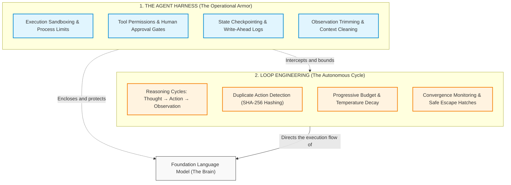
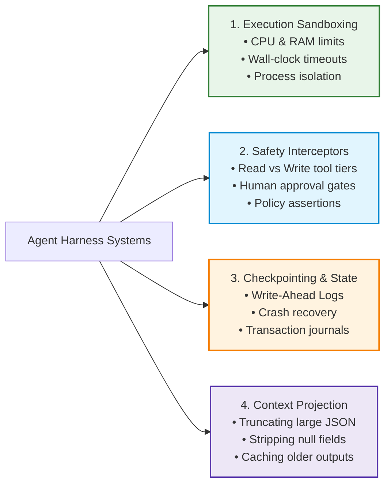
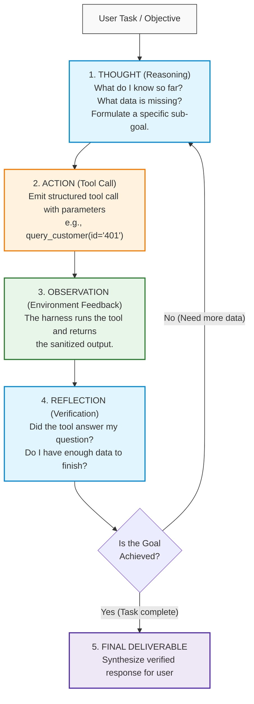
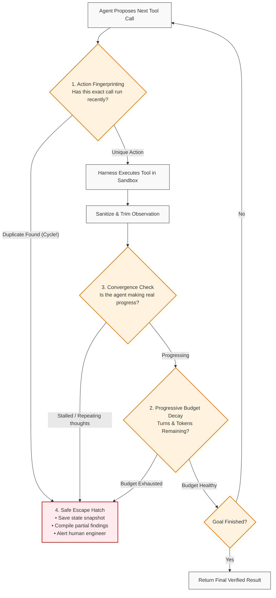

# Agent Architecture: Harness Engineering, Autonomous Loops & Execution Governors

> **Phase 04: Agentic Systems & Orchestration** | Depth Tier: `🟢 Tier 1: Core` | Estimated Reading Time: 45 min
>
> **Prerequisites**: [Lesson 01: Workflows vs. Autonomous Agents](01-workflows-vs-agents-and-orchestration-patterns.md), [Phase 03: Tools & Model Context Protocol](../03-tools-and-model-context-protocol/README.md)

> **Core Concept**: Autonomous agents rely on two complementary architectural pillars: the **Harness** (the operational runtime, safety boundaries, and tool environment that wraps the model) and **Loop Engineering** (the design of recursive reasoning cycles that prevent infinite loops, detect stalled progress, and guarantee convergence). Without both, an agent is little more than an unconstrained while-loop that burns through API budgets.

---

## 1. The Core Problem: The Ungoverned Loop Trap

In many beginner tutorials, an autonomous agent is built using a simple while-loop:

```python
# ❌ THE UNGOVERNED AGENT LOOP (A PRODUCTION OUTAGE WAITING TO HAPPEN)
while not task_finished:
    thought, tool_call = llm.generate_step(messages, tools)
    observation = execute_tool(tool_call)
    messages.append({"role": "assistant", "content": thought})
    messages.append({"role": "tool", "content": observation})
```

In a production system, this simple loop is extremely dangerous:
* When an external service returns an unexpected error (like an HTTP 403 Forbidden or an empty search result), the language model does not stop. Instead, it rephrases its reasoning slightly and **retries the exact same failing action** over and over.
* Every turn appends more text to the message list. As context grows, API costs compound quadratically, response times slow down, and the model begins to lose track of its original instructions.
* If a tool mutates a production database or charges a payment, an unconstrained loop can perform duplicate actions before anyone notices.

To build agents that can safely run in production, we need two distinct engineering disciplines:
1. **Harness Engineering**: The protective environment and safety mechanisms that wrap around the model.
2. **Loop Engineering**: The structured design of the iterative cycle itself to ensure the agent makes progress and terminates cleanly.



### Prose Diagram Walkthrough: Harness vs. Loop

1. **The Model (The Brain)**: The foundation model is responsible for semantic reasoning, understanding user intent, and proposing which tool to call with what parameters.
2. **The Harness (The Body & Armor)**: The harness is the software infrastructure surrounding the model. It provides tool connectivity, isolates code execution, enforces security rules, takes state snapshots, and trims bulky responses before they reach the model.
3. **The Loop (The Behavioral Strategy)**: Loop engineering defines how the agent iterates. It controls how the agent reflects on observations, detects when it is stuck in repetitive loops, reduces temperature as turns elapse, and triggers safe exit routines when limits are reached.

---

## 2. Deep Dive: Harness Engineering (The Operational Armor)

In construction, workers cleaning windows on a skyscraper use two different pieces of equipment:
* **The Scaffold**: The catwalk, pulleys, and structural railings that allow workers to move along the building.
* **The Harness**: The heavy-duty fall-arrest harness, carabiners, and safety lifelines clipped to an independent cable. If the catwalk shudders or a cable snaps, the harness catches the worker and prevents a fatal fall.

In software:
* **The Scaffold** is your graph topology, node definitions, routing edges, and message queues (for example, LangGraph nodes or custom event routers). It defines *how data moves*.
* **The Harness** is your sandbox, memory ceiling, duplicate action detector, timeout token, and database rollback coordinator. It defines *how safety and limits are enforced*.

> **The Scaffold Fallacy**:
> Engineering teams often spend weeks debating which agent framework to use (switching between LangChain, CrewAI, AutoGen, and LangGraph) while completely neglecting the harness. When their agent burns through $1,000 in an hour or loops on a failing database write, they blame "model hallucinations." The model did not fail—their system lacked a safety harness.

### The 4 Core Systems of an Agent Harness



#### 1. Execution Sandboxing and Resource Limits
Never execute model-generated scripts or unvetted tools directly in your main application process. A production harness enforces:
* **Process Isolation**: Spawning tool actions in separate subprocesses or isolated containers (such as Google gVisor or minimal micro-virtual machines).
* **Hard Timeouts**: Using asynchronous cancellation tokens (for example, 10-second limits per tool execution) so a hanging network request cannot stall the entire system.
* **Resource Ceilings**: Limiting memory (e.g., 512MB maximum) and process counts to prevent accidental resource exhaustion.

#### 2. Safety Interceptors and Human Approval Gates
Not all tools carry the same risk. A robust harness establishes two distinct privilege tiers:
* **Read-Only Tier**: Inspecting records, querying indexes, reading files. These can execute automatically.
* **State-Mutating Tier**: Charging credit cards, updating production databases, deleting files. The harness intercepts these calls, pauses execution, and sends an approval request to a human operator before proceeding.

#### 3. Checkpointing and State Persistence
If a container restarts or an approval takes four hours, the agent must not lose its progress. The harness saves a snapshot of the session state to a durable database (such as PostgreSQL or SQLite) before and after every action.

#### 4. Observation Cleaning and Context Projection
When an external API returns a large 20-page JSON payload, feeding that entire payload into the prompt context wastes tokens and causes the model to lose focus. The harness cleans the payload:
* Stripping out tracking metadata and null values.
* Limiting array results to the top 5 relevant items.
* Replacing outputs older than 2 turns with a simple reference pointer (such as `[Output saved in record #9021]`), fetching full details only if specifically requested.

---

## 3. Deep Dive: Loop Engineering (Governing Autonomous Iterations)

### What is Loop Engineering?

> **Loop Engineering** is the deliberate design of recursive **Perceive → Plan → Act → Observe → Reflect** cycles. It ensures that an autonomous agent converges on an accurate result, avoids repetitive deadlocks, stays within budget limits, and gracefully escalates to humans when stuck.

### The Foundation: The ReAct Cycle

Formalized by Yao et al. (2022), the **ReAct (Reasoning + Acting)** pattern combines natural language deliberation with structured tool actions:



#### Why ReAct Outperforms Simple Approaches

* **Pure Chain-of-Thought (Reasoning Only)**: If a model reasons without tools, it cannot verify external facts. When it reaches an unknown piece of data, it hallucinates plausible-sounding answers.
* **Pure Action (Calling Tools Without Thinking)**: If a model calls tools without an intermediate reasoning step, it cannot plan multi-step sequences, diagnose why a query failed, or synthesize observations from multiple sources.
* **The ReAct Combination**: Reasoning guides which tool to select; tool observations ground the reasoning in verified real-world facts.

### Overcoming Short-Sighted Drift: Plan-and-Execute

While simple ReAct works well for 2 to 4 turns, it often drifts off course on complex tasks with 10+ turns. Because ReAct decides each step based only on the immediate observation, it can easily wander down unproductive paths.

To prevent this, production systems decouple planning from execution:
1. **The Planner**: A high-level prompt breaks the goal into a small list of concrete milestones with clear success criteria.
2. **The Executor**: An agent focused entirely on completing the active milestone. It cannot change the overall roadmap.
3. **The Verifier**: A separate check that confirms whether the milestone criteria were actually satisfied before moving to the next item.

### The Real-World War Story: The 2:14 AM Vault Meltdown

To understand why loop governance is essential, consider this real-world production incident:

> *"It is 2:14 AM on a Sunday. PagerDuty alerts go off across the engineering team. An automated incident-response agent deployed to inspect a failing Kubernetes worker node encountered a permissions issue: the corporate secrets vault returned an HTTP 403 `PermissionDenied` error on a credential lookup.*
>
> *The agent's system prompt had been written with great enthusiasm: 'You are an elite reliability engineer. Be thorough, explore all possibilities, and resolve the issue autonomously.'*
>
> *So the agent was thorough. It reasoned: 'Perhaps the secret path needs a trailing slash.' Failed with 403. 'Perhaps I should query the vault using the raw REST API.' Failed with 403. 'Perhaps I should base64-encode the token parameter.' Failed with 403. 'Perhaps I should test every path under /v1/secret/.'*
>
> *By 2:45 AM, the agent had executed **240 autonomous loop cycles**, consumed **38 million tokens**, generated **\$570 in API charges**, and flooded the internal secrets vault with **950 requests per second**—tripping enterprise rate limiters and locking human engineers out of the system!"*

If that agent had been equipped with loop governance, Turn 3 would have detected that the agent was repeating the same failing action, applied budget decay, halted the loop, and escalated to an on-call engineer within 45 seconds at a total cost of \$0.04.

---

## 4. The 4 Pillars of Loop Governance

To prevent infinite loops, deadlocks, and runaway costs, a production agent runtime implements four deterministic controls:



### 1. Action Fingerprinting (Detecting Duplicate Tool Calls)
When a tool fails, models tend to retry the exact same tool call with trivial cosmetic changes. To prevent this, the runtime calculates a cryptographic hash of the tool name and its sorted parameters:

```text
ActionHash = SHA256( tool_name + "::" + CanonicalJSON(sorted_parameters) )
```

The runtime maintains a sliding-window buffer of the last 4 tool calls. If the incoming action matches an action already in the buffer and the external environment has not changed:
* The execution is **blocked immediately** without hitting the network.
* The runtime injects an explicit error: `"You already attempted this exact tool call with identical parameters and it failed. You are prohibited from repeating it. Please formulate an alternative strategy."`

### 2. Progressive Budget Decay
Agents given a flat budget of 10 turns often spend turns 1 through 7 wandering through exploratory queries, only to run out of turns before writing down the final answer.

**Progressive Budget Decay** dynamically tightens runtime parameters as the remaining budget decreases:

| Budget Phase | Turns Remaining | Model Temperature | Available Tooling | System Guidance |
|---|:---:|:---:|---|---|
| **Phase 1: Exploration** | Turns 1 – 3 | `0.6` | All read tools available | *"Explore broadly. Formulate testable hypotheses."* |
| **Phase 2: Convergence** | Turns 4 – 6 | `0.3` | Targeted inspection tools only | *"Focus on validating your primary hypothesis. Do not branch."* |
| **Phase 3: Finalization** | Turns 7 – 8 | `0.1` | Mutating tools disabled | *"Budget 80% spent. Synthesize verified findings into final answer."* |
| **Phase 4: Emergency Stop** | Turn 9+ | `0.0` | Zero tools allowed | *"Budget exhausted. Summarize current findings immediately."* |

### 3. Convergence Monitoring (Detecting Thought Stalls)
An agent can avoid exact duplicate tool calls while still being mentally stuck—for example, searching for "error in pod", then "pod error log", then "pod crash trace".

To catch this, the runtime measures whether the agent is actually moving closer to the goal:
* **Semantic Similarity**: The runtime compares the vector embedding of the current "Thought" against the previous turn's thought. If similarity exceeds `0.94` across three consecutive turns, the model is simply repeating the same reasoning in different words.
* **Milestone Progress**: If the planner maintains an ordered list of tasks and zero tasks have transitioned to completed after 3 tool turns, the system flags a stall.

### 4. Safe Escape Hatch Synthesis
When a limit is reached or a loop is detected, a poorly designed system crashes with a stack trace. A properly engineered system executes a **Safe Escape Hatch**:
1. Suppresses the unhandled exception.
2. Injects a structured fallback prompt into the context:
   ```text
   [SYSTEM NOTICE: EXECUTION HALTED BY SAFETY GOVERNOR]
   Reason: Duplicate action cycle detected on tool 'query_vault'.
   Instruction: Synthesize an immediate Partial Deliverable containing:
   1. Confirmed Facts: What has been definitively verified so far.
   2. Blockers: What specific assumption or dependency failed.
   3. Next Steps: Exact actions required by a human engineer.
   ```
3. Saves the session to durable storage and alerts an on-call engineer with full tracing identifiers.

---

## 5. Frontier Reasoning Models: Grok-3 and Meta Llama Stack

In 2025 and 2026, the landscape expanded with specialized reasoning models and standardized tool stacks. Understanding how they interact with agent loops is essential:

### xAI Grok-3: Test-Time Reasoning Compute in Loops
* **Reasoning Tokens**: In its "Think" mode, Grok-3 generates internal reasoning tokens before outputting its visible response. This allows the model to explore hypotheses and backtrack internally.
* **Balancing Latency**: In an agent loop, spending thousands of reasoning tokens on *every simple tool call* introduces substantial latency (often 15 to 30 seconds per turn).
* **The Recommended Practice**: Use standard fast models for straightforward tool parameter extraction, and reserve deep reasoning models (like Grok-3 Thinking mode) for initial task planning and complex failure analysis.

### Meta Llama Stack: Standardized Agent Tool Engines
* **Standardized Infrastructure**: Meta's Llama Stack provides an open-source standard for agent components—tool execution, memory, and safety guardrails.
* **The Responses API**: Llama Stack has adopted a unified Responses API pattern, handling tool discovery, planning, and multi-turn execution behind a consistent interface.
* **Built-in Security Boundaries**: The Llama Stack integrates **Llama Guard** directly into the tool loop, automatically checking tool parameters for prompt injections or unauthorized system commands before execution.

---

## 6. Production Implementation: A Governed Agent Harness and Loop Engine

Below is a complete, production-grade Python 3.12+ implementation demonstrating an **Agent Harness** coupled with an **Execution Governor** that enforces action fingerprinting, progressive budget decay, and escape hatch synthesis:

```python
"""
Production Agent Harness and Execution Governor
Implements: SHA-256 Action Hashing, Sliding-Window Cycle Detection,
Progressive Budget Decay, and Safe Escape Hatch Synthesis.
Tech Stack: Python 3.12+, Pydantic v2, Typed Schemas
"""

from __future__ import annotations

import hashlib
import json
from collections import deque
from dataclasses import dataclass
from enum import StrEnum
from typing import Any, Dict, List, Optional
from pydantic import BaseModel, Field


# ============================================================================
# 1. DATA MODELS & STATUS SCHEMAS
# ============================================================================

class LoopPhase(StrEnum):
    EXPLORATION = "EXPLORATION"
    CONVERGENCE = "CONVERGENCE"
    FINALIZATION = "FINALIZATION"
    EMERGENCY_STOP = "EMERGENCY_STOP"


class GovernorStatus(StrEnum):
    ACTIVE = "ACTIVE"
    CYCLE_DETECTED = "CYCLE_DETECTED"
    BUDGET_EXHAUSTED = "BUDGET_EXHAUSTED"
    COMPLETED = "COMPLETED"


class CycleDetectedException(Exception):
    """Raised when an agent attempts an identical action within the sliding window."""
    def __init__(self, tool_name: str, action_hash: str):
        super().__init__(
            f"Cycle detected! Tool '{tool_name}' was called with identical arguments "
            f"(hash: {action_hash[:8]}). Repeating identical failed calls is prohibited."
        )
        self.tool_name = tool_name
        self.action_hash = action_hash


class PartialDeliverable(BaseModel):
    ticket_id: str
    status: GovernorStatus
    confirmed_facts: List[str]
    blockers: List[str]
    recommended_human_actions: List[str]
    estimated_cost_usd: float


# ============================================================================
# 2. THE EXECUTION GOVERNOR & HARNESS
# ============================================================================

@dataclass
class GovernorConfig:
    max_turns: int = 8
    max_tokens: int = 40_000
    history_window_size: int = 4
    cost_per_1k_input: float = 0.003
    cost_per_1k_output: float = 0.015


class ExecutionGovernor:
    """
    Supervises the execution loop to enforce safety and prevent infinite cycles.
    """

    def __init__(self, ticket_id: str, config: Optional[GovernorConfig] = None) -> None:
        self.ticket_id = ticket_id
        self.config = config or GovernorConfig()
        self.current_turn = 0
        self.total_tokens_used = 0
        self.accumulated_cost_usd = 0.0
        self.action_history: deque[str] = deque(maxlen=self.config.history_window_size)
        self.confirmed_facts: List[str] = []
        self.status = GovernorStatus.ACTIVE

    # ------------------------------------------------------------------------
    # CONTROL 1: ACTION FINGERPRINTING & CYCLE DETECTION
    # ------------------------------------------------------------------------
    def generate_fingerprint(self, tool_name: str, arguments: Dict[str, Any]) -> str:
        """Computes a canonical SHA-256 hash of the tool name and sorted arguments."""
        canonical_json = json.dumps(
            {"tool": tool_name, "args": arguments},
            sort_keys=True,
            ensure_ascii=True,
            default=str,
        )
        return hashlib.sha256(canonical_json.encode("utf-8")).hexdigest()

    def validate_action(self, tool_name: str, arguments: Dict[str, Any]) -> str:
        """
        Verifies whether an action is permitted.
        Raises CycleDetectedException if identical arguments were run recently.
        """
        if self.status != GovernorStatus.ACTIVE:
            raise RuntimeError(f"Governor is not active (current status: {self.status})")

        action_hash = self.generate_fingerprint(tool_name, arguments)

        if action_hash in self.action_history:
            self.status = GovernorStatus.CYCLE_DETECTED
            raise CycleDetectedException(tool_name, action_hash)

        # Store in sliding window
        self.action_history.append(action_hash)
        return action_hash

    # ------------------------------------------------------------------------
    # CONTROL 2: PROGRESSIVE BUDGET DECAY
    # ------------------------------------------------------------------------
    def record_turn(self, input_tokens: int, output_tokens: int) -> None:
        """Tracks turn counts and token spend, tripping limits when needed."""
        self.current_turn += 1
        self.total_tokens_used += (input_tokens + output_tokens)

        cost = (
            (input_tokens / 1000.0 * self.config.cost_per_1k_input) +
            (output_tokens / 1000.0 * self.config.cost_per_1k_output)
        )
        self.accumulated_cost_usd += cost

        if self.current_turn >= self.config.max_turns:
            self.status = GovernorStatus.BUDGET_EXHAUSTED
        elif self.total_tokens_used >= self.config.max_tokens:
            self.status = GovernorStatus.BUDGET_EXHAUSTED

    def get_active_phase(self) -> LoopPhase:
        """Returns the current operating phase based on remaining turns."""
        if self.current_turn <= 3:
            return LoopPhase.EXPLORATION
        elif self.current_turn <= 6:
            return LoopPhase.CONVERGENCE
        elif self.current_turn <= 8:
            return LoopPhase.FINALIZATION
        return LoopPhase.EMERGENCY_STOP

    def get_temperature(self) -> float:
        """Dynamically reduces temperature as turns progress to force convergence."""
        match self.get_active_phase():
            case LoopPhase.EXPLORATION:
                return 0.6
            case LoopPhase.CONVERGENCE:
                return 0.3
            case LoopPhase.FINALIZATION:
                return 0.1
            case LoopPhase.EMERGENCY_STOP:
                return 0.0

    # ------------------------------------------------------------------------
    # CONTROL 4: SAFE ESCAPE HATCH
    # ------------------------------------------------------------------------
    def synthesize_escape_deliverable(
        self, blocker_message: str, next_steps: List[str]
    ) -> PartialDeliverable:
        """Builds a structured deliverable for human handoff instead of crashing."""
        return PartialDeliverable(
            ticket_id=self.ticket_id,
            status=self.status,
            confirmed_facts=self.confirmed_facts,
            blockers=[blocker_message],
            recommended_human_actions=next_steps,
            estimated_cost_usd=round(self.accumulated_cost_usd, 4),
        )


# ============================================================================
# 3. VERIFICATION RUNNER & INCIDENT SIMULATION
# ============================================================================

def simulate_incident_response() -> None:
    print("=== Simulating Autonomous Agent with Loop Governor ===")
    governor = ExecutionGovernor(ticket_id="INCIDENT-SRE-882")

    # Turn 1: Agent inspects vault path
    governor.validate_action("query_vault", {"path": "secret/data/database", "role": "sre"})
    governor.record_turn(input_tokens=1200, output_tokens=140)
    governor.confirmed_facts.append("Kubernetes pod 'worker-07' is crashing with out-of-memory errors.")
    print(f"Turn 1 Complete. Phase: {governor.get_active_phase().value}, Cost: ${governor.accumulated_cost_usd:.4f}")

    # Turn 2: Agent tries slightly different path
    governor.validate_action("query_vault", {"path": "secret/data/database/", "role": "sre"})
    governor.record_turn(input_tokens=1500, output_tokens=180)
    print(f"Turn 2 Complete. Phase: {governor.get_active_phase().value}, Cost: ${governor.accumulated_cost_usd:.4f}")

    # Turn 3: Agent repeats Turn 1 action exactly!
    print("\nTurn 3: Agent attempts duplicate action from Turn 1...")
    try:
        governor.validate_action("query_vault", {"path": "secret/data/database", "role": "sre"})
    except CycleDetectedException as err:
        print(f"🚨 GOVERNOR INTERCEPTED: {err}")
        deliverable = governor.synthesize_escape_deliverable(
            blocker_message=str(err),
            next_steps=[
                "Check HashiCorp Vault access permissions for the SRE role.",
                "Inspect worker pod environment variables using kubectl logs.",
            ],
        )
        print("\n=== Clean Partial Deliverable Escalate to Human ===")
        print(deliverable.model_dump_json(indent=2))


if __name__ == "__main__":
    simulate_incident_response()
```

---

## 7. Key Takeaways & Summary

* **Harness vs. Loop**: The **Harness** is the operational armor (sandboxes, permission tiers, checkpointing, and output trimming). The **Loop** is the iterative behavior (deliberation, action selection, and cycle management). You need both for production systems.
* **ReAct Combines Thinking and Action**: Thinking guides which tool to select; tool observations ground the thinking in real facts. Pure reasoning hallucinates; pure action lacks planning.
* **Decouple Planning from Execution**: Use high-level milestones to guide long multi-turn sessions and keep the agent focused on the goal.
* **The 4 Pillars of Loop Governance**:
  1. *Action Fingerprinting*: SHA-256 parameter hashing to block repetitive tool calls.
  2. *Progressive Budget Decay*: Lowering temperature and tool access as turns elapse.
  3. *Convergence Monitoring*: Checking that the agent is making real progress, not just repeating thoughts.
  4. *Safe Escape Hatches*: Gracefully synthesizing partial deliverables and escalating to humans instead of crashing.

---

## 🧭 Navigation

| [← Lesson 01: Workflows vs. Autonomous Agents](01-workflows-vs-agents-and-orchestration-patterns.md) | [Phase 04 Navigation Hub](README.md) | [Lesson 03: Stateful Sessions & Durable WAL →](03-stateful-sessions-and-durable-wal-persistence.md) |
|:---:|:---:|:---:|
| **Previous Lesson** | **Phase Hub** | **Next Lesson** |
| [Lab 1: Stateful Agent & Human Approvals](labs/lab1-stateful-agent-hitl.md) | [Lab 3: Infinite Loop Governors](labs/lab3-infinite-loops.md) | [Capstone: Code Review Engine](labs/capstone-code-review-engine.md) |
