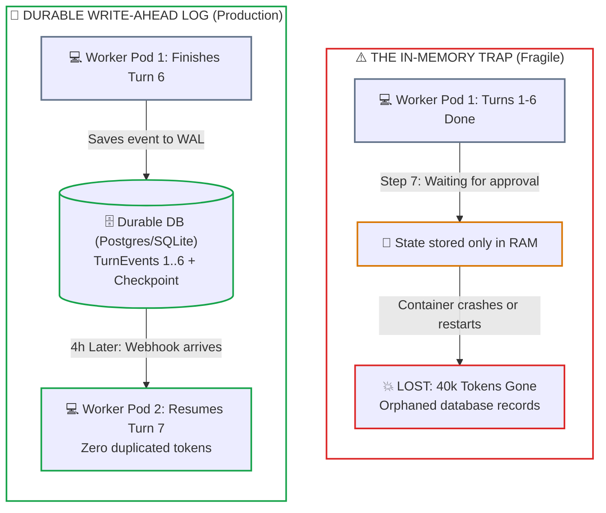
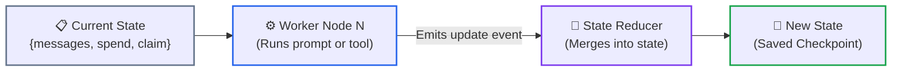
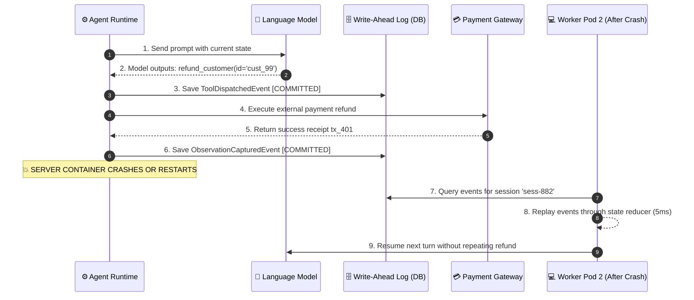
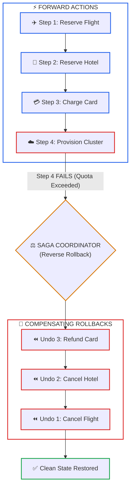
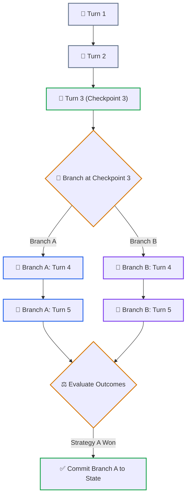
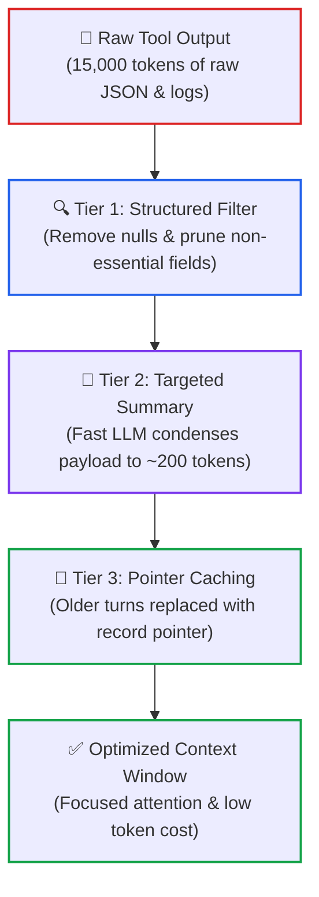

# Lesson 03: Stateful Sessions, Durable Write-Ahead Logs & Distributed Sagas

> **Tier**: `🟡 Engineering Depth` | Estimated Reading Time: 35 min
>
> **Prerequisites**: [Lesson 00: Agentic Systems Fundamentals](00-agentic-systems-and-control-plane-fundamentals.md), [Lesson 01: Workflows vs. Autonomous Agents](01-workflows-vs-agents-and-orchestration-patterns.md), [Lesson 02: Autonomous ReAct Loops & Execution Governors](02-react-loops-and-execution-governors.md)
>
> **Core Concept**: Production agents are long-running, stateful systems. When a server restarts, a human takes hours to approve an action, or a network drops, the agent must resume immediately without re-spending tokens or duplicating database writes. We achieve this using graph state machines with clean reducers, append-only Write-Ahead Logs (WAL), session branching, and Distributed Sagas with compensating rollback tools.
>
> **Term Ledger**:
> * **New AI terms introduced**: `Write-Ahead Log (WAL)`, `State Checkpointer`, `Session Forking`, `Distributed Saga`, `Compensating Transaction`, `Idempotency Key`.
> * **AI terms assumed from earlier lessons**: `AI Agent`, `Control Plane`, `Compute Plane`, `ReAct Pattern`, `Context Window`, `Token`, `Function Calling`.

---

## 1. The Real-World Problem: What Happens When Memory Vanishes?

In simple tutorials, an agent's conversation history and tool outputs are usually stored in a simple Python list: `messages = []`. 

While this works for interactive desktop demos, keeping state only in application memory causes major production failures:
1. **Server Restarts and Scaling Events**: Suppose your agent is on turn 7 of an 8-turn code refactoring workflow. Your cloud platform moves the application container to another node due to high CPU load. The memory list disappears instantly. You lose 40,000 tokens of accumulated reasoning, and the customer is left with an unfinished transaction.
2. **Long Human Approval Pauses**: An agent reaches a step requiring a manager's sign-off to approve a $5,000 credit. The manager might not click "Approve" for four hours. Keeping a stateful container running with an open socket for hours wastes server resources and leaks memory.
3. **Accidental Duplicate Actions**: If the agent restarts from step 1 after a crash, the model repeats completed actions. This causes duplicate credit card charges or orphaned cloud infrastructure.



### How the Durable Architecture Works

1. **The In-Memory Trap**: When state lives only in RAM, server restarts destroy the entire execution history. To recover, you must rerun everything from scratch, paying for duplicate tokens and risking duplicate tool executions.
2. **The Write-Ahead Log**: After every reasoning turn and tool action, the application writes an event record to a durable database (such as PostgreSQL or SQLite).
3. **Suspended Execution**: When waiting for a human approval or external webhook, the session sets its status to `SUSPENDED` and releases all memory and CPU resources.
4. **Seamless Resumption**: When the human approves, any available worker loads the events for that session ID from the database, restores the state machine in a few milliseconds, and picks up right where it left off.

---

## 2. The Mental Model: Graph State Machines & State Reducers

To make agent state predictable and reproducible, modern frameworks (such as LangGraph) structure the agent as a **State Machine** governed by **State Reducers**:

> [!NOTE]
> **Where this analogy breaks**: In classical event-sourced banking systems, state transitions are 100% deterministic (debit A, credit B). In agentic state graphs, an event may contain non-deterministic text generated by an LLM. Replaying the event stream reproduces the exact historical state, but re-executing a node from an earlier state produces different tokens.



### Core Primitives Explained Simply

1. **State Schema**: A strongly typed data model (using Pydantic v2) containing everything the agent needs to track: messages, extracted customer details, accumulated spend, and approval status.
2. **Nodes**: Isolated Python functions or classes that receive the current state, do one specific piece of work (like calling a model or running an API), and return an update event.
3. **Edges**: Conditional checks in code that look at the current state and decide which node to visit next (for example: *"if requires_approval is true, route to the approval node; otherwise, route to execution"*).
4. **State Reducers**: Clean functions that specify *how* an update event should be merged into the existing state:
   * *Append Reducer*: Adds new messages to an existing conversation history list without overwriting past messages.
   * *Additive Reducer*: Sums token costs or financial amounts (`total_cost = current_cost + new_cost`).
   * *Replace Reducer*: Updates a status field (e.g., updating status from `ACTIVE` to `COMPLETED`).

Because state updates are treated as clean, deterministic events, an agent's entire trajectory can be saved, replayed, or inspected at any point.

---

## 3. Event-Sourced Write-Ahead Logs & Instant Crash Recovery

In distributed databases (like PostgreSQL), a **Write-Ahead Log (WAL)** ensures that every transaction is written to disk *before* changes are applied. If the database crashes, it reads the log upon reboot and recovers without losing data.

We apply this exact pattern to autonomous agents:



### Step-by-Step Crash Recovery Walkthrough

1. **Prompt Dispatch**: The runtime sends the current state to the model.
2. **Action Proposal**: The model proposes a refund tool call.
3. **Write-Ahead Commit**: Before making the network call, the runtime writes a `ToolDispatchedEvent` to the database. If the process dies while waiting for the network, the database already records that the tool was initiated.
4. **Tool Execution**: The payment gateway runs the refund.
5. **Observation Capture**: The gateway returns a success receipt.
6. **Observation Commit**: The runtime writes an `ObservationCapturedEvent` to disk.
7. **The Crash**: The server pod restarts unexpectedly.
8. **Instant Rehydration**: A new worker pod loads all saved events for that session ID from the database and replays them through the state reducer. Within 5 milliseconds, the exact state is restored.
9. **Zero-Loss Continuity**: The new worker resumes the conversation without repeating the refund or re-paying for the earlier model inference.

---

## 4. The Distributed Saga Pattern: Compensating Rollback Tools

When an agent interacts with multiple external services (booking travel, reserving inventory, charging credit cards), standard database transactions cannot span across third-party APIs. If step 4 of a 5-step task fails, you cannot simply issue a database `ROLLBACK`.

To maintain consistency, enterprise architectures implement the **Distributed Saga Pattern**:



### How the Saga Rollback Works

1. **Forward Execution**: The agent successfully completes Steps 1, 2, and 3, saving booking and transaction IDs in its journal.
2. **The Failure**: At Step 4, cloud provisioning fails because the customer's quota is exceeded.
3. **The Saga Coordinator**: Instead of letting the model guess what to do next, application code steps in. The Saga Coordinator reads the transaction journal in reverse chronological order.
4. **Compensating Rollbacks**: The coordinator calls the registered **Compensating Rollback Tool** for each completed step:
   * First, it refunds the credit card charge from Step 3.
   * Next, it cancels the hotel booking from Step 2.
   * Finally, it cancels the flight reservation from Step 1.
5. **System Consistency**: The external systems are returned to a clean, consistent state without stranded reservations or unauthorized charges.

### The Compensating Tool Pair Rule

Every tool that mutates state should have a matching compensating tool registered with the system:

| Forward Mutating Tool | What it Does | Compensating Rollback Tool | How it Undoes the Action |
|---|---|---|---|
| `reserve_hotel_room` | Reserves a hotel room | `cancel_hotel_reservation` | Cancels using booking ID |
| `charge_credit_card` | Charges payment | `refund_credit_card` | Refunds using transaction ID |
| `create_database_table`| Creates schema table | `drop_database_table` | Drops table safely |
| `grant_iam_role` | Adds cloud permissions | `revoke_iam_role` | Removes role assignment |

---

## 5. Session Branching & Time-Travel Debugging

Because checkpoints are stored as immutable snapshots, your application can **branch** a session into multiple paths:



### Walkthrough: Session Branching & Time Travel
1. **Checkpointing**: The agent records an immutable state checkpoint at Turn 3.
2. **Session Fork**: The runtime forks the checkpoint into isolated branches (Branch A and Branch B).
3. **Speculative Execution**: Both branches explore alternative actions in parallel without cross-contaminating state.
4. **Merge & Commit**: An evaluator scores the branches and commits the winning trajectory to the master log.

### Why Session Branching Matters in Production

* **Exploring Multiple Strategies in Parallel**: An automated coding agent debugging an issue can branch at Turn 3 to test two hypotheses simultaneously. It tests both in separate sandboxes and commits only the winning fix.
* **Time-Travel Debugging**: If an agent makes a mistake on Turn 8 in production, developers don't have to guess why. They can load Checkpoint 7 locally, replay Turn 8 with exact inputs, and pinpoint the issue immediately.

---

## 6. Context Trimming: Keeping Prompts Lean

As an agent calls tools, raw responses (like large JSON payloads or log files) quickly fill up the model's context window. This causes the model to lose track of initial instructions and wastes tokens.

A production runtime uses a **Three-Tier Context Cleaning Pipeline**:



### Walkthrough: Context Cleaning Pipeline
1. **Raw Payload Ingestion**: Intercepts uncleaned external responses up to 15,000 tokens.
2. **Tier 1 Structured Filtering**: Strips null keys, extraneous headers, and truncates large arrays.
3. **Tier 2 Targeted Summarization**: Condenses oversized payloads to ~200 essential tokens using a fast model.
4. **Tier 3 Pointer Caching**: Replaces aged tool outputs with durable database lookup pointers.

---

## 7. Production Python 3.12+ Implementation: SQLite Event Log & Saga Coordinator

Here is a complete, runnable Python 3.12+ implementation demonstrating an **Event-Sourced Write-Ahead Log**, **State Rehydration**, and a **Saga Rollback Coordinator**:

```python
"""
Production Stateful Agent Runtime with SQLite WAL & Saga Coordinator
Implements: Append-Only Event Store, Crash Recovery, and Reverse Rollbacks.
Tech Stack: Python 3.12+, SQLite3, Pydantic v2, Typed State Reducers
"""

from __future__ import annotations

import json
import sqlite3
from dataclasses import dataclass
from enum import StrEnum
from typing import Any, Callable, Dict, List, Optional
from pydantic import BaseModel, Field


# ============================================================================
# 1. EVENT SCHEMAS & STATE REDUCER
# ============================================================================

class EventType(StrEnum):
    SESSION_STARTED = "SESSION_STARTED"
    THOUGHT_LOGGED = "THOUGHT_LOGGED"
    TOOL_DISPATCHED = "TOOL_DISPATCHED"
    OBSERVATION_SAVED = "OBSERVATION_SAVED"
    SAGA_STEP_SAVED = "SAGA_STEP_SAVED"
    SESSION_SUSPENDED = "SESSION_SUSPENDED"
    SESSION_FINISHED = "SESSION_FINISHED"


class AgentEvent(BaseModel):
    event_id: Optional[int] = None
    session_id: str
    turn: int
    event_type: EventType
    payload: Dict[str, Any]
    timestamp: Optional[str] = None


class AgentSessionState(BaseModel):
    session_id: str
    current_turn: int = 0
    messages: List[Dict[str, str]] = Field(default_factory=list)
    accumulated_cost_usd: float = 0.0
    saga_journal: List[Dict[str, Any]] = Field(default_factory=list)
    status: str = "ACTIVE"


def update_state(state: AgentSessionState, event: AgentEvent) -> AgentSessionState:
    """Clean state reducer: merges new event into current state."""
    state.current_turn = max(state.current_turn, event.turn)

    match event.event_type:
        case EventType.SESSION_STARTED:
            state.status = "INITIALIZED"
        case EventType.THOUGHT_LOGGED:
            state.messages.append({"role": "assistant", "content": event.payload["thought"]})
        case EventType.OBSERVATION_SAVED:
            state.messages.append({"role": "tool", "content": json.dumps(event.payload["observation"])})
            state.accumulated_cost_usd += event.payload.get("cost_usd", 0.0)
        case EventType.SAGA_STEP_SAVED:
            state.saga_journal.append(event.payload)
        case EventType.SESSION_SUSPENDED:
            state.status = "SUSPENDED"
        case EventType.SESSION_FINISHED:
            state.status = "COMPLETED"

    return state


# ============================================================================
# 2. SQLITE WRITE-AHEAD LOG (WAL)
# ============================================================================

class SQLiteEventLog:
    """Durable append-only event store for state persistence."""

    def __init__(self, db_path: str = ":memory:") -> None:
        self.db = sqlite3.connect(db_path)
        self.db.row_factory = sqlite3.Row
        self._init_tables()

    def _init_tables(self) -> None:
        with self.db:
            self.db.execute(
                """
                CREATE TABLE IF NOT EXISTS events (
                    event_id INTEGER PRIMARY KEY AUTOINCREMENT,
                    session_id TEXT NOT NULL,
                    turn INTEGER NOT NULL,
                    event_type TEXT NOT NULL,
                    payload TEXT NOT NULL,
                    created_at TIMESTAMP DEFAULT CURRENT_TIMESTAMP
                );
                """
            )
            self.db.execute("CREATE INDEX IF NOT EXISTS idx_sess ON events(session_id);")

    def append(self, event: AgentEvent) -> int:
        """Atomically saves an event record before action runs."""
        with self.db:
            cursor = self.db.execute(
                """
                INSERT INTO events (session_id, turn, event_type, payload)
                VALUES (?, ?, ?, ?)
                """,
                (event.session_id, event.turn, event.event_type.value, json.dumps(event.payload)),
            )
            return cursor.lastrowid

    def load_state(self, session_id: str) -> AgentSessionState:
        """Restores state by reading events from database and running reducer."""
        cursor = self.db.execute(
            "SELECT * FROM events WHERE session_id = ? ORDER BY event_id ASC",
            (session_id,),
        )
        state = AgentSessionState(session_id=session_id)
        for row in cursor.fetchall():
            event = AgentEvent(
                event_id=row["event_id"],
                session_id=row["session_id"],
                turn=row["turn"],
                event_type=EventType(row["event_type"]),
                payload=json.loads(row["payload"]),
                timestamp=row["created_at"],
            )
            state = update_state(state, event)
        return state


# ============================================================================
# 3. SAGA ROLLBACK COORDINATOR
# ============================================================================

class SagaCoordinator:
    """Tracks mutating actions and coordinates reverse rollbacks upon failure."""

    def __init__(self, wal: SQLiteEventLog) -> None:
        self.wal = wal
        self.rollback_handlers: Dict[str, Callable[[Dict[str, Any]], bool]] = {}

    def register_rollback(
        self, tool_name: str, rollback_fn: Callable[[Dict[str, Any]], bool]
    ) -> None:
        self.rollback_handlers[tool_name] = rollback_fn

    def record_step(
        self,
        session_id: str,
        turn: int,
        forward_tool: str,
        rollback_tool: str,
        rollback_args: Dict[str, Any],
    ) -> None:
        """Records completed action and its rollback instructions in the log."""
        self.wal.append(
            AgentEvent(
                session_id=session_id,
                turn=turn,
                event_type=EventType.SAGA_STEP_SAVED,
                payload={
                    "forward_tool": forward_tool,
                    "rollback_tool": rollback_tool,
                    "rollback_args": rollback_args,
                },
            )
        )

    def execute_rollback(self, session_id: str) -> bool:
        """Executes rollbacks in REVERSE order."""
        state = self.wal.load_state(session_id)
        print(f"\n[Saga] Rolling back transactions for session: {session_id}")

        for step in reversed(state.saga_journal):
            rollback_tool = step["rollback_tool"]
            rollback_args = step["rollback_args"]
            print(f"  -> Undoing: {step['forward_tool']} by calling {rollback_tool}({rollback_args})")

            handler = self.rollback_handlers.get(rollback_tool)
            if not handler:
                raise RuntimeError(f"Missing rollback handler for: {rollback_tool}")

            if not handler(rollback_args):
                print(f"  ❌ Rollback failed for {rollback_tool}!")
                return False

        print("[Saga] Rollback complete. Systems returned to clean state.\n")
        return True


# ============================================================================
# 4. SIMULATION & VERIFICATION RUNNER
# ============================================================================

def cancel_flight_mock(args: Dict[str, Any]) -> bool:
    print(f"     [External API] Cancelled flight {args['booking_id']}. Booking removed.")
    return True

def refund_card_mock(args: Dict[str, Any]) -> bool:
    print(f"     [External API] Refunded ${args['amount']:.2f} for transaction {args['tx_id']}.")
    return True

def main() -> None:
    wal = SQLiteEventLog(":memory:")
    saga = SagaCoordinator(wal)

    # Register rollback tools
    saga.register_rollback("cancel_flight_booking", cancel_flight_mock)
    saga.register_rollback("refund_credit_card", refund_card_mock)

    session_id = "sess-booking-101"

    # Step 1: Initialize session
    wal.append(AgentEvent(session_id=session_id, turn=0, event_type=EventType.SESSION_STARTED, payload={}))

    # Step 2: Book flight
    print("Turn 1: Booking Flight...")
    saga.record_step(
        session_id=session_id,
        turn=1,
        forward_tool="book_flight",
        rollback_tool="cancel_flight_booking",
        rollback_args={"booking_id": "FLIGHT-BA-202"},
    )

    # Step 3: Charge corporate card
    print("Turn 2: Charging Corporate Card...")
    saga.record_step(
        session_id=session_id,
        turn=2,
        forward_tool="charge_card",
        rollback_tool="refund_credit_card",
        rollback_args={"tx_id": "TX-881920", "amount": 540.00},
    )

    # Step 4: Hotel booking fails
    print("Turn 3: Booking Hotel -> ❌ FAILS (No rooms available)")

    # Step 5: Simulate container restart and state recovery
    print("\n--- Simulating Container Crash & Fast State Recovery ---")
    recovered_state = wal.load_state(session_id)
    print(f"Recovered State: Turn={recovered_state.current_turn}, Completed Saga Steps={len(recovered_state.saga_journal)}")

    # Step 6: Trigger automatic Saga rollback
    saga.execute_rollback(session_id)


if __name__ == "__main__":
    main()
```

---

## 8. Quick Check

An agent reserves a flight, charges a customer's corporate credit card, and attempts to reserve a rental car. The rental car API returns an HTTP 503 error. During retry, the agent worker pod crashes and restarts.

How does the combination of a Write-Ahead Log (WAL) and the Distributed Saga pattern restore the system to a clean state?

<details>
<summary>View Answer</summary>

**Operational Recovery**:
1. **Crash Recovery**: When a new worker pod boots, it queries the Write-Ahead Log by `session_id`. It loads the last committed checkpoint (`Turn 2: charge_card [COMMITTED]`), restoring exact in-flight state without re-running flight reservation or charging the card again.
2. **Saga Compensation**: Recognizing that the third step (`reserve_car`) failed irrevocably, the Saga coordinator executes compensating transactions in reverse order:
   - It invokes `refund_credit_card` with the recorded transaction ID.
   - It invokes `cancel_flight_reservation` with the recorded booking reference.
   - The session marks its status as `ROLLED_BACK`, preventing orphaned charges or phantom reservations.
</details>

---

## 9. Key Takeaways & Summary

* **Do Not Rely on In-Memory State**: Server restarts and scaling events wipe out RAM histories. Always commit state events to a database.
* **Use Graph State Machines with Reducers**: Make state updates clean, deterministic, and traceable so any session can be restored instantly.
* **Write-Ahead Logs Prevent Loss**: Committing events to disk before actions execute allows replacement workers to recover state in milliseconds.
* **Pair Every Mutating Tool with a Rollback**: Use the Distributed Saga pattern so that if an agent fails at step 4, steps 1, 2, and 3 are cleanly rolled back in reverse order.
* **Keep Context Windows Clean**: Trim large JSON responses, discard null fields, and cache older outputs to keep prompts focused and affordable.

---

## 🧭 Navigation

* **Previous Lesson**: [← Lesson 02: Autonomous ReAct Loops & Execution Governors](02-react-loops-and-execution-governors.md)
* **Phase 04 Hub**: [Phase 04 Overview](README.md)
* **Next Lesson**: [Lesson 04: Agent Memory Systems & Cognitive Architectures →](04-agent-memory-systems-and-cognitive-architectures.md)
* **Capstone Lab**: [Capstone Challenge: Code Review Agent Engine](labs/capstone-code-review-engine.md)
