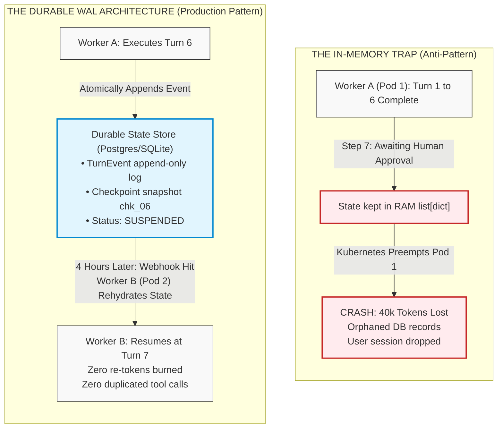
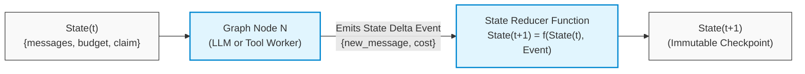
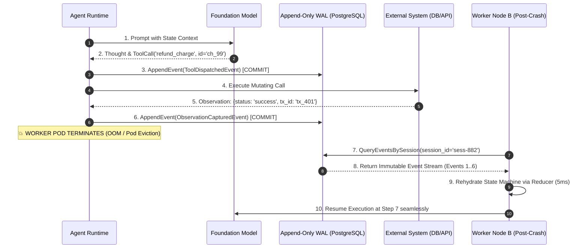
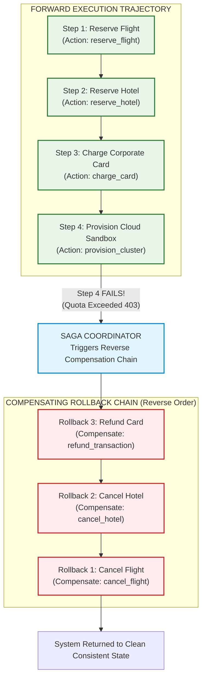
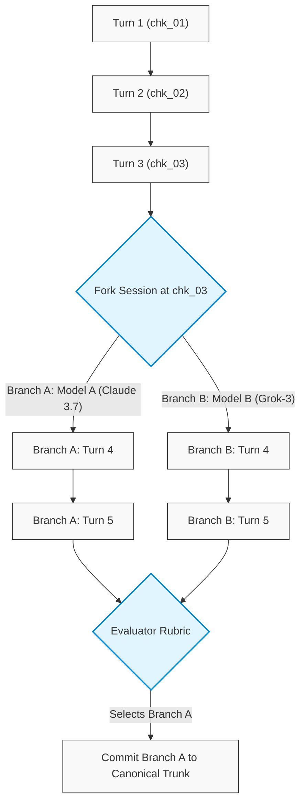
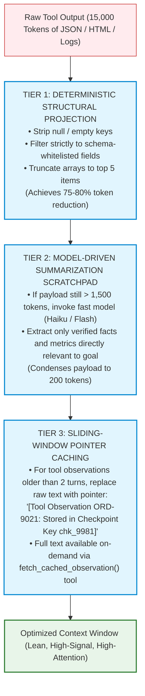
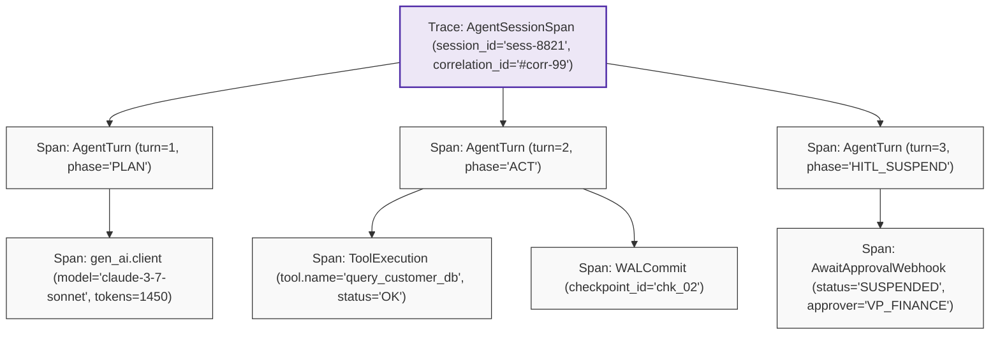

# Stateful Sessions, Durable WAL Persistence & Distributed Sagas

> **Phase 04: Agentic Systems & Orchestration** | Depth Tier: `🟡 Tier 2: Depth` | Estimated Reading Time: 50 min
>
> **Prerequisites**: [Lesson 01: Workflows vs. Autonomous Agents](01-workflows-vs-agents-and-orchestration-patterns.md), [Lesson 02: Autonomous ReAct Loops & Execution Governors](02-react-loops-and-execution-governors.md)

> **Core Concept**: Production agents are long-running stateful distributed systems. When nodes crash, humans pause for approvals, or network partitions occur, the agent must recover seamlessly without re-running expensive LLM steps. Achieving this requires graph state machines with deterministic reducers, Event-Sourced Write-Ahead Log (WAL) persistence, session forking (time travel), and Distributed Sagas with compensating rollback tools.

---

## 1. The Engineering Problem: The In-Memory Volatility Trap

Most open-source agent tutorials maintain conversation history and tool outputs inside a local Python list (`messages: list[dict]`). While this works for short, interactive toy demos, it represents a catastrophic architectural flaw in enterprise production: **the in-memory volatility trap**.

Consider what occurs in a real-world enterprise deployment:
1. **Container Restarts & Preemption**: Kubernetes reschedules a worker pod due to node pressure while an agent is on turn 7 of an 8-turn code refactoring sequence. 45,000 tokens of accumulated reasoning, parsed AST diffs, and intermediate state vanish instantly.
2. **Asynchronous Human-in-the-Loop (HITL) Halts**: An agent requires executive approval to issue a \$5,000 invoice credit. The approval request sits in a director's Slack queue for 4 hours. Keeping a stateful container alive and maintaining an open socket connection for 4 hours wastes infrastructure, blocks worker threads, and leaks memory.
3. **Double-Spend & Corruption During Naive Replay**: If the application crashes and simply restarts the agent from turn 1, the model may re-execute previously completed mutating tools—charging a customer's credit card twice or provisioning duplicate cloud infrastructure.



### Prose Diagram Walkthrough: In-Memory Trap vs. Durable WAL

1. **The In-Memory Trap**: When state exists purely in application memory, pod termination or preemption destroys the execution trajectory. Resuming requires restarting from scratch, incurring duplicate token costs and risking repeated non-idempotent tool calls.
2. **Durable WAL Architecture**: After every cognitive step and tool invocation, the control plane atomically appends an immutable event to an external database (e.g., PostgreSQL or SQLite).
3. **Suspended Execution**: When awaiting human authorization or long-running jobs, the session transitions to `SUSPENDED` and releases all compute resources.
4. **Rehydration**: Any available worker node can query the database by `session_id`, rehydrate the exact state machine in milliseconds, and resume execution without re-invoking the foundation model.

---

## 2. The Mental Model: Graph State Machines & Reducers

To make agent state deterministic, robust architectures model the agent as a **Graph State Machine** governed by **pure reducer functions** (pioneered in modern frameworks like LangGraph):



### Core Primitives of Graph State Machines

1. **State Schema**: A strongly typed data structure (e.g., a Pydantic v2 model) containing all variables required across the session (conversation messages, extracted entities, remaining budget, approval flags).
2. **Nodes**: Isolated, discrete execution units (functions or classes) that receive the current state and return a **State Delta** (a dictionary of updates).
3. **Edges**: Deterministic or conditional routing functions that evaluate state fields and determine which node executes next.
4. **Reducers**: Pure functions that define *how* state deltas are merged into the existing state. Rather than overwriting fields blindly, reducers enforce deterministic mutation rules:
   * *Append Reducer*: Appends new messages or logs to an existing list (`messages = existing_messages + delta_messages`).
   * *Additive Reducer*: Sums token counts or financial spend (`total_cost = existing_cost + turn_cost`).
   * *Overwrite Reducer*: Replaces scalar attributes (`status = delta_status`).

```text
Mathematical Invariant:
State_{t+1} = Reducer(State_t, Event_{t+1})
```

Because state is a pure mathematical function of prior state and discrete transition events, any agent trajectory can be deterministically audited, replayed, or forked.

---

## 3. Event-Sourced Write-Ahead Log (WAL) & Crash Rehydration

The industry standard for durability in mission-critical distributed systems (e.g., PostgreSQL, Kafka, distributed filesystems) is the **Write-Ahead Log (WAL)**. In agentic engineering, an Event-Sourced WAL records every input, thought, action, observation, and state delta to append-only disk storage *before* the runtime yields or mutates external systems.



### Prose Diagram Walkthrough: Event-Sourced WAL & Crash Recovery

1. **Prompt Dispatch**: The runtime dispatches the active state to the foundation model.
2. **Action Emission**: The model generates a Thought and an Action requesting a refund tool call.
3. **Write-Ahead Logging (WAL Commit)**: Before the tool is executed over the network, the runtime writes a `ToolDispatchedEvent` to the database. If the process crashes during network transit, the system knows an execution was initiated.
4. **Tool Execution**: The tool is executed against the payment processor.
5. **Observation Capture**: The external system returns confirmation.
6. **Observation Commit**: The runtime commits the `ObservationCapturedEvent` to the WAL.
7. **The Crash Event**: The active host pod crashes or is evicted by the orchestrator.
8. **Rehydration**: A replacement worker (Worker Node B) picks up the orphaned session, retrieves all events from the WAL, and executes the state reducers sequentially.
9. **Zero-Loss Continuity**: Within 5 milliseconds, the state machine is reconstructed to the exact point of the crash. Worker B resumes execution without re-invoking the model or duplicating the payment refund.

---

## 4. The Distributed Saga Pattern & Compensating Rollback Tools

When an autonomous agent interacts with external APIs, databases, or microservices, distributed transactions cannot rely on classical Two-Phase Commit (2PC) protocols. Enterprise systems are loosely coupled, third-party APIs lack distributed transaction locks, and agent execution trajectories may span minutes or hours.

To ensure transactional integrity, architects implement the **Distributed Saga Pattern with Compensating Transactions**:



### Prose Diagram Walkthrough: Distributed Saga Rollback

1. **Forward Trajectory**: The agent successfully executes Steps 1, 2, and 3, reserving travel and charging a card. Each mutating action is logged to the Saga journal along with its output identifiers (`booking_id`, `charge_id`).
2. **The Terminal Failure**: At Step 4, provisioning the cloud sandbox fails due to an irrecoverable quota exhaustion.
3. **Saga Coordinator Interception**: The control plane halts the agent. It does not allow the model to guess what to do next. Instead, the Saga Coordinator reads the transaction journal in reverse chronological order.
4. **Compensating Rollback Execution**: The coordinator invokes the registered **Compensating Rollback Tool** for each completed step:
   * First, it calls `refund_transaction(charge_id)` to reverse Step 3.
   * Next, it calls `cancel_hotel(booking_id)` to reverse Step 2.
   * Finally, it calls `cancel_flight(booking_id)` to reverse Step 1.
5. **Clean Consistency**: The enterprise environment is restored to a clean state, preventing orphaned financial liabilities or reserved resources.

### The Compensating Tool Contract

Every state-mutating tool registered with an agent orchestrator must declare a registered compensating action:

| Forward Mutating Tool | Execution Arguments | Registered Compensating Tool | Rollback Arguments |
|---|---|---|---|
| `reserve_hotel_room` | `hotel_id`, `guest_id`, `dates` | `cancel_hotel_reservation` | `booking_reference_id` |
| `charge_credit_card` | `customer_id`, `amount_usd` | `refund_credit_card_charge` | `transaction_id`, `reason` |
| `provision_kubernetes_cluster` | `cluster_spec`, `region` | `deprovision_kubernetes_cluster` | `cluster_id`, `force=True` |
| `grant_iam_role` | `principal_email`, `role_arn` | `revoke_iam_role` | `principal_email`, `role_arn` |

---

## 5. Session Forking & Time-Travel Debugging

Because graph checkpoints are stored as immutable snapshots, an agent runtime can **fork** an active session into multiple counterfactual branches:



### Production Applications of Session Forking

1. **Speculative Branching & Exploration**: An agent tasked with resolving a complex production bug can fork at Turn 3 to explore two divergent hypotheses simultaneously (Hypothesis A: Database lock contention; Hypothesis B: Memory leak in worker). The system evaluates both branches in parallel and commits only the successful resolution.
2. **Time-Travel Post-Mortem Debugging**: When an agent hallucinates at Turn 8 in production, engineers do not have to guess what happened. They can load checkpoint `chk_07`, replay Turn 8 in a local sandbox with deterministic mocks, inspect the raw token log-probabilities, and identify the exact prompt flaw.

---

## 6. Context Compaction & Observation Pruning

In long-running ReAct sessions, raw tool responses (e.g., 20-page PDF text extractions, 1,000-line JSON query outputs) quickly saturate the foundation model's context window. This triggers the **Lost in the Middle** effect, where the model forgets its core system instructions and begins hallucinating.

Enterprise runtimes enforce a **Three-Tier Context Pruning Pipeline**:



### Prose Diagram Walkthrough: Context Pruning Pipeline

1. **Tier 1 (Deterministic Structural Projection)**: Before passing API data to the LLM, application code filters out tracking metadata, null values, and internal timestamps, capping array lengths.
2. **Tier 2 (Model-Driven Summarization)**: If the filtered data remains bulky, a sub-second, low-cost model extracts key entities and quantitative metrics into a structured 200-token summary.
3. **Tier 3 (Sliding-Window Pointer Caching)**: Historical tool outputs older than two turns are pruned from the active prompt and replaced with immutable database pointers. If the agent later needs the full JSON, it can invoke a dedicated lookup tool.

---

## 7. Distributed Observability: OpenTelemetry GenAI Semantic Spans

Standard Application Performance Monitoring (APM) tools (e.g., Datadog, New Relic) trace HTTP requests and database queries, but fail to provide visibility into agent reasoning trajectories.

Production agent architectures instrument every step using the **OpenTelemetry (OTel) GenAI Semantic Conventions**:



### Required GenAI Semantic Attributes

| OpenTelemetry Attribute Key | Type | Description & Example |
|---|---|---|
| `gen_ai.system` | `string` | Framework or provider (`openai`, `anthropic`, `langgraph`, `maf`) |
| `gen_ai.request.model` | `string` | Model identifier (`claude-3-7-sonnet-20250219`, `grok-3`) |
| `gen_ai.agent.turn` | `int` | Sequential turn index within the active session (`1`, `2`, `3`) |
| `gen_ai.tool.name` | `string` | Name of the tool invoked (`refund_credit_card_charge`) |
| `gen_ai.tool.call_id` | `string` | Cryptographic correlation hash of tool arguments |
| `gen_ai.saga.action_type` | `string` | Transaction classification (`FORWARD` or `COMPENSATING`) |

---

## 8. Production Python 3.12+ Implementation: SQLite-Backed WAL & Saga Coordinator

Below is a complete, runnable Python 3.12+ implementation demonstrating an **Event-Sourced Write-Ahead Log (WAL)**, **Deterministic State Rehydration**, and a **Saga Rollback Coordinator**.

```python
"""
Production Stateful Agent Runtime with SQLite WAL & Distributed Saga Coordinator
Implements: Append-Only Event Store, Crash Rehydration, and Reverse Compensating Rollbacks.
Stack: Python 3.12+, SQLite3, Pydantic v2, Typed State Reducers
"""

from __future__ import annotations

import json
import sqlite3
from dataclasses import dataclass, field
from enum import StrEnum
from typing import Any, Callable, Dict, List, Optional
from pydantic import BaseModel, Field


# ============================================================================
# 1. EVENT SCHEMAS & REDUCERS
# ============================================================================

class EventType(StrEnum):
    SESSION_INITIALIZED = "SESSION_INITIALIZED"
    THOUGHT_RECORDED = "THOUGHT_RECORDED"
    TOOL_DISPATCHED = "TOOL_DISPATCHED"
    OBSERVATION_CAPTURED = "OBSERVATION_CAPTURED"
    SAGA_STEP_REGISTERED = "SAGA_STEP_REGISTERED"
    SESSION_SUSPENDED = "SESSION_SUSPENDED"
    SESSION_COMPLETED = "SESSION_COMPLETED"


class AgentEvent(BaseModel):
    event_id: Optional[int] = None
    session_id: str
    turn: int
    event_type: EventType
    payload: Dict[str, Any]
    timestamp: Optional[str] = None


class AgentSessionState(BaseModel):
    session_id: str
    current_turn: int = 0
    messages: List[Dict[str, str]] = Field(default_factory=list)
    accumulated_cost_usd: float = 0.0
    saga_journal: List[Dict[str, Any]] = Field(default_factory=list)
    status: str = "ACTIVE"


def state_reducer(state: AgentSessionState, event: AgentEvent) -> AgentSessionState:
    """Pure state reducer: State(t+1) = Reducer(State(t), Event)."""
    state.current_turn = max(state.current_turn, event.turn)

    match event.event_type:
        case EventType.SESSION_INITIALIZED:
            state.status = "INITIALIZED"
        case EventType.THOUGHT_RECORDED:
            state.messages.append({"role": "assistant", "content": event.payload["thought"]})
        case EventType.OBSERVATION_CAPTURED:
            state.messages.append({"role": "tool", "content": json.dumps(event.payload["observation"])})
            state.accumulated_cost_usd += event.payload.get("cost_usd", 0.0)
        case EventType.SAGA_STEP_REGISTERED:
            state.saga_journal.append(event.payload)
        case EventType.SESSION_SUSPENDED:
            state.status = "SUSPENDED"
        case EventType.SESSION_COMPLETED:
            state.status = "COMPLETED"

    return state


# ============================================================================
# 2. SQLITE EVENT-SOURCED WRITE-AHEAD LOG (WAL)
# ============================================================================

class SQLiteEventLog:
    """Durable append-only Write-Ahead Log for agent transactions."""

    def __init__(self, db_path: str = ":memory:") -> None:
        self.db = sqlite3.connect(db_path)
        self.db.row_factory = sqlite3.Row
        self._init_schema()

    def _init_schema(self) -> None:
        with self.db:
            self.db.execute(
                """
                CREATE TABLE IF NOT EXISTS agent_events (
                    event_id INTEGER PRIMARY KEY AUTOINCREMENT,
                    session_id TEXT NOT NULL,
                    turn INTEGER NOT NULL,
                    event_type TEXT NOT NULL,
                    payload TEXT NOT NULL,
                    created_at TIMESTAMP DEFAULT CURRENT_TIMESTAMP
                );
                """
            )
            self.db.execute(
                "CREATE INDEX IF NOT EXISTS idx_sess ON agent_events(session_id);"
            )

    def append_event(self, event: AgentEvent) -> int:
        """Atomically commits an event to the WAL."""
        with self.db:
            cursor = self.db.execute(
                """
                INSERT INTO agent_events (session_id, turn, event_type, payload)
                VALUES (?, ?, ?, ?)
                """,
                (event.session_id, event.turn, event.event_type.value, json.dumps(event.payload)),
            )
            return cursor.lastrowid

    def rehydrate_state(self, session_id: str) -> AgentSessionState:
        """Reconstructs state by replaying all historical events through the reducer."""
        cursor = self.db.execute(
            "SELECT * FROM agent_events WHERE session_id = ? ORDER BY event_id ASC",
            (session_id,),
        )
        state = AgentSessionState(session_id=session_id)
        for row in cursor.fetchall():
            event = AgentEvent(
                event_id=row["event_id"],
                session_id=row["session_id"],
                turn=row["turn"],
                event_type=EventType(row["event_type"]),
                payload=json.loads(row["payload"]),
                timestamp=row["created_at"],
            )
            state = state_reducer(state, event)
        return state


# ============================================================================
# 3. SAGA ROLLBACK COORDINATOR
# ============================================================================

class SagaRollbackCoordinator:
    """Manages forward mutating registrations and reverse compensating executions."""

    def __init__(self, wal: SQLiteEventLog) -> None:
        self.wal = wal
        self.compensating_tool_registry: Dict[str, Callable[[Dict[str, Any]], bool]] = {}

    def register_compensating_tool(
        self, tool_name: str, rollback_fn: Callable[[Dict[str, Any]], bool]
    ) -> None:
        self.compensating_tool_registry[tool_name] = rollback_fn

    def record_forward_step(
        self, session_id: str, turn: int, forward_tool: str, rollback_tool: str, rollback_args: Dict[str, Any]
    ) -> None:
        """Commits a step to the Saga journal in the WAL."""
        self.wal.append_event(
            AgentEvent(
                session_id=session_id,
                turn=turn,
                event_type=EventType.SAGA_STEP_REGISTERED,
                payload={
                    "forward_tool": forward_tool,
                    "rollback_tool": rollback_tool,
                    "rollback_args": rollback_args,
                },
            )
        )

    def execute_saga_rollback(self, session_id: str) -> bool:
        """
        Executes registered compensating actions in REVERSE chronological order.
        """
        state = self.wal.rehydrate_state(session_id)
        print(f"\n[SAGA COORDINATOR] Initiating reverse rollback for session: {session_id}")
        
        # Traverse saga journal in reverse order
        for step in reversed(state.saga_journal):
            rollback_tool = step["rollback_tool"]
            rollback_args = step["rollback_args"]
            print(f"  -> Rolling back: {step['forward_tool']} via {rollback_tool}({rollback_args})")
            
            handler = self.compensating_tool_registry.get(rollback_tool)
            if not handler:
                raise RuntimeError(f"Missing compensating tool handler for: {rollback_tool}")
            
            success = handler(rollback_args)
            if not success:
                print(f"  ❌ CRITICAL: Compensating tool {rollback_tool} failed!")
                return False

        print("[SAGA COORDINATOR] Rollback completed successfully. System state consistent.\n")
        return True


# ============================================================================
# 4. VERIFICATION & SIMULATION RUNNER
# ============================================================================

def mock_cancel_flight(args: Dict[str, Any]) -> bool:
    print(f"     [SYSTEM API] Flight reservation {args['booking_id']} cancelled. Refund credited.")
    return True

def mock_refund_payment(args: Dict[str, Any]) -> bool:
    print(f"     [SYSTEM API] Payment transaction {args['tx_id']} refunded (${args['amount']:.2f}).")
    return True

def main() -> None:
    wal = SQLiteEventLog(":memory:")
    saga = SagaRollbackCoordinator(wal)

    # Register compensating handlers
    saga.register_compensating_tool("cancel_flight_booking", mock_cancel_flight)
    saga.register_compensating_tool("refund_credit_card", mock_refund_payment)

    session_id = "sess-booking-9921"

    # Step 1: Initialize session in WAL
    wal.append_event(AgentEvent(session_id=session_id, turn=0, event_type=EventType.SESSION_INITIALIZED, payload={}))

    # Step 2: Agent executes Step 1 (Book Flight) & logs to Saga
    print("Executing Turn 1: Reserving Flight...")
    saga.record_forward_step(
        session_id=session_id,
        turn=1,
        forward_tool="book_flight_ticket",
        rollback_tool="cancel_flight_booking",
        rollback_args={"booking_id": "FLIGHT-AA-401"},
    )

    # Step 3: Agent executes Step 2 (Charge Card) & logs to Saga
    print("Executing Turn 2: Charging Corporate Card...")
    saga.record_forward_step(
        session_id=session_id,
        turn=2,
        forward_tool="charge_corporate_card",
        rollback_tool="refund_credit_card",
        rollback_args={"tx_id": "TX-902188", "amount": 650.00},
    )

    # Step 4: Step 3 (Book Hotel) Fails with Quota Exceeded!
    print("Executing Turn 3: Booking Hotel -> ❌ FAILS (Room Sold Out 409 Conflict)!")

    # Step 5: Simulate Pod Crash & Rehydration
    print("\n--- SIMULATING CRASH & REHYDRATION ON REPLACEMENT NODE ---")
    rehydrated_state = wal.rehydrate_state(session_id)
    print(f"Rehydrated State: Turn={rehydrated_state.current_turn}, Saga Steps={len(rehydrated_state.saga_journal)}")

    # Step 6: Execute Saga Rollback
    saga.execute_saga_rollback(session_id)


if __name__ == "__main__":
    main()
```

---

## 9. Production Failure Modes & Defensive Invariants

When implementing stateful agents and persistent WALs, enforce these architectural invariants:

### Failure Mode 1: Non-Idempotent Tool Replays
* **The Root Cause**: During crash rehydration or network retries, a tool invocation is executed a second time with the same parameters, producing duplicate charges or duplicated database rows.
* **The Defensive Invariant**: **Cryptographic Idempotency Keys**. Every tool dispatched by the agent must include an `idempotency_key` generated from `SHA256(session_id + str(turn) + tool_name)`. Upstream APIs must cache and reject duplicate keys.

### Failure Mode 2: Unbounded State Reducer Bloat
* **The Root Cause**: Using naive list reducers (`messages.append(msg)`) across a 50-turn session results in multi-megabyte state snapshots. Deserializing and transferring this payload across Redis or PostgreSQL degrades throughput.
* **The Defensive Invariant**: **Periodic Snapshot Compaction**. Every 5 turns, execute an offline compaction worker that prunes raw tool outputs older than 2 turns and commits a compressed snapshot checkpoint.

### Failure Mode 3: Orphaned Saga Compensations
* **The Root Cause**: A compensating tool fails midway through a rollback (e.g., payment gateway returns HTTP 503 during refund), leaving the system in a half-rolled-back state.
* **The Defensive Invariant**: **Persistent Dead-Letter Compensation Queue (DLCQ)**. If a compensating tool fails, write the rollback event to a durable Dead-Letter Queue with exponential backoff and alert the human operations team.

---

## 10. Hands-On Architectural Exercises & Lab Integration

To apply stateful persistence and sagas to real-world architectures:

1. **Stateful Agent with HITL**: Complete [Lab 1: Stateful Agent with HITL Approval](labs/lab1-stateful-agent-hitl.md). Build an agent that persists its state graph to disk and resumes execution after receiving an external webhook.
2. **Distributed Saga Implementation**: Complete [Lab 4: Distributed Saga Pattern for Multi-Step Rollback](labs/lab4-saga-pattern.md). Implement forward execution and reverse compensating transactions across multi-service workflows.
3. **C# Pipeline Architecture**: Review [`examples/MultiAgentPipeline.cs`](examples/MultiAgentPipeline.cs) to inspect how typed enterprise pipelines handle asynchronous message coordination and state checkpoints in .NET ecosystems.

---

## 11. Key Takeaways & Summary

* **State Durability is Non-Negotiable**: Never maintain agent state purely in memory. Container preemption or human approval halts will wipe out accumulated context.
* **Model State as a Graph with Reducers**: Enforce `State_{t+1} = Reducer(State_t, Event_{t+1})` to guarantee deterministic state transitions and seamless time-travel debugging.
* **Event-Sourced WAL Enables Instant Crash Recovery**: Write events to append-only storage before executing tools. Replacement workers can rehydrate state in 5 milliseconds.
* **Every Mutating Action Demands a Compensating Tool**: Implement the Distributed Saga pattern to reverse multi-step actions in reverse topological order when late-stage steps fail.
* **Prune Context Continuously**: Use structural projection, summarization scratchpads, and sliding-window pointer caching to prevent context window saturation.

---

## 🧭 Navigation

| [← Lesson 02: Autonomous ReAct Loops & Execution Governors](02-react-loops-and-execution-governors.md) | [Phase 04 Navigation Hub](README.md) | [Lesson 04: Agent Memory Systems & Cognitive Architectures →](04-agent-memory-systems-and-cognitive-architectures.md) |
|:---:|:---:|:---:|
| **Previous Lesson** | **Phase Hub** | **Next Lesson** |
| [Lab 1: Stateful Agent & HITL](labs/lab1-stateful-agent-hitl.md) | [Lab 4: Distributed Saga Pattern](labs/lab4-saga-pattern.md) | [Capstone: Code Review Engine](labs/capstone-code-review-engine.md) |
