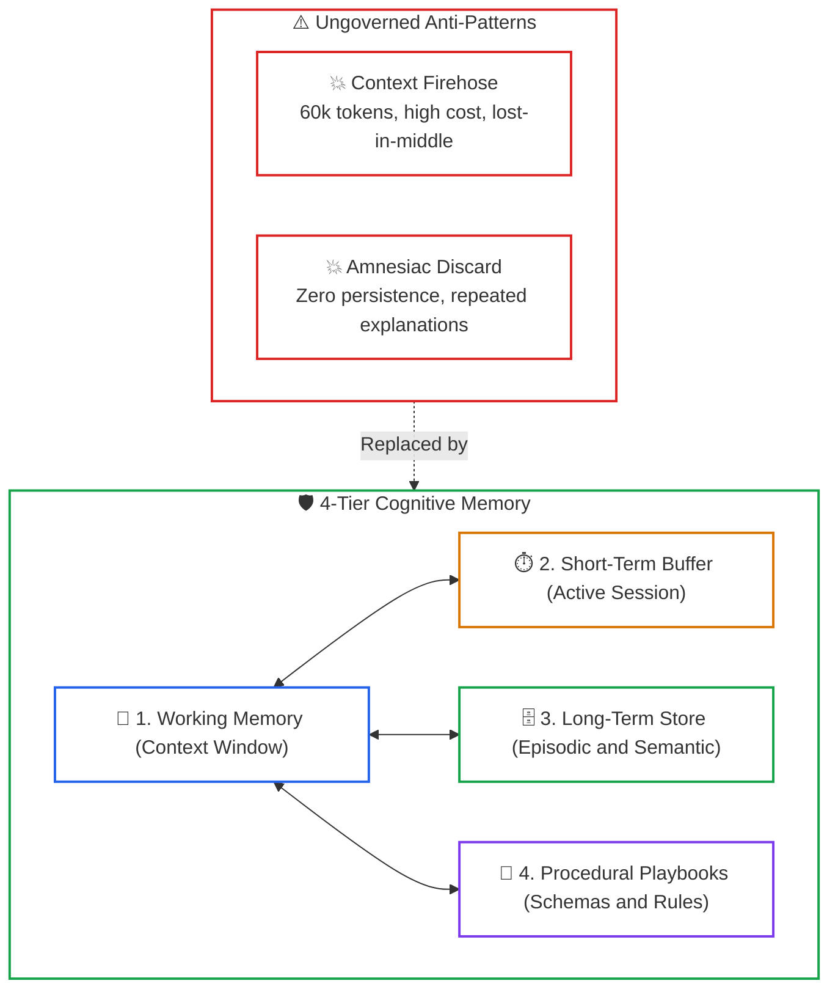
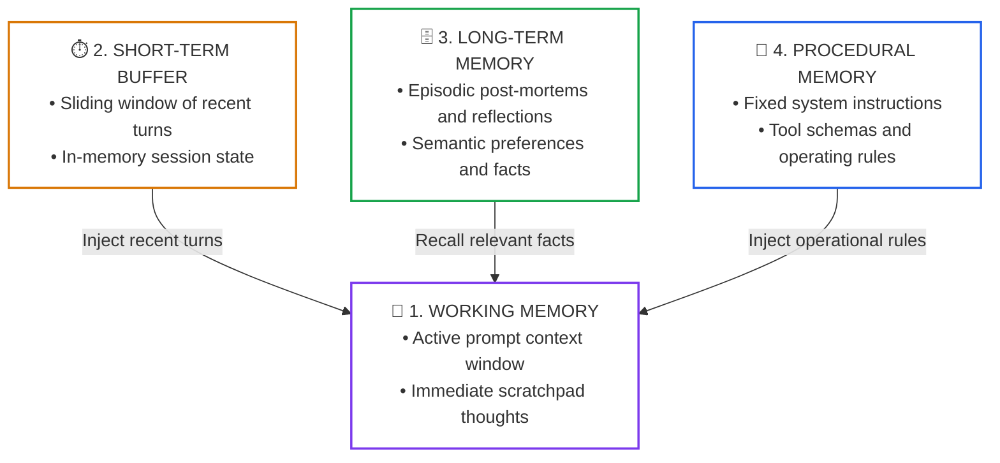
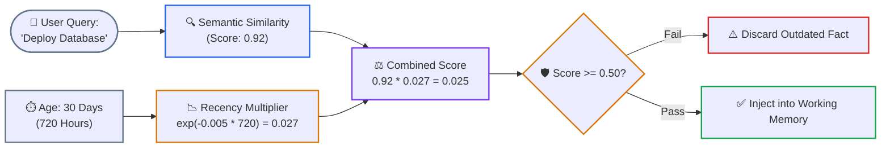
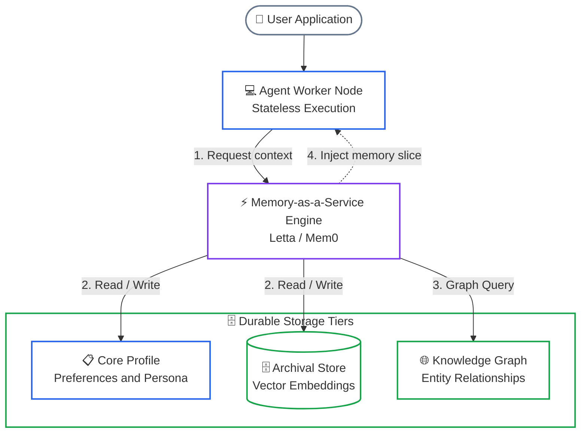
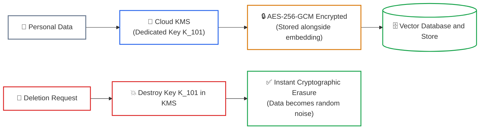

# Lesson 04: Agent Memory Systems & Cognitive Architectures

> **Tier**: `🟡 Engineering Depth` | Estimated Reading Time: 35 min
>
> **Prerequisites**: [Lesson 00: Agentic Systems Fundamentals](00-agentic-systems-and-control-plane-fundamentals.md), [Lesson 01: Workflows vs. Autonomous Agents](01-workflows-vs-agents-and-orchestration-patterns.md), [Lesson 03: Stateful Sessions & Durable Write-Ahead Logs](03-stateful-sessions-and-durable-wal-persistence.md)
>
> **Core Concept**: Language models possess no memory between requests. To remember user preferences and past solutions without overwhelming prompt context, systems organize memory into a 4-Tier Hierarchy: Working Memory (active prompt), Short-Term Buffer (session history), Long-Term Memory (episodic experiences and semantic facts with recency decay), and Procedural Memory (operational rules). Modern architectures manage this using Memory-as-a-Service platforms like Letta and Mem0.
>
> **Term Ledger**:
> * **New AI terms introduced**: `Working Memory`, `Short-Term Memory Buffer`, `Long-Term Memory`, `Episodic Memory`, `Semantic Memory`, `Procedural Memory`, `Memory Compaction`, `Letta / MemGPT Architecture`.
> * **AI terms assumed from earlier lessons**: `AI Agent`, `Context Window`, `Token`, `Prompt`, `Write-Ahead Log (WAL)`, `Retrieval-Augmented Generation (RAG)`.

---

## 1. The Real-World Problem: The Amnesiac Model

Large language models are completely stateless. When you make an API call, the model reads your prompt, generates a response, and completely resets. It retains zero memory of previous conversations, user preferences, or past mistakes unless you explicitly include that information in the prompt.

When teams first try to give an agent "memory," they usually swing between two extremes:



### Why Both Extremes Fail

1. **The Context Firehose**: Stuffing months of chat history into every prompt wastes money and slows down responses. It also triggers 'Lost in the Middle' degradation, where models ignore critical instructions buried in the prompt.
2. **The Amnesiac Agent**: Wiping history completely frustrates users, who have to repeatedly specify their preferred programming language, cloud environment, or corporate spending rules.
3. **The Solution**: Mirroring human cognitive architecture by organizing memory into distinct tiers based on speed, retention time, and purpose.

---

## 2. The Mental Model: The 4-Tier Memory Hierarchy

Enterprise systems organize agent memory into four clear tiers:

> [!NOTE]
> **Where this analogy breaks**: In human memory, biological consolidation happens automatically during sleep without software intervention. In an AI agent, memory consolidation requires active, scheduled software jobs (summarizers, vector indexing, graph extraction) that incur token costs and API latency.



### Walkthrough: 4-Tier Memory Hierarchy
1. **Working Memory**: The immediate token context window holding the active scratchpad and current step.
2. **Short-Term Buffer**: A sliding FIFO window of recent turns maintaining conversational continuity.
3. **Long-Term Memory**: Persistent vector and document stores queried via semantic retrieval.
4. **Procedural Memory**: Fixed operational schemas, system instructions, and tool definitions.

### The 4 Tiers Explained Simply

| Memory Tier | What it Holds | How it is Stored | How Fast is Access? | How Long is it Kept? | Everyday Example |
|---|---|---|:---:|---|---|
| **Tier 1: Working Memory** | The current prompt tokens and active tool output | GPU context window | Instant (<1 ms) | Single request turn | The specific customer question and order record being analyzed right now. |
| **Tier 2: Short-Term Buffer** | The last few turns in the ongoing chat | In-memory cache or Redis list | 1 – 5 ms | Current session (minutes to hours) | Turns 1 through 5 of an ongoing troubleshooting conversation. |
| **Tier 3: Long-Term Episodic** | Past experiences and past failure post-mortems | Vector database (pgvector, Qdrant) | 15 – 50 ms | Weeks to months | Recalling that a similar database deployment failed last week due to a missing index. |
| **Tier 3: Long-Term Semantic** | Enduring facts, user preferences, and business rules | Relational database or Knowledge Graph | 10 – 40 ms | Permanent until updated | Remembering that the engineering team uses Python 3.12 and PostgreSQL. |
| **Tier 4: Procedural Memory** | Instructions, tool definitions, and standard procedures | Code, system prompt, and schemas | Instant (Pre-compiled) | Permanent across all users | The standard operating procedure for validating invoices and calling the refund API. |

---

## 3. Long-Term Memory: Fact Extraction & Recency Decay

### Key AI Terms for This Section

Before we discuss long-term memory retrieval, two AI-specific concepts are essential:

* **Embedding (Vector Representation)**: An embedding is a list of numbers (called a vector) that represents the *meaning* of a piece of text. Two texts with similar meanings produce vectors that point in similar directions, even if they use completely different words. For example, "database server crashed" and "DB instance went down" would produce vectors pointing in nearly the same direction. Embeddings are generated by a specialized neural network (an embedding model) — not the same model that generates chat responses.
* **Cosine Similarity**: A mathematical measure of how closely two vectors align. A score of `1.0` means the texts are semantically identical, `0.0` means completely unrelated. Think of it like measuring the angle between two arrows — the smaller the angle, the more similar the meaning.

Long-term memory is more than just dumping transcripts into a search index. If you simply perform a raw keyword or vector search, you run into **retrieval pollution**: the model retrieves an outdated fact from eight months ago instead of the user's updated rule from yesterday.

### Recency Decay: Prioritizing Fresh Information

In real life, recent facts are usually more relevant than older ones. To achieve this in software, the runtime calculates a **Recency-Weighted Score** that combines semantic relevance with the age of the memory:

```text
Final Score = (Semantic Relevance) * exp(-decay_rate * elapsed_time)
```

Where:
* **Semantic Relevance**: How closely the memory matches the current query (between 0.0 and 1.0).
* **Elapsed Time**: The time that has passed since the memory was created or last used (in hours or days).
* **Decay Rate**: How quickly memories fade (e.g., `0.005` per hour).
* **Exponential Multiplier**: A multiplier that smoothly decreases toward zero as time passes.



### Walkthrough: Recency Decay Pipeline
1. **Semantic Similarity**: Vector cosine comparison matches historical memories against the incoming prompt.
2. **Exponential Age Penalty**: The elapsed time applies an exponential decay multiplier.
3. **Composite Scoring**: Multiplication blends relevance and recency into a unified confidence metric.
4. **Threshold Gate**: Memories below the relevance threshold are discarded, preventing stale information from entering context.

#### How Recency Decay Works in Practice

1. **Semantic Matching**: The agent looks for memories related to database deployment and finds an old note: *"Use PostgreSQL version 13."* The semantic similarity is high (0.92).
2. **Age Penalty**: The system checks the timestamp and sees the memory is 30 days old. Applying the decay function drops the multiplier down to 0.027.
3. **Combined Filtering**: The final score drops to 0.025. Because this is well below the minimum threshold (0.50), the outdated fact is ignored, allowing the recent instruction (*"Use PostgreSQL version 16"*) to take precedence.

---

## 4. Memory-as-a-Service: Letta (MemGPT) & Mem0

In production architectures, memory management is decoupled from the agent runtime into a dedicated **Memory-as-a-Service** layer:



### Walkthrough: Memory-as-a-Service Architecture
1. **Request Interception**: Incoming queries reach the stateless agent worker.
2. **Context Injection**: The memory service queries storage backends and injects relevant memory slices.
3. **Self-Editing Tools**: The model modifies persistent memory blocks via dedicated tool calls.
4. **Asynchronous Fact Extraction**: Background workers index conversations and update long-term knowledge graphs.

### Two Major Frameworks Explained

* **Letta (formerly MemGPT)**: Works like **virtual memory** in an operating system. Your context window is treated like computer RAM, while external databases act like a hard drive. When the context window fills up, Letta automatically pages older text out to the database, keeping only critical persona facts in active RAM.
* **Mem0**: Acts like an **automatic research assistant**. As the user chats, a background worker analyzes the conversation, extracts key facts and preferences, and links them into an entity knowledge graph without slowing down the active chat.

---

## 5. Privacy & Data Protection: The Crypto-Shredding Pattern

When an AI agent retains long-term memory across sessions, it falls under global data privacy laws like GDPR (General Data Protection Regulation) and CCPA. Specifically, GDPR Article 17 grants users the **"Right to be Forgotten"**.

### The Problem with Vector Databases
If an agent embeds a customer's personal data into a vector database, removing that data upon request is surprisingly difficult. Finding, deleting, and re-indexing millions of high-dimensional vectors across clustered databases is slow, expensive, and can corrupt search performance.

### The Solution: The Crypto-Shredding Pattern



#### How Crypto-Shredding Works

1. **Individual Encryption Keys**: Every user is assigned a unique encryption key managed in a secure Key Management Service.
2. **Encrypted Storage**: The text of the memory is encrypted with the user's specific key before being saved. The embedding vector itself contains no direct personal identifiers.
3. **Instant Deletion via Key Destruction**: When a user asks to delete their data, you do not need to re-index your entire database. You simply delete the user's key from your key service. Without the key, the encrypted text is mathematically impossible to read, fulfilling data deletion requirements in milliseconds.

---

## 6. Production Python 3.12+ Implementation: Multi-Tier Memory Manager

Here is a complete, runnable Python 3.12+ implementation of an enterprise `AgentMemoryManager` demonstrating:
1. **Working Memory Context Assembly**
2. **Short-Term Sliding-Window Buffer**
3. **Long-Term Episodic Memory with Recency Decay**
4. **Explicit Core Memory Editing Tools**

```python
"""
Enterprise 4-Tier Agent Memory Manager
Implements: Working Context, Short-Term Buffer, Long-Term Memory with Recency Decay.
Tech Stack: Python 3.12+, Pydantic v2, Typed Schemas, Vector Math
"""

from __future__ import annotations

import math
import time
from collections import deque
from typing import Any, Dict, List, Optional
from pydantic import BaseModel, Field


# ============================================================================
# 1. MEMORY DATA MODELS
# ============================================================================

class UserCoreProfile(BaseModel):
    user_id: str
    preferred_language: str = "Python"
    team_role: str = "Staff Architect"
    persistent_rules: List[str] = Field(default_factory=list)


class StoredMemoryItem(BaseModel):
    memory_id: str
    user_id: str
    text_content: str
    embedding: List[float] = Field(description="Normalized vector representation")
    created_at_epoch: float = Field(default_factory=time.time)
    last_accessed_epoch: float = Field(default_factory=time.time)
    access_count: int = 0


class AssembledPromptContext(BaseModel):
    system_instructions: str
    user_profile: UserCoreProfile
    recalled_long_term_memories: List[str]
    recent_conversation_turns: List[Dict[str, str]]


# ============================================================================
# 2. THE MULTI-TIER MEMORY MANAGER
# ============================================================================

class AgentMemoryManager:
    """
    Manages Working, Short-Term, and Long-Term memory tiers.
    Enforces recency decay and provides memory editing tools.
    """

    def __init__(
        self,
        user_id: str,
        short_term_capacity: int = 4,
        decay_rate_per_hour: float = 0.005,
    ) -> None:
        self.user_id = user_id
        self.short_term_capacity = short_term_capacity
        self.decay_rate_per_hour = decay_rate_per_hour

        # Tier 4: Core User Profile / Rules
        self.user_profile = UserCoreProfile(user_id=user_id)

        # Tier 2: Short-Term Conversation Buffer (Sliding Window)
        self.short_term_buffer: deque[Dict[str, str]] = deque(maxlen=short_term_capacity)

        # Tier 3: Long-Term Memory Store (Simulated Vector Collection)
        self.long_term_memories: List[StoredMemoryItem] = []

    # ------------------------------------------------------------------------
    # TIER 2: SHORT-TERM BUFFER
    # ------------------------------------------------------------------------
    def add_message(self, role: str, content: str) -> None:
        """Appends a turn to the active session buffer."""
        self.short_term_buffer.append({"role": role, "content": content})

    # ------------------------------------------------------------------------
    # TIER 3: LONG-TERM STORAGE & RECENCY DECAY RETRIEVAL
    # ------------------------------------------------------------------------
    def save_long_term_memory(self, text: str, embedding: List[float]) -> str:
        """Stores a new memory item in long-term storage."""
        item_id = f"mem_{len(self.long_term_memories) + 1:04d}"
        item = StoredMemoryItem(
            memory_id=item_id,
            user_id=self.user_id,
            text_content=text,
            embedding=embedding,
        )
        self.long_term_memories.append(item)
        return item_id

    def recall_memories(
        self, query_embedding: List[float], minimum_score: float = 0.40
    ) -> List[str]:
        """
        Retrieves memories scored by: Similarity * exp(-decay * hours_elapsed).
        """
        current_time = time.time()
        scored_items = []

        for item in self.long_term_memories:
            # 1. Cosine similarity between normalized vectors
            similarity = sum(a * b for a, b in zip(query_embedding, item.embedding))
            similarity = max(0.0, min(1.0, similarity))

            # 2. Calculate recency decay factor
            hours_elapsed = (current_time - item.created_at_epoch) / 3600.0
            decay_factor = math.exp(-self.decay_rate_per_hour * hours_elapsed)

            # 3. Composite score
            final_score = similarity * decay_factor

            if final_score >= minimum_score:
                scored_items.append((final_score, item))

        # Sort highest score first
        scored_items.sort(key=lambda x: x[0], reverse=True)

        results = []
        for score, item in scored_items[:3]:
            item.last_accessed_epoch = current_time
            item.access_count += 1
            results.append(f"[{item.memory_id} | Score: {score:.2f}] {item.text_content}")

        return results

    # ------------------------------------------------------------------------
    # TIER 1: WORKING CONTEXT ASSEMBLY
    # ------------------------------------------------------------------------
    def build_working_context(self, active_query_embedding: List[float]) -> AssembledPromptContext:
        """Assembles a clean, focused context window for the model prompt."""
        recalled = self.recall_memories(active_query_embedding)
        return AssembledPromptContext(
            system_instructions=(
                "You are an expert AI assistant. Follow user preferences and verified historical guidelines."
            ),
            user_profile=self.user_profile,
            recalled_long_term_memories=recalled,
            recent_conversation_turns=list(self.short_term_buffer),
        )

    # ------------------------------------------------------------------------
    # TOOL: EDIT USER RULES
    # ------------------------------------------------------------------------
    def tool_add_user_rule(self, rule: str) -> str:
        """Tool called by the agent when the user establishes a new ongoing rule."""
        if rule not in self.user_profile.persistent_rules:
            self.user_profile.persistent_rules.append(rule)
            return f"Rule saved to user profile: '{rule}'"
        return "Rule already exists."


# ============================================================================
# 3. RUNNER & SIMULATION
# ============================================================================

def main() -> None:
    manager = AgentMemoryManager(user_id="user_developer_99", decay_rate_per_hour=0.01)

    # 1. User sets a persistent rule
    manager.tool_add_user_rule("All production SQL queries must use prepared statements.")

    # 2. Add an older memory (created 120 hours ago)
    manager.save_long_term_memory(
        text="Database incident: Worker pool stalled due to missing index on orders table.",
        embedding=[0.90, 0.10, 0.00],
    )
    # Simulate aging by adjusting created_at
    manager.long_term_memories[-1].created_at_epoch = time.time() - (120 * 3600)

    # 3. Add a fresh memory (created right now)
    manager.save_long_term_memory(
        text="Database fix: Added connection pooling using PgBouncer, resolving connection spikes.",
        embedding=[0.92, 0.08, 0.00],
    )

    # 4. Add recent chat turns
    manager.add_message("user", "We are setting up the database connection pool.")
    manager.add_message("assistant", "I recommend configuring PgBouncer with transaction-level pooling.")

    # 5. User asks a new database question
    query_vector = [0.91, 0.09, 0.00]
    prompt_context = manager.build_working_context(query_vector)

    print("=== Assembled Prompt Context for Language Model ===")
    print(prompt_context.model_dump_json(indent=2))


if __name__ == "__main__":
    main()
```

---

## 7. Quick Check

A customer support agent needs to remember that a VIP user prefers Python over TypeScript for all code examples, and also needs access to a 500-page internal knowledge base.

How should the agent architect partition these two memory requirements across the memory hierarchy?

<details>
<summary>View Answer</summary>

**Partitioning Architecture**:
1. **User Language Preference**: Store in **Core Memory (RAM)** as a pinned profile block inside the working context. The model reads it on every turn without needing vector search and can update it using self-editing memory tools (`update_user_preference`).
2. **500-Page Knowledge Base**: Store in **Archival Memory (Disk/SSD)** as chunked embeddings in a vector database. The agent retrieves relevant chunks on-demand via semantic search tools rather than stuffing the raw document into active prompt context.
</details>

---

## 8. Key Takeaways & Summary

* **Models are Stateless by Nature**: Real persistence requires external storage systems and clean memory layers.
* **The 4-Tier Memory Hierarchy**:
  1. *Working Memory*: Active prompt context (fast, token-limited).
  2. *Short-Term Buffer*: Recent dialogue turns within the ongoing session.
  3. *Long-Term Memory*: Past experiential episodes and general facts.
  4. *Procedural Memory*: Fixed system rules, tool definitions, and standard procedures.
* **Recency Decay Prevents Outdated Advice**: Multiplying similarity scores by an age decay function ensures new facts naturally supersede older ones.
* **Memory-as-a-Service Decouples Storage**: Systems like Letta (virtual memory paging) and Mem0 (automatic entity extraction) let your compute nodes stay stateless.
* **Crypto-Shredding Simplifies Privacy Compliance**: Encrypting each user's memory with their own key lets you fulfill GDPR deletion requests in milliseconds simply by deleting the key.

---

## 🧭 Navigation

* **Previous Lesson**: [← Lesson 03: Stateful Sessions, Durable Write-Ahead Logs & Distributed Sagas](03-stateful-sessions-and-durable-wal-persistence.md)
* **Phase 04 Hub**: [Phase 04 Overview](README.md)
* **Next Lesson**: [Lesson 05: Multi-Agent Coordination, Handoffs, and the Linux Foundation Agent2Agent (A2A) Protocol →](05-multi-agent-coordination-and-a2a-protocols.md)
* **Capstone Lab**: [Capstone Challenge: Code Review Agent Engine](labs/capstone-code-review-engine.md)
