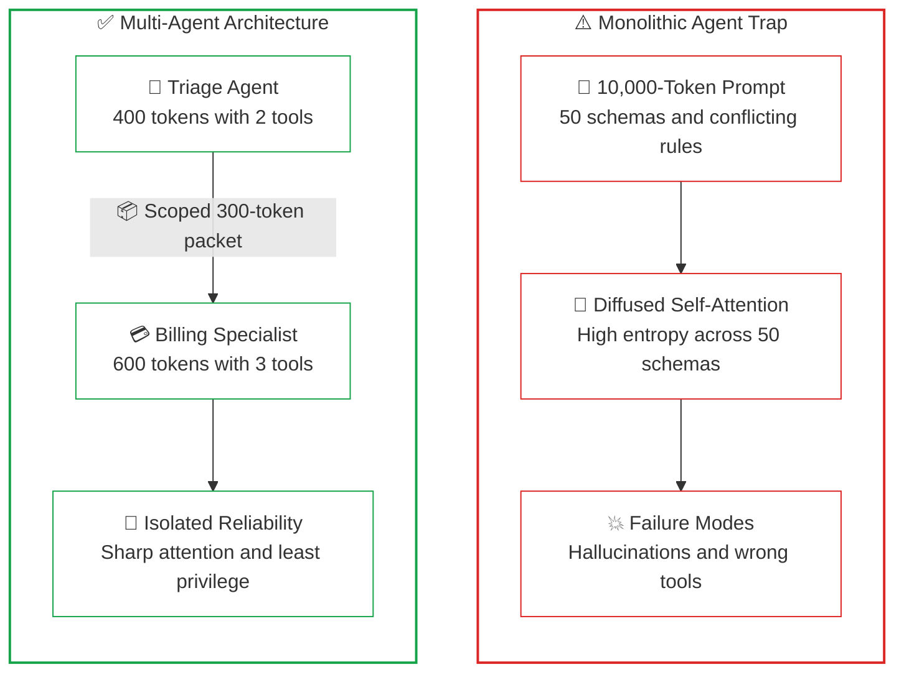
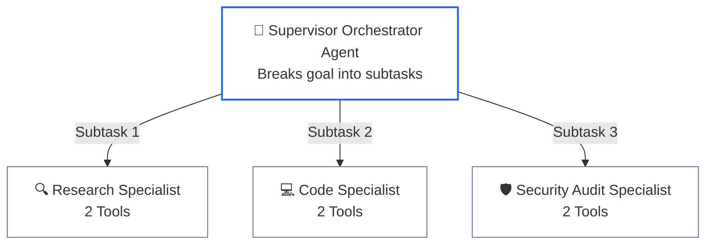
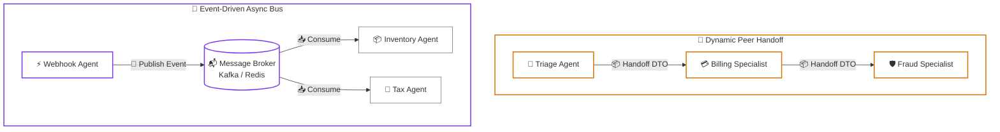
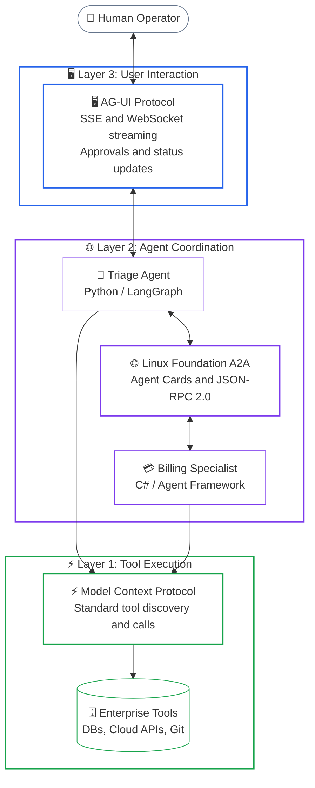

# Lesson 05: Multi-Agent Coordination, Handoffs, and the Linux Foundation Agent2Agent (A2A) Protocol

> **Tier**: `🔵 Advanced` | Estimated Reading Time: 40 min
>
> **Prerequisites**: [Lesson 00: Agentic Systems Fundamentals](00-agentic-systems-and-control-plane-fundamentals.md), [Lesson 01: Workflows vs. Autonomous Agents](01-workflows-vs-agents-and-orchestration-patterns.md), [Lesson 02: Autonomous ReAct Loops & Execution Governors](02-react-loops-and-execution-governors.md), [Lesson 03: Stateful Sessions, Durable WAL & Distributed Sagas](03-stateful-sessions-and-durable-wal-persistence.md), [Phase 03: Tools & Model Context Protocol](../03-tools-and-model-context-protocol/README.md)
>
> **Core Concept**: When an application registers dozens of tools with a single model, prompt schemas consume thousands of tokens, triggering attention diffusion and parameter hallucination. Enterprise systems divide work across specialized agents, each managing an isolated loop with narrow prompts and 3 to 5 domain-specific tools. Connecting these agents across systems relies on the Tri-Protocol Stack: MCP (vertical tools), Linux Foundation A2A (horizontal inter-agent delegation), and AG-UI (user-facing event streaming).
>
> **Term Ledger**:
> * **New AI terms introduced**: `Multi-Agent System`, `Agent-to-Agent (A2A) Protocol`, `Agent Card`, `Handoff Pattern`, `Supervisor-Worker Topology`, `Context Contamination`.
> * **AI terms assumed from earlier lessons**: `AI Agent`, `Control Plane`, `Compute Plane`, `ReAct Pattern`, `Context Window`, `Token`, `Prompt`, `Function Calling`, `Tool Schema`.

---

## 1. The Systems Problem: Why Single "Monolithic" Agents Fail

In traditional software engineering, seasoned developers know that creating a single "god class" containing 50 disparate API clients, database connections, and business rules violates the Single Responsibility Principle and creates an unmaintainable codebase.

In AI engineering, building a single "do-everything" agent fails for an even more fundamental, mathematical reason: **how transformer models process prompt context**.



### Walkthrough: Monolithic Trap vs. Multi-Agent Specialization
1. **Monolithic Prompt Bloat**: Stacking 50 JSON schemas inflates the prompt to 10,000 tokens before user input arrives.
2. **Self-Attention Diffusion**: Attention scores distribute thinly across overlapping schema parameters, flattening probability mass.
3. **Operational Failure**: The model selects incorrect tools or hallucinates required parameters under high entropy.
4. **Triage Routing**: In a multi-agent topology, a lightweight triage agent inspects intent with only 2 routing tools.
5. **Scoped Delegation**: Work transfers via a compact 300-token packet to a dedicated billing specialist with only 3 domain tools.
6. **Fidelity Preservation**: Focused attention budgets yield near-zero tool hallucinations and enforce least-privilege security.

### The AI Mechanics: What Happens Inside the Model?

To understand why a monolithic agent fails, we must examine the internal mechanics of LLM inference:

1. **How Tools Actually Work (Tool Schemas as Prompt Prefixes)**:
   A foundation model does not have direct socket connections or operating system bindings. When an application gives an LLM tools, the host orchestrator converts each tool signature into a structured **JSON Schema** (specifying the function name, docstring description, argument names, and types). These schemas are serialized into text and prepended to the system prompt.
2. **Context Window Token Bloat**:
   Configuring 50 enterprise tools causes schemas to consume 6,000 to 10,000 tokens before the user enters a query. This token bloat inflates latency and costs.
3. **Attention Diffusion and Entropy**:
   During transformer inference, the model computes self-attention scores between every token in the prompt. When 50 similar schemas are present—each containing overlapping argument names such as `user_id`, `account_id`, `customer_uuid`, `transaction_token`—the model's attention weights diffuse across multiple candidate tokens. Instead of concentrating high probability mass onto the single correct function name, the probability distribution over candidate tokens becomes flat and noisy.
4. **Prompt Instruction Collision**:
   Combining contradictory instructions in a single prompt forces the model to blend conflicting goals. As a result, the model frequently ignores critical compliance rules.
5. **Security Perimeter Collapse**:
   An agent with both search and database write tools creates security vulnerabilities. Indirect prompt injections can hijack the agent to execute unauthorized mutations.

### The Solution: Agent Specialization & Separation of Concerns

Just as microservice architectures decompose monolithic backends into dedicated services, enterprise AI systems decompose monolithic agents into **specialized agents**:
* Each specialized agent operates with a focused system prompt (300 to 800 tokens).
* Each agent receives only **3 to 5 tools** strictly required for its specific domain.
* Sensitive financial or administrative tools are isolated inside gated specialists requiring cryptographic authentication or Human-in-the-Loop (HITL) approval gates.

---

## 2. The Mental Model: The Three Multi-Agent Topologies

When coordinating multiple specialized agents, distributed systems architects implement one of three standard structural patterns:

> [!NOTE]
> **Where this analogy breaks**: In human team hierarchies, specialist employees can improvise, resolve unstated ambiguities over watercooler conversations, and push back on flawed managerial assumptions. In multi-agent systems, agents cannot improvise beyond their tool schemas. If an orchestrator's task prompt is ambiguous, the specialist either halts with an unhandled exception or hallucinates valid-looking arguments.

### Topology A: Supervisor-Worker (Centralized Orchestrator)



### Walkthrough: Supervisor-Worker Topology
1. **Goal Ingestion**: The supervisor agent receives the primary user objective.
2. **Subtask Decomposition**: The supervisor decomposes the objective into isolated subtasks.
3. **Delegated Execution**: Workers execute their narrow subtasks in parallel without knowing about peer workers.
4. **Synthesis**: The supervisor collects verified findings and synthesizes the unified final response.

### Topologies B & C: Dynamic Handoffs and Event Bus



### Walkthrough: Dynamic Handoffs & Event Bus
1. **Dynamic Handoff**: A triage agent evaluates customer intent and delegates execution to a specialized billing agent.
2. **Context Passing**: State transfers via a lean Data Transfer Object without forwarding raw conversational bloat.
3. **Event Bus Decoupling**: For asynchronous background workloads, agents publish and subscribe to durable message queues.

### Topology Trade-offs Explained Simply
* **Supervisor-Worker**: A central supervisor acts as the primary contact point. It inspects the incoming user request and queries available specialist profiles. It dispatches subtasks with tailored prompt packets.
* **Dynamic Handoffs**: Agents operate as peer nodes in a state machine. When an agent detects a different domain intent, it invokes a handoff tool (`transfer_to_billing`). Standardized by the OpenAI Agents SDK (`openai-agents`).
* **Asynchronous Event Bus**: Decouples agent execution across message brokers (Kafka, RabbitMQ, SQS) for background batch processing.

---

## 3. Context Passing Patterns: Scoped Handoff Packets vs. Full History Dumps

When execution transitions from Agent A to Agent B, how should state and conversation history be transmitted?

```mermaid
flowchart TD
    subgraph AntiPattern["⚠️ Anti-Pattern: Full History Dump"]
        AP_A["🤖 Agent A Session<br/>Raw DB: 18,000 Tokens"]
        --> AP_Dump["💥 Unfiltered Dump<br/>Full scratchpad dump"]
        --> AP_B["⚠️ Agent B Context<br/>18,000 Tokens saturated"]
    end

    subgraph BestPractice["✅ Best Practice: Scoped DTO Packet"]
        BP_A["🤖 Agent A Session<br/>Filters facts and tool data"]
        --> BP_DTO["📦 Scoped Handoff DTO<br/>Pydantic Schema: 350 Tokens"]
        --> BP_B["🎯 Agent B Context<br/>Lean prompt: 85% token cut"]
    end

    style AntiPattern fill:none,stroke:#dc2626,stroke-width:2px
    style BestPractice fill:none,stroke:#16a34a,stroke-width:2px
    style AP_A stroke:#dc2626,stroke-width:1px,fill:none
    style AP_Dump stroke:#dc2626,stroke-width:1px,fill:none
    style AP_B stroke:#dc2626,stroke-width:1px,fill:none
    style BP_A stroke:#16a34a,stroke-width:1px,fill:none
    style BP_DTO stroke:#16a34a,stroke-width:1px,fill:none
    style BP_B stroke:#16a34a,stroke-width:1px,fill:none
```



### Walkthrough: History Dumps vs. Scoped Handoff DTOs
1. **Unfiltered Dump (Anti-Pattern)**: Agent A dumps raw tool outputs, intermediate JSON blobs, and reasoning scratchpads (18,000 tokens) into Agent B's prompt.
2. **Context Saturation**: Agent B suffers from inflated inference latency, exponential token costs, and attention distraction from irrelevant SQL headers.
3. **Targeted Extraction (Best Practice)**: Agent A extracts only validated conclusions and remaining goals into a strongly typed Pydantic Data Transfer Object (~350 tokens).
4. **Isolated Reception**: Agent B initializes with its lean system prompt and the 350-token handoff packet, cutting token load by 85% with zero distraction.

### The Architectural Flaw of Dumping Full Conversation History
In naive multi-agent implementations, developers simply append the entire message history of Agent A (including internal reasoning thoughts, intermediate tool outputs, and error retries) into the prompt of Agent B. This causes three severe failures:
1. **Context Window Saturation**: If Agent A consumed 18,000 tokens querying a database, Agent B immediately inherits that 18,000-token footprint, driving up inference latency and API costs.
2. **Error and Scratchpad Contamination**: Transferring entire scratchpads causes error and context contamination. The target agent inherits messy intermediate errors and loses domain focus.
3. **Irrelevant Information Distraction**: Agent B does not need to see the raw SQL query strings or HTTP headers that Agent A used; Agent B only needs the verified conclusion.

### The Production Solution: Scoped Handoff Packets (Data Transfer Objects)
Before handing off control, the active agent serializes its findings into a strongly typed **Scoped Handoff Packet** (Data Transfer Object) defined by a Pydantic schema:

```python
from pydantic import BaseModel


class ScopedHandoffPacket(BaseModel):
    customer_id: str
    verified_facts: list[str]       # Grounded conclusions verified by tools
    completed_actions: list[str]    # Tools already successfully run
    remaining_goal: str             # Explicit objective delegated to recipient
```

When Agent B boots up, its prompt context contains only:
1. Its own lean system prompt (500 tokens).
2. Its 3 domain-specific tools (600 tokens).
3. The scoped handoff packet (350 tokens).

Total input tokens: **~1,450 tokens** instead of 20,000 tokens—an **85% to 90% reduction in token consumption** with zero attention dilution.

---

## 4. The Tri-Protocol Stack: Standardizing Enterprise Agent Communication

As multi-agent ecosystems scale across different engineering teams, programming languages, and cloud providers, connecting agents cannot rely on proprietary Python library wrappers. The software industry has standardized on the **Tri-Protocol Stack**:



### Walkthrough: The Tri-Protocol Stack
1. **Vertical Upward (AG-UI)**: Streams thought milestones, status updates, and interactive approval gates to the end user.
2. **Horizontal Inter-Agent (A2A)**: Bridges heterogeneous agents across different frameworks using standardized Agent Cards and JSON-RPC 2.0.
3. **Vertical Downward (MCP)**: Standardizes host-to-tool invocation across databases, cloud platforms, and internal microservices.

### The Three Layers Defined

1. **Layer 1: The Vertical Tool Axis — Model Context Protocol (MCP)**:
   * **Creator & Standards Body**: Open-source specification initiated by Anthropic (2024–2026).
   * **Function**: Connects an agent *downward* to tools, databases, file systems, and enterprise services.
   * **Wire Format**: JSON-RPC 2.0 messages transmitted over local standard input/output (`stdio`) for local development or Server-Sent Events (`SSE`) over HTTP for distributed microservices.
   * **Why It Matters**: Decouples tool authors from agent framework authors. A database team can write an MCP server in Go, and any agent written in Python, C#, or TypeScript can discover and execute its tools without bespoke wrappers.
2. **Layer 2: The Horizontal Agent Axis — Linux Foundation Agent-to-Agent (A2A) Protocol**:
   * **Creator & Standards Body**: Governed by the Linux Foundation (established 2025/2026).
   * **Function**: Connects independent agents *horizontally* across different teams, servers, programming languages, and cloud providers.
   * **Wire Format**: HTTP/JSON-RPC 2.0 with cryptographic mutual TLS (mTLS) or OAuth2 Bearer tokens.
   * **Discovery Mechanism**: Every agent publishes an **Agent Card** (`agent-card.json`) that advertises its capabilities, required input schemas, and authorization scopes.
   * **Why It Matters**: Prevents vendor lock-in. A LangGraph agent running on AWS can discover and delegate an accounting subtask to a Microsoft Agent Framework agent running on Microsoft Azure.
3. **Layer 3: The Human Interaction Axis — Agent-User Interface (AG-UI)**:
   * **Function**: Connects agents *upward* to end users, browser frontends, and native mobile clients.
   * **Wire Format**: Bidirectional WebSocket or Server-Sent Events (SSE) event streams.
   * **Capabilities**: Streams the agent's real-time thought progress, tool execution status indicators, and modal interactive prompts for Human-in-the-Loop authorization.

---

## 5. Linux Foundation Agent-to-Agent (A2A) Protocol Specification

### The Machine-Readable Agent Card (`agent-card.json`)
Before an agent can participate in an enterprise A2A mesh, it registers its Agent Card with the central service registry (such as Consul, Kubernetes service discovery, or an enterprise Agent Registry):

```json
{
  "a2a_version": "1.0.0",
  "agent_id": "urn:enterprise:agents:billing-specialist",
  "name": "Enterprise Billing Specialist",
  "description": "Specialized financial agent for invoice dispute reconciliation and ledger adjustments.",
  "owner_team": "finance-platform@enterprise.com",
  "authentication": {
    "type": "oauth2_bearer",
    "scopes": ["billing:read", "billing:adjust:write"]
  },
  "capabilities": [
    {
      "action_name": "reconcile_dispute",
      "description": "Validates charge discrepancies against ERP invoices and executes authorized credit adjustments.",
      "input_schema": {
        "type": "object",
        "required": ["invoice_id", "disputed_amount_usd", "customer_id"],
        "properties": {
          "invoice_id": { "type": "string" },
          "customer_id": { "type": "string" },
          "disputed_amount_usd": { "type": "number", "minimum": 0.01 }
        }
      }
    }
  ]
}
```

### The Standardized Task Lifecycle State Machine

When Agent A delegates an action to Agent B under A2A, both runtimes track the transaction through a formal Finite State Machine (FSM):

```mermaid
stateDiagram-v2
    state "📥 SUBMITTED" as SUBMITTED
    state "✅ ACK" as ACK
    state "🚫 REJECTED" as REJECTED
    state "⚙️ PROCESSING" as PROCESSING
    state "⏸️ AWAITING_INPUT" as AWAITING_INPUT
    state "🏁 COMPLETED" as COMPLETED
    state "💥 FAILED" as FAILED
    state "⏹️ CANCELLED" as CANCELLED

    [*] --> SUBMITTED: Initiator dispatches task payload
    
    SUBMITTED --> ACK: Recipient validates auth token & schema
    SUBMITTED --> REJECTED: Schema validation error or missing IAM scope
    
    ACK --> PROCESSING: Specialist spawns local ReAct loop
    
    PROCESSING --> AWAITING_INPUT: Action requires Human-in-the-Loop authorization
    AWAITING_INPUT --> PROCESSING: Human signs off via webhook
    AWAITING_INPUT --> CANCELLED: Human rejects or authorization expires
    
    PROCESSING --> COMPLETED: Goal fulfilled; final payload emitted
    PROCESSING --> FAILED: Error budget exhausted or unrecoverable tool crash
    
    COMPLETED --> [*]
    FAILED --> [*]
    CANCELLED --> [*]
    REJECTED --> [*]
```



### Prose Walkthrough: A2A Task State Transitions

1. **SUBMITTED**: The sender sends an HTTP POST request containing the scoped task payload.
2. **ACK / REJECTED**: The receiver validates the OAuth2 token and verifies that the payload matches its registered input schema. If valid, it returns an acknowledgment with a unique task execution ID; if invalid, it rejects immediately with HTTP 400/403.
3. **PROCESSING**: The recipient begins executing its internal autonomous loop using its dedicated tools.
4. **AWAITING_INPUT**: If the specialist encounters an action exceeding its autonomous authority (e.g., spend > $1,000), it pauses its state machine and emits an event to the AG-UI layer for human review.
5. **COMPLETED / FAILED**: Upon successful termination, the specialist commits the final result and returns the scoped response packet to the initiating agent.

---

## 6. Multi-Agent Anti-Patterns: The Infinite Debate Problem

A frequent failure mode in naive multi-agent architectures is configuring two agents to "collaborate" or "critique each other" without a deterministic termination condition:
* Agent A drafts a software proposal.
* Agent B critiques the phrasing and tone.
* Agent A re-drafts based on feedback.
* Agent B finds another minor phrasing adjustment.
* **The Failure**: The system cycles for 30 turns, consuming $40 in model API tokens without making forward semantic progress.

### Production Rules for Multi-Agent Convergence

1. **Hard Iteration Caps**: Enforce a strict ceiling of **at most 2 rounds** of revision.
2. **Deterministic Tie-Breaker**: In Round 3, a neutral arbiter model or deterministic rule engine makes an authoritative, non-negotiable decision.
3. **Parallel Voting Over Debate**: When verifying classifications or factual accuracy, run 3 independent agents in parallel and take a **majority vote**, rather than allowing sequential argumentative loops.

---

## 7. Production Python 3.12+ Implementation: Multi-Agent Dynamic Handoff Swarm

Below is a complete, runnable Python 3.12+ implementation demonstrating an **OpenAI Agents SDK-style dynamic handoff engine**. It features:
1. **Strongly Typed Pydantic Schemas**: Enforcing clean separation between internal scratchpads and external handoffs.
2. **Dynamic Agent Pointer Swapping**: Mutating the runtime execution token cleanly between specialists.
3. **Circuit-Breaker Handoff Ceilings**: Preventing unbounded inter-agent delegation loops.

```python
"""
Production Multi-Agent Dynamic Handoff Swarm
Implements: Dynamic Agent Pointer Handoffs and Scoped Handoff Packets.
Tech Stack: Python 3.12+, Pydantic v2, Typed Schemas
"""

from __future__ import annotations

import json
from enum import StrEnum
from typing import Any, Dict, List, Optional
from pydantic import BaseModel, Field


# ============================================================================
# 1. STRONGLY TYPED HANDOFF PACKETS
# ============================================================================

class TaskStatus(StrEnum):
    SUBMITTED = "SUBMITTED"
    PROCESSING = "PROCESSING"
    COMPLETED = "COMPLETED"
    FAILED = "FAILED"


class ScopedHandoffPacket(BaseModel):
    """
    Lean, focused transfer data packet (DTO).
    Transfers only verified conclusions and remaining goals.
    Never dumps raw scratchpads or multi-thousand token tool payloads.
    """
    customer_id: str
    verified_facts: List[str] = Field(default_factory=list)
    completed_actions: List[str] = Field(default_factory=list)
    remaining_goal: str


class HandoffDecision(BaseModel):
    """Signal emitted by an agent to transfer control to a peer specialist."""
    target_agent_id: str
    handoff_packet: ScopedHandoffPacket


# ============================================================================
# 2. SPECIALIST PERSONAS
# ============================================================================

class BaseSpecialist:
    def __init__(self, agent_id: str, name: str) -> None:
        self.agent_id = agent_id
        self.name = name

    def execute(self, packet: ScopedHandoffPacket) -> Any:
        raise NotImplementedError


class TriageAgent(BaseSpecialist):
    """Inspects raw customer intent, validates identity, and delegates."""

    def __init__(self) -> None:
        super().__init__(
            agent_id="agent:triage",
            name="Triage Specialist",
        )

    def execute(self, packet: ScopedHandoffPacket) -> HandoffDecision:
        print(f"[{self.name}] Ingesting customer request: '{packet.remaining_goal}'")
        
        # Simulates deterministic authentication check
        print(f"[{self.name}] Verifying customer identity: {packet.customer_id} (Passed)")
        
        # Constructs lean handoff packet discarding raw conversational filler
        clean_packet = ScopedHandoffPacket(
            customer_id=packet.customer_id,
            verified_facts=[
                "Customer identity confirmed via Multi-Factor Authentication.",
                "Disputed transaction isolated to invoice reference INV-2026-9901.",
            ],
            completed_actions=["verify_identity", "isolate_invoice"],
            remaining_goal="Evaluate eligibility for a $150.00 credit adjustment.",
        )
        
        print(f"[{self.name}] Handing off cleanly to Billing Specialist Agent...")
        return HandoffDecision(
            target_agent_id="agent:billing",
            handoff_packet=clean_packet,
        )


class BillingSpecialistAgent(BaseSpecialist):
    """Financial specialist possessing isolated credit and refund tool bindings."""

    def __init__(self) -> None:
        super().__init__(
            agent_id="agent:billing",
            name="Billing Specialist",
        )

    def execute(self, packet: ScopedHandoffPacket) -> Dict[str, Any]:
        print(f"\n[{self.name}] Booting isolated context with Scoped Handoff Packet:")
        print(f"  -> Verified Facts: {packet.verified_facts}")
        print(f"  -> Completed Steps: {packet.completed_actions}")
        print(f"  -> Explicit Goal: {packet.remaining_goal}")
        
        # Executes isolated domain tool
        print(f"[{self.name}] Invoking accounting tool: issue_account_credit(customer='{packet.customer_id}', amount=150.00)")
        
        return {
            "status": TaskStatus.COMPLETED,
            "receipt_id": "REC-CREDIT-2026-8841",
            "amount_credited_usd": 150.00,
            "summary": f"Successfully posted $150.00 credit to customer account {packet.customer_id}.",
            "audit_trail": packet.completed_actions + ["issue_account_credit"],
        }


# ============================================================================
# 3. SWARM RUNTIME ENGINE
# ============================================================================

class MultiAgentSwarmRuntime:
    """
    Manages active agent execution pointer and enforces handoff loop limits.
    """

    def __init__(self) -> None:
        self.specialists: Dict[str, BaseSpecialist] = {}

    def register_specialist(self, specialist: BaseSpecialist) -> None:
        self.specialists[specialist.agent_id] = specialist

    def dispatch(self, customer_id: str, raw_user_prompt: str) -> Dict[str, Any]:
        active_agent_id = "agent:triage"
        current_packet = ScopedHandoffPacket(
            customer_id=customer_id,
            verified_facts=[],
            completed_actions=[],
            remaining_goal=raw_user_prompt,
        )

        handoff_counter = 0
        max_allowed_handoffs = 5  # Circuit breaker preventing infinite handoff ping-pong

        while handoff_counter < max_allowed_handoffs:
            handoff_counter += 1
            agent = self.specialists.get(active_agent_id)
            if not agent:
                raise RuntimeError(f"Target agent '{active_agent_id}' is not registered.")

            result = agent.execute(current_packet)

            if isinstance(result, HandoffDecision):
                print(f"[Runtime] Moving execution token: {active_agent_id} -> {result.target_agent_id}")
                active_agent_id = result.target_agent_id
                current_packet = result.handoff_packet
            else:
                print(f"[Runtime] Final response synthesized by {agent.name}.")
                return result

        raise RuntimeError("Circuit breaker triggered: Exceeded maximum allowed handoffs.")


# ============================================================================
# 4. VERIFICATION RUNNER
# ============================================================================

def main() -> None:
    runtime = MultiAgentSwarmRuntime()
    runtime.register_specialist(TriageAgent())
    runtime.register_specialist(BillingSpecialistAgent())

    user_query = "I was billed twice for invoice INV-2026-9901. Please issue a refund of $150."
    print("=== STARTING MULTI-AGENT SWARM DISPATCH ===")
    terminal_result = runtime.dispatch(customer_id="CUST-9921", raw_user_prompt=user_query)

    print("\n=== FINAL DELIVERABLE RETURNED TO CLIENT ===")
    print(json.dumps(terminal_result, indent=2))


if __name__ == "__main__":
    main()
```

---

## 8. Key Takeaways & Architectural Checklist

* **Monolithic Agents Suffer From Attention Diffusion**: Registering dozens of tools injects thousands of schema tokens into every prompt, flattening the model's self-attention probability distribution and causing tool parameter hallucinations.
* **Separation of Concerns for AI**: Decompose complex domains into focused specialist agents with narrow system prompts and 3 to 5 domain-specific tools.
* **Master the Three Topologies**:
  1. *Supervisor-Worker*: For centralized planning and subtask synthesis.
  2. *Dynamic Handoffs*: For conversational peer handoffs without supervisor overhead.
  3. *Asynchronous Message Queues*: For event-driven background batch workloads.
* **Pass Scoped Handoff Packets**: Never dump raw 20,000-token conversation histories between agents. Pass a structured Pydantic DTO of verified facts, saving 85% in token costs.
* **The Tri-Protocol Stack Standard**:
  1. *Layer 1 (MCP)*: Vertical tool execution over JSON-RPC 2.0.
  2. *Layer 2 (A2A)*: Horizontal cross-agent discovery and delegation via Agent Cards.
  3. *Layer 3 (AG-UI)*: Vertical upward streaming of thoughts and human approvals to users.

---

## 9. Quick Check

1. Why does a monolithic agent degrade when you register 30 tools, even if the context window can technically hold all the tool schemas?
<details>
<summary>Answer</summary>
Attention diffusion: registering dozens of JSON schemas consumes thousands of prompt tokens and flattens the model's self-attention probability distribution across too many candidate fields. The model loses focus on the core instruction and hallucinates missing or invalid arguments. Dividing tools across specialized agents keeps each schema pool narrow (3–5 tools) and preserves prompt attention fidelity.
</details>

2. How do North-South protocols like MCP differ from East-West protocols like A2A in an agent architecture?
<details>
<summary>Answer</summary>
North-South protocols (such as Model Context Protocol / MCP) connect an agent downward to tools, databases, and APIs within an execution sandbox via client-server JSON-RPC. East-West protocols (such as Agent2Agent / A2A) connect autonomous agents horizontally across network and trust boundaries. A2A uses standardized Agent Cards (JSON-LD at `/.well-known/agent.json`), dynamic capability discovery, and cryptographically verified task negotiation.
</details>

3. In a multi-agent handoff pattern, why should you transfer a Scoped Handoff Packet instead of copying the full raw conversation context?
<details>
<summary>Answer</summary>
Passing the full raw conversational transcript inflates token consumption exponentially with every hop, exposes downstream agents to irrelevant chatter and prompt injection vectors, and burdens the receiving specialist with re-parsing intent. A Scoped Handoff Packet is a typed DTO containing only confirmed facts, completed action IDs, and remaining objectives, slashing token overhead by 80–90% while isolating scope.
</details>

---

## 🧭 Navigation

| [← Lesson 04: Agent Memory Systems](04-agent-memory-systems-and-cognitive-architectures.md) | [Phase 04 Navigation Hub](README.md) | [Lesson 06: Code-as-Action & Sandboxed Execution Runtimes →](06-codeact-and-sandboxed-execution-runtimes.md) |
|:---:|:---:|:---:|
| **Previous Lesson** | **Phase Hub** | **Next Lesson** |
| [Lab 2: Multi-Agent Swarm](labs/lab2-multi-agent-swarm.md) | [Lab 4: Distributed Saga Pattern](labs/lab4-saga-pattern.md) | [Capstone: Code Review Engine](labs/capstone-code-review-engine.md) |

