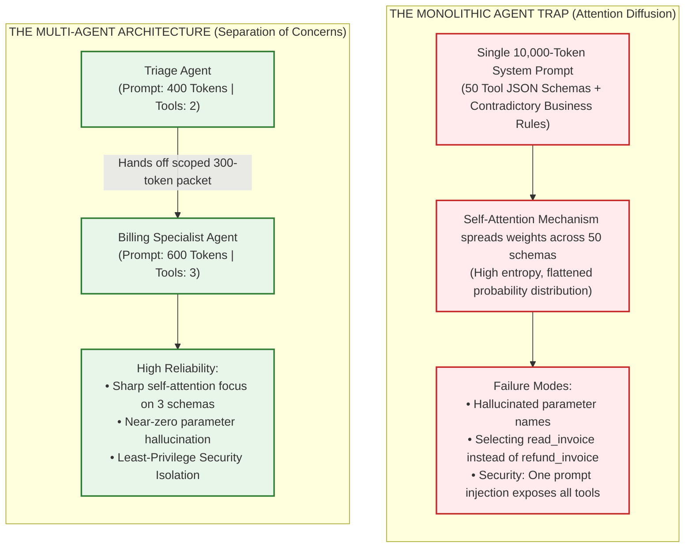
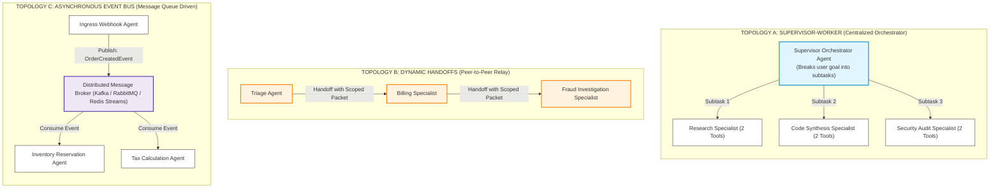
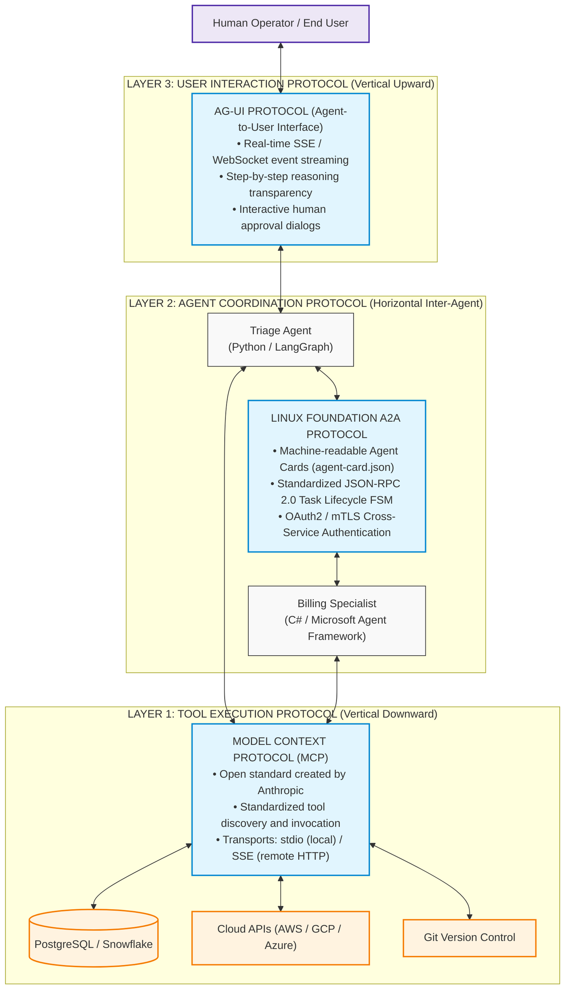

# Multi-Agent Coordination, Swarms & The Tri-Protocol Stack

> **Phase 04: Agentic Systems & Orchestration** | Depth Tier: `🔵 Tier 3: Advanced` | Estimated Reading Time: 45 min
>
> **Prerequisites**: [Lesson 01: Workflows vs. Autonomous Agents](01-workflows-vs-agents-and-orchestration-patterns.md), [Lesson 02: Autonomous ReAct Loops & Execution Governors](02-react-loops-and-execution-governors.md), [Lesson 03: Stateful Sessions, Durable WAL & Distributed Sagas](03-stateful-sessions-and-durable-wal-persistence.md), [Phase 03: Tools & Model Context Protocol](../03-tools-and-model-context-protocol/README.md)
>
> **Core Concept**: In Lessons 01 through 04, we built single agents with governed loops, durable state, and tiered memory. But what happens when the work is too broad for one agent? A Large Language Model (LLM) is an auto-regressive statistical engine that predicts the next token based on its input prompt context. When an application registers dozens of tools with a single model, it must inject each tool's full JSON Schema into the prompt context, consuming thousands of tokens. This causes **attention diffusion**: the model's internal mechanism spreads its processing weights thinly across hundreds of competing parameter keys, flattening probability distributions and causing the model to generate non-existent arguments or select incorrect tools. To maintain high reliability, enterprise architectures divide work across specialized agents—each maintaining an isolated execution loop with a narrow system prompt and 3 to 5 domain-specific tools. Connecting these independent agents across systems, organizations, and human users relies on the **Tri-Protocol Stack**: the **Model Context Protocol (MCP)** for vertical tool execution, the Linux Foundation **Agent-to-Agent (A2A) Protocol** for horizontal agent-to-agent delegation, and the **Agent-User Interface (AG-UI)** for real-time frontend streaming and human-in-the-loop approvals.

### Key AI Terms for This Lesson

* **Auto-Regressive Generation**: The way language models produce output. Instead of generating an entire response at once, the model predicts one token at a time, then feeds that token back as input to predict the next one. Each token prediction depends on all previous tokens in the context window — like writing a sentence one word at a time, where each word choice depends on everything written before it.
* **Self-Attention**: The internal mechanism that allows a transformer model to determine which parts of the input are most relevant to predicting the next token. When processing the word "refund" in a tool call, self-attention lets the model focus heavily on the nearby `invoice_id` parameter while paying less attention to unrelated text. It works by computing a relevance score between every pair of tokens in the input.
* **Attention Diffusion**: When too many similar tool schemas are packed into a single prompt, the self-attention mechanism cannot concentrate its relevance scores sharply on the correct schema. Instead, the scores spread thinly across many competing candidates — like trying to read a specific paragraph on a page covered in 50 similarly-formatted paragraphs. This leads to incorrect tool selection and hallucinated parameter names.

---

## 1. The Systems Problem: Why Single "Monolithic" Agents Fail

In traditional software engineering, seasoned developers know that creating a single "god class" containing 50 disparate API clients, database connections, and business rules violates the Single Responsibility Principle and creates an unmaintainable codebase.

In AI engineering, building a single "do-everything" agent fails for an even more fundamental, mathematical reason: **how transformer models process prompt context**.



### The AI Mechanics: What Happens Inside the Model?

To understand why a monolithic agent fails, we must examine the internal mechanics of LLM inference:

1. **How Tools Actually Work (Tool Schemas as Prompt Prefixes)**:
   A foundation model does not have direct socket connections or operating system bindings. When an application gives an LLM tools, the host orchestrator converts each tool signature into a structured **JSON Schema** (specifying the function name, docstring description, argument names, and types). These schemas are serialized into text and prepended to the system prompt.
2. **Context Window Token Bloat**:
   If you configure 50 enterprise tools (e.g., Jira APIs, Stripe refunds, SQL database queries, AWS Kubernetes operations), the tool schemas alone consume between **6,000 and 10,000 tokens** before the user even types a single word.
3. **Attention Diffusion and Entropy**:
   During transformer inference, the model computes self-attention scores between every token in the prompt. When 50 similar schemas are present—each containing overlapping argument names such as `user_id`, `account_id`, `customer_uuid`, `transaction_token`—the model's attention weights diffuse across multiple candidate tokens. Instead of concentrating high probability mass onto the single correct function name, the probability distribution over candidate tokens becomes flat and noisy.
4. **Prompt Instruction Collision**:
   When a single system prompt attempts to combine contradictory behavioral requirements (e.g., *"Be extremely concise and friendly in customer support"* alongside *"Follow strict, verbose regulatory compliance verification before altering financial ledgers"*), the model's output reflects an average of both vectors, frequently neglecting critical compliance constraints.
5. **Security Perimeter Collapse**:
   If an agent has access to both a public search tool and an internal database mutation tool, an **indirect prompt injection** (malicious instructions embedded in a public web page or customer ticket) can manipulate the agent into executing destructive mutations.

### The Solution: Agent Specialization & Separation of Concerns

Just as microservice architectures decompose monolithic web backends into dedicated services with distinct database schemas and API boundaries, enterprise AI systems decompose monolithic agents into **specialized agents**:
* Each specialized agent operates with a focused system prompt (300 to 800 tokens).
* Each agent receives only **3 to 5 tools** strictly required for its specific domain.
* Sensitive financial or administrative tools are isolated inside gated specialists requiring cryptographic authentication or Human-in-the-Loop (HITL) approval gates.

---

## 2. The Mental Model: The Three Multi-Agent Topologies

When coordinating multiple specialized agents, distributed systems architects implement one of three standard structural patterns:



### 1. Topology A: Supervisor-Worker (Centralized Orchestrator)
* **How It Works**: A central supervisor agent acts as the primary contact point. It inspects the incoming user request, breaks it down into a directed acyclic graph (DAG) or sequence of subtasks, delegates each subtask to an isolated specialist worker, and synthesizes the workers' individual outputs into a unified response.
* **Communication Rules**: Specialist workers never communicate directly with one another; all context and results flow strictly through the supervisor.
* **Best Use Cases**: Deep research report generation, multi-stage code reviews, and structured document analysis pipelines.

### 2. Topology B: Dynamic Handoffs (Peer-to-Peer Relay)
* **How It Works**: Agents operate as peer nodes in a state machine. When an agent determines that a user's intent belongs to a different domain, it invokes a designated handoff tool (such as `transfer_to_billing(reason, customer_id)`). The orchestrator updates the active agent pointer to the billing specialist, which takes over the conversation.
* **Communication Rules**: The originating agent relinquishes control completely.
* **Standardized By**: Originally popularized by OpenAI Swarm, now productionized in the **OpenAI Agents SDK (`openai-agents`)**.
* **Best Use Cases**: Interactive customer support, multi-department enterprise portals, and real-time voice assistants.

### 3. Topology C: Asynchronous Event Bus (Message Queue Driven)
* **How It Works**: Decouples agent execution across distributed message brokers (such as Apache Kafka, RabbitMQ, or AWS SQS). Agents subscribe to specific domain event topics, execute their autonomous ReAct loops in background container workers, and publish completion events to downstream topics.
* **Communication Rules**: 100% asynchronous, non-blocking, and fault-tolerant.
* **Best Use Cases**: Long-running background batch jobs, overnight code repository migrations, and asynchronous compliance scanning.

---

## 3. Context Passing Patterns: Scoped Handoff Packets vs. Full History Dumps

When execution transitions from Agent A to Agent B, how should state and conversation history be transmitted?

```mermaid
flowchart TD
    classDef bad fill:#ffebee,stroke:#c62828,stroke-width:2px;
    classDef good fill:#e8f5e9,stroke:#2e7d32,stroke-width:2px;
    classDef opt fill:#e1f5fe,stroke:#0288d1,stroke-width:2px;
    classDef step fill:#ffffff,stroke:#333,stroke-width:1px;

    subgraph AntiPattern["ANTI-PATTERN: PASS ENTIRE UNFILTERED CONVERSATION HISTORY"]
        direction LR
        AP_User["User Request"] --> AP_A["Agent A Work Session\n(Internal Scratchpads, Raw DB JSON: 18,000 Tokens)"]
        --> AP_Dump["Full Unfiltered History Dump"]:::bad
        --> AP_B["Agent B Prompt Context\n(Ingests all 18,000 Tokens!\nHigh Latency, High Cost, Context Window Saturation)"]:::bad
    end

    subgraph BestPractice["PRODUCTION PATTERN: SCOPED HANDOFF DATA PACKET"]
        direction LR
        BP_User["User Request"] --> BP_A["Agent A Work Session"]
        --> BP_DTO["Structured Handoff DTO (Pydantic Schema: ~350 Tokens)\n• verified_facts\n• completed_actions\n• remaining_goal"]:::good
        --> BP_B["Agent B Prompt Context\n(Receives ONLY its lean system prompt + 350-token packet.\n85% Token Reduction, Zero Distraction)"]:::good
    end
```



### The Architectural Flaw of Dumping Full Conversation History
In naive multi-agent implementations, developers simply append the entire message history of Agent A (including internal reasoning thoughts, intermediate tool outputs, and error retries) into the prompt of Agent B. This causes three severe failures:
1. **Context Window Saturation**: If Agent A consumed 18,000 tokens querying a database, Agent B immediately inherits that 18,000-token footprint, driving up inference latency and API costs.
2. **Error and Scratchpad Contamination**: If Agent A experienced a tool failure and retried, Agent B's self-attention mechanism attends to Agent A's failed reasoning attempts, increasing the probability that Agent B repeats the same mistake.
3. **Irrelevant Information Distraction**: Agent B does not need to see the raw SQL query strings or HTTP headers that Agent A used; Agent B only needs the verified conclusion.

### The Production Solution: Scoped Handoff Packets (Data Transfer Objects)
Before handing off control, the active agent serializes its findings into a strongly typed **Scoped Handoff Packet** (Data Transfer Object) defined by a Pydantic schema:

```python
class ScopedHandoffPacket(BaseModel):
    customer_id: str
    verified_facts: list[str]       # Grounded conclusions verified by tools
    completed_actions: list[str]    # Tools already successfully run
    remaining_goal: str             # Explicit objective delegated to recipient
```

When Agent B boots up, its prompt context contains only:
1. Its own lean system prompt (500 tokens).
2. Its 3 domain-specific tools (600 tokens).
3. The scoped handoff packet (350 tokens).

Total input tokens: **~1,450 tokens** instead of 20,000 tokens—an **85% to 90% reduction in token consumption** with zero attention dilution.

---

## 4. The Tri-Protocol Stack: Standardizing Enterprise Agent Communication

As multi-agent ecosystems scale across different engineering teams, programming languages, and cloud providers, connecting agents cannot rely on proprietary Python library wrappers. The software industry has standardized on the **Tri-Protocol Stack**:



### The Three Layers Defined

1. **Layer 1: The Vertical Tool Axis — Model Context Protocol (MCP)**:
   * **Creator & Standards Body**: Open-source specification initiated by Anthropic (2024–2026).
   * **Function**: Connects an agent *downward* to tools, databases, file systems, and enterprise services.
   * **Wire Format**: JSON-RPC 2.0 messages transmitted over local standard input/output (`stdio`) for local development or Server-Sent Events (`SSE`) over HTTP for distributed microservices.
   * **Why It Matters**: Decouples tool authors from agent framework authors. A database team can write an MCP server in Go, and any agent written in Python, C#, or TypeScript can discover and execute its tools without bespoke wrappers.
2. **Layer 2: The Horizontal Agent Axis — Linux Foundation Agent-to-Agent (A2A) Protocol**:
   * **Creator & Standards Body**: Governed by the Linux Foundation (established 2025/2026).
   * **Function**: Connects independent agents *horizontally* across different teams, servers, programming languages, and cloud providers.
   * **Wire Format**: HTTP/JSON-RPC 2.0 with cryptographic mutual TLS (mTLS) or OAuth2 Bearer tokens.
   * **Discovery Mechanism**: Every agent publishes an **Agent Card** (`agent-card.json`) that advertises its capabilities, required input schemas, and authorization scopes.
   * **Why It Matters**: Prevents vendor lock-in. A LangGraph agent running on AWS can discover and delegate an accounting subtask to a Microsoft Agent Framework agent running on Microsoft Azure.
3. **Layer 3: The Human Interaction Axis — Agent-User Interface (AG-UI)**:
   * **Function**: Connects agents *upward* to end users, browser frontends, and native mobile clients.
   * **Wire Format**: Bidirectional WebSocket or Server-Sent Events (SSE) event streams.
   * **Capabilities**: Streams the agent's real-time thought progress, tool execution status indicators, and modal interactive prompts for Human-in-the-Loop authorization.

---

## 5. Linux Foundation Agent-to-Agent (A2A) Protocol Specification

### The Machine-Readable Agent Card (`agent-card.json`)
Before an agent can participate in an enterprise A2A mesh, it registers its Agent Card with the central service registry (such as Consul, Kubernetes service discovery, or an enterprise Agent Registry):

```json
{
  "a2a_version": "1.0.0",
  "agent_id": "urn:enterprise:agents:billing-specialist",
  "name": "Enterprise Billing Specialist",
  "description": "Specialized financial agent for invoice dispute reconciliation and ledger adjustments.",
  "owner_team": "finance-platform@enterprise.com",
  "authentication": {
    "type": "oauth2_bearer",
    "scopes": ["billing:read", "billing:adjust:write"]
  },
  "capabilities": [
    {
      "action_name": "reconcile_dispute",
      "description": "Validates charge discrepancies against ERP invoices and executes authorized credit adjustments.",
      "input_schema": {
        "type": "object",
        "required": ["invoice_id", "disputed_amount_usd", "customer_id"],
        "properties": {
          "invoice_id": { "type": "string" },
          "customer_id": { "type": "string" },
          "disputed_amount_usd": { "type": "number", "minimum": 0.01 }
        }
      }
    }
  ]
}
```

### The Standardized Task Lifecycle State Machine

When Agent A delegates an action to Agent B under A2A, both runtimes track the transaction through a formal Finite State Machine (FSM):

```mermaid
stateDiagram-v2
    [*] --> SUBMITTED: Initiator dispatches task payload
    
    SUBMITTED --> ACK: Recipient validates auth token & schema
    SUBMITTED --> REJECTED: Schema validation error or missing IAM scope
    
    ACK --> PROCESSING: Specialist spawns local ReAct loop
    
    PROCESSING --> AWAITING_INPUT: Action requires Human-in-the-Loop authorization
    AWAITING_INPUT --> PROCESSING: Human signs off via webhook
    AWAITING_INPUT --> CANCELLED: Human rejects or authorization expires
    
    PROCESSING --> COMPLETED: Goal fulfilled; final payload emitted
    PROCESSING --> FAILED: Error budget exhausted or unrecoverable tool crash
    
    COMPLETED --> [*]
    FAILED --> [*]
    CANCELLED --> [*]
    REJECTED --> [*]
```



### Prose Walkthrough: A2A Task State Transitions

1. **SUBMITTED**: The sender sends an HTTP POST request containing the scoped task payload.
2. **ACK / REJECTED**: The receiver validates the OAuth2 token and verifies that the payload matches its registered input schema. If valid, it returns an acknowledgment with a unique task execution ID; if invalid, it rejects immediately with HTTP 400/403.
3. **PROCESSING**: The recipient begins executing its internal autonomous loop using its dedicated tools.
4. **AWAITING_INPUT**: If the specialist encounters an action exceeding its autonomous authority (e.g., spend > $1,000), it pauses its state machine and emits an event to the AG-UI layer for human review.
5. **COMPLETED / FAILED**: Upon successful termination, the specialist commits the final result and returns the scoped response packet to the initiating agent.

---

## 6. Multi-Agent Anti-Patterns: The Infinite Debate Problem

A frequent failure mode in naive multi-agent architectures is configuring two agents to "collaborate" or "critique each other" without a deterministic termination condition:
* Agent A drafts a software proposal.
* Agent B critiques the phrasing and tone.
* Agent A re-drafts based on feedback.
* Agent B finds another minor phrasing adjustment.
* **The Failure**: The system cycles for 30 turns, consuming $40 in model API tokens without making forward semantic progress.

### Production Rules for Multi-Agent Convergence

1. **Hard Iteration Caps**: Enforce a strict ceiling of **at most 2 rounds** of revision.
2. **Deterministic Tie-Breaker**: In Round 3, a neutral arbiter model or deterministic rule engine makes an authoritative, non-negotiable decision.
3. **Parallel Voting Over Debate**: When verifying classifications or factual accuracy, run 3 independent agents in parallel and take a **majority vote**, rather than allowing sequential argumentative loops.

---

## 7. Production Python 3.12+ Implementation: Multi-Agent Dynamic Handoff Swarm

Below is a complete, runnable Python 3.12+ implementation demonstrating an **OpenAI Agents SDK-style dynamic handoff engine**. It features:
1. **Strongly Typed Pydantic Schemas**: Enforcing clean separation between internal scratchpads and external handoffs.
2. **Dynamic Agent Pointer Swapping**: Mutating the runtime execution token cleanly between specialists.
3. **Circuit-Breaker Handoff Ceilings**: Preventing unbounded inter-agent delegation loops.

```python
"""
Production Multi-Agent Dynamic Handoff Swarm
Implements: Dynamic Agent Pointer Handoffs and Scoped Handoff Packets.
Tech Stack: Python 3.12+, Pydantic v2, Typed Schemas
"""

from __future__ import annotations

import json
from enum import StrEnum
from typing import Any, Dict, List, Optional
from pydantic import BaseModel, Field


# ============================================================================
# 1. STRONGLY TYPED HANDOFF PACKETS
# ============================================================================

class TaskStatus(StrEnum):
    SUBMITTED = "SUBMITTED"
    PROCESSING = "PROCESSING"
    COMPLETED = "COMPLETED"
    FAILED = "FAILED"


class ScopedHandoffPacket(BaseModel):
    """
    Lean, focused transfer data packet (DTO).
    Transfers only verified conclusions and remaining goals.
    Never dumps raw scratchpads or multi-thousand token tool payloads.
    """
    customer_id: str
    verified_facts: List[str] = Field(default_factory=list)
    completed_actions: List[str] = Field(default_factory=list)
    remaining_goal: str


class HandoffDecision(BaseModel):
    """Signal emitted by an agent to transfer control to a peer specialist."""
    target_agent_id: str
    handoff_packet: ScopedHandoffPacket


# ============================================================================
# 2. SPECIALIST PERSONAS
# ============================================================================

class BaseSpecialist:
    def __init__(self, agent_id: str, name: str) -> None:
        self.agent_id = agent_id
        self.name = name

    def execute(self, packet: ScopedHandoffPacket) -> Any:
        raise NotImplementedError


class TriageAgent(BaseSpecialist):
    """Inspects raw customer intent, validates identity, and delegates."""

    def __init__(self) -> None:
        super().__init__(
            agent_id="agent:triage",
            name="Triage Specialist",
        )

    def execute(self, packet: ScopedHandoffPacket) -> HandoffDecision:
        print(f"[{self.name}] Ingesting customer request: '{packet.remaining_goal}'")
        
        # Simulates deterministic authentication check
        print(f"[{self.name}] Verifying customer identity: {packet.customer_id} (Passed)")
        
        # Constructs lean handoff packet discarding raw conversational filler
        clean_packet = ScopedHandoffPacket(
            customer_id=packet.customer_id,
            verified_facts=[
                "Customer identity confirmed via Multi-Factor Authentication.",
                "Disputed transaction isolated to invoice reference INV-2026-9901.",
            ],
            completed_actions=["verify_identity", "isolate_invoice"],
            remaining_goal="Evaluate eligibility for a $150.00 credit adjustment.",
        )
        
        print(f"[{self.name}] Handing off cleanly to Billing Specialist Agent...")
        return HandoffDecision(
            target_agent_id="agent:billing",
            handoff_packet=clean_packet,
        )


class BillingSpecialistAgent(BaseSpecialist):
    """Financial specialist possessing isolated credit and refund tool bindings."""

    def __init__(self) -> None:
        super().__init__(
            agent_id="agent:billing",
            name="Billing Specialist",
        )

    def execute(self, packet: ScopedHandoffPacket) -> Dict[str, Any]:
        print(f"\n[{self.name}] Booting isolated context with Scoped Handoff Packet:")
        print(f"  -> Verified Facts: {packet.verified_facts}")
        print(f"  -> Completed Steps: {packet.completed_actions}")
        print(f"  -> Explicit Goal: {packet.remaining_goal}")
        
        # Executes isolated domain tool
        print(f"[{self.name}] Invoking accounting tool: issue_account_credit(customer='{packet.customer_id}', amount=150.00)")
        
        return {
            "status": TaskStatus.COMPLETED,
            "receipt_id": "REC-CREDIT-2026-8841",
            "amount_credited_usd": 150.00,
            "summary": f"Successfully posted $150.00 credit to customer account {packet.customer_id}.",
            "audit_trail": packet.completed_actions + ["issue_account_credit"],
        }


# ============================================================================
# 3. SWARM RUNTIME ENGINE
# ============================================================================

class MultiAgentSwarmRuntime:
    """
    Manages active agent execution pointer and enforces handoff loop limits.
    """

    def __init__(self) -> None:
        self.specialists: Dict[str, BaseSpecialist] = {}

    def register_specialist(self, specialist: BaseSpecialist) -> None:
        self.specialists[specialist.agent_id] = specialist

    def dispatch(self, customer_id: str, raw_user_prompt: str) -> Dict[str, Any]:
        active_agent_id = "agent:triage"
        current_packet = ScopedHandoffPacket(
            customer_id=customer_id,
            verified_facts=[],
            completed_actions=[],
            remaining_goal=raw_user_prompt,
        )

        handoff_counter = 0
        max_allowed_handoffs = 5  # Circuit breaker preventing infinite handoff ping-pong

        while handoff_counter < max_allowed_handoffs:
            handoff_counter += 1
            agent = self.specialists.get(active_agent_id)
            if not agent:
                raise RuntimeError(f"Target agent '{active_agent_id}' is not registered.")

            result = agent.execute(current_packet)

            if isinstance(result, HandoffDecision):
                print(f"[Runtime] Moving execution token: {active_agent_id} -> {result.target_agent_id}")
                active_agent_id = result.target_agent_id
                current_packet = result.handoff_packet
            else:
                print(f"[Runtime] Final response synthesized by {agent.name}.")
                return result

        raise RuntimeError("Circuit breaker triggered: Exceeded maximum allowed handoffs.")


# ============================================================================
# 4. VERIFICATION RUNNER
# ============================================================================

def main() -> None:
    runtime = MultiAgentSwarmRuntime()
    runtime.register_specialist(TriageAgent())
    runtime.register_specialist(BillingSpecialistAgent())

    user_query = "I was billed twice for invoice INV-2026-9901. Please issue a refund of $150."
    print("=== STARTING MULTI-AGENT SWARM DISPATCH ===")
    terminal_result = runtime.dispatch(customer_id="CUST-9921", raw_user_prompt=user_query)

    print("\n=== FINAL DELIVERABLE RETURNED TO CLIENT ===")
    print(json.dumps(terminal_result, indent=2))


if __name__ == "__main__":
    main()
```

---

## 8. Key Takeaways & Architectural Checklist

* **Monolithic Agents Suffer From Attention Diffusion**: Registering dozens of tools injects thousands of schema tokens into every prompt, flattening the model's self-attention probability distribution and causing tool parameter hallucinations.
* **Separation of Concerns for AI**: Decompose complex domains into focused specialist agents with narrow system prompts and 3 to 5 domain-specific tools.
* **Master the Three Topologies**:
  1. *Supervisor-Worker*: For centralized planning and subtask synthesis.
  2. *Dynamic Handoffs*: For conversational peer handoffs without supervisor overhead.
  3. *Asynchronous Message Queues*: For event-driven background batch workloads.
* **Pass Scoped Handoff Packets**: Never dump raw 20,000-token conversation histories between agents. Pass a structured Pydantic DTO of verified facts, saving 85% in token costs.
* **The Tri-Protocol Stack Standard**:
  1. *Layer 1 (MCP)*: Vertical tool execution over JSON-RPC 2.0.
  2. *Layer 2 (A2A)*: Horizontal cross-agent discovery and delegation via Agent Cards.
  3. *Layer 3 (AG-UI)*: Vertical upward streaming of thoughts and human approvals to users.

---

## 🧭 Navigation

| [← Lesson 04: Agent Memory Systems](04-agent-memory-systems-and-cognitive-architectures.md) | [Phase 04 Navigation Hub](README.md) | [Lesson 06: Code-as-Action & Sandboxed Execution Runtimes →](06-codeact-and-sandboxed-execution-runtimes.md) |
|:---:|:---:|:---:|
| **Previous Lesson** | **Phase Hub** | **Next Lesson** |
| [Lab 2: Multi-Agent Swarm](labs/lab2-multi-agent-swarm.md) | [Lab 4: Distributed Saga Pattern](labs/lab4-saga-pattern.md) | [Capstone: Code Review Engine](labs/capstone-code-review-engine.md) |
