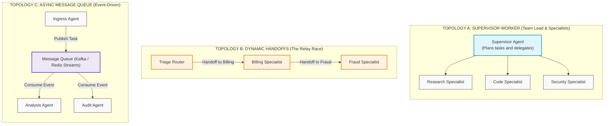
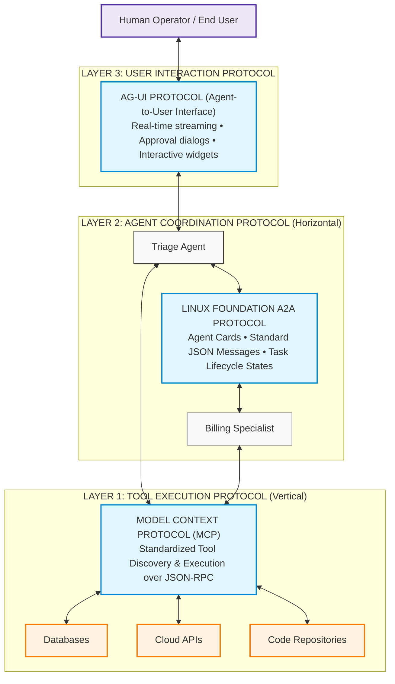
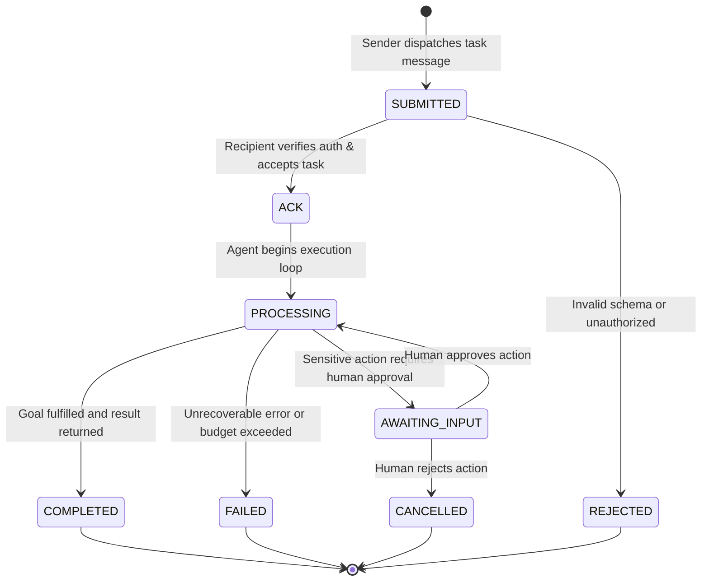

# Multi-Agent Coordination, Swarms & The Tri-Protocol Stack

> **Phase 04: Agentic Systems & Orchestration** | Depth Tier: `🔵 Tier 3: Advanced` | Estimated Reading Time: 45 min
>
> **Prerequisites**: [Lesson 01: Workflows vs. Autonomous Agents](01-workflows-vs-agents-and-orchestration-patterns.md), [Lesson 02: Agent Architecture: Harnesses & Loops](02-react-loops-and-execution-governors.md), [Lesson 03: Stateful Sessions & Durable Write-Ahead Logs](03-stateful-sessions-and-durable-wal-persistence.md), [Phase 03: Tools & Model Context Protocol](../03-tools-and-model-context-protocol/README.md)

> **Core Concept**: Complex workflows quickly overwhelm a single prompt. When you give one agent 50 different tools, the model gets confused, mixes up parameters, and makes mistakes. Instead, enterprise architectures divide work across specialized agents using three core patterns: Supervisor-Worker, Dynamic Handoffs, and Message Queues. Connecting these agents across tools, teams, and human users relies on the **Tri-Protocol Stack**: MCP for tools, A2A for agent-to-agent delegation, and AG-UI for user streaming.

---

## 1. The Real-World Problem: The "Do-Everything" Monolithic Agent

When developers start building automation, a natural first instinct is to build a single "super-agent":
* You write a 6,000-token system prompt describing billing policies, security rules, and technical debugging guidelines.
* You register 40 different tools: querying SQL databases, refunding credit cards, creating Jira tickets, reading GitHub commits, and restarting server pods.
* You send incoming customer questions directly to this one agent.

In production, this "do-everything" agent inevitably runs into three major problems:
1. **Tool Confusion**: When a model is presented with dozens of tool schemas, its tool-calling accuracy drops significantly. It frequently invents arguments, calls the wrong tool, or mixes up parameters.
2. **Conflicting System Instructions**: When one prompt tries to enforce strict legal refund rules, polite customer service tone, and technical debugging instructions all at once, the model struggles to balance them and ignores critical instructions.
3. **Broad Security Risk**: If your single agent has access to both read-only search tools and sensitive database delete/refund tools, a prompt injection in a customer support chat can potentially compromise your entire database.

The solution is the same one used across modern software engineering: **Specialization & Separation of Concerns**. We break down the monolith into small, focused agents with isolated tools, clear responsibilities, and standardized handoffs.

---

## 2. The Mental Model: The Three Multi-Agent Topologies

Multi-agent architectures generally use one of three structural patterns:



### The Topologies Explained

1. **Topology A: Supervisor-Worker (Team Lead)**: A central supervisor agent receives the main user goal, breaks it into subtasks, delegates each subtask to a specialist worker, and combines the results. The specialist workers never talk directly to each other; they report back only to the supervisor. This works best for complex research reports and document reviews.
2. **Topology B: Dynamic Handoffs (The Relay Race)**: Agents operate as peers. When an agent realizes that a customer's question belongs to a different domain, it calls a handoff tool (for example: `transfer_to_billing()`). The system passes the baton to the specialist, who takes over the conversation. This pattern was popularized by OpenAI Swarm and is now standardized in the **OpenAI Agents SDK (`openai-agents`)**.
3. **Topology C: Asynchronous Message Queue (Event-Driven)**: Agents communicate across a message queue (such as Kafka or Redis Streams). An ingress agent publishes an event, and worker agents process events independently. This is ideal for background jobs and long-running batch processing where tasks take hours to complete.

---

## 3. How to Pass Context Between Agents

When execution transfers from Agent A to Agent B, how should conversation history and tool outputs be passed along?

```mermaid
flowchart TD
    classDef bad fill:#ffebee,stroke:#c62828,stroke-width:2px;
    classDef good fill:#e8f5e9,stroke:#2e7d32,stroke-width:2px;
    classDef opt fill:#e1f5fe,stroke:#0288d1,stroke-width:2px;

    subgraph PatternA["PATTERN A: PASS ENTIRE HISTORY (Fragile Anti-Pattern)"]
        direction LR
        PA_User["User Prompt"] --> PA_A["Agent A Scratchpad & Logs\n(20,000 Tokens)"] --> PA_B["Agent B Prompt\n(Ingests all 20,000 Tokens!)"]:::bad
    end

    subgraph PatternB["PATTERN B: SCOPED HANDOFF PACKET (Recommended)"]
        direction LR
        PB_User["User Prompt"] --> PB_A["Agent A Work"] --> PB_DTO["Clean Handoff Data Packet\n(Pydantic: ~300 Tokens)"]:::good --> PB_B["Agent B Prompt"]
    end

    subgraph PatternC["PATTERN C: SHARED STORAGE WITH POINTERS (Large Files)"]
        direction LR
        PC_A["Agent A writes big file to S3 / Database"] --> PC_Ptr["Lightweight Pointer\n{'file_url': 's3://...'}"]:::opt --> PC_B["Agent B reads only if needed"]
    end
```



### Why Scoped Handoff Packets Win

* **The Anti-Pattern (Dumping Full History)**: Simply copying the entire conversation history—including Agent A's internal scratchpad thoughts and raw database responses—into Agent B wastes thousands of tokens, causes prompt bloat, and allows errors in Agent A to confuse Agent B.
* **The Recommended Pattern (Clean Handoff Packet)**: When Agent A hands off to Agent B, it generates a small, structured data packet (using a typed Pydantic schema) containing only:
  1. *Verified Facts*: What has been confirmed so far.
  2. *Completed Actions*: What tools have already been run.
  3. *Remaining Goal*: What Agent B is explicitly expected to do.
* **The Result**: Agent B receives only its own lean system prompt and a ~300-token summary packet. This reduces token consumption by **85%** and keeps Agent B focused on its specific task.

---

## 4. The Tri-Protocol Stack: Standardizing Enterprise Agent Communication

As multi-agent systems expand across different teams and frameworks, connecting agents together requires open protocols rather than proprietary library wrappers.

The enterprise software industry has standardized on the **Tri-Protocol Stack**:



### The Three Layers Explained Simply

1. **Layer 1: The Vertical Tool Axis (MCP — Model Context Protocol)**:
   * Connects agents *downward* to databases, APIs, file systems, and tools.
   * Standardized by Anthropic and adopted widely across the industry. Uses standard JSON-RPC messages so an agent can discover and invoke tools regardless of which language the tool is written in.
2. **Layer 2: The Horizontal Agent Axis (A2A — Agent-to-Agent Protocol)**:
   * Connects agents *horizontally* to other agents across different servers, teams, or programming languages.
   * Standardized under the **Linux Foundation**. Allows an agent written in Python with LangGraph to delegate a task to an agent written in C# with the Microsoft Agent Framework.
   * Agents publish **Agent Cards** (`agent-card.json`) that describe their capabilities, required parameters, and security authentication requirements.
3. **Layer 3: The Human Interaction Axis (AG-UI — Agent-User Interface)**:
   * Connects agents *upward* to human users and web interfaces.
   * Standardizes how agents stream their thinking steps, display progress bars, and present human approval dialogs before executing sensitive actions.

---

## 5. Linux Foundation Agent-to-Agent (A2A) Protocol Details

### The Agent Card (`agent-card.json`)
Just as an API has an OpenAPI specification, an A2A-compliant agent publishes a machine-readable card declaring what it can do:

```json
{
  "a2a_version": "1.0.0",
  "agent_id": "urn:enterprise:agents:billing-specialist",
  "name": "Enterprise Billing Specialist",
  "description": "Specialized agent for invoice reconciliation, refund processing, and tax adjustments.",
  "owner_team": "billing-eng@enterprise.com",
  "authentication": {
    "type": "oauth2_bearer",
    "scopes": ["billing:read", "billing:refund:write"]
  },
  "capabilities": [
    {
      "action_name": "reconcile_invoice",
      "input_schema": {
        "type": "object",
        "required": ["invoice_id", "disputed_amount_usd"],
        "properties": {
          "invoice_id": { "type": "string" },
          "disputed_amount_usd": { "type": "number", "minimum": 0.01 }
        }
      }
    }
  ]
}
```

### The Standard Task Lifecycle



---

## 6. Avoiding Multi-Agent Traps: The Endless Debate Problem

A common mistake in multi-agent systems is setting up two agents to "debate" an answer without a clear stopping condition:
* Agent A writes a proposal.
* Agent B critiques the wording.
* Agent A rephrases the proposal slightly.
* Agent B critiques another word.
* The loop continues for 30 turns, consuming dozens of dollars in API credits without making real progress.

### Production Rules for Multi-Agent Decisions

1. **Strict Debate Ceilings**: Never allow more than 2 rounds of critique.
2. **Use a Neutral Arbiter**: In Round 3, a neutral judge model reads the exchange, makes a binding decision, and terminates the session.
3. **Plurality Voting for Classifications**: When high accuracy is needed, have 3 independent models evaluate the prompt in parallel and choose the majority vote, rather than having them argue back and forth.

---

## 7. Production Python 3.12+ Implementation: Multi-Agent Dynamic Handoffs

Here is a complete, runnable Python 3.12+ implementation demonstrating an **OpenAI Agents SDK-style dynamic handoff engine** using clean, typed handoff packets:

```python
"""
Enterprise Multi-Agent Coordination Engine
Implements: Dynamic Handoffs and Scoped Handoff Packets.
Tech Stack: Python 3.12+, Pydantic v2, Typed Schemas
"""

from __future__ import annotations

import datetime
import json
import uuid
from enum import StrEnum
from typing import Any, Dict, List, Optional
from pydantic import BaseModel, Field


# ============================================================================
# 1. HANDOFF DATA SCHEMAS
# ============================================================================

class TaskState(StrEnum):
    SUBMITTED = "SUBMITTED"
    PROCESSING = "PROCESSING"
    COMPLETED = "COMPLETED"
    FAILED = "FAILED"


class ScopedHandoffPacket(BaseModel):
    """
    Lean, focused transfer packet.
    Passes only verified facts and remaining goals, discarding raw scratchpads.
    """
    customer_id: str
    verified_facts: List[str]
    completed_actions: List[str]
    remaining_goal: str


class HandoffDecision(BaseModel):
    target_agent_id: str
    handoff_packet: ScopedHandoffPacket


# ============================================================================
# 2. AGENT SPECIALISTS
# ============================================================================

class BaseSpecialist:
    def __init__(self, agent_id: str, name: str) -> None:
        self.agent_id = agent_id
        self.name = name

    def execute(self, packet: ScopedHandoffPacket) -> Any:
        raise NotImplementedError


class TriageAgent(BaseSpecialist):
    """Inspects initial requests and routes them to the right specialist."""

    def __init__(self) -> None:
        super().__init__(
            agent_id="agent:triage",
            name="Triage Specialist",
        )

    def execute(self, packet: ScopedHandoffPacket) -> HandoffDecision:
        print(f"[{self.name}] Analyzing request: '{packet.remaining_goal}'")
        
        # Extracts verified entities and delegates to billing
        clean_packet = ScopedHandoffPacket(
            customer_id=packet.customer_id,
            verified_facts=[
                "Customer verified via two-factor authentication.",
                "Disputed charge identified as invoice INV-9901.",
            ],
            completed_actions=["verify_identity"],
            remaining_goal="Evaluate eligibility for a $150.00 credit.",
        )
        print(f"[{self.name}] Handing off cleanly to Billing Specialist...")
        return HandoffDecision(
            target_agent_id="agent:billing",
            handoff_packet=clean_packet,
        )


class BillingSpecialistAgent(BaseSpecialist):
    """Specialist agent with financial tool privileges."""

    def __init__(self) -> None:
        super().__init__(
            agent_id="agent:billing",
            name="Billing Specialist",
        )

    def execute(self, packet: ScopedHandoffPacket) -> Dict[str, Any]:
        print(f"\n[{self.name}] Received Scoped Handoff Packet:")
        print(f"  -> Verified Facts: {packet.verified_facts}")
        print(f"  -> Goal: {packet.remaining_goal}")
        
        # Executes specific financial tool
        print(f"[{self.name}] Calling corporate accounting API: issue_credit(customer='{packet.customer_id}', amount=150.00)")
        
        return {
            "status": "COMPLETED",
            "receipt_id": "REC-CREDIT-8841",
            "amount_credited_usd": 150.00,
            "message": f"Successfully credited $150.00 to customer account {packet.customer_id}.",
        }


# ============================================================================
# 3. MULTI-AGENT SWARM RUNTIME
# ============================================================================

class MultiAgentRuntime:
    """Manages active agent pointers and handles task handoffs."""

    def __init__(self) -> None:
        self.specialists: Dict[str, BaseSpecialist] = {}

    def register(self, specialist: BaseSpecialist) -> None:
        self.specialists[specialist.agent_id] = specialist

    def run(self, customer_id: str, goal: str) -> Dict[str, Any]:
        active_agent_id = "agent:triage"
        current_packet = ScopedHandoffPacket(
            customer_id=customer_id,
            verified_facts=[],
            completed_actions=[],
            remaining_goal=goal,
        )

        handoff_count = 0
        max_handoffs = 5

        while handoff_count < max_handoffs:
            handoff_count += 1
            agent = self.specialists.get(active_agent_id)
            if not agent:
                raise RuntimeError(f"Agent '{active_agent_id}' is not registered.")

            result = agent.execute(current_packet)

            if isinstance(result, HandoffDecision):
                print(f"[Runtime] Moving execution token: {active_agent_id} -> {result.target_agent_id}")
                active_agent_id = result.target_agent_id
                current_packet = result.handoff_packet
            else:
                print(f"[Runtime] Task completed successfully by {agent.name}.")
                return result

        raise RuntimeError("Exceeded maximum handoff limit.")


# ============================================================================
# 4. VERIFICATION RUNNER
# ============================================================================

def main() -> None:
    runtime = MultiAgentRuntime()
    runtime.register(TriageAgent())
    runtime.register(BillingSpecialistAgent())

    user_goal = "I was charged twice on invoice INV-9901. Please refund me $150."
    final_output = runtime.run(customer_id="CUST-7721", goal=user_goal)

    print("\n=== Final Response to User ===")
    print(json.dumps(final_output, indent=2))


if __name__ == "__main__":
    main()
```

---

## 8. Key Takeaways & Summary

* **Avoid the Monolithic Agent Trap**: Giving one prompt 50 tools triggers parameter confusion and high security risk. Split tasks across lean, specialized agents.
* **Master the Three Topologies**:
  1. *Supervisor-Worker*: For structured task planning and delegation.
  2. *Dynamic Handoffs*: For conversational handoffs between peer specialists.
  3. *Message Queues*: For asynchronous, long-running background tasks.
* **Use Scoped Handoff Packets**: Never pass raw, 20,000-token conversation histories between agents. Pass a small, typed packet of verified facts to reduce token costs by 85%.
* **The Tri-Protocol Stack Connects Everything**:
  1. *MCP (Vertical)*: Standardizes how agents call tools and query databases.
  2. *A2A (Horizontal)*: Standardizes how agents delegate tasks to other agents.
  3. *AG-UI (User-Facing)*: Standardizes real-time streaming and human approval dialogs.

---

## 🧭 Navigation

| [← Lesson 04: Agent Memory Systems](04-agent-memory-systems-and-cognitive-architectures.md) | [Phase 04 Navigation Hub](README.md) | [Lesson 06: Code-as-Action & Sandboxed Execution Runtimes →](06-codeact-and-sandboxed-execution-runtimes.md) |
|:---:|:---:|:---:|
| **Previous Lesson** | **Phase Hub** | **Next Lesson** |
| [Lab 2: Multi-Agent Swarm](labs/lab2-multi-agent-swarm.md) | [Lab 4: Distributed Saga Pattern](labs/lab4-saga-pattern.md) | [Capstone: Code Review Engine](labs/capstone-code-review-engine.md) |
