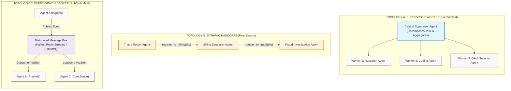
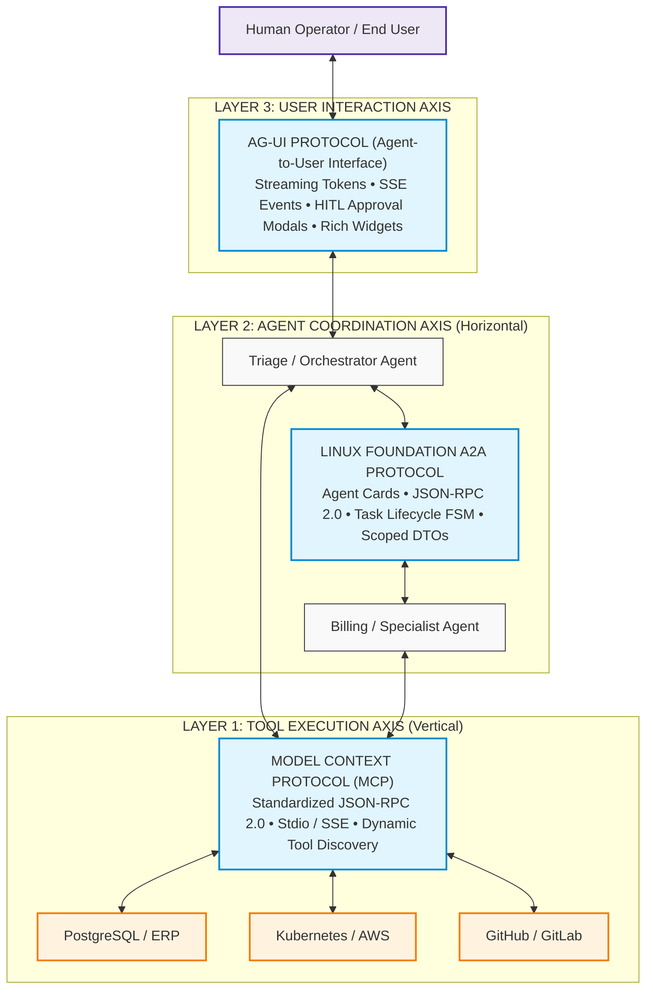
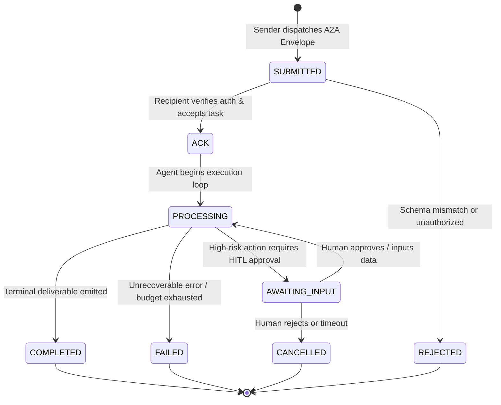

# Multi-Agent Coordination, Swarms & The Tri-Protocol Stack (MCP + A2A + AG-UI)

> **Phase 04: Agentic Systems & Orchestration** | Depth Tier: `🔵 Tier 3: Advanced` | Estimated Reading Time: 55 min
>
> **Prerequisites**: [Lesson 01: Workflows vs. Autonomous Agents](01-workflows-vs-agents-and-orchestration-patterns.md), [Lesson 02: Autonomous ReAct Loops & Execution Governors](02-react-loops-and-execution-governors.md), [Lesson 03: Stateful Sessions & Durable WAL Persistence](03-stateful-sessions-and-durable-wal-persistence.md), [Phase 03: Tools & Model Context Protocol](../03-tools-and-model-context-protocol/README.md)

> **Core Concept**: Complex enterprise workflows exceed the cognitive limits of a single prompt. Distributed multi-agent systems coordinate specialized personas across diverse topologies (Supervisor-Worker, Hierarchical Mesh, Peer Swarms). Enterprise production requires protocol standardization via the Tri-Protocol Stack: Model Context Protocol (MCP) for tool execution, the Linux Foundation Agent-to-Agent (A2A) Protocol for inter-agent delegation, and Agent-User Interface (AG-UI) for human streaming.

---

## 1. The Engineering Problem: The Cognitive Limits of the Monolithic Agent

When building enterprise automation, a common anti-pattern is the **Monolithic Agent**: an engineer defines a single LLM agent, equips it with 60 diverse tools (SQL querying, Git branching, billing refunds, customer email dispatch, Kubernetes cluster management), and crafts an 8,000-token system prompt attempting to dictate all business logic.

In production, monolithic agents suffer from systemic cognitive failure:
1. **Tool Parameter Confusion & Hallucination**: When a model's context is flooded with dozens of complex JSON schemas, tool selection accuracy degrades exponentially. The model frequently mixes arguments between unrelated tools or hallucinates required parameters.
2. **System Prompt Dilution**: Forcing a model to simultaneously remember strict billing compliance rules, infrastructure security guidelines, and empathetic customer support phrasing leads to contradictory behavior. The model ignores critical safety instructions.
3. **Over-Privileged Security Blast Radius**: If the single monolithic agent suffers a prompt injection vulnerability, the attacker gains unauthorized control over *all* registered tools (including destructive database mutations and payment transactions).

The architectural solution is **Specialization & Separation of Concerns**: decomposing monolithic agents into a distributed mesh of lean, specialized agents with isolated privileges, distinct context windows, and standardized inter-agent communication protocols.

---

## 2. The Mental Model: Multi-Agent Topologies

Enterprise multi-agent architectures generally fall into three structural topologies:



### Prose Diagram Walkthrough: Multi-Agent Topologies

1. **Topology A: Supervisor-Worker (Hierarchical)**: A central supervisor agent owns the global objective. It breaks tasks into subtasks, delegates them to subordinate specialists, and inspects deliverables. Subordinates never communicate directly with each other; all communication routes through the supervisor. Ideal for structured analytical reports and document generation.
2. **Topology B: Dynamic Handoffs (Peer Swarms)**: Agents operate as autonomous peers. When an agent determines that a task falls outside its domain, it invokes a specialized handoff tool (e.g., `transfer_to_billing(handoff_dto)`). The host runtime mutates its active agent pointer, passing control directly to the specialist. Pioneered by OpenAI Swarm and productionized in the **OpenAI Agents SDK (`openai-agents`)**.
3. **Topology C: Event-Driven Broker (Pub/Sub Mesh)**: Agents communicate asynchronously via partitioned event logs (Kafka, Redis Streams). Agents subscribe to task topics, process events independently, and publish results to downstream topics. Delivers maximum scalability and fault isolation for multi-hour asynchronous workflows.

---

## 3. Context Passing Patterns between Agents

When execution transfers from Agent A to Agent B, how should context be transferred? Enterprise systems utilize three architectural patterns:

```mermaid
flowchart TD
    classDef bad fill:#ffebee,stroke:#c62828,stroke-width:2px;
    classDef good fill:#e8f5e9,stroke:#2e7d32,stroke-width:2px;
    classDef opt fill:#e1f5fe,stroke:#0288d1,stroke-width:2px;

    subgraph PatternA["PATTERN A: NAIVE FULL CONTEXT PASS-THROUGH (Anti-Pattern)"]
        direction LR
        PA_User["User Query"] --> PA_A["Agent A Reasoning & Tool Logs\n(20,000 Tokens)"] --> PA_B["Agent B Prompt\n(Ingests all 20,000 Tokens!)"]:::bad
    end

    subgraph PatternB["PATTERN B: SCOPED SUMMARIZATION BRIDGE (Recommended)"]
        direction LR
        PB_User["User Query"] --> PB_A["Agent A Reasoning"] --> PB_DTO["Structured Handoff DTO\n(Pydantic: 400 Tokens)"]:::good --> PB_B["Agent B Prompt"]
    end

    subgraph PatternC["PATTERN C: SHARED STATE STORE WITH POINTER PASSING (Scale)"]
        direction LR
        PC_A["Agent A writes bulky payload to S3 / Redis"] --> PC_Ptr["Passes Lightweight Pointer\n{'pointer_uri': 's3://...'}"]:::opt --> PC_B["Agent B queries keys on-demand"]
    end
```



### Prose Diagram Walkthrough: Context Passing Patterns

1. **Pattern A: Naive Full Context Pass-Through (The Anti-Pattern)**: The host runtime copies the entire message array (system instructions, intermediate scratchpads, raw tool dumps) into the next agent's context. This causes catastrophic context bloat, multiplies token costs, and exposes downstream agents to indirect prompt injections that occurred in earlier turns.
2. **Pattern B: Scoped Summarization Bridge (Structured Handoff DTO)**: When transitioning, Agent A generates a concise, typed payload conforming to a strict Pydantic model (`verified_facts`, `completed_actions`, `remaining_objective`). Agent B receives only its own system prompt, the user's objective, and this 400-token DTO. Slashes token consumption by **85%** and insulates Agent B from prompt pollution.
3. **Pattern C: Shared State Store with Pointer Passing**: For massive payloads (e.g., 50MB log files or tabular datasets), Agent A commits the artifact to external object storage (S3, Redis) and passes an immutable URI pointer. Agent B queries the store only if its specific subtask requires reading that data.

---

## 4. The Tri-Protocol Stack (2025–2026 Enterprise Standard)

As multi-agent ecosystems mature, proprietary framework-specific communication produces vendor lock-in and cross-system friction. The enterprise industry has converged on the **Tri-Protocol Stack**:



### Prose Diagram Walkthrough: The Tri-Protocol Stack

1. **Layer 1: The Vertical Axis (MCP — Model Context Protocol)**: Connects agents downward to tools, databases, APIs, and host environments via standard JSON-RPC 2.0. Standardized by Anthropic and adopted across the industry.
2. **Layer 2: The Horizontal Axis (A2A — Agent-to-Agent Protocol)**: Governs horizontal peer-to-peer task delegation between autonomous agents across different teams, frameworks, or cloud boundaries. Standardized under the **Linux Foundation**.
3. **Layer 3: The Interaction Axis (AG-UI — Agent-User Interface Protocol)**: Standardizes communication upward to human end-users and client applications. Transports real-time token streaming, thought progress bars, rich interactive UI widgets, and Human-in-the-Loop authorization modals over Server-Sent Events (SSE) or WebSockets.

---

## 5. Linux Foundation Agent-to-Agent (A2A) Protocol Specification

The **A2A Protocol** enables cross-framework interoperability. An agent written in Python with LangGraph can seamlessly delegate a task to an agent written in C# with the Microsoft Agent Framework.

### 5.1 The Agent Card (`agent-card.json`)
Every A2A-compliant agent publishes an immutable, signed metadata manifest:

```json
{
  "a2a_version": "1.0.0",
  "agent_id": "urn:enterprise:agents:billing-specialist",
  "name": "Enterprise Billing Specialist",
  "description": "Specialized agent for invoice reconciliation, refund processing, and tax adjustments.",
  "owner_team": "finance-systems@enterprise.com",
  "authentication": {
    "type": "oauth2_bearer",
    "scopes": ["billing:read", "billing:refund:write"]
  },
  "capabilities": [
    {
      "action_name": "reconcile_invoice",
      "input_schema": {
        "type": "object",
        "required": ["invoice_id", "disputed_amount_usd"],
        "properties": {
          "invoice_id": { "type": "string" },
          "disputed_amount_usd": { "type": "number", "minimum": 0.01 }
        }
      },
      "output_schema": {
        "type": "object",
        "required": ["reconciliation_status", "refund_tx_id"],
        "properties": {
          "reconciliation_status": { "type": "string" },
          "refund_tx_id": { "type": "string" }
        }
      }
    }
  ]
}
```

### 5.2 The A2A Task Lifecycle Finite State Machine (FSM)



#### Prose Diagram Walkthrough: A2A Task Lifecycle

1. **SUBMITTED**: The sender agent publishes an `AgentMessageEnvelope` over HTTP or an event bus.
2. **ACK / REJECTED**: The recipient validates cryptographic signatures and JSON Schemas. If compliant, it acknowledges the task (`ACK`); otherwise, it returns `REJECTED`.
3. **PROCESSING**: The recipient initiates its internal ReAct loop or deterministic workflow.
4. **AWAITING_INPUT**: If a high-risk tool call is encountered, the state pauses as `AWAITING_INPUT`, awaiting an external webhook.
5. **COMPLETED / FAILED**: Upon task fulfillment, the recipient returns the final structured output and updates the state to `COMPLETED`.

---

## 6. Multi-Agent Governance: Anti-Patterns & Consensus Algorithms

Operating swarms of autonomous agents introduces failure modes that do not exist in single-agent architectures:

### The Unconstrained Debate Anti-Pattern
* **The Failure**: Two agents are instructed to "debate and refine an architectural design." Without a deterministic stopping condition, Agent A critiques Agent B's phrasing; Agent B counters with minor semantic adjustments. The debate oscillates for 40 turns, burning \$80 in tokens without producing an actionable deliverable.
* **The Architectural Rule**: Never permit unbounded agent debate. Multi-agent consensus must follow strict algorithms:
  1. **Plurality Voting**: M parallel agents generate candidate solutions independently; the orchestrator selects the statistical mode.
  2. **Weighted Confidence Consensus**: Each agent emits an answer and an explicit calibrated confidence metric `w_i in [0, 1]`; the winner maximizes weighted confidence.
  3. **Judge Arbitration**: Limit debate to exactly $R = 2$ rounds. At Round 3, a neutral, higher-tier reasoning model (the Judge) reviews the transcript and emits an immutable binding decision.

---

## 7. Production Python 3.12+ Implementation: Multi-Agent Handoff with A2A Envelopes

Below is a complete, production-grade Python 3.12+ implementation demonstrating an **OpenAI Agents SDK-style dynamic handoff engine** utilizing typed **A2A message envelopes** and **scoped handoff DTOs**.

```python
"""
Enterprise Multi-Agent Coordination Engine
Implements: Dynamic Handoffs, Scoped Handoff DTOs, and A2A Protocol Envelopes.
Stack: Python 3.12+, Pydantic v2, Typed Schemas, JSON-RPC Envelopes
"""

from __future__ import annotations

import datetime
import uuid
from enum import StrEnum
from typing import Any, Callable, Dict, List, Optional
from pydantic import BaseModel, Field


# ============================================================================
# 1. A2A PROTOCOL SCHEMAS (Linux Foundation Standard)
# ============================================================================

class A2ALifecycleState(StrEnum):
    SUBMITTED = "SUBMITTED"
    ACK = "ACK"
    PROCESSING = "PROCESSING"
    AWAITING_INPUT = "AWAITING_INPUT"
    COMPLETED = "COMPLETED"
    FAILED = "FAILED"
    CANCELLED = "CANCELLED"


class TaskDefinition(BaseModel):
    action_name: str
    goal: str
    input_parameters: Dict[str, Any] = Field(default_factory=dict)
    schema_version: str = "1.0.0"


class ScopedHandoffDTO(BaseModel):
    """
    Lean 400-token bridge payload. Discards raw tool scratchpads.
    """
    verified_facts: List[str]
    completed_actions: List[str]
    remaining_objective: str
    customer_account_id: str


class AgentMessageEnvelope(BaseModel):
    envelope_id: str = Field(default_factory=lambda: str(uuid.uuid4()))
    correlation_id: str
    sender_agent_id: str
    recipient_agent_id: str
    lifecycle_state: A2ALifecycleState = A2ALifecycleState.SUBMITTED
    task_definition: TaskDefinition
    handoff_payload: ScopedHandoffDTO
    timestamp_utc: str = Field(
        default_factory=lambda: datetime.datetime.now(datetime.timezone.utc).isoformat()
    )


# ============================================================================
# 2. AGENT PERSONAS & HANDOFF RUNTIME
# ============================================================================

class HandoffResult(BaseModel):
    target_agent_id: str
    handoff_dto: ScopedHandoffDTO


class BaseSpecialistAgent:
    def __init__(self, agent_id: str, name: str, system_prompt: str) -> None:
        self.agent_id = agent_id
        self.name = name
        self.system_prompt = system_prompt

    def execute(self, envelope: AgentMessageEnvelope) -> Any:
        raise NotImplementedError


class TriageAgent(BaseSpecialistAgent):
    """Initial ingress triage agent. Directs tasks to specialists."""

    def __init__(self) -> None:
        super().__init__(
            agent_id="urn:enterprise:agents:triage",
            name="Triage Specialist",
            system_prompt="Analyze customer requests. Extract entities and dispatch to billing or technical teams.",
        )

    def execute(self, envelope: AgentMessageEnvelope) -> HandoffResult:
        print(f"[{self.name}] Analyzing request: '{envelope.task_definition.goal}'")
        
        # Simulated intent analysis & entity extraction
        handoff_dto = ScopedHandoffDTO(
            verified_facts=[
                "Customer verified identity via MFA.",
                "Disputed invoice number identified as INV-9901.",
            ],
            completed_actions=["verify_customer_identity"],
            remaining_objective="Evaluate eligibility for a $150.00 goodwill credit.",
            customer_account_id="CUST-4091",
        )
        print(f"[{self.name}] Initiating A2A handoff to Billing Specialist...")
        return HandoffResult(
            target_agent_id="urn:enterprise:agents:billing",
            handoff_dto=handoff_dto,
        )


class BillingSpecialistAgent(BaseSpecialistAgent):
    """Specialist agent with financial domain privileges."""

    def __init__(self) -> None:
        super().__init__(
            agent_id="urn:enterprise:agents:billing",
            name="Billing Specialist",
            system_prompt="Evaluate invoice disputes and execute refunds within delegation authority.",
        )

    def execute(self, envelope: AgentMessageEnvelope) -> Dict[str, Any]:
        dto = envelope.handoff_payload
        print(f"\n[{self.name}] Ingested Scoped Handoff DTO from {envelope.sender_agent_id}:")
        print(f"  -> Verified Facts: {dto.verified_facts}")
        print(f"  -> Remaining Objective: {dto.remaining_objective}")
        
        # Execute specialist tool logic
        print(f"[{self.name}] Invoking corporate ledger tool: issue_credit(acc='{dto.customer_account_id}', amount=150.00)")
        
        return {
            "status": "COMPLETED",
            "transaction_id": "TX-CREDIT-88412",
            "amount_credited_usd": 150.00,
            "deliverable": f"Goodwill credit of $150.00 successfully applied to account {dto.customer_account_id}.",
        }


# ============================================================================
# 3. MULTI-AGENT SWARM RUNTIME
# ============================================================================

class MultiAgentSwarmRuntime:
    """Orchestrates dynamic agent pointer mutations and A2A envelope dispatch."""

    def __init__(self) -> None:
        self.registry: Dict[str, BaseSpecialistAgent] = {}

    def register_agent(self, agent: BaseSpecialistAgent) -> None:
        self.registry[agent.agent_id] = agent

    def dispatch_session(self, initial_goal: str) -> Dict[str, Any]:
        correlation_id = f"corr-{uuid.uuid4().hex[:8]}"
        active_agent_id = "urn:enterprise:agents:triage"

        # Construct initial ingress envelope
        current_envelope = AgentMessageEnvelope(
            correlation_id=correlation_id,
            sender_agent_id="urn:enterprise:client:web",
            recipient_agent_id=active_agent_id,
            task_definition=TaskDefinition(action_name="triage_user_goal", goal=initial_goal),
            handoff_payload=ScopedHandoffDTO(
                verified_facts=[],
                completed_actions=[],
                remaining_objective=initial_goal,
                customer_account_id="UNKNOWN",
            ),
        )

        turn = 0
        max_handoffs = 5

        while turn < max_handoffs:
            turn += 1
            agent = self.registry.get(active_agent_id)
            if not agent:
                raise RuntimeError(f"Agent {active_agent_id} not registered.")

            current_envelope.lifecycle_state = A2ALifecycleState.PROCESSING
            execution_output = agent.execute(current_envelope)

            if isinstance(execution_output, HandoffResult):
                # Execute Pointer Mutation and prepare next A2A envelope
                print(f"[RUNTIME] Mutating active agent pointer: {active_agent_id} -> {execution_output.target_agent_id}")
                current_envelope = AgentMessageEnvelope(
                    correlation_id=correlation_id,
                    sender_agent_id=active_agent_id,
                    recipient_agent_id=execution_output.target_agent_id,
                    task_definition=TaskDefinition(
                        action_name="resolve_dispute", goal=execution_output.handoff_dto.remaining_objective
                    ),
                    handoff_payload=execution_output.handoff_dto,
                )
                active_agent_id = execution_output.target_agent_id
            else:
                # Terminal Result
                current_envelope.lifecycle_state = A2ALifecycleState.COMPLETED
                print(f"[RUNTIME] Workflow terminated successfully by {agent.name}.")
                return execution_output

        raise RuntimeError("Max multi-agent handoffs exceeded.")


# ============================================================================
# 4. VERIFICATION & RUNNER
# ============================================================================

def main() -> None:
    runtime = MultiAgentSwarmRuntime()
    runtime.register_agent(TriageAgent())
    runtime.register_agent(BillingSpecialistAgent())

    user_request = "I was overcharged $150 on invoice INV-9901. I demand a credit."
    result = runtime.dispatch_session(user_request)

    print("\n=== FINAL DELIVERABLE TO CLIENT ===")
    print(json.dumps(result, indent=2))


if __name__ == "__main__":
    import json
    main()
```

---

## 8. Production Failure Modes & Defensive Invariants

When deploying multi-agent swarms, enforce these defensive architectural patterns:

### Failure Mode 1: The Circular Handoff Ping-Pong
* **The Root Cause**: Agent A inspects a task and hands off to Agent B. Agent B decides it lacks sufficient permissions and hands off back to Agent A. The swarm enters an infinite handoff cycle.
* **The Defensive Invariant**: **Handoff Hop Counter & Acyclic Invariant**. The `AgentMessageEnvelope` must include a `hop_count` field incremented on every transfer. If `hop_count > 4`, halt execution immediately and escalate to a human supervisor.

### Failure Mode 2: Cross-Agent Context Pollution & Prompt Injection Hop
* **The Root Cause**: An untrusted customer input contains a prompt injection that bypasses Agent A's system prompt. Passing Agent A's raw conversation history to Agent B contaminates Agent B, causing it to execute an unauthorized tool.
* **The Defensive Invariant**: **Mandatory Scoped Handoff DTOs**. Never serialize raw message arrays between agents. All transfers must pass through a strongly typed Pydantic DTO with strict field validators.

### Failure Mode 3: Asynchronous Deadlock on Partitioned Queues
* **The Root Cause**: In an event-driven mesh, Agent B crashes while processing a task event, without committing its consumer offset or emitting a completion event. Agent A waits indefinitely for a response.
* **The Defensive Invariant**: **Dead-Letter Queues (DLQ) & Distributed TTL Timeouts**. Every A2A task envelope must specify an explicit `timeout_ms`. If no completion event arrives before the TTL expires, the task is marked as `FAILED` and rerouted to a DLQ.

---

## 9. Hands-On Architectural Exercises & Lab Integration

To apply multi-agent coordination principles:

1. **Multi-Agent Swarm Lab**: Complete [Lab 2: Multi-Agent Swarm Architecture](labs/lab2-multi-agent-swarm.md). Build a collaborative swarm where specialized agents coordinate via dynamic handoffs.
2. **C# Enterprise Orchestration**: Review [`examples/MultiAgentPipeline.cs`](examples/MultiAgentPipeline.cs) to see how multi-agent coordination is structured in enterprise C# / .NET runtimes.
3. **Capstone Code Review Engine**: Preview [Capstone Challenge: Distributed Code Review Agent Engine](labs/capstone-code-review-engine.md) to understand how multi-agent verification applies to real-world codebases.

---

## 10. Key Takeaways & Summary

* **Monolithic Agents Fail in Production**: Equipping a single agent with 50+ tools triggers severe tool hallucination, prompt dilution, and high security blast radius.
* **Master the Three Multi-Agent Topologies**:
  1. *Supervisor-Worker*: Centralized task planning and delegation.
  2. *Dynamic Handoffs (Swarm)*: Peer-to-peer execution token transfer via pointer mutation.
  3. *Event-Driven Broker*: Asynchronous decoupled coordination over Kafka or Redis Streams.
* **Always Use Scoped Handoff DTOs**: Replace raw message histories with validated 400-token summaries to reduce token costs by 85% and prevent prompt injection hops.
* **The Tri-Protocol Stack Standardizes Enterprise AI**:
  1. *MCP (Vertical)*: Agent-to-tool and data access.
  2. *A2A (Horizontal)*: Agent-to-agent task delegation and Agent Cards.
  3. *AG-UI (User Axis)*: Agent-to-human streaming and HITL approval interfaces.

---

## 🧭 Navigation

| [← Lesson 04: Agent Memory Systems](04-agent-memory-systems-and-cognitive-architectures.md) | [Phase 04 Navigation Hub](README.md) | [Lesson 06: CodeAct & Sandboxed Execution Runtimes →](06-codeact-and-sandboxed-execution-runtimes.md) |
|:---:|:---:|:---:|
| **Previous Lesson** | **Phase Hub** | **Next Lesson** |
| [Lab 2: Multi-Agent Swarm](labs/lab2-multi-agent-swarm.md) | [Lab 4: Distributed Saga Pattern](labs/lab4-saga-pattern.md) | [Capstone: Code Review Engine](labs/capstone-code-review-engine.md) |
