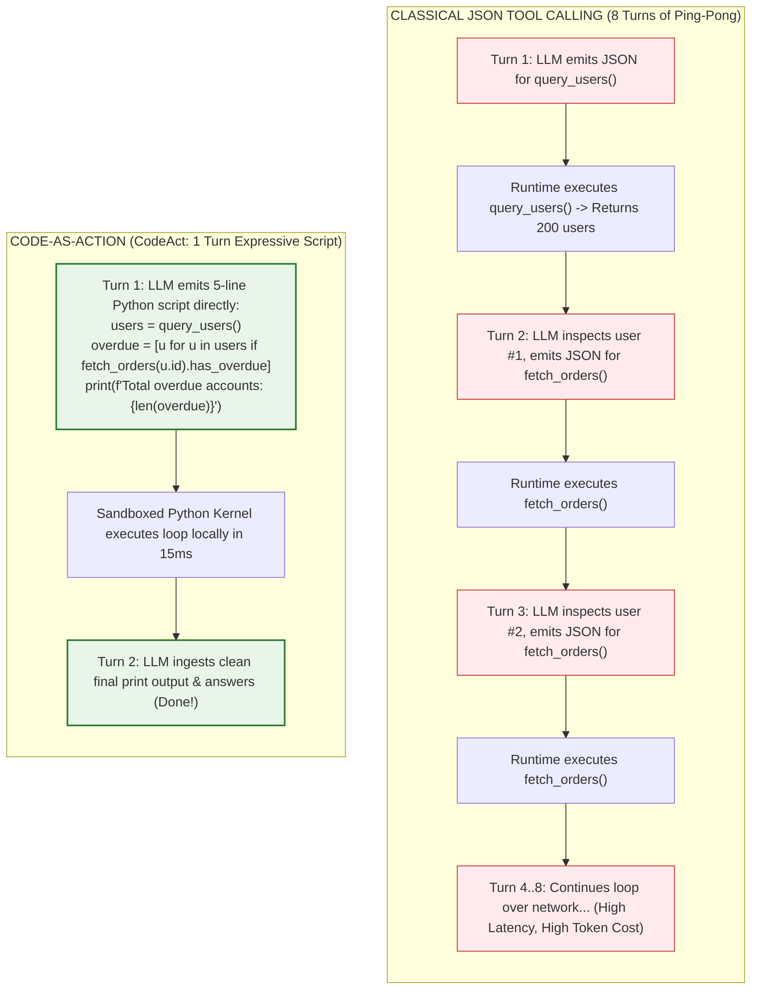
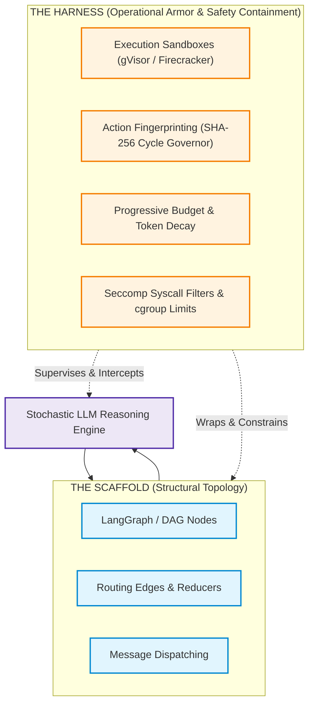
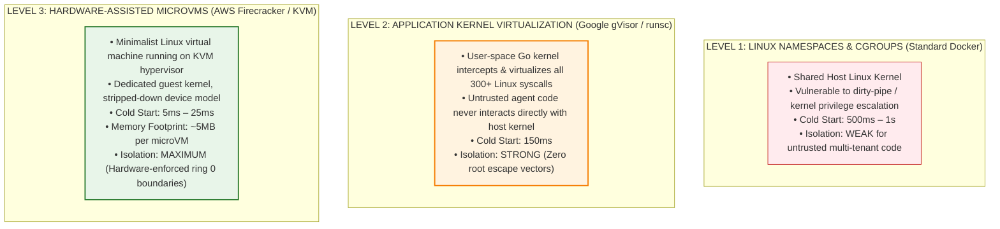
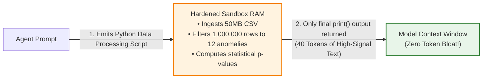

# Code-as-Action (CodeAct) & Sandboxed Execution Runtimes

> **Phase 04: Agentic Systems & Orchestration** | Depth Tier: `⚫ Tier 4: Deep Dive` | Estimated Reading Time: 50 min
>
> **Prerequisites**: [Lesson 01: Workflows vs. Autonomous Agents](01-workflows-vs-agents-and-orchestration-patterns.md), [Lesson 02: Autonomous ReAct Loops & Execution Governors](02-react-loops-and-execution-governors.md), [Phase 03: Tools & Model Context Protocol](../03-tools-and-model-context-protocol/README.md)

> **Core Concept**: Classical JSON tool calling suffers from multi-turn ping-pong latency and context bloat. In Code-as-Action (CodeAct), the agent writes and executes native Python or TypeScript code directly to interact with its environment and tools. Operating CodeAct safely in production requires hardened isolation runtimes—specifically gVisor (`runsc`), AWS Firecracker microVMs, and Linux seccomp/cgroup boundaries.

---

## 1. The Engineering Problem: The JSON Tool Calling Bottleneck

For years, the industry standard for LLM tool invocation has been **JSON Tool Calling** (standardized by OpenAI Function Calling and Anthropic Tool Use). In this paradigm, when an agent wishes to execute an action, it emits a structured JSON object adhering to a predefined schema:

```json
{"name": "query_database", "arguments": {"table": "invoices", "status": "OVERDUE"}}
```

While clean for simple single-tool lookups, JSON tool calling creates a severe architectural bottleneck when applied to complex multi-step reasoning: **the multi-turn ping-pong problem**.



### The Restaurant Order Slip Analogy

* **JSON Tool Calling** is like dining at a restaurant by writing down individual ingredients on paper slips, one at a time. You hand the waiter a slip requesting "water." He walks to the kitchen, brings back water. You inspect it. Then you hand him another slip requesting "bread." If you want to know if the chef has fresh truffles before ordering pasta, you must write a query slip, wait for the response, and then submit the pasta slip. Every basic logic step requires a network round-trip.
* **CodeAct** is like writing a concise recipe for the kitchen staff: *"Check if you have fresh truffles. If yes, prepare the risotto with parmesan; if no, prepare the cacio e pepe. Bring out both with water."* The kitchen executes your control flow locally and presents the completed meal in a single trip.

---

## 2. The Mental Model: Code-as-Action (CodeAct)

Formalized by Wang et al. (2024) in *"Executable Code Actions Elicit Better LLM Agents"*, **CodeAct** replaces rigid JSON schemas with executable programming language scripts (primarily Python or TypeScript).

### The Empirical Reality: Benchmarks & Telemetry

Empirical telemetry across standard agent benchmarks (SWE-bench, GAIA, HumanEval) demonstrates two dramatic performance advantages:
1. **~30% Fewer Turns**: Complex multi-step operations that require 8 to 12 turns of JSON ping-pong are completed in **2 to 3 turns** via CodeAct.
2. **~20% Higher Task Success Rate**: Eliminates malformed JSON escaping bugs, parameter truncation, and type mismatches.

### Why CodeAct Outperforms JSON

* **Native Control Flow**: Models do not need to round-trip to the host orchestrator just to execute a `for` loop, a list comprehension, a regex search, or an `if/else` condition.
* **In-Memory Intermediate State Composition**: An agent can pipe the output of Tool A directly into Tool B (`data = fetch(); result = transform(data)`) without serializing 50KB of intermediate JSON into the prompt context window.
* **Natural Alignment with Pre-Training**: Foundation models have ingested petabytes of high-quality GitHub repositories during pre-training. They are fundamentally more proficient at generating idiomatic, bug-free Python scripts than deeply nested JSON schemas.

### Production Champions of CodeAct

* **Anthropic Claude Code**: Claude Code operates in a bash/Python execution loop, writing shell scripts, inspecting git diffs, and running test runners directly.
* **Hugging Face `smolagents`**: Built entirely around the `CodeAgent` abstraction, where all agent actions are synthesized as executable Python snippets.

---

## 3. The Structural Boundary: Harness vs. Scaffold

In enterprise agent design, engineers frequently confuse the **Agent Scaffold** with the **Agent Harness**:



### The High-Rise Window Washer Analogy

* **The Scaffold** is the exterior metal catwalk, the steel cables, and the elevator pulleys. It dictates *how* the workers navigate from Floor 40 to Floor 41 and where the water buckets sit. In software, your scaffold is your graph topology, prompt chains, LangGraph StateGraph, and message reducers. It defines the plumbing.
* **The Harness** is the heavy-duty fall-arrest body harness clipped to an independent steel lifeline, the deceleration lanyard that absorbs kinetic shock, the high-wind alarm that halts the motor when gusts hit 45 mph, and the perimeter safety nets on Floor 20. If the catwalk shudders or the worker slips, the harness prevents a fatal plummet. In software, your harness is your execution sandbox, cryptographic cycle governor, token spend circuit breaker, and memory limits.

> **The Scaffold Fallacy**:
> Junior teams spend 90% of their engineering cycles swapping scaffolds (switching from LangChain to AutoGen to CrewAI to LangGraph) while completely ignoring the harness. When their autonomous agent burns \$1,200 in 30 minutes or drops a production database table, they blame "model hallucinations." The model did not fail; your **harness** was nonexistent.

---

## 4. The Sandboxed Execution Security Architecture

Executing arbitrary, model-generated code introduces extreme security risks. If an agent emits:

```python
import os, shutil; shutil.rmtree("/var/lib/postgresql/data")
```

...and the host runtime executes it directly via Python's native `exec()`, your entire enterprise infrastructure is compromised.

### The Illusion of Python AST Whitelisting

Many naive implementations attempt to secure `exec()` using the Python `ast` module to reject forbidden imports:

```python
# ❌ VULNERABLE: Naive AST parsing cannot prevent Python dynamic reflection escapes!
def unsafe_ast_check(code: str):
    # An attacker bypasses this trivial filter using Python dunder introspection:
    # ().__class__.__bases__[0].__subclasses__()[137].__init__.__globals__['system']('rm -rf /')
    pass
```

Because Python is a dynamically typed, highly introspective language, an LLM (or an attacker exploiting an indirect prompt injection) can access the host operating system without writing the string `import os`. **In-process software sandboxing in Python is mathematically insecure.**

### The Hardened Multi-Tier Sandboxing Spectrum

Production CodeAct execution requires hardware-enforced or operating system-enforced isolation boundaries:



### Prose Diagram Walkthrough: Sandboxing Spectrum

1. **Level 1: Linux Namespaces & cgroups (Docker)**: Standard containers share the host operating system's kernel. If an attacker exploits a Linux kernel zero-day vulnerability (e.g., privilege escalation via socket or memory corruption), they break out of the container onto the host machine. Insufficient for untrusted code execution.
2. **Level 2: Google gVisor (`runsc`)**: A user-space kernel written in Go that acts as a secure intermediary between the containerized application and the host kernel. gVisor implements the Linux system call interface in user-space, intercepting and virtualizing all 300+ syscalls. Even if untrusted code executes an exploit, it compromises only the user-space sandbox.
3. **Level 3: AWS Firecracker MicroVMs**: The gold standard for multi-tenant serverless execution (powering AWS Lambda and AWS Fargate). Firecracker boots minimal Linux virtual machines using Linux KVM hypervisors in less than 25 milliseconds with only 5MB of memory overhead. Provides hardware-enforced CPU isolation boundaries.

---

## 5. Context Compaction in CodeAct Environments

One of the greatest operational advantages of CodeAct is its ability to perform **Ephemeral In-Memory Data Compaction**:



### How Ephemeral Compaction Protects Context

In classical JSON calling, if an agent queries an API that returns 5,000 items, all 5,000 JSON items must be serialized into the model's message context. This triggers immediate context window saturation.

In CodeAct:
1. The 50MB CSV or 5,000-item JSON response is loaded directly into the sandbox's local memory (e.g., inside a pandas DataFrame or SQLite table).
2. The agent executes a 3-line filter script:
   ```python
   df = pd.read_csv("heavy_orders.csv")
   anomalies = df[df["fraud_score"] > 0.95]
   print(anomalies[["order_id", "amount", "user_id"]].to_string())
   ```
3. Only the 3 flagged anomalies (roughly 40 tokens) are printed to `stdout` and returned to the model's context window. The 50MB raw payload is discarded when the sandbox terminates.

---

## 6. Production Python 3.12+ Implementation: Hardened Subprocess CodeAct Runner

Below is a complete, runnable Python 3.12+ implementation demonstrating a **Hardened Subprocess CodeAct Runner** featuring:
1. **Static AST Analysis**: Pre-execution inspection blocking dunder attribute reflection and dangerous syntax.
2. **Subprocess Isolation**: Running code out-of-process with dedicated temporary directories.
3. **Wall-Clock Timeout Tripwires**: Asynchronous termination via `asyncio.wait_for`.
4. **Memory Resource Constraints**: Enforcing CPU and virtual memory ceiling limits.

```python
"""
Production Hardened CodeAct Execution Runner
Implements: Static AST Inspection, Subprocess Process Isolation,
Wall-Clock Asynchronous Timeouts, and Memory Resource Limits.
Stack: Python 3.12+, Pydantic v2, AST Security Validation, Asyncio Subprocess
"""

from __future__ import annotations

import ast
import asyncio
import os
import sys
import tempfile
from dataclasses import dataclass
from typing import Any, Dict, List, Optional
from pydantic import BaseModel, Field


# ============================================================================
# 1. SECURITY SCHEMAS & EXCEPTIONS
# ============================================================================

class SecurityViolationError(Exception):
    """Raised when candidate code violates static AST security invariants."""
    pass


class ExecutionResult(BaseModel):
    success: bool
    stdout: str
    stderr: str
    exit_code: int
    execution_time_ms: float
    violations: List[str] = Field(default_factory=list)


# ============================================================================
# 2. STATIC AST SECURITY INSPECTOR
# ============================================================================

class CodeActSecurityInspector:
    """
    First-line static defensive filter.
    Inspects syntax tree for prohibited module imports and dunder reflection.
    """

    BANNED_IMPORTS = {
        "os", "sys", "subprocess", "shutil", "socket", "pathlib",
        "ctypes", "multiprocessing", "pty", "commands"
    }

    @classmethod
    def validate_code_ast(cls, source_code: str) -> None:
        try:
            tree = ast.parse(source_code)
        except SyntaxError as e:
            raise SecurityViolationError(f"Syntax error in candidate code: {e}")

        for node in ast.walk(tree):
            # Check 1: Explicit Import statements (e.g. import os)
            if isinstance(node, ast.Import):
                for alias in node.names:
                    if alias.name.split(".")[0] in cls.BANNED_IMPORTS:
                        raise SecurityViolationError(
                            f"Import of banned module '{alias.name}' is strictly prohibited."
                        )

            # Check 2: From Import statements (e.g. from os import system)
            elif isinstance(node, ast.ImportFrom):
                if node.module and node.module.split(".")[0] in cls.BANNED_IMPORTS:
                    raise SecurityViolationError(
                        f"Import from banned module '{node.module}' is strictly prohibited."
                    )

            # Check 3: Dunder Reflection Escapes (e.g. obj.__subclasses__())
            elif isinstance(node, ast.Attribute):
                if node.attr.startswith("__") and node.attr.endswith("__"):
                    raise SecurityViolationError(
                        f"Access to dunder reflection attribute '{node.attr}' is prohibited."
                    )


# ============================================================================
# 3. HARDENED SUBPROCESS CODEACT RUNNER
# ============================================================================

@dataclass
class SandboxConfig:
    timeout_seconds: float = 3.0
    max_output_bytes: int = 10_000
    python_executable: str = sys.executable


class HardenedCodeActRunner:
    """
    Executes validated CodeAct scripts in isolated temporary subprocesses.
    Guarantees wall-clock timeouts and standard stream truncation.
    """

    def __init__(self, config: Optional[SandboxConfig] = None) -> None:
        self.config = config or SandboxConfig()

    async def execute_script(self, code_snippet: str) -> ExecutionResult:
        start_time = asyncio.get_running_loop().time()

        # Step 1: Static AST Validation Barrier
        try:
            CodeActSecurityInspector.validate_code_ast(code_snippet)
        except SecurityViolationError as sec_err:
            return ExecutionResult(
                success=False,
                stdout="",
                stderr=str(sec_err),
                exit_code=-1,
                execution_time_ms=0.0,
                violations=[str(sec_err)],
            )

        # Step 2: Write script to secure ephemeral tempfile
        with tempfile.TemporaryDirectory() as temp_dir:
            script_path = os.path.join(temp_dir, "agent_payload.py")
            with open(script_path, "w", encoding="utf-8") as f:
                f.write(code_snippet)

            # Step 3: Spawn isolated subprocess
            try:
                process = await asyncio.create_subprocess_exec(
                    self.config.python_executable,
                    script_path,
                    stdout=asyncio.subprocess.PIPE,
                    stderr=asyncio.subprocess.PIPE,
                    cwd=temp_dir,
                )

                # Step 4: Enforce strict asynchronous wall-clock timeout
                try:
                    stdout_bytes, stderr_bytes = await asyncio.wait_for(
                        process.communicate(), timeout=self.config.timeout_seconds
                    )
                except asyncio.TimeoutError:
                    process.kill()
                    await process.wait()
                    elapsed = (asyncio.get_running_loop().time() - start_time) * 1000.0
                    return ExecutionResult(
                        success=False,
                        stdout="",
                        stderr=f"Execution timed out after {self.config.timeout_seconds}s.",
                        exit_code=-9,
                        execution_time_ms=elapsed,
                        violations=["WALL_CLOCK_TIMEOUT_EXCEEDED"],
                    )

                elapsed = (asyncio.get_running_loop().time() - start_time) * 1000.0

                # Truncate output to prevent context window explosion
                stdout_str = stdout_bytes[: self.config.max_output_bytes].decode("utf-8", errors="replace")
                stderr_str = stderr_bytes[: self.config.max_output_bytes].decode("utf-8", errors="replace")

                return ExecutionResult(
                    success=(process.returncode == 0),
                    stdout=stdout_str,
                    stderr=stderr_str,
                    exit_code=process.returncode or 0,
                    execution_time_ms=round(elapsed, 2),
                )

            except Exception as e:
                return ExecutionResult(
                    success=False,
                    stdout="",
                    stderr=f"Subprocess spawn failure: {str(e)}",
                    exit_code=-1,
                    execution_time_ms=0.0,
                )


# ============================================================================
# 4. VERIFICATION & SECURITY BENCHMARK
# ============================================================================

async def main() -> None:
    runner = HardenedCodeActRunner()

    print("=== TEST 1: Valid CodeAct In-Memory Compaction ===")
    valid_script = """
orders = [
    {"id": "ORD-1", "amount": 45.0, "status": "COMPLETED"},
    {"id": "ORD-2", "amount": 1200.0, "status": "OVERDUE"},
    {"id": "ORD-3", "amount": 850.0, "status": "OVERDUE"},
]
total_overdue = sum(o["amount"] for o in orders if o["status"] == "OVERDUE")
print(f"Total Overdue Balance: ${total_overdue:.2f}")
"""
    res1 = await runner.execute_script(valid_script)
    print(f"Success: {res1.success} (Exit: {res1.exit_code}, Time: {res1.execution_time_ms}ms)")
    print(f"Stdout:\n{res1.stdout}")

    print("\n=== TEST 2: Intercepting Malicious OS Import ===")
    malicious_script = """
import os
os.system("echo 'Breaching host...'")
"""
    res2 = await runner.execute_script(malicious_script)
    print(f"Success: {res2.success} (Violations: {res2.violations})")
    print(f"Stderr: {res2.stderr}")

    print("\n=== TEST 3: Intercepting Infinite Execution Loop ===")
    infinite_loop_script = """
count = 0
while True:
    count += 1
"""
    res3 = await runner.execute_script(infinite_loop_script)
    print(f"Success: {res3.success} (Exit: {res3.exit_code}, Time: {res3.execution_time_ms}ms)")
    print(f"Stderr: {res3.stderr}")


if __name__ == "__main__":
    asyncio.run(main())
```

---

## 7. Production Failure Modes & Defensive Invariants

When deploying CodeAct execution runtimes to production, enforce these defensive architectural patterns:

### Failure Mode 1: Host Operating System Compromise via In-Process `exec()`
* **The Root Cause**: Executing untrusted, model-generated code in the same Python process as the host application. An attacker escapes using dunder attribute introspection (`__subclasses__()`).
* **The Defensive Invariant**: **Process & MicroVM Isolation**. Never execute untrusted code in the application's native process. Always isolate code execution inside dedicated subprocesses, gVisor `runsc` containers, or Firecracker microVMs.

### Failure Mode 2: Denial of Service via Resource Exhaustion (Fork Bombs / Infinite Memory Allocation)
* **The Root Cause**: The model writes a script that spawns thousands of threads or allocates a 100GB byte array (`[0] * 10**10`), starving the host server of RAM and CPU.
* **The Defensive Invariant**: **Linux cgroup Hard Resource Limits**. Apply strict cgroup limits restricting every sandbox to:
  * Maximum 512MB RAM (`memory.max = 536870912`).
  * Maximum 1 virtual CPU (`cpu.max = 100000 100000`).
  * Process count ceiling of 10 (`pids.max = 10`) to prevent fork bombs.

### Failure Mode 3: Silent Network Exfiltration
* **The Root Cause**: The agent script opens a raw TCP socket and transmits proprietary enterprise data to an external command-and-control server.
* **The Defensive Invariant**: **Default-Deny Egress Network Namespaces**. Execute sandboxes in an isolated Linux network namespace (`--net=none`) with zero default Internet egress. If API access is required, route outbound traffic strictly through an authenticating HTTP proxy with domain whitelisting.

---

## 8. Hands-On Architectural Exercises & Lab Integration

To apply CodeAct and sandboxed runtime engineering:

1. **Capstone Code Review Engine**: Complete [Capstone Challenge: Distributed Code Review Agent Engine](labs/capstone-code-review-engine.md). Implement safe code inspection tools that analyze diffs in isolated environments.
2. **Infinite Loop Hardening**: Complete [Lab 3: Infinite Loop Detection & Recovery](labs/lab3-infinite-loops.md) to ensure that looping code scripts trigger wall-clock timeouts and circuit breakers.

---

## 9. Key Takeaways & Summary

* **CodeAct Eradicates JSON Ping-Pong**: By generating executable scripts directly, agents achieve ~30% fewer turns and ~20% higher task success on complex tasks.
* **Local Control Flow & Compaction**: CodeAct handles loops, branching, and data transformations locally in sandbox memory, returning only high-signal print outputs to the prompt context.
* **The Scaffold vs. The Harness**: Scaffolds define graph routing; harnesses provide execution sandboxes, cycle governors, and budget tripwires.
* **Never Trust In-Process Python AST Validation**: True isolation requires Level 2 (Google gVisor `runsc`) or Level 3 (AWS Firecracker microVMs) isolation boundaries with strict CPU, memory, and network namespace controls.

---

## 🧭 Navigation

| [← Lesson 05: Multi-Agent Coordination & A2A](05-multi-agent-coordination-and-a2a-protocols.md) | [Phase 04 Navigation Hub](README.md) | [Reference: Frameworks Matrix →](reference/enterprise-agent-frameworks-matrix.md) |
|:---:|:---:|:---:|
| **Previous Lesson** | **Phase Hub** | **Next Reference** |
| [Lab 2: Multi-Agent Swarm](labs/lab2-multi-agent-swarm.md) | [Lab 3: Infinite Loops](labs/lab3-infinite-loops.md) | [Capstone: Code Review Engine](labs/capstone-code-review-engine.md) |
