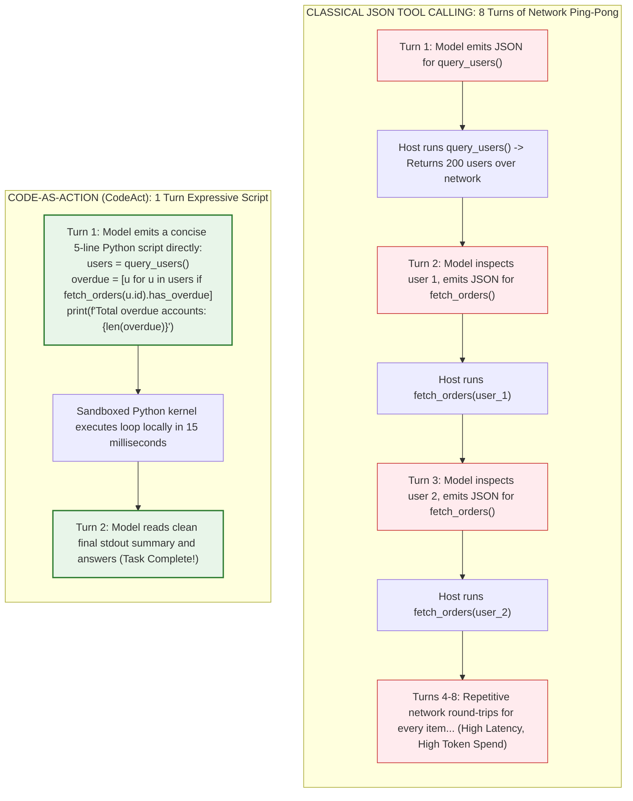
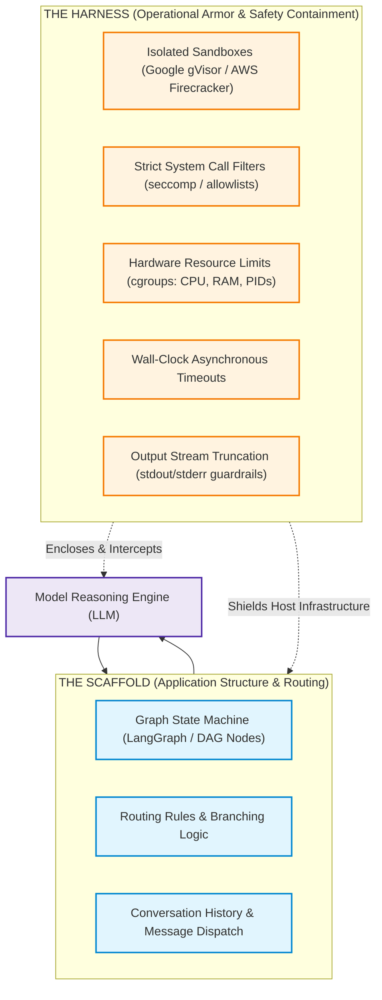
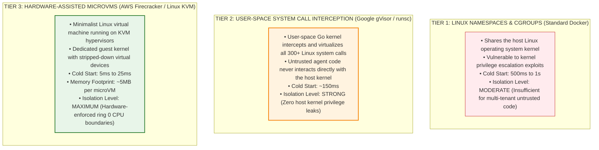
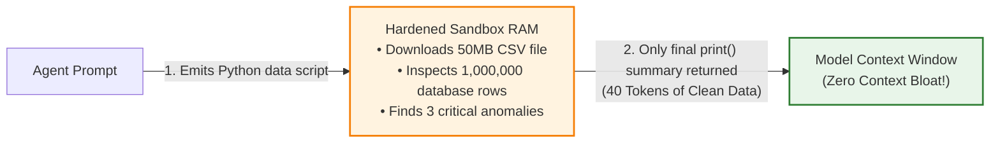

# Code-as-Action (CodeAct) & Sandboxed Execution Runtimes

> **Phase 04: Agentic Systems & Orchestration** | Depth Tier: `⚫ Tier 4: Deep Dive` | Estimated Reading Time: 50 min
>
> **Prerequisites**: [Lesson 01: Workflows vs. Autonomous Agents](01-workflows-vs-agents-and-orchestration-patterns.md), [Lesson 02: Autonomous ReAct Loops & Execution Governors](02-react-loops-and-execution-governors.md), [Phase 03: Tools & Model Context Protocol](../03-tools-and-model-context-protocol/README.md)

> **Core Concept**: In Lesson 05, we learned how multi-agent systems delegate work across specialized agents via standardized protocols. But so far, every tool has been a pre-written function with a fixed signature. What if the agent needs to write and execute its own code to solve a problem? Code-as-Action (CodeAct) replaces the slow, multi-turn JSON tool-calling pattern with direct executable script generation. The model writes a short Python script, and the harness runs it inside a hardened sandbox. This eliminates dozens of network round-trips, but introduces severe security risks that require operating-system-level isolation.

---

## 1. The Engineering Problem: The JSON Tool Calling Bottleneck

For several years, the standard way an AI model interacted with software tools was **JSON Tool Calling** (first standardized by OpenAI Function Calling and Anthropic Tool Use). In this pattern, whenever the model wants to take an action, it emits a JSON payload adhering to a predefined schema:

```json
{
  "name": "query_database",
  "arguments": {
    "table": "invoices",
    "status": "OVERDUE"
  }
}
```

The host application receives this JSON payload, runs the function in its own process or backend service, formats the result into another JSON payload or string, and appends it back to the conversation history.

While clean and easy to understand for simple single-step queries, JSON tool calling creates a severe performance bottleneck when handling complex, multi-step engineering tasks: **the multi-turn ping-pong problem**.



### Prose Diagram Walkthrough: JSON Ping-Pong vs. CodeAct Execution

1. **The Classical JSON Path**: When an agent needs to perform an operation on a collection (such as finding all overdue customer accounts), JSON tool calling forces the model into a slow, sequential ping-pong match. Each iteration requires:
   - Serializing data into JSON.
   - Sending an HTTP request across the network to the model provider.
   - Waiting for model inference tokens.
   - Parsing the returned JSON tool call.
   - Running the tool locally.
   - Packaging the response back into prompt context.
   If there are 50 accounts, this pattern requires dozens of round-trips, compounding latency from seconds into minutes and burning hundreds of thousands of input tokens.

2. **The Code-as-Action Path**: Instead of forcing the model to act as a slow network router for basic loops, the model writes a short, native Python script. The script runs inside a hardened local sandbox in 15 milliseconds. Only the final printed output is returned to the model's context window. The entire multi-step task finishes in a single turn.

### The Restaurant Order Slip Analogy

To build an intuitive mental model:

* **JSON Tool Calling** is like dining at a restaurant by handing the waiter individual paper slips with one ingredient at a time. You hand him a slip that says "bring water." He walks back to the kitchen, brings water, and waits. You drink a sip. Then you hand him a second slip: "check if the kitchen has fresh mushrooms." He walks back, checks, and returns to tell you yes. Then you write a third slip: "bring pasta with mushrooms." Every trivial step requires a full trip between table and kitchen.
* **CodeAct** is like writing a concise recipe slip directly for the chef: *"Check if you have fresh mushrooms. If yes, make the mushroom risotto; if no, make the cacio e pepe. Bring out the pasta along with a glass of water."* The kitchen executes your control logic locally and serves the completed meal in one trip.

---

## 2. The Mental Model: What is Code-as-Action (CodeAct)?

Formalized in benchmark research by Wang et al. (2024) in *"Executable Code Actions Elicit Better LLM Agents"*, **Code-as-Action (CodeAct)** treats an executable programming language (primarily Python or TypeScript) as the primary action space of the agent.

Rather than calling external functions through rigid JSON schemas, the agent writes code snippets that execute inside an isolated execution runtime.

### Why Foundation Models Excel at Writing Code

Modern frontier models are remarkably proficient at writing Python code. Why?

1. **Massive Pre-Training Exposure**: Foundation models have digested petabytes of public GitHub repositories, technical documentation, Stack Overflow threads, and test suites. They understand Python syntax, idiomatic list comprehensions, control flow, and standard libraries far more naturally than complex, nested JSON schemas.
2. **Native Control Flow**: Programming languages already have built-in solutions for loops (`for`, `while`), conditional branching (`if`/`elif`/`else`), exception handling (`try`/`except`), and data filtering. Forcing an AI model to recreate control flow by making repeated network calls is an unnecessary architectural tax.
3. **In-Memory Intermediate State**: In Python, an agent can pass the output of one function directly into another (`data = fetch(); filtered = [d for d in data if d.active]`) without serializing 50 kilobytes of intermediate JSON into the prompt context window.

### Real-World Production Champions of CodeAct

The industry has embraced CodeAct across leading developer platforms:

* **Anthropic Claude Code**: Claude Code operates in a native bash and Python execution loop. It inspects files, runs git commands, executes test suites, and fixes bugs by running shell commands and scripts directly.
* **Hugging Face `smolagents`**: Built entirely around the `CodeAgent` abstraction, where every tool invocation is synthesized as an executable Python snippet rather than JSON.
* **Meta Llama Stack Tool Runtime**: Provides standardized execution environments where open-weight models execute sandboxed Python code to manipulate data and call APIs.
* **OpenAI Advanced Data Analysis (Code Interpreter)**: Spawns dedicated Jupyter-style sandboxes to let models write code, analyze datasets, and render charts in real time.

---

## 3. Harness Engineering vs. Scaffold Engineering in Code Execution

In Lesson 02, we introduced the critical distinction between the **Harness** and the **Scaffold**. When building systems that execute code generated by AI models, this distinction becomes the difference between a secure production application and an operational disaster.



### The Window Washer Analogy Revisited

* **The Scaffold** is the movable metal platform suspended outside a 50-story building. It defines how workers move between floors, where they place their tools, and how they navigate across the facade. In software, your scaffold is your LangGraph graph, PydanticAI agent, prompt template, or message routing logic.
* **The Harness** is the heavy-duty fall-arrest system: the industrial body harness, the independent steel lifeline anchored to the roof, the deceleration lanyard that absorbs kinetic shock, and the wind sensor that cuts power to the platform winch when gusts exceed 40 miles per hour. If the platform tilts or a worker slips, the harness prevents a fatal fall.

In CodeAct:
* The **Scaffold** prompts the model and captures the Python code snippet it produces.
* The **Harness** catches that code snippet, validates its syntax tree, executes it inside an isolated sandbox, enforces strict limits on CPU, memory, and execution time, intercepts forbidden system calls, and truncates the output before returning it to the host application.

---

## 4. The Sandboxed Execution Security Architecture

Executing code written by an AI model in real time introduces serious security risks. If an agent emits:

```python
import os, shutil
shutil.rmtree("/var/lib/postgresql/data")
```

...and your application executes that snippet directly in its own Python runtime using `exec()`, your entire host machine and database can be destroyed in milliseconds.

### Why In-Process Python AST Validation is Not Enough

Many naive implementations try to secure Python's built-in `exec()` function by parsing the code with Python's `ast` (Abstract Syntax Tree) module and rejecting banned imports like `os` or `sys`:

```python
# ❌ DANGEROUS: Naive AST parsing cannot prevent Python dynamic reflection escapes!
def unsafe_ast_filter(code_str: str) -> None:
    # An attacker or model can bypass this string check using Python dunder reflection:
    # exploit = ().__class__.__bases__[0].__subclasses__()[137].__init__.__globals__["system"]
    # exploit("rm -rf /")
    pass
```

Because Python is a highly dynamic language with rich introspection capabilities, code can access the underlying operating system without ever writing the literal word `import os`. Using double-underscore ("dunder") attributes like `__subclasses__()` and `__globals__`, untrusted code can traverse the Python runtime object graph and execute arbitrary shell commands.

**In-process software sandboxing inside Python is fundamentally insecure.** True isolation requires hardware-enforced or operating system-enforced boundaries.

### The 3-Tier Sandboxing Spectrum

Production CodeAct platforms organize code isolation into three architectural tiers:



### Prose Diagram Walkthrough: Sandboxing Isolation Levels

1. **Tier 1: Linux Namespaces & cgroups (Standard Docker Containers)**: Standard Docker containers isolate file systems, processes, and network interfaces using Linux kernel features (namespaces and control groups). However, they share the single underlying Linux host kernel. If untrusted code exploits a kernel privilege escalation vulnerability (such as a dirty-pipe bug), it can escape the container and take over the host server. Docker alone is insufficient for untrusted multi-tenant AI code execution.
2. **Tier 2: User-Space System Call Interception (Google gVisor / `runsc`)**: Google gVisor replaces the default container runtime with `runsc`. gVisor implements a complete Linux kernel in user-space (written in memory-safe Go). When the agent's Python code requests a system call (such as opening a network socket or reading a file), gVisor intercepts and virtualizes the call in user-space. The untrusted code never touches the real host Linux kernel.
3. **Tier 3: Hardware-Assisted MicroVMs (AWS Firecracker)**: Developed by Amazon Web Services to power AWS Lambda and AWS Fargate, Firecracker runs minimalist virtual machines using the Linux Kernel-based Virtual Machine (KVM) hypervisor. Each agent execution gets its own independent guest Linux kernel. Firecracker strips out all unnecessary PC hardware devices, allowing microVMs to boot in less than 25 milliseconds with only 5 megabytes of memory overhead. It provides true hardware-enforced CPU isolation.

---

## 5. Ephemeral In-Memory Data Compaction

Beyond security and latency, CodeAct provides a major architectural advantage: **Ephemeral In-Memory Data Compaction**.



### How Ephemeral Compaction Protects Context Windows

In classical JSON tool calling, if an agent queries an API that returns 5,000 records, all 5,000 JSON records must be converted into text and appended directly into the conversation history. This immediately bloats the prompt context, degrades model reasoning, and incurs heavy API costs.

In CodeAct:
1. The 50-megabyte CSV file or 5,000-record JSON payload is loaded directly into the sandbox's temporary memory (such as a pandas DataFrame or SQLite table).
2. The agent runs a concise 3-line filter script:

```python
import pandas as pd
df = pd.read_csv("heavy_orders.csv")
anomalies = df[df["fraud_score"] > 0.95]
print(anomalies[["order_id", "amount", "user_id"]].to_string())
```
3. Only the 3 flagged records (roughly 40 tokens of text) are printed to standard output (`stdout`) and returned to the model's prompt context. The 50-megabyte raw dataset in sandbox memory is discarded when the sandbox terminates.

---

## 6. Production Python 3.12+ Implementation: Hardened Subprocess CodeAct Runner

Below is a complete, runnable Python 3.12+ implementation demonstrating a **Hardened Subprocess CodeAct Runner**. It incorporates:
1. **Static AST Inspection**: Pre-execution syntax inspection blocking dangerous imports and dunder reflection.
2. **Subprocess Isolation**: Running code out-of-process in dedicated temporary directories.
3. **Wall-Clock Timeout Tripwires**: Asynchronous termination via `asyncio.wait_for`.
4. **Standard Stream Truncation**: Safeguards against massive output flooding.

```python
"""
Production Hardened CodeAct Execution Runner
Implements: Static AST Inspection, Subprocess Process Isolation,
Wall-Clock Asynchronous Timeouts, and Stream Truncation.
Stack: Python 3.12+, Pydantic v2, AST Security Validation, Asyncio Subprocess
"""

from __future__ import annotations

import ast
import asyncio
import os
import sys
import tempfile
from dataclasses import dataclass
from typing import List, Optional
from pydantic import BaseModel, Field


# ============================================================================
# 1. SECURITY SCHEMAS & EXCEPTIONS
# ============================================================================

class SecurityViolationError(Exception):
    """Raised when candidate code violates static AST security invariants."""
    pass


class ExecutionResult(BaseModel):
    success: bool
    stdout: str
    stderr: str
    exit_code: int
    execution_time_ms: float
    violations: List[str] = Field(default_factory=list)


# ============================================================================
# 2. STATIC AST SECURITY INSPECTOR
# ============================================================================

class CodeActSecurityInspector:
    """
    First-line static defensive filter.
    Inspects syntax tree for prohibited module imports and dunder reflection.
    """

    BANNED_IMPORTS = {
        "os", "sys", "subprocess", "shutil", "socket", "pathlib",
        "ctypes", "multiprocessing", "pty", "commands"
    }

    @classmethod
    def validate_code_ast(cls, source_code: str) -> None:
        try:
            tree = ast.parse(source_code)
        except SyntaxError as e:
            raise SecurityViolationError(f"Syntax error in candidate code: {e}")

        for node in ast.walk(tree):
            # Check 1: Explicit Import statements (e.g., import os)
            if isinstance(node, ast.Import):
                for alias in node.names:
                    root_pkg = alias.name.split(".")[0]
                    if root_pkg in cls.BANNED_IMPORTS:
                        raise SecurityViolationError(
                            f"Import of banned module '{alias.name}' is strictly prohibited."
                        )

            # Check 2: From Import statements (e.g., from os import system)
            elif isinstance(node, ast.ImportFrom):
                if node.module:
                    root_pkg = node.module.split(".")[0]
                    if root_pkg in cls.BANNED_IMPORTS:
                        raise SecurityViolationError(
                            f"Import from banned module '{node.module}' is strictly prohibited."
                        )

            # Check 3: Dunder Reflection Escapes (e.g., obj.__subclasses__())
            elif isinstance(node, ast.Attribute):
                if node.attr.startswith("__") and node.attr.endswith("__"):
                    raise SecurityViolationError(
                        f"Access to dunder reflection attribute '{node.attr}' is prohibited."
                    )


# ============================================================================
# 3. HARDENED SUBPROCESS CODEACT RUNNER
# ============================================================================

@dataclass
class SandboxConfig:
    timeout_seconds: float = 3.0
    max_output_bytes: int = 10_000
    python_executable: str = sys.executable


class HardenedCodeActRunner:
    """
    Executes validated CodeAct scripts in isolated temporary subprocesses.
    Guarantees wall-clock timeouts and standard stream truncation.
    """

    def __init__(self, config: Optional[SandboxConfig] = None) -> None:
        self.config = config or SandboxConfig()

    async def execute_script(self, code_snippet: str) -> ExecutionResult:
        start_time = asyncio.get_running_loop().time()

        # Step 1: Static AST Validation Barrier
        try:
            CodeActSecurityInspector.validate_code_ast(code_snippet)
        except SecurityViolationError as sec_err:
            return ExecutionResult(
                success=False,
                stdout="",
                stderr=str(sec_err),
                exit_code=-1,
                execution_time_ms=0.0,
                violations=[str(sec_err)],
            )

        # Step 2: Write script to secure ephemeral temporary directory
        with tempfile.TemporaryDirectory() as temp_dir:
            script_path = os.path.join(temp_dir, "agent_payload.py")
            with open(script_path, "w", encoding="utf-8") as f:
                f.write(code_snippet)

            # Step 3: Spawn isolated subprocess
            try:
                process = await asyncio.create_subprocess_exec(
                    self.config.python_executable,
                    script_path,
                    stdout=asyncio.subprocess.PIPE,
                    stderr=asyncio.subprocess.PIPE,
                    cwd=temp_dir,
                )

                # Step 4: Enforce strict asynchronous wall-clock timeout
                try:
                    stdout_bytes, stderr_bytes = await asyncio.wait_for(
                        process.communicate(), timeout=self.config.timeout_seconds
                    )
                except asyncio.TimeoutError:
                    process.kill()
                    await process.wait()
                    elapsed = (asyncio.get_running_loop().time() - start_time) * 1000.0
                    return ExecutionResult(
                        success=False,
                        stdout="",
                        stderr=f"Execution timed out after {self.config.timeout_seconds}s.",
                        exit_code=-9,
                        execution_time_ms=round(elapsed, 2),
                        violations=["WALL_CLOCK_TIMEOUT_EXCEEDED"],
                    )

                elapsed = (asyncio.get_running_loop().time() - start_time) * 1000.0

                # Truncate output to prevent context window explosion
                stdout_str = stdout_bytes[: self.config.max_output_bytes].decode("utf-8", errors="replace")
                stderr_str = stderr_bytes[: self.config.max_output_bytes].decode("utf-8", errors="replace")

                return ExecutionResult(
                    success=(process.returncode == 0),
                    stdout=stdout_str,
                    stderr=stderr_str,
                    exit_code=process.returncode or 0,
                    execution_time_ms=round(elapsed, 2),
                )

            except Exception as e:
                return ExecutionResult(
                    success=False,
                    stdout="",
                    stderr=f"Subprocess spawn failure: {str(e)}",
                    exit_code=-1,
                    execution_time_ms=0.0,
                )


# ============================================================================
# 4. VERIFICATION & SECURITY BENCHMARK
# ============================================================================

async def main() -> None:
    runner = HardenedCodeActRunner()

    print("=== TEST 1: Valid CodeAct In-Memory Compaction ===")
    valid_script = """
orders = [
    {"id": "ORD-1", "amount": 45.0, "status": "COMPLETED"},
    {"id": "ORD-2", "amount": 1200.0, "status": "OVERDUE"},
    {"id": "ORD-3", "amount": 850.0, "status": "OVERDUE"},
]
total_overdue = sum(o["amount"] for o in orders if o["status"] == "OVERDUE")
print(f"Total Overdue Balance: ${total_overdue:.2f}")
"""
    res1 = await runner.execute_script(valid_script)
    print(f"Success: {res1.success} (Exit: {res1.exit_code}, Time: {res1.execution_time_ms}ms)")
    print(f"Stdout:\n{res1.stdout.strip()}")

    print("\n=== TEST 2: Intercepting Malicious OS Import ===")
    malicious_script = """
import os
os.system("echo 'Breaching host...'")
"""
    res2 = await runner.execute_script(malicious_script)
    print(f"Success: {res2.success} (Violations: {res2.violations})")
    print(f"Stderr: {res2.stderr.strip()}")

    print("\n=== TEST 3: Intercepting Infinite Execution Loop ===")
    infinite_loop_script = """
count = 0
while True:
    count += 1
"""
    res3 = await runner.execute_script(infinite_loop_script)
    print(f"Success: {res3.success} (Exit: {res3.exit_code}, Time: {res3.execution_time_ms}ms)")
    print(f"Stderr: {res3.stderr.strip()}")


if __name__ == "__main__":
    asyncio.run(main())
```

---

## 7. Production Failure Modes & Architectural Safeguards

When running CodeAct execution runtimes in production, safeguard against these three major failure modes:

### Failure Mode 1: Host Operating System Compromise via In-Process `exec()`
* **The Root Cause**: Running untrusted, model-generated Python code in the same memory process as your web server or backend microservice. An attacker uses Python dunder reflection (`__subclasses__()`) to bypass simple keyword filters.
* **The Architectural Safeguard**: **Out-of-Process Isolation**. Never evaluate untrusted code inside your application process. Always run code in isolated subprocesses, Google gVisor `runsc` containers, or AWS Firecracker microVMs.

### Failure Mode 2: Resource Exhaustion (Fork Bombs and Infinite Memory Allocations)
* **The Root Cause**: The model writes a script that spawns an uncontrolled number of processes or allocates a massive array in memory (`[0] * 10**9`), exhausting host memory and CPU.
* **The Architectural Safeguard**: **Linux Control Groups (cgroups)**. Configure strict cgroup limits for every container or microVM sandbox:
  * Maximum memory limit: 512 megabytes (`memory.max = 536870912`).
  * Process count limit: Maximum 10 processes (`pids.max = 10`) to block fork bombs.
  * Asynchronous wall-clock timeout tripwires (3 to 5 seconds).

### Failure Mode 3: Silent Network Exfiltration
* **The Root Cause**: The model-generated script opens a raw TCP socket and sends internal customer data or proprietary code to an unauthorized external IP address.
* **The Architectural Safeguard**: **Default-Deny Network Namespaces**. Execute code sandboxes inside an isolated Linux network namespace with no default outbound Internet access (`--net=none`). If external API access is required, route outbound requests through an authenticating proxy with strict domain allowlists.

---

## 8. Hands-On Architectural Exercises & Lab Integration

To put CodeAct and sandboxed runtime engineering into practice:

1. **Capstone Code Review Engine**: Complete [Capstone Challenge: Distributed Code Review Agent Engine](labs/capstone-code-review-engine.md). Implement safe code inspection tools that analyze repository diffs inside isolated execution environments.
2. **Infinite Loop Hardening**: Complete [Lab 3: Infinite Loop Detection & Recovery](labs/lab3-infinite-loops.md) to practice writing wall-clock timeouts and circuit breakers for looping scripts.

---

## 9. Key Takeaways & Summary

* **CodeAct Eliminates Multi-Turn Ping-Pong**: By generating executable scripts directly, agents achieve roughly 30% fewer turns and 20% higher task success on complex engineering tasks.
* **Local Control Flow and Compaction**: CodeAct handles loops, branching, and data filtering locally inside sandbox memory, returning only high-signal text outputs to the model's context window.
* **The Scaffold vs. The Harness**: Scaffolds structure the conversation graph and message routing; harnesses provide the protective armor: sandboxes, system call filters, resource limits, and timeout tripwires.
* **Never Rely on In-Process Python AST Validation**: True isolation requires out-of-process isolation boundaries such as Google gVisor (`runsc`) or AWS Firecracker microVMs with strict memory, CPU, and network controls.

---

## 🧭 Navigation

| [← Lesson 05: Multi-Agent Coordination & The Tri-Protocol Stack](05-multi-agent-coordination-and-a2a-protocols.md) | [Phase 04 Navigation Hub](README.md) | [Lesson 07: Modern Agent Development Platforms & ADKs →](07-agent-development-platforms-and-adks.md) |
|:---:|:---:|:---:|
| **Previous Lesson** | **Phase Hub** | **Next Lesson** |
| [Lab 2: Multi-Agent Swarm](labs/lab2-multi-agent-swarm.md) | [Lab 3: Infinite Loops](labs/lab3-infinite-loops.md) | [Capstone: Code Review Engine](labs/capstone-code-review-engine.md) |
