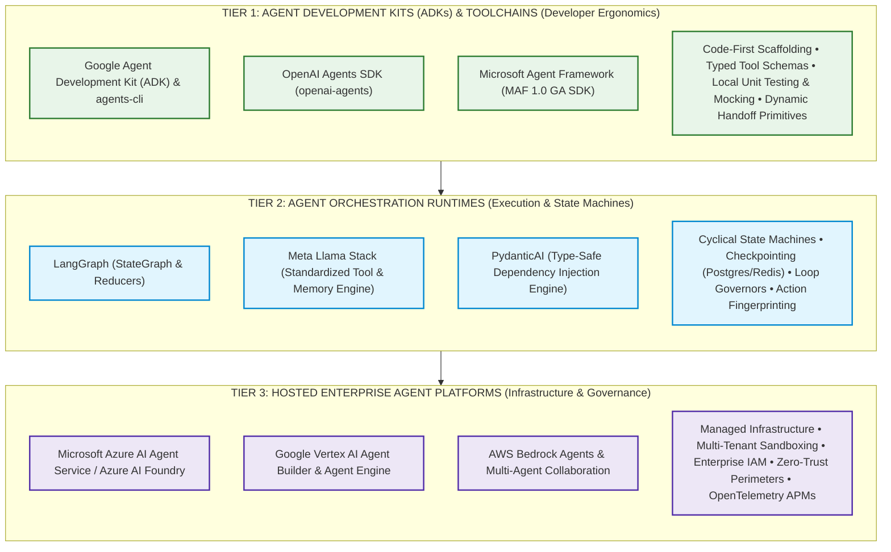
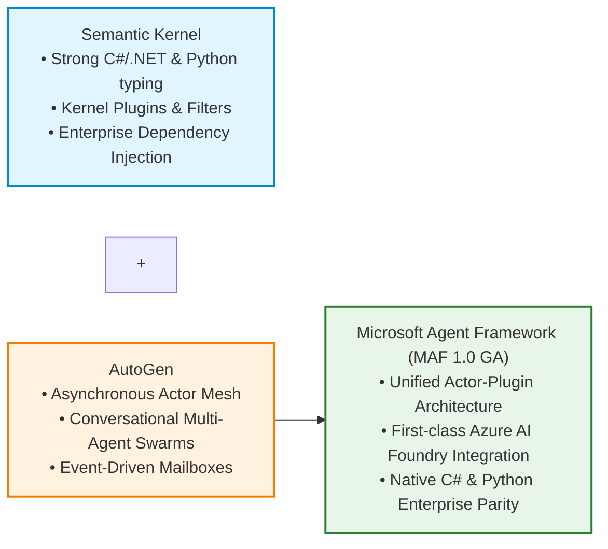
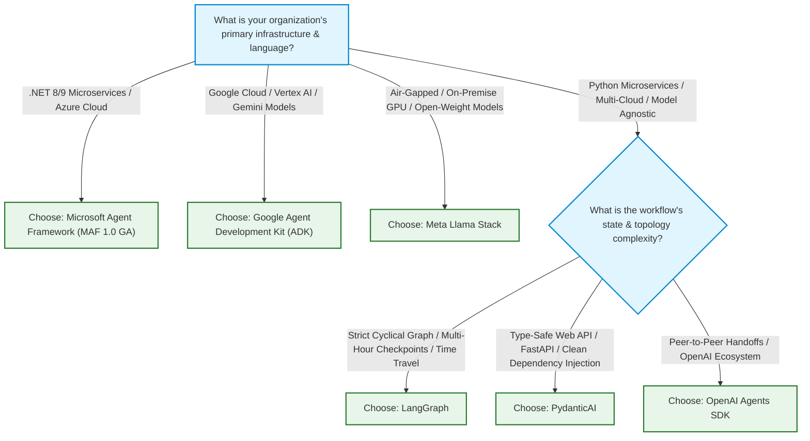

# Modern Agent Development Platforms & Agent Development Kits (ADKs)

> **Phase 04: Agentic Systems & Orchestration** | Depth Tier: `🟡 Tier 2: Engineering Depth` | Estimated Reading Time: 50 min
>
> **Prerequisites**: [Lesson 01: Workflows vs. Autonomous Agents](01-workflows-vs-agents-and-orchestration-patterns.md), [Lesson 02: Autonomous ReAct Loops & Execution Governors](02-react-loops-and-execution-governors.md), [Lesson 03: Stateful Sessions, Durable WAL & Distributed Sagas](03-stateful-sessions-and-durable-wal-persistence.md), [Lesson 05: Multi-Agent Coordination & The Tri-Protocol Stack](05-multi-agent-coordination-and-a2a-protocols.md)
>
> **Core Concept**: In enterprise software engineering, developers do not write raw HTTP sockets to build web APIs; they build on standardized web frameworks and software development kits (SDKs). Similarly, modern AI engineering has moved beyond raw prompt strings and home-grown while-loops to **Agent Development Kits (ADKs)**, **Agent Runtimes**, and **Hosted Agent Platforms**. An ADK is a code-first developer toolchain (such as Google ADK or OpenAI Agents SDK) that provides scaffolding, tool binding, and lifecycle management. An Agent Runtime (such as LangGraph or Meta Llama Stack) executes cyclical state graphs, manages reducers, and enforces loop governors. A Hosted Agent Platform (such as Microsoft Azure AI Agent Service or Google Vertex AI) provisions managed infrastructure, identity, sandboxing, and enterprise telemetry. Selecting the right layer decouples business logic from model providers and prevents costly platform rewrites.

---

## 1. The Systems Problem: Framework Chaos & The Abstraction Tax

In the early phases of generative AI adoption, engineering teams built prototypes by stringing together basic API calls to language model endpoints:

```python
# The Fragile Prototype Anti-Pattern: Raw API Calls & Fragile Strings
response = client.chat.completions.create(
    model="gpt-4o",
    messages=[{"role": "user", "content": f"Extract invoice from {raw_text}"}],
)
# Manual string slicing, unvalidated JSON parsing, zero retry state, zero telemetry
```

As systems grew into production, teams encountered what distributed systems architects call the **Abstraction Tax**:
1. **Framework Churn & Lock-In**: Teams adopted high-level wrapper libraries that promised "autonomous magic in three lines of code." When those libraries updated, their internal prompt templates changed, breaking production behavior without warning.
2. **Hidden Execution Graphs**: Heavy frameworks obscured what was actually being sent over the wire, making it impossible to debug latency spikes, token budget explosions, or prompt injection vulnerabilities.
3. **Decoupled Tooling & Testing**: Teams could not unit test their tools without spinning up live, paid connections to closed-source model APIs.

In 2025 and 2026, the industry consolidated around standardized, production-grade architectural tiers.

---

## 2. The Architectural Taxonomy: ADK vs. Runtime vs. Platform

To evaluate the ecosystem objectively, software architects distinguish between three distinct architectural layers:



### The Three Layers Defined

1. **Tier 1: Agent Development Kits (ADKs) & Client SDKs**:
   * **Definition**: The code-first developer toolchain used to author, scaffold, test, and package agent logic.
   * **What They Provide**: Command-line interfaces (CLIs), project generators, decorators to convert native functions into JSON schemas, local mock environments, and evaluation harnesses.
   * **Examples**: Google ADK with `agents-cli`, OpenAI Agents SDK (`openai-agents`), Microsoft Agent Framework SDK.
2. **Tier 2: Agent Orchestration Runtimes**:
   * **Definition**: The execution engine that governs how state transitions occur between prompt invocations and tool executions.
   * **What They Provide**: Graph state machines, Write-Ahead Log (WAL) checkpointers, cryptographic loop governors, action deduplication, and context compaction.
   * **Examples**: LangGraph, Meta Llama Stack Agent Engine, PydanticAI.
3. **Tier 3: Hosted Enterprise Agent Platforms**:
   * **Definition**: The managed cloud environment that provides runtime infrastructure, security boundaries, and operational observability.
   * **What They Provide**: Auto-scaling compute, hardware-isolated sandboxes (gVisor/Firecracker), role-based access control (RBAC), KMS secret encryption, and distributed OpenTelemetry tracing.
   * **Examples**: Microsoft Azure AI Agent Service, Google Vertex AI Agent Engine, AWS Bedrock Agents.

---

## 3. Deep-Dive: The Premier 2025–2026 Frameworks & ADKs

Let us examine the architecture, trade-offs, and design patterns of the leading industry platforms.

### 3.1 Microsoft Agent Framework (MAF 1.0 GA, April 2026)

The **Microsoft Agent Framework (MAF)** represents the official unification of Microsoft's two previously independent initiatives: **Semantic Kernel** (known for its enterprise C# typing and dependency injection) and **AutoGen** (known for its asynchronous, multi-agent conversational patterns).



* **Core Architectural Pattern**: **Asynchronous Actor Mesh**. Every agent is an independent actor possessing its own inbound mailbox. Messages are processed sequentially, guaranteeing that internal state is immune to multi-threaded race conditions.
* **Plugin Architecture**: Tools are defined as strongly typed plugins using native C# attributes (`[KernelFunction]`) or Python decorators. It supports native dependency injection out-of-the-box, allowing database pools and HTTP clients to be injected cleanly.
* **Best Enterprise Fit**: Organizations standardized on Microsoft Azure, C#/.NET 8/9 microservices, and Azure OpenAI Service.

### 3.2 Google Agent Development Kit (ADK) & `agents-cli`

Developed by Google Cloud, the **Google Agent Development Kit (ADK)** provides a code-first developer lifecycle toolchain centered around the `agents-cli` utility.

* **Core Architectural Pattern**: **Code-First Prototype-to-Production**. Google ADK intentionally avoids heavy, opaque wrapper classes. Agents are standard Python classes or functions.
* **The `agents-cli` Toolchain**:
  * `agents-cli scaffold create`: Scaffolds a production-ready agent project with directory conventions, typed configs, and Dockerfiles.
  * `agents-cli test` / `eval`: Runs automated evaluations using trajectory datasets and LLM-as-a-judge scoring.
  * `agents-cli deploy`: Packages and deploys the agent directly to Google Cloud Run, GKE, or Vertex AI Agent Engine.
  * `agents-cli publish`: Registers the agent into the enterprise **Agent Registry**, publishing its capabilities for discovery via the Linux Foundation Agent-to-Agent (A2A) protocol.
* **Native Protocol Support**: First-class, turnkey integration with the **Model Context Protocol (MCP)**, allowing agents to ingest external MCP tool servers with zero boilerplate.
* **Best Enterprise Fit**: Google Cloud Platform (GCP) environments, Gemini-native reasoning workflows, and Kubernetes-based microservice fleets.

### 3.3 OpenAI Agents SDK (`openai-agents`)

The **OpenAI Agents SDK** is the official production evolution of OpenAI's lightweight experimental Swarm framework.

* **Core Architectural Pattern**: **Dynamic Peer Handoffs**. The framework structures multi-agent collaboration around lightweight Python classes:
  * `Agent`: Encapsulates a focused system prompt, model selection, and tool schemas.
  * `Handoff`: A first-class primitive allowing an agent to yield control directly to another agent.
  * `Runner`: Manages the loop execution, tracks turn counts, and enforces guardrails.
* **Turnkey Sandboxes & Guardrails**: Includes built-in input/output guardrail interceptors that scan for prompt injections before the model processes text and verify structured outputs before delivering them to users.
* **Best Enterprise Fit**: Applications built natively on OpenAI infrastructure, customer support swarms, and low-latency real-time voice agents.

### 3.4 Meta Llama Stack

The **Meta Llama Stack** is an open-source, standardized API specification designed to make open-weight models (such as Llama 3 and Llama 4) first-class enterprise citizens.

* **Core Architectural Pattern**: **Modular Standardized API Provider Architecture**. Instead of coupling an agent to a specific inference engine, the Llama Stack defines standardized REST/gRPC interfaces for:
  1. *Inference API*: Interfacing with vLLM, Ollama, TGI, or cloud endpoints.
  2. *Agent API*: Orchestrating autonomous ReAct loops.
  3. *Tool Runtime API*: Sandboxed Python and shell execution.
  4. *Memory API*: Vector embeddings, hybrid search, and graph memory.
  5. *Safety API*: Integrated **Llama Guard 3** security boundaries.
* **Best Enterprise Fit**: On-premise air-gapped deployments, defense and financial institutions requiring zero third-party data egress, and self-hosted open-weight GPU clusters.

### 3.5 PydanticAI

Created by the team behind Pydantic, **PydanticAI** brings the developer ergonomics and rigorous runtime validation of FastAPI to AI agent engineering.

* **Core Architectural Pattern**: **Type-Safe Dependency Injection**.
  * Tool parameters, return types, and agent responses are validated against Pydantic v2 schemas at runtime.
  * Implements `RunContext[Deps]`: allows developers to inject database pools, HTTP sessions, and authentication tokens into tool calls dynamically.
* **Model Agnostic**: Works interchangeably with OpenAI, Anthropic, Gemini, Groq, and local Ollama instances through a unified interface.
* **Best Enterprise Fit**: High-throughput web APIs, financial transaction processors, and engineering teams that prioritize strict type safety, clean code architecture, and high testability.

### 3.6 LangGraph

Created by LangChain, **LangGraph** models agent execution as a stateful, cyclical computation graph.

* **Core Architectural Pattern**: **Cyclical Directed Graph (DAG with Cycles)**.
  * State is represented as a typed dictionary or Pydantic model.
  * Nodes are Python functions that transform state.
  * Edges define deterministic or conditional transitions.
  * State Reducers govern how concurrent node outputs merge into the shared state.
* **Durable Persistence**: Built-in checkpointers (`PostgresSaver`, `SqliteSaver`) automatically serialize state after every node execution. This enables **Time-Travel Debugging** (rewinding an agent to turn 3 and re-executing) and seamless Human-in-the-Loop approval pauses.
* **Best Enterprise Fit**: Complex, multi-stage workflows requiring cyclical error recovery, multi-hour state persistence, and branching graph architectures.

---

## 4. Comprehensive Architectural Comparison Matrix

| Framework / Platform | Primary Language | Architectural Paradigm | State Persistence | Tool Protocol Support | Distributed Telemetry | Best Enterprise Fit |
|---|---|---|---|---|---|---|
| **Microsoft Agent Framework (MAF 1.0 GA)** | C# (.NET 8/9), Python | Unified Actor Mesh & Kernel Plugins | Event-bus checkpoints, Azure Blob/CosmosDB | Native Plugins, OpenAPI, MCP | OpenTelemetry, Azure Application Insights | Enterprise .NET microservices, Azure AI Foundry ecosystems |
| **Google Agent Development Kit (ADK)** | Python, TypeScript | Code-First components with `agents-cli` | Vertex AI Agent Engine, Firestore, Spanner | Native MCP, Google Tool Repositories | OpenTelemetry, Google Cloud Trace | Google Cloud architectures, Gemini-native multimodal tools |
| **OpenAI Agents SDK (`openai-agents`)** | Python | Peer-to-Peer Dynamic Handoffs | Hosted OpenAI Threads, Custom DB | Function Calling, MCP connectors | Native OpenAI platform traces, OpenTelemetry | OpenAI-centric stacks, consumer support, voice agents |
| **Meta Llama Stack** | Python | Standardized Open-Source Agent APIs | Standardized Memory API (SQLite, PGVector) | Llama Stack Tool Runtime (Python, Bash) | OpenTelemetry semantic spans | Air-gapped on-premise deployments, self-hosted Llama clusters |
| **PydanticAI** | Python | Model-Agnostic with Dependency Injection | Developer-defined / SQLModel / Redis | Type-safe Python functions, OpenAPI | Logfire, OpenTelemetry | FastAPI services, financial data pipelines, typed microservices |
| **LangGraph** | Python, TypeScript | Cyclical StateGraph (Nodes, Edges, Reducers) | `PostgresSaver`, `SqliteSaver`, Redis | LangChain tools, MCP client connectors | LangSmith, OpenTelemetry | Long-running stateful workflows, cyclical graphs, time travel |

---

## 5. Architectural Selection Decision Tree

Use this decision logic when evaluating frameworks for enterprise initiatives:



### Prose Diagram Walkthrough: Selection Logic

1. **Infrastructure Alignment**:
   * If your enterprise backend is built on **C# / .NET** and hosted on Microsoft Azure, select **Microsoft Agent Framework (MAF)**. It provides native language bindings, avoiding the overhead of maintaining separate Python microservices.
   * If your infrastructure is standardized on **Google Cloud Platform (GCP)** and leverages Gemini models, select **Google ADK**. It integrates natively with Cloud Run, Vertex AI, and the `agents-cli` deployment lifecycle.
   * For **air-gapped, zero-data-egress on-premise environments**, select the **Meta Llama Stack** to deploy standardized agent runtimes against local vLLM instances.
2. **Workflow Complexity (Python Multi-Cloud)**:
   * When an application requires **cyclical graphs, custom state reducers, and multi-day checkpointing** with human sign-offs, select **LangGraph**.
   * When building **type-safe microservices inside FastAPI** that require mockable dependency injection for CI/CD test suites, select **PydanticAI**.
   * For **interactive support swarms** that rely on direct peer handoffs within the OpenAI ecosystem, select the **OpenAI Agents SDK**.

---

## 6. Production Python 3.12+ Implementation: Multi-Model Type-Safe Agent with Dependency Injection

Below is a complete, runnable Python 3.12+ implementation demonstrating the architectural pattern popularized by modern ADKs (such as PydanticAI and Google ADK):
1. **Type-Safe Invariants**: Validating all tool inputs and outputs with Pydantic v2.
2. **Dependency Injection**: Injecting mockable database pools and authentication contexts cleanly into tools.
3. **Model-Agnostic Abstraction**: Decoupling domain business logic from the underlying model provider.

```python
"""
Production Type-Safe Agent with Dependency Injection (ADK Architecture)
Demonstrates: Runtime schema validation, dependency injection, and tool routing.
Tech Stack: Python 3.12+, Pydantic v2, Typed Schemas
"""

from __future__ import annotations

import asyncio
from dataclasses import dataclass
from typing import Any, Callable, Dict, List, Optional
from pydantic import BaseModel, Field


# ============================================================================
# 1. DOMAIN SCHEMAS & DEPENDENCY CONTEXT
# ============================================================================

class AccountRecord(BaseModel):
    account_id: str
    owner_name: str
    balance_usd: float
    is_frozen: bool = False


@dataclass
class AgentDependencies:
    """
    Injected runtime dependencies (e.g. database connections, API clients, credentials).
    Allows unit tests to inject mock databases without changing agent code.
    """
    db_accounts: Dict[str, AccountRecord]
    audit_log: List[str]
    tenant_id: str


class CreditRequest(BaseModel):
    """Strongly typed tool input schema."""
    account_id: str = Field(description="Unique customer account identifier (e.g., ACC-101)")
    amount_usd: float = Field(gt=0, description="Amount to credit in USD (must be positive)")
    reason: str = Field(min_length=5, description="Audit reason for the credit adjustment")


class CreditResult(BaseModel):
    """Strongly typed tool output schema."""
    success: bool
    new_balance_usd: float
    transaction_id: str
    message: str


# ============================================================================
# 2. TYPE-SAFE TOOL DEFINITION (WITH DEPENDENCY INJECTION)
# ============================================================================

def issue_account_credit(ctx: AgentDependencies, request: CreditRequest) -> CreditResult:
    """
    Executes an account credit adjustment against the injected database.
    Notice that the LLM only supplies `CreditRequest`; `AgentDependencies` is injected by the host.
    """
    account = ctx.db_accounts.get(request.account_id)
    if not account:
        return CreditResult(
            success=False,
            new_balance_usd=0.0,
            transaction_id="TX-FAILED",
            message=f"Account '{request.account_id}' does not exist.",
        )

    if account.is_frozen:
        return CreditResult(
            success=False,
            new_balance_usd=account.balance_usd,
            transaction_id="TX-REJECTED",
            message=f"Account '{request.account_id}' is frozen by compliance.",
        )

    # Mutate state safely
    account.balance_usd += request.amount_usd
    tx_id = f"TX-CREDIT-{len(ctx.audit_log) + 1001}"
    ctx.audit_log.append(f"[{ctx.tenant_id}] Credited ${request.amount_usd:.2f} to {request.account_id}: {request.reason}")

    return CreditResult(
        success=True,
        new_balance_usd=account.balance_usd,
        transaction_id=tx_id,
        message=f"Successfully credited ${request.amount_usd:.2f} to {account.owner_name}.",
    )


# ============================================================================
# 3. MODERN ADK AGENT ABSTRACTION
# ============================================================================

class TypedADKAgent:
    """
    Lightweight, production-grade agent implementation modeling modern ADK ergonomics.
    Enforces typed tool execution and isolated dependency injection.
    """

    def __init__(self, system_prompt: str) -> None:
        self.system_prompt = system_prompt
        self.tools: Dict[str, Callable[[AgentDependencies, Any], Any]] = {}
        self.tool_schemas: Dict[str, type[BaseModel]] = {}

    def register_tool(self, name: str, tool_func: Callable[[AgentDependencies, Any], Any], schema: type[BaseModel]) -> None:
        self.tools[name] = tool_func
        self.tool_schemas[name] = schema

    def execute_tool_call(self, tool_name: str, raw_arguments: Dict[str, Any], deps: AgentDependencies) -> Dict[str, Any]:
        """
        Validates arguments against the Pydantic schema and invokes the tool with injected deps.
        """
        tool_func = self.tools.get(tool_name)
        schema = self.tool_schemas.get(tool_name)
        if not tool_func or not schema:
            raise ValueError(f"Unknown tool: '{tool_name}'")

        # Step 1: Strict runtime validation using Pydantic v2
        validated_args = schema.model_validate(raw_arguments)

        # Step 2: Invoke function with injected dependencies
        result = tool_func(deps, validated_args)

        # Step 3: Return validated serialized JSON response
        if isinstance(result, BaseModel):
            return result.model_dump()
        return {"result": result}


# ============================================================================
# 4. VERIFICATION RUNNER & UNIT TESTING
# ============================================================================

def main() -> None:
    # Set up mock enterprise dependencies
    mock_database = {
        "ACC-101": AccountRecord(account_id="ACC-101", owner_name="Alice Vance", balance_usd=250.00),
        "ACC-102": AccountRecord(account_id="ACC-102", owner_name="Bob Ross", balance_usd=100.00, is_frozen=True),
    }
    mock_audit: List[str] = []
    deps = AgentDependencies(
        db_accounts=mock_database,
        audit_log=mock_audit,
        tenant_id="TENANT-FINANCE-PROD",
    )

    # Initialize agent
    agent = TypedADKAgent(
        system_prompt="You are an enterprise financial adjustments specialist. Execute credits accurately."
    )
    agent.register_tool("issue_account_credit", issue_account_credit, CreditRequest)

    print("=== TEST 1: Successful Tool Execution with Dependency Injection ===")
    simulated_model_call = {
        "account_id": "ACC-101",
        "amount_usd": 75.50,
        "reason": "Customer loyalty reward reimbursement.",
    }
    result1 = agent.execute_tool_call("issue_account_credit", simulated_model_call, deps)
    print(f"Tool Result: {result1}")
    print(f"Updated Database Balance: ${mock_database['ACC-101'].balance_usd:.2f}")

    print("\n=== TEST 2: Invariant Check (Frozen Account Protection) ===")
    simulated_frozen_call = {
        "account_id": "ACC-102",
        "amount_usd": 50.00,
        "reason": "Courtesy fee reversal.",
    }
    result2 = agent.execute_tool_call("issue_account_credit", simulated_frozen_call, deps)
    print(f"Tool Result: {result2}")

    print("\n=== Audit Log Entries ===")
    for entry in deps.audit_log:
        print(f"  -> {entry}")


if __name__ == "__main__":
    main()
```

---

## 7. Production Failure Modes & Architectural Anti-Patterns

When selecting and operating agent platforms, safeguard against these three systemic failure modes:

### Failure Mode 1: The Monolithic Framework Lock-In Trap
* **The Root Cause**: Coupling domain business logic, data models, and database access directly into proprietary framework abstractions (such as inheriting from third-party base classes across all business services). When the open-source framework deprecates classes or falls behind frontier models, the entire application must be rewritten.
* **The Defensive Invariant**: **Ports and Adapters (Hexagonal Architecture)**. Keep domain logic and tools as pure Python/C# functions with standard Pydantic schemas. Use the agent framework strictly as an edge adapter that invokes your domain functions.

### Failure Mode 2: Unobservable Black-Box Runtimes
* **The Root Cause**: Deploying agent frameworks that encapsulate execution inside high-level convenience methods (`agent.chat()`) without exporting distributed traces. When an agent enters an infinite loop or latency spikes by 5 seconds, developers cannot determine which tool or prompt was responsible.
* **The Defensive Invariant**: **Mandatory OpenTelemetry Export**. Require that every agent framework export spans conforming to the **OpenTelemetry GenAI Semantic Conventions** (`gen_ai.system`, `gen_ai.request.model`, `gen_ai.usage.prompt_tokens`).

### Failure Mode 3: Requiring Paid Model APIs for Local Unit Tests
* **The Root Cause**: Structuring tools and agents such that running local unit tests requires active API keys and live network calls to OpenAI or Anthropic. This makes CI/CD pipelines slow, flaky, expensive, and insecure.
* **The Defensive Invariant**: **Dependency Injection & Mock Providers**. Always use ADK architectures (such as PydanticAI or Google ADK) that support injecting mock dependencies and offline dummy LLM providers during automated CI/CD test runs.

---

## 8. Key Takeaways & Summary

* **The Three-Tier Architecture**:
  1. *ADKs & Toolchains (Google ADK, OpenAI Agents SDK)*: Developer ergonomics, scaffolding, typed schemas, and testing.
  2. *Orchestration Runtimes (LangGraph, Meta Llama Stack, PydanticAI)*: Graph state machines, loop governors, and durable persistence.
  3. *Hosted Platforms (Azure AI Agent Service, Vertex AI)*: Managed multi-tenant compute, sandboxing, and enterprise security.
* **Framework Selection Criteria**:
  * Choose **Microsoft Agent Framework (MAF)** for C#/.NET 8/9 and Azure AI Foundry.
  * Choose **Google ADK** for GCP, Gemini models, and the `agents-cli` lifecycle toolchain.
  * Choose **Meta Llama Stack** for on-premise, air-gapped open-weight deployments.
  * Choose **LangGraph** for complex cyclical graphs with long-running checkpoints.
  * Choose **PydanticAI** for type-safe FastAPI microservices and financial transaction processing.
* **Architecture Over Framework**: Never hardcode domain business logic into transient framework wrappers. Treat frameworks as replaceable orchestration adapters around clean, strongly typed domain functions.

---

## 🧭 Navigation

| [← Lesson 06: CodeAct & Sandboxed Execution Runtimes](06-codeact-and-sandboxed-execution-runtimes.md) | [Phase 04 Navigation Hub](README.md) | [Reference: Enterprise Frameworks Matrix →](reference/enterprise-agent-frameworks-matrix.md) |
|:---:|:---:|:---:|
| **Previous Lesson** | **Phase Hub** | **Next Reference** |
| [Lab 2: Multi-Agent Swarm](labs/lab2-multi-agent-swarm.md) | [Lab 3: Infinite Loops](labs/lab3-infinite-loops.md) | [Capstone: Code Review Engine](labs/capstone-code-review-engine.md) |
