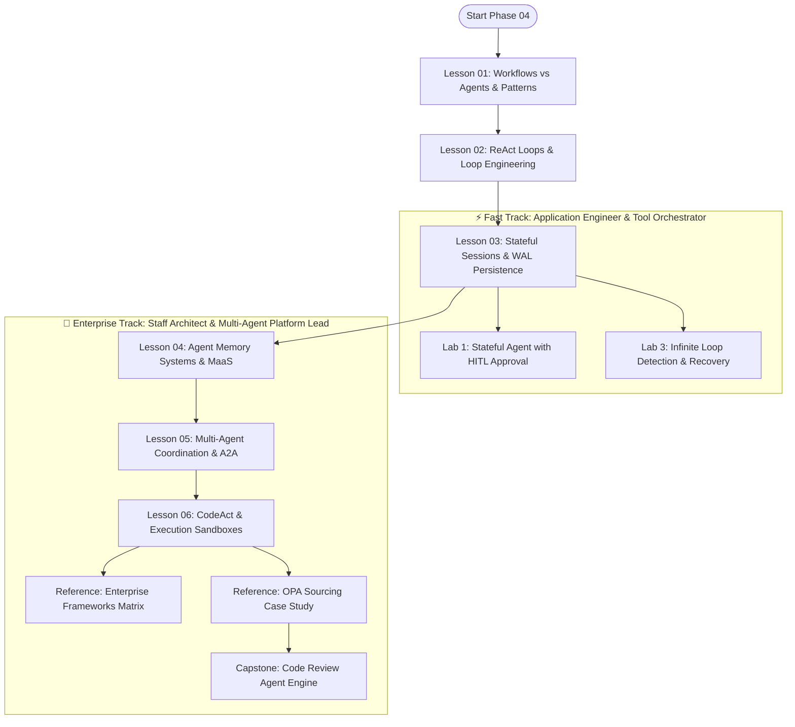

# Phase 04: Agentic Systems & Orchestration — Merged Refactoring Plan

**Planning Mode**: Curricular & Structural Refactoring Plan  
**Target Phase**: `04-agentic-systems-and-orchestration/`  
**Architect**: AI Curriculum Architect  
**Audience**: Senior Software Engineers, Staff Architects, Technical Leads (7–10+ years experience)  
**Date**: September 2026  
**Status**: APPROVED & READY FOR REFACTORING  

---

## 1. Executive Summary & Core Objectives

The objective of this refactoring plan is to decompose the massive **2,236-line monolithic `README.md`** into an authoritative, modular **6-lesson curriculum**, supported by **two specialized reference appendices**, **seven preserved hands-on labs**, and a streamlined **Phase Navigation Hub**.

### Mandatory Core Invariants:
1. **Zero Content Deletion ("Make sure to not delete anything")**: Every architectural concept, code implementation, OPA Rego policy rule, and war story from the original 2,236 lines is explicitly mapped and preserved in the new modular structure.
2. **Framework Modernization (2025–2026 Standards)**:
   - Modernize Microsoft ecosystem coverage to reflect the **Microsoft Agent Framework (MAF 1.0 GA, April 2026)** unification of Semantic Kernel and AutoGen.
   - Formally specify the **Linux Foundation Agent-to-Agent (A2A) Protocol** with Agent Cards and Task lifecycle FSMs.
   - Upgrade OpenAI Swarm references to the official **OpenAI Agents SDK (`openai-agents`)**.
   - Establish the **Tri-Protocol Stack (MCP + A2A + AG-UI)** as the enterprise architectural standard.
3. **Loop Engineering as a Core Pillar**: Elevate action fingerprinting (SHA-256 hashing), ring-buffer cycle detection, and progressive budget decay into a foundational lesson.
4. **Zero-LaTeX & Formatting Hygiene**: Purge all leaked author meta-tags (`[MUST-HAVE]`, `[GOOD-TO-KNOW]`), eliminate raw LaTeX math syntax, and format equations using clean Unicode and text code blocks.
5. **Diagram Stability & Prose Walkthroughs**: Ensure all 10 Mermaid diagrams feature complete, numbered step-by-step prose walkthroughs explaining state transitions and failure edges.

---

## 2. Target Modular Curriculum Breakdown

| Module / Lesson | Title | Depth Tier | Est. Time | Core Systems Concepts |
|---|---|:---:|:---:|---|
| **`README.md`** | **Phase 04 Navigation & Architectural Hub** | `Phase Hub` | 15 min | Control Plane vs Compute Plane; the Spectrum of Agency; Tri-Protocol Stack overview; master lesson directory; learning tracks; labs index. |
| **`01-workflows-vs-agents-and-orchestration-patterns.md`** | **Workflows vs. Agents & Deterministic Orchestration Patterns** | `🟢 Tier 1: Core` | 40–50 min | The Anthropic 5 workflow patterns (Chaining, Routing, Parallelization/Voting, Orchestrator-Workers, Evaluator-Optimizer); compounding error drift math ($P = 0.95^{10} \approx 59.9\%$); deterministic harnesses vs open loops. |
| **`02-react-loops-and-execution-governors.md`** | **Autonomous ReAct Loops & Loop Engineering Governors** | `🟢 Tier 1: Core` | 45–55 min | ReAct (Thought-Action-Observation), Plan-and-Solve, Reflexion; Loop Engineering: SHA-256 action hashing, ring-buffer cycle detection, progressive budget decay (`Budget_{t+1} = Budget_t - Cost_turn`); 2:14 AM Vault Meltdown case study; production Python governor. |
| **`03-stateful-sessions-and-durable-wal-persistence.md`** | **Stateful Sessions, Durable WAL Persistence & Distributed Sagas** | `🟡 Tier 2: Depth` | 45–55 min | Graph state machines and reducers; Event-Sourced Write-Ahead Log (WAL) and crash rehydration; Distributed Saga pattern with compensating rollback tools; session forking; context compaction & observation pruning. |
| **`04-agent-memory-systems-and-cognitive-architectures.md`** | **Agent Memory Systems: 4-Tier Hierarchy & Memory-as-a-Service** | `🟡 Tier 2: Depth` | 40–50 min | 4-Tier Memory Hierarchy: Working Context, Short-term Buffer, Long-term Episodic/Semantic (Ebbinghaus decay), Procedural Memory; Memory-as-a-Service (MaaS) with Letta / Mem0; GDPR crypto-shredding. |
| **`05-multi-agent-coordination-and-a2a-protocols.md`** | **Multi-Agent Coordination, Swarms & The Tri-Protocol Stack** | `🔵 Tier 4: Advanced` | 50–60 min | Supervisor-worker, peer swarms, dynamic handoffs (OpenAI Agents SDK); Linux Foundation A2A Protocol (Agent Cards, Task FSM); The Tri-Protocol Stack (MCP + A2A + AG-UI); anti-pattern of unconstrained debate. |
| **`06-codeact-and-sandboxed-execution-runtimes.md`** | **Code-as-Action (CodeAct) & Sandboxed Execution Runtimes** | `⚫ Tier 3: Deep Dive` | 45–55 min | Code-as-Action (CodeAct) vs JSON tool ping-pong; empirical SWE-bench results; the High-Rise Window Washer Harness analogy; microVM sandboxing (gVisor `runsc`, AWS Firecracker KVM). |
| **`reference/enterprise-agent-frameworks-matrix.md`** | **Enterprise Agent Frameworks: Architectural Comparison Matrix** | `Reference` | 25 min | In-depth comparative matrix: Microsoft Agent Framework (MAF 1.0 GA), LangGraph, Google ADK & `agents-cli`, PydanticAI, OpenAI Agents SDK; decision rubric. |
| **`reference/enterprise-sourcing-opa-case-study.md`** | **Enterprise Sourcing & DOA Rule Engine (OPA Rego Case Study)** | `Reference` | 30 min | Complete enterprise case study: Open Policy Agent (OPA) Rego policy compilation, strongly typed Pydantic requisition envelopes, and deterministic rule engine handoffs. |

---

## 3. Comprehensive Source-to-Target Migration Mapping (Zero-Loss Guarantee)

Every single line from the 2,236-line monolithic `README.md` is preserved and relocated according to this deterministic mapping:

```text
========================================================================================================================
SOURCE SECTION IN MONOLITH (Lines)                       ACTION   TARGET DESTINATION FILE
========================================================================================================================
Lines 1–32: Title, Guidance & Spectrum Flowchart         MIGRATE  04-.../README.md (Modernized Phase Hub)
Lines 33–57: Table of Contents                           REPLACE  04-.../README.md (Master Lesson Navigation Directory)
Lines 59–78: Demystifying "Agents" & Control Plane       MIGRATE  01-workflows-vs-agents-and-orchestration-patterns.md
Lines 79–117: Spectrum of Agency & Golden Rule           MIGRATE  01-workflows-vs-agents-and-orchestration-patterns.md
Lines 119–143: Compounding Error Drift (Math & Table)    MIGRATE  01-workflows-vs-agents-and-orchestration-patterns.md
Lines 144–160: State Explosion & Concurrency Diagram     MIGRATE  03-stateful-sessions-and-durable-wal-persistence.md
Lines 161–174: Runaway Latency & Token Accumulation      MIGRATE  02-react-loops-and-execution-governors.md
Lines 175–183: Infinite Loops & Reasoning Deadlocks      MIGRATE  02-react-loops-and-execution-governors.md
Lines 184–194: Distributed Observability (OTel Spans)    MIGRATE  03-stateful-sessions-and-durable-wal-persistence.md
Lines 198–283: Anthropic 5 Workflow Patterns             MIGRATE  01-workflows-vs-agents-and-orchestration-patterns.md
Lines 285–350: Autonomous ReAct, Plan-and-Solve, Reflex  MIGRATE  02-react-loops-and-execution-governors.md
Lines 352–440: State Machines, Graphs, Reducers, WAL     MIGRATE  03-stateful-sessions-and-durable-wal-persistence.md
Lines 442–500: Memory Systems (4-Tier Taxonomy)          MIGRATE  04-agent-memory-systems-and-cognitive-architectures.md
Lines 502–600: Enterprise Frameworks (SK, AutoGen, etc.) MIGRATE  reference/enterprise-agent-frameworks-matrix.md
Lines 602–680: Multi-Agent Topologies & A2A Handoffs     MIGRATE  05-multi-agent-coordination-and-a2a-protocols.md
Lines 682–830: Enterprise Sourcing & OPA Rego Case Study MIGRATE  reference/enterprise-sourcing-opa-case-study.md
Lines 832–886: Workflow Patterns & ReAct Architecture    MIGRATE  Lessons 01 & 02 (Diagrams with Numbered Walkthroughs)
Lines 887–940: A2A Swarm Diagram with Governance         MIGRATE  05-multi-agent-coordination-and-a2a-protocols.md
Lines 942–968: Framework Pros & Cons Matrices            MIGRATE  reference/enterprise-agent-frameworks-matrix.md
Lines 970–1080: Loop Engineering & Vault Meltdown Story  MIGRATE  02-react-loops-and-execution-governors.md
Lines 1082–1190: CodeAct vs JSON Tool Calling & Sandboxes MIGRATE 06-codeact-and-sandboxed-execution-runtimes.md
Lines 1192–1370: Production Failure Modes (1–7)          MIGRATE  Distributed into Section 6 of Lessons 01–06
Lines 1372–1480: Tri-Protocol Stack (MCP + A2A + AG-UI)  MIGRATE  05-multi-agent-coordination-and-a2a-protocols.md
Lines 1482–1650: Hands-On Practice Labs (1–6)            PRESERVE All 7 files preserved in labs/ and linked in Hub
Lines 1652–1850: Enterprise Reference Implementations    PRESERVE All 3 files preserved in examples/ and linked
Lines 1852–1950: Curated Resources & Primary Literature  UPDATE   04-.../README.md (Authoritative Bibliography)
Lines 1952–2236: Capstone Challenge Specification        PRESERVE labs/capstone-code-review-engine.md
========================================================================================================================
```

---

## 4. Learning Pathways

Phase 04 accommodates two distinct engineering learning profiles:



1. **⚡ Fast Track (2.0–2.5 hours)**:
   - Focus: Building predictable deterministic workflows and bounded single-agent ReAct loops.
   - Sequence: `Lesson 01` → `Lesson 02` → `Lesson 03` → `Lab 1 (Stateful Agent)` & `Lab 3 (Loop Governors)`.
2. **🏢 Enterprise Track (5.0–6.5 hours)**:
   - Focus: Distributed multi-agent systems, persistent event-sourced WALs, Saga rollbacks, Memory-as-a-Service, and CodeAct sandboxing.
   - Sequence: `Lessons 01 through 06` → `Reference Matrices` → `Capstone Code Review Engine`.

---

## 5. Diagram Enhancement Plan

Every diagram across Phase 04 will feature a structured, numbered step-by-step prose walkthrough explaining data flow, invariants, and failure edges:

1. **Lesson 01: The Spectrum of Agency & The 5 Workflow Patterns**
   - *Walkthrough*: Traces deterministic prompt chains, semantic routers, fan-out parallelizers, orchestrator-worker plans, and evaluator-optimizer feedback gates.
2. **Lesson 02: The ReAct Loop & The Execution Governor Circuit Breaker**
   - *Walkthrough*: Explains Thought → Action → Observation iterations, sliding-window SHA-256 action hashing, and progressive budget decay tripwires.
3. **Lesson 03: Event-Sourced WAL Persistence & Distributed Saga Rollback**
   - *Walkthrough*: Illustrates append-only state mutation logging, crash rehydration recovery, and forward compensating rollback execution when step N fails.
4. **Lesson 04: The 4-Tier Memory Hierarchy Architecture**
   - *Walkthrough*: Traces data flow across Working Context, Short-term Event Buffer, Long-term Vector/Graph Memory with Ebbinghaus decay, and MaaS daemons.
5. **Lesson 05: The Tri-Protocol Stack Topology (MCP + A2A + AG-UI)**
   - *Walkthrough*: Details the vertical axis (MCP tool access), the horizontal axis (A2A peer task delegation via Agent Cards), and the user interface axis (AG-UI streaming).
6. **Lesson 06: Code-as-Action (CodeAct) Sandboxed Execution Pipeline**
   - *Walkthrough*: Details LLM script generation, gVisor syscall interception, isolated TAP network namespaces, and context compaction return.

---

## 6. Zero-LaTeX Compliance Plan

- **Formula Conversion**: Replace line 125 LaTeX syntax:
  ```text
  # Replaced LaTeX with clean Unicode:
  P(System Success) = P(Step Success)^N
  0.95^10 ≈ 59.9%
  ```
- **Budget Decay Equation**: Format as clean text code block:
  ```text
  Budget_{t+1} = Budget_t - Cost(Token_input) - Cost(Token_output) - Cost(Tool_execution)
  ```
- **Currency Symbols**: Properly escape or tick-enclose all dollar signs (`$50+`, `$14.2M`).

---

## 7. Execution Roadmap

### Stage 1: Validation & Plan Sign-off (Current Step)
- [x] Phase 04 Comprehensive Audit (`PHASE_4_AUDIT.md`)
- [x] Phase 04 Frontier Research Scout (`PHASE_4_RESEARCH.md`)
- [x] Findings Validation & Zero-Loss Verification (`FINDINGS_VALIDATION.md`)
- [x] Merged Refactoring Plan (`PHASE_4_REFACTORING_PLAN.md`)

### Stage 2: Modular Lesson Authoring (Next Step — Controlled Write Mode)
- [ ] Author `01-workflows-vs-agents-and-orchestration-patterns.md`
- [ ] Author `02-react-loops-and-execution-governors.md`
- [ ] Author `03-stateful-sessions-and-durable-wal-persistence.md`
- [ ] Author `04-agent-memory-systems-and-cognitive-architectures.md`
- [ ] Author `05-multi-agent-coordination-and-a2a-protocols.md`
- [ ] Author `06-codeact-and-sandboxed-execution-runtimes.md`

### Stage 3: Reference Appendices & Hub Overhaul
- [ ] Author `reference/enterprise-agent-frameworks-matrix.md`
- [ ] Author `reference/enterprise-sourcing-opa-case-study.md`
- [ ] Overhaul `04-agentic-systems-and-orchestration/README.md` as unified Phase Hub.
- [ ] Verify links across all 7 labs and 3 reference code implementations.

### Stage 4: Final Validation & Quality Certification
- [ ] Run 13-point Quality Gate verification.
- [ ] Generate `04-agentic-systems-and-orchestration/REFACTORING_REPORT.md`.
