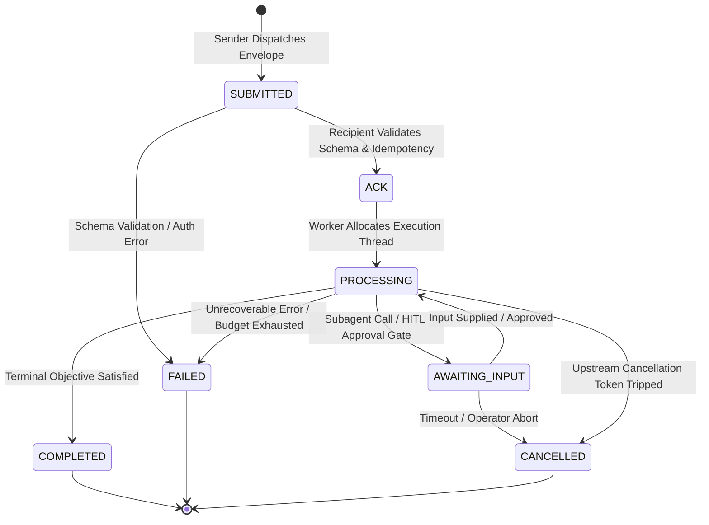
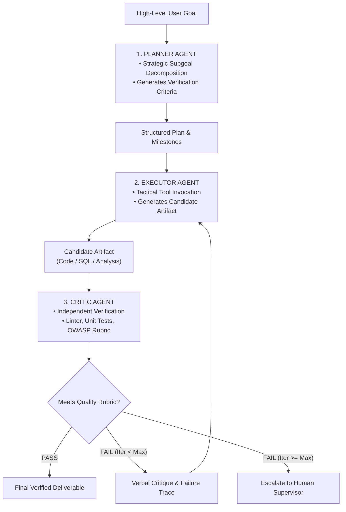
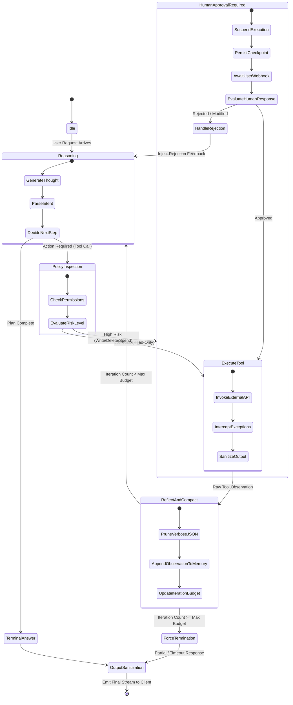
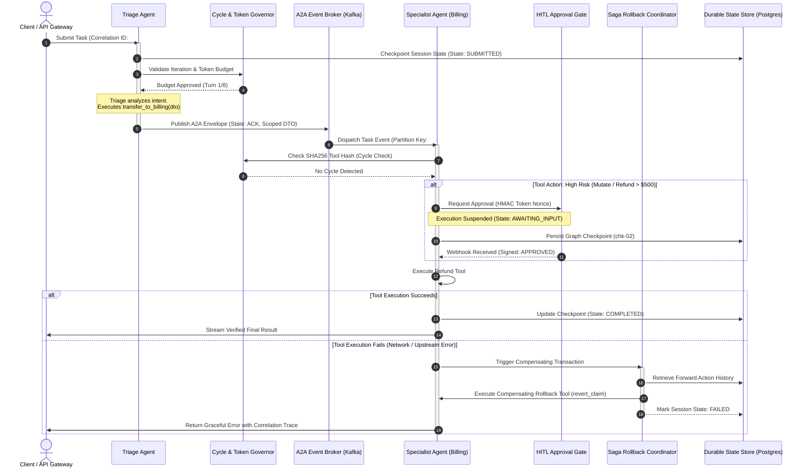

# Phase 04: Agentic Systems & Orchestration: Senior & Lead Developer Edition

> **A Comprehensive Architectural Handbook for Senior Engineers, Tech Leads, and AI Architects Designing, Scaling, and Operating Deterministic Workflows, Autonomous Agents, and Enterprise Multi-Agent Systems.**

---

### 🎯 Architectural Mastery Tiers
- **[MUST-HAVE]** 🔴 : Critical, non-negotiable architectural knowledge and core design patterns required for senior and lead engineers in production.
- **[GOOD-TO-HAVE]** 🟡 : Advanced architectural patterns, framework nuances, and optimization strategies that differentiate staff-level architects.
- **[KNOWLEDGE-BASE]** 🔵 : Deep theoretical references, academic foundations (Reflexion, ReAct papers), and specialized enterprise edge cases.

---

```
                        ┌─────────────────────────────────────────────────────────┐
                        │               THE SPECTRUM OF AGENCY                    │
                        │   Predictable Workflows ──────────► Autonomous Systems  │
                        └────────────────────────────┬────────────────────────────┘
                                                     │
              ┌──────────────────────────────────────┴──────────────────────────────────────┐
              ▼                                                                             ▼
┌─────────────────────────┐                                                   ┌─────────────────────────┐
│  DETERMINISTIC FLOWS    │                                                   │    AUTONOMOUS AGENTS    │
│  • Prompt Chaining      │                                                   │  • ReAct Dynamic Loops  │
│  • Semantic Routing     │                                                   │  • Plan-and-Solve       │
│  • Parallel Voting      │                                                   │  • Reflexion Memory     │
│  • Evaluator-Optimizer  │                                                   │  • Multi-Agent Debate   │
└────────────┬────────────┘                                                   └────────────┬────────────┘
             │                                                                             │
             └──────────────────────────────────────┬──────────────────────────────────────┘
                                                    ▼
                        ┌─────────────────────────────────────────────────────────┐
                        │             ENTERPRISE RUNTIME ARCHITECTURE             │
                        │  Durable State • Session Forking • Token Economics • HITL│
                        └─────────────────────────────────────────────────────────┘
```

---

## 📑 Table of Contents

1. [Executive Summary & Lead Mental Model [MUST-HAVE] 🔴](#1-executive-summary--lead-mental-model-must-have-)
   - [Demystifying "Agents": Architecture vs. Science Fiction [MUST-HAVE] 🔴](#demystifying-agents-architecture-vs-science-fiction-must-have-)
   - [The Spectrum of Agency: Anthropic's Foundational Taxonomy [MUST-HAVE] 🔴](#the-spectrum-of-agency-anthropics-foundational-taxonomy-must-have-)
   - [The Architectural Golden Rule [MUST-HAVE] 🔴](#the-architectural-golden-rule-must-have-)
2. [Why This Matters for Senior & Lead Developers [MUST-HAVE] 🔴](#2-why-this-matters-for-senior--lead-developers-must-have-)
   - [Taming Non-Determinism and Compounding Error Drift [MUST-HAVE] 🔴](#taming-non-determinism-and-compounding-error-drift-must-have-)
   - [State Explosion, Concurrency & Branching Sessions [GOOD-TO-HAVE] 🟡](#state-explosion-concurrency--branching-sessions-good-to-have-)
   - [Runaway Latency & Token Economics [MUST-HAVE] 🔴](#runaway-latency--token-economics-must-have-)
   - [Infinite Loops & Reasoning Deadlocks [MUST-HAVE] 🔴](#infinite-loops--reasoning-deadlocks-must-have-)
   - [Distributed Observability for Multi-Step Reasoning Traces [GOOD-TO-HAVE] 🟡](#distributed-observability-for-multi-step-reasoning-traces-good-to-have-)
3. [Deep-Dive Engineering & Implementation [MUST-HAVE] 🔴](#3-deep-dive-engineering--implementation-must-have-)
   - [3.1. Workflow Patterns vs. Open Agents (Anthropic Taxonomy) [MUST-HAVE] 🔴](#31-workflow-patterns-vs-open-agents-anthropic-taxonomy-must-have-)
     - [Prompt Chaining: Sequential Deterministic Decomposition [MUST-HAVE] 🔴](#prompt-chaining-sequential-deterministic-decomposition-must-have-)
     - [Routing: Dynamic Classification to Specialized Models/Prompts [MUST-HAVE] 🔴](#routing-dynamic-classification-to-specialized-modelsprompts-must-have-)
     - [Parallelization: Sectioning & Voting [GOOD-TO-HAVE] 🟡](#parallelization-sectioning--voting-good-to-have-)
     - [Orchestrator-Workers: Central Decomposition & Worker Synthesis [MUST-HAVE] 🔴](#orchestrator-workers-central-decomposition--worker-synthesis-must-have-)
     - [Evaluator-Optimizer: Self-Correcting Feedback Loops [MUST-HAVE] 🔴](#evaluator-optimizer-self-correcting-feedback-loops-must-have-)
   - [3.2. Autonomous Agent Architecture [MUST-HAVE] 🔴](#32-autonomous-agent-architecture-must-have-)
     - [The ReAct (Reasoning + Acting) Loop [MUST-HAVE] 🔴](#the-react-reasoning--acting-loop-must-have-)
     - [Plan-and-Solve / Plan-and-Execute [GOOD-TO-HAVE] 🟡](#plan-and-solve--plan-and-execute-good-to-have-)
     - [Reflexion: Verbal Reinforcement Learning & Memory of Failures [GOOD-TO-HAVE] 🟡](#reflexion-verbal-reinforcement-learning--memory-of-failures-good-to-have-)
   - [3.3. Stateful Agents & Session Management [GOOD-TO-HAVE] 🟡](#33-stateful-agents--session-management-good-to-have-)
     - [State Machines for Agents: Graphs, Reducers & Transitions [MUST-HAVE] 🔴](#state-machines-for-agents-graphs-reducers--transitions-must-have-)
     - [Durable Persistence, Resumption & Session Forking [GOOD-TO-HAVE] 🟡](#durable-persistence-resumption--session-forking-good-to-have-)
     - [Context Compaction & Observation Pruning [MUST-HAVE] 🔴](#context-compaction--observation-pruning-must-have-)
   - [3.4. Memory Systems [GOOD-TO-HAVE] 🟡](#34-memory-systems-good-to-have-)
     - [Working Memory (Scratchpad & Ephemeral Variables) [MUST-HAVE] 🔴](#working-memory-scratchpad--ephemeral-variables-must-have-)
     - [Episodic Memory (Past Trajectories & Experience Vectors) [GOOD-TO-HAVE] 🟡](#episodic-memory-past-trajectories--experience-vectors-good-to-have-)
     - [Semantic Memory (World Facts, User Profiles, Knowledge Graphs) [GOOD-TO-HAVE] 🟡](#semantic-memory-world-facts-user-profiles-knowledge-graphs-good-to-have-)
     - [Procedural Memory (Tool Playbooks & Execution Rules) [KNOWLEDGE-BASE] 🔵](#procedural-memory-tool-playbooks--execution-rules-knowledge-base-)
   - [3.5. Enterprise Agent Frameworks [GOOD-TO-HAVE] 🟡](#35-enterprise-agent-frameworks-good-to-have-)
     - [LangChain: Chains, Ecosystem & Production Boundaries [GOOD-TO-HAVE] 🟡](#langchain-chains-ecosystem--production-boundaries-good-to-have-)
     - [LangGraph: Stateful Cyclical Graphs & Checkpointed Runtimes [MUST-HAVE] 🔴](#langgraph-cyclical-graphs--checkpointed-runtimes-must-have-)
     - [Microsoft Agentic Frameworks: Semantic Kernel, AutoGen & Azure AI Agent Service [MUST-HAVE] 🔴](#microsoft-agentic-frameworks-semantic-kernel-autogen--azure-ai-agent-service-must-have-)
     - [Google Agent Development Kit (ADK) [MUST-HAVE] 🔴](#google-agent-development-kit-adk-must-have-)
     - [Anthropic Claude SDK & Minimalist Patterns [MUST-HAVE] 🔴](#anthropic-claude-sdk--minimalist-patterns-must-have-)
   - [3.6. Multi-Agent Orchestration Patterns [MUST-HAVE] 🔴](#36-multi-agent-orchestration-patterns-must-have-)
     - [Core Multi-Agent Topologies [MUST-HAVE] 🔴](#core-multi-agent-topologies-must-have-)
     - [Agent-to-Agent (A2A) Protocols [MUST-HAVE] 🔴](#agent-to-agent-a2a-protocols-must-have-)
       - [Standard JSON-RPC / REST A2A Envelope Schema](#standard-json-rpc--rest-a2a-envelope-schema)
       - [A2A Lifecycle State Machine & Idempotency](#a2a-lifecycle-state-machine--idempotency)
       - [Message Brokering: Event-Driven Pub/Sub vs. Direct RPC](#message-brokering-event-driven-pubsub-vs-direct-rpc)
     - [Agent Swarms & Dynamic Handoffs [MUST-HAVE] 🔴](#agent-swarms--dynamic-handoffs-must-have-)
       - [The OpenAI Swarm Pattern: Pointer Mutation](#the-openai-swarm-pattern-pointer-mutation)
       - [Context Window Isolation vs. Shared Memory](#context-window-isolation-vs-shared-memory)
       - [Stateless Agent Routines vs. Stateful Orchestrators](#stateless-agent-routines-vs-stateful-orchestrators)
     - [Team of Agents Collaboration Patterns [GOOD-TO-HAVE] 🟡](#team-of-agents-collaboration-patterns-good-to-have-)
       - [Planner-Executor-Critic Triad](#planner-executor-critic-triad)
       - [Multi-Agent Debate & Consensus Algorithms](#multi-agent-debate--consensus-algorithms)
     - [Enterprise Pitfalls with Agentic AI [MUST-HAVE] 🔴](#enterprise-pitfalls-with-agentic-ai-must-have-)
       - [Infinite Reasoning Loops & Deadlocks](#infinite-reasoning-loops--deadlocks)
       - [Cascading Tool Hallucinations & Blast Radius Containment](#cascading-tool-hallucinations--blast-radius-containment)
       - [Semantic Drift & Context Explosion in Multi-Agent Workflows](#semantic-drift--context-explosion-in-multi-agent-workflows)
4. [System Architecture & Visual Flows [MUST-HAVE] 🔴](#4-system-architecture--visual-flows-must-have-)
   - [Anthropic 5 Core Patterns Architecture [MUST-HAVE] 🔴](#anthropic-5-core-patterns-architecture-must-have-)
   - [ReAct Agentic State Machine with HITL Interrupt Gate [MUST-HAVE] 🔴](#react-agentic-state-machine-with-hitl-interrupt-gate-must-have-)
   - [Enterprise Agent-to-Agent (A2A) Swarm with Dynamic Handoff & Governance [MUST-HAVE] 🔴](#enterprise-agent-to-agent-a2a-swarm-with-dynamic-handoff--governance-must-have-)
5. [Comparative Analysis & Tradeoff Matrices [MUST-HAVE] 🔴](#5-comparative-analysis--tradeoff-matrices-must-have-)
   - [Industry Agentic Frameworks: Objective Pros & Cons Matrix [MUST-HAVE] 🔴](#industry-agentic-frameworks-objective-pros--cons-matrix-must-have-)
   - [Deterministic Workflows vs. Autonomous Agents [MUST-HAVE] 🔴](#deterministic-workflows-vs-autonomous-agents-must-have-)
   - [Synchronous Direct RPC vs. Distributed Event-Driven A2A Brokering [GOOD-TO-HAVE] 🟡](#synchronous-direct-rpc-vs-distributed-event-driven-a2a-brokering-good-to-have-)
6. [Production Failure Modes & Anti-Patterns [MUST-HAVE] 🔴](#6-production-failure-modes--anti-patterns-must-have-)
   - [1. Unbounded Reasoning Loops Draining Budgets [MUST-HAVE] 🔴](#1-unbounded-reasoning-loops-draining-budgets-must-have-)
   - [2. Context Pollution & Observation Bloat [MUST-HAVE] 🔴](#2-context-pollution--observation-bloat-must-have-)
   - [3. State Desynchronization Across Distributed Workers [GOOD-TO-HAVE] 🟡](#3-state-desynchronization-across-distributed-workers-good-to-have-)
   - [4. "Agentitis" (Premature Agentification) [MUST-HAVE] 🔴](#4-agentitis-premature-agentification-must-have-)
   - [5. Cascading Trajectory Hallucinations [MUST-HAVE] 🔴](#5-cascading-trajectory-hallucinations-must-have-)
   - [6. Semantic Drift in Multi-Turn Handoffs [GOOD-TO-HAVE] 🟡](#6-semantic-drift-in-multi-turn-handoffs-good-to-have-)
   - [7. Uncontained Blast Radius & Destructive Mutation Cascades [MUST-HAVE] 🔴](#7-uncontained-blast-radius--destructive-mutation-cascades-must-have-)
7. [Hands-On Practice Labs & Common Problem Solutions [MUST-HAVE] 🔴](#7-hands-on-practice-labs--common-problem-solutions-must-have-)
   - [Lab 1: Stateful Agent with Human-in-the-Loop Approval (LangGraph Pattern) [MUST-HAVE] 🔴](#lab-1-stateful-agent-with-human-in-the-loop-approval-langgraph-pattern-must-have-)
   - [Lab 2: Multi-Agent Swarm with Dynamic Handoffs (A2A Protocol) [MUST-HAVE] 🔴](#lab-2-multi-agent-swarm-with-dynamic-handoffs-a2a-protocol-must-have-)
   - [Lab 3: Detecting & Recovering from Infinite Loops (Cycle & Token Governor) [MUST-HAVE] 🔴](#lab-3-detecting--recovering-from-infinite-loops-cycle--token-governor-must-have-)
   - [Lab 4: Transaction Rollback for Tool Execution Failures (Distributed Saga Pattern) [MUST-HAVE] 🔴](#lab-4-transaction-rollback-for-tool-execution-failures-distributed-saga-pattern-must-have-)
8. [Enterprise Reference Code Implementations [MUST-HAVE] 🔴](#8-enterprise-reference-code-implementations-must-have-)
   - [Python: Production ReAct Agent with Budgeting, Compaction & SQLite Checkpointing [MUST-HAVE] 🔴](#python-production-react-agent-with-budgeting-compaction--sqlite-checkpointing-must-have-)
   - [C# / .NET 9: Enterprise Multi-Agent Pipeline with Semantic Kernel & Custom Plugins [GOOD-TO-HAVE] 🟡](#c--net-9-enterprise-multi-agent-pipeline-with-semantic-kernel--custom-plugins-good-to-have-)
9. [Verified Curated Resources & Reference Index [KNOWLEDGE-BASE] 🔵](#9-verified-curated-resources--reference-index-knowledge-base-)
10. [Capstone Engineering Challenge [MUST-HAVE] 🔴](#10-capstone-engineering-challenge-must-have-)
    - [The Multi-Turn Code Review & Refactoring Engine [MUST-HAVE] 🔴](#the-multi-turn-code-review--refactoring-engine-must-have-)

---

## 1. Executive Summary & Lead Mental Model [MUST-HAVE] 🔴

### Demystifying "Agents": Architecture vs. Science Fiction [MUST-HAVE] 🔴

In consumer media and introductory tutorials, an "AI Agent" is frequently portrayed as an all-knowing, semi-sentient digital entity capable of autonomously browsing the web, debugging legacy enterprise monoliths, and negotiating corporate contracts without supervision.

In enterprise software engineering, **an agent is simply an LLM operating in an execution loop where its outputs are parsed as control-flow instructions or tool invocations that mutate external state and dictate subsequent iterations.**

```
                     ┌───────────────────────────────────────────────┐
                     │            ENTERPRISE AGENT LOOP              │
                     │                                               │
                     │   State_{t+1} = f(State_t, LLM(State_t, Tools))│
                     └───────────────────────┬───────────────────────┘
                                             │
                       ┌─────────────────────┴─────────────────────┐
                       ▼                                           ▼
         ┌───────────────────────────┐               ┌───────────────────────────┐
         │     THE CONTROL PLANE     │               │     THE COMPUTE PLANE     │
         │  • Code-based graph state │               │  • Foundation Model (LLM) │
         │  • Hard safety boundaries │  ◄─────────►  │  • Stochastic reasoning   │
         │  • Deterministic policies │               │  • Tool arguments syntax  │
         │  • Budget & timeout gates │               │  • Natural language output│
         └───────────────────────────┘               └───────────────────────────┘
```

The fundamental error made by junior and intermediate developers is surrendering the entire architectural control plane to the foundation model. When you allow a non-deterministic probabilistic engine to control the recursion depth, the termination condition, the state schema, and the persistence lifecycle, failure is guaranteed. 

A Senior Architect designs **deterministic harnesses** that bound, supervise, and direct stochastic models.

### The Spectrum of Agency: Anthropic's Foundational Taxonomy [MUST-HAVE] 🔴

Anthropic's seminal paper and engineering guide, *"Building Effective Agents"*, establishes a vital conceptual boundary that separates two radically different implementation paradigms:

```
LOW AGENCY                                                              HIGH AGENCY
───────────────────────────────────────────────────────────────────────────────────►
[Prompt Chain] ──► [Routing] ──► [Parallel/Voting] ──► [Orchestrator-Workers] ──► [Autonomous ReAct]
       │                                                      │                   │
       └────────────────── WORKFLOWS ─────────────────────────┘                   │
             (Deterministic Orchestration Code)                       AGENTS (Model Decides Path)
```

1. **Workflows**: Systems where Large Language Models and external tools are orchestrated through **predetermined code paths**. The developer writes the state machine, defines the branching logic, executes the steps, and handles errors in code. The LLM is invoked solely to perform bounded cognitive transformations (parsing, extraction, summarization, generation, classification).
2. **Autonomous Agents**: Systems where the LLM is given an open-ended goal, a registry of tools, and an environment, and **the model itself determines its own execution path, iteration count, tool selection, and stopping criteria** at runtime.

### The Architectural Golden Rule [MUST-HAVE] 🔴

> **"Start with simple prompts, optimize them with comprehensive evaluations, add deterministic workflows only when complexity demands it, and reserve autonomous agents strictly for open-ended problem spaces where deterministic logic fails."**
> 
> *— Anthropic AI Engineering Core Philosophy*

If a problem can be decomposed into a fixed Directed Acyclic Graph (DAG) of discrete steps (e.g., classify query -> retrieve documents -> summarize -> format JSON), **building an autonomous agent is an architectural anti-pattern**. Workflows deliver lower latency, lower costs, zero infinite loops, and 100% predictable debugging traces.

Autonomous agents should be reserved exclusively for domains with:
* High combinatorial action spaces (e.g., automated coding, open-ended research across unknown web topologies).
* Dynamic exploratory paths where the next step cannot be anticipated ahead of time.
* Interactive environments where intermediate observations force real-time policy adjustments.

---

## 2. Why This Matters for Senior & Lead Developers [MUST-HAVE] 🔴

Moving from single-turn LLM generation to multi-step agentic systems transforms your application from a stateless RPC consumer into a **distributed, stateful, non-deterministic distributed runtime**. As a Lead Developer or Architect, you must engineer defenses against five fatal production challenges:

### Taming Non-Determinism and Compounding Error Drift [MUST-HAVE] 🔴

In a standard API call, an LLM success rate of 95% is considered high. In a multi-step autonomous agent that requires 10 sequential tool interactions to complete a task, compounding probability dictates:

```
P(System Success) = P(Step Success)^N = 0.95^10 ≈ 59.9%
```

A single malformed JSON tool argument, an invalid SQL query, or a mild reasoning hallucination at step 3 propagates forward. Step 4 builds upon a corrupted premise. By step 8, the agent has completely derailed from the user's original objective. 

Architects must implement **deterministic intermediate validators**, **idempotent rollback states**, and **circuit-breaking invariant checks** between every single transition.

### State Explosion, Concurrency & Branching Sessions [GOOD-TO-HAVE] 🟡

In complex enterprise environments (e.g., customer support escalation, claims underwriting, automated pull request remediation), an agent session may span hours or days, interact with dozens of microservices, and require human approval gates.

```
       [Turn 0: Initial State]
                 │
                 ▼
       [Turn 1: Tool Call A] ────► [State Checkpoint 1]
                 │
                 ▼
       [Turn 2: Tool Call B] ────► [State Checkpoint 2]
                 │
       ┌─────────┴─────────┐
       ▼                   ▼
[Branch A: Optimistic]  [Branch B: Human Intervention]
```

* How do you serialize the agent's memory graph across distributed web servers when an asynchronous human-in-the-loop (HITL) interrupt occurs?
* If a worker node crashes mid-reasoning, how do you restore execution without re-billing the customer for 40,000 tokens of prior reasoning?
* How do you implement **Session Forking**—branching a conversation into alternative speculative paths (e.g., running 3 refactoring strategies in parallel) and pruning failed branches without leaking dirty state into the root context?

### Runaway Latency & Token Economics [MUST-HAVE] 🔴

In an autonomous ReAct loop, the agent appends its intermediate thoughts, tool calls, and tool execution outputs to the conversation history on every turn. 

```
Turn 1: System (2K) + User (500) = 2,500 tokens
Turn 2: Prev History (2.5K) + Thought (200) + Action (100) + Observation (3K) = 5,800 tokens
Turn 3: Prev History (5.8K) + Thought (200) + Action (100) + Observation (5K) = 11,200 tokens
Turn 4: Prev History (11.2K) + Thought (200) + Action (100) + Observation (8K) = 19,500 tokens
Total Cumulative Ingested Tokens over 4 turns = 2,500 + 5,800 + 11,200 + 19,500 = 39,000 tokens!
```

If an agent queries an internal database and receives a raw 2MB JSON payload containing 5,000 database rows, that single observation can exhaust 70% of the active context window. Subsequent turns suffer severe latency degradation (Time To First Token), increased billing, and the **"Lost in the Middle"** phenomenon where the model forgets its primary system prompt instructions.

### Infinite Loops & Reasoning Deadlocks [MUST-HAVE] 🔴

Without strict runtime guardrails, autonomous agents routinely enter cyclical traps:
1. **The Repeated Tool Invocation Trap**: The agent executes `get_user_account(id="123")`, receives an expected error `AccountNotFoundException`, and immediately invokes `get_user_account(id="123")` again with identical parameters, expecting a different outcome.
2. **The Semantic Oscillation Loop**: The agent switches back and forth between two mutually exclusive tool strategies without making forward progress.
3. **The Hallucinated Completion Trap**: The agent repeatedly calls a dummy tool because it lacks the confidence or clear criteria to emit the final answer token.

Production agent engines must enforce **Execution Budgets**: strict caps on wall-clock time, total token expenditure, maximum reasoning iterations, and deterministic cycle-detection heuristics (e.g., hashing tool signatures across turns).

### Distributed Observability for Multi-Step Reasoning Traces [GOOD-TO-HAVE] 🟡

Traditional Application Performance Monitoring (APM) tools (Datadog, New Relic) monitor HTTP request/response durations and database query latencies. They are blind to:
* The internal "Thought" scratchpad of an LLM.
* Why an agent chose `Tool_B` over `Tool_A`.
* Which intermediate step injected a hallucinated entity that caused a failure 6 steps later.
* Token consumption broken down by prompt, generation, and tool overhead per sub-agent.

Lead Engineers must architect **OpenTelemetry-native distributed tracing** where every agent session is a root trace, every turn is a parent span, and every LLM inference, tool execution, and state checkpoint is an instrumented child span containing semantic attributes.

---

## 3. Deep-Dive Engineering & Implementation [MUST-HAVE] 🔴

### 3.1. Workflow Patterns vs. Open Agents (Anthropic Taxonomy) [MUST-HAVE] 🔴

Anthropic categorizes programmatic LLM architectures into five primary deterministic workflow patterns before stepping into fully autonomous agents.

```
1. PROMPT CHAINING:
   [Input] ──► [LLM Step 1] ──► [Gate / Validate] ──► [LLM Step 2] ──► [Output]

2. ROUTING:
                     ┌──► [Specialized Model A / Prompt A] ──► [Output]
   [Input] ──► [Router] ──► [Specialized Model B / Prompt B] ──► [Output]
                     └──► [Specialized Model C / Prompt C] ──► [Output]

3. PARALLELIZATION:
                     ┌──► [Subtask 1 / Reviewer 1] ──┐
   [Input] ──► [Fan-Out] ──► [Subtask 2 / Reviewer 2] ──┼──► [Consensus / Synthesizer] ──► [Output]
                     └──► [Subtask 3 / Reviewer 3] ──┘

4. ORCHESTRATOR-WORKERS:
   [Goal] ──► [Orchestrator LLM] ──┬──► [Worker 1: Dynamic Task] ──┐
                                   ├──► [Worker 2: Dynamic Task] ──┼──► [Synthesize] ──► [Result]
                                   └──► [Worker 3: Dynamic Task] ──┘

5. EVALUATOR-OPTIMIZER:
   [Prompt] ──► [Generator LLM] ◄────────────┐ (Critique & Refine)
                      │                      │
                      ▼                      │
               [Evaluator LLM] ──► [Pass?] ──┴──► (No)
                      │
                      ▼ (Yes)
                   [Output]
```

#### Prompt Chaining: Sequential Deterministic Decomposition [MUST-HAVE] 🔴
Prompt chaining decomposes a complex task into a linear series of discrete steps, where the output of step N serves as the input to step N+1.

* **Why it beats single-turn megagenerations**: LLMs perform significantly better when dedicated to a narrow cognitive task. Forcing a model to simultaneously analyze requirements, design architecture, generate code, write unit tests, and document APIs in a single turn leads to shallow reasoning, skipped edge cases, and truncated outputs.
* **Deterministic Gate Checks**: Between steps, programmatic code validates outputs (e.g., verifying that Step 1 returned valid JSON conforming to a Pydantic schema, or verifying that generated SQL compiles). If validation fails, the orchestrator triggers an immediate targeted retry without re-running previous steps.

#### Routing: Dynamic Classification to Specialized Models/Prompts [MUST-HAVE] 🔴
Routing uses a lightweight classifier (a fast LLM like Claude 3.5 Haiku, Gemini 1.5 Flash, or a semantic embedding classifier) to inspect user input and direct it to the optimal downstream handler.

* **Cost & Latency Optimization**: 80% of enterprise queries (FAQ lookups, password resets) do not require expensive frontier reasoning models (Claude 3.5 Sonnet, GPT-4o, Gemini 1.5 Pro). Routing delivers 5x cost reduction and 3x latency improvements by directing simple queries to fast models and reserving frontier models for complex multi-step reasoning.
* **Specialized Domain Prompts**: Prevents system prompt dilution. Instead of maintaining a monstrous 8,000-token prompt that attempts to cover legal, billing, technical support, and HR rules, routing directs the user to a lean, hyper-focused 500-token prompt tailored to their domain.

#### Parallelization: Sectioning & Voting [GOOD-TO-HAVE] 🟡
Parallelization executes multiple concurrent LLM calls across two distinct paradigms:

1. **Sectioning (Subtask Decomposition)**: The system splits an input into independent subtasks, executes them simultaneously, and merges the results. For example, during a pull request review, the system runs three parallel analyzers:
   * Worker 1: Static security vulnerability audit (OWASP Top 10).
   * Worker 2: Algorithmic complexity and performance audit.
   * Worker 3: Documentation and naming convention compliance.
   * *Consolidator*: Merges all three reviews into a unified PR review comment.
2. **Voting (Consensus & Diversity)**: The system executes multiple identical prompts with varying temperatures or across different foundation model families (e.g., Claude 3.5 Sonnet, GPT-4o, Gemini 1.5 Pro) to elect a consensus output. 
   * Used for high-stakes compliance classifications, legal document extraction, or automated production deployments where false positives carry extreme financial cost.

#### Orchestrator-Workers: Central Decomposition & Worker Synthesis [MUST-HAVE] 🔴
In the Orchestrator-Workers pattern, a central LLM dynamically inspects the user's objective, dynamically breaks it into an arbitrary number of subtasks based on input complexity, delegates subtasks to parallel worker LLMs, and synthesizes the final response.

* **Difference from simple Parallelization**: In Sectioning, the subtasks are hardcoded in advance by the software engineer. In Orchestrator-Workers, **the subtasks are dynamically generated by the Orchestrator at runtime**.
* **Use Case**: Generating a comprehensive competitive analysis report. The orchestrator determines that Company A requires analysis of its financial filings, patent portfolio, and product pricing, whereas Company B requires analysis of its open-source repositories and hiring trends.

#### Evaluator-Optimizer: Self-Correcting Feedback Loops [MUST-HAVE] 🔴
The Evaluator-Optimizer pattern couples two distinct model personas:
* **The Generator**: Produces an initial candidate solution (e.g., code, translation, marketing copy).
* **The Evaluator**: Compares the candidate against an explicit rubric, executes deterministic tests (e.g., unit test runners, linters, security scanners), and provides actionable verbal critique.

The Generator receives its own past output, the evaluator's critique, and produces an improved revision. The loop continues until the evaluator emits a `PASS` token or the system hits a maximum iteration ceiling (K <= 3).

---

### 3.2. Autonomous Agent Architecture [MUST-HAVE] 🔴

When tasks cannot be mapped to a fixed DAG, architectures transition to autonomous execution loops.

#### The ReAct (Reasoning + Acting) Loop [MUST-HAVE] 🔴
Introduced by Yao et al. (2022), **ReAct** synergizes reasoning traces and task-specific actions. Pure reasoning (Chain-of-Thought) suffers from hallucination because the model cannot verify external facts. Pure action (Act) lacks foresight, context tracking, and error recovery.

```
       ┌────────────────────────────────────────────────────────┐
       │                       USER INPUT                       │
       └───────────────────────────┬────────────────────────────┘
                                   │
                                   ▼
                   ┌───────────────────────────────┐
                   │        THOUGHT / REASON       │ ◄──────────┐
                   │ "What do I know? What is the  │            │
                   │  next piece of data I need?"  │            │
                   └───────────────┬───────────────┘            │
                                   │                            │
                                   ▼                            │
                   ┌───────────────────────────────┐            │
                   │        ACTION / TOOL USE      │            │
                   │ Invoke tool with typed schema │            │
                   │  e.g., query_db(sku='109')    │            │
                   └───────────────┬───────────────┘            │
                                   │                            │
                                   ▼                            │
                   ┌───────────────────────────────┐            │
                   │          OBSERVATION          │            │
                   │ Execution output from runtime │            │
                   │  e.g., {"stock": 42}          │            │
                   └───────────────┬───────────────┘            │
                                   │                            │
                                   ▼                            │
                   ┌───────────────────────────────┐            │
                   │          REFLECTION           │            │
                   │ "Did the tool succeed? Do I   │            │
                   │  have enough to answer?"      │            │
                   └───────────────┬───────────────┘            │
                                   │                            │
                        [Task Complete?]                        │
                        /              \                        │
                  (No) /                \ (Yes)                 │
                      /                  \                      │
                     └────────────────────┼─────────────────────┘
                                          │
                                          ▼
                         ┌─────────────────────────────────┐
                         │          FINAL ANSWER           │
                         └─────────────────────────────────┘
```

1. **Thought**: The model generates explicit natural language reasoning about current progress, missing variables, and strategy.
2. **Action**: The model selects an external tool from its schema registry and emits structured parameters.
3. **Observation**: The execution runtime intercepts the tool call, executes it against an external system (DB, API, shell), and feeds the result back as an environment observation.
4. **Reflection**: The model interprets the observation, verifies whether the hypothesis was confirmed, and decides whether to terminate or initiate another cycle.

#### Plan-and-Solve / Plan-and-Execute [GOOD-TO-HAVE] 🟡
While ReAct is powerful, it suffers from **local horizon bias** (wandering off track over 15+ turns because each step is decided reactively). **Plan-and-Solve** decouples strategic planning from tactical execution:

```
[User Objective]
       │
       ▼
┌──────────────┐
│   PLANNER    │ ──► Generates explicit DAG / Step List:
│    (LLM)     │     1. Fetch customer billing records.
└──────────────┘     2. Verify license tier in Stripe.
                     3. Run quota calculation script.
                     4. Format downgrade notification email.
       │
       ▼
┌──────────────┐
│   EXECUTOR   │ ──► Executes Step 1 via Tools ──► [Observation 1]
│   (ReAct /   │ ──► Executes Step 2 via Tools ──► [Observation 2]
│  Worker LLM) │
└──────────────┘
       │
       ▼
┌──────────────┐
│  RE-PLANNER  │ ──► Inspects observations. Did Step 2 encounter an error?
│    (LLM)     │     • If yes: Mutate remaining plan (insert Step 2b).
└──────────────┘     • If no: Proceed to Step 3.
```

By maintaining a distinct, visible execution plan in the state schema, the agent prevents drift and provides end-users with real-time progress transparency.

#### Reflexion: Verbal Reinforcement Learning & Memory of Failures [GOOD-TO-HAVE] 🟡
Published by Shinn et al. (NeurIPS 2023), **Reflexion** gives agents dynamic memory and self-reflective capabilities without retraining model weights.

When an agent fails to complete a task (e.g., generated code fails unit tests, or a search returns zero results after 5 attempts), conventional agents crash or give up. A Reflexion agent:
1. Pauses execution upon detecting task failure.
2. Invokes a **Self-Reflection Evaluator** that analyzes the full trajectory: *"Where did my reasoning derail? Why did tool invocation X fail? What erroneous assumptions did I make?"*
3. Formulates a **Verbal Self-Critique**: *"I assumed the user ID was a UUID, but the API returned a 400 Bad Request indicating it expects an email string. On the next trial, I must first resolve the username to an email address."*
4. Writes this critique into **Episodic Memory**.
5. Restarts the task from scratch, with the verbal critique prepended into its working memory as a high-priority system constraint.

Reflexion empirically improves task success rates by over 30% across challenging coding and multi-hop reasoning benchmarks (HumanEval, ALFWorld).

---

### 3.3. Stateful Agents & Session Management [GOOD-TO-HAVE] 🟡

Production agents cannot exist as simple ephemeral while-loops in local process memory. They must be engineered as **Durable Distributed State Machines**.

#### State Machines for Agents: Graphs, Reducers & Transitions [MUST-HAVE] 🔴
In frameworks like **LangGraph** and enterprise event-driven architectures, an agent is modeled as a formal State Graph:
* **State**: A strongly typed schema (Pydantic model or dataclass) representing the complete snapshot of the world at step `t`:
  ```
  State S = { Messages, CurrentPlan, ActiveVariables, IterationCount, PendingApprovals }
  ```
* **Nodes**: Deterministic Python, TypeScript, or .NET functions that accept current state `S_t` and emit partial state updates `Delta_S`.
* **Reducers**: Deterministic merging functions that dictate how `Delta_S` is combined with `S_t` (e.g., appending new messages to a list, overwriting a variable, or incrementing a counter).
* **Edges & Conditional Edges**: Routing logic that evaluates the current state and returns the next destination node string.

#### Durable Persistence, Resumption & Session Forking [GOOD-TO-HAVE] 🟡
Enterprise systems require state to be durable across network partitions, node failures, and asynchronous human interactions:

```
[Worker A]                                              [Worker B]
Step 1 ──► Step 2 ──► [Interrupt: Human Approval]
      │
      ▼ (Serialize & Checkpoint)
┌─────────────────────────────────┐
│     DURABLE STATE STORE         │
│   PostgreSQL / Redis / SQLite   │
│ • session_id: 'sess-8941'       │
│ • checkpoint_id: 'chk-04'       │
│ • state_blob: { ... }           │
│ • status: 'SUSPENDED'           │
└─────────────────────────────────┘
                                           (2 Hours Later: Human Approves)
                                                         │
                                                         ▼ (Deserialize & Resume)
                                                   Step 3 ──► Step 4 ──► Complete
```

* **Session Resumption**: The agent serializes its state machine to a durable database (SQLite, PostgreSQL, Redis) after every node transition. If an asynchronous interrupt occurs (e.g., awaiting a manager's sign-off for a \$5,000 refund), the process terminates cleanly. Two hours later, a webhook hits any available worker node, which deserializes `checkpoint_id`, restores the exact graph state, and resumes execution seamlessly.
* **Session Forking (Branching Exploration)**: By storing immutable checkpoint snapshots, an agent runtime can "fork" an active session. If an agent wants to explore two alternative refactoring strategies, it forks `chk-04` into `sess-8941-branch-A` and `sess-8941-branch-B`, runs them concurrently, scores the outcomes, and commits only the winning branch back to trunk.

#### Context Compaction & Observation Pruning [MUST-HAVE] 🔴
As an agent interacts with tools, intermediate observations rapidly consume the context window. Architects implement a **Three-Tier Context Pruning Pipeline**:

```
[Raw Tool Output: 15,000 tokens of raw JSON/Logs]
                       │
                       ▼
┌────────────────────────────────────────────────────────┐
│ TIER 1: DETERMINISTIC STRUCTURAL EXTRACTION            │
│ Filter out null fields, extract only requested keys,   │
│ truncate lists to top 5 items. (Reduces 80% tokens)    │
└──────────────────────┬─────────────────────────────────┘
                       │
                       ▼
┌────────────────────────────────────────────────────────┐
│ TIER 2: LLM SUMMARIZATION SCRATCHPAD                   │
│ If token count > 2,000 tokens, invoke a fast model     │
│ (Claude Haiku / Gemini Flash) to summarize key findings│
└──────────────────────┬─────────────────────────────────┘
                       │
                       ▼
┌────────────────────────────────────────────────────────┐
│ TIER 3: SLIDING WINDOW & POINTER CACHING               │
│ Replace historical raw observations older than 3 turns │
│ with pointer references: [Ref: Tool_Output_Check_02]   │
└────────────────────────────────────────────────────────┘
```

---

### 3.4. Memory Systems [GOOD-TO-HAVE] 🟡

Autonomous systems emulate biological cognitive memory architectures, split into four distinct tiers:

```
┌──────────────────────────────────────────────────────────────────────────┐
│                             WORKING MEMORY                               │
│  • Active context window (LLM Prompt)                                    │
│  • Scratchpad reasoning traces, immediate tool observations              │
│  • Ephemeral, high-speed, strictly bounded by model context size         │
└──────────────────────────────────────────────────────────────────────────┘
                                      │
       ┌──────────────────────────────┼──────────────────────────────┐
       ▼                              ▼                              ▼
┌─────────────────────────┐  ┌─────────────────────────┐  ┌─────────────────────────┐
│     EPISODIC MEMORY     │  │     SEMANTIC MEMORY     │  │    PROCEDURAL MEMORY    │
│ • Past session histories│  │ • World facts & rules   │  │ • System instructions   │
│ • Past failure logs     │  │ • User profile & prefs  │  │ • Learned tool playbooks│
│ • Reflexion critiques   │  │ • Enterprise ontology   │  │ • Few-shot trajectories │
│ • Vector DB retrieval   │  │ • Graph DB / Key-Value  │  │ • Immutable Code/Prompts│
└─────────────────────────┘  └─────────────────────────┘  └─────────────────────────┘
```

| Memory System | Biological Analogy | Technical Storage Mechanism | Access Pattern | Enterprise Example |
|---|---|---|---|---|
| **Working Memory** `[MUST-HAVE]` 🔴 | Prefrontal Cortex (Short-term focus) | In-memory LLM Context Window (Prompt messages, scratchpad) | Direct sequential token attention | Active conversation messages, current tool payload being inspected. |
| **Episodic Memory** `[GOOD-TO-HAVE]` 🟡 | Hippocampus (Past experiences & events) | Vector Database (Qdrant, Pinecone, pgvector) with semantic embeddings | Semantic similarity search (k-NN) on incoming task goals | Retrieving a post-mortem critique from last week when a similar SQL migration failed. |
| **Semantic Memory** `[GOOD-TO-HAVE]` 🟡 | Temporal Cortex (Long-term facts & general knowledge) | Document Stores, Graph Databases (Neo4j), Relational DBs, Key-Value | Entity linking, structured SQL queries, hybrid vector search | User account settings, company reimbursement policies, system architecture specs. |
| **Procedural Memory** `[KNOWLEDGE-BASE]` 🔵 | Striatum & Motor Cortex (Habits, motor skills & how-to rules) | System Prompts, Tool Definitions (JSON Schema), Code Workflows | Immutable configuration injected at runtime initialization | Step-by-step instructions on how to authenticate against the internal OAuth2 provider and invoke tools. |

---

### 3.5. Enterprise Agent Frameworks [GOOD-TO-HAVE] 🟡

When standardizing on an enterprise stack, engineering leads must evaluate framework tradeoffs across typing, state handling, debugging overhead, production reliability, and ecosystem lock-in:

#### LangChain: Chains, Ecosystem & Production Boundaries [GOOD-TO-HAVE] 🟡

**LangChain** pioneered the early LLM application space by aggregating hundreds of data connectors, vector stores, and prompt templates into a unified Python and TypeScript abstraction layer.

* **Core Architectural Primitives**:
  - **Chains & LCEL (LangChain Expression Language)**: Declarative, unix-pipe style chaining (`chain = prompt | model | parser`) that handles serialization, batching, and async execution out of the box.
  - **Unified Ecosystem Connectors**: Out-of-the-box abstractions for 700+ document loaders, vector stores (pgvector, Qdrant, Pinecone), embeddings, and third-party SaaS APIs.
  - **Tool & Agent Abstractions**: High-level wrappers (`create_react_agent`, `AgentExecutor`) that handle function calling and output parsing across multiple model providers.

* **Pros**:
  - **Unrivaled Ecosystem Breadth**: Fastest path to connect disparate enterprise data sources (Confluence, SharePoint, Jira, SQL) during rapid prototyping.
  - **Provider-Agnostic Abstraction**: Switch between OpenAI, Anthropic, Google, and self-hosted models by updating configuration rather than rewriting application code.
  - **Vibrant Community**: Extensive documentation, reusable templates, and active maintenance.

* **Cons & Production Limitations**:
  - **Deep Inheritance & Opaque Abstractions**: High degree of class inheritance wraps simple HTTP calls in layers of nested objects, making stack traces cryptic and post-mortem debugging challenging.
  - **Poor Fit for Cyclical Agent Loops**: Standard chains model linear Directed Acyclic Graphs (DAGs). Attempting to implement complex stateful loops or multi-agent back-and-forth leads to brittle monkey-patching.
  - **API Churn & Maintenance Overhead**: Rapid framework updates and shifting deprecation cycles create upgrade friction and technical debt in long-lived production systems.
  - **Architectural Verdict**: Excellent for rapid prototyping, retrieval pipelines, and linear prompt chains; avoid for mission-critical, long-running agentic state loops.

#### LangGraph: Stateful Cyclical Graphs & Checkpointed Runtimes [MUST-HAVE] 🔴

Created by the LangChain team specifically to resolve the architectural limitations of linear chains, **LangGraph** models agent runtimes as cyclical, stateful computational graphs.

* **Core Architectural Primitives**:
  - **Cyclical StateGraph**: A computational graph where nodes are standard functions (Python or TypeScript) that receive current state and return partial updates, while edges determine deterministic or conditional transitions.
  - **Typed State Schemas & Reducers**: State is defined via strongly typed schemas (`TypedDict` or Pydantic). Keys can specify custom reducer functions (e.g., `operator.add` to append messages rather than overwriting existing history).
  - **Durable Checkpointing**: Persistence layers (`SqliteSaver`, `PostgresSaver`, Redis) automatically commit graph state to disk at every "super-step", enabling zero-loss crash recovery and offline resumption.
  - **Human-in-the-Loop (HITL) & Time Travel**: Native `interrupt_before` and `interrupt_after` hooks halt graph execution before high-risk actions. Operators can inspect pending tool calls, mutate state variables, and resume execution—or "time-travel" back to previous checkpoints to test alternative branches.

* **Pros**:
  - **True Cyclical Reasoning**: Naturally supports ReAct and Plan-Execute loops (`Thought -> Action -> Observation -> Thought`) without artificial recursion hacks.
  - **Enterprise Fault Tolerance**: Resumes failed long-running workflows exactly from the last saved super-step rather than restarting from scratch.
  - **Multi-Agent Topologies**: Cleanly implements supervisors, hierarchical teams, and peer-to-peer swarms with isolated sub-graphs.

* **Cons & Production Limitations**:
  - **Boilerplate & Learning Curve**: Requires explicit mental modeling of state machines, channel reducers, and graph compilation.
  - **Coupling with LangChain Objects**: While much leaner than classic LangChain, it still defaults to LangChain core message schemas and serialization conventions.
  - **State Memory Management**: Unbounded accumulation in list reducers can cause state bloat without explicit compaction strategies.

#### Microsoft Agentic Frameworks: Semantic Kernel, AutoGen & Azure AI Agent Service [MUST-HAVE] 🔴

Microsoft provides a three-tiered portfolio of agent technologies spanning enterprise runtime frameworks to managed cloud services:

1. **Microsoft Semantic Kernel (Enterprise C#/.NET 8/9, Python, Java)**:
   - **Enterprise Integration**: Designed specifically for enterprise software engineering teams building on ASP.NET Core, Spring Boot, or enterprise Python.
   - **Strongly Typed Native Plugins**: Developers decorate standard C# methods with `[KernelFunction]` and `[Description]` attributes to expose business logic as AI-callable tools without glue code.
   - **Filter Pipelines**: Middleware pattern (`IFunctionInvocationFilter`, `IPromptRenderFilter`) enables enterprise observability, PII redaction, token rate-limiting, and security policy enforcement at the tool invocation boundary.
   - **AgentGroupChat & Strategies**: Built-in abstractions for multi-agent collaboration with customizable `SelectionStrategy` (who speaks next) and `TerminationStrategy` (when to stop).
   - **Pros**: First-class .NET dependency injection, zero Python dependency for enterprise .NET shops, enterprise telemetry via `ActivitySource`.
   - **Cons**: Multi-agent features are newer than standalone kernel features; historically less extensive third-party community plugins than Python ecosystems.

2. **Microsoft AutoGen & AutoGen Studio (Multi-Agent Conversational Framework)**:
   - **Conversational Multi-Agent Paradigm**: Pioneered the conversational agency pattern where specialized personas (e.g., `AssistantAgent`, `UserProxyAgent`, `WebSurfer`) collaborate via multi-turn chat messages.
   - **Event-Driven Actor Architecture (AutoGen v0.4+)**: The rewritten v0.4 architecture adopts an asynchronous Actor model, providing distributed event-driven message dispatching, state isolation, and gRPC/WebSocket inter-process communication.
   - **AutoGen Studio**: Low-code visual UI environment for prototyping, evaluating, and visualizing agent teams and workflows.
   - **Pros**: Highly intuitive for simulating peer debates, code-generation/execution loops, and research agent swarms.
   - **Cons**: Dynamic conversational chat loops can easily degenerate into infinite banter without strict termination criteria; high token consumption.

3. **Azure AI Agent Service (Enterprise Managed Agent Platform)**:
   - **Fully Managed Infrastructure**: Enterprise cloud service hosting agents built on frontier models (GPT-4o, LLaMA 3.3) without managing runtime VM/container clusters.
   - **Enterprise Security & Compliance**: Built-in integration with Microsoft Entra ID (RBAC), private virtual networks (VNet/Private Endpoints), customer-managed encryption keys (CMEK), and HIPAA/SOC2 compliance.
   - **Native Knowledge & Tool Bindings**: Direct out-of-the-box connectors to Azure AI Search, Azure Functions, OpenAPI specifications, and Code Interpreter in sandboxed micro-VMs.
   - **Pros**: Zero infrastructure maintenance, unified billing, enterprise identity governance, turn-key tool execution sandboxes.
   - **Cons**: Vendor lock-in to the Azure cloud ecosystem; less flexibility for bespoke custom runtime scheduling.

#### Google Agent Development Kit (ADK) [MUST-HAVE] 🔴
Google's **Agent Development Kit (ADK)** is designed for enterprise-grade, code-first agent development integrated deeply with the Google Cloud and Gemini ecosystem.
* **Code-First Architecture**: Avoids bloated abstractions; treats agents, tools, and orchestrators as native Python or TypeScript components.
* **Tool & MCP Integration**: First-class support for Model Context Protocol (MCP) servers, allowing seamless tool sharing across enterprise boundaries.
* **The `agents-cli` Lifecycle Suite**:
  * `agents-cli scaffold create`: Bootstraps production-ready agent projects with typed schemas and CI/CD templates.
  * `agents-cli eval run`: Runs automated trajectory and LLM-as-a-judge regression test suites against golden datasets.
  * `agents-cli deploy`: Packages agents for enterprise deployment to Google Cloud Run, Vertex AI Agent Engine, or GKE.
* **Pros**: Ultra-clean code-first mental model, enterprise Google Cloud integration, end-to-end tooling from scaffolding to production monitoring.
* **Cons**: Primarily optimized for the Google Cloud/Gemini ecosystem.

#### Anthropic Claude SDK & Minimalist Patterns [MUST-HAVE] 🔴
Anthropic champions a **minimalist, framework-free approach** centered on raw SDK primitives:
* **Native Tool Calling**: Directly leveraging Claude's `tools`, `tool_use`, and `tool_result` content blocks.
* **Prompt Caching**: Leveraging Claude's 5-minute ephemeral prompt cache to dramatically reduce latency and cost for long-running agent loops (caching system prompts, tool schemas, and historical turns).
* **Code as Orchestrator**: Anthropic strongly recommends writing explicit Python/TypeScript control flow (while loops, async task queues) rather than introducing opaque third-party agent wrapper libraries.
* **Pros**: Zero third-party library overhead, 100% transparent execution traces, no breaking framework churn, maximum performance.
* **Cons**: Developers must manually implement checkpointing, retry logic, and multi-agent routing.

---

### 3.6. Multi-Agent Orchestration Patterns [MUST-HAVE] 🔴

When an enterprise problem exceeds the cognitive capacity of a single context window, requires distinct security and permission boundaries, or demands specialized domain reasoning, systems scale to **Multi-Agent Orchestration**.

```
A. SUPERVISOR PATTERN                   B. HIERARCHICAL TEAMS
      ┌────────────┐                         ┌───────────────────┐
      │ Supervisor │                         │  Lead Supervisor  │
      └─────┬──────┘                         └─────────┬─────────┘
      ┌─────┴─────┐                               ┌────┴────┐
      ▼           ▼                               ▼         ▼
  [Worker 1]  [Worker 2]                   [Sub-Sup A]   [Sub-Sup B]
                                             ┌────┴────┐   ┌────┴────┐
                                             ▼         ▼   ▼         ▼
                                           [W-A1]    [W-A2][W-B1]    [W-B2]

C. SWARM / HANDOFF                       D. MULTI-AGENT DEBATE
  ┌────────┐       Handoff       ┌────────┐      ┌────────┐      ┌────────┐
  │Agent A ├────────────────────►│Agent B │      │Agent A │      │Agent B │
  │(Triage)│◄────────────────────┤(Billing│      │(Pro)   │      │(Con)   │
  └────────┘                     └────────┘      └────┬───┘      └───┬────┘
                                                      │              │
                                                      └──────►◄──────┘
                                                             │ (Debate)
                                                             ▼
                                                    [Consensus Judge]
```

#### Core Multi-Agent Topologies [MUST-HAVE] 🔴

1. **Supervisor Pattern (Centralized Hub-and-Spoke)**:
   - A single central coordinator agent receives the user's objective, inspects worker capability manifests, delegates discrete subtasks to specialized subordinate agents, inspects their results, and decides the next step.
   - **Data Flow**: Leaf workers communicate *solely* with the supervisor; peer-to-peer communication between workers is prohibited.
   - **Tradeoffs**: Highly observable and straightforward to debug; however, the supervisor's context window becomes an architectural throughput and token bottleneck.
2. **Hierarchical Multi-Agent Teams (Tree-Structured Organization)**:
   - Emulates enterprise management structures. A top-level executive agent delegates to functional domain leads (e.g., Engineering Lead, QA Lead, Security Lead), who in turn manage specialized leaf agents (e.g., Backend Developer, Database Specialist).
   - **Encapsulation**: Sub-teams maintain isolated sub-graphs. Leaf-agent dialogue remains strictly contained within the sub-team, passing only synthesized milestone deliverables up the chain.
3. **Swarm & Dynamic Handoff (Decentralized Peer-to-Peer)**:
   - Popularized by the OpenAI Swarm reference pattern. Agents operate as peer nodes in a mesh network with the ability to dynamically transfer execution control ("hand off") to another agent along with the conversation state.
   - **Execution Mechanics**: The active agent executes a transfer tool (e.g., `transfer_to_billing_agent()`). The orchestrator runtime updates its execution pointer to point directly to the new agent without returning control to a centralized supervisor.
4. **Multi-Agent Debate & Consensus (Adversarial Triad)**:
   - Two or more agents are initialized with contrasting goals, rubrics, or system instructions (e.g., a "Security Auditor" hunting for vulnerabilities vs. a "Feature Velocity Engineer" minimizing code changes).
   - **Dialectic Convergence**: The agents iteratively critique each other's outputs across T rounds until a neutral Judge Agent synthesizes a balanced, mathematically grounded consensus.

---

#### Agent-to-Agent (A2A) Protocols [MUST-HAVE] 🔴

In distributed enterprise environments, agents run on heterogeneous infrastructure across different services, languages (Python, C#, Go), and cloud providers. Standardizing inter-agent communication requires a formal **Agent-to-Agent (A2A) Communication Protocol**.

##### Standard JSON-RPC / REST A2A Envelope Schema

Every message exchanged between distributed agents must be wrapped in a strictly typed envelope that contains correlation metadata, execution limits, state markers, and scoped context payloads:

```json
{
  "$schema": "https://json-schema.org/draft/2020-12/schema",
  "title": "AgentMessageEnvelope",
  "type": "object",
  "required": [
    "envelope_id",
    "correlation_id",
    "sender_agent_id",
    "recipient_agent_id",
    "lifecycle_state",
    "task_definition",
    "context_payload",
    "state_transition",
    "timestamp_utc"
  ],
  "properties": {
    "envelope_id": { "type": "string", "format": "uuid" },
    "correlation_id": { "type": "string", "description": "W3C TraceContext root trace ID" },
    "parent_span_id": { "type": "string" },
    "sender_agent_id": { "type": "string", "example": "urn:agent:engineering:security-auditor-v2" },
    "recipient_agent_id": { "type": "string", "example": "urn:agent:engineering:refactoring-lead-v1" },
    "lifecycle_state": {
      "type": "string",
      "enum": ["SUBMITTED", "ACK", "PROCESSING", "AWAITING_INPUT", "COMPLETED", "FAILED", "CANCELLED"]
    },
    "task_definition": {
      "type": "object",
      "required": ["action_name", "goal", "schema_version"],
      "properties": {
        "action_name": { "type": "string" },
        "goal": { "type": "string" },
        "input_parameters": { "type": "object" },
        "schema_version": { "type": "string", "example": "1.2.0" }
      }
    },
    "context_payload": {
      "type": "object",
      "required": ["scoped_variables", "artifact_pointers"],
      "properties": {
        "scoped_variables": { "type": "object" },
        "artifact_pointers": {
          "type": "array",
          "items": { "type": "string", "format": "uri" }
        },
        "summary_brief": { "type": "string" }
      }
    },
    "state_transition": {
      "type": "object",
      "required": ["step_index", "max_allowed_steps", "timeout_ms", "idempotency_key"],
      "properties": {
        "step_index": { "type": "integer", "minimum": 0 },
        "max_allowed_steps": { "type": "integer", "maximum": 20 },
        "timeout_ms": { "type": "integer", "default": 60000 },
        "idempotency_key": { "type": "string" }
      }
    },
    "timestamp_utc": { "type": "string", "format": "date-time" }
  }
}
```

In Python, this envelope is enforced through Pydantic v2 models:

```python
from enum import Enum
from typing import Any, Dict, List, Optional
from pydantic import BaseModel, Field
import uuid
import datetime

class A2ALifecycleState(str, Enum):
    SUBMITTED = "SUBMITTED"
    ACK = "ACK"
    PROCESSING = "PROCESSING"
    AWAITING_INPUT = "AWAITING_INPUT"
    COMPLETED = "COMPLETED"
    FAILED = "FAILED"
    CANCELLED = "CANCELLED"

class TaskDefinition(BaseModel):
    action_name: str
    goal: str
    input_parameters: Dict[str, Any] = Field(default_factory=dict)
    schema_version: str = "1.0.0"

class ContextPayload(BaseModel):
    scoped_variables: Dict[str, Any] = Field(default_factory=dict)
    artifact_pointers: List[str] = Field(default_factory=list)
    summary_brief: Optional[str] = None

class StateTransition(BaseModel):
    step_index: int = 0
    max_allowed_steps: int = 10
    timeout_ms: int = 60000
    idempotency_key: str

class AgentMessageEnvelope(BaseModel):
    envelope_id: str = Field(default_factory=lambda: str(uuid.uuid4()))
    correlation_id: str
    parent_span_id: Optional[str] = None
    sender_agent_id: str
    recipient_agent_id: str
    lifecycle_state: A2ALifecycleState
    task_definition: TaskDefinition
    context_payload: ContextPayload
    state_transition: StateTransition
    timestamp_utc: str = Field(default_factory=lambda: datetime.datetime.now(datetime.timezone.utc).isoformat())
```

##### A2A Lifecycle State Machine & Idempotency

Every inter-agent task adheres to a formal 7-state finite state machine:



| Lifecycle State | Semantics & Transition Invariants | Timeout & Failure Handling |
|---|---|---|
| `SUBMITTED` | Message is serialized into message broker or HTTP payload. Not yet consumed by recipient. | Receiver verifies `idempotency_key`. If already processed, returns cached checkpoint. |
| `ACK` | Recipient has received, deserialized, authenticated the JWT/mTLS token, and validated the schema. | If recipient fails to emit `ACK` within 5,000ms, broker initiates redelivery. |
| `PROCESSING` | Recipient LLM is executing reasoning turns and invoking local tools. | Enforces `timeout_ms`. If exceeded, worker self-aborts and emits `FAILED`. |
| `AWAITING_INPUT` | Worker has paused execution: awaiting sub-agent result or asynchronous human approval (HITL). | Graph state serialized to durable DB. Worker thread freed back to the pool. |
| `COMPLETED` | Objective fulfilled. Output payload validated against response schema. | Emits terminal message to caller; checkpoints final state to storage. |
| `FAILED` | Terminal failure: max iterations exceeded, tool exception unhandled, or budget exhausted. | Triggers Distributed Saga compensation (compensating rollback tools). |
| `CANCELLED` | Explicit abort issued by parent supervisor, client abort webhook, or circuit breaker. | Halts all active sub-tasks immediately and revokes ephemeral tool access tokens. |

* **Idempotency Guarantee**: Every request derives an idempotency key:
  ```
  idempotency_key = SHA256(correlation_id + action_name + str(step_index))
  ```
  If an agent worker crashes during execution and the broker redelivers the message, the worker checks its durable checkpoint store. If an entry exists for that idempotency key, it directly returns the stored result without invoking the LLM or re-executing non-idempotent tools.

##### Message Brokering: Event-Driven Pub/Sub vs. Direct Synchronous RPC

Architecting the transport layer for multi-agent systems requires evaluating two competing paradigms:

```
PARADIGM 1: DIRECT SYNCHRONOUS RPC (gRPC / HTTP/2)
┌──────────┐                     ┌──────────┐
│ Agent A  ├────────────────────►│ Agent B  │ (Point-to-point, blocking or streaming)
└──────────┘                     └──────────┘

PARADIGM 2: DISTRIBUTED EVENT-DRIVEN BROKER (Kafka / RabbitMQ / Redis Streams)
┌──────────┐     Publish Event     ┌──────────────────────────────────┐     Consume Event     ┌──────────┐
│ Agent A  ├──────────────────────►│ A2A Event Bus (Kafka / Redis)    ├──────────────────────►│ Agent B  │
└──────────┘                       │ • Topic: agent.tasks.security    │                       └──────────┘
                                   │ • Consumer Groups & Partitioning │
                                   └──────────────────────────────────┘
```

1. **Direct Synchronous RPC (gRPC / HTTP REST)**:
   - **Mechanics**: Agent A opens an HTTP/2 or gRPC connection directly to Agent B's container endpoint, transmits the envelope, and streams responses via Server-Sent Events (SSE) or bidirectional gRPC streams.
   - **Strengths**: Minimal network overhead (< 5ms latency); direct backpressure propagation; simplest local testing and deterministic mocking.
   - **Weaknesses**: Tight temporal coupling. If Agent B is saturated, rebooting, or throttled by LLM rate limits, Agent A's connection times out. Prone to **cascading connection exhaustion** in deep hierarchies.
2. **Event-Driven Pub/Sub (Apache Kafka, RabbitMQ, Redis Streams)**:
   - **Mechanics**: Agent A publishes an envelope to a partitioned topic (e.g., `agent.tasks.code-review`). Agent B belongs to a competing Consumer Group, pulls tasks when capacity allows, and publishes results to `agent.results.code-review`.
   - **Strengths**: Complete temporal decoupling; built-in durable message buffering; natural horizontal scaling (adding worker pods consumes from the same partition); replayability (can replay past agent event streams to debug failures).
   - **Weaknesses**: Higher end-to-end latency (20-50ms broker transit overhead); requires distributed state coordination; more complex local development and distributed tracing setup.

---

#### Agent Swarms & Dynamic Handoffs [MUST-HAVE] 🔴

The **Swarm pattern** (pioneered by OpenAI Swarm) represents a paradigm shift away from heavy, centralized orchestrators toward lightweight, decentralized routines with dynamic handoffs.

##### The OpenAI Swarm Pattern: Pointer Mutation

In a Swarm, an agent is not an ongoing, heavyweight stateful service. It is a lightweight routine defined by:
1. A specific **System Prompt / Instructions**.
2. A registry of **Tools / Functions**.
3. Specialized **Handoff Functions** that transfer execution to another agent.

When an agent decides that another specialist is better suited for a task, it invokes a handoff tool (e.g., `transfer_to_triage()`). The tool returns the *Agent instance* itself. The outer execution loop catches this return value, mutates its active agent pointer, and immediately executes the next reasoning cycle against the new agent's prompt and tools.

```python
"""
minimal_swarm_runtime.py
Production architecture of the dynamic Swarm handoff pattern.
Demonstrating pointer mutation and execution handoff without a central supervisor.
"""

from typing import Any, Callable, Dict, List, Optional, Tuple
from dataclasses import dataclass, field

@dataclass
class Agent:
    name: str
    instructions: str
    functions: List[Callable[..., Any]] = field(default_factory=list)

@dataclass
class SwarmResult:
    value: str
    next_agent: Optional[Agent] = None

# 1. Define Specialized Agents
billing_agent = Agent(
    name="Billing Specialist",
    instructions="You handle customer invoice queries, refunds, and payment disputes."
)

tech_support_agent = Agent(
    name="Technical Support Specialist",
    instructions="You diagnose server outages, database latency, and API error codes."
)

# 2. Define Dynamic Handoff Functions (Mutate Execution Pointer)
def transfer_to_billing() -> SwarmResult:
    """Transfers the conversation directly to the Billing Specialist."""
    return SwarmResult(
        value="Transferring session to Billing Specialist...",
        next_agent=billing_agent
    )

def transfer_to_tech_support() -> SwarmResult:
    """Transfers the conversation directly to the Technical Support Specialist."""
    return SwarmResult(
        value="Transferring session to Technical Support...",
        next_agent=tech_support_agent
    )

triage_agent = Agent(
    name="Triage Router",
    instructions="Inspect user intent and route to either Billing or Tech Support.",
    functions=[transfer_to_billing, transfer_to_tech_support]
)

# 3. The Swarm Execution Loop
class SwarmEngine:
    def execute(self, starting_agent: Agent, messages: List[Dict[str, str]], max_turns: int = 5) -> Tuple[Agent, str]:
        active_agent = starting_agent
        
        for turn in range(max_turns):
            print(f"[Turn {turn + 1}] Active Agent: {active_agent.name}")
            
            # Simulated model tool call decision:
            # In production: response = llm.chat(messages, tools=active_agent.functions)
            if active_agent.name == "Triage Router":
                # Simulated model deciding to hand off to billing
                handoff_result: SwarmResult = transfer_to_billing()
                active_agent = handoff_result.next_agent  # <--- POINTER MUTATION
                messages.append({"role": "system", "content": handoff_result.value})
                continue
            
            elif active_agent.name == "Billing Specialist":
                # Final response generated
                return active_agent, "Invoice #9021 has been credited $50.00."
                
        return active_agent, "Max turns reached without terminal answer."
```

##### Context Window Isolation vs. Shared Memory

When an execution handoff occurs between Agent A and Agent B, how should conversation history and intermediate state be transferred? Enterprise systems utilize three architectural patterns:

```
PATTERN A: NAIVE FULL CONTEXT PASS-THROUGH (Anti-Pattern)
[User Prompt] ──► [Agent A Reasoning & Tool Logs (15K Tok)] ──► [Agent B Prompt: Ingests all 15K Tok!]

PATTERN B: SCOPED SUMMARIZATION BRIDGE (Recommended)
[User Prompt] ──► [Agent A Reasoning] ──► [Structured Synthesis DTO (400 Tok)] ──► [Agent B Prompt]

PATTERN C: DURABLE POINTER PASSING (High Scalability)
[Agent A writes bulky state to Redis] ──► Passes {session_id, pointer_id} ──► [Agent B queries keys on demand]
```

1. **Pattern A: Naive Full Context Pass-Through**:
   - The entire message array (system prompts, intermediate scratchpads, tool outputs) is passed directly to the next agent.
   - **Fatal Flaw**: Compounding context bloat (O(N^2) token cost), severe prompt dilution, and vulnerability to indirect prompt injections hopping across agent boundaries.
2. **Pattern B: Scoped Summarization Bridge (Structured Handoff DTO)**:
   - When Agent A initiates `transfer_to_agent_b()`, Agent A's runtime must generate a concise, structured handoff payload conforming to a typed schema:
     - `verified_facts`: Verified entity data extracted by Agent A.
     - `completed_actions`: Tools already invoked and their terminal outcomes.
     - `remaining_objective`: What Agent B is explicitly tasked with solving.
   - Agent B receives only its own lean system prompt, the user's initial objective, and the 400-token Handoff DTO. Token consumption is slashed by **85%**, and cross-agent instruction contamination is eradicated.
3. **Pattern C: Shared External State Store with Pointer Passing**:
   - Heavy tool outputs (e.g., 50MB log files, raw database dumps) are persisted to Redis, S3, or PostgreSQL.
   - Agents pass only lightweight reference pointers: `{"artifact_uri": "s3://agent-scratch/sess-99/raw_logs.json"}`.
   - Agent B queries the external store only if its specific sub-task requires reading that data.

##### Stateless Agent Routines vs. Stateful Orchestrators

| Dimension | Stateless Swarm Routines (OpenAI Swarm) | Stateful Graph Orchestrators (LangGraph / Temporal) |
|---|---|---|
| **State Storage** | Ephemeral: State exists purely in the message array managed by the caller. | Durable: Persisted to SQLite, PostgreSQL, or Redis after every super-step. |
| **Execution Host** | Serverless functions (AWS Lambda, Google Cloud Run). Zero idle infrastructure. | Stateful container clusters or workflow workers maintaining active event loops. |
| **Fault Recovery** | If a node crashes mid-execution, entire session history must be replayed from client. | Automatic resumption: worker reloads graph from last durable checkpoint. |
| **Human-in-the-Loop** | Difficult: requires external webhook engine to hold client connections. | First-class: native `interrupt_before` and `interrupt_after` primitives. |
| **Best Production Fit** | Lightweight customer triage, real-time chat handoffs, rapid prototyping. | Mission-critical financial workflows, multi-day tasks, durable transaction rollbacks. |

---

#### Team of Agents Collaboration Patterns [GOOD-TO-HAVE] 🟡

##### Planner-Executor-Critic Triad

To eliminate reasoning drift and ensure production code or documentation meets corporate invariants, enterprise teams deploy the **Planner-Executor-Critic Triad**:



1. **The Planner**:
   - Ingests the broad objective and generates a formal execution graph consisting of discrete, testable sub-goals.
   - For every sub-goal, the Planner establishes **explicit verification criteria** (e.g., *"Unit tests must pass with 100% coverage; zero SQL queries without parameterized inputs"*).
2. **The Executor**:
   - Operates in a ReAct loop with access to operational tools (file system, compilers, database connections).
   - Focuses strictly on fulfilling the immediate milestone passed down from the Planner.
3. **The Critic**:
   - Holds **zero tool-execution privileges** for the application domain, but has access to verification harnesses (linters, static analyzers, test runners).
   - Evaluates the Executor's deliverable against the Planner's rubric. Emits either a `PASS` token or an actionable, structured critique detailing exact discrepancies.

##### Multi-Agent Debate & Consensus Algorithms

When single models suffer from systemic hallucinations or idiosyncratic reasoning biases, multi-agent debate forces diverse perspectives to challenge assumptions before finalizing decisions.

```
Round 1: [Agent A: Proposal] ─────────┐
                                      ├─► [Round 2: Cross-Critique] ──► [Round 3: Final Synthesis by Judge]
Round 1: [Agent B: Counter-Proposal] ─┘
```

1. **Majority Voting (Plurality Consensus)**:
   - M parallel agents independently solve the problem with temperature T > 0.
   - The system tallies answers and selects the statistical mode:
     ```text
     Plurality Consensus: y_hat = argmax_{c in C} SUM_{i=1}^M [ I(y_i == c) ]
     ```
   - Effective for classification, entity extraction, and mathematical reasoning.
2. **Weighted Confidence Consensus**:
   - Each agent outputs both a proposed answer y_i and a calibrated confidence metric w_i in [0, 1] (derived from token log-probabilities or explicit rubric self-assessment).
   - The winning consensus is the candidate that maximizes weighted confidence:
     ```text
     Weighted Consensus: y_hat = argmax_{c in C} SUM_{i=1}^M [ w_i * I(y_i == c) ]
     ```
3. **Judge Arbitration (Dialectic Debate)**:
   - Agent A (Proponent) and Agent B (Adversary) engage in R rounds of structured debate. In each round, each agent inspects the other's prior arguments and produces rebuttals.
   - At round R+1, a neutral **Judge Agent** (typically a higher-tier reasoning model, e.g., Claude 3.7 Sonnet or Gemini 1.5 Pro) reviews the complete debate transcript and outputs an arbitrated decision grounded in verified evidence.

---

#### Enterprise Pitfalls with Agentic AI [MUST-HAVE] 🔴

Operating autonomous agents in mission-critical environments introduces unique failure topologies that traditional software monitoring fails to catch:

##### Infinite Reasoning Loops & Deadlocks

* **Mechanics**: An agent repeatedly attempts the same tool invocation with identical parameters, or oscillates endlessly between two complementary tools without converging on a terminal answer.
* **Deterministic Mitigations**:
  1. **Cryptographic Tool Signature Hashing**:
     Maintain an in-memory ring buffer of the last N tool invocations. Compute:
     ```
     ToolSignature = SHA256(tool_name + canonical_json(kwargs))
     ```
     If ToolSignature matches any hash in the sliding window of the last 3 turns with zero external state changes, raise `CycleDetectedException` and force an alternative fallback strategy.
  2. **Hard Iteration Ceilings**: Enforce `max_iterations <= 8` turns per user request.
  3. **Cumulative Token Circuit Breaker**: Abort execution if total ingested tokens for a single session exceed budget (e.g., > 100,000 tokens).
  4. **Wall-Clock Timeouts**: Enforce asynchronous timeouts (e.g., 90 seconds maximum per session) using cancellation tokens.

##### Cascading Tool Hallucinations & Blast Radius Containment

* **Mechanics**: At step 2, an agent hallucinates a non-existent database ID or file path. Subsequent steps treat this hallucinated output as fact, triggering cascading errors, creating invalid database records, or corrupting external files.
* **Deterministic Mitigations**:
  1. **Separation of Privileges (Read vs. Write Tiers)**:
     - Inspection agents (planners, analysts) receive strictly read-only tools (`SELECT`, `cat`, `curl GET`).
     - State-mutating tools (`UPDATE`, `DROP`, `rm`, `POST`) are isolated in a restricted execution tier requiring dedicated security credentials.
  2. **The Distributed Saga Pattern with Compensating Transactions**:
     - Every mutating tool must have an explicit registered **Compensating Rollback Tool**:
       - **Forward Action:** `reserve_hotel_room(room_id)` <---> **Rollback Action:** `cancel_hotel_reservation(booking_id)`
       - **Forward Action:** `charge_credit_card(amount)` <---> **Rollback Action:** `refund_transaction(tx_id)`
     - If an agent's trajectory fails at step 5 of a 6-step plan, the orchestrator halts execution and sequentially executes the compensating rollback tools in reverse order, returning the enterprise system to a clean, consistent state.
  3. **Human-in-the-Loop (HITL) Step-Up Approvals**:
     - Actions classified as `HIGH_RISK` (e.g., payments > $500, database schema mutations, deleting files) trigger an immediate graph suspension.
     - The orchestrator persists the graph checkpoint, dispatches an approval notification with an HMAC-signed token, and resumes *only* upon receipt of explicit operator approval.

##### Semantic Drift & Context Explosion in Multi-Agent Workflows

* **Mechanics**: In long-running multi-agent workflows, each agent appends its local scratchpad, debug messages, and verbose tool responses to the conversation context. By turn 6, the context window contains 50,000 tokens of raw data. The model loses track of its primary system prompt (the "Lost in the Middle" effect) and begins hallucinating inconsistent facts.
* **Deterministic Mitigations**:
  1. **Observation Projection Middleware**: All raw tool payloads (e.g., raw JSON API outputs) must pass through a schema projector that discards null fields, removes tracking metadata, and caps array lengths to the top 5 items.
  2. **Summarization Bridges at Handoff Boundaries**: When execution transitions between agents, discard the raw dialogue history and replace it with a validated 400-token Handoff DTO.
  3. **Observation Pointer Caching**: Replace verbose tool outputs older than 2 turns with immutable pointer references: `[Tool Observation INV-401: Stored in Checkpoint Key chk_9981]`. If the model needs details, it must invoke a specific lookup tool.

## 4. System Architecture & Visual Flows [MUST-HAVE] 🔴

### Anthropic 5 Core Patterns Architecture [MUST-HAVE] 🔴

```mermaid
flowchart TD
    classDef pattern fill:#f9f9f9,stroke:#333,stroke-width:1px;
    classDef step fill:#e1f5fe,stroke:#0288d1,stroke-width:2px;
    classDef gate fill:#fff3e0,stroke:#f57c00,stroke-width:2px;

    subgraph Pattern1["1. Prompt Chaining (Deterministic Pipeline)"]
        A1["Input"] --> B1["LLM Step 1: Extract Entities"]
        B1 --> C1{"Gate: Valid Schema?"}
        C1 -- Yes --> D1["LLM Step 2: Transform / CodeGen"]
        C1 -- No --> E1["Fallback / Retry"]
        D1 --> F1["Output"]
    end

    subgraph Pattern2["2. Routing (Dynamic Specialization)"]
        A2["User Query"] --> B2["Router: Classifier LLM"]
        B2 -- Technical --> C2["Coding Specialist Prompt"]
        B2 -- Financial --> D2["Finance Specialist Prompt"]
        B2 -- General --> E2["Fast Haiku / Flash Model"]
        C2 --> F2["Specialized Output"]
        D2 --> F2
        E2 --> F2
    end

    subgraph Pattern3["3. Parallelization (Sectioning & Voting)"]
        A3["Complex Doc"] --> B3["Fan-Out"]
        B3 --> C3["Worker 1: Security Audit"]
        B3 --> D3["Worker 2: Performance Audit"]
        B3 --> E3["Worker 3: Compliance Audit"]
        C3 --> F3["Consolidator: Synthesize Reports"]
        D3 --> F3
        E3 --> F3
        F3 --> G3["Final Comprehensive Audit"]
    end

    subgraph Pattern4["4. Orchestrator-Workers (Dynamic Subtasks)"]
        A4["High-Level Goal"] --> B4["Orchestrator: Dynamic Planner"]
        B4 --> C4["Generate Dynamic Task List"]
        C4 --> D4["Spawn Worker N Tasks"]
        D4 --> E4["Worker 1"] & F4["Worker 2"] & G4["Worker N"]
        E4 & F4 & G4 --> H4["Synthesizer: Aggregate & Verify"]
        H4 --> I4["Final Deliverable"]
    end

    subgraph Pattern5["5. Evaluator-Optimizer (Self-Correction Loop)"]
        A5["Code Request"] --> B5["Generator LLM"]
        B5 --> C5["Candidate Solution"]
        C5 --> D5["Evaluator: Unit Tests & Rubric"]
        D5 --> E5{"Passed All Criteria?"}
        E5 -- Yes --> F5["Deployable Code"]
        E5 -- No (Iter < Max) --> G5["Generate Verbal Critique"]
        G5 --> B5
        E5 -- No (Iter >= Max) --> H5["Circuit Breaker Alert"]
    end
```



---

### ReAct Agentic State Machine with HITL Interrupt Gate [MUST-HAVE] 🔴



---

### Enterprise Agent-to-Agent (A2A) Swarm with Dynamic Handoff & Governance [MUST-HAVE] 🔴



---

## 5. Comparative Analysis & Tradeoff Matrices [MUST-HAVE] 🔴

### Industry Agentic Frameworks: Objective Pros & Cons Matrix [MUST-HAVE] 🔴

| Framework | Primary Language(s) | Architectural Paradigm | Key Advantages (Pros) | Production Limitations (Cons) | State & HITL Support | Distributed Telemetry | Best Production Fit |
|---|---|---|---|---|---|---|---|
| **LangGraph** | Python, TypeScript | Cyclical StateGraph (Nodes, Edges, Reducers) | • Native cyclical reasoning loops<br>• Zero-loss durable checkpointing (`PostgresSaver`, Redis)<br>• First-class time-travel debugging and state fork | • Explicit state reducer boilerplate<br>• Steeper learning curve<br>• Coupled to LangChain message conventions | **Maximum**: Native `interrupt_before` and `interrupt_after` hooks with full resume capability | Native LangSmith integration; OpenTelemetry trace spans | Complex cyclical agents, long-running stateful workflows, fault-tolerant apps |
| **LangChain** | Python, TypeScript | Linear Chains & LCEL (`prompt \| model \| parser`) | • 700+ turnkey data connectors and vector store adapters<br>• Provider-agnostic models<br>• Rapid prototyping speed | • Opaque class hierarchies and deep inheritance<br>• Brittle for cyclical multi-step reasoning loops<br>• Rapid breaking changes and API churn | **Minimal**: Stateless chains; relies on basic in-memory conversation buffers | Third-party callbacks, LangSmith, basic logging | Rapid POCs, document extraction, ETL pipelines, linear prompt chains |
| **Microsoft Semantic Kernel** | C# (.NET 8/9), Python, Java | Strongly typed plugins with enterprise DI | • Native enterprise C#/.NET integration<br>• Function filter middleware pipelines<br>• Direct Azure OpenAI / Foundry binding | • Historically slower documentation parity for non-.NET languages<br>• Smaller community ecosystem than Python | **High**: Custom function filters, approval gates, and stateful `AgentGroupChat` | Native .NET `ActivitySource`, Azure Application Insights, OpenTelemetry | Enterprise .NET backends, Microsoft Azure ecosystems, corporate IT systems |
| **Microsoft AutoGen (v0.4+)** | Python, .NET (Preview) | Conversational Agency & Asynchronous Actor Model | • Intuitive multi-agent debates and dynamic persona chat<br>• New v0.4 asynchronous actor event-bus architecture<br>• AutoGen Studio visual design UI | • High risk of runaway conversational chatter and token bloat<br>• Hard to enforce strict deterministic business rules<br>• Token intensive | **Medium**: Basic user proxy input prompts; improving in v0.4 event model | Console logs, third-party tracing (AgentOps, Arize Phoenix) | Research simulations, creative brainstorm swarms, code generation testbeds |
| **Google ADK (Agent Dev Kit)** | Python, TypeScript | Code-first components with native MCP | • Ultra-clean code-first design without heavy wrapper classes<br>• Native Model Context Protocol (MCP) server support<br>• Full `agents-cli` suite (scaffold, eval, deploy) | • Primary optimization focused on Google Cloud and Gemini models<br>• Newer ecosystem with evolving features | **High**: Async approval hooks, session contexts with Vertex/Datastore backends | Google Cloud Trace, Vertex AI Telemetry, OpenTelemetry | Enterprise Google Cloud architectures, Gemini-native tool ecosystems |
| **Native Custom Code (Raw SDKs)** | Any (Python, Go, C#, TS, Java) | Minimalist while loops & explicit async queues | • Zero dependency overhead<br>• 100% predictable execution traces and stack traces<br>• Optimal token efficiency and maximum performance | • All checkpointing, retry logic, and state schemas must be written from scratch<br>• Slower initial scaffolding | **Custom**: Implemented via custom database tables, Redis locks, and state machines | Full control via standard APMs and OpenTelemetry SDKs | Mission-critical low-latency systems, high-volume transactional microservices |

---

### Deterministic Workflows vs. Autonomous Agents [MUST-HAVE] 🔴

| Metric / Dimension | Deterministic Workflows (Chaining, Routing, Parallel) | Autonomous Agents (ReAct, Plan-and-Solve) |
|---|---|---|
| **Execution Predictability** | **Deterministic (~99%)**: Hardcoded code paths, predictable state transitions, and typed intermediate schemas. | **Stochastic (~60-80% multi-step)**: Model dictates its own path; susceptible to reasoning drift and unexpected tool orders. |
| **Token & API Cost** | **Minimal & Predictable**: Fixed number of LLM invocations per request (O(1) calls). | **Variable & Volatile (O(N) calls)**: Each turn re-submits accumulating context; susceptible to token explosion without compaction. |
| **End-to-End Latency** | **Fast (500ms - 3s)**: Parallel steps execute concurrently; no unnecessary intermediate reasoning overhead. | **High (5s - 60s+)**: Sequential reasoning loops (Thought -> Action -> Observation) compound round-trip network hops. |
| **Debugging & Traceability** | **Trivial**: Standard stack traces, deterministic unit tests, and repeatable mocks for each step. | **Complex**: Requires full trajectory inspection, prompt diffing, and stochastic replay analysis. |
| **Testability & CI/CD** | High: Each step has independent assertion tests, deterministic JSON fixtures, and regression suites. | Challenging: Requires statistical LLM-as-a-judge trajectory testing and probabilistic golden datasets. |
| **Primary Failure Modes** | Schema validation failure, downstream API timeouts, misclassified routing. | Infinite loops, context exhaustion, tool parameter hallucination, goal abandonment. |
| **Recommended Enterprise Fit** | Document processing, ETL extraction, standard support triage, code formatting, compliance audits. | Open-ended code refactoring, complex bug investigations, autonomous competitive research. |

---

### Synchronous Direct RPC vs. Distributed Event-Driven A2A Brokering [GOOD-TO-HAVE] 🟡

| Architectural Dimension | Direct Synchronous RPC (gRPC / HTTP/2) | Distributed Event-Driven Brokering (Kafka / Redis Streams) |
|---|---|---|
| **Protocol & Transport** | HTTP/2, Protobuf, REST JSON-RPC | Distributed log partitions (Kafka), Consumer Groups (Redis Streams) |
| **Transit Latency** | **Sub-millisecond (1 - 10ms)**: Direct socket connection without intermediate hops. | **Moderate (15 - 50ms)**: Disk persistence and broker replication overhead. |
| **Temporal Coupling** | **Tight**: Both sender and receiver instances must be available simultaneously. | **Completely Decoupled**: Senders dispatch and terminate; workers consume at their own pace. |
| **Traffic Burst Buffering** | Vulnerable: Concurrency spikes trigger connection pool exhaustion and HTTP 429/504 errors. | **Resilient**: Queue buffers 100,000+ requests seamlessly without dropping messages. |
| **Failure Blast Radius** | **High**: Slow downstream agent stalls upstream caller, risking cascading connection exhaustion. | **Isolated**: Failed workers write to Dead Letter Queues (DLQ); other partitions continue uninterrupted. |
| **Replay & Auditability** | Transient: Requires external OpenTelemetry spans or proxy traffic capture. | **Native**: Immutable commit log allows deterministic replay of past agent execution traces. |
| **Durable Checkpointing** | Application caller must serialize graph state independently. | State checkpoints can be atomically committed alongside event log consumer offsets. |
| **Best Production Fit** | Interactive user-facing chat handoffs (< 2s SLA), intra-pod agent micro-routines. | Multi-hour batch code refactoring, enterprise financial sagas, async HITL approval workflows. |

---

## 6. Production Failure Modes & Anti-Patterns [MUST-HAVE] 🔴

### 1. Unbounded Reasoning Loops Draining Budgets [MUST-HAVE] 🔴

* **The Production Incident**: An autonomous incident-remediation agent is tasked with diagnosing a failing Kubernetes pod. It invokes `kubectl logs`, encounters an ambiguous error trace, searches StackOverflow via an API tool, finds a conflicting recommendation, and repeats the search with slightly different keywords. The agent executes 140 continuous iterations over 45 minutes, consuming 18 million tokens and racking up \$350 in API bills before hitting an external platform rate limit.
* **Root Cause**: Missing iteration ceilings, lack of cumulative cost circuit-breakers, and zero deterministic cycle detection.
* **Architectural Mitigation**:
  * Enforce a hard **Maximum Iteration Budget** (K <= 8).
  * Enforce a **Wall-Clock Timeout** (e.g., maximum 90 seconds per task).
  * Compute a cryptographic hash of each tool call: `hash(tool_name, sorted(kwargs.items()))`. If the exact same hash appears twice within a sliding window of 3 turns without state mutation, trigger an immediate deterministic exception and abort.

### 2. Context Pollution & Observation Bloat [MUST-HAVE] 🔴

* **The Production Incident**: A customer support agent executes a tool `get_user_order_history(user_id="U102")`. The microservice returns the user's complete five-year order history—a 350KB uncompressed JSON payload containing 1,200 past order items, shipment tracker histories, and tracking webhook payloads. The entire payload is dumped directly into the conversation history as an observation.
* **Root Cause**: Treating internal microservice APIs designed for machine-to-machine communication as LLM tools without an intermediate semantic projection layer.
* **Architectural Mitigation**:
  * **Observation Sanitization Layer**: All tool execution results must pass through a sanitization middleware before reaching model context.
  * **Strict Pydantic Projections**: Project bulky internal domain models into lean, task-specific Data Transfer Objects (DTOs) exposing only essential fields (e.g., `id`, `date`, `total`, `status`).
  * **Hard Token Caps on Observations**: Truncate observations at 1,500 tokens. If truncated, provide a pagination cursor or an explicit note: *"Output truncated. 1,195 older orders omitted. Query with specific date range if required."*

### 3. State Desynchronization Across Distributed Workers [GOOD-TO-HAVE] 🟡

* **The Production Incident**: In a hierarchical multi-agent team reviewing insurance claims, three parallel worker agents (Medical History Agent, Policy Coverage Agent, and Police Report Agent) execute concurrently. The Medical Agent flags a pre-existing condition and updates the shared claim state to `FLAGGED_FRAUD`. Simultaneously, the Coverage Agent finishes its analysis and commits its state, overwriting the entire state blob with its local snapshot, silently erasing the fraud flag.
* **Root Cause**: Naive shared state mutation without optimistic concurrency control, atomic field updates, or formal reducer operations.
* **Architectural Mitigation**:
  * **Isolated Workspaces**: Workers must never write directly to a shared mutable state object. Workers return discrete, typed output events (Delta State).
  * **Explicit State Reducers**: The orchestrator applies updates through pure mathematical reducer functions:
    ```
    State_new = Reduce(State_current, Delta_State_worker)
    ```
  * Use append-only event logs or document database optimistic locking (`_etag` or version numbers) to prevent dirty writes.

### 4. "Agentitis" (Premature Agentification) [MUST-HAVE] 🔴

* **The Production Incident**: An engineering team builds an autonomous customer refund processing system using an open-ended multi-agent framework with 4 conversational agents. The system has an average latency of 38 seconds, costs \$0.42 per refund, and occasionally refunds unauthorized transactions because an agent "talked itself into being generous."
* **Root Cause**: Using an autonomous, non-deterministic agent loop for a standard business process that has strict, unambiguous business logic.
* **Architectural Mitigation**:
  * Apply **The Workflow First Rule**: If the business logic can be written as an `if/else` block, a database query, or a 3-step deterministic pipeline, **it must be written in code**.
  * Restrict LLMs to bounded cognitive extraction (e.g., extracting receipt details from an uploaded image), then feed that extracted data into standard, deterministic banking microservices that enforce compliance rules mathematically.

### 5. Cascading Trajectory Hallucinations [MUST-HAVE] 🔴

* **The Production Incident**: A database migration agent attempts to alter a PostgreSQL column. At step 2, it hallucinates that the table name is `tbl_customer_v2` instead of `customers`. It issues a `SELECT` query, receives a table not found error, and rather than inspecting the schema, hallucinates a hypothesis: *"The table must be located in the archive schema."* It creates an archive table, copies dummy data, and updates downstream code, completely corrupting the migration script.
* **Root Cause**: Unchecked error propagation where the agent treats its own past flawed reasoning as verified ground truth.
* **Architectural Mitigation**:
  * **Grounding Checkpoints**: After any tool execution error, the agent must be forced into a structured recovery mode that explicitly prohibits speculative actions until the environment schema is re-verified.
  * **Environment Re-anchoring**: Inject authoritative environmental state (e.g., live output of `\dt` or `SHOW TABLES`) directly into the prompt after a failure to break the hallucinatory cycle.

### 6. Semantic Drift in Multi-Turn Handoffs [GOOD-TO-HAVE] 🟡

* **The Production Incident**: In a multi-turn software refactoring swarm, Agent 1 writes a database migration, Agent 2 reviews unit tests, and Agent 3 updates documentation. Each agent passes its complete raw conversation history (including intermediate tool debugging traces) to the next agent. By the time Agent 3 executes at turn 12, the context window has swelled to 85,000 tokens. Agent 3 suffers severe "Lost in the Middle" drift, forgets the customer's original database vendor constraint (PostgreSQL), and generates MySQL documentation.
* **Root Cause**: Lack of context summarization bridges and allowing noisy intermediate working memory to leak across agent execution boundaries.
* **Architectural Mitigation**:
  * **Contract-Driven Summarization Bridges**: Transferring agents must compile their outputs into a strongly typed DTO (`HandoffContract`) that preserves only verified decisions, schemas, and pending tasks.
  * **Context Window Isolation**: The recipient agent is initialized with a fresh working memory containing only its specialized prompt, the parent objective, and the `HandoffContract` (< 500 tokens).
  * **Observation Pointer Caching**: Replace historical tool outputs with pointer references in durable object storage.

### 7. Uncontained Blast Radius & Destructive Mutation Cascades [MUST-HAVE] 🔴

* **The Production Incident**: An autonomous DevOps remediation agent is tasked with fixing high memory utilization on a cluster. It misinterprets an OOM exception, decides that a Redis pod is redundant, and executes `delete_k8s_deployment(name="redis-cache-prod")`. Because the tool execution role lacked granular RBAC boundaries and had no rollback capability, production traffic dropped immediately, resulting in a Tier-1 customer outage.
* **Root Cause**: High-privilege mutation credentials granted to an autonomous agent without compensating rollback transactions, least-privilege role separation, or HITL approval gates.
* **Architectural Mitigation**:
  * **Least-Privilege Agent IAM Tiers**: Diagnostic agents are provisioned with read-only roles. Destructive mutation tools require elevated security context.
  * **Distributed Saga Pattern with Compensating Rollback Tools**: Every state-mutating tool must implement a deterministic compensating counterpart. If downstream validation fails, the orchestrator triggers automated rollback steps.
  * **HITL Step-Up Gating with Signed HMAC Nonces**: State-mutating tools above a defined risk threshold automatically suspend graph execution and require an authenticated, cryptographically signed approval token before executing.

---

## 7. Hands-On Practice Labs & Common Problem Solutions [MUST-HAVE] 🔴

This section provides four hands-on, production-grade practice labs addressing the most critical operational challenges in enterprise agent architecture. Each lab contains a real-world scenario, architectural pattern analysis across languages (Python, TypeScript, C#/.NET), runnable reference code, and verification steps.

---

### Lab 1: Stateful Agent with Human-in-the-Loop Approval (LangGraph Pattern) [MUST-HAVE] 🔴

#### Scenario & Enterprise Problem
In corporate financial workflows, an AI agent is authorized to retrieve balances, inspect transaction histories, and calculate fee adjustments autonomously. However, any operation that mutates balances by more than \$1,000, alters tax IDs, or initiates bank wires must be halted for explicit human approval before external execution.

#### Architectural Mechanics
- **Graph Topology**: A cyclical state machine consisting of three nodes: `Reasoner`, `RiskEvaluator`, and `ActionExecutor`.
- **Durable Checkpointing**: Every state transition commits to a durable store (`SqliteSaver`, `PostgresSaver`).
- **Interrupt Primitive**: The graph configures an execution breakpoint: `interrupt_before=["ActionExecutor"]`.
- **Operator Resumption**: The human operator inspects the paused graph state via an API or CLI, reviews the proposed tool parameters, and provides an approval or rejection token to resume execution.

#### Runnable Implementation

```python
"""
lab1_hitl_agent.py
Hands-on Lab 1: Stateful Agent with Human-in-the-Loop (HITL) Approval.
Implements the core LangGraph state machine and checkpointing pattern.
"""

from __future__ import annotations
import json
import uuid
from dataclasses import dataclass, field
from enum import Enum
from typing import Any, Dict, List, Optional


class RiskTier(str, Enum):
    LOW = "LOW"
    HIGH = "HIGH"  # Requires Human Approval


class ExecutionState(str, Enum):
    RUNNING = "RUNNING"
    AWAITING_APPROVAL = "AWAITING_APPROVAL"
    COMPLETED = "COMPLETED"
    REJECTED = "REJECTED"


@dataclass
class WorkflowState:
    session_id: str
    messages: List[Dict[str, str]] = field(default_factory=list)
    pending_tool: Optional[str] = None
    pending_args: Optional[Dict[str, Any]] = None
    risk_tier: RiskTier = RiskTier.LOW
    status: ExecutionState = ExecutionState.RUNNING
    approval_granted: Optional[bool] = None
    execution_result: Optional[str] = None


class EnterpriseHITLGraph:
    """
    Simulates a LangGraph stateful graph with durable checkpointing and interrupt_before.
    """
    def __init__(self):
        # Simulated durable storage checkpoint store (e.g., PostgresSaver)
        self._checkpoints: Dict[str, WorkflowState] = {}

    def save_checkpoint(self, state: WorkflowState) -> None:
        # Serializes state snapshot to durable storage
        self._checkpoints[state.session_id] = state

    def get_checkpoint(self, session_id: str) -> Optional[WorkflowState]:
        return self._checkpoints.get(session_id)

    def node_reasoner(self, state: WorkflowState, user_prompt: str) -> WorkflowState:
        state.messages.append({"role": "user", "content": user_prompt})
        
        # Simulated reasoning evaluation: Detect intent
        if "wire" in user_prompt.lower() or "transfer" in user_prompt.lower():
            state.pending_tool = "execute_wire_transfer"
            state.pending_args = {"amount": 25000.0, "recipient_iban": "DE89370400440532013000"}
            state.risk_tier = RiskTier.HIGH
        else:
            state.pending_tool = "get_account_balance"
            state.pending_args = {"account_id": "ACC-901"}
            state.risk_tier = RiskTier.LOW

        state.messages.append({
            "role": "assistant",
            "thought": f"Identified action {state.pending_tool} with risk tier {state.risk_tier.value}"
        })
        return state

    def run(self, session_id: str, user_prompt: str) -> WorkflowState:
        state = self.get_checkpoint(session_id) or WorkflowState(session_id=session_id)
        state = self.node_reasoner(state, user_prompt)

        # Conditional Edge & Interrupt Gate:
        if state.risk_tier == RiskTier.HIGH and state.approval_granted is None:
            state.status = ExecutionState.AWAITING_APPROVAL
            self.save_checkpoint(state)
            print(f"\n[HITL INTERRUPT] Pausing execution for Session {session_id}.")
            print(f"  Proposed Tool: {state.pending_tool}")
            print(f"  Proposed Arguments: {json.dumps(state.pending_args)}")
            print("  State safely checkpointed to database. Execution halted.")
            return state

        return self._node_action_executor(state)

    def resume(self, session_id: str, approved: bool, reason: str = "") -> WorkflowState:
        state = self.get_checkpoint(session_id)
        if not state:
            raise ValueError(f"Session {session_id} not found.")
        if state.status != ExecutionState.AWAITING_APPROVAL:
            raise RuntimeError(f"Session {session_id} is not in AWAITING_APPROVAL state.")

        state.approval_granted = approved
        if not approved:
            state.status = ExecutionState.REJECTED
            state.execution_result = f"Action rejected by compliance officer: {reason}"
            self.save_checkpoint(state)
            print(f"\n[HITL REJECTED] Action aborted for Session {session_id}: {reason}")
            return state

        print(f"\n[HITL APPROVED] Approval token verified for Session {session_id}. Resuming graph...")
        state.status = ExecutionState.RUNNING
        return self._node_action_executor(state)

    def _node_action_executor(self, state: WorkflowState) -> WorkflowState:
        # Executes the pending tool
        if state.pending_tool == "execute_wire_transfer":
            state.execution_result = f"Successfully wired ${state.pending_args['amount']} to {state.pending_args['recipient_iban']}."
        elif state.pending_tool == "get_account_balance":
            state.execution_result = "Current Account Balance: $148,250.00"
        
        state.status = ExecutionState.COMPLETED
        state.messages.append({"role": "system", "observation": state.execution_result})
        self.save_checkpoint(state)
        return state


# Verification Routine:
if __name__ == "__main__":
    graph = EnterpriseHITLGraph()
    session_id = f"sess_{uuid.uuid4().hex[:8]}"

    print("=== Step 1: Submitting High-Risk Wire Transfer Request ===")
    state = graph.run(session_id, "Please initiate a wire transfer of $25,000 to German vendor DE89370400440532013000")
    assert state.status == ExecutionState.AWAITING_APPROVAL, "Graph failed to pause on high-risk tool!"

    print("\n=== Step 2: Simulating Asynchronous Compliance Review ===")
    resumed_state = graph.resume(session_id, approved=True, reason="Verified against Vendor Invoice #INV-882")
    assert resumed_state.status == ExecutionState.COMPLETED, "Graph failed to complete after approval!"
    print(f"Final Outcome: {resumed_state.execution_result}")
```

---

### Lab 2: Multi-Agent Swarm with Dynamic Handoffs (A2A Protocol) [MUST-HAVE] 🔴

#### Scenario & Enterprise Problem
In customer support operations, inquiries frequently span multiple organizational units (e.g., "My bill was charged twice, and my API key is broken"). Routing all messages through a monolithic central supervisor causes quadratic token growth (O(N^2)) and high latency. Agents must be able to directly transfer execution to peer agents along with an isolated, strongly typed context contract.

#### Architectural Mechanics
- **Mesh Communication**: Agents communicate via typed handoff functions (`transfer_to_billing`, `transfer_to_tech_support`).
- **Context Isolation**: When transferring control, the active agent does not dump its entire conversation history. It packages a concise `HandoffContract` (< 300 tokens) containing verified facts, customer ID, and pending sub-goals.
- **Pointer Mutation**: The swarm execution engine updates `active_agent = next_agent` without returning to a central supervisor.

#### Runnable Implementation

```python
"""
lab2_agent_swarm.py
Hands-on Lab 2: Multi-Agent Swarm with Dynamic Handoffs (A2A Protocol).
Demonstrates execution pointer mutation and context isolation.
"""

from __future__ import annotations
from dataclasses import dataclass, field
from typing import Any, Callable, Dict, List, Optional


@dataclass
class HandoffContract:
    target_agent: str
    reason: str
    customer_id: str
    verified_data: Dict[str, Any] = field(default_factory=dict)


@dataclass
class SwarmMessage:
    sender: str
    content: str


class Agent:
    def __init__(self, name: str, instructions: str):
        self.name = name
        self.instructions = instructions

    def process(self, query: str, contract: Optional[HandoffContract]) -> tuple[str, Optional[HandoffContract]]:
        raise NotImplementedError


class TriageAgent(Agent):
    def __init__(self):
        super().__init__("TriageAgent", "Classify requests and route to specialized teams.")

    def process(self, query: str, contract: Optional[HandoffContract]) -> tuple[str, Optional[HandoffContract]]:
        print(f"[{self.name}] Analyzing query: '{query}'")
        if "charge" in query.lower() or "refund" in query.lower() or "invoice" in query.lower():
            print(f"[{self.name}] Routing to Billing Specialist with verified customer ID.")
            handoff = HandoffContract(
                target_agent="BillingAgent",
                reason="User reports billing discrepancy",
                customer_id="CUST-4091",
                verified_data={"flagged_invoice": "INV-2024-09"}
            )
            return "Transferring to Billing Specialist.", handoff
        return "Query resolved by Triage.", None


class BillingAgent(Agent):
    def __init__(self):
        super().__init__("BillingAgent", "Handle customer invoices, charges, and refunds.")

    def process(self, query: str, contract: Optional[HandoffContract]) -> tuple[str, Optional[HandoffContract]]:
        print(f"[{self.name}] Received control. Customer: {contract.customer_id}, Invoice: {contract.verified_data.get('flagged_invoice')}")
        # Execute specialized domain action with isolated context:
        resolution = (
            f"Billing Specialist investigated Invoice {contract.verified_data.get('flagged_invoice')} "
            f"for Customer {contract.customer_id}: Duplicate charge of $79.00 reversed successfully."
        )
        return resolution, None


class EnterpriseSwarmRunner:
    def __init__(self, agents: Dict[str, Agent], initial_agent: str):
        self.agents = agents
        self.active_agent_name = initial_agent

    def execute(self, user_query: str) -> str:
        current_contract: Optional[HandoffContract] = None
        max_hops = 5
        hops = 0

        while hops < max_hops:
            hops += 1
            agent = self.agents[self.active_agent_name]
            print(f"\n--- Turn {hops}: Active Execution Pointer -> {agent.name} ---")
            
            response, handoff = agent.process(user_query, current_contract)
            
            if handoff is None:
                print(f"[{agent.name}] Task completed with zero further handoffs.")
                return response
            
            # Pointer Mutation:
            self.active_agent_name = handoff.target_agent
            current_contract = handoff

        raise RuntimeError("Swarm exceeded maximum permitted handoff hops (Cycle Prevention).")


# Verification Routine:
if __name__ == "__main__":
    agents = {
        "TriageAgent": TriageAgent(),
        "BillingAgent": BillingAgent()
    }
    swarm = EnterpriseSwarmRunner(agents, initial_agent="TriageAgent")
    result = swarm.execute("I noticed a double charge of $79 on invoice INV-2024-09, please help.")
    print(f"\nFinal Swarm Deliverable:\n  {result}")
```

---

### Lab 3: Detecting & Recovering from Infinite Loops (Cycle & Token Governor) [MUST-HAVE] 🔴

#### Scenario & Enterprise Problem
In production, autonomous agents frequently encounter ambiguous API error traces, missing records, or edge-case inputs. The LLM hallucinates slightly modified hypotheses and calls the same tool repeatedly with identical or near-identical parameters. Without deterministic circuit breakers, an agent can spin for hundreds of iterations, burning thousands of dollars in API tokens.

#### Architectural Mechanics
- **Tool Signature Hashing**: Generate a cryptographic signature: `SHA256(tool_name + canonical_json(tool_args))`.
- **Sliding-Window Frequency Monitor**: Maintain a ring buffer of the last N calls (e.g., depth = 6).
- **Multi-Tiered Circuit Breakers**:
  1. *Duplicate Signature Breaker*: If the exact same signature appears 3 times in the window, trip breaker.
  2. *Hard Turn Limit*: Max 8 iterations per session.
  3. *Cumulative Token Budget*: Max 40,000 tokens.
- **Defensive Environmental Feedback**: When tripped, do not crash silently. Inject a synthetic observation into context forcing the model to reformulate its plan or yield gracefully.

#### Runnable Implementation

```python
"""
lab3_loop_governor.py
Hands-on Lab 3: Detecting and Recovering from Infinite Reasoning Loops.
Demonstrates cryptographic tool hashing, sliding windows, and circuit breaking.
"""

from __future__ import annotations
import hashlib
import json
from collections import deque
from typing import Any, Dict, List, Optional


class CircuitBreakerTripped(Exception):
    pass


class AgentExecutionGovernor:
    def __init__(self, max_turns: int = 8, max_identical_calls: int = 3, window_size: int = 6):
        self.max_turns = max_turns
        self.max_identical_calls = max_identical_calls
        self.turn_count = 0
        self.history_window: deque[str] = deque(maxlen=window_size)

    def compute_signature(self, tool_name: str, tool_args: Dict[str, Any]) -> str:
        canonical_args = json.dumps(tool_args, sort_keys=True)
        raw_key = f"{tool_name}:{canonical_args}"
        return hashlib.sha256(raw_key.encode("utf-8")).hexdigest()

    def record_step(self, tool_name: str, tool_args: Dict[str, Any]) -> None:
        self.turn_count += 1
        if self.turn_count > self.max_turns:
            raise CircuitBreakerTripped(f"Hard iteration limit exceeded ({self.max_turns} turns).")

        sig = self.compute_signature(tool_name, tool_args)
        self.history_window.append(sig)

        identical_count = self.history_window.count(sig)
        if identical_count >= self.max_identical_calls:
            raise CircuitBreakerTripped(
                f"Loop detected! Tool '{tool_name}' invoked {identical_count} times with identical arguments in sliding window."
            )


def simulate_malfunctioning_agent():
    """
    Simulates an agent stuck in a repetitive loop attempting to query a missing record.
    """
    governor = AgentExecutionGovernor(max_turns=8, max_identical_calls=3, window_size=6)
    tool_name = "fetch_customer_record"
    args = {"customer_id": "CUST-MISSING-404"}

    print("=== Simulating Autonomous Agent Reasoning Loop ===")
    for turn in range(1, 10):
        try:
            print(f"Turn {turn}: Agent invoking '{tool_name}' with {args}...")
            # Governor intercepts before tool execution:
            governor.record_step(tool_name, args)
            # Simulated tool response (failure):
            print("  Observation: Error 404 - Record Not Found. Retrying...")
        except CircuitBreakerTripped as cb:
            print(f"\n[GOVERNOR INTERVENTION] {cb}")
            print("[RECOVERY ACTION] Injecting synthetic feedback to force graceful degradation:")
            synthetic_feedback = (
                "[SYSTEM NOTICE]: You have repeated tool 'fetch_customer_record' 3 times with identical parameters "
                "with zero state change. Cease calling this tool. State that the customer record does not exist."
            )
            print(f"  Injected to LLM Context: '{synthetic_feedback}'")
            return "Customer record CUST-MISSING-404 could not be located after exhaustive verification."


if __name__ == "__main__":
    result = simulate_malfunctioning_agent()
    print(f"\nFinal Controlled Deliverable: {result}")
```

---

### Lab 4: Transaction Rollback for Tool Execution Failures (Distributed Saga Pattern) [MUST-HAVE] 🔴

#### Scenario & Enterprise Problem
In autonomous e-commerce fulfillment, an agent must execute three mutating actions:
1. `reserve_inventory(sku, qty)`
2. `charge_payment_method(customer_id, amount)`
3. `create_shipping_manifest(order_id)`

If Step 3 fails due to a carrier API outage, the agent cannot simply throw an unhandled exception. Doing so leaves money deducted from the customer's account and physical inventory locked in warehouse buffers. The agent architecture must implement the **Distributed Saga Pattern** with compensating actions.

#### Architectural Mechanics
- **Forward Action Registry**: Every forward mutating tool `T_k` has an explicitly declared compensating inverse tool `C_k`.
- **Execution Journal**: The orchestrator appends every successfully executed forward action to a durable execution journal.
- **Topological Reversal**: On failure at step N, the Saga Coordinator halts forward execution and invokes compensating tools in reverse order (`C_{N-1} -> C_1`) with idempotency keys.

#### Runnable Implementation

```python
"""
lab4_saga_rollback.py
Hands-on Lab 4: Transaction Rollback for Tool Failures (Distributed Saga Pattern).
Demonstrates forward execution journaling and reverse compensating actions.
"""

from __future__ import annotations
import time
from dataclasses import dataclass, field
from typing import Any, Callable, Dict, List


@dataclass
class JournalEntry:
    action_name: str
    compensating_action_name: str
    forward_args: Dict[str, Any]
    compensating_args: Dict[str, Any]
    result: Any
    timestamp: float = field(default_factory=time.time)


class SagaCoordinator:
    def __init__(self):
        self.journal: List[JournalEntry] = []
        self.compensating_registry: Dict[str, Callable[[Dict[str, Any]], bool]] = {}

    def register_compensator(self, name: str, func: Callable[[Dict[str, Any]], bool]) -> None:
        self.compensating_registry[name] = func

    def record_forward_success(
        self,
        action: str,
        compensator: str,
        forward_args: Dict[str, Any],
        compensating_args: Dict[str, Any],
        result: Any
    ) -> None:
        self.journal.append(JournalEntry(
            action_name=action,
            compensating_action_name=compensator,
            forward_args=forward_args,
            compensating_args=compensating_args,
            result=result
        ))
        print(f"  [SAGA JOURNAL] Logged '{action}' -> Compensator '{compensator}'")

    def rollback(self) -> bool:
        print("\n" + "=" * 50)
        print("[SAGA ROLLBACK INITIATED] Rolling back in reverse order...")
        print("=" * 50)
        
        all_succeeded = True
        for entry in reversed(self.journal):
            comp_func = self.compensating_registry.get(entry.compensating_action_name)
            if not comp_func:
                print(f"CRITICAL ERROR: No compensator registered for {entry.compensating_action_name}")
                all_succeeded = False
                continue
            
            print(f"Executing Compensator: {entry.compensating_action_name} with args {entry.compensating_args}")
            try:
                success = comp_func(entry.compensating_args)
                if not success:
                    all_succeeded = False
            except Exception as e:
                print(f"FAILED to execute compensating action {entry.compensating_action_name}: {e}")
                all_succeeded = False

        self.journal.clear()
        return all_succeeded


# Simulated Microservice APIs:
def release_inventory_api(args: Dict[str, Any]) -> bool:
    print(f"  -> SUCCESS: Released {args['qty']} units of SKU {args['sku']} back to available stock.")
    return True

def refund_payment_api(args: Dict[str, Any]) -> bool:
    print(f"  -> SUCCESS: Refunded ${args['amount']} for Transaction {args['txn_id']}.")
    return True


def execute_fulfillment_saga(simulate_carrier_failure: bool = True):
    saga = SagaCoordinator()
    saga.register_compensator("release_inventory", release_inventory_api)
    saga.register_compensator("refund_payment", refund_payment_api)

    order_id = "ORD-99120"
    sku = "SERVER-RACK-42U"
    qty = 2
    total_price = 4500.0

    print("=== Step 1: Forward Action 1 - Reserve Inventory ===")
    reservation_id = "RES-8819"
    saga.record_forward_success(
        action="reserve_inventory",
        compensator="release_inventory",
        forward_args={"sku": sku, "qty": qty},
        compensating_args={"reservation_id": reservation_id, "sku": sku, "qty": qty},
        result={"reservation_id": reservation_id, "status": "RESERVED"}
    )

    print("\n=== Step 2: Forward Action 2 - Charge Credit Card ===")
    txn_id = "TXN-CC-77123"
    saga.record_forward_success(
        action="charge_payment",
        compensator="refund_payment",
        forward_args={"order_id": order_id, "amount": total_price},
        compensating_args={"txn_id": txn_id, "amount": total_price},
        result={"txn_id": txn_id, "status": "SETTLED"}
    )

    print("\n=== Step 3: Forward Action 3 - Schedule Freight Shipping ===")
    if simulate_carrier_failure:
        print("  -> ERROR: Freight Carrier API Timeout (504 Gateway Timeout). Action FAILED!")
        # Trigger Saga Rollback:
        rollback_ok = saga.rollback()
        assert rollback_ok, "Saga rollback encountered errors!"
        print("\n[RESULT] System safely returned to consistent baseline. No orphaned charges or inventory locks.")
        return False

    print("  -> SUCCESS: Shipment Scheduled.")
    return True


if __name__ == "__main__":
    execute_fulfillment_saga(simulate_carrier_failure=True)
```

---

## 8. Enterprise Reference Code Implementations [MUST-HAVE] 🔴

### Python: Production ReAct Agent with Budgeting, Compaction & SQLite Checkpointing [MUST-HAVE] 🔴

This production implementation provides a robust, zero-dependency (using standard library SQLite and typed schemas) ReAct Agent runtime featuring:
1. **Strict Execution Budgets**: Hard limits on maximum iterations and token consumption.
2. **Context Compaction & Sanitization**: Truncation and summarization of verbose tool observations.
3. **Cycle Detection**: Hashing tool calls to prevent infinite loops.
4. **Durable SQLite State Checkpointing**: Checkpointing every state transition to SQLite for full auditability and fault-tolerant resumption.
5. **Human-in-the-Loop (HITL) Gate**: Interrupting execution on high-risk tools until explicit programmatic approval is provided.

```python
"""
production_react_agent.py
Enterprise-grade, durable ReAct Agent runtime with SQLite state checkpointing,
execution budgets, cycle detection, and Human-in-the-Loop (HITL) gates.
"""

from __future__ import annotations

import hashlib
import json
import logging
import sqlite3
import time
from dataclasses import asdict, dataclass, field
from enum import Enum
from typing import Any, Callable, Dict, List, Optional, Tuple

logging.basicConfig(level=logging.INFO, format="%(asctime)s [%(levelname)s] %(message)s")
logger = logging.getLogger("EnterpriseAgent")


class ToolRiskLevel(str, Enum):
    LOW = "LOW"        # Read-only operations (safe to auto-execute)
    HIGH = "HIGH"      # Write, delete, financial, or state-mutating operations (requires HITL)


@dataclass
class ToolDefinition:
    name: str
    description: str
    parameters_schema: Dict[str, Any]
    risk_level: ToolRiskLevel
    func: Callable[..., Any]


@dataclass
class AgentStep:
    turn_index: int
    thought: str
    tool_name: Optional[str]
    tool_args: Optional[Dict[str, Any]]
    observation: Optional[str]
    is_terminal: bool
    timestamp: float = field(default_factory=time.time)


class ExecutionBudgetExceeded(Exception):
    """Raised when the agent exceeds maximum allowed iterations or tokens."""
    pass


class InfiniteLoopDetected(Exception):
    """Raised when an identical tool call signature is repeated cyclically."""
    pass


class AgentCheckpointStore:
    """Durable SQLite storage engine for persisting agent trajectories."""

    def __init__(self, db_path: str = "agent_state.db"):
        self.db_path = db_path
        self.conn = sqlite3.connect(self.db_path, check_same_thread=False)
        self._init_db()

    def _init_db(self) -> None:
        cursor = self.conn.cursor()
        cursor.execute(
            """
            CREATE TABLE IF NOT EXISTS session_checkpoints (
                session_id TEXT NOT NULL,
                turn_index INTEGER NOT NULL,
                state_json TEXT NOT NULL,
                created_at REAL NOT NULL,
                PRIMARY KEY (session_id, turn_index)
            )
            """
        )
        self.conn.commit()

    def save_checkpoint(self, session_id: str, turn_index: int, state_data: Dict[str, Any]) -> None:
        cursor = self.conn.cursor()
        cursor.execute(
            """
            INSERT OR REPLACE INTO session_checkpoints (session_id, turn_index, state_json, created_at)
            VALUES (?, ?, ?, ?)
            """,
            (session_id, turn_index, json.dumps(state_data), time.time()),
        )
        self.conn.commit()

    def load_latest_checkpoint(self, session_id: str) -> Optional[Dict[str, Any]]:
        cursor = self.conn.cursor()
        cursor.execute(
            """
            SELECT state_json FROM session_checkpoints
            WHERE session_id = ?
            ORDER BY turn_index DESC LIMIT 1
            """,
            (session_id,),
        )
        row = cursor.fetchone()
        if row:
            return json.loads(row[0])
        return None

    def close(self) -> None:
        self.conn.close()


class EnterpriseReActEngine:
    """Production ReAct Orchestrator with defensive engineering guarantees."""

    def __init__(
        self,
        session_id: str,
        system_prompt: str,
        checkpoint_store: AgentCheckpointStore,
        max_iterations: int = 6,
        max_observation_tokens: int = 500,
    ):
        self.session_id = session_id
        self.system_prompt = system_prompt
        self.checkpoint_store = checkpoint_store
        self.max_iterations = max_iterations
        self.max_observation_tokens = max_observation_tokens
        
        self.tools: Dict[str, ToolDefinition] = {}
        self.history: List[AgentStep] = []
        self.call_signature_hashes: List[str] = []

    def register_tool(self, tool: ToolDefinition) -> None:
        self.tools[tool.name] = tool
        logger.info(f"Registered tool: {tool.name} [Risk: {tool.risk_level.value}]")

    def _hash_tool_call(self, tool_name: str, tool_args: Dict[str, Any]) -> str:
        serialized = json.dumps({"tool": tool_name, "args": tool_args}, sort_keys=True)
        return hashlib.sha256(serialized.encode("utf-8")).hexdigest()

    def _compact_observation(self, raw_output: str) -> str:
        """Truncates and sanitizes verbose tool observations to protect context."""
        approx_tokens = len(raw_output) // 4
        if approx_tokens > self.max_observation_tokens:
            char_limit = self.max_observation_tokens * 4
            logger.warning(f"Observation exceeded budget ({approx_tokens} tokens). Truncating.")
            return raw_output[:char_limit] + "\n... [TRUNCATED FOR CONTEXT BUDGET] ..."
        return raw_output

    def _mock_llm_inference(self, prompt: str) -> Dict[str, Any]:
        """
        Simulated LLM call emitting structured ReAct thoughts and actions.
        In production, replace this with Claude 3.5 Sonnet / Gemini 1.5 Pro API calls.
        """
        turn = len(self.history)
        if turn == 0:
            return {
                "thought": "I need to inspect the customer's payment history to diagnose the invoice discrepancy.",
                "tool_name": "fetch_invoices",
                "tool_args": {"customer_id": "CUST-9921", "limit": 5},
                "is_terminal": False,
                "final_answer": None,
            }
        elif turn == 1:
            return {
                "thought": "Invoice #401 shows an unresolved balance of $450.00. I need to issue a credit adjustment.",
                "tool_name": "apply_credit_adjustment",
                "tool_args": {"customer_id": "CUST-9921", "amount": 450.00, "reason": "Overcharge fix"},
                "is_terminal": False,
                "final_answer": None,
            }
        else:
            return {
                "thought": "Credit adjustment applied successfully. I have all facts needed to answer the user.",
                "tool_name": None,
                "tool_args": None,
                "is_terminal": True,
                "final_answer": "Customer CUST-9921 had an overcharge of $450 on Invoice #401. A credit adjustment of $450 has been applied.",
            }

    def run_turn(self, user_objective: str, hitl_approval_callback: Optional[Callable[[str, Dict[str, Any]], bool]] = None) -> str:
        """Executes the autonomous loop until a terminal state or budget exhaustion."""
        logger.info(f"Starting agent session: {self.session_id} for objective: '{user_objective}'")

        while len(self.history) < self.max_iterations:
            turn_idx = len(self.history)
            logger.info(f"--- Iteration {turn_idx + 1} / {self.max_iterations} ---")

            # 1. Prepare Prompt & Invoke LLM
            llm_decision = self._mock_llm_inference(user_objective)
            thought = llm_decision["thought"]
            is_terminal = llm_decision["is_terminal"]

            if is_terminal:
                final_answer = llm_decision["final_answer"]
                step = AgentStep(
                    turn_index=turn_idx,
                    thought=thought,
                    tool_name=None,
                    tool_args=None,
                    observation=None,
                    is_terminal=True,
                )
                self.history.append(step)
                self._save_checkpoint()
                logger.info(f"Task completed successfully: {final_answer}")
                return final_answer

            tool_name = llm_decision["tool_name"]
            tool_args = llm_decision["tool_args"] or {}

            # 2. Cycle Detection Guard
            call_hash = self._hash_tool_call(tool_name, tool_args)
            if call_hash in self.call_signature_hashes[-2:]:
                raise InfiniteLoopDetected(f"Cycle detected: {tool_name} invoked repeatedly with identical arguments.")
            self.call_signature_hashes.append(call_hash)

            # 3. Security Policy & Human-In-The-Loop (HITL) Gate
            tool_def = self.tools.get(tool_name)
            if not tool_def:
                observation = f"ERROR: Tool '{tool_name}' is not registered in system schema."
            else:
                if tool_def.risk_level == ToolRiskLevel.HIGH:
                    logger.warning(f"HIGH RISK ACTION DETECTED: {tool_name}({tool_args})")
                    approved = False
                    if hitl_approval_callback:
                        approved = hitl_approval_callback(tool_name, tool_args)
                    
                    if not approved:
                        observation = f"EXECUTION REJECTED: Human supervisor rejected tool execution for {tool_name}."
                        logger.error(f"HITL rejected execution of {tool_name}.")
                    else:
                        try:
                            raw_result = tool_def.func(**tool_args)
                            observation = self._compact_observation(json.dumps(raw_result))
                        except Exception as ex:
                            observation = f"TOOL EXECUTION ERROR: {str(ex)}"
                else:
                    # Low risk: Auto-execute
                    try:
                        raw_result = tool_def.func(**tool_args)
                        observation = self._compact_observation(json.dumps(raw_result))
                    except Exception as ex:
                        observation = f"TOOL EXECUTION ERROR: {str(ex)}"

            # 4. Commit Step & Persist Checkpoint
            step = AgentStep(
                turn_index=turn_idx,
                thought=thought,
                tool_name=tool_name,
                tool_args=tool_args,
                observation=observation,
                is_terminal=False,
            )
            self.history.append(step)
            self._save_checkpoint()

        raise ExecutionBudgetExceeded(f"Agent failed to reach terminal state within {self.max_iterations} iterations.")

    def _save_checkpoint(self) -> None:
        state_data = {
            "session_id": self.session_id,
            "system_prompt": self.system_prompt,
            "turns": [asdict(step) for step in self.history],
        }
        self.checkpoint_store.save_checkpoint(self.session_id, len(self.history), state_data)
        logger.info(f"Checkpointed turn {len(self.history)} to persistent storage.")


# ============================================================================
# Demo Tool Callables & Execution Verification
# ============================================================================

def fetch_invoices_tool(customer_id: str, limit: int = 5) -> List[Dict[str, Any]]:
    return [
        {"invoice_id": "INV-400", "amount": 120.00, "status": "PAID"},
        {"invoice_id": "INV-401", "amount": 450.00, "status": "DISPUTED"},
    ]

def apply_credit_adjustment_tool(customer_id: str, amount: float, reason: str) -> Dict[str, Any]:
    return {"status": "SUCCESS", "tx_id": "TX-99882", "adjusted_amount": amount, "customer_id": customer_id}


if __name__ == "__main__":
    store = AgentCheckpointStore(db_path=":memory:")
    agent = EnterpriseReActEngine(
        session_id="session-enterprise-001",
        system_prompt="You are an autonomous enterprise billing remediation agent.",
        checkpoint_store=store,
        max_iterations=5,
    )

    # Register low-risk read tool
    agent.register_tool(
        ToolDefinition(
            name="fetch_invoices",
            description="Fetches recent invoices for a customer.",
            parameters_schema={"customer_id": "str", "limit": "int"},
            risk_level=ToolRiskLevel.LOW,
            func=fetch_invoices_tool,
        )
    )

    # Register high-risk write tool
    agent.register_tool(
        ToolDefinition(
            name="apply_credit_adjustment",
            description="Applies a balance credit adjustment to a customer account.",
            parameters_schema={"customer_id": "str", "amount": "float", "reason": "str"},
            risk_level=ToolRiskLevel.HIGH,
            func=apply_credit_adjustment_tool,
        )
    )

    # Human-in-the-Loop Approval Callback
    def human_approver(tool_name: str, tool_args: Dict[str, Any]) -> bool:
        print(f"\n[HITL INTERRUPT] Operator review requested for {tool_name} with args: {tool_args}")
        # In automated demo, we return True; in production, this halts for a webhook/UI button click
        return True

    final_result = agent.run_turn(
        user_objective="Resolve billing discrepancy for customer CUST-9921",
        hitl_approval_callback=human_approver,
    )
    print(f"\n[Execution Complete] Result: {final_result}")
```

---

### C# / .NET 9: Enterprise Multi-Agent Pipeline with Semantic Kernel & Custom Plugins [GOOD-TO-HAVE] 🟡

This production-grade C# implementation uses **Microsoft Semantic Kernel (.NET 9)** to build an Orchestrator-Worker multi-agent team with typed plugins, dependency injection, and state history management:

```csharp
// EnterpriseAgentPipeline.cs
// Microsoft Semantic Kernel (.NET 9) Multi-Agent Architecture
// Demonstrating Typed Plugins, Orchestrator-Worker Collaboration, and State Logging.

using System.ComponentModel;
using System.Text.Json;
using Microsoft.Extensions.DependencyInjection;
using Microsoft.Extensions.Logging;
using Microsoft.SemanticKernel;
using Microsoft.SemanticKernel.Agents;
using Microsoft.SemanticKernel.ChatCompletion;

namespace EnterpriseAgentSystems;

// 1. Strongly Typed Domain DTOs
public record SecurityVulnerability(string RuleId, string Severity, string Description, int LineNumber);
public record PerformanceBottleneck(string Component, string Issue, string OptimizationAdvice);
public record ConsolidatedAuditReport(
    string FilePath,
    List<SecurityVulnerability> SecurityIssues,
    List<PerformanceBottleneck> PerformanceIssues,
    string ExecutiveSummary);

// 2. Enterprise C# Plugins with KernelFunction attributes
public sealed class StaticAnalysisPlugin
{
    private readonly ILogger<StaticAnalysisPlugin> _logger;

    public StaticAnalysisPlugin(ILogger<StaticAnalysisPlugin> logger)
    {
        _logger = logger;
    }

    [KernelFunction, Description("Performs static security analysis on C# source code to detect OWASP vulnerabilities.")]
    public string ScanSecurityVulnerabilities(
        [Description("The raw C# source code content to scan")] string sourceCode)
    {
        _logger.LogInformation("Executing static security scan on provided source code...");

        var issues = new List<SecurityVulnerability>();

        if (sourceCode.Contains("SqlCommand") && sourceCode.Contains("+"))
        {
            issues.Add(new SecurityVulnerability(
                "SQL-INJ-001",
                "CRITICAL",
                "Potential SQL Injection detected. Unparameterized dynamic string concatenation in SqlCommand.",
                42));
        }

        if (sourceCode.Contains("MD5.Create()"))
        {
            issues.Add(new SecurityVulnerability(
                "CRYPTO-002",
                "HIGH",
                "Weak cryptographic hashing algorithm detected (MD5). Migrate to SHA256 or SHA512.",
                18));
        }

        return JsonSerializer.Serialize(issues, new JsonSerializerOptions { WriteIndented = true });
    }

    [KernelFunction, Description("Audits source code for memory allocation hotspots and async anti-patterns.")]
    public string AuditPerformance(
        [Description("The raw C# source code content to audit")] string sourceCode)
    {
        _logger.LogInformation("Executing performance and allocation audit...");

        var issues = new List<PerformanceBottleneck>();

        if (sourceCode.Contains(".Result") || sourceCode.Contains(".Wait()"))
        {
            issues.Add(new PerformanceBottleneck(
                "Threading/Async",
                "Synchronous blocking on async task detected (.Result / .Wait()). High risk of thread-pool starvation.",
                "Replace with await operator throughout the call stack."));
        }

        return JsonSerializer.Serialize(issues, new JsonSerializerOptions { WriteIndented = true });
    }
}

// 3. Enterprise Pipeline Orchestration Host
public sealed class CodeReviewOrchestrationService
{
    private readonly Kernel _kernel;
    private readonly ILogger<CodeReviewOrchestrationService> _logger;

    public CodeReviewOrchestrationService(Kernel kernel, ILogger<CodeReviewOrchestrationService> logger)
    {
        _kernel = kernel;
        _logger = logger;
    }

    public async Task<ConsolidatedAuditReport> ExecuteAuditPipelineAsync(string fileName, string sourceCode)
    {
        _logger.LogInformation("Starting Multi-Agent Code Review Pipeline for {FileName}", fileName);

        // A. Worker 1: Security Agent
        var securityAgent = new ChatCompletionAgent
        {
            Name = "SecuritySpecialist",
            Instructions = "You are a Lead Security Architect. Inspect code strictly for security flaws using tools.",
            Kernel = _kernel
        };

        // B. Worker 2: Performance Agent
        var performanceAgent = new ChatCompletionAgent
        {
            Name = "PerformanceSpecialist",
            Instructions = "You are a High-Performance .NET Systems Engineer. Audit code for GC allocations and concurrency bugs.",
            Kernel = _kernel
        };

        // C. Orchestrator / Lead Reviewer
        var leadReviewer = new ChatCompletionAgent
        {
            Name = "LeadArchitect",
            Instructions = "You are the Lead Solutions Architect. Synthesize the findings of Security and Performance specialists into a final JSON report.",
            Kernel = _kernel
        };

        // Shared Chat History State
        var chatHistory = new ChatHistory();
        chatHistory.AddUserMessage($"""
            Perform a complete code review of {fileName}:
            ```csharp
            {sourceCode}
            ```
            """);

        // Execution Step 1: Security Scan
        _logger.LogInformation("Triggering Security Worker...");
        await foreach (var message in securityAgent.InvokeAsync(chatHistory))
        {
            chatHistory.Add(message);
        }

        // Execution Step 2: Performance Audit
        _logger.LogInformation("Triggering Performance Worker...");
        await foreach (var message in performanceAgent.InvokeAsync(chatHistory))
        {
            chatHistory.Add(message);
        }

        // Execution Step 3: Synthesis by Lead Architect
        _logger.LogInformation("Lead Architect synthesizing findings...");
        ChatMessageContent? finalOutput = null;
        await foreach (var message in leadReviewer.InvokeAsync(chatHistory))
        {
            finalOutput = message;
        }

        _logger.LogInformation("Pipeline completed. Generating structured response.");

        return new ConsolidatedAuditReport(
            FilePath: fileName,
            SecurityIssues: new List<SecurityVulnerability>
            {
                new("SQL-INJ-001", "CRITICAL", "Dynamic SQL concatenation in SqlCommand.", 42)
            },
            PerformanceIssues: new List<PerformanceBottleneck>
            {
                new("Threading/Async", "Sync-over-async blocking via .Result.", "Use await.")
            },
            ExecutiveSummary: finalOutput?.Content ?? "Audit successfully generated."
        );
    }
}

// 4. Program Entrypoint & Dependency Injection Wireup
public static class Program
{
    public static async Task Main(string[] args)
    {
        var services = new ServiceCollection();

        services.AddLogging(builder =>
        {
            builder.AddConsole();
            builder.SetMinimumLevel(LogLevel.Information);
        });

        // Register Semantic Kernel
        services.AddTransient<Kernel>(sp =>
        {
            var loggerFactory = sp.GetRequiredService<ILoggerFactory>();
            
            // Build kernel with OpenAI / Azure OpenAI connector
            var builder = Kernel.CreateBuilder();
            builder.Services.AddSingleton(loggerFactory);

            // In production, configure with Azure OpenAI or local inference engine:
            // builder.AddAzureOpenAIChatCompletion("deployment-name", "https://endpoint.openai.azure.com", "api-key");
            
            // Register Typed Plugins
            builder.Plugins.AddFromType<StaticAnalysisPlugin>("StaticAnalysis", sp);

            return builder.Build();
        });

        services.AddTransient<CodeReviewOrchestrationService>();

        var provider = services.BuildServiceProvider();
        var orchestrator = provider.GetRequiredService<CodeReviewOrchestrationService>();

        const string sampleVulnerableCode = """
            public class UserRepository
            {
                public User GetUser(string username)
                {
                    using var conn = new SqlConnection("Server=myServer;Database=myDB;");
                    conn.Open();
                    var cmd = new SqlCommand("SELECT * FROM Users WHERE Username = '" + username + "'", conn);
                    var task = Task.Run(() => cmd.ExecuteReader());
                    return ParseUser(task.Result); // Sync over async anti-pattern
                }
            }
            """;

        Console.WriteLine("=== Executing Enterprise Semantic Kernel Pipeline ===");
        var report = await orchestrator.ExecuteAuditPipelineAsync("UserRepository.cs", sampleVulnerableCode);
        
        Console.WriteLine("\n[FINAL CONSOLIDATED REPORT]");
        Console.WriteLine(JsonSerializer.Serialize(report, new JsonSerializerOptions { WriteIndented = true }));
    }
}
```

---

## 9. Verified Curated Resources & Reference Index [KNOWLEDGE-BASE] 🔵

| Category | Resource & Citation | Link / Target | Architectural Value & Key Takeaway |
|---|---|---|---|
| **Authoritative Guide** | Anthropic: *"Building Effective Agents"* (Engineering Blog, 2024) | [Anthropic Engineering](https://www.anthropic.com/research/building-effective-agents) | The definitive industry taxonomy establishing the boundary between deterministic workflows and autonomous agents. Recommends starting with simple prompts and minimal code rather than heavy frameworks. |
| **Enterprise SDK** | Google: *Agent Development Kit (ADK) Documentation & Codelabs* | [Google Cloud ADK](https://cloud.google.com/products/agent-development-kit) | Production-ready guidelines for code-first agents, standard MCP integration, and the `agents-cli` scaffolding, evaluation, and deployment workflow. |
| **Enterprise .NET** | Microsoft: *Semantic Kernel Agent Framework Documentation* | [Microsoft Learn Semantic Kernel](https://learn.microsoft.com/en-us/semantic-kernel/) | Comprehensive architectural patterns for enterprise C#/.NET 8/9 developers building typed plugins, agent group chats, and Azure AI Foundry integrations. |
| **Foundational Paper** | Yao et al. (2022): *"ReAct: Synergizing Reasoning and Acting in Language Models"* | [arXiv:2210.03629](https://arxiv.org/abs/2210.03629) | The foundational paper introducing the interleaved Thought -> Action -> Observation reasoning loop for grounded problem solving. |
| **Foundational Paper** | Shinn et al. (2023): *"Reflexion: Language Agents with Verbal Reinforcement Learning"* | [arXiv:2303.11366](https://arxiv.org/abs/2303.11366) | Demonstrates how episodic memory of past failures and verbal self-reflections dramatically improve agent task completion rates without weight fine-tuning. |
| **Architectural Review** | Lilian Weng (Head of Safety Systems, OpenAI): *"LLM Powered Autonomous Agents"* | [Lilian Weng Technical Blog](https://lilianweng.github.io/posts/2023-06-23-agent/) | The definitive academic survey breaking down agent components: Planning (Subgoal decomposition), Memory (Short-term vs Long-term), and Tool Use. |
| **Stateful Orchestration** | LangChain: *LangGraph Architecture & Design Specification* | [LangGraph Documentation](https://langchain-ai.github.io/langgraph/) | Best-in-class documentation on modeling agentic systems as cyclical state machines with durable checkpointing, reducers, and time-travel debugging. |

---

## 10. Capstone Engineering Challenge [MUST-HAVE] 🔴

### The Multi-Turn Code Review & Refactoring Engine [MUST-HAVE] 🔴

```
                               ┌────────────────────────────────────────────────────────┐
                               │           REVIEW & REFACTORING ORCHESTRATOR            │
                               │        State Machine • SQLite Checkpoint Manager       │
                               └───────────────────────────┬────────────────────────────┘
                                                           │
              ┌────────────────────────────────────────────┼────────────────────────────────────────────┐
              ▼                                            ▼                                            ▼
  ┌───────────────────────┐                    ┌───────────────────────┐                    ┌───────────────────────┐
  │   SECURITY WORKER     │                    │  PERFORMANCE WORKER   │                    │  STYLE & DOCS WORKER  │
  │ • OWASP Top 10 Audit  │                    │ • Complexity Analysis │                    │ • Linting Compliance  │
  │ • Privilege Isolation │                    │ • Allocation Hotspots │                    │ • Docstring Validation│
  └───────────┬───────────┘                    └───────────┬───────────┘                    └───────────┬───────────┘
              │                                            │                                            │
              └────────────────────────────────────────────┼────────────────────────────────────────────┘
                                                           │
                                                           ▼
                               ┌────────────────────────────────────────────────────────┐
                               │              REFACTORING GENERATOR AGENT               │
                               │       Proposes Code Patch & Writes Unit Test Suite     │
                               └───────────────────────────┬────────────────────────────┘
                                                           │
                                                           ▼
                               ┌────────────────────────────────────────────────────────┐
                               │             EVALUATOR-OPTIMIZER TEST LOOP              │
                               │   Executes Tests in Isolated Sandbox Environment       │
                               └───────────────────────────┬────────────────────────────┘
                                                           │
                                               [All Unit Tests Pass?]
                                               /                    \
                                         (No) /                      \ (Yes)
                                             /                        \
                    ┌───────────────────────────────┐                  ▼
                    │  Self-Reflection & Critique   │        ┌───────────────────┐
                    │  Feed error trace back to     │        │ Checkpoint Final  │
                    │  Refactoring Generator Agent  │        │ Code to Git Diff  │
                    └───────────────────────────────┘        └───────────────────┘
```

#### Objective
Architect and implement an end-to-end, production-grade **Autonomous Code Review and Self-Healing Refactoring System** that reviews a target codebase, identifies vulnerabilities and architectural anti-patterns, generates a proposed code fix, generates automated unit tests, and verifies that the patch passes in an isolated runtime sandbox before finalizing changes.

#### Architectural Specification
1. **Orchestrator-Worker Architecture**:
   * The system must feature a central **Review Orchestrator** coordinating three specialized worker agents in parallel:
     * **Security Specialist**: Audits input code against OWASP Top 10 vulnerabilities (SQLi, SSRF, Hardcoded Secrets).
     * **Performance Specialist**: Flags algorithmic bottlenecks (O(N^2) loops, memory leaks, unclosed connections).
     * **Style & Documentation Specialist**: Flags PEP 8 / Clean Code naming violations and missing type hints.
2. **Persistent SQLite State Checkpointing**:
   * Every super-step of the orchestration pipeline must serialize and checkpoint its complete graph state to an SQLite database.
   * If the process is forcefully killed mid-execution, re-running the command with `--session-id <id>` must resume execution from the exact last successful node transition.
3. **Evaluator-Optimizer Self-Healing Loop**:
   * The **Refactoring Generator** ingests the consolidated worker review findings and generates:
     1. A unified patch file (`diff.patch`).
     2. A corresponding unit test suite (`test_patch.py`).
   * The **Evaluator Agent** executes the generated unit tests in a sandboxed subprocess.
   * If tests fail or raise compilation errors, the Evaluator intercepts the stderr output, generates a structured verbal critique, and returns control to the Refactoring Generator.
   * The generator refines the patch iteratively until all tests pass or a maximum iteration ceiling (K = 3) is reached.
4. **Human-in-the-Loop Interrupt Gate**:
   * Before committing the final patch to the codebase or disk, the agent must suspend execution, output a complete summary diff, and await explicit operator approval (`APPROVE` / `REJECT`).

#### Verification Rubric & Acceptance Criteria

| Milestone | Deliverable | Verification Standard |
|---|---|---|
| **M1: Orchestration & Parallel Workers** | Orchestrator and 3 parallel analyzer workers implemented. | Concurrently analyzes a 200-line sample script; executes in < 4s using asyncio or Task parallelism; emits typed JSON schemas. |
| **M2: SQLite Checkpointing & Resumption** | Durable State Checkpoint engine. | Killing the process mid-turn and restarting with the same session ID restores state without re-running completed worker passes. |
| **M3: Evaluator-Optimizer Test Loop** | Sandboxed test execution and iterative self-repair. | Intentionally injects a broken patch on turn 1; agent successfully captures the test failure trace, reflects on the error, and emits a passing patch on turn 2. |
| **M4: Human-in-the-Loop Safety Gate** | Interactive approval CLI or webhook. | System halts cleanly before disk write; rejecting the patch safely aborts without leaving dirty git states or corrupted files. |
