# Phase 04: Agentic Systems & Orchestration: Senior & Lead Developer Edition

> **A Comprehensive Architectural Handbook for Senior Engineers, Tech Leads, and AI Architects Designing, Scaling, and Operating Deterministic Workflows, Autonomous Agents, and Enterprise Multi-Agent Systems.**

---

> **Taxonomy Note**: Refer to the [main README](../README.md) for curriculum classification symbols (`[MUST-HAVE]` 🔴, `[GOOD-TO-HAVE]` 🟡, `[KNOWLEDGE-BASE]` 🔵).

---

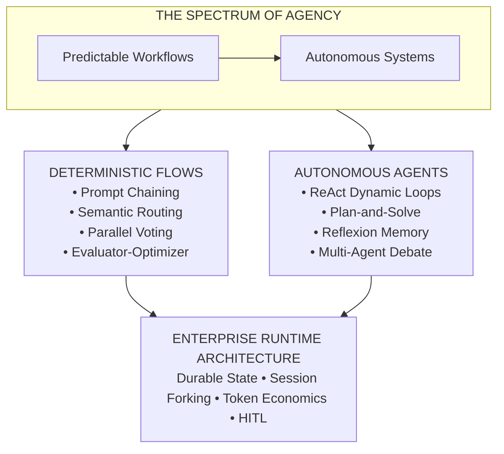

---

## 📑 Table of Contents

1. [Executive Summary & Lead Mental Model](#1-executive-summary--lead-mental-model-must-have-)
2. [Why This Matters for Senior & Lead Developers](#2-why-this-matters-for-senior--lead-developers-must-have-)
3. [Deep-Dive Engineering & Implementation](#3-deep-dive-engineering--implementation-must-have-)
4. [System Architecture & Visual Flows](#4-system-architecture--visual-flows-must-have-)
5. [Comparative Analysis & Tradeoff Matrices](#5-comparative-analysis--tradeoff-matrices-must-have-)
   * [5.1 Loop Engineering: The Fourth Discipline](#51-loop-engineering-the-fourth-discipline-must-have-)
   * [5.2 Code-as-Action (CodeAct) vs JSON Tool Calling](#52-code-as-action-codeact-vs-json-tool-calling-good-to-have-)
6. [Production Failure Modes & Anti-Patterns](#6-production-failure-modes--anti-patterns-must-have-)
   * [6.8 Enterprise Protocol Stack & Framework Unification (2026 Edition)](#68-enterprise-protocol-stack--framework-unification-2026-edition-must-have-)
   * [Agent Framework Matrix 2026](#agent-framework-matrix-2026-must-have-)
7. [Hands-On Practice Labs & Common Problem Solutions](#7-hands-on-practice-labs--common-problem-solutions-must-have-)
8. [Enterprise Reference Code Implementations](#8-enterprise-reference-code-implementations-must-have-)
9. [Verified Curated Resources & Reference Index](#9-verified-curated-resources--reference-index-knowledge-base-)
10. [Capstone Engineering Challenge](#10-capstone-engineering-challenge-must-have-)

---

## 1. Executive Summary & Lead Mental Model [MUST-HAVE] 🔴

### Demystifying "Agents": Architecture vs. Science Fiction [MUST-HAVE] 🔴

In consumer media and introductory tutorials, an "AI Agent" is frequently portrayed as an all-knowing, semi-sentient digital entity capable of autonomously browsing the web, debugging legacy enterprise monoliths, and negotiating corporate contracts without supervision.

In enterprise software engineering, **an agent is simply an LLM operating in an execution loop where its outputs are parsed as control-flow instructions or tool invocations that mutate external state and dictate subsequent iterations.**

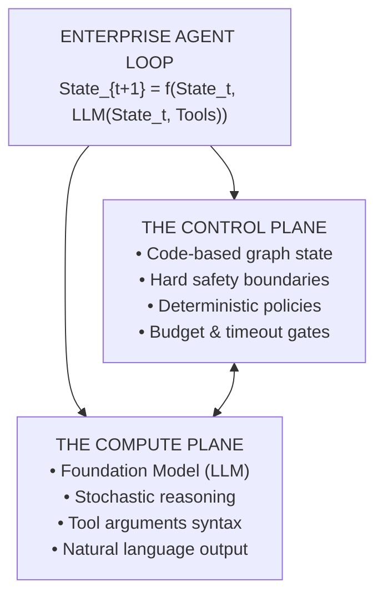

The fundamental error made by junior and intermediate developers is surrendering the entire architectural control plane to the foundation model. When you allow a non-deterministic probabilistic engine to control the recursion depth, the termination condition, the state schema, and the persistence lifecycle, failure is guaranteed. 

A Senior Architect designs **deterministic harnesses** that bound, supervise, and direct stochastic models.

### The Spectrum of Agency: Anthropic's Foundational Taxonomy [MUST-HAVE] 🔴

Anthropic's seminal paper and engineering guide, *"Building Effective Agents"*, establishes a vital conceptual boundary that separates two radically different implementation paradigms:

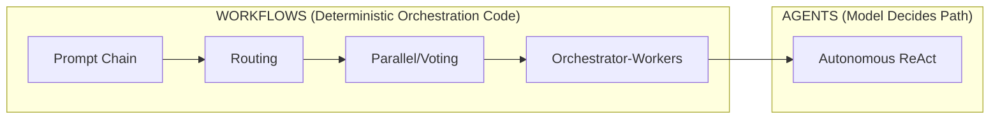

1. **Workflows**: Systems where Large Language Models and external tools are orchestrated through **predetermined code paths**. The developer writes the state machine, defines the branching logic, executes the steps, and handles errors in code. The LLM is invoked solely to perform bounded cognitive transformations (parsing, extraction, summarization, generation, classification).
2. **Autonomous Agents**: Systems where the LLM is given an open-ended goal, a registry of tools, and an environment, and **the model itself determines its own execution path, iteration count, tool selection, and stopping criteria** at runtime.

### The Architectural Golden Rule [MUST-HAVE] 🔴

> **"Start with simple prompts, optimize them with comprehensive evaluations, add deterministic workflows only when complexity demands it, and reserve autonomous agents strictly for open-ended problem spaces where deterministic logic fails."**
> 
> *— Anthropic AI Engineering Core Philosophy*

If a problem can be decomposed into a fixed Directed Acyclic Graph (DAG) of discrete steps (e.g., classify query -> retrieve documents -> summarize -> format JSON), **building an autonomous agent is an architectural anti-pattern**. Workflows deliver lower latency, lower costs, zero infinite loops, and 100% predictable debugging traces.

Autonomous agents should be reserved exclusively for domains with:
* High combinatorial action spaces (e.g., automated coding, open-ended research across unknown web topologies).
* Dynamic exploratory paths where the next step cannot be anticipated ahead of time.
* Interactive environments where intermediate observations force real-time policy adjustments.

---

## 2. Why This Matters for Senior & Lead Developers [MUST-HAVE] 🔴

Moving from single-turn LLM generation to multi-step agentic systems transforms an application from a stateless RPC consumer into a **distributed, stateful, non-deterministic execution runtime**:

| Agentic Production Challenge | Root Cause | Enterprise Impact | Architectural Defense |
|---|---|---|---|
| **Compounding Error Drift** | Multi-step probabilistic execution: $P(\text{System}) = P(\text{Step})^N$. | At 10 steps ($0.95^{10}$), system success drops to $59.9\%$. | Intermediate validation gates, schema assertions, and idempotent checkpoints. |
| **State Explosion & HITL Halts** | Long-running asynchronous sessions across microservices. | Worker crashes lose 40k+ tokens; state graph serialization panics. | Durable state graphs (SQLite/Postgres), event-driven resume, and session forking. |
| **Runaway Latency & Token Burn** | Quadratic token accumulation across multi-turn ReAct loops. | Context window saturation, "Lost in the Middle" drift, \$50+ turn bills. | Strict observation compaction, token budgeting, and tool payload summarization. |
| **Oscillation Loops & Deadlocks** | Repetitive tool calls with identical arguments on failure. | Exhausted API quotas, frozen orchestrators, infinite execution spins. | Deterministic **Execution Governors** (call signature hashing, duplicate caps, iteration budgets). |
| **Black-Box Trajectory Failures** | Classical APM cannot trace LLM reasoning or tool selection. | Undiagnosable production hallucinations occurring 6 steps deep. | **OpenTelemetry GenAI Distributed Tracing** with turn-by-turn semantic spans. |

### Taming Non-Determinism and Compounding Error Drift [MUST-HAVE] 🔴

In a standard API call, an LLM success rate of 95% is considered high. In a multi-step autonomous agent that requires 10 sequential tool interactions to complete a task, compounding probability dictates:

```
P(System Success) = P(Step Success)^N = 0.95^10 ≈ 59.9%
```

A single malformed JSON tool argument, an invalid SQL query, or a mild reasoning hallucination at step 3 propagates forward. Step 4 builds upon a corrupted premise. By step 8, the agent has completely derailed from the user's original objective. 

Architects must implement **deterministic intermediate validators**, **idempotent rollback states**, and **circuit-breaking invariant checks** between every single transition.

### State Explosion, Concurrency & Branching Sessions [GOOD-TO-HAVE] 🟡

In complex enterprise environments (e.g., customer support escalation, claims underwriting, automated pull request remediation), an agent session may span hours or days, interact with dozens of microservices, and require human approval gates.

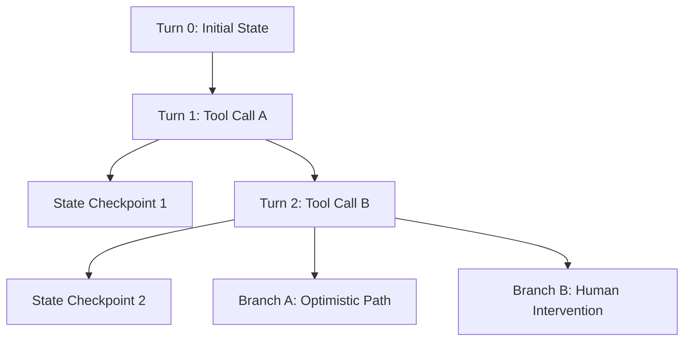

* How do you serialize the agent's memory graph across distributed web servers when an asynchronous human-in-the-loop (HITL) interrupt occurs?
* If a worker node crashes mid-reasoning, how do you restore execution without re-billing the customer for 40,000 tokens of prior reasoning?
* How do you implement **Session Forking**—branching a conversation into alternative speculative paths (e.g., running 3 refactoring strategies in parallel) and pruning failed branches without leaking dirty state into the root context?

### Runaway Latency & Token Economics [MUST-HAVE] 🔴

In an autonomous ReAct loop, the agent appends its intermediate thoughts, tool calls, and tool execution outputs to the conversation history on every turn. 

```
Turn 1: System (2K) + User (500) = 2,500 tokens
Turn 2: Prev History (2.5K) + Thought (200) + Action (100) + Observation (3K) = 5,800 tokens
Turn 3: Prev History (5.8K) + Thought (200) + Action (100) + Observation (5K) = 11,200 tokens
Turn 4: Prev History (11.2K) + Thought (200) + Action (100) + Observation (8K) = 19,500 tokens
Total Cumulative Ingested Tokens over 4 turns = 2,500 + 5,800 + 11,200 + 19,500 = 39,000 tokens!
```

If an agent queries an internal database and receives a raw 2MB JSON payload containing 5,000 database rows, that single observation can exhaust 70% of the active context window. Subsequent turns suffer severe latency degradation (Time To First Token), increased billing, and the **"Lost in the Middle"** phenomenon where the model forgets its primary system prompt instructions.

### Infinite Loops & Reasoning Deadlocks [MUST-HAVE] 🔴

Without strict runtime guardrails, autonomous agents routinely enter cyclical traps:
1. **The Repeated Tool Invocation Trap**: The agent executes `get_user_account(id="123")`, receives an expected error `AccountNotFoundException`, and immediately invokes `get_user_account(id="123")` again with identical parameters, expecting a different outcome.
2. **The Semantic Oscillation Loop**: The agent switches back and forth between two mutually exclusive tool strategies without making forward progress.
3. **The Hallucinated Completion Trap**: The agent repeatedly calls a dummy tool because it lacks the confidence or clear criteria to emit the final answer token.

Production agent engines must enforce **Execution Budgets**: strict caps on wall-clock time, total token expenditure, maximum reasoning iterations, and deterministic cycle-detection heuristics (e.g., hashing tool signatures across turns).

### Distributed Observability for Multi-Step Reasoning Traces [GOOD-TO-HAVE] 🟡

Traditional Application Performance Monitoring (APM) tools (Datadog, New Relic) monitor HTTP request/response durations and database query latencies. They are blind to:
* The internal "Thought" scratchpad of an LLM.
* Why an agent chose `Tool_B` over `Tool_A`.
* Which intermediate step injected a hallucinated entity that caused a failure 6 steps later.
* Token consumption broken down by prompt, generation, and tool overhead per sub-agent.

Lead Engineers must architect **OpenTelemetry-native distributed tracing** where every agent session is a root trace, every turn is a parent span, and every LLM inference, tool execution, and state checkpoint is an instrumented child span containing semantic attributes.

---

## 3. Deep-Dive Engineering & Implementation [MUST-HAVE] 🔴

### 3.1. Workflow Patterns vs. Open Agents (Anthropic Taxonomy) [MUST-HAVE] 🔴

Anthropic categorizes programmatic LLM architectures into five primary deterministic workflow patterns before stepping into fully autonomous agents.

#### Prompt Chaining: Sequential Deterministic Decomposition [MUST-HAVE] 🔴

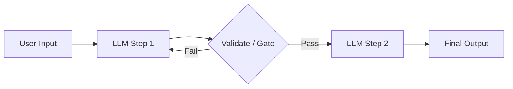

Prompt chaining decomposes a complex task into a linear series of discrete steps, where the output of step N serves as the input to step N+1.

* **Why it beats single-turn megagenerations**: LLMs perform significantly better when dedicated to a narrow cognitive task. Forcing a model to simultaneously analyze requirements, design architecture, generate code, write unit tests, and document APIs in a single turn leads to shallow reasoning, skipped edge cases, and truncated outputs.
* **Deterministic Gate Checks**: Between steps, programmatic code validates outputs (e.g., verifying that Step 1 returned valid JSON conforming to a Pydantic schema, or verifying that generated SQL compiles). If validation fails, the orchestrator triggers an immediate targeted retry without re-running previous steps.

#### Routing: Dynamic Classification to Specialized Models/Prompts [MUST-HAVE] 🔴

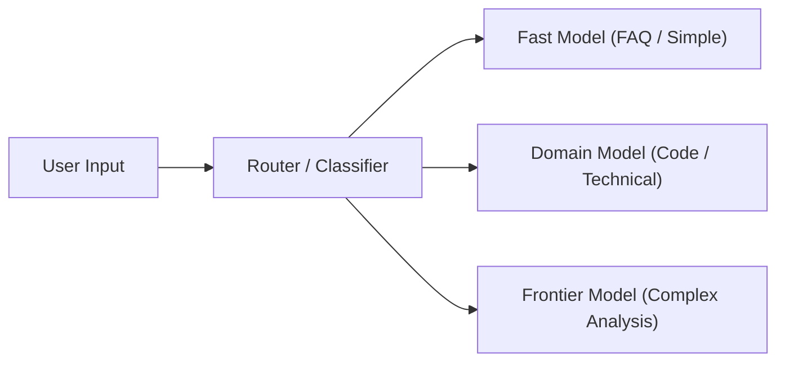

Routing uses a lightweight classifier (a fast LLM like Claude 3.5 Haiku, Gemini 2.5 Flash, or a semantic embedding classifier) to inspect user input and direct it to the optimal downstream handler.

* **Cost & Latency Optimization**: 80% of enterprise queries (FAQ lookups, password resets) do not require expensive frontier reasoning models (Claude 3.7 Sonnet, GPT-4.5, Gemini 1.5 Pro). Routing delivers 5x cost reduction and 3x latency improvements by directing simple queries to fast models and reserving frontier models for complex multi-step reasoning.
* **Specialized Domain Prompts**: Prevents system prompt dilution. Instead of maintaining a monstrous 8,000-token prompt that attempts to cover legal, billing, technical support, and HR rules, routing directs the user to a lean, hyper-focused 500-token prompt tailored to their domain.

#### Parallelization: Sectioning & Voting [GOOD-TO-HAVE] 🟡

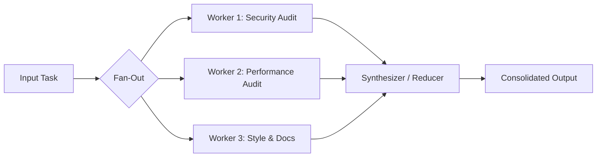

Parallelization executes multiple concurrent LLM calls across two distinct paradigms:

1. **Sectioning (Subtask Decomposition)**: The system splits an input into independent subtasks, executes them simultaneously, and merges the results. For example, during a pull request review, the system runs three parallel analyzers:
   * Worker 1: Static security vulnerability audit (OWASP Top 10).
   * Worker 2: Algorithmic complexity and performance audit.
   * Worker 3: Documentation and naming convention compliance.
   * *Consolidator*: Merges all three reviews into a unified PR review comment.
2. **Voting (Consensus & Diversity)**: The system executes multiple identical prompts with varying temperatures or across different foundation model families (e.g., Claude 3.7 Sonnet, GPT-4.5, Gemini 1.5 Pro) to elect a consensus output. 
   * Used for high-stakes compliance classifications, legal document extraction, or automated production deployments where false positives carry extreme financial cost.

#### Orchestrator-Workers: Central Decomposition & Worker Synthesis [MUST-HAVE] 🔴

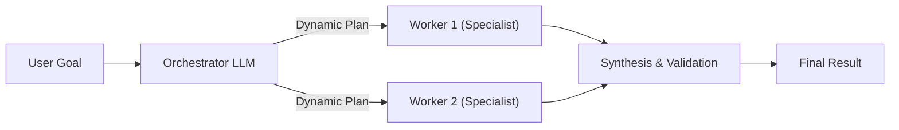

In the Orchestrator-Workers pattern, a central LLM dynamically inspects the user's objective, dynamically breaks it into an arbitrary number of subtasks based on input complexity, delegates subtasks to parallel worker LLMs, and synthesizes the final response.

* **Difference from simple Parallelization**: In Sectioning, the subtasks are hardcoded in advance by the software engineer. In Orchestrator-Workers, **the subtasks are dynamically generated by the Orchestrator at runtime**.
* **Use Case**: Generating a comprehensive competitive analysis report. The orchestrator determines that Company A requires analysis of its financial filings, patent portfolio, and product pricing, whereas Company B requires analysis of its open-source repositories and hiring trends.

#### Evaluator-Optimizer: Self-Correcting Feedback Loops [MUST-HAVE] 🔴

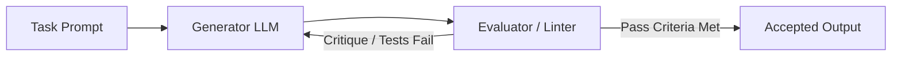

The Evaluator-Optimizer pattern couples two distinct model personas:
* **The Generator**: Produces an initial candidate solution (e.g., code, translation, marketing copy).
* **The Evaluator**: Compares the candidate against an explicit rubric, executes deterministic tests (e.g., unit test runners, linters, security scanners), and provides actionable verbal critique.

The Generator receives its own past output, the evaluator's critique, and produces an improved revision. The loop continues until the evaluator emits a `PASS` token or the system hits a maximum iteration ceiling (K <= 3).

---

### 3.2. Autonomous Agent Architecture [MUST-HAVE] 🔴

When tasks cannot be mapped to a fixed DAG, architectures transition to autonomous execution loops.

#### The ReAct (Reasoning + Acting) Loop [MUST-HAVE] 🔴
Introduced by Yao et al. (2022), **ReAct** synergizes reasoning traces and task-specific actions. Pure reasoning (Chain-of-Thought) suffers from hallucination because the model cannot verify external facts. Pure action (Act) lacks foresight, context tracking, and error recovery.

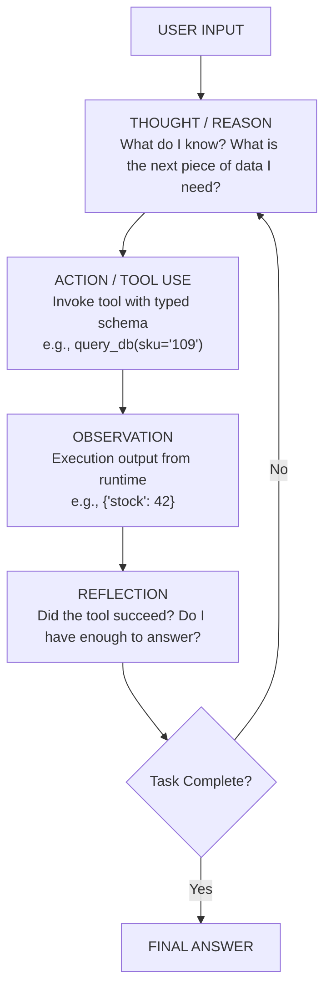

1. **Thought**: The model generates explicit natural language reasoning about current progress, missing variables, and strategy.
2. **Action**: The model selects an external tool from its schema registry and emits structured parameters.
3. **Observation**: The execution runtime intercepts the tool call, executes it against an external system (DB, API, shell), and feeds the result back as an environment observation.
4. **Reflection**: The model interprets the observation, verifies whether the hypothesis was confirmed, and decides whether to terminate or initiate another cycle.

#### Plan-and-Solve / Plan-and-Execute [GOOD-TO-HAVE] 🟡
While ReAct is powerful, it suffers from **local horizon bias** (wandering off track over 15+ turns because each step is decided reactively). **Plan-and-Solve** decouples strategic planning from tactical execution:

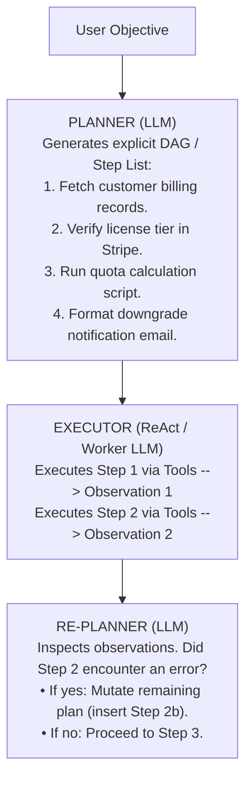

By maintaining a distinct, visible execution plan in the state schema, the agent prevents drift and provides end-users with real-time progress transparency.

#### Reflexion: Verbal Reinforcement Learning & Memory of Failures [GOOD-TO-HAVE] 🟡
Published by Shinn et al. (NeurIPS 2023), **Reflexion** gives agents dynamic memory and self-reflective capabilities without retraining model weights.

When an agent fails to complete a task (e.g., generated code fails unit tests, or a search returns zero results after 5 attempts), conventional agents crash or give up. A Reflexion agent:
1. Pauses execution upon detecting task failure.
2. Invokes a **Self-Reflection Evaluator** that analyzes the full trajectory: *"Where did my reasoning derail? Why did tool invocation X fail? What erroneous assumptions did I make?"*
3. Formulates a **Verbal Self-Critique**: *"I assumed the user ID was a UUID, but the API returned a 400 Bad Request indicating it expects an email string. On the next trial, I must first resolve the username to an email address."*
4. Writes this critique into **Episodic Memory**.
5. Restarts the task from scratch, with the verbal critique prepended into its working memory as a high-priority system constraint.

Reflexion empirically improves task success rates by over 30% across challenging coding and multi-hop reasoning benchmarks (HumanEval, ALFWorld).

---

### 3.3. Stateful Agents & Session Management [GOOD-TO-HAVE] 🟡

Production agents cannot exist as simple ephemeral while-loops in local process memory. They must be engineered as **Durable Distributed State Machines**.

#### State Machines for Agents: Graphs, Reducers & Transitions [MUST-HAVE] 🔴
In frameworks like **LangGraph** and enterprise event-driven architectures, an agent is modeled as a formal State Graph:
* **State**: A strongly typed schema (Pydantic model or dataclass) representing the complete snapshot of the world at step `t`:
  ```
  State S = { Messages, CurrentPlan, ActiveVariables, IterationCount, PendingApprovals }
  ```
* **Nodes**: Deterministic Python, TypeScript, or .NET functions that accept current state `S_t` and emit partial state updates `Delta_S`.
* **Reducers**: Deterministic merging functions that dictate how `Delta_S` is combined with `S_t` (e.g., appending new messages to a list, overwriting a variable, or incrementing a counter).
* **Edges & Conditional Edges**: Routing logic that evaluates the current state and returns the next destination node string.

#### Durable Persistence, Resumption & Session Forking [GOOD-TO-HAVE] 🟡
Enterprise systems require state to be durable across network partitions, node failures, and asynchronous human interactions:

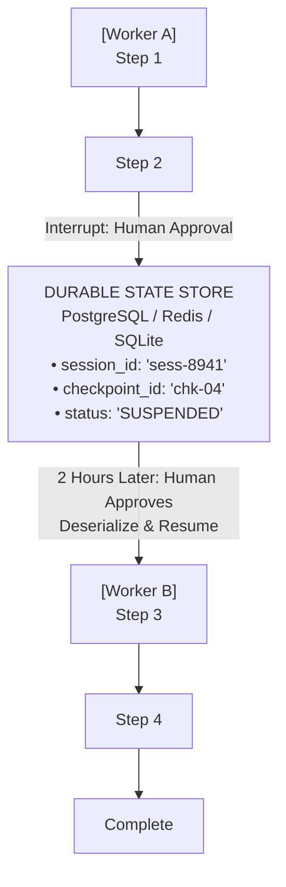

* **Session Resumption**: The agent serializes its state machine to a durable database (SQLite, PostgreSQL, Redis) after every node transition. If an asynchronous interrupt occurs (e.g., awaiting a manager's sign-off for a \$5,000 refund), the process terminates cleanly. Two hours later, a webhook hits any available worker node, which deserializes `checkpoint_id`, restores the exact graph state, and resumes execution seamlessly.
* **Session Forking (Branching Exploration)**: By storing immutable checkpoint snapshots, an agent runtime can "fork" an active session. If an agent wants to explore two alternative refactoring strategies, it forks `chk-04` into `sess-8941-branch-A` and `sess-8941-branch-B`, runs them concurrently, scores the outcomes, and commits only the winning branch back to trunk.

#### Context Compaction & Observation Pruning [MUST-HAVE] 🔴
As an agent interacts with tools, intermediate observations rapidly consume the context window. Architects implement a **Three-Tier Context Pruning Pipeline**:

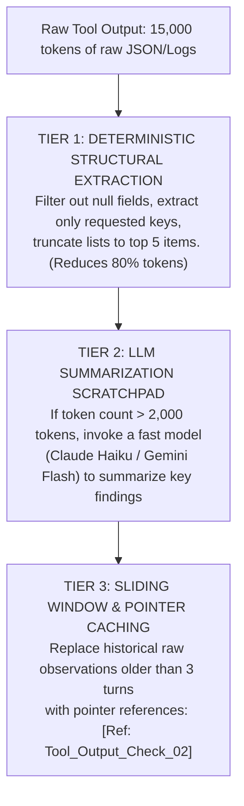

---

### 3.4. Memory Systems [GOOD-TO-HAVE] 🟡

Autonomous systems emulate biological cognitive memory architectures, split into four distinct tiers:

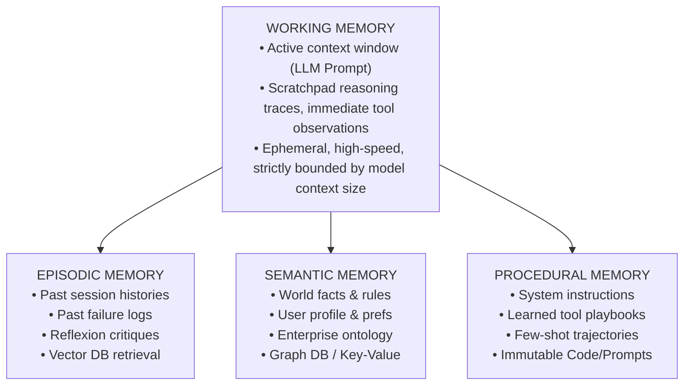

| Memory System | Biological Analogy | Technical Storage Mechanism | Access Pattern | Enterprise Example |
|---|---|---|---|---|
| **Working Memory** `[MUST-HAVE]` 🔴 | Prefrontal Cortex (Short-term focus) | In-memory LLM Context Window (Prompt messages, scratchpad) | Direct sequential token attention | Active conversation messages, current tool payload being inspected. |
| **Episodic Memory** `[GOOD-TO-HAVE]` 🟡 | Hippocampus (Past experiences & events) | Vector Database (Qdrant, Pinecone, pgvector) with semantic embeddings | Semantic similarity search (k-NN) on incoming task goals | Retrieving a post-mortem critique from last week when a similar SQL migration failed. |
| **Semantic Memory** `[GOOD-TO-HAVE]` 🟡 | Temporal Cortex (Long-term facts & general knowledge) | Document Stores, Graph Databases (Neo4j), Relational DBs, Key-Value | Entity linking, structured SQL queries, hybrid vector search | User account settings, company reimbursement policies, system architecture specs. |
| **Procedural Memory** `[KNOWLEDGE-BASE]` 🔵 | Striatum & Motor Cortex (Habits, motor skills & how-to rules) | System Prompts, Tool Definitions (JSON Schema), Code Workflows | Immutable configuration injected at runtime initialization | Step-by-step instructions on how to authenticate against the internal OAuth2 provider and invoke tools. |
    
> [!NOTE]
> **Connection to Module 02:** Long-term memory retrieval uses the same embedding + vector search infrastructure as RAG systems. The retrieval strategies, hybrid search, and reranking patterns from [Module 02: RAG & Knowledge Systems](../02-rag-and-knowledge-systems/README.md) apply directly to agent memory retrieval.

---

### 3.5. Enterprise Agent Frameworks [GOOD-TO-HAVE] 🟡

When standardizing on an enterprise stack, engineering leads must evaluate framework tradeoffs across typing, state handling, debugging overhead, production reliability, and ecosystem lock-in:

#### LangChain: Chains, Ecosystem & Production Boundaries [GOOD-TO-HAVE] 🟡

**LangChain** pioneered the early LLM application space by aggregating hundreds of data connectors, vector stores, and prompt templates into a unified Python and TypeScript abstraction layer.

* **Core Architectural Primitives**:
  - **Chains & LCEL (LangChain Expression Language)**: Declarative, unix-pipe style chaining (`chain = prompt | model | parser`) that handles serialization, batching, and async execution out of the box.
  - **Unified Ecosystem Connectors**: Out-of-the-box abstractions for 700+ document loaders, vector stores (pgvector, Qdrant, Pinecone), embeddings, and third-party SaaS APIs.
  - **Tool & Agent Abstractions**: High-level wrappers (`create_react_agent`, `AgentExecutor`) that handle function calling and output parsing across multiple model providers.

* **Pros**:
  - **Unrivaled Ecosystem Breadth**: Fastest path to connect disparate enterprise data sources (Confluence, SharePoint, Jira, SQL) during rapid prototyping.
  - **Provider-Agnostic Abstraction**: Switch between OpenAI, Anthropic, Google, and self-hosted models by updating configuration rather than rewriting application code.
  - **Vibrant Community**: Extensive documentation, reusable templates, and active maintenance.

* **Cons & Production Limitations**:
  - **Deep Inheritance & Opaque Abstractions**: High degree of class inheritance wraps simple HTTP calls in layers of nested objects, making stack traces cryptic and post-mortem debugging challenging.
  - **Poor Fit for Cyclical Agent Loops**: Standard chains model linear Directed Acyclic Graphs (DAGs). Attempting to implement complex stateful loops or multi-agent back-and-forth leads to brittle monkey-patching.
  - **API Churn & Maintenance Overhead**: Rapid framework updates and shifting deprecation cycles create upgrade friction and technical debt in long-lived production systems.
  - **Architectural Verdict**: Excellent for rapid prototyping, retrieval pipelines, and linear prompt chains; avoid for mission-critical, long-running agentic state loops.

#### LangGraph: Stateful Cyclical Graphs & Checkpointed Runtimes [MUST-HAVE] 🔴

Created by the LangChain team specifically to resolve the architectural limitations of linear chains, **LangGraph** models agent runtimes as cyclical, stateful computational graphs.

* **Core Architectural Primitives**:
  - **Cyclical StateGraph**: A computational graph where nodes are standard functions (Python or TypeScript) that receive current state and return partial updates, while edges determine deterministic or conditional transitions.
  - **Typed State Schemas & Reducers**: State is defined via strongly typed schemas (`TypedDict` or Pydantic). Keys can specify custom reducer functions (e.g., `operator.add` to append messages rather than overwriting existing history).
  - **Durable Checkpointing**: Persistence layers (`SqliteSaver`, `PostgresSaver`, Redis) automatically commit graph state to disk at every "super-step", enabling zero-loss crash recovery and offline resumption.
  - **Human-in-the-Loop (HITL) & Time Travel**: Native `interrupt_before` and `interrupt_after` hooks halt graph execution before high-risk actions. Operators can inspect pending tool calls, mutate state variables, and resume execution—or "time-travel" back to previous checkpoints to test alternative branches.

* **Pros**:
  - **True Cyclical Reasoning**: Naturally supports ReAct and Plan-Execute loops (`Thought -> Action -> Observation -> Thought`) without artificial recursion hacks.
  - **Enterprise Fault Tolerance**: Resumes failed long-running workflows exactly from the last saved super-step rather than restarting from scratch.
  - **Multi-Agent Topologies**: Cleanly implements supervisors, hierarchical teams, and peer-to-peer swarms with isolated sub-graphs.

* **Cons & Production Limitations**:
  - **Boilerplate & Learning Curve**: Requires explicit mental modeling of state machines, channel reducers, and graph compilation.
  - **Coupling with LangChain Objects**: While much leaner than classic LangChain, it still defaults to LangChain core message schemas and serialization conventions.
  - **State Memory Management**: Unbounded accumulation in list reducers can cause state bloat without explicit compaction strategies.

#### Microsoft Agentic Frameworks: Semantic Kernel, AutoGen & Azure AI Agent Service [MUST-HAVE] 🔴

Microsoft provides a three-tiered portfolio of agent technologies spanning enterprise runtime frameworks to managed cloud services:

1. **Microsoft Semantic Kernel (Enterprise C#/.NET 8/9, Python, Java)**:
   - **Enterprise Integration**: Designed specifically for enterprise software engineering teams building on ASP.NET Core, Spring Boot, or enterprise Python.
   - **Strongly Typed Native Plugins**: Developers decorate standard C# methods with `[KernelFunction]` and `[Description]` attributes to expose business logic as AI-callable tools without glue code.
   - **Filter Pipelines**: Middleware pattern (`IFunctionInvocationFilter`, `IPromptRenderFilter`) enables enterprise observability, PII redaction, token rate-limiting, and security policy enforcement at the tool invocation boundary.
   - **AgentGroupChat & Strategies**: Built-in abstractions for multi-agent collaboration with customizable `SelectionStrategy` (who speaks next) and `TerminationStrategy` (when to stop).
   - **Pros**: First-class .NET dependency injection, zero Python dependency for enterprise .NET shops, enterprise telemetry via `ActivitySource`.
   - **Cons**: Multi-agent features are newer than standalone kernel features; historically less extensive third-party community plugins than Python ecosystems.

2. **Microsoft AutoGen & AutoGen Studio (Multi-Agent Conversational Framework)**:
   - **Conversational Multi-Agent Paradigm**: Pioneered the conversational agency pattern where specialized personas (e.g., `AssistantAgent`, `UserProxyAgent`, `WebSurfer`) collaborate via multi-turn chat messages.
   - **Event-Driven Actor Architecture (AutoGen v0.4+)**: The rewritten v0.4 architecture adopts an asynchronous Actor model, providing distributed event-driven message dispatching, state isolation, and gRPC/WebSocket inter-process communication.
   - **AutoGen Studio**: Low-code visual UI environment for prototyping, evaluating, and visualizing agent teams and workflows.
   - **Pros**: Highly intuitive for simulating peer debates, code-generation/execution loops, and research agent swarms.
   - **Cons**: Dynamic conversational chat loops can easily degenerate into infinite banter without strict termination criteria; high token consumption.

3. **Azure AI Agent Service (Enterprise Managed Agent Platform)**:
   - **Fully Managed Infrastructure**: Enterprise cloud service hosting agents built on frontier models (GPT-4.5 / o3, LLaMA 3.3) without managing runtime VM/container clusters.
   - **Enterprise Security & Compliance**: Built-in integration with Microsoft Entra ID (RBAC), private virtual networks (VNet/Private Endpoints), customer-managed encryption keys (CMEK), and HIPAA/SOC2 compliance.
   - **Native Knowledge & Tool Bindings**: Direct out-of-the-box connectors to Azure AI Search, Azure Functions, OpenAPI specifications, and Code Interpreter in sandboxed micro-VMs.
   - **Pros**: Zero infrastructure maintenance, unified billing, enterprise identity governance, turn-key tool execution sandboxes.
   - **Cons**: Vendor lock-in to the Azure cloud ecosystem; less flexibility for bespoke custom runtime scheduling.

#### Google Agent Development Kit (ADK) [MUST-HAVE] 🔴
Google's **Agent Development Kit (ADK)** is designed for enterprise-grade, code-first agent development integrated deeply with the Google Cloud and Gemini ecosystem.
* **Code-First Architecture**: Avoids bloated abstractions; treats agents, tools, and orchestrators as native Python or TypeScript components.
* **Tool & MCP Integration**: First-class support for Model Context Protocol (MCP) servers, allowing seamless tool sharing across enterprise boundaries.
* **The `agents-cli` Lifecycle Suite**:
  * `agents-cli scaffold create`: Bootstraps production-ready agent projects with typed schemas and CI/CD templates.
  * `agents-cli eval run`: Runs automated trajectory and LLM-as-a-judge regression test suites against golden datasets.
  * `agents-cli deploy`: Packages agents for enterprise deployment to Google Cloud Run, Vertex AI Agent Engine, or GKE.
* **Pros**: Ultra-clean code-first mental model, enterprise Google Cloud integration, end-to-end tooling from scaffolding to production monitoring.
* **Cons**: Primarily optimized for the Google Cloud/Gemini ecosystem.

#### Anthropic Claude SDK & Minimalist Patterns [MUST-HAVE] 🔴
Anthropic champions a **minimalist, framework-free approach** centered on raw SDK primitives:
* **Native Tool Calling**: Directly leveraging Claude's `tools`, `tool_use`, and `tool_result` content blocks.
* **Prompt Caching**: Leveraging Claude's 5-minute ephemeral prompt cache to dramatically reduce latency and cost for long-running agent loops (caching system prompts, tool schemas, and historical turns).
* **Code as Orchestrator**: Anthropic strongly recommends writing explicit Python/TypeScript control flow (while loops, async task queues) rather than introducing opaque third-party agent wrapper libraries.
* **Pros**: Zero third-party library overhead, 100% transparent execution traces, no breaking framework churn, maximum performance.
* **Cons**: Developers must manually implement checkpointing, retry logic, and multi-agent routing.

#### PydanticAI: Type-Safe Agents & Dependency Injection [MUST-HAVE] 🔴
Built by the Pydantic team, **PydanticAI** provides an ergonomic, production-grade framework for writing type-safe agents in Python:
* **Model-Agnostic & Type-Safe**: Supports OpenAI, Anthropic, Gemini, Groq, and Ollama with first-class type safety for tools and structured returns via Pydantic models.
* **Dependency Injection (DI)**: Agents accept typed dependency containers (`deps_type`), enabling testability, mocking, and clean separation between AI logic and underlying database or service clients.
* **Stream Validation**: Validates streamed LLM structured outputs incrementally as tokens arrive, rather than waiting for complete generation before error checking.
* **Pros**: Native FastAPI developer experience, zero untyped dictionary parsing, built-in validation retry loops, lightweight and minimal abstractions.
* **Cons**: Younger ecosystem than LangChain; fewer community third-party tool wrappers out of the box.

#### OpenAI Agents SDK: Enterprise Handoffs & Production Sandboxing [MUST-HAVE] 🔴
The **OpenAI Agents SDK (`openai-agents`)** is OpenAI's official production multi-agent framework, replacing the experimental Swarm project:
* **Agent Handoffs**: First-class primitive allowing agents to transfer execution control and context directly to specialized peer agents without centralized supervisor bottlenecks.
* **Built-in Guardrails & Sandboxes**: Provides out-of-the-box input/output guardrail interceptors and isolated execution sandboxes for safe code execution.
* **Native Tracing**: Emits standard telemetry and OpenTelemetry-compatible traces directly into the OpenAI developer platform dashboard.
* **Pros**: Official production support from OpenAI, minimal boilerplate, clean handoff abstractions, enterprise security sandboxes.
* **Cons**: Primarily designed for the OpenAI API ecosystem.

---

### 3.6. Multi-Agent Orchestration Patterns [MUST-HAVE] 🔴

When an enterprise problem exceeds the cognitive capacity of a single context window, requires distinct security and permission boundaries, or demands specialized domain reasoning, systems scale to **Multi-Agent Orchestration**.

#### Core Multi-Agent Topologies [MUST-HAVE] 🔴

##### 1. Supervisor Pattern (Centralized Hub-and-Spoke)

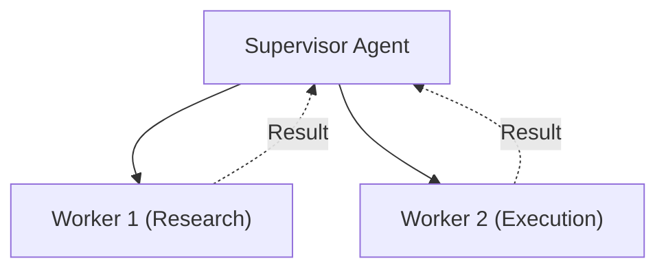

* A single central coordinator agent receives the user's objective, inspects worker capability manifests, delegates discrete subtasks to specialized subordinate agents, inspects their results, and decides the next step.
* **Data Flow**: Leaf workers communicate *solely* with the supervisor; peer-to-peer communication between workers is prohibited.
* **Tradeoffs**: Highly observable and straightforward to debug; however, the supervisor's context window becomes an architectural throughput and token bottleneck.

##### 2. Hierarchical Multi-Agent Teams (Tree-Structured Organization)

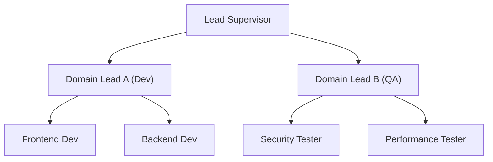

* Emulates enterprise management structures. A top-level executive agent delegates to functional domain leads (e.g., Engineering Lead, QA Lead, Security Lead), who in turn manage specialized leaf agents (e.g., Backend Developer, Database Specialist).
* **Encapsulation**: Sub-teams maintain isolated sub-graphs. Leaf-agent dialogue remains strictly contained within the sub-team, passing only synthesized milestone deliverables up the chain.

##### 3. Swarm & Dynamic Handoff (Decentralized Peer-to-Peer)

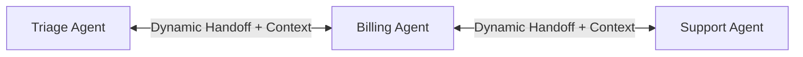

* Popularized by the OpenAI Swarm reference pattern. Agents operate as peer nodes in a mesh network with the ability to dynamically transfer execution control ("hand off") to another agent along with the conversation state.
* **Execution Mechanics**: The active agent executes a transfer tool (e.g., `transfer_to_billing_agent()`). The orchestrator runtime updates its execution pointer to point directly to the new agent without returning control to a centralized supervisor.

##### 4. Multi-Agent Debate & Consensus (Adversarial Triad)

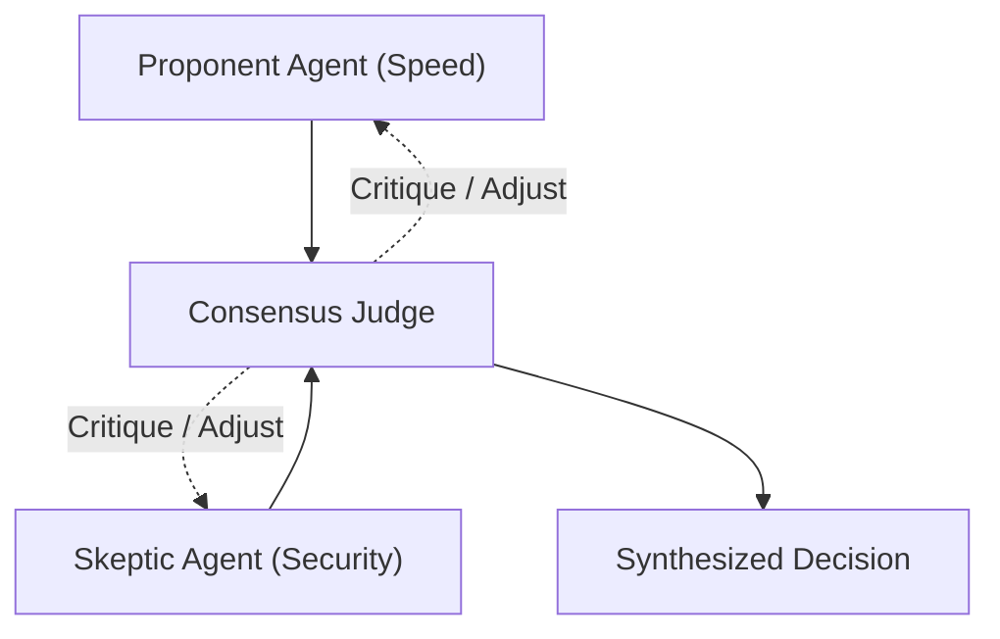

* Two or more agents are initialized with contrasting goals, rubrics, or system instructions (e.g., a "Security Auditor" hunting for vulnerabilities vs. a "Feature Velocity Engineer" minimizing code changes).
* **Dialectic Convergence**: The agents iteratively critique each other's outputs across T rounds until a neutral Judge Agent synthesizes a balanced, mathematically grounded consensus.

---

#### Agent-to-Agent (A2A) Protocols [MUST-HAVE] 🔴

In distributed enterprise environments, agents run on heterogeneous infrastructure across different services, languages (Python, C#, Go), and cloud providers. Standardizing inter-agent communication requires a formal **Agent-to-Agent (A2A) Communication Protocol**.

##### Standard JSON-RPC / REST A2A Envelope Schema

Every message exchanged between distributed agents must be wrapped in a strictly typed envelope that contains correlation metadata, execution limits, state markers, and scoped context payloads:

```json
{
  "$schema": "https://json-schema.org/draft/2020-12/schema",
  "title": "AgentMessageEnvelope",
  "type": "object",
  "required": [
    "envelope_id",
    "correlation_id",
    "sender_agent_id",
    "recipient_agent_id",
    "lifecycle_state",
    "task_definition",
    "context_payload",
    "state_transition",
    "timestamp_utc"
  ],
  "properties": {
    "envelope_id": { "type": "string", "format": "uuid" },
    "correlation_id": { "type": "string", "description": "W3C TraceContext root trace ID" },
    "parent_span_id": { "type": "string" },
    "sender_agent_id": { "type": "string", "example": "urn:agent:engineering:security-auditor-v2" },
    "recipient_agent_id": { "type": "string", "example": "urn:agent:engineering:refactoring-lead-v1" },
    "lifecycle_state": {
      "type": "string",
      "enum": ["SUBMITTED", "ACK", "PROCESSING", "AWAITING_INPUT", "COMPLETED", "FAILED", "CANCELLED"]
    },
    "task_definition": {
      "type": "object",
      "required": ["action_name", "goal", "schema_version"],
      "properties": {
        "action_name": { "type": "string" },
        "goal": { "type": "string" },
        "input_parameters": { "type": "object" },
        "schema_version": { "type": "string", "example": "1.2.0" }
      }
    },
    "context_payload": {
      "type": "object",
      "required": ["scoped_variables", "artifact_pointers"],
      "properties": {
        "scoped_variables": { "type": "object" },
        "artifact_pointers": {
          "type": "array",
          "items": { "type": "string", "format": "uri" }
        },
        "summary_brief": { "type": "string" }
      }
    },
    "state_transition": {
      "type": "object",
      "required": ["step_index", "max_allowed_steps", "timeout_ms", "idempotency_key"],
      "properties": {
        "step_index": { "type": "integer", "minimum": 0 },
        "max_allowed_steps": { "type": "integer", "maximum": 20 },
        "timeout_ms": { "type": "integer", "default": 60000 },
        "idempotency_key": { "type": "string" }
      }
    },
    "timestamp_utc": { "type": "string", "format": "date-time" }
  }
}
```

In Python, this envelope is enforced through Pydantic v2 models:

```python
from enum import Enum
from typing import Any, Dict, List, Optional
from pydantic import BaseModel, Field
import uuid
import datetime

class A2ALifecycleState(str, Enum):
    SUBMITTED = "SUBMITTED"
    ACK = "ACK"
    PROCESSING = "PROCESSING"
    AWAITING_INPUT = "AWAITING_INPUT"
    COMPLETED = "COMPLETED"
    FAILED = "FAILED"
    CANCELLED = "CANCELLED"

class TaskDefinition(BaseModel):
    action_name: str
    goal: str
    input_parameters: Dict[str, Any] = Field(default_factory=dict)
    schema_version: str = "1.0.0"

class ContextPayload(BaseModel):
    scoped_variables: Dict[str, Any] = Field(default_factory=dict)
    artifact_pointers: List[str] = Field(default_factory=list)
    summary_brief: Optional[str] = None

class StateTransition(BaseModel):
    step_index: int = 0
    max_allowed_steps: int = 10
    timeout_ms: int = 60000
    idempotency_key: str

class AgentMessageEnvelope(BaseModel):
    envelope_id: str = Field(default_factory=lambda: str(uuid.uuid4()))
    correlation_id: str
    parent_span_id: Optional[str] = None
    sender_agent_id: str
    recipient_agent_id: str
    lifecycle_state: A2ALifecycleState
    task_definition: TaskDefinition
    context_payload: ContextPayload
    state_transition: StateTransition
    timestamp_utc: str = Field(default_factory=lambda: datetime.datetime.now(datetime.timezone.utc).isoformat())
```

##### A2A Lifecycle State Machine & Idempotency

Every inter-agent task adheres to a formal 7-state finite state machine:

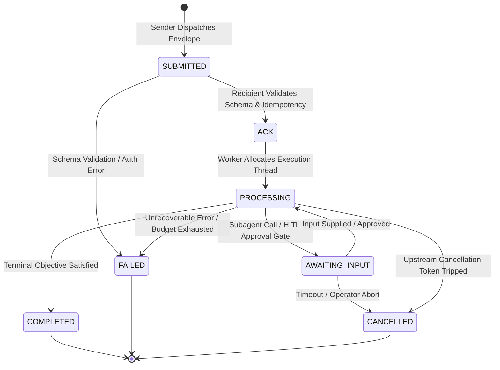

| Lifecycle State | Semantics & Transition Invariants | Timeout & Failure Handling |
|---|---|---|
| `SUBMITTED` | Message is serialized into message broker or HTTP payload. Not yet consumed by recipient. | Receiver verifies `idempotency_key`. If already processed, returns cached checkpoint. |
| `ACK` | Recipient has received, deserialized, authenticated the JWT/mTLS token, and validated the schema. | If recipient fails to emit `ACK` within 5,000ms, broker initiates redelivery. |
| `PROCESSING` | Recipient LLM is executing reasoning turns and invoking local tools. | Enforces `timeout_ms`. If exceeded, worker self-aborts and emits `FAILED`. |
| `AWAITING_INPUT` | Worker has paused execution: awaiting sub-agent result or asynchronous human approval (HITL). | Graph state serialized to durable DB. Worker thread freed back to the pool. |
| `COMPLETED` | Objective fulfilled. Output payload validated against response schema. | Emits terminal message to caller; checkpoints final state to storage. |
| `FAILED` | Terminal failure: max iterations exceeded, tool exception unhandled, or budget exhausted. | Triggers Distributed Saga compensation (compensating rollback tools). |
| `CANCELLED` | Explicit abort issued by parent supervisor, client abort webhook, or circuit breaker. | Halts all active sub-tasks immediately and revokes ephemeral tool access tokens. |

* **Idempotency Guarantee**: Every request derives an idempotency key:
  ```
  idempotency_key = SHA256(correlation_id + action_name + str(step_index))
  ```
  If an agent worker crashes during execution and the broker redelivers the message, the worker checks its durable checkpoint store. If an entry exists for that idempotency key, it directly returns the stored result without invoking the LLM or re-executing non-idempotent tools.

##### Message Brokering: Event-Driven Pub/Sub vs. Direct Synchronous RPC

Architecting the transport layer for multi-agent systems requires evaluating two competing paradigms:

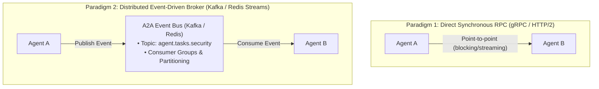

1. **Direct Synchronous RPC (gRPC / HTTP REST)**:
   - **Mechanics**: Agent A opens an HTTP/2 or gRPC connection directly to Agent B's container endpoint, transmits the envelope, and streams responses via Server-Sent Events (SSE) or bidirectional gRPC streams.
   - **Strengths**: Minimal network overhead (< 5ms latency); direct backpressure propagation; simplest local testing and deterministic mocking.
   - **Weaknesses**: Tight temporal coupling. If Agent B is saturated, rebooting, or throttled by LLM rate limits, Agent A's connection times out. Prone to **cascading connection exhaustion** in deep hierarchies.
2. **Event-Driven Pub/Sub (Apache Kafka, RabbitMQ, Redis Streams)**:
   - **Mechanics**: Agent A publishes an envelope to a partitioned topic (e.g., `agent.tasks.code-review`). Agent B belongs to a competing Consumer Group, pulls tasks when capacity allows, and publishes results to `agent.results.code-review`.
   - **Strengths**: Complete temporal decoupling; built-in durable message buffering; natural horizontal scaling (adding worker pods consumes from the same partition); replayability (can replay past agent event streams to debug failures).
   - **Weaknesses**: Higher end-to-end latency (20-50ms broker transit overhead); requires distributed state coordination; more complex local development and distributed tracing setup.

---

#### Agent Swarms & Dynamic Handoffs [MUST-HAVE] 🔴

The **Swarm pattern** (pioneered by OpenAI Swarm) represents a paradigm shift away from heavy, centralized orchestrators toward lightweight, decentralized routines with dynamic handoffs.

##### The OpenAI Swarm Pattern: Pointer Mutation

In a Swarm, an agent is not an ongoing, heavyweight stateful service. It is a lightweight routine defined by:
1. A specific **System Prompt / Instructions**.
2. A registry of **Tools / Functions**.
3. Specialized **Handoff Functions** that transfer execution to another agent.

When an agent decides that another specialist is better suited for a task, it invokes a handoff tool (e.g., `transfer_to_triage()`). The tool returns the *Agent instance* itself. The outer execution loop catches this return value, mutates its active agent pointer, and immediately executes the next reasoning cycle against the new agent's prompt and tools.

```python
"""
minimal_swarm_runtime.py
Production architecture of the dynamic Swarm handoff pattern.
Demonstrating pointer mutation and execution handoff without a central supervisor.
"""

from typing import Any, Callable, Dict, List, Optional, Tuple
from dataclasses import dataclass, field

@dataclass
class Agent:
    name: str
    instructions: str
    functions: List[Callable[..., Any]] = field(default_factory=list)

@dataclass
class SwarmResult:
    value: str
    next_agent: Optional[Agent] = None

# 1. Define Specialized Agents
billing_agent = Agent(
    name="Billing Specialist",
    instructions="You handle customer invoice queries, refunds, and payment disputes."
)

tech_support_agent = Agent(
    name="Technical Support Specialist",
    instructions="You diagnose server outages, database latency, and API error codes."
)

# 2. Define Dynamic Handoff Functions (Mutate Execution Pointer)
def transfer_to_billing() -> SwarmResult:
    """Transfers the conversation directly to the Billing Specialist."""
    return SwarmResult(
        value="Transferring session to Billing Specialist...",
        next_agent=billing_agent
    )

def transfer_to_tech_support() -> SwarmResult:
    """Transfers the conversation directly to the Technical Support Specialist."""
    return SwarmResult(
        value="Transferring session to Technical Support...",
        next_agent=tech_support_agent
    )

triage_agent = Agent(
    name="Triage Router",
    instructions="Inspect user intent and route to either Billing or Tech Support.",
    functions=[transfer_to_billing, transfer_to_tech_support]
)

# 3. The Swarm Execution Loop
class SwarmEngine:
    def execute(self, starting_agent: Agent, messages: List[Dict[str, str]], max_turns: int = 5) -> Tuple[Agent, str]:
        active_agent = starting_agent
        
        for turn in range(max_turns):
            print(f"[Turn {turn + 1}] Active Agent: {active_agent.name}")
            
            # Simulated model tool call decision:
            # In production: response = llm.chat(messages, tools=active_agent.functions)
            if active_agent.name == "Triage Router":
                # Simulated model deciding to hand off to billing
                handoff_result: SwarmResult = transfer_to_billing()
                active_agent = handoff_result.next_agent  # <--- POINTER MUTATION
                messages.append({"role": "system", "content": handoff_result.value})
                continue
            
            elif active_agent.name == "Billing Specialist":
                # Final response generated
                return active_agent, "Invoice #9021 has been credited $50.00."
                
        return active_agent, "Max turns reached without terminal answer."
```

##### Context Window Isolation vs. Shared Memory

When an execution handoff occurs between Agent A and Agent B, how should conversation history and intermediate state be transferred? Enterprise systems utilize three architectural patterns:

```mermaid
flowchart TD
    subgraph PatternA["PATTERN A: NAIVE FULL CONTEXT PASS-THROUGH (Anti-Pattern)"]
        direction LR
        PA_User["User Prompt"] --> PA_A["Agent A Reasoning & Tool Logs\n(15,000 Tokens)"] --> PA_B["Agent B Prompt\n(Ingests all 15K Tokens!)"]
    end

    subgraph PatternB["PATTERN B: SCOPED SUMMARIZATION BRIDGE (Recommended)"]
        direction LR
        PB_User["User Prompt"] --> PB_A["Agent A Reasoning"] --> PB_DTO["Structured Synthesis DTO\n(400 Tokens)"] --> PB_B["Agent B Prompt"]
    end

    subgraph PatternC["PATTERN C: DURABLE POINTER PASSING (High Scalability)"]
        direction LR
        PC_A["Agent A writes bulky state to Redis"] --> PC_Ptr["Passes {session_id, pointer_id}"] --> PC_B["Agent B queries keys on demand"]
    end
```

1. **Pattern A: Naive Full Context Pass-Through**:
   - The entire message array (system prompts, intermediate scratchpads, tool outputs) is passed directly to the next agent.
   - **Fatal Flaw**: Compounding context bloat (O(N^2) token cost), severe prompt dilution, and vulnerability to indirect prompt injections hopping across agent boundaries.
2. **Pattern B: Scoped Summarization Bridge (Structured Handoff DTO)**:
   - When Agent A initiates `transfer_to_agent_b()`, Agent A's runtime must generate a concise, structured handoff payload conforming to a typed schema:
     - `verified_facts`: Verified entity data extracted by Agent A.
     - `completed_actions`: Tools already invoked and their terminal outcomes.
     - `remaining_objective`: What Agent B is explicitly tasked with solving.
   - Agent B receives only its own lean system prompt, the user's initial objective, and the 400-token Handoff DTO. Token consumption is slashed by **85%**, and cross-agent instruction contamination is eradicated.
3. **Pattern C: Shared External State Store with Pointer Passing**:
   - Heavy tool outputs (e.g., 50MB log files, raw database dumps) are persisted to Redis, S3, or PostgreSQL.
   - Agents pass only lightweight reference pointers: `{"artifact_uri": "s3://agent-scratch/sess-99/raw_logs.json"}`.
   - Agent B queries the external store only if its specific sub-task requires reading that data.

##### Stateless Agent Routines vs. Stateful Orchestrators

| Dimension | Stateless Swarm Routines (OpenAI Swarm) | Stateful Graph Orchestrators (LangGraph / Temporal) |
|---|---|---|
| **State Storage** | Ephemeral: State exists purely in the message array managed by the caller. | Durable: Persisted to SQLite, PostgreSQL, or Redis after every super-step. |
| **Execution Host** | Serverless functions (AWS Lambda, Google Cloud Run). Zero idle infrastructure. | Stateful container clusters or workflow workers maintaining active event loops. |
| **Fault Recovery** | If a node crashes mid-execution, entire session history must be replayed from client. | Automatic resumption: worker reloads graph from last durable checkpoint. |
| **Human-in-the-Loop** | Difficult: requires external webhook engine to hold client connections. | First-class: native `interrupt_before` and `interrupt_after` primitives. |
| **Best Production Fit** | Lightweight customer triage, real-time chat handoffs, rapid prototyping. | Mission-critical financial workflows, multi-day tasks, durable transaction rollbacks. |

---

#### Team of Agents Collaboration Patterns [GOOD-TO-HAVE] 🟡

##### Planner-Executor-Critic Triad

To eliminate reasoning drift and ensure production code or documentation meets corporate invariants, enterprise teams deploy the **Planner-Executor-Critic Triad**:

```mermaid
flowchart TD
    UserGoal["High-Level User Goal"] --> Planner["1. PLANNER AGENT\n• Strategic Subgoal Decomposition\n• Generates Verification Criteria"]
    
    Planner --> PlanDAG["Structured Plan & Milestones"]
    PlanDAG --> Executor["2. EXECUTOR AGENT\n• Tactical Tool Invocation\n• Generates Candidate Artifact"]
    
    Executor --> Candidate["Candidate Artifact\n(Code / SQL / Analysis)"]
    Candidate --> Critic["3. CRITIC AGENT\n• Independent Verification\n• Linter, Unit Tests, OWASP Rubric"]
    
    Critic --> Decision{"Meets Quality Rubric?"}
    
    Decision -- "PASS" --> FinalOutput["Final Verified Deliverable"]
    Decision -- "FAIL (Iter < Max)" --> Feedback["Verbal Critique & Failure Trace"]
    Feedback --> Executor
    Decision -- "FAIL (Iter >= Max)" --> Alert["Escalate to Human Supervisor"]
```

1. **The Planner**:
   - Ingests the broad objective and generates a formal execution graph consisting of discrete, testable sub-goals.
   - For every sub-goal, the Planner establishes **explicit verification criteria** (e.g., *"Unit tests must pass with 100% coverage; zero SQL queries without parameterized inputs"*).
2. **The Executor**:
   - Operates in a ReAct loop with access to operational tools (file system, compilers, database connections).
   - Focuses strictly on fulfilling the immediate milestone passed down from the Planner.
3. **The Critic**:
   - Holds **zero tool-execution privileges** for the application domain, but has access to verification harnesses (linters, static analyzers, test runners).
   - Evaluates the Executor's deliverable against the Planner's rubric. Emits either a `PASS` token or an actionable, structured critique detailing exact discrepancies.

##### Multi-Agent Debate & Consensus Algorithms

When single models suffer from systemic hallucinations or idiosyncratic reasoning biases, multi-agent debate forces diverse perspectives to challenge assumptions before finalizing decisions.

```mermaid
flowchart LR
    A1["Round 1: Agent A Proposal"] --> R2["Round 2: Cross-Critique"]
    B1["Round 1: Agent B Counter-Proposal"] --> R2
    R2 --> R3["Round 3: Final Synthesis by Judge"]
```

1. **Majority Voting (Plurality Consensus)**:
   - M parallel agents independently solve the problem with temperature T > 0.
   - The system tallies answers and selects the statistical mode:
     ```text
     Plurality Consensus: y_hat = argmax_{c in C} SUM_{i=1}^M [ I(y_i == c) ]
     ```
   - Effective for classification, entity extraction, and mathematical reasoning.
2. **Weighted Confidence Consensus**:
   - Each agent outputs both a proposed answer y_i and a calibrated confidence metric w_i in [0, 1] (derived from token log-probabilities or explicit rubric self-assessment).
   - The winning consensus is the candidate that maximizes weighted confidence:
     ```text
     Weighted Consensus: y_hat = argmax_{c in C} SUM_{i=1}^M [ w_i * I(y_i == c) ]
     ```
3. **Judge Arbitration (Dialectic Debate)**:
   - Agent A (Proponent) and Agent B (Adversary) engage in R rounds of structured debate. In each round, each agent inspects the other's prior arguments and produces rebuttals.
   - At round R+1, a neutral **Judge Agent** (typically a higher-tier reasoning model, e.g., Claude 3.7 Sonnet or Gemini 1.5 Pro) reviews the complete debate transcript and outputs an arbitrated decision grounded in verified evidence.

---

#### Enterprise Pitfalls with Agentic AI [MUST-HAVE] 🔴

Operating autonomous agents in mission-critical environments introduces unique failure topologies that traditional software monitoring fails to catch:

##### Infinite Reasoning Loops & Deadlocks

* **Mechanics**: An agent repeatedly attempts the same tool invocation with identical parameters, or oscillates endlessly between two complementary tools without converging on a terminal answer.
* **Deterministic Mitigations**:
  1. **Cryptographic Tool Signature Hashing**:
     Maintain an in-memory ring buffer of the last N tool invocations. Compute:
     ```
     ToolSignature = SHA256(tool_name + canonical_json(kwargs))
     ```
     If ToolSignature matches any hash in the sliding window of the last 3 turns with zero external state changes, raise `CycleDetectedException` and force an alternative fallback strategy.
  2. **Hard Iteration Ceilings**: Enforce `max_iterations <= 8` turns per user request.
  3. **Cumulative Token Circuit Breaker**: Abort execution if total ingested tokens for a single session exceed budget (e.g., > 100,000 tokens).
  4. **Wall-Clock Timeouts**: Enforce asynchronous timeouts (e.g., 90 seconds maximum per session) using cancellation tokens.

##### Cascading Tool Hallucinations & Blast Radius Containment

* **Mechanics**: At step 2, an agent hallucinates a non-existent database ID or file path. Subsequent steps treat this hallucinated output as fact, triggering cascading errors, creating invalid database records, or corrupting external files.
* **Deterministic Mitigations**:
  1. **Separation of Privileges (Read vs. Write Tiers)**:
     - Inspection agents (planners, analysts) receive strictly read-only tools (`SELECT`, `cat`, `curl GET`).
     - State-mutating tools (`UPDATE`, `DROP`, `rm`, `POST`) are isolated in a restricted execution tier requiring dedicated security credentials.
  2. **The Distributed Saga Pattern with Compensating Transactions**:
     - Every mutating tool must have an explicit registered **Compensating Rollback Tool**:
       - **Forward Action:** `reserve_hotel_room(room_id)` <---> **Rollback Action:** `cancel_hotel_reservation(booking_id)`
       - **Forward Action:** `charge_credit_card(amount)` <---> **Rollback Action:** `refund_transaction(tx_id)`
     - If an agent's trajectory fails at step 5 of a 6-step plan, the orchestrator halts execution and sequentially executes the compensating rollback tools in reverse order, returning the enterprise system to a clean, consistent state.
  3. **Human-in-the-Loop (HITL) Step-Up Approvals**:
     - Actions classified as `HIGH_RISK` (e.g., payments > $500, database schema mutations, deleting files) trigger an immediate graph suspension.
     - The orchestrator persists the graph checkpoint, dispatches an approval notification with an HMAC-signed token, and resumes *only* upon receipt of explicit operator approval.

##### Semantic Drift & Context Explosion in Multi-Agent Workflows

* **Mechanics**: In long-running multi-agent workflows, each agent appends its local scratchpad, debug messages, and verbose tool responses to the conversation context. By turn 6, the context window contains 50,000 tokens of raw data. The model loses track of its primary system prompt (the "Lost in the Middle" effect) and begins hallucinating inconsistent facts.
* **Deterministic Mitigations**:
  1. **Observation Projection Middleware**: All raw tool payloads (e.g., raw JSON API outputs) must pass through a schema projector that discards null fields, removes tracking metadata, and caps array lengths to the top 5 items.
  2. **Summarization Bridges at Handoff Boundaries**: When execution transitions between agents, discard the raw dialogue history and replace it with a validated 400-token Handoff DTO.
  3. **Observation Pointer Caching**: Replace verbose tool outputs older than 2 turns with immutable pointer references: `[Tool Observation INV-401: Stored in Checkpoint Key chk_9981]`. If the model needs details, it must invoke a specific lookup tool.

## 4. System Architecture & Visual Flows [MUST-HAVE] 🔴

### Anthropic 5 Core Patterns Architecture [MUST-HAVE] 🔴

```mermaid
flowchart TD
    classDef pattern fill:#f9f9f9,stroke:#333,stroke-width:1px;
    classDef step fill:#e1f5fe,stroke:#0288d1,stroke-width:2px;
    classDef gate fill:#fff3e0,stroke:#f57c00,stroke-width:2px;

    subgraph Pattern1["1. Prompt Chaining (Deterministic Pipeline)"]
        A1["Input"] --> B1["LLM Step 1: Extract Entities"]
        B1 --> C1{"Gate: Valid Schema?"}
        C1 -- Yes --> D1["LLM Step 2: Transform / CodeGen"]
        C1 -- No --> E1["Fallback / Retry"]
        D1 --> F1["Output"]
    end

    subgraph Pattern2["2. Routing (Dynamic Specialization)"]
        A2["User Query"] --> B2["Router: Classifier LLM"]
        B2 -- Technical --> C2["Coding Specialist Prompt"]
        B2 -- Financial --> D2["Finance Specialist Prompt"]
        B2 -- General --> E2["Fast Haiku / Flash Model"]
        C2 --> F2["Specialized Output"]
        D2 --> F2
        E2 --> F2
    end

    subgraph Pattern3["3. Parallelization (Sectioning & Voting)"]
        A3["Complex Doc"] --> B3["Fan-Out"]
        B3 --> C3["Worker 1: Security Audit"]
        B3 --> D3["Worker 2: Performance Audit"]
        B3 --> E3["Worker 3: Compliance Audit"]
        C3 --> F3["Consolidator: Synthesize Reports"]
        D3 --> F3
        E3 --> F3
        F3 --> G3["Final Comprehensive Audit"]
    end

    subgraph Pattern4["4. Orchestrator-Workers (Dynamic Subtasks)"]
        A4["High-Level Goal"] --> B4["Orchestrator: Dynamic Planner"]
        B4 --> C4["Generate Dynamic Task List"]
        C4 --> D4["Spawn Worker N Tasks"]
        D4 --> E4["Worker 1"] & F4["Worker 2"] & G4["Worker N"]
        E4 & F4 & G4 --> H4["Synthesizer: Aggregate & Verify"]
        H4 --> I4["Final Deliverable"]
    end

    subgraph Pattern5["5. Evaluator-Optimizer (Self-Correction Loop)"]
        A5["Code Request"] --> B5["Generator LLM"]
        B5 --> C5["Candidate Solution"]
        C5 --> D5["Evaluator: Unit Tests & Rubric"]
        D5 --> E5{"Passed All Criteria?"}
        E5 -- Yes --> F5["Deployable Code"]
        E5 -- No (Iter < Max) --> G5["Generate Verbal Critique"]
        G5 --> B5
        E5 -- No (Iter >= Max) --> H5["Circuit Breaker Alert"]
    end
```

---

### ReAct Agentic State Machine with HITL Interrupt Gate [MUST-HAVE] 🔴

```mermaid
stateDiagram-v2
    [*] --> Idle

    Idle --> Reasoning: User Request Arrives
    
    state Reasoning {
        [*] --> GenerateThought
        GenerateThought --> ParseIntent
        ParseIntent --> DecideNextStep
    }

    DecideNextStep --> TerminalAnswer: Plan Complete
    DecideNextStep --> PolicyInspection: Action Required (Tool Call)

    state PolicyInspection {
        [*] --> CheckPermissions
        CheckPermissions --> EvaluateRiskLevel
    }

    EvaluateRiskLevel --> ExecuteTool: Low Risk (Read-Only)
    EvaluateRiskLevel --> HumanApprovalRequired: High Risk (Write/Delete/Spend)

    state HumanApprovalRequired {
        [*] --> SuspendExecution
        SuspendExecution --> PersistCheckpoint
        PersistCheckpoint --> AwaitUserWebhook
        AwaitUserWebhook --> EvaluateHumanResponse
        EvaluateHumanResponse --> ExecuteTool: Approved
        EvaluateHumanResponse --> HandleRejection: Rejected / Modified
    }

    state ExecuteTool {
        [*] --> InvokeExternalAPI
        InvokeExternalAPI --> InterceptExceptions
        InterceptExceptions --> SanitizeOutput
    }

    ExecuteTool --> ReflectAndCompact: Raw Tool Observation

    state ReflectAndCompact {
        [*] --> PruneVerboseJSON
        PruneVerboseJSON --> AppendObservationToMemory
        AppendObservationToMemory --> UpdateIterationBudget
    }

    HandleRejection --> Reasoning: Inject Rejection Feedback
    ReflectAndCompact --> Reasoning: Iteration Count < Max Budget
    ReflectAndCompact --> ForceTermination: Iteration Count >= Max Budget

    TerminalAnswer --> OutputSanitization
    ForceTermination --> OutputSanitization: Partial / Timeout Response
    OutputSanitization --> [*]: Emit Final Stream to Client
```

---

### Enterprise Agent-to-Agent (A2A) Swarm with Dynamic Handoff & Governance [MUST-HAVE] 🔴

```mermaid
sequenceDiagram
    autonumber
    actor Client as Client / API Gateway
    participant Triage as Triage Agent
    participant Governor as Cycle & Token Governor
    participant Broker as A2A Event Broker (Kafka)
    participant Specialist as Specialist Agent (Billing)
    participant HITL as HITL Approval Gate
    participant Saga as Saga Rollback Coordinator
    participant Store as Durable State Store (Postgres)

    Client->>Triage: Submit Task (Correlation ID: #corr-8821)
    activate Triage
    Triage->>Store: Checkpoint Session State (State: SUBMITTED)
    Triage->>Governor: Validate Iteration & Token Budget
    Governor-->>Triage: Budget Approved (Turn 1/8)
    
    Note over Triage: Triage analyzes intent.<br/>Executes transfer_to_billing(dto)
    
    Triage->>Broker: Publish A2A Envelope (State: ACK, Scoped DTO)
    deactivate Triage
    
    Broker->>Specialist: Dispatch Task Event (Partition Key: #corr-8821)
    activate Specialist
    Specialist->>Governor: Check SHA256 Tool Hash (Cycle Check)
    Governor-->>Specialist: No Cycle Detected
    
    alt Tool Action: High Risk (Mutate / Refund > $500)
        Specialist->>HITL: Request Approval (HMAC Token Nonce)
        Note over Specialist,HITL: Execution Suspended (State: AWAITING_INPUT)
        Specialist->>Store: Persist Graph Checkpoint (chk-02)
        HITL-->>Specialist: Webhook Received (Signed: APPROVED)
    end
    
    Specialist->>Specialist: Execute Refund Tool
    
    alt Tool Execution Succeeds
        Specialist->>Store: Update Checkpoint (State: COMPLETED)
        Specialist->>Client: Stream Verified Final Result
    else Tool Execution Fails (Network / Upstream Error)
        Specialist->>Saga: Trigger Compensating Transaction
        activate Saga
        Saga->>Store: Retrieve Forward Action History
        Saga->>Specialist: Execute Compensating Rollback Tool (revert_claim)
        Saga-->>Store: Mark Session State: FAILED
        deactivate Saga
        Specialist->>Client: Return Graceful Error with Correlation Trace
    end
    deactivate Specialist
```

---

## 5. Comparative Analysis & Tradeoff Matrices [MUST-HAVE] 🔴

### Industry Agentic Frameworks: Objective Pros & Cons Matrix [MUST-HAVE] 🔴

| Framework | Primary Language(s) | Architectural Paradigm | Key Advantages (Pros) | Production Limitations (Cons) | State & HITL Support | Distributed Telemetry | Best Production Fit |
|---|---|---|---|---|---|---|---|
| **PydanticAI** | Python | Model-agnostic typed agents with Dependency Injection | • Ergonomic FastAPI-like design<br>• 100% type-safe tool signatures and structured validation<br>• Built-in dependency injection for testing & mocking | • Newer ecosystem with fewer legacy community connectors | **High**: Dynamic retry loops, typed state schemas, and model-agnostic execution | Native Logfire and OpenTelemetry instrumentation | Type-safe backend microservices, financial data extraction, FastAPI services |
| **OpenAI Agents SDK** | Python | Official multi-agent handoffs & isolated sandboxes | • Official production successor to Swarm<br>• Clean agent handoffs without supervisor overhead<br>• Turnkey code execution sandboxes and guardrails | • Optimized primarily for the OpenAI ecosystem | **High**: Native session contexts, approval gates, and state isolation | Native OpenAI platform telemetry & OpenTelemetry export | Enterprise OpenAI-native applications, multi-agent support meshes, voice agents |
| **LangGraph** | Python, TypeScript | Cyclical StateGraph (Nodes, Edges, Reducers) | • Native cyclical reasoning loops<br>• Zero-loss durable checkpointing (`PostgresSaver`, Redis)<br>• First-class time-travel debugging and state fork | • Explicit state reducer boilerplate<br>• Steeper learning curve<br>• Coupled to LangChain message conventions | **Maximum**: Native `interrupt_before` and `interrupt_after` hooks with full resume capability | Native LangSmith integration; OpenTelemetry trace spans | Complex cyclical agents, long-running stateful workflows, fault-tolerant apps |
| **LangChain** | Python, TypeScript | Linear Chains & LCEL (`prompt \| model \| parser`) | • 700+ turnkey data connectors and vector store adapters<br>• Provider-agnostic models<br>• Rapid prototyping speed | • Opaque class hierarchies and deep inheritance<br>• Brittle for cyclical multi-step reasoning loops<br>• Rapid breaking changes and API churn | **Minimal**: Stateless chains; relies on basic in-memory conversation buffers | Third-party callbacks, LangSmith, basic logging | Rapid POCs, document extraction, ETL pipelines, linear prompt chains |
| **Microsoft Semantic Kernel** | C# (.NET 8/9), Python, Java | Strongly typed plugins with enterprise DI | • Native enterprise C#/.NET integration<br>• Function filter middleware pipelines<br>• Direct Azure OpenAI / Foundry binding | • Historically slower documentation parity for non-.NET languages<br>• Smaller community ecosystem than Python | **High**: Custom function filters, approval gates, and stateful `AgentGroupChat` | Native .NET `ActivitySource`, Azure Application Insights, OpenTelemetry | Enterprise .NET backends, Microsoft Azure ecosystems, corporate IT systems |
| **Microsoft AutoGen (v0.4+)** | Python, .NET (Preview) | Conversational Agency & Asynchronous Actor Model | • Intuitive multi-agent debates and dynamic persona chat<br>• New v0.4 asynchronous actor event-bus architecture<br>• AutoGen Studio visual design UI | • High risk of runaway conversational chatter and token bloat<br>• Hard to enforce strict deterministic business rules<br>• Token intensive | **Medium**: Basic user proxy input prompts; improving in v0.4 event model | Console logs, third-party tracing (AgentOps, Arize Phoenix) | Research simulations, creative brainstorm swarms, code generation testbeds |
| **Google ADK (Agent Dev Kit)** | Python, TypeScript | Code-first components with native MCP | • Ultra-clean code-first design without heavy wrapper classes<br>• Native Model Context Protocol (MCP) server support<br>• Full `agents-cli` suite (scaffold, eval, deploy) | • Primary optimization focused on Google Cloud and Gemini models<br>• Newer ecosystem with evolving features | **High**: Async approval hooks, session contexts with Vertex/Datastore backends | Google Cloud Trace, Vertex AI Telemetry, OpenTelemetry | Enterprise Google Cloud architectures, Gemini-native tool ecosystems |
| **Native Custom Code (Raw SDKs)** | Any (Python, Go, C#, TS, Java) | Minimalist while loops & explicit async queues | • Zero dependency overhead<br>• 100% predictable execution traces and stack traces<br>• Optimal token efficiency and maximum performance | • All checkpointing, retry logic, and state schemas must be written from scratch<br>• Slower initial scaffolding | **Custom**: Implemented via custom database tables, Redis locks, and state machines | Full control via standard APMs and OpenTelemetry SDKs | Mission-critical low-latency systems, high-volume transactional microservices |

---

### Deterministic Workflows vs. Autonomous Agents [MUST-HAVE] 🔴

| Metric / Dimension | Deterministic Workflows (Chaining, Routing, Parallel) | Autonomous Agents (ReAct, Plan-and-Solve) |
|---|---|---|
| **Execution Predictability** | **Deterministic (~99%)**: Hardcoded code paths, predictable state transitions, and typed intermediate schemas. | **Stochastic (~60-80% multi-step)**: Model dictates its own path; susceptible to reasoning drift and unexpected tool orders. |
| **Token & API Cost** | **Minimal & Predictable**: Fixed number of LLM invocations per request (O(1) calls). | **Variable & Volatile (O(N) calls)**: Each turn re-submits accumulating context; susceptible to token explosion without compaction. |
| **End-to-End Latency** | **Fast (500ms - 3s)**: Parallel steps execute concurrently; no unnecessary intermediate reasoning overhead. | **High (5s - 60s+)**: Sequential reasoning loops (Thought -> Action -> Observation) compound round-trip network hops. |
| **Debugging & Traceability** | **Trivial**: Standard stack traces, deterministic unit tests, and repeatable mocks for each step. | **Complex**: Requires full trajectory inspection, prompt diffing, and stochastic replay analysis. |
| **Testability & CI/CD** | High: Each step has independent assertion tests, deterministic JSON fixtures, and regression suites. | Challenging: Requires statistical LLM-as-a-judge trajectory testing and probabilistic golden datasets. |
| **Primary Failure Modes** | Schema validation failure, downstream API timeouts, misclassified routing. | Infinite loops, context exhaustion, tool parameter hallucination, goal abandonment. |
| **Recommended Enterprise Fit** | Document processing, ETL extraction, standard support triage, code formatting, compliance audits. | Open-ended code refactoring, complex bug investigations, autonomous competitive research. |

---

### Synchronous Direct RPC vs. Distributed Event-Driven A2A Brokering [GOOD-TO-HAVE] 🟡

| Architectural Dimension | Direct Synchronous RPC (gRPC / HTTP/2) | Distributed Event-Driven Brokering (Kafka / Redis Streams) |
|---|---|---|
| **Protocol & Transport** | HTTP/2, Protobuf, REST JSON-RPC | Distributed log partitions (Kafka), Consumer Groups (Redis Streams) |
| **Transit Latency** | **Sub-millisecond (1 - 10ms)**: Direct socket connection without intermediate hops. | **Moderate (15 - 50ms)**: Disk persistence and broker replication overhead. |
| **Temporal Coupling** | **Tight**: Both sender and receiver instances must be available simultaneously. | **Completely Decoupled**: Senders dispatch and terminate; workers consume at their own pace. |
| **Traffic Burst Buffering** | Vulnerable: Concurrency spikes trigger connection pool exhaustion and HTTP 429/504 errors. | **Resilient**: Queue buffers 100,000+ requests seamlessly without dropping messages. |
| **Failure Blast Radius** | **High**: Slow downstream agent stalls upstream caller, risking cascading connection exhaustion. | **Isolated**: Failed workers write to Dead Letter Queues (DLQ); other partitions continue uninterrupted. |
| **Replay & Auditability** | Transient: Requires external OpenTelemetry spans or proxy traffic capture. | **Native**: Immutable commit log allows deterministic replay of past agent execution traces. |
| **Durable Checkpointing** | Application caller must serialize graph state independently. | State checkpoints can be atomically committed alongside event log consumer offsets. |
| **Best Production Fit** | Interactive user-facing chat handoffs (< 2s SLA), intra-pod agent micro-routines. | Multi-hour batch code refactoring, enterprise financial sagas, async HITL approval workflows. |

---

### Harness vs. Scaffold: The Structural Boundary [MUST-HAVE] 🔴

Grab a coffee and let's clear up one of the most widespread confusions in enterprise agent design: the fundamental difference between an **Agent Scaffold** and an **Agent Harness**.

```mermaid
flowchart TD
    subgraph Scaffold["THE SCAFFOLD (Structural Topology)"]
        S1["LangGraph / DAG Nodes"] --> S2["Conditional Routing Edges"]
        S2 --> S3["State Schema & Reducers"]
        S3 --> S4["Message Dispatching"]
    end

    subgraph Harness["THE HARNESS (Operational Armor & Safety Containment)"]
        H1["Execution Sandboxes (Docker/gVisor/WASM)"]
        H2["Action Fingerprinting (SHA-256 Cycle Governor)"]
        H3["Progressive Budget & Token Decay"]
        H4["Compensating Sagas & Transaction Rollback"]
        H5["Deterministic Invariant Checkpoints"]
    end

    Model["Stochastic LLM Reasoning Engine"]
    Scaffold --> Model
    Model --> Scaffold
    Harness -.->|Wraps & Constrains| Scaffold
    Harness -.->|Supervises & Intercepts| Model
```

#### ELI10: The High-Rise Window Washer Analogy

Imagine you are managing a crew cleaning windows on the 60th floor of a downtown skyscraper:
* **The Scaffold** is the exterior metal catwalk, the steel cables, and the elevator pulleys. It dictates *how* the workers navigate from Floor 40 to Floor 41, which tracks they can roll along, and where the water buckets sit. In software, your scaffold is your graph topology, prompt chains, LangGraph StateGraph, routing edges, and reducer functions. It defines the structural plumbing.
* **The Harness** is the heavy-duty fall-arrest body harness clipped to an independent steel lifeline, the deceleration lanyard that absorbs kinetic shock, the high-wind alarm that halts the motor when gusts hit 45 mph, and the perimeter safety nets on Floor 20. If the catwalk shudders or the worker slips, the harness prevents a fatal plummet. In software, your harness is your execution sandbox, cryptographic cycle governor, token spend circuit breaker, timeout cancellation token, and distributed rollback saga.

> [!WARNING]
> **The Scaffold Fallacy**: Junior teams spend 90% of their engineering cycles swapping scaffolds (switching from LangChain to AutoGen to CrewAI to LangGraph) while completely ignoring the harness. When their autonomous agent burns $1,200 in 30 minutes or accidentally drops a production database table because it looped on an error, they blame the model's "hallucinations." The model didn't fail; your **harness** was nonexistent.

| Architectural Dimension | Agent Scaffold (The Structural Wiring) | Agent Harness (The Operational Armor) |
|---|---|---|
| **Core Responsibility** | How data, messages, and state transitions flow between LLM calls and tool executions. | How safety, resource limits, and execution boundaries are strictly governed and bounded. |
| **Primary Primitives** | State graphs, DAG nodes, conditional edge routers, channel reducers, message queues. | Cryptographic cycle hashes, token/time governors, sandboxes, rollback sagas, linter assertion gates. |
| **Architectural Analogy** | The steel scaffolding, stairs, and catwalks on a construction site. | The safety harness, carabiners, deceleration lanyard, and fall-arrest nets. |
| **Typical Failure If Missing** | Spaghettified code, untyped state, impossible-to-trace branching logic. | Runaway $500 API bills, infinite loops, corrupt DB writes, Tier-1 production outages. |
| **Representative Tooling** | LangGraph, AutoGen, CrewAI, PydanticAI graph nodes. | Docker/gVisor sandboxes, OpenTelemetry governors, Redis token buckets, SQLite saga logs. |

---

### 5.1 Loop Engineering: The Fourth Discipline [MUST-HAVE] 🔴

Over the last four years, enterprise AI engineering has evolved across four distinct architectural disciplines:

```mermaid
flowchart LR
    D1["1. Prompt Engineering<br/>(2022 - 2023)<br/><i>'Say the right words in one shot'</i>"] --> D2["2. Context Engineering<br/>(2023 - 2024)<br/><i>'Feed right tokens at right time'</i>"]
    D2 --> D3["3. Harness & Scaffold<br/>(2024 - 2025)<br/><i>'Armor & wire the execution graph'</i>"]
    D3 --> D4["4. Loop Engineering<br/>(2025 - 2026+)<br/><i>'Autonomous cycle governance'</i>"]
```

#### What is Loop Engineering?

> **Loop Engineering** is the **deliberate systems engineering of autonomous Perceive → Plan → Act → Observe → Reflect cycles** to guarantee convergence, prevent epistemic deadlocks, enforce strict fiscal/temporal boundaries, and synthesize deterministic escape hatches when stochastic reasoning derails.

> [!IMPORTANT]
> **The Senior Architect's Axiom**:
> **"Without loop engineering, an agent is just a while-loop with a credit card."**

Anyone can write `while not done: response = llm.chat(tools)`. That is not an agent; that is an automated bankruptcy script waiting to execute.

#### War Story: The 2:14 AM Vault Meltdown

> *"It's 2:14 AM on a Sunday. Your pager erupts with P1 alerts. An autonomous incident-remediation agent deployed to diagnose a failing worker node in Kubernetes hit a permissions glitch: HashiCorp Vault returned an HTTP 403 `PermissionDenied` on a secret lookup.*
> 
> *The agent's system prompt had been written with high enthusiasm: 'You are an elite SRE. Be persistent, explore all hypotheses, and resolve the issue.'*
> 
> *So it was persistent. It reasoned: 'Perhaps the path needs a trailing slash.' Failed. 'Perhaps I should query Vault via the raw REST API.' Failed. 'Perhaps I should base64-encode the token.' Failed. 'Perhaps I should test every mount point.'*
> 
> *By 2:45 AM, the agent had executed **240 autonomous loop cycles**, consumed **38 million tokens**, accumulated **$570 in API charges**, and pounded the internal Vault cluster with **950 requests per second**—tripping enterprise rate limiters and locking out human on-call engineers from authenticating to fix the original pod!"*

If that agent had possessed Loop Engineering, Turn 3 would have detected an identical action hash, triggered progressive budget decay, tripped an escape hatch, and escalated to a human within 45 seconds at a cost of $0.04.

#### The Four Core Disciplines of Loop Prevention & Stability

To build agents that survive production, Senior AI Architects implement four deterministic control-plane mechanisms:

```mermaid
flowchart TD
    Start["Perceive Environment & State"] --> Plan["Plan Next Tactical Step"]
    Plan --> CheckFingerprint{"1. Action Fingerprinting<br/>SHA-256 in Ring Buffer?"}
    
    CheckFingerprint -- "Duplicate Detected" --> EscapeHatch["4. Escape Hatch Synthesis<br/>• Freeze State Snapshot<br/>• Inject Partial Summary<br/>• Escalate to Human (HITL)"]
    CheckFingerprint -- "Unique Action" --> Execute["Act: Execute in Sandbox"]
    
    Execute --> Observe["Observe: Sanitize & Compact"]
    Observe --> Reflect["Reflect on Outcome"]
    
    Reflect --> CheckConvergence{"3. Convergence Monitor<br/>Semantic Progress > ε?"}
    CheckConvergence -- "No Progress (Stall)" --> EscapeHatch
    CheckConvergence -- "Forward Progress" --> CheckBudget{"2. Budget Decay<br/>Turns & Tokens Remaining?"}
    
    CheckBudget -- "Ceiling Reached" --> EscapeHatch
    CheckBudget -- "Budget Healthy" --> CheckDone{"Goal Satisfied?"}
    
    CheckDone -- "No" --> Plan
    CheckDone -- "Yes" --> Terminal["Final Verified Result"]
    EscapeHatch --> Terminal
```

##### 1. Action Fingerprinting (SHA-256)
When an LLM encounters an unexpected error or an empty search response, its default stochastic tendency is to re-invoke the same tool with trivially rearranged parameters. 

To eradicate this, the harness computes a canonical cryptographic fingerprint for every tool invocation:
```text
Fingerprint = SHA256( tool_name + "::" + CanonicalJSON(sorted_kwargs) )
```
The runtime stores these fingerprints in an in-memory sliding-window ring buffer (depth $K = 4$). If the current fingerprint matches any entry in the buffer without an intervening change in external environment state:
1. The tool execution is **immediately blocked** (zero network or compute overhead).
2. The runtime returns an explicit deterministic error: `CycleDetectedException: You previously invoked this exact tool call with identical arguments and received an error. You are prohibited from repeating it. Formulate an alternative strategy.`

```python
import hashlib
import json
from collections import deque
from typing import Any, Dict

class ActionFingerprinter:
    """Sliding-window cryptographic cycle detector for agent tool calls."""
    def __init__(self, window_size: int = 4):
        self.history: deque[str] = deque(maxlen=window_size)
        
    def generate_hash(self, tool_name: str, kwargs: Dict[str, Any]) -> str:
        # Canonical sort ensures {"a": 1, "b": 2} matches {"b": 2, "a": 1}
        canonical_str = json.dumps({"tool": tool_name, "args": kwargs}, sort_keys=True)
        return hashlib.sha256(canonical_str.encode("utf-8")).hexdigest()

    def record_and_check_cycle(self, tool_name: str, kwargs: Dict[str, Any]) -> bool:
        """Returns True if a cyclical repetition is detected; records hash if clean."""
        action_hash = self.generate_hash(tool_name, kwargs)
        if action_hash in self.history:
            return True  # 🚨 Cycle detected!
        self.history.append(action_hash)
        return False
```

##### 2. Progressive Budget Decay
Agents that are granted a fixed 10-turn budget often squander turns 1 through 7 on frivolous exploratory queries, then abruptly run out of turns before producing the final result. 

**Progressive Budget Decay** dynamically alters the agent's runtime parameters as the remaining budget shrinks:

| Budget Phase | Turns | Temperature | Available Tool Registry | Model Guidance & Urgency |
|---|---|---|---|---|
| **Phase 1: Broad Exploration** | Turns 1 - 3 | `0.6` | 100% of tools (Search, Query, Inspect) | "Explore broadly. Formulate testable hypotheses." |
| **Phase 2: Directed Convergence** | Turns 4 - 6 | `0.3` | Restricted to high-confidence tools; observation payload pruned 80% | "Focus on validating your primary hypothesis. Do not branch." |
| **Phase 3: Urgent Finalization** | Turns 7 - 8 | `0.1` | Mutating tools disabled; only read/verify allowed | "Budget 80% exhausted. Synthesize verified findings into final deliverable." |
| **Phase 4: Emergency Escape** | Turn 9+ | `0.0` | Zero tools allowed | "Hard limit reached. Output structured partial summary immediately." |

##### 3. Convergence Monitoring
An agent might avoid exact-duplicate action fingerprints while still wandering aimlessly—e.g., searching for "error in pod", then "pod error logs", then "Kubernetes crash pod".

**Convergence Monitoring** measures whether the agent is actually closing the semantic distance between its current state and the goal:
* **Semantic Thought Drift**: The runtime embeds the agent's intermediate "Thought" scratchpad at each step $t$ and computes the cosine distance from $t-1$. If $\text{sim}(e_t, e_{t-1}) > 0.94$ across three consecutive turns, the agent is experiencing an **epistemic stall** (repeating the same reasoning in different words).
* **Checklist Milestone Delta**: The planner maintains an immutable checklist in state. If no sub-goal transitions from `IN_PROGRESS` to `COMPLETED` after three tool turns, the convergence supervisor halts the loop.

##### 4. Escape Hatch Synthesis
When a cycle is detected, budget is exhausted, or convergence stalls, an un-engineered system crashes with a Python traceback or drops the WebSocket connection. 

A Loop-Engineered system executes **Escape Hatch Synthesis**:
1. The runtime suppresses the exception from the end-user.
2. It injects a deterministic template into the context:
   ```markdown
   [SYSTEM ALERT: EXECUTION HALTED BY LOOP GOVERNOR]
   Reason: Action fingerprint cycle detected on tool 'query_vault'.
   Instruction: Synthesize an immediate Partial Deliverable containing:
   1. Confirmed Facts: What has been definitively verified so far.
   2. Blockers: What specific assumption or dependency failed.
   3. Next Actions: Exact manual or automated steps required by a human engineer.
   ```
3. The session is committed to durable storage as `SUSPENDED_ESCALATION` and dispatches an HITL notification with full correlation traces.

---

### 5.2 Code-as-Action (CodeAct) vs JSON Tool Calling [GOOD-TO-HAVE] 🟡

For years, the industry standard for LLM tool invocation has been **JSON Tool Calling** (pioneered by OpenAI Function Calling). In this paradigm, when an LLM wants to call a tool, it outputs a JSON object adhering to a predefined schema:
```json
{"name": "fetch_user_orders", "arguments": {"user_id": "usr_9921"}}
```

In 2024–2026, a radically more efficient paradigm emerged: **Code-as-Action (CodeAct)**. Instead of outputting rigid JSON blobs, **the agent writes and executes native Python or TypeScript code directly to interact with its environment and tools**.

```mermaid
flowchart TD
    subgraph JSONPattern["CLASSICAL JSON TOOL CALLING (Multi-Turn Ping-Pong)"]
        J1["LLM: emit JSON for Tool A"] --> JR1["Runtime executes Tool A"]
        JR1 --> J2["LLM reads output, emit JSON for Tool B"]
        J2 --> JR2["Runtime executes Tool B"]
        JR2 --> J3["LLM reads output, emit JSON for Tool C"]
        J3 --> JR3["Runtime executes Tool C"]
        JR3 --> J4["LLM outputs final answer"]
    end

    subgraph CodeActPattern["CODE-AS-ACTION (CodeAct: Single-Turn Expressive Script)"]
        C1["LLM: Emits 5-line Python script using tools directly<br/>res_a = tool_a()<br/>if res_a.valid:<br/>    for item in res_a.items: tool_b(item)<br/>print(summary)"]
        C1 --> CR1["Sandboxed Python Kernel executes all in 5ms"]
        CR1 --> C2["LLM outputs final answer (Done in 1-2 turns!)"]
    end
```

#### ELI10: The Restaurant Order Slip vs. The Kitchen Assistant

* **JSON Tool Calling** is like ordering dinner by checking boxes on paper slips, one dish at a time. You hand the waiter a slip for soup. He walks to the kitchen, brings back the soup. You inspect it. Then you hand him another slip for salad. He walks back, brings the salad. If you want to know if the kitchen has truffle oil before ordering risotto, you have to submit a query slip, wait for the response, and then submit the risotto slip. Every action costs a round trip!
* **CodeAct** is like writing a smart 3-sentence note to the kitchen: *"Check if you have truffle oil. If yes, cook the risotto with extra cheese; if no, cook the cacio e pepe. Bring both out with water."* The kitchen executes your instructions in one seamless sequence.

#### Why CodeAct Outperforms JSON: The Empirical Reality

Published research by Wang et al. (*Executable Code Actions Elicit Better LLM Agents*) and real-world telemetry from frontier systems prove two dramatic metrics:

> [!TIP]
> **The CodeAct Advantage**:
> * **30% Fewer Turns**: Complex multi-step operations that require 8–10 turns of JSON ping-pong are completed in **2–3 turns** using CodeAct.
> * **20% Higher Task Success Rate**: Eliminates malformed JSON syntax errors, parameter hallucination, and escaping headaches.

1. **Native Control Flow**: Models don't need to return to the host orchestrator just to execute a `for` loop, an `if/else` check, or a `math.sqrt()` calculation.
2. **Dynamic In-Memory Composition**: The agent can pipe the output of Tool A directly into Tool B (`data = fetch(); result = transform(data)`) without serializing 50KB of intermediate JSON through the context window!
3. **Natural Alignment with Pre-Training**: LLMs have ingested petabytes of GitHub code. They are fundamentally better at writing idiomatic Python than generating deeply nested JSON schemas.

#### Where CodeAct Is Used Today

* **Hugging Face `smolagents`**: Built entirely around the `CodeAgent` primitive, where agents write Python actions to invoke tools, manipulate dataframes, and browse APIs.
* **Anthropic Claude Code**: Claude Code writes bash commands, file-manipulation scripts, and Python utilities directly inside a secure sandbox rather than relying on restrictive JSON schemas.

#### Architectural Tradeoff: JSON Calling vs. CodeAct

| Architectural Dimension | Classical JSON Tool Calling | Code-as-Action (CodeAct) |
|---|---|---|
| **Syntax & Grammar** | Rigid JSON Schema payloads (`{"name": "...", "args": {...}}`) | Executable Python / TypeScript code blocks |
| **Control Flow** | Must round-trip to LLM for every branch, loop, or variable filter | Handled locally in code (`for`, `while`, `if/else`, list comprehensions) |
| **Intermediate State** | Bloats LLM context window with raw JSON observations | Stored in ephemeral Python sandbox memory; only print outputs return |
| **Turn Efficiency** | High turn count (6 - 15 turns for non-trivial tasks) | **~30% fewer turns** to reach terminal objective |
| **Benchmark Success** | Lower on complex tasks due to compounding serialization errors | **~20% higher task success** (SWE-bench, GAIA) |
| **Security & Sandbox** | Low risk: JSON is passive data parsed by host application | **High risk**: Requires hardened sandbox (Docker, gVisor, WASM, AST whitelist) |
| **Ecosystem Champions** | OpenAI Function Calling, LangChain classical tools | Hugging Face `smolagents`, Anthropic Claude Code |

#### CodeAct Production Anti-Pattern vs. Safe Sandboxed Implementation

##### The Anti-Pattern: Unrestricted `eval()` / `exec()`

```python
# ❌ DANGEROUS ANTI-PATTERN: Executing LLM-generated code directly on the host!
def execute_agent_code_unsafe(llm_code: str):
    # If the LLM generates: import os; os.system("rm -rf /") -> Goodbye production!
    return exec(llm_code)
```

##### The Right Way: Safe CodeAct Runner with AST Inspection and Restricted Builtins

```python
import ast
from typing import Any, Dict

class SafeCodeActExecutor:
    """Production CodeAct runner with AST safety validation and isolated globals."""
    
    FORBIDDEN_MODULES = {"os", "sys", "subprocess", "shutil", "socket", "pathlib"}
    
    def __init__(self, tool_registry: Dict[str, Any]):
        # Inject only approved tools and safe primitives
        self.safe_globals = {
            "__builtins__": {
                "range": range, "len": len, "int": int, "float": float,
                "str": str, "list": list, "dict": dict, "set": set,
                "sum": sum, "min": min, "max": max, "print": print
            },
            **tool_registry
        }

    def validate_ast(self, code: str) -> None:
        """Statically inspects the syntax tree to reject dangerous calls before execution."""
        tree = ast.parse(code)
        for node in ast.walk(tree):
            # Reject import statements
            if isinstance(node, (ast.Import, ast.ImportFrom)):
                for alias in getattr(node, "names", []):
                    if alias.name in self.FORBIDDEN_MODULES:
                        raise SecurityError(f"Import of '{alias.name}' is strictly prohibited.")
            # Reject access to private or dunder attributes (__subclasses__, etc.)
            if isinstance(node, ast.Attribute) and node.attr.startswith("_"):
                raise SecurityError(f"Access to private attribute '{node.attr}' is prohibited.")

    def run(self, code: str) -> Dict[str, Any]:
        """Safely executes validated code and captures execution outputs."""
        self.validate_ast(code)
        local_scope: Dict[str, Any] = {}
        exec(code, self.safe_globals, local_scope)
        return local_scope
```

---

## 6. Production Failure Modes & Anti-Patterns [MUST-HAVE] 🔴

### 1. Unbounded Reasoning Loops Draining Budgets [MUST-HAVE] 🔴

* **The Production Incident**: An autonomous incident-remediation agent is tasked with diagnosing a failing Kubernetes pod. It invokes `kubectl logs`, encounters an ambiguous error trace, searches StackOverflow via an API tool, finds a conflicting recommendation, and repeats the search with slightly different keywords. The agent executes 140 continuous iterations over 45 minutes, consuming 18 million tokens and racking up \$350 in API bills before hitting an external platform rate limit.
* **Root Cause**: Missing iteration ceilings, lack of cumulative cost circuit-breakers, and zero deterministic cycle detection.
* **Architectural Mitigation**:
  * Enforce a hard **Maximum Iteration Budget** (K <= 8).
  * Enforce a **Wall-Clock Timeout** (e.g., maximum 90 seconds per task).
  * Compute a cryptographic hash of each tool call: `hash(tool_name, sorted(kwargs.items()))`. If the exact same hash appears twice within a sliding window of 3 turns without state mutation, trigger an immediate deterministic exception and abort.

### 2. Context Pollution & Observation Bloat [MUST-HAVE] 🔴

* **The Production Incident**: A customer support agent executes a tool `get_user_order_history(user_id="U102")`. The microservice returns the user's complete five-year order history—a 350KB uncompressed JSON payload containing 1,200 past order items, shipment tracker histories, and tracking webhook payloads. The entire payload is dumped directly into the conversation history as an observation.
* **Root Cause**: Treating internal microservice APIs designed for machine-to-machine communication as LLM tools without an intermediate semantic projection layer.
* **Architectural Mitigation**:
  * **Observation Sanitization Layer**: All tool execution results must pass through a sanitization middleware before reaching model context.
  * **Strict Pydantic Projections**: Project bulky internal domain models into lean, task-specific Data Transfer Objects (DTOs) exposing only essential fields (e.g., `id`, `date`, `total`, `status`).
  * **Hard Token Caps on Observations**: Truncate observations at 1,500 tokens. If truncated, provide a pagination cursor or an explicit note: *"Output truncated. 1,195 older orders omitted. Query with specific date range if required."*

### 3. State Desynchronization Across Distributed Workers [GOOD-TO-HAVE] 🟡

* **The Production Incident**: In a hierarchical multi-agent team reviewing insurance claims, three parallel worker agents (Medical History Agent, Policy Coverage Agent, and Police Report Agent) execute concurrently. The Medical Agent flags a pre-existing condition and updates the shared claim state to `FLAGGED_FRAUD`. Simultaneously, the Coverage Agent finishes its analysis and commits its state, overwriting the entire state blob with its local snapshot, silently erasing the fraud flag.
* **Root Cause**: Naive shared state mutation without optimistic concurrency control, atomic field updates, or formal reducer operations.
* **Architectural Mitigation**:
  * **Isolated Workspaces**: Workers must never write directly to a shared mutable state object. Workers return discrete, typed output events (Delta State).
  * **Explicit State Reducers**: The orchestrator applies updates through pure mathematical reducer functions:
    ```
    State_new = Reduce(State_current, Delta_State_worker)
    ```
  * Use append-only event logs or document database optimistic locking (`_etag` or version numbers) to prevent dirty writes.

### 4. "Agentitis" (Premature Agentification) [MUST-HAVE] 🔴

* **The Production Incident**: An engineering team builds an autonomous customer refund processing system using an open-ended multi-agent framework with 4 conversational agents. The system has an average latency of 38 seconds, costs \$0.42 per refund, and occasionally refunds unauthorized transactions because an agent "talked itself into being generous."
* **Root Cause**: Using an autonomous, non-deterministic agent loop for a standard business process that has strict, unambiguous business logic.
* **Architectural Mitigation**:
  * Apply **The Workflow First Rule**: If the business logic can be written as an `if/else` block, a database query, or a 3-step deterministic pipeline, **it must be written in code**.
  * Restrict LLMs to bounded cognitive extraction (e.g., extracting receipt details from an uploaded image), then feed that extracted data into standard, deterministic banking microservices that enforce compliance rules mathematically.

### 5. Cascading Trajectory Hallucinations [MUST-HAVE] 🔴

* **The Production Incident**: A database migration agent attempts to alter a PostgreSQL column. At step 2, it hallucinates that the table name is `tbl_customer_v2` instead of `customers`. It issues a `SELECT` query, receives a table not found error, and rather than inspecting the schema, hallucinates a hypothesis: *"The table must be located in the archive schema."* It creates an archive table, copies dummy data, and updates downstream code, completely corrupting the migration script.
* **Root Cause**: Unchecked error propagation where the agent treats its own past flawed reasoning as verified ground truth.
* **Architectural Mitigation**:
  * **Grounding Checkpoints**: After any tool execution error, the agent must be forced into a structured recovery mode that explicitly prohibits speculative actions until the environment schema is re-verified.
  * **Environment Re-anchoring**: Inject authoritative environmental state (e.g., live output of `\dt` or `SHOW TABLES`) directly into the prompt after a failure to break the hallucinatory cycle.

### 6. Semantic Drift in Multi-Turn Handoffs [GOOD-TO-HAVE] 🟡

* **The Production Incident**: In a multi-turn software refactoring swarm, Agent 1 writes a database migration, Agent 2 reviews unit tests, and Agent 3 updates documentation. Each agent passes its complete raw conversation history (including intermediate tool debugging traces) to the next agent. By the time Agent 3 executes at turn 12, the context window has swelled to 85,000 tokens. Agent 3 suffers severe "Lost in the Middle" drift, forgets the customer's original database vendor constraint (PostgreSQL), and generates MySQL documentation.
* **Root Cause**: Lack of context summarization bridges and allowing noisy intermediate working memory to leak across agent execution boundaries.
* **Architectural Mitigation**:
  * **Contract-Driven Summarization Bridges**: Transferring agents must compile their outputs into a strongly typed DTO (`HandoffContract`) that preserves only verified decisions, schemas, and pending tasks.
  * **Context Window Isolation**: The recipient agent is initialized with a fresh working memory containing only its specialized prompt, the parent objective, and the `HandoffContract` (< 500 tokens).
  * **Observation Pointer Caching**: Replace historical tool outputs with pointer references in durable object storage.

### 7. Uncontained Blast Radius & Destructive Mutation Cascades [MUST-HAVE] 🔴

* **The Production Incident**: An autonomous DevOps remediation agent is tasked with fixing high memory utilization on a cluster. It misinterprets an OOM exception, decides that a Redis pod is redundant, and executes `delete_k8s_deployment(name="redis-cache-prod")`. Because the tool execution role lacked granular RBAC boundaries and had no rollback capability, production traffic dropped immediately, resulting in a Tier-1 customer outage.
* **Root Cause**: High-privilege mutation credentials granted to an autonomous agent without compensating rollback transactions, least-privilege role separation, or HITL approval gates.
* **Architectural Mitigation**:
  * **Least-Privilege Agent IAM Tiers**: Diagnostic agents are provisioned with read-only roles. Destructive mutation tools require elevated security context.
  * **Distributed Saga Pattern with Compensating Rollback Tools**: Every state-mutating tool must implement a deterministic compensating counterpart. If downstream validation fails, the orchestrator triggers automated rollback steps.
  * **HITL Step-Up Gating with Signed HMAC Nonces**: State-mutating tools above a defined risk threshold automatically suspend graph execution and require an authenticated, cryptographically signed approval token before executing.

---

### 6.8 Enterprise Protocol Stack & Framework Unification (2026 Edition) [MUST-HAVE] 🔴

The enterprise agent landscape in 2026 is unrecognizable compared to the wild-west experimentation of 2023–2024. Two major sea changes have occurred:
1. **The Protocol Revolution**: Monolithic, proprietary agent silos have given way to the **Tri-Protocol Stack** (MCP + A2A + AG-UI), decoupling tools, agent coordination, and user interfaces into open standards.
2. **Framework Consolidation**: Frameworks have matured from academic prototypes into hardened, type-safe enterprise runtimes. Microsoft unified its agent portfolio into **Microsoft Agent Framework (MAF 1.0 GA)**, and Google standardized cloud-native agents with **Google ADK GA** and its `agents-cli` toolchain.

---

#### 1. The Tri-Protocol Stack: MCP + A2A + AG-UI [MUST-HAVE] 🔴

When enterprise architects design scalable multi-agent systems today, they standardize on three decoupled, orthogonal protocol layers:

```mermaid
flowchart TD
    subgraph Northbound["NORTHBOUND INTERACTION: AG-UI PROTOCOL"]
        direction TB
        Client["Web / Mobile / IDE Client<br/>(CopilotKit, assistant-ui, Web Chat)"]
        ClientStream["• Stream Partial Thought Tokens<br/>• Generative UI Interactive Components<br/>• HITL Step-Up Nonce Dialogs<br/>• Artifact Previews (Code/Diffs/Charts)"]
        Client <--> ClientStream
    end

    subgraph CoreMesh["ORCHESTRATION & AGENT MESH: A2A PROTOCOL"]
        direction TB
        Supervisor["Supervisor / Gateway Agent<br/>(Triage & Routing)"]
        SpecA["Specialist Agent: Coding<br/>(Sandboxed CodeAct)"]
        SpecB["Specialist Agent: SRE/DB<br/>(SQL & Cloud Diagnostics)"]
        
        A2ABus["A2A Distributed Event Mesh (gRPC / Kafka)<br/>• W3C Correlation ID Tracing (#corr-9021)<br/>• Typed Lifecycle Envelopes (SUBMITTED, ACK, HITL)<br/>• Distributed Saga Compensating Rollbacks"]
        
        Supervisor <--> A2ABus
        SpecA <--> A2ABus
        SpecB <--> A2ABus
    end

    subgraph Southbound["SOUTHBOUND INTEGRATION: MCP PROTOCOL"]
        direction TB
        MCPHost["MCP Client Runtime Host"]
        MCPSQL["MCP Database Server<br/>(PostgreSQL/Snowflake)"]
        MCPGit["MCP GitHub Server<br/>(PRs/Branches/Commits)"]
        MCPDocs["MCP Knowledge Base Server<br/>(Internal Vector Search)"]

        MCPHost <--> MCPSQL
        MCPHost <--> MCPGit
        MCPHost <--> MCPDocs
    end

    ClientStream <== "AG-UI Protocol (SSE / WebSocket)" ==> Supervisor
    CoreMesh <== "MCP Protocol (JSON-RPC 2.0 / stdio / SSE)" ==> Southbound
```

##### Southbound: MCP (Model Context Protocol) — The Tool Plane
* **Direction**: Downward (Agent ➔ Infrastructure, Tools, and Resources).
* **Role**: MCP standardizes how any LLM agent discovers, negotiates, and executes external tools and retrieves structured enterprise resources.
* **Why It Matters**: Solves the $M \times N$ matrix problem. Instead of writing bespoke integrations for every model provider against GitHub, Slack, Postgres, and Jira, teams write an MCP server once. Any MCP-compliant agent can immediately consume it over JSON-RPC 2.0.

##### East-West: A2A (Agent-to-Agent Protocol) — The Collaboration Plane
* **Direction**: Lateral (Agent ➔ Peer Agent).
* **Role**: A2A standardizes inter-agent message envelopes across microservice boundaries, organizations, and programming languages (Python, C#, Go).
* **Why It Matters**: Enforces strict lifecycle state machines (`SUBMITTED` ➔ `ACK` ➔ `PROCESSING` ➔ `AWAITING_INPUT` ➔ `COMPLETED`/`FAILED`), distributed W3C TraceContext propagation, cryptographic idempotency keys, and compensating rollback sagas when distributed multi-agent operations fail midway.

##### Northbound: AG-UI (Agent-to-User Interface Protocol) — The Human Interaction Plane
* **Direction**: Upward (Agent ➔ Human Operator / Client UI).
* **Role**: AG-UI standardizes how the agent streams intermediate cognitive states to frontend applications (e.g., CopilotKit, assistant-ui).
* **Why It Matters**: Prevents the "frozen screen" anti-pattern. Instead of waiting 45 seconds for a final answer, AG-UI streams:
  1. *Intermediate Thought Cards* ("Analyzing query plan...")
  2. *Tool Execution Badges* ("Querying PostgreSQL table `customers`...")
  3. *Generative UI Widgets* (Interactive approval buttons, form inputs, diff editors)
  4. *Cryptographic HITL Nonces* for one-click human approvals.

---

#### 2. Microsoft Agent Framework (MAF 1.0 GA): The Convergence of Semantic Kernel & AutoGen [MUST-HAVE] 🔴

For over two years, enterprise engineering teams in the Microsoft ecosystem faced an architectural dilemma:
* **Semantic Kernel** offered rock-solid, strongly typed ASP.NET Core dependency injection, C#/.NET 8/9 native plugins, and enterprise function filter middleware—but lacked conversational multi-agent flexibility.
* **AutoGen** offered dynamic multi-agent debate, conversational persona swarms, and an asynchronous Actor model—but lacked enterprise type-safety and was historically prone to conversational runaways.

In late 2025/2026, Microsoft resolved this fragmentation with the General Availability of **Microsoft Agent Framework (MAF 1.0 GA)**:

```mermaid
flowchart LR
    SK["Semantic Kernel<br/>• Strongly typed C#/.NET plugins<br/>• Filter pipelines (Auth/Audit)<br/>• Dependency Injection"] --> MAF["MICROSOFT AGENT FRAMEWORK<br/>(MAF 1.0 GA)<br/>• Unified C# & Python API<br/>• Event-driven Actor swarms<br/>• Enterprise filter middleware<br/>• Native Azure Agent Service"]
    AG["AutoGen (v0.4+)<br/>• Conversational multi-agent swarms<br/>• Asynchronous Actor runtime<br/>• Peer-to-peer debate"] --> MAF
```

##### Architectural Highlights of MAF 1.0 GA:
1. **Unified Action & Security Layer**: Leverages Semantic Kernel's `[KernelFunction]` and filter pipeline (`IFunctionInvocationFilter`) as the deterministic security and audit boundary for all tool executions.
2. **Actor-Based Multi-Agent Mesh**: Employs AutoGen's asynchronous event-driven Actor architecture for distributed agent messaging, eliminating centralized supervisor bottlenecks.
3. **Dual-Language First-Class Parity**: Complete feature and architectural parity across C# (.NET 9) and Python, allowing enterprise teams to write core business logic plugins in C# while deploying specialized data-science agents in Python.
4. **Cloud-Native Azure AI Agent Service Hosting**: Native one-click deployment to managed Azure AI infrastructure with Microsoft Entra ID (RBAC), private VNet endpoints, and customer-managed keys (CMEK).

---

#### 3. Google ADK GA & The `agents-cli` Lifecycle Toolchain [MUST-HAVE] 🔴

Google's **Agent Development Kit (ADK)** has reached General Availability (GA), establishing a code-first, zero-magic standard for deploying production agents on Google Cloud and Vertex AI.

Unlike frameworks that wrap standard programming paradigms in layers of opaque class hierarchies, Google ADK treats agents as native, testable functions with typed state schemas.

##### The `agents-cli` Production Lifecycle

The core differentiator of Google ADK GA is its end-to-end command-line lifecycle tool: `agents-cli`:

```mermaid
flowchart LR
    S["agents-cli scaffold create<br/>• Typed Pydantic Schemas<br/>• MCP tool bindings<br/>• Docker / CI configs"] --> E["agents-cli eval run<br/>• Trajectory evaluation<br/>• LLM-as-a-judge tests<br/>• Golden dataset regression"]
    E --> D["agents-cli deploy<br/>• Cloud Run Serverless<br/>• Vertex Agent Engine<br/>• Auto IAM & OpenTelemetry"]
```

1. **`agents-cli scaffold create`**:
   - Bootstraps production-grade TypeScript or Python agent repositories with pre-configured directory structures, typed Pydantic state schemas, MCP client configurations, and GitHub Actions workflows.
2. **`agents-cli eval run`**:
   - Executes automated trajectory evaluations against version-controlled golden datasets.
   - Evaluates not just the final output text, but intermediate tool invocation sequences, argument validity, and token budget consumption using automated LLM-as-a-judge scorers.
3. **`agents-cli deploy`**:
   - Packages and deploys the agent directly to serverless Google Cloud Run or Vertex AI Agent Engine.
   - Automatically provisions least-privilege IAM roles, binds to private Cloud SQL / Datastore backends, and enables OpenTelemetry trace exports to Google Cloud Trace.

---

#### Agent Framework Matrix 2026 [MUST-HAVE] 🔴

When choosing an agent framework in 2026, engineering leads must evaluate across programming language, orchestration paradigm, tool calling model, protocol support, state durability, and enterprise readiness:

| Framework | Primary Language | Orchestration Paradigm | Tool Calling Model | Protocol Support (MCP / A2A / AG-UI) | State & Checkpointing | HITL Support | Best Enterprise Production Fit |
|---|---|---|---|---|---|---|---|
| **Google ADK** | Python, TypeScript | Code-First Async Functions & Graph Workflows | JSON Schema & Native Functions | • MCP: Native Client/Server<br>• A2A: REST/gRPC<br>• AG-UI: Supported | Managed Vertex AI Session Store / Firestore / SQLite | Native Async Approval Hooks & Step-Up Nonces | Google Cloud ecosystems, Gemini-powered microservices, enterprise GCP teams |
| **LangGraph** | Python, TypeScript | Cyclical StateGraph (Nodes, Edges, Reducers) | JSON Schema & Typed Tools | • MCP: Via Adapters<br>• A2A: Via Custom Graph Router<br>• AG-UI: Supported (LangGraph Platform) | **Maximum**: Durable Checkpointers (`PostgresSaver`, Redis, SQLite) with Time-Travel | **First-Class**: Native `interrupt_before` and `interrupt_after` hooks | Complex stateful cyclical agents, long-running multi-day workflows, financial sagas |
| **OpenAI Agents SDK** | Python | Lightweight Dynamic Handoffs & Sandboxes | JSON Schema & Python Sandbox Tools | • MCP: Community Adapters<br>• A2A: Native Handoff Routines<br>• AG-UI: Webhook / Streaming | Ephemeral Memory & Managed Session Containers | Native Guardrail Gates & Step-Up Approvals | OpenAI-native enterprise applications, customer service handoff meshes, real-time voice |
| **PydanticAI** | Python | Model-Agnostic Type-Safe Agents with DI | Strongly Typed Pydantic Schema Tools | • MCP: Supported<br>• A2A: Via FastAPI / REST<br>• AG-UI: Via SSE / Logfire | Type-Safe State Injection via Pydantic Models | Dynamic Validation Retry Loops & Custom Approval Gates | FastAPI microservices, type-safe Python backends, high-reliability data extraction |
| **Microsoft Semantic Kernel / MAF 1.0** | C# (.NET 8/9), Python, Java | Typed Plugins, Filter Pipelines & Actor Mesh | Strongly Typed Methods & Native Plugins | • MCP: First-Class Server/Client<br>• A2A: Native Actor Mesh<br>• AG-UI: CopilotKit & Azure UI | Azure Cosmos DB / Redis / SQLite Durable Checkpoints | Enterprise Function Invocation Filter Middleware | Enterprise .NET 9 backends, Azure AI Foundry, Microsoft 365 Copilot extensions |
| **CrewAI** | Python | Role-Playing Swarms (Agents, Tasks, Crews) | JSON Schema & LangChain Tool Wrappers | • MCP: Partial via Wrappers<br>• A2A: Internal Crew Bus<br>• AG-UI: Community Connectors | In-Memory & Basic SQLite / Chroma Storage | User Confirmation Prompts & Task Feedback Hooks | Rapid prototyping of role-playing teams, market research swarms, content generation |
| **smolagents** | Python | Code-as-Action (CodeAgent) & Native Python Actions | **CodeAct**: Model writes executable Python code | • MCP: Via Hugging Face Hub / Tools<br>• A2A: HTTP/JSON<br>• AG-UI: Gradio / Web Client | Ephemeral Execution State in Sandboxed Python Memory | AST Code Inspection & Sandbox Interception Gates | High-efficiency coding agents, data analysis pipelines, Hugging Face model ecosystems |

##### Architectural Verdicts & Framework Teardowns

1. **Google ADK (Agent Development Kit)**:
   * *The Verdict*: The cleanest code-first framework for Python and TypeScript teams building on Google Cloud. The `agents-cli` toolchain solves the developer experience gap from project scaffolding to golden-dataset CI/CD evaluation and Cloud Run deployment.
   * *When to choose*: Your organization standardizes on Google Cloud / Vertex AI and demands clean, unbloated code without heavyweight class abstractions.

2. **LangGraph**:
   * *The Verdict*: The industry gold standard for complex, stateful, cyclical reasoning graphs. Its durable checkpointers (`PostgresSaver`) and time-travel debugging capabilities make it unbeatable for mission-critical enterprise workflows that require human-in-the-loop approvals and zero-loss crash recovery.
   * *When to choose*: Multi-step reasoning loops requiring persistent state machines, branch resumption, and rigorous audit trails.

3. **OpenAI Agents SDK**:
   * *The Verdict*: The official production-hardened successor to OpenAI Swarm. Offers exceptionally clean agent-to-agent handoffs without the overhead of centralized supervisors, paired with isolated execution sandboxes.
   * *When to choose*: High-throughput multi-agent triage swarms and conversational handoffs built on OpenAI frontier models.

4. **PydanticAI**:
   * *The Verdict*: The developer ergonomics champion for Python engineers who live in FastAPI and Pydantic. Built-in dependency injection (`deps_type`) makes testing and mocking external services trivial, while Pydantic validation loops eliminate malformed outputs.
   * *When to choose*: Backend microservices requiring strict type safety, unit testability, and seamless FastAPI integration.

5. **Microsoft Semantic Kernel / MAF 1.0 GA**:
   * *The Verdict*: The undisputed king for enterprise C#/.NET 9 engineering organizations. Unifies Semantic Kernel's rock-solid typed plugin filters with AutoGen's event-driven actor multi-agent swarms.
   * *When to choose*: Enterprise IT environments, ASP.NET Core microservices, and Microsoft Azure ecosystem deployments.

6. **CrewAI**:
   * *The Verdict*: Highly accessible and intuitive for building role-playing agent swarms (e.g., "Researcher", "Writer", "Reviewer"). However, its high conversational overhead and loose state persistence make it better suited for research and content generation than transactional enterprise state machines.
   * *When to choose*: Rapid POCs, content synthesis swarms, and collaborative multi-persona brainstorm engines.

7. **smolagents (Hugging Face)**:
   * *The Verdict*: The pioneer of Code-as-Action (CodeAct). By having agents write native Python snippets instead of emitting rigid JSON schemas, `smolagents` achieves 30% fewer turns and 20% higher task success rates on complex tool chaining tasks.
   * *When to choose*: Code-generation agents, data-science and dataframe manipulation workflows, and lightweight footprint environments.

---

## 7. Hands-On Practice Labs & Common Problem Solutions [MUST-HAVE] 🔴

This section provides four hands-on, production-grade practice labs addressing the most critical operational challenges in enterprise agent architecture. Each lab contains a real-world scenario, architectural pattern analysis across languages (Python, TypeScript, C#/.NET), runnable reference code, and verification steps.

---

### Lab 1: Stateful Agent with Human-in-the-Loop Approval (LangGraph Pattern) [MUST-HAVE] 🔴
> **Note:** This lab has been extracted to a standalone file. 
> 
> **[View Lab 1: Stateful Agent with HITL](./labs/lab1-stateful-agent-hitl.md)**
> 
> Objective: Implement a stateful agent with human-in-the-loop approval.

### Lab 2: Multi-Agent Swarm with Dynamic Handoffs (A2A Protocol) [MUST-HAVE] 🔴
> **Note:** This lab has been extracted to a standalone file. 
> 
> **[View Lab 2: Multi-Agent Swarm](./labs/lab2-multi-agent-swarm.md)**
> 
> Objective: Implement a multi-agent swarm with dynamic handoffs.

### Lab 3: Detecting & Recovering from Infinite Loops (Cycle & Token Governor) [MUST-HAVE] 🔴
> **Note:** This lab has been extracted to a standalone file. 
> 
> **[View Lab 3: Infinite Loops](./labs/lab3-infinite-loops.md)**
> 
> Objective: Detect and recover from infinite reasoning loops.

### Lab 4: Transaction Rollback for Tool Execution Failures (Distributed Saga Pattern) [MUST-HAVE] 🔴
> **Note:** This lab has been extracted to a standalone file. 
> 
> **[View Lab 4: Saga Pattern](./labs/lab4-saga-pattern.md)**
> 
> Objective: Implement transaction rollback for tool failures.

### Lab 5: Agent Memory & State Management System [MUST-HAVE] 🔴
> **[View Lab 5: Agent Memory System](./labs/lab5-agent-memory-system.md)**
> 
> Objective: Implement 4-tier memory architecture (Working, Short-Term, Long-Term Semantic/Episodic/Procedural), Ebbinghaus temporal decay, MaaS integration, and GDPR crypto-shredding.

### Lab 6: Multimodal Vision & Document Understanding Agent [MUST-HAVE] 🔴
> **[View Lab 6: Multimodal Agent](./labs/lab6-multimodal-agent.md)**
> 
> Objective: Implement vision token economics, high-resolution document tiling, white-text visual injection defense, and schema-grounded financial extraction.

---

## 8. Enterprise Reference Code Implementations [MUST-HAVE] 🔴

Complete, runnable implementations are available in the [`examples/`](./examples/) directory.

### Python: Production ReAct Agent with Budgeting, Compaction & SQLite Checkpointing [MUST-HAVE] 🔴
> **Implementation**: [`examples/react_agent.py`](./examples/react_agent.py)

Production ReAct orchestrator implementing hard token and turn limits, automatic observation compaction (preventing context window explosion), deterministic cycle detection, and durable SQLite state persistence.

```python
# Defensive ReAct loop with budget checks and compaction from examples/react_agent.py
class DefensiveReActAgent:
    def execute_turn(self, observation: str) -> AgentTurnResult:
        self.turn_count += 1
        if self.turn_count > self.max_turns or self.token_spend > self.budget_limit:
            return AgentTurnResult.aborted("Execution budget ceiling reached")
            
        compacted_obs = self.compact_observation(observation, max_chars=1200)
        self.state_store.checkpoint(turn=self.turn_count, observation=compacted_obs)
        ...
```

---

### Python: Type-Safe Agent with Dependency Injection via PydanticAI [MUST-HAVE] 🔴
> **Implementation**: [`examples/pydantic_ai_agent.py`](./examples/pydantic_ai_agent.py)

Ergonomic, model-agnostic agent leveraging PydanticAI for dependency injection, validated structured outputs, and strictly typed tool parameter validation.

```python
# Type-safe agent with dependency container from examples/pydantic_ai_agent.py
finance_agent = Agent[DatabaseService, FinancialAnalysis](
    model="claude-3-7-sonnet-latest",
    deps_type=DatabaseService,
    result_type=FinancialAnalysis,
    system_prompt="You are an enterprise financial governance agent."
)

@finance_agent.tool
def get_account_balance(ctx: RunContext[DatabaseService], user_id: str) -> str:
    balance = ctx.deps.query_user_balance(user_id)
    return f"User {user_id} current verified ledger balance: ${balance:,.2f}"
```

---

### Python: Full Enterprise Platform Core & Crash Rehydration (AgentForge) [MUST-HAVE] 🔴
> **Implementation**: [`agent-forge/`](../agent-forge/README.md)

Complete, self-contained reference implementation of an enterprise AI platform runtime. Demonstrates an event-sourced Write-Ahead Log (WAL), deterministic session crash rehydration, Model Context Protocol (MCP 2026), zero-trust policy engine, tool idempotency keys, and automated CI/CD evaluation scorecards.

```python
# Event-sourced WAL appending and checkpointing from agent-forge/agent_forge/runtime/orchestrator.py
self.event_store.append(AgentEvent(
    session_id=session.session_id,
    turn_index=turn,
    event_type="tool_executing",
    payload={"tool": tool_call.name, "arguments": tool_call.arguments}
))
self.event_store.save_checkpoint(session)
```

---

### C# / .NET 9: Enterprise Multi-Agent Pipeline with Semantic Kernel & Custom Plugins [GOOD-TO-HAVE] 🟡
> **Implementation**: [`examples/MultiAgentPipeline.cs`](./examples/MultiAgentPipeline.cs)

Enterprise multi-agent group chat system using Microsoft Semantic Kernel, with role-based personas, custom termination strategies, and native C# dependency injection.

```csharp
// AgentGroupChat setup with termination strategy from examples/MultiAgentPipeline.cs
var chat = new AgentGroupChat(plannerAgent, reviewerAgent)
{
    ExecutionSettings = new()
    {
        TerminationStrategy = new ApprovalTerminationStrategy { MaximumIterations = 5 }
    }
};
await foreach (var content in chat.InvokeAsync())
{
    Console.WriteLine($"[{content.AuthorName}]: {content.Content}");
}
```

## 9. Verified Curated Resources & Reference Index [KNOWLEDGE-BASE] 🔵

| Category | Resource & Citation | Link / Target | Architectural Value & Key Takeaway |
|---|---|---|---|
| **Authoritative Guide** | Anthropic: *"Building Effective Agents"* (Engineering Blog) | [Anthropic Engineering](https://www.anthropic.com/research/building-effective-agents) | Foundational taxonomy separating deterministic workflows from autonomous agents. Advocates code-first, minimal abstractions. |
| **Enterprise Multi-Agent** | Google: *Agent Development Kit (ADK)* | [Google Cloud ADK](https://google.github.io/adk-docs/) | Production framework for code-first agents, standard MCP integration, `agents-cli` scaffolding, and Cloud Run deployments. |
| **Enterprise .NET** | Microsoft: *Semantic Kernel Documentation* | [Microsoft Learn Semantic Kernel](https://learn.microsoft.com/en-us/semantic-kernel/) | Patterns for C#/.NET 8/9 developers building typed plugins, agent group chats, filters, and Azure AI Foundry integrations. |
| **Cyclical State Graphs** | LangChain: *LangGraph Specifications* | [LangGraph Documentation](https://langchain-ai.github.io/langgraph/) | Architectural patterns for cyclical graphs, durable state persistence, checkpointing, and time-travel debugging. |
| **Curated Architecture** | Audi0417: *AI Agent Engineering Roadmap* | [Agent Roadmap GitHub](https://github.com/audi0417/agent-engineering-roadmap) | Comprehensive community roadmap covering memory systems, multi-agent topologies, and reliability patterns. |
| **Free Developer Course** | DeepLearning.AI: *Multi AI Agent Systems & Architecture* | [DeepLearning.AI Courses](https://www.deeplearning.ai/courses/) | Hands-on engineering courses on agent design patterns, supervisor routing, and tool coordination. |
| **Practical Guide** | Hamel Husain: *Mastering LLMs & Agent Trajectories* | [Hamel Husain Guide](https://hamel.dev/blog/posts/course/) | Engineering-first evaluation, trace monitoring, and failure mode diagnosis for multi-step agent systems. |
| **Security Standard** | OWASP GenAI Security Project | [OWASP GenAI](https://genai.owasp.org/) | Authoritative threat index covering excessive agency, indirect injection, and confused deputy mitigation in agent swarms. |
| **Foundational Paper** | Yao et al. (2022): *"ReAct: Synergizing Reasoning and Acting in Language Models"* | [arXiv:2210.03629](https://arxiv.org/abs/2210.03629) | The foundational paper introducing the interleaved Thought -> Action -> Observation reasoning loop. |
| **Foundational Paper** | Shinn et al. (2023): *"Reflexion: Language Agents with Verbal Reinforcement Learning"* | [arXiv:2303.11366](https://arxiv.org/abs/2303.11366) | Demonstrates episodic memory of past failures and verbal self-reflections improving task success without weight tuning. |
| **Academic Survey** | Lilian Weng: *"LLM Powered Autonomous Agents"* | [Lilian Weng Blog](https://lilianweng.github.io/posts/2023-06-23-agent/) | Academic survey analyzing agent components: Planning (subgoal decomposition), Memory, and Tool use. |

---

## 10. Capstone Engineering Challenge [MUST-HAVE] 🔴
> **Note:** This capstone has been extracted to a standalone file. 
> 
> **[View Capstone Challenge](./labs/capstone-code-review-engine.md)**
> 
> Objective: Build a multi-turn code review & refactoring engine.
