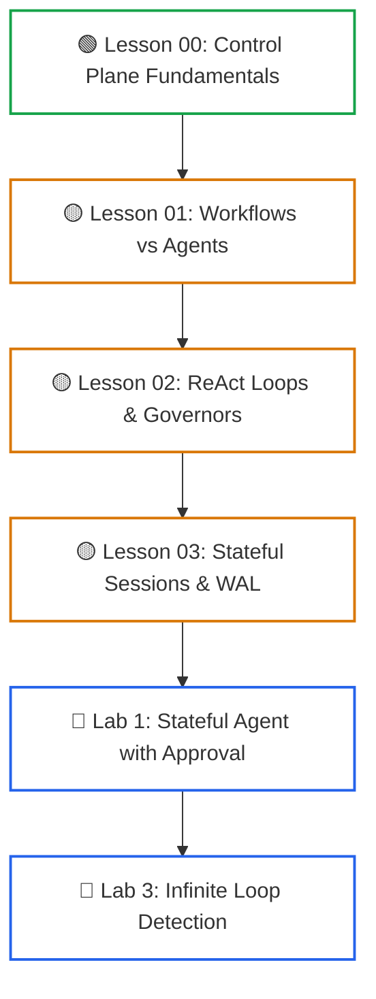
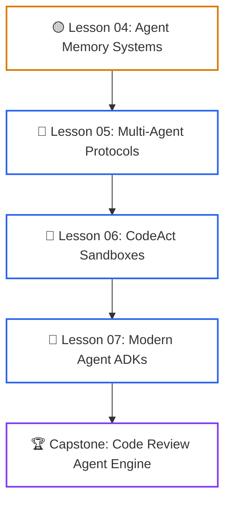
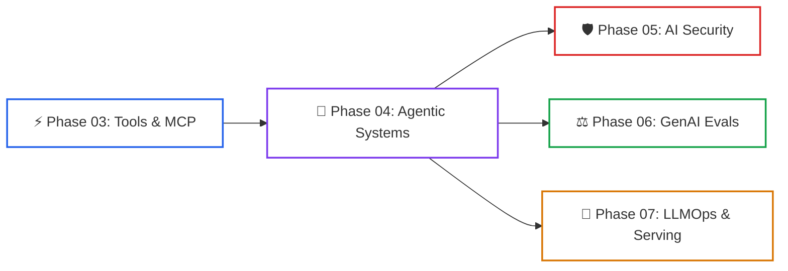

# Phase 04: Agentic Systems & Orchestration

> **A Guide to Designing, Scaling, and Operating Deterministic Workflows, Autonomous Agents, and Multi-Agent Systems.**

---

## 🎯 Phase Engineering Goal

This phase covers how to build **resilient, stateful, distributed agent loops**. 

You will transition from viewing foundation models as basic request-response endpoints to building reliable agent systems. By the end of this phase, you will understand:
1. **Control vs. Compute Planes**: Decoupling deterministic application state from non-deterministic LLM reasoning.
2. **Deterministic Workflows**: Using core workflow patterns (Prompt Chaining, Routing, Parallelization, Evaluator-Optimizer).
3. **Execution Governors**: Hardening reasoning loops with cycle detection and budget limits to prevent infinite loops.
4. **Stateful Durability**: Implementing Write-Ahead Logs (WAL), resuming from crashes, and session recovery.
5. **Agent Memory**: Organizing working context, short-term buffers, and long-term memory hierarchies.
6. **Multi-Agent Coordination**: Delegating tasks across specialized agents using A2A and MCP.
7. **Code Execution Sandboxing**: Safely running model-generated code in isolated microVMs.

---

## 🗺️ Learning Path & System Topology

Phase 04 accommodates two distinct engineering learning profiles:

### Diagram Walkthrough: Application Track (Core Flow)

1. **Lesson 00 (Control Plane)**: Establishes the separation of the deterministic host harness from the LLM compute plane.
2. **Lesson 01 (Workflows vs Agents)**: Explores deterministic DAG pipelines and static routing.
3. **Lesson 02 (ReAct & Governors)**: Implements dynamic execution loops guarded by cycle detection tripwires.
4. **Lesson 03 (Stateful Sessions)**: Adds Write-Ahead Logs (WAL) for persistent session recovery.
5. **Hands-On Practice**: Solidifies fundamentals with human-in-the-loop approvals (Lab 1) and infinite loop recovery (Lab 3).

### Diagram Walkthrough: Enterprise Platform Track (Advanced Systems)

1. **Lesson 04 (Memory Systems)**: Implements tiered memory architectures (in-context, working memory, and vector stores).
2. **Lesson 05 (Multi-Agent Systems)**: Connects specialized agents horizontally using the Linux Foundation A2A protocol.
3. **Lesson 06 (CodeAct Sandboxing)**: Replaces JSON tool ping-pong with sandboxed code execution in microVMs.
4. **Lesson 07 (Agent Platforms & ADKs)**: Evaluates production frameworks (Google ADK, LangGraph, MAF 1.0, Llama Stack).
5. **Capstone Engineering**: Unifies all concepts into a distributed code review agent engine.

### Modular Curriculum Directory

| Lesson | Title | Tier Badge | Concept |
|:---:|---|:---:|---|
| **00** | [Control Plane Fundamentals](00-agentic-systems-and-control-plane-fundamentals.md) | `🟢 Core` | Machine shop safety interlock analogy, control plane vs. compute plane separation. |
| **01** | [Workflows vs. Agents & Patterns](01-workflows-vs-agents-and-orchestration-patterns.md) | `🟡 Engineering Depth` | Chaining, routing, parallel voting, orchestrator-worker architectures. |
| **02** | [ReAct Loops & Execution Governors](02-react-loops-and-execution-governors.md) | `🟡 Engineering Depth` | The ReAct loop (Thought, Action, Observation), preventing infinite loops, error recovery. |
| **03** | [Stateful Sessions & Durable WAL](03-stateful-sessions-and-durable-wal-persistence.md) | `🟡 Engineering Depth` | Event-sourcing, Write-Ahead Logs (WAL), crash recovery, distributed sagas. |
| **04** | [Agent Memory Systems](04-agent-memory-systems-and-cognitive-architectures.md) | `🟡 Engineering Depth` | Working context, session memory, long-term semantic memory, compaction. |
| **05** | [Multi-Agent Coordination](05-multi-agent-coordination-and-a2a-protocols.md) | `🔵 Advanced` | Monolithic agent pitfalls, A2A protocol, Agent Cards, scoped handoffs. |
| **06** | [Code-as-Action & Sandboxing](06-codeact-and-sandboxed-execution-runtimes.md) | `🔵 Advanced` | Writing and executing code on the fly securely, gVisor, Firecracker microVMs. |
| **07** | [Agent Development Platforms](07-agent-development-platforms-and-adks.md) | `🔵 Advanced` | ADKs vs runtimes vs platforms: Google ADK, LangGraph, MAF 1.0, Llama Stack. |

---

## 🔗 Curriculum Dependency Graph

### Diagram Walkthrough: Phase Dependencies & Downstream Handoffs

1. **Phase 03 Ingestion**: Ingests tool execution mechanisms and JSON-RPC Model Context Protocol (MCP) clients.
2. **Phase 04 Core**: Assembles stateful workflows, autonomous ReAct loops, multi-agent protocols, and code sandboxes.
3. **Phase 05 Boundary**: Hands off agent workflows to security perimeters, prompt injection defense, and jailbreak monitors.
4. **Phase 06 Verification**: Hands off autonomous trajectories to automated evaluators and OpenTelemetry observability.
5. **Phase 07 Production**: Hands off agent runtimes to high-throughput inference serving, vLLM, and production infrastructure.

* **Required Prior Knowledge**:
  * [Phase 01: Prompt & Context Engineering](../01-prompt-and-context-engineering/README.md): Few-shot exemplars, structured JSON schemas, in-context learning.
  * [Phase 02: Enterprise Retrieval & Knowledge Systems](../02-rag-and-knowledge-systems/README.md): Embedding vector search, hybrid retrieval.
  * [Phase 03: Tools & Model Context Protocol (MCP)](../03-tools-and-model-context-protocol/README.md): JSON-RPC 2.0 tool schemas, execution boundaries.

---

## 🧭 Navigation

### Phase Progression
* **Previous Phase**: [← Phase 03: Tools & Model Context Protocol (MCP)](../03-tools-and-model-context-protocol/README.md)
* **Next Phase**: [Phase 05: AI Security & Guardrails →](../05-ai-security-and-guardrails/README.md)

### Direct Chapter & Lesson Directory
* **[Lesson 00: Agentic Systems & Control Plane Fundamentals](00-agentic-systems-and-control-plane-fundamentals.md)**
* **[Lesson 01: Workflows vs. Agents & Orchestration Patterns](01-workflows-vs-agents-and-orchestration-patterns.md)**
* **[Lesson 02: Autonomous ReAct Loops & Execution Governors](02-react-loops-and-execution-governors.md)**
* **[Lesson 03: Stateful Sessions, Durable WAL & Distributed Sagas](03-stateful-sessions-and-durable-wal-persistence.md)**
* **[Lesson 04: Agent Memory Systems & Cognitive Architectures](04-agent-memory-systems-and-cognitive-architectures.md)**
* **[Lesson 05: Multi-Agent Coordination & Protocols](05-multi-agent-coordination-and-a2a-protocols.md)**
* **[Lesson 06: Code-as-Action (CodeAct) & Execution Sandboxes](06-codeact-and-sandboxed-execution-runtimes.md)**
* **[Lesson 07: Modern Agent Development Platforms](07-agent-development-platforms-and-adks.md)**
