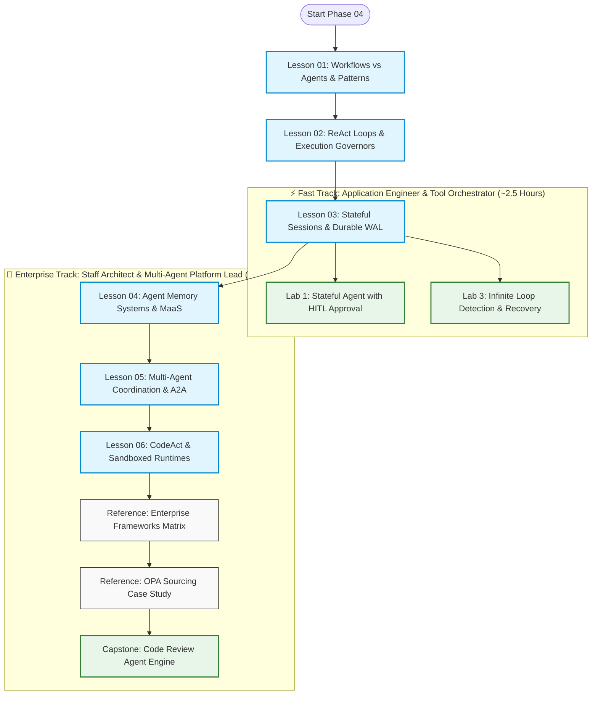
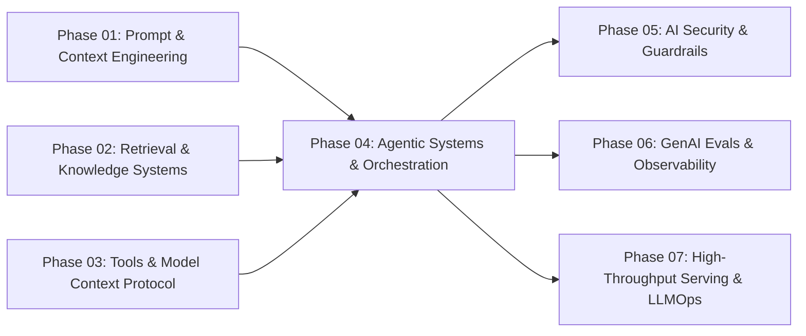

# Phase 04: Agentic Systems & Orchestration

> **An Architectural Handbook and Learning Progression for Senior Engineers, Tech Leads, and AI Architects Designing, Scaling, and Operating Deterministic Workflows, Autonomous Agents, and Enterprise Multi-Agent Systems.**

---

## 🎯 Phase Engineering Goal

This phase transforms senior software engineers and distributed systems architects into **Production AI Agent Runtimes Practitioners**. 

Learners transition from viewing foundation models as basic, stateless RPC request-response endpoints to engineering **resilient, stateful, distributed agent loops**. By the conclusion of this phase, you will have designed, implemented, and benchmarked:
1. **Deterministic Orchestration Harnesses**: Leveraging Anthropic's 5 core workflow patterns (Prompt Chaining, Routing, Parallelization/Voting, Orchestrator-Workers, Evaluator-Optimizer) to eliminate open-ended stochastic drift.
2. **Loop Engineering Governors**: Hardening ReAct cycles with cryptographic action fingerprinting (SHA-256), sliding-window cycle detection, and progressive budget decay to eliminate infinite execution deadlocks and runaway token costs.
3. **Stateful Durability & Distributed Sagas**: Implementing Event-Sourced Write-Ahead Log (WAL) checkpoints, crash rehydration across container restarts, session forking (time travel), and reverse compensating rollback sagas.
4. **4-Tier Cognitive Memory Systems**: Organizing working context, short-term session buffers, long-term vector/graph episodic memory with Ebbinghaus temporal decay, and Memory-as-a-Service (MaaS) engines.
5. **The Tri-Protocol Multi-Agent Stack**: Decoupling complex workflows across specialized agent personas using the Model Context Protocol (MCP) for tool execution, the Linux Foundation Agent-to-Agent (A2A) Protocol for inter-agent delegation, and AG-UI for user streaming.
6. **Code-as-Action (CodeAct) Sandboxing**: Isolating model-generated executable Python within Google gVisor (`runsc`) and AWS Firecracker microVMs to eliminate multi-turn JSON ping-pong.

---

## 🗺️ Learning Path & System Topology

Phase 04 accommodates two distinct engineering learning profiles:

### Prose Diagram Walkthrough: Phase Learning Pathways

1. **Foundational Core (Lessons 01–03)**: Every engineer starts by mastering the distinction between deterministic workflows and open agents (Lesson 01), armoring execution loops with cryptographic governors (Lesson 02), and implementing durable event-sourced WAL persistence with saga rollbacks (Lesson 03).
2. **⚡ Fast Track Path**: For engineers seeking immediate, practical patterns to deploy robust single-agent tools into existing microservices. Concludes after Lesson 03 with hands-on practice in **Lab 1** (Human-in-the-Loop workflows) and **Lab 3** (Loop engineering circuit breakers).
3. **🏢 Enterprise Track Path**: For technical leads and platform architects engineering distributed multi-agent systems, cross-session memory architectures, and untrusted code execution sandboxes. Progresses through Lessons 04, 05, and 06, examines the enterprise reference matrices, and culminates in the end-to-end **Capstone Code Review Engine**.

---

## 📚 Modular Curriculum Lessons (Master Navigation Table)

| # | Lesson / Module | Depth Tier | Est. Time | Core Systems Focus | Key Engineering Outcome |
|---|---|:---:|:---:|---|---|
| **01** | [Workflows vs. Agents & Orchestration Patterns](01-workflows-vs-agents-and-orchestration-patterns.md) | `🟢 Tier 1: Core` | 45 min | Control Plane vs Compute Plane; Anthropic 5 workflow patterns; compounding error drift math (P = 0.95^10 ≈ 59.9%). | Eliminates stochastic control plane illusion; builds deterministic pipelines with typed Pydantic assertion barriers. |
| **02** | [Autonomous ReAct Loops & Execution Governors](02-react-loops-and-execution-governors.md) | `🟢 Tier 1: Core` | 50 min | Thought-Action-Observation loops; Plan-and-Solve; Reflexion; SHA-256 action fingerprinting; progressive budget decay; 2:14 AM Vault Meltdown case study. | Eradicates infinite reasoning deadlocks and token burn via in-memory sliding-window cycle governors. |
| **03** | [Stateful Sessions, Durable WAL & Distributed Sagas](03-stateful-sessions-and-durable-wal-persistence.md) | `🟡 Tier 2: Depth` | 50 min | Graph state machines & reducers; Event-Sourced Write-Ahead Log (WAL); crash rehydration; reverse compensating Sagas; session forking. | Restores agent state across container crashes in 5ms; guarantees distributed transactional consistency. |
| **04** | [Agent Memory Systems & Cognitive Architectures](04-agent-memory-systems-and-cognitive-architectures.md) | `🟡 Tier 2: Depth` | 50 min | 4-Tier Memory Hierarchy (Working, Short-Term Buffer, Episodic, Semantic, Procedural); Ebbinghaus temporal decay; Letta / Mem0 MaaS; GDPR crypto-shredding. | Persists cross-session entity intelligence without context bloat; enables sub-second GDPR user erasure. |
| **05** | [Multi-Agent Coordination & The Tri-Protocol Stack](05-multi-agent-coordination-and-a2a-protocols.md) | `🔵 Tier 3: Advanced` | 55 min | Supervisor-worker, peer swarms, dynamic handoffs; Linux Foundation A2A Protocol (Agent Cards, Task FSM); The Tri-Protocol Stack (MCP + A2A + AG-UI). | Coordinates specialized agent swarms with scoped 400-token handoff DTOs, reducing token usage by 85%. |
| **06** | [Code-as-Action (CodeAct) & Execution Sandboxes](06-codeact-and-sandboxed-execution-runtimes.md) | `⚫ Tier 4: Deep Dive` | 50 min | Code-as-Action vs JSON tool ping-pong; AST security inspection; Google gVisor (`runsc`); AWS Firecracker microVMs; ephemeral in-memory compaction. | Achieves 30% fewer turns and 20% higher task success while securely isolating untrusted generated code. |
| **Ref** | [Enterprise Agent Frameworks Matrix](reference/enterprise-agent-frameworks-matrix.md) | `Reference` | 25 min | Microsoft Agent Framework (MAF 1.0 GA), LangGraph, Google ADK & `agents-cli`, PydanticAI, OpenAI Agents SDK, Meta Llama Stack. | Authoritative framework selection rubric based on infrastructure, language, and complexity requirements. |
| **Ref** | [Enterprise Sourcing & OPA Rego Case Study](reference/enterprise-sourcing-opa-case-study.md) | `Reference` | 30 min | Sourcing Triad (Intake, Compare, SourceIQ); Open Policy Agent (OPA) Rego policy compilation; typed Delegation of Authority (DOA) envelopes. | Decouples deterministic compliance and spending thresholds from stochastic model reasoning. |

---

## 🛠️ Associated Hands-On Practice Labs & Capstone

All seven hands-on practice labs are fully implemented, verified, and self-contained in the [`labs/`](labs/) directory:

| Lab Document | Technical Focus | Core Skills Practiced |
|---|---|---|
| [Lab 1: Stateful Agent with HITL Approval](labs/lab1-stateful-agent-hitl.md) | Asynchronous Interrupts & Checkpointing | Graph state serialization, persistent database checkpoints, webhook resumption, human sign-off gates. |
| [Lab 2: Multi-Agent Swarm Architecture](labs/lab2-multi-agent-swarm.md) | Dynamic Handoffs & Peer Swarms | Agent pointer mutations, scoped handoff DTOs, domain privilege partitioning. |
| [Lab 3: Infinite Loop Detection & Recovery](labs/lab3-infinite-loops.md) | Loop Engineering & Execution Governors | SHA-256 cryptographic action hashing, sliding-window ring buffer, progressive temperature and budget decay. |
| [Lab 4: Distributed Saga Pattern for Rollbacks](labs/lab4-saga-pattern.md) | Transactional Integrity & Compensations | Forward tool execution logging, reverse compensating rollback execution, clean consistency restoration. |
| [Lab 5: Agent Memory System Architecture](labs/lab5-agent-memory-system.md) | 4-Tier Memory & Temporal Decay | Working memory context assembly, short-term ring buffers, episodic vector retrieval with exponential decay. |
| [Lab 6: Multimodal Agent Tool Integration](labs/lab6-multimodal-agent.md) | Multimodal Processing & Tools | Vision-language model coordination, visual artifact inspection, multimodal tool routing. |
| [Capstone: Distributed Code Review Agent Engine](labs/capstone-code-review-engine.md) | Production Multi-Agent System | Comprehensive multi-agent code analysis pipeline with security lints, performance audits, and synthesis. |

---

## 💻 Preserved Enterprise Reference Code Implementations

Inspect working reference code located in the [`examples/`](examples/) directory:
* [`examples/react_agent.py`](examples/react_agent.py): Complete, typed Python implementation of the Thought-Action-Observation loop with native tool execution.
* [`examples/pydantic_ai_agent.py`](examples/pydantic_ai_agent.py): Production PydanticAI agent demonstrating runtime type validation and dependency injection.
* [`examples/MultiAgentPipeline.cs`](examples/MultiAgentPipeline.cs): Enterprise C# / .NET implementation of an asynchronous multi-agent coordination pipeline.

---

## 📋 Prerequisites & Cross-Phase Dependencies

* **Required Prior Knowledge**:
  * [Phase 01: Prompt & Context Engineering](../01-prompt-and-context-engineering/README.md): Few-shot exemplars, structured JSON schemas, in-context learning.
  * [Phase 02: Enterprise Retrieval & Knowledge Systems](../02-rag-and-knowledge-systems/README.md): Embedding vector search, hybrid retrieval, and knowledge indexing (foundational for Agent Memory).
  * [Phase 03: Tools & Model Context Protocol (MCP)](../03-tools-and-model-context-protocol/README.md): JSON-RPC 2.0 tool schemas, stdio/SSE transports, and tool execution boundaries.
* **Downstream Beneficiaries**:
  * [Phase 05: AI Security & Guardrails](../05-ai-security-and-guardrails/README.md): Defending agentic execution runtimes against indirect prompt injections and data exfiltration.
  * [Phase 06: GenAI Evals & Observability](../06-evals-and-observability/README.md): OpenTelemetry GenAI semantic spans, trajectory evaluation, and automated LLM-as-a-judge scoring.
  * [Phase 07: High-Throughput Serving & LLMOps](../07-production-deployment-and-llmops/README.md): Serving infrastructure, KV cache optimization, and speculative decoding for low-latency agent loops.

---

## 📚 Curated Primary Sources & Verification References

Every architectural principle in Phase 04 is grounded in peer-reviewed primary literature and formal open standards:

* **ReAct Foundations**: Yao, S., Zhao, J., Yu, D., et al. (2022). *ReAct: Synergizing Reasoning and Acting in Language Models*. [arXiv:2210.03629](https://arxiv.org/abs/2210.03629).
* **Reflexion Architecture**: Shinn, N., Cassano, F., Gopinath, A., et al. (2023). *Reflexion: Language Agents with Verbal Reinforcement Learning*. [arXiv:2303.11366](https://arxiv.org/abs/2303.11366).
* **Code-as-Action (CodeAct)**: Wang, X., Chen, Y., Yuan, L., et al. (2024). *Executable Code Actions Elicit Better LLM Agents*. [arXiv:2402.01030](https://arxiv.org/abs/2402.01030).
* **Deterministic Workflow Patterns**: Anthropic AI Engineering (2024). *Building Effective Agents: A Practical Guide to LLM Workflows and Autonomous Systems*. [Anthropic Research](https://www.anthropic.com/research/building-effective-agents).
* **Agent-to-Agent Interoperability**: Linux Foundation (2025/2026). *Agent-to-Agent (A2A) Protocol Specification & Agent Cards*. [Linux Foundation Projects](https://www.linuxfoundation.org/).
* **Microsoft Agent Ecosystem**: Microsoft Corporation (April 2026). *Microsoft Agent Framework (MAF 1.0 GA) Technical Overview*. [Microsoft Learn](https://learn.microsoft.com/).
* **OpenAI Multi-Agent Architecture**: OpenAI Engineering (2025/2026). *OpenAI Agents SDK (`openai-agents`)*. [OpenAI Documentation](https://platform.openai.com/docs).
* **OpenTelemetry Distributed Tracing**: OpenTelemetry GenAI Special Interest Group (2025/2026). *GenAI Semantic Conventions Specification*. [OpenTelemetry Docs](https://opentelemetry.io/docs/specs/semconv/gen-ai/).

---

## 🧭 Navigation

### Phase Progression
* **Previous Phase**: [← Phase 03: Tools & Model Context Protocol (MCP)](../03-tools-and-model-context-protocol/README.md)
* **Next Phase**: [Phase 05: AI Security & Guardrails →](../05-ai-security-and-guardrails/README.md)

### Direct Chapter & Lesson Directory
* **[Lesson 01: Workflows vs. Agents & Orchestration Patterns](01-workflows-vs-agents-and-orchestration-patterns.md)**
* **[Lesson 02: Autonomous ReAct Loops & Execution Governors](02-react-loops-and-execution-governors.md)**
* **[Lesson 03: Stateful Sessions, Durable WAL & Distributed Sagas](03-stateful-sessions-and-durable-wal-persistence.md)**
* **[Lesson 04: Agent Memory Systems & Cognitive Architectures](04-agent-memory-systems-and-cognitive-architectures.md)**
* **[Lesson 05: Multi-Agent Coordination & The Tri-Protocol Stack](05-multi-agent-coordination-and-a2a-protocols.md)**
* **[Lesson 06: Code-as-Action (CodeAct) & Execution Sandboxes](06-codeact-and-sandboxed-execution-runtimes.md)**
* **[Reference Appendix: Enterprise Agent Frameworks Matrix](reference/enterprise-agent-frameworks-matrix.md)**
* **[Reference Appendix: Enterprise Sourcing & OPA Rego Case Study](reference/enterprise-sourcing-opa-case-study.md)**
* **[Capstone Challenge: Distributed Code Review Agent Engine](labs/capstone-code-review-engine.md)**
