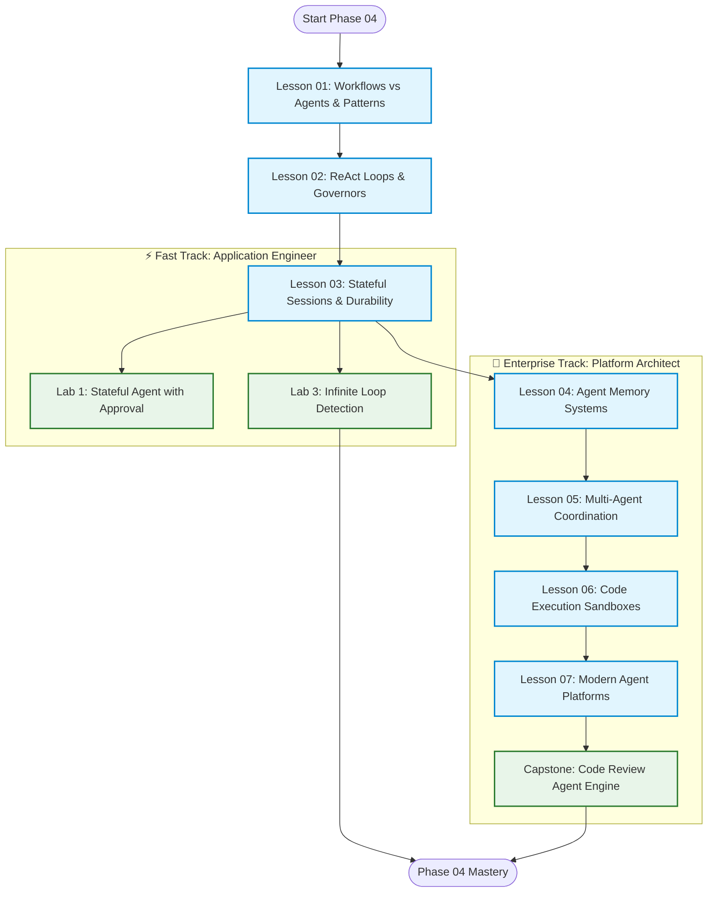
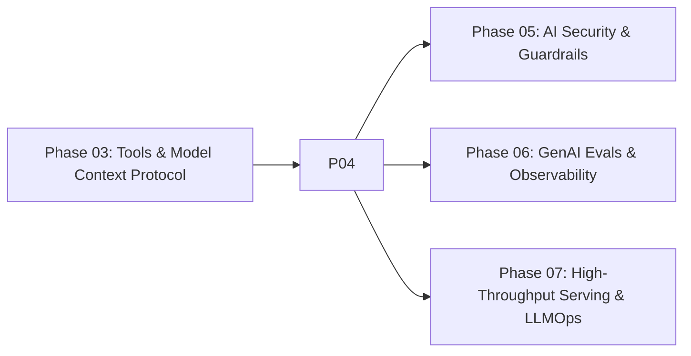

# Phase 04: Agentic Systems & Orchestration

> **A Guide to Designing, Scaling, and Operating Deterministic Workflows, Autonomous Agents, and Multi-Agent Systems.**

---

## 🎯 Phase Engineering Goal

This phase covers how to build **resilient, stateful, distributed agent loops**. 

You will transition from viewing foundation models as basic request-response endpoints to building reliable agent systems. By the end of this phase, you will understand:
1. **Deterministic Workflows**: Using core workflow patterns (Prompt Chaining, Routing, Parallelization, Evaluator-Optimizer) to build reliable systems.
2. **Execution Governors**: Hardening reasoning loops with cycle detection and budget limits to prevent infinite loops and runaway costs.
3. **Stateful Durability**: Implementing Write-Ahead Logs (WAL), resuming from crashes, and session recovery.
4. **Agent Memory**: Organizing working context, short-term buffers, and long-term memory.
5. **Multi-Agent Coordination**: Delegating tasks between specialized agents.
6. **Code Execution Sandboxing**: Safely running model-generated code in isolated environments.

---

## 🗺️ Learning Path & System Topology

Phase 04 accommodates two distinct engineering learning profiles:

### Modular Curriculum Directory

| Lesson | Title | Tier Badge | Concept |
|:---:|---|:---:|---|
| **01** | [Workflows vs. Agents & Patterns](01-workflows-vs-agents-and-orchestration-patterns.md) | `HIGH ROI / CORE` | Chaining, routing, parallel voting, orchestrator-worker architectures. |
| **02** | [ReAct Loops & Execution Governors](02-react-loops-and-execution-governors.md) | `HIGH ROI / CORE` | The ReAct loop (Thought, Action, Observation), preventing infinite loops, error recovery. |
| **03** | [Stateful Sessions & Durable WAL](03-stateful-sessions-and-durable-wal-persistence.md) | `IMPORTANT / NEXT` | Event-sourcing, Write-Ahead Logs (WAL), crash recovery. |
| **04** | [Agent Memory Systems](04-agent-memory-systems-and-cognitive-architectures.md) | `IMPORTANT / NEXT` | Working context, session memory, long-term semantic memory. |
| **05** | [Multi-Agent Coordination](05-multi-agent-coordination-and-a2a-protocols.md) | `ADVANCED / SPECIALIZED` | Handoff mechanisms, agent-to-agent delegation, multi-agent frameworks. |
| **06** | [Code-as-Action & Sandboxing](06-codeact-and-sandboxed-execution-runtimes.md) | `ADVANCED / SPECIALIZED` | Writing and executing code on the fly securely, microVMs. |
| **07** | [Agent Development Platforms](07-agent-development-platforms-and-adks.md) | `REFERENCE / AWARENESS` | Overview of tools like LangGraph, Semantic Kernel, and modern Agent SDKs. |

---

## 🔗 Curriculum Dependency Graph

* **Required Prior Knowledge**:
  * [Phase 01: Prompt & Context Engineering](../01-prompt-and-context-engineering/README.md): Few-shot exemplars, structured JSON schemas, in-context learning.
  * [Phase 02: Enterprise Retrieval & Knowledge Systems](../02-rag-and-knowledge-systems/README.md): Embedding vector search, hybrid retrieval.
  * [Phase 03: Tools & Model Context Protocol (MCP)](../03-tools-and-model-context-protocol/README.md): JSON-RPC 2.0 tool schemas, execution boundaries.

---

## 🧭 Navigation

### Phase Progression
* **Previous Phase**: [← Phase 03: Tools & Model Context Protocol (MCP)](../03-tools-and-model-context-protocol/README.md)
* **Next Phase**: [Phase 05: AI Security & Guardrails →](../05-ai-security-and-guardrails/README.md)

### Direct Chapter & Lesson Directory
* **[Lesson 01: Workflows vs. Agents & Orchestration Patterns](01-workflows-vs-agents-and-orchestration-patterns.md)**
* **[Lesson 02: Autonomous ReAct Loops & Execution Governors](02-react-loops-and-execution-governors.md)**
* **[Lesson 03: Stateful Sessions, Durable WAL & Distributed Sagas](03-stateful-sessions-and-durable-wal-persistence.md)**
* **[Lesson 04: Agent Memory Systems & Cognitive Architectures](04-agent-memory-systems-and-cognitive-architectures.md)**
* **[Lesson 05: Multi-Agent Coordination & Protocols](05-multi-agent-coordination-and-a2a-protocols.md)**
* **[Lesson 06: Code-as-Action (CodeAct) & Execution Sandboxes](06-codeact-and-sandboxed-execution-runtimes.md)**
* **[Lesson 07: Modern Agent Development Platforms](07-agent-development-platforms-and-adks.md)**
