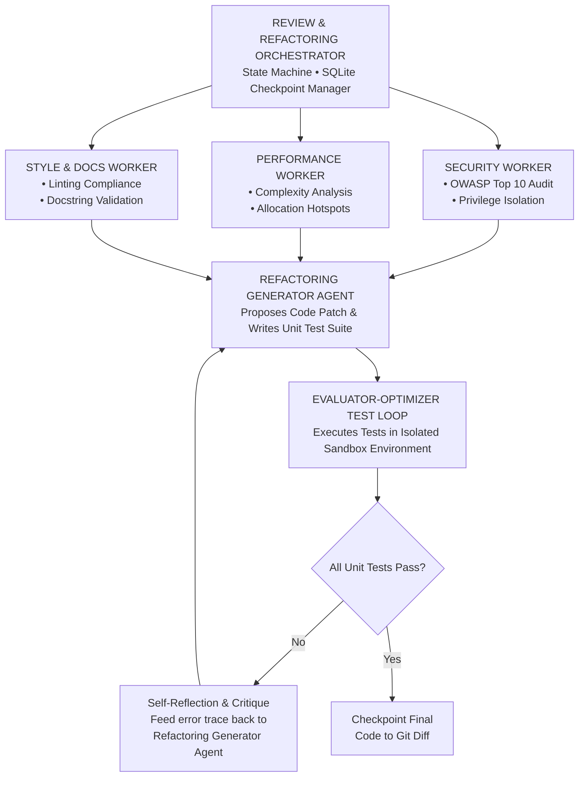

## 10. Capstone Engineering Challenge [MUST-HAVE] 🔴

### The Multi-Turn Code Review & Refactoring Engine [MUST-HAVE] 🔴

#### Objective
Architect and implement an end-to-end, production-grade **Autonomous Code Review and Self-Healing Refactoring System** that reviews a target codebase, identifies vulnerabilities and architectural anti-patterns, generates a proposed code fix, generates automated unit tests, and verifies that the patch passes in an isolated runtime sandbox before finalizing changes.

#### Architectural Specification
1. **Orchestrator-Worker Architecture**:
   * The system must feature a central **Review Orchestrator** coordinating three specialized worker agents in parallel:
     * **Security Specialist**: Audits input code against OWASP Top 10 vulnerabilities (SQLi, SSRF, Hardcoded Secrets).
     * **Performance Specialist**: Flags algorithmic bottlenecks (O(N^2) loops, memory leaks, unclosed connections).
     * **Style & Documentation Specialist**: Flags PEP 8 / Clean Code naming violations and missing type hints.
2. **Persistent SQLite State Checkpointing**:
   * Every super-step of the orchestration pipeline must serialize and checkpoint its complete graph state to an SQLite database.
   * If the process is forcefully killed mid-execution, re-running the command with `--session-id <id>` must resume execution from the exact last successful node transition.
3. **Evaluator-Optimizer Self-Healing Loop**:
   * The **Refactoring Generator** ingests the consolidated worker review findings and generates:
     1. A unified patch file (`diff.patch`).
     2. A corresponding unit test suite (`test_patch.py`).
   * The **Evaluator Agent** executes the generated unit tests in a sandboxed subprocess.
   * If tests fail or raise compilation errors, the Evaluator intercepts the stderr output, generates a structured verbal critique, and returns control to the Refactoring Generator.
   * The generator refines the patch iteratively until all tests pass or a maximum iteration ceiling (K = 3) is reached.
4. **Human-in-the-Loop Interrupt Gate**:
   * Before committing the final patch to the codebase or disk, the agent must suspend execution, output a complete summary diff, and await explicit operator approval (`APPROVE` / `REJECT`).

#### Verification Rubric & Acceptance Criteria

| Milestone | Deliverable | Verification Standard |
|---|---|---|
| **M1: Orchestration & Parallel Workers** | Orchestrator and 3 parallel analyzer workers implemented. | Concurrently analyzes a 200-line sample script; executes in < 4s using asyncio or Task parallelism; emits typed JSON schemas. |
| **M2: SQLite Checkpointing & Resumption** | Durable State Checkpoint engine. | Killing the process mid-turn and restarting with the same session ID restores state without re-running completed worker passes. |
| **M3: Evaluator-Optimizer Test Loop** | Sandboxed test execution and iterative self-repair. | Intentionally injects a broken patch on turn 1; agent successfully captures the test failure trace, reflects on the error, and emits a passing patch on turn 2. |
| **M4: Human-in-the-Loop Safety Gate** | Interactive approval CLI or webhook. | System halts cleanly before disk write; rejecting the patch safely aborts without leaving dirty git states or corrupted files. |

---

[Return to Module 04: Agentic Systems & Orchestration](../README.md#10-capstone-engineering-challenge-must-have-)

