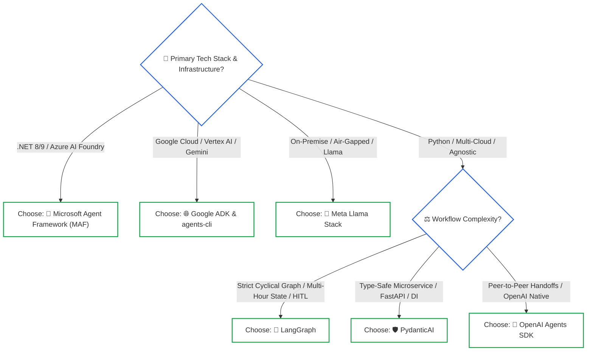

# Enterprise Agent Frameworks: Architectural Comparison Matrix & Selection Rubric

> **Phase 04 Reference Architecture** | Target Audience: Solutions Architects & Engineering Leads | Updated: 2026 Standard
>
> **Related Lessons**: [Lesson 01: Workflows vs. Autonomous Agents](../01-workflows-vs-agents-and-orchestration-patterns.md), [Lesson 03: Stateful Sessions & Durable WAL](../03-stateful-sessions-and-durable-wal-persistence.md), [Lesson 05: Multi-Agent Coordination](../05-multi-agent-coordination-and-a2a-protocols.md)

---

## 1. Executive Overview

Selecting an agent orchestration framework is one of the most critical long-term architectural decisions an engineering team makes. Frameworks dictate how your system manages state serialization, enforces type boundaries, executes tool sandboxing, integrates human approvals, and exports distributed telemetry.

In 2025 and 2026, the ecosystem underwent massive consolidation:
* **Microsoft Agent Framework (MAF 1.0 GA)** officially converged **Semantic Kernel** (enterprise typing and dependency injection) with **AutoGen** (asynchronous actor-based multi-agent swarms).
* **OpenAI** released the official **OpenAI Agents SDK (`openai-agents`)**, productionizing dynamic multi-agent handoffs.
* **Meta** established the **Llama Stack**, standardizing agent tool engines, memory layers, and safety guardrails across open-source models.
* **Google** formalized **Google ADK** with the `agents-cli` lifecycle toolchain and native Model Context Protocol (MCP) support.

This reference provides an objective architectural evaluation of the dominant frameworks and an enterprise selection rubric.

---

## 2. Comprehensive Framework Architectural Comparison Matrix

| Framework | Primary Language(s) | Architectural Paradigm | Key Advantages (Pros) | Production Limitations (Cons) | State & HITL Support | Distributed Telemetry | Best Enterprise Fit |
|---|---|---|---|---|---|---|---|
| **Microsoft Agent Framework (MAF 1.0 GA)** | C# (.NET 8/9), Python | Unified Kernel Plugins & Asynchronous Actor Mesh | • Converges Semantic Kernel's strong enterprise typing with AutoGen's actor mesh • Deep integration with Azure AI Foundry and enterprise IAM • Direct C#/.NET enterprise support | • Python parity occasionally trails .NET core releases • Steeper learning curve for actor models | **Maximum**: Native event-bus checkpointing, approval gates, and state isolation | Native .NET `ActivitySource`, Azure Application Insights, OpenTelemetry | Enterprise .NET backends, Microsoft Azure ecosystems, corporate IT infrastructures |
| **LangGraph** | Python, TypeScript | Cyclical StateGraph (Nodes, Edges, Reducers) | • Native cyclical reasoning loops • Durable checkpointing (`PostgresSaver`, Redis) • First-class time-travel debugging and session forking | • Explicit state reducer boilerplate • Coupled to LangChain message conventions • Steeper learning curve | **Maximum**: Native `interrupt_before` and `interrupt_after` hooks with full resume capability | Native LangSmith integration; OpenTelemetry trace spans | Complex cyclical agents, long-running stateful workflows, fault-tolerant apps |
| **PydanticAI** | Python | Model-agnostic typed agents with Dependency Injection | • Ergonomic FastAPI-like design • 100% type-safe tool signatures and structured validation • Built-in dependency injection for testing & mocking | • Newer ecosystem with fewer legacy community connectors • Less suited for complex multi-agent swarms | **High**: Dynamic retry loops, typed state schemas, and model-agnostic execution | Native Logfire and OpenTelemetry instrumentation | Type-safe backend microservices, financial data extraction, FastAPI services |
| **OpenAI Agents SDK (`openai-agents`)** | Python | Official multi-agent handoffs & isolated sandboxes | • Official production successor to Swarm • Clean agent handoffs without supervisor overhead • Turnkey code execution sandboxes and guardrails | • Optimized primarily for the OpenAI ecosystem | **High**: Native session contexts, approval gates, and state isolation | Native OpenAI platform telemetry & OpenTelemetry export | Enterprise OpenAI-native applications, multi-agent support meshes, voice agents |
| **Google Agent Development Kit (ADK)** | Python, TypeScript | Code-first components with native MCP | • Ultra-clean code-first design without heavy wrapper classes • Native Model Context Protocol (MCP) server support • Full `agents-cli` suite (scaffold, eval, deploy) | • Primary optimization focused on Google Cloud and Gemini models • Newer ecosystem with evolving features | **High**: Async approval hooks, session contexts with Vertex/Datastore backends | Google Cloud Trace, Vertex AI Telemetry, OpenTelemetry | Enterprise Google Cloud architectures, Gemini-native tool ecosystems |
| **Meta Llama Stack** | Python | Standardized agent tool engines & safety firewalls | • Provider-agnostic open-source standard for Llama models • Native integration with Llama Guard 3 security boundaries • Standardized memory and tool execution APIs | • Requires managing host inference infrastructure (vLLM, Ollama, or cloud endpoint) | **High**: Structured session management and durable state storage | OpenTelemetry semantic spans and custom collector exports | On-premise air-gapped deployments, open-weight model architectures |
| **Native Custom Code (Raw SDKs)** | Any (Python, Go, Rust, C#, TS) | Minimalist while loops & explicit async queues | • Zero dependency overhead • 100% predictable execution traces and stack traces • Optimal token efficiency and maximum performance | • All checkpointing, retry logic, and state schemas must be written from scratch • Slower initial scaffolding | **Custom**: Implemented via custom database tables, Redis locks, and state machines | Full control via standard APMs and OpenTelemetry SDKs | Mission-critical low-latency systems, high-volume transactional microservices |

---

## 3. Deep-Dive Framework Profiles

### 3.1 Microsoft Agent Framework (MAF 1.0 GA)
MAF represents the synthesis of Microsoft's two previously competing agent initiatives: Semantic Kernel and AutoGen.
* **The Core Architecture**: MAF organizes execution into an **Asynchronous Actor Mesh**. Each agent is an independent actor that processes incoming messages sequentially from an internal mailbox.
* **Plugin Architecture**: Tools are packaged as strongly typed plugins using native C# attributes (`[KernelFunction]`) or Python decorators, supporting enterprise dependency injection out-of-the-box.
* **Enterprise Fit**: If your organization runs on Microsoft Azure, C#/.NET microservices, and uses Azure OpenAI Service, MAF is the premier choice.

### 3.2 LangGraph (Cyclical Graph Architecture)
Created by the LangChain team to overcome the limitations of linear prompt chains, LangGraph models agent execution as a stateful, cyclical graph.
* **The StateGraph**: Developers define state as a typed dictionary or Pydantic model. Nodes are pure functions that compute updates, and edges route between nodes conditionally.
* **Durable Persistence**: LangGraph's checkpointer automatically commits state to SQLite, PostgreSQL, or Redis after every node transition, enabling seamless Human-in-the-Loop pauses and instant crash recovery.
* **Enterprise Fit**: The industry standard for complex, long-running agent workflows requiring custom state machines, session forking, and fault-tolerant persistence in Python and TypeScript.

### 3.3 PydanticAI
Developed by the creators of Pydantic, PydanticAI brings FastAPI-style developer ergonomics to agentic programming.
* **Type-Safe Invariants**: Tool parameters, system prompts, and model responses are validated against Pydantic v2 schemas at runtime.
* **Dependency Injection**: Agents declare dependencies (database connection pools, API clients, authentication contexts) that are dynamically injected into tools during execution, making unit testing and mocking trivial.
* **Enterprise Fit**: High-throughput web APIs, financial transaction processors, and microservices where runtime type safety and clean architecture are paramount.

### 3.4 OpenAI Agents SDK (`openai-agents`)
The production evolution of OpenAI's experimental Swarm project.
* **Dynamic Handoffs**: Models transfer control directly to peer agents by calling handoff functions, updating the runtime pointer without central supervisor overhead.
* **Production Guardrails**: Built-in input/output guardrails that intercept prompt injections and enforce content safety policies before and after model invocations.
* **Enterprise Fit**: Consumer-facing support agents, real-time voice agents, and applications deployed natively on OpenAI infrastructure.

---

## 4. Architectural Selection Decision Tree

Use this decision logic when evaluating frameworks for enterprise initiatives:

### Prose Diagram Walkthrough: Framework Selection Tree

1. **Infrastructure Alignment**: If your enterprise is standardized on Microsoft Azure and C#/.NET, choose **Microsoft Agent Framework (MAF)** to leverage native dependency injection and Azure IAM. If standardized on Google Cloud and Gemini, select **Google ADK**. For on-premise air-gapped deployments using open-weight models, deploy the **Meta Llama Stack**.
2. **Workflow Complexity (Python/Multi-Cloud)**:
   * For complex, cyclical multi-turn state machines requiring durable database checkpointing and time-travel debugging, select **LangGraph**.
   * For typed backend microservices, data extraction pipelines, and FastAPI integrations requiring dependency injection and high performance, select **PydanticAI**.
   * For interactive multi-agent support swarms using dynamic peer handoffs, select the **OpenAI Agents SDK**.

---

## 🧭 Navigation

| [← Lesson 07: Modern Agent Platforms & ADKs](../07-agent-development-platforms-and-adks.md) | [Phase 04 Navigation Hub](../README.md) | [Reference: OPA Sourcing Case Study →](enterprise-sourcing-opa-case-study.md) |
|:---:|:---:|:---:|
| **Previous Lesson** | **Phase Hub** | **Next Reference** |
