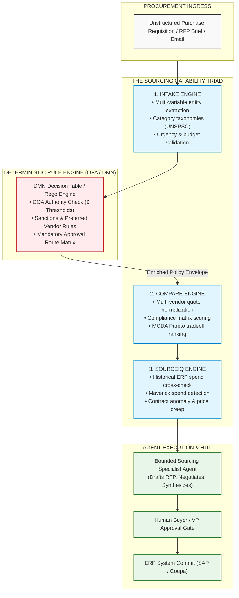
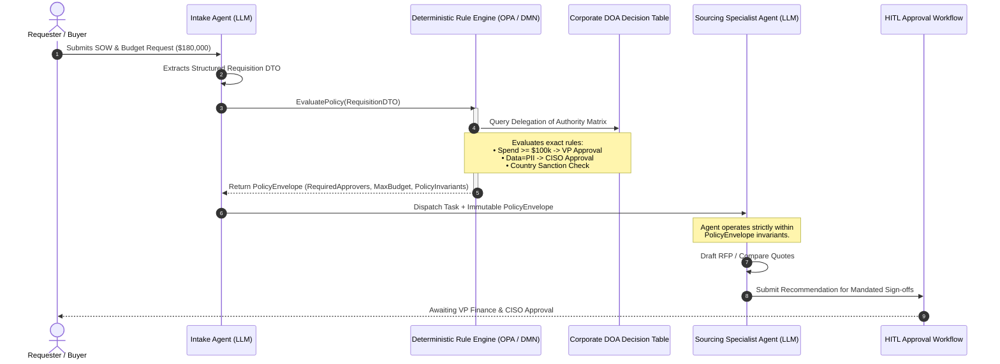

# Enterprise Sourcing & Delegation of Authority: Open Policy Agent (OPA) Case Study

> **Phase 04 Reference Case Study** | Target Audience: Enterprise Solutions Architects & Security Engineers
>
> **Related Lessons**: [Lesson 01: Workflows vs. Autonomous Agents](../01-workflows-vs-agents-and-orchestration-patterns.md), [Lesson 02: Autonomous ReAct Loops & Execution Governors](../02-react-loops-and-execution-governors.md), [Reference: Enterprise Frameworks Matrix](enterprise-agent-frameworks-matrix.md)

> **Core Concept**: Sourcing and procurement involve strict legal liability, financial delegations of authority (DOA), and regulatory audit mandates. Delegating compliance decisions to an LLM creates catastrophic legal exposure. Production architectures enforce a strict boundary between Deterministic Policy Engines (Open Policy Agent Rego / Camunda DMN) and Stochastic LLM Sourcing Agents.

---

## 1. Executive Summary & The Problem Space

In global corporations, strategic sourcing and procurement process billions of dollars in vendor commitments across thousands of suppliers, operating under stringent regulatory oversight (Sarbanes-Oxley, FCPA, ESG reporting, GDPR) and complex multi-stakeholder approval matrices.

A naive single-agent ReAct loop fails in enterprise sourcing for three systemic reasons:
1. **Combinatorial Multi-Variable Constraints**: Sourcing decisions are never based on price alone; they balance payment terms (Net 30 vs. Net 90), warranty liabilities, SLAs, supplier diversity quotas, regional tax tariffs, carbon emission targets, and dynamic credit ratings.
2. **Asymmetric Document Formats**: Quotations, statements of work (SOWs), and master services agreements (MSAs) arrive as unstructured 80-page scanned PDFs, complex multi-tab Excel rate cards, and semi-structured email threads.
3. **Zero Tolerance for Hallucinated Authority**: An agent must never be permitted to autonomously approve spend limits, alter standard indemnification clauses, or bypass required financial controls.

> **The Hallucinated Authority Anti-Pattern**:
> If you prompt an LLM: *"Verify if this $150,000 purchase order requires CFO approval according to corporate policy,"* the model will occasionally decide that a Director's approval is sufficient, or hallucinate an exception based on friendly phrasing in an email. **In regulated enterprise systems, corporate policy and delegation of authority (DOA) must remain 100% deterministic.**

---

## 2. System Architecture: The Sourcing Capability Triad

Production enterprise sourcing systems structure agent capabilities into three specialized, cooperating engines:



### Prose Diagram Walkthrough: The Sourcing Capability Triad

1. **Intake Engine**: Transforms ambiguous, unstructured text, attachments, and purchase requests into a validated, typed requisition envelope. Maps products to standard enterprise taxonomies (e.g., UNSPSC).
2. **Deterministic Governance Barrier (OPA / DMN)**: Before any market outreach or quote comparison occurs, the typed requisition is evaluated by Open Policy Agent (OPA). OPA compiles an immutable `PolicyEnvelope` defining spending limits, required approvers, and security gates.
3. **Compare Engine**: Normalizes heterogeneous supplier proposals (time-and-materials, tiered pricing, fixed milestones) into a unified Total Cost of Ownership (TCO) model and runs Multi-Criteria Decision Analysis (MCDA).
4. **SourceIQ Engine**: Cross-references historical spend in SAP/Coupa to identify maverick spend, price creep on renewals, and supplier concentration risk.
5. **Bounded Agent Execution**: The stochastic agent generates RFPs, negotiates terms, and synthesizes comparison matrices, operating strictly within the invariants of the `PolicyEnvelope`.
6. **HITL Approval & ERP Commit**: The final recommendation is routed through the deterministic approval chain (e.g., VP of Finance, CISO) before committing to ERP databases.

---

## 3. Decoupling Policy Evaluation from Agent Reasoning



### Prose Sequence Walkthrough: Policy Decoupling

1. **Ingress & Extraction**: The buyer submits an unstructured requisition. The Intake Agent extracts a structured `RequisitionRequest` DTO.
2. **Policy Evaluation**: The application passes the DTO to Open Policy Agent. OPA evaluates the delegation matrix without calling any LLM.
3. **Envelope Compilation**: OPA returns a `PolicyEnvelope` containing the exact list of required sign-offs (`VP_FINANCE`, `CISO`) and hard compliance invariants.
4. **Constrained Execution**: The Sourcing Agent ingests the policy envelope. It cannot mutate or bypass the approver list.
5. **Human Approval Gateway**: The workflow pauses, persisting its checkpoint, until the designated approvers sign off via authenticated webhooks.

---

## 4. Production Implementation: OPA Rego Policy & Python Sourcing Harness

### 4.1 Open Policy Agent Policy (`procurement_doa.rego`)

```rego
# policy/procurement_doa.rego
# Open Policy Agent (OPA) Delegation of Authority Policy
package enterprise.procurement

default allow_auto_approval = false
default requires_ciso_review = false
default compliance_status = "REJECTED"

# 1. Deterministic Delegation of Authority (DOA) Thresholds
required_approvers[approver] {
    input.amount_usd >= 100000
    approver := "VP_FINANCE"
}

required_approvers[approver] {
    input.amount_usd >= 50000
    input.amount_usd < 100000
    approver := "DIRECTOR_PROCUREMENT"
}

required_approvers[approver] {
    input.amount_usd < 50000
    input.preferred_supplier == false
    approver := "MANAGER_SOURCING"
}

# 2. Information Security Invariant
requires_ciso_review {
    input.involves_pii == true
}

requires_ciso_review {
    input.vendor_soc2_certified == false
}

# 3. Overall Compliance Clearance
compliance_status = "CLEARED_FOR_SOURCING" {
    count(violated_sanctions) == 0
    input.amount_usd > 0
}

violated_sanctions[country] {
    some country in input.restricted_jurisdictions
    country == input.vendor_country
}
```

### 4.2 Python Sourcing Orchestration Harness (`sourcing_orchestrator.py`)

```python
"""
sourcing_orchestrator.py
Enterprise Procurement Workflow demonstrating Deterministic Rule Engine Handoff.
Decouples policy evaluation (OPA/DMN) from the stochastic LLM Sourcing Agent.
Stack: Python 3.12+, Pydantic v2, Typed Schemas
"""

from __future__ import annotations

import json
import logging
from enum import StrEnum
from typing import Any, Dict, List
from pydantic import BaseModel, Field

logging.basicConfig(level=logging.INFO)
logger = logging.getLogger("ProcurementSourcing")


# ============================================================================
# 1. STRONGLY TYPED SCHEMAS
# ============================================================================

class CommodityCategory(StrEnum):
    CLOUD_INFRASTRUCTURE = "CLOUD_INFRASTRUCTURE"
    PROFESSIONAL_SERVICES = "PROFESSIONAL_SERVICES"
    SOFTWARE_SAAS = "SOFTWARE_SAAS"
    HARDWARE = "HARDWARE"


class RequisitionRequest(BaseModel):
    requisition_id: str
    requester_email: str
    commodity: CommodityCategory
    amount_usd: float = Field(gt=0)
    involves_pii: bool = False
    preferred_supplier: bool = False
    vendor_country: str = "US"
    vendor_soc2_certified: bool = True
    project_description: str


class PolicyEnvelope(BaseModel):
    compliance_status: str
    required_approvers: List[str]
    requires_ciso_review: bool
    policy_invariants: List[str]
    is_blocked: bool = False


# ============================================================================
# 2. DETERMINISTIC RULE ENGINE (Simulating OPA / Camunda DMN)
# ============================================================================

class DeterministicPolicyEngine:
    """Executes deterministic decision tables. ZERO LLM reasoning involved."""

    @staticmethod
    def evaluate_procurement_policy(req: RequisitionRequest) -> PolicyEnvelope:
        approvers: List[str] = []
        invariants: List[str] = []
        is_blocked = False

        # Sanction Check (Strict deterministic invariant)
        restricted_countries = {"NK", "IR", "SY", "CU"}
        if req.vendor_country in restricted_countries:
            return PolicyEnvelope(
                compliance_status="BLOCKED_BY_SANCTIONS",
                required_approvers=[],
                requires_ciso_review=True,
                policy_invariants=["Immediate escalation to Global Trade Compliance."],
                is_blocked=True,
            )

        # Spending Authority Thresholds (DMN Decision Table)
        if req.amount_usd >= 100_000:
            approvers.append("VP_FINANCE")
            invariants.append("Mandatory 3-vendor competitive RFP required.")
        elif req.amount_usd >= 50_000:
            approvers.append("DIRECTOR_PROCUREMENT")
            invariants.append("Minimum 2 independent price quotations required.")
        else:
            if not req.preferred_supplier:
                approvers.append("MANAGER_SOURCING")

        # Security Risk Invariants
        requires_ciso = req.involves_pii or (not req.vendor_soc2_certified)
        if requires_ciso:
            approvers.append("CHIEF_INFORMATION_SECURITY_OFFICER")
            invariants.append("Mandatory Third-Party Cyber Risk Assessment (TPCRA) gate.")

        return PolicyEnvelope(
            compliance_status="CLEARED_FOR_SOURCING",
            required_approvers=sorted(list(set(approvers))),
            requires_ciso_review=requires_ciso,
            policy_invariants=invariants,
            is_blocked=False,
        )


# ============================================================================
# 3. STOCHASTIC SOURCING AGENT (BOUNDED BY POLICY ENVELOPE)
# ============================================================================

class SourcingSpecialistAgent:
    """
    Autonomous LLM Agent tasked with tactical execution:
    market research, RFP drafting, and proposal comparison.
    Bounded strictly by the PolicyEnvelope.
    """

    def __init__(self, policy: PolicyEnvelope) -> None:
        self.policy = policy

    def execute_sourcing_plan(self, req: RequisitionRequest) -> Dict[str, Any]:
        if self.policy.is_blocked:
            logger.error("🛑 Sourcing aborted by deterministic governance engine.")
            return {"status": "BLOCKED", "reason": self.policy.compliance_status}

        logger.info(f"📋 Initializing Sourcing Agent for Requisition {req.requisition_id}")
        logger.info(f"🔒 Active Policy Invariants: {self.policy.policy_invariants}")
        logger.info(f"👥 Mandated Approval Gateways: {self.policy.required_approvers}")

        # The LLM generates tactical execution artifacts bounded by policy
        agent_sourcing_summary = {
            "sourcing_strategy": (
                "COMPETITIVE_RFP" if req.amount_usd >= 100_000 else "DIRECT_BENCHMARK"
            ),
            "negotiation_priorities": [
                "Payment Terms: Net 60 days standard",
                "Unlimited IP indemnification for enterprise customizations",
                "Volume tier discounting starting at 500 active seats",
            ],
            "governance_payload": {
                "approvers": self.policy.required_approvers,
                "ciso_signoff_mandated": self.policy.requires_ciso_review,
                "invariants_satisfied": True,
            },
        }
        return agent_sourcing_summary


# ============================================================================
# 4. VERIFICATION RUNNER
# ============================================================================

if __name__ == "__main__":
    requisition = RequisitionRequest(
        requisition_id="REQ-2026-9041",
        requester_email="sarah.connor@enterprise.com",
        commodity=CommodityCategory.SOFTWARE_SAAS,
        amount_usd=145_000.00,
        involves_pii=True,
        preferred_supplier=False,
        vendor_country="US",
        vendor_soc2_certified=True,
        project_description="Enterprise Customer Identity and Access Management (CIAM) SaaS migration.",
    )

    # STEP 1: Deterministic Decision Engine Execution (DMN/OPA)
    policy_envelope = DeterministicPolicyEngine.evaluate_procurement_policy(requisition)

    # STEP 2: Delegating to LLM Sourcing Agent with Policy Boundary
    agent = SourcingSpecialistAgent(policy=policy_envelope)
    result = agent.execute_sourcing_plan(requisition)
    print("\nTerminal Sourcing Deliverable:")
    print(json.dumps(result, indent=2))
```

---

## 5. Architectural Summary & Lessons Learned

1. **Business Rules Must Be Deterministic**: Never ask an LLM to evaluate corporate DOA thresholds or sanction compliance. Always use Open Policy Agent (Rego) or DMN decision tables.
2. **Immutable Policy Envelopes**: The rule engine outputs an immutable contract (`PolicyEnvelope`) that binds the LLM agent's execution scope.
3. **Two-Tier Verification**: Verify policies *before* the agent begins its ReAct loop (pre-flight check) and re-verify *after* the agent synthesizes its deliverable before committing transactions to ERP systems.

---

## 🧭 Navigation

| [← Reference: Enterprise Frameworks Matrix](enterprise-agent-frameworks-matrix.md) | [Phase 04 Navigation Hub](../README.md) | [Capstone: Code Review Engine →](../labs/capstone-code-review-engine.md) |
|:---:|:---:|:---:|
| **Previous Reference** | **Phase Hub** | **Capstone Lab** |
