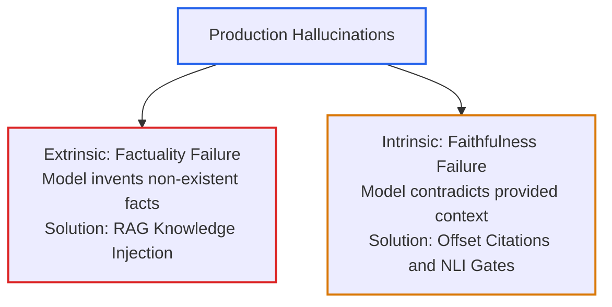
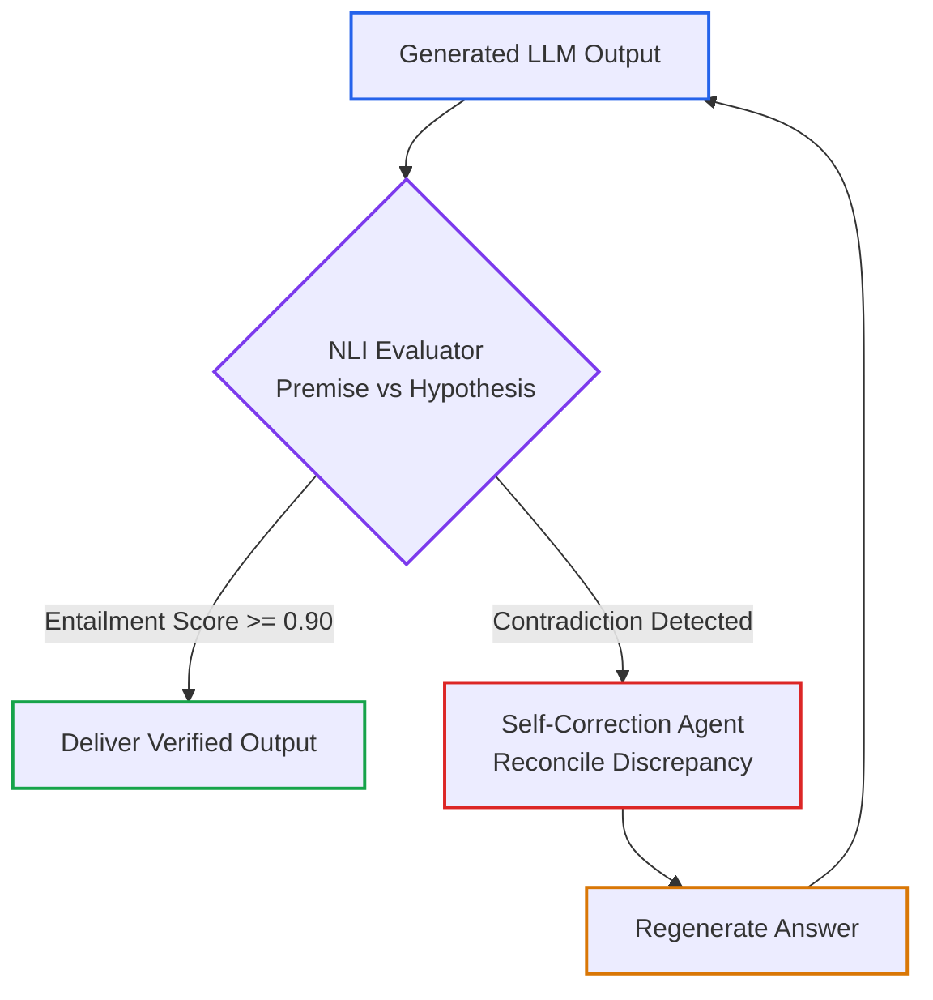
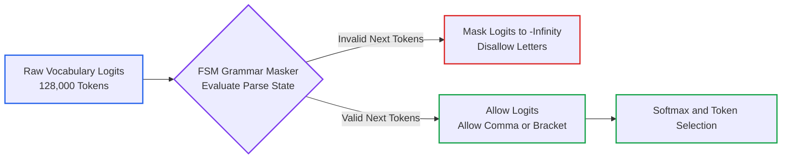

# Lesson 03: Hallucination Mitigation: Token Offsets, NLI Entailment & Constrained Decoding

> **Tier**: `🟡 Engineering Depth` | **Read time**: ~16 min | **Prerequisites**: [Lesson 01: AI Threat Modeling & OWASP Top 10](./01-threat-modeling-and-owasp-top-10.md), [Structured Outputs & Schema Engineering](../../01-prompt-and-context-engineering/03-structured-outputs-and-schema-engineering.md), [Chunking & Indexing Strategies](../../02-rag-and-knowledge-systems/02-chunking-and-indexing-strategies.md)  
> **Core Concept**: Hallucinations in production AI systems are not random creative quirks; they are verifiable failures of faithfulness or factuality. Mitigating hallucinations requires deterministic character-offset citations, Natural Language Inference (NLI) verification loops, and schema-constrained decoding.  
> **New AI terms introduced**: hallucination, intrinsic hallucination, extrinsic hallucination, natural language inference (NLI), cross-encoder, constrained decoding  
> **AI terms assumed from earlier lessons**: [token](../../00-foundations-and-token-mechanics/01-tokenization-and-bpe-mechanics.md), [context window](../../01-prompt-and-context-engineering/01-context-windows-and-attention-budgets.md), [attention](../../00-foundations-and-token-mechanics/03-attention-mechanisms-and-context-scaling.md), [system prompt](../../01-prompt-and-context-engineering/02-structured-prompts-and-few-shot.md), [tool calling](../../03-tools-and-model-context-protocol/01-function-calling-and-tool-schemas.md)

---

## 🎯 What You Will Learn

- Distinguish intrinsic hallucinations (faithfulness failures) from extrinsic hallucinations (factuality failures).
- Implement deterministic character-offset citations to bind generated claims to authentic source text.
- Build an offline Natural Language Inference (NLI) verifier to catch contradictory statements before delivery.
- Explain how logit masking enforces 100% syntactically valid JSON during token decoding.
- Replace ungrounded narrative summaries with audited factual extraction pipelines.

---

## 1. The Systems Problem: When Probabilities Masquerade as Truth

Large Language Models (LLMs) are statistical next-token predictors, not knowledge databases. They generate text by sampling from probability distributions over a token vocabulary:

```text
P(token_t | token_1, token_2, ..., token_{t-1})
```

Because the model selects tokens based on mathematical likelihood rather than verified real-world truth, it will generate plausible-sounding falsehoods:
* In 2023, lawyers submitted an official court brief citing non-existent judicial decisions (*Mata v. Avianca*), generated entirely by an ungrounded LLM.
* In 2024, an airline chatbot hallucinated a bereavement refund policy. A civil tribunal ruled the airline was legally bound by the chatbot's text.

In enterprise software, an ungrounded model output is not a harmless quirk. It is a **legal liability, an accounting vulnerability, and a brand breach**. 

Engineering reliable AI requires moving from trusting model outputs to enforcing **deterministic verification gates**.

---

## 2. The Mental Model

🧒 **Think of a certified court stenographer versus a creative novelist.**

A creative novelist sits at a typewriter and invents compelling stories. If the novelist cannot remember who signed a treaty, they invent a believable name. The reader enjoys the drama.

A court stenographer sits in a trial with a strict professional obligation. 

The stenographer cannot invent words. If an attorney asks: *"What did the witness say about the contract on page 4?"*, the stenographer reads back the exact recording, word for word.

An unconstrained language model naturally behaves like the novelist. It fills knowledge gaps with plausible words. 

To build enterprise software, you must force the model to act like the stenographer. 

You require the model to point to the exact paragraph, line, and word offset in the evidence before accepting any statement as fact.

**Where this analogy breaks**: A human stenographer understands what the words mean. A language model processes character sequences without conscious understanding. It can copy text accurately while completely misunderstanding the legal context.

---

## 3. Extrinsic vs. Intrinsic Hallucinations

Hallucinations in production LLM systems fall into two distinct engineering categories:



1. **Extrinsic Hallucinations (Factuality)**: The model produces assertions that cannot be validated against real-world truth. For example: claiming that *"PostgreSQL was created in 2014 by Microsoft"*. This occurs because pre-training data lacks the fact. The architectural defense is **Retrieval-Augmented Generation (RAG)**.
2. **Intrinsic Hallucinations (Faithfulness)**: The model produces assertions that contradict the reference context provided in the prompt. For example: the retrieved chunk states *"Operating expenses were $12.4M"*, but the model writes *"Operating expenses reached $42.1M"*. This occurs due to attention noise over long contexts. The architectural defense is **Deterministic Offset Verification** and **Natural Language Inference (NLI)** checking.

---

## 4. Citation Grounding via Character and Token Offsets

To eliminate intrinsic hallucinations in enterprise documents, systems must abandon free-form summaries. They must mandate **character-level citation anchors**.

Instead of allowing free-form summaries, require the model to return structured output matching a schema that binds every claim to an exact substring in the source document:

```json
{
  "statement": "The maximum liability under the agreement is capped at two times the annual contract value.",
  "citation": {
    "document_id": "doc_contract_enterprise_acme_2024",
    "char_start": 1420,
    "char_end": 1515,
    "verbatim_quote": "In no event shall aggregate liability exceed two times (2x) the total annual contract value paid."
  }
}
```

### Deterministic Substring Assertion Gate
Before returning any claim to the user, a deterministic validator verifies the citation offset directly against the original text:

```text
document.text[char_start : char_end] == verbatim_quote
```

If the substring does not match the retrieved document verbatim, the output is rejected as an ungrounded hallucination before reaching the client.

---

## 5. Active Verification Loops: Natural Language Inference (NLI)

When answers require synthesis rather than direct quotation, enterprise pipelines route generated text through an **Active Verification Loop**:



1. **Initial Completion**: The generator model drafts an answer based on retrieved documents.
2. **NLI Scoring**: An NLI classifier compares the generated sentences (Hypothesis) against the retrieved document chunks (Premise).
3. **High-Confidence Entailment**: If statements achieve high entailment, the output is delivered to the user.
4. **Contradiction Detection**: If any sentence contradicts the source premise, the pipeline intercepts the text.
5. **Self-Correction Critic**: A critic agent receives the conflicting premise and contradictory claim, regenerating an audited replacement.

---

## 6. Constrained Decoding: Context-Free Grammars (CFG)

For structured data extraction (JSON, SQL, code), probabilistic token generation should be constrained at the decoding stage.



1. **Raw Logits**: At each generation step, the foundation model calculates scores across its entire vocabulary.
2. **FSM State Evaluation**: The grammar engine tracks parser state. If the model generated `"age": 35`, the only syntactically legal next tokens are a comma `,` or a closing brace `}`.
3. **Logit Masking**: Logits of all illegal tokens are set to negative infinity (`-inf`).
4. **Guaranteed Syntax**: The probability of selecting an illegal token is mathematically zero. This guarantees **100% syntactically valid JSON**.

---

## 7. Try It: Algorithmic Grounding & NLI Verifier

Run this pure Python 3.12+ grounding auditor. It verifies character-offset citations and runs an algorithmic NLI consistency check without external dependencies:

```python
import re
from typing import Dict, Tuple
from pydantic import BaseModel, Field

class DocumentCitation(BaseModel):
    """Binds an extracted assertion to authentic source character offsets."""
    document_id: str
    char_start: int = Field(ge=0)
    char_end: int = Field(gt=0)
    verbatim_quote: str

class GroundedClaim(BaseModel):
    """Represents a model assertion and its source citation."""
    claim_text: str
    citation: DocumentCitation

class FactualGroundingAuditor:
    """Enforces deterministic citation offset checks and NLI consistency."""

    @staticmethod
    def verify_citation_offset(claim: GroundedClaim, source_documents: Dict[str, str]) -> bool:
        """Verifies that the quote matches the authentic document character range."""
        doc = source_documents.get(claim.citation.document_id)
        if not doc:
            return False
        extracted = doc[claim.citation.char_start:claim.citation.char_end]
        return extracted == claim.citation.verbatim_quote

    @staticmethod
    def score_nli_entailment(premise: str, hypothesis: str) -> Tuple[bool, Dict[str, float]]:
        """
        Algorithmic NLI check: asserts lexical entailment and numeric consistency.
        In production clusters, replace with cross-encoder/nli-deberta-v3-small.
        """
        # Extract numbers to check numeric consistency
        premise_nums = set(re.findall(r"\b\d+(?:\.\d+)?\b", premise))
        hypo_nums = set(re.findall(r"\b\d+(?:\.\d+)?\b", hypothesis))

        # Numeric contradiction check: hypothesis mentions numbers absent from premise
        if hypo_nums and not hypo_nums.issubset(premise_nums):
            return False, {"entailment": 0.05, "neutral": 0.15, "contradiction": 0.80}

        # Lexical overlap check
        p_words = set(re.findall(r"\w+", premise.lower()))
        h_words = set(re.findall(r"\w+", hypothesis.lower()))
        overlap = len(h_words.intersection(p_words)) / max(len(h_words), 1)

        if overlap >= 0.70:
            return True, {"entailment": round(overlap, 2), "neutral": round(1.0 - overlap, 2), "contradiction": 0.0}
        elif overlap >= 0.40:
            return False, {"entailment": round(overlap, 2), "neutral": round(1.0 - overlap, 2), "contradiction": 0.0}
        else:
            return False, {"entailment": 0.10, "neutral": 0.80, "contradiction": 0.10}

if __name__ == "__main__":
    doc_id = "doc_contract_msa_2026"
    source_store = {
        doc_id: "Annual liability is capped at 2 times the contract value of 50000 dollars."
    }

    # 1. Test valid citation offset
    valid_claim = GroundedClaim(
        claim_text="Liability is capped at 2 times contract value.",
        citation=DocumentCitation(
            document_id=doc_id,
            char_start=0,
            char_end=46,
            verbatim_quote="Annual liability is capped at 2 times the cont"
        )
    )
    auditor = FactualGroundingAuditor()
    offset_valid = auditor.verify_citation_offset(valid_claim, source_store)
    print(f"Citation Offset Match: {offset_valid}")

    # 2. Test faithful synthesis
    faithful, scores = auditor.score_nli_entailment(
        premise=source_store[doc_id],
        hypothesis="Liability is capped at 2 times."
    )
    print(f"Faithful Synthesis Valid: {faithful} | Scores: {scores}")

    # 3. Catch numerical hallucination (intrinsic contradiction)
    hallucinated, bad_scores = auditor.score_nli_entailment(
        premise=source_store[doc_id],
        hypothesis="Liability is capped at 5 times the contract value."
    )
    print(f"Hallucination Catch: {not hallucinated} | Scores: {bad_scores}")
```

### Real Execution Output

```text
Citation Offset Match: True
Faithful Synthesis Valid: True | Scores: {'entailment': 1.0, 'neutral': 0.0, 'contradiction': 0.0}
Hallucination Catch: True | Scores: {'entailment': 0.05, 'neutral': 0.15, 'contradiction': 0.8}
```

---

## 8. Trade-Offs: Grounding Techniques

| Verification Technique | Latency Overhead | Financial Cost | Hallucination Reduction | Best Production Role |
|---|---|---|---|---|
| **Greedy Decoding (Temp=0)** | 0 ms | Zero | Moderate | Baseline default for all enterprise workflows. |
| **Constrained Decoding (CFG)** | < 5 ms | Zero | High for structure | Eliminates invalid JSON and hallucinated schema keys. |
| **Character-Offset Citations** | 5–15 ms | Zero | Very High for quotes | Legal contract review, compliance documents, medical records. |
| **NLI Cross-Encoder Verification** | 50–200 ms | Local compute | Very High for synthesis | Critical factual summarization and customer-facing RAG. |
| **Self-Correction Critic Agent** | 500–1,500 ms | 2x token cost | High | Asynchronous pipelines and high-value compliance reports. |

---

## 9. Failure Modes & Anti-Patterns

### Anti-Pattern: Unverified Streaming of Legal Summaries

* **The Symptom**: Streaming model outputs directly to end users in high-stakes domains:
```python
def stream_unverified(prompt: str) -> str:
    # Direct streaming without citation verification
    return f"Generated answer for: {prompt}"
```
* **The Root Cause**: Believing conversational fluency equals legal correctness. In long contracts, models easily transpose party names, alter dollar thresholds, or drop qualification clauses.
* **The Fix**: Mandate structured Pydantic output schemas requiring `char_start` and `char_end` citations for every assertion. Run the deterministic substring verification check before releasing text.

---

## ✅ Quick Check

Your RAG system processes a 100-page loan agreement. The source text states: *"The annual interest rate is 6.5%, subject to an increase not exceeding 2.0%."*

The model outputs: *"The annual interest rate is fixed at 8.5%."*

Is this an intrinsic or extrinsic hallucination, and which defensive layer should intercept it?

<details>
<summary>Suggested Solution</summary>

**Type of Hallucination**:
This is an **intrinsic hallucination** (a faithfulness violation). The model did not invent an external concept; it miscalculated or distorted factual numbers explicitly present in its prompt context.

**Defensive Interceptor**:
An **NLI Entailment Verification Gate** (or numeric consistency check) should intercept this. 

The NLI gate compares the premise text against the hypothesis sentence. The premise mentions 6.5% and 2.0%, but the hypothesis asserts a fixed rate of 8.5%. 

The verifier flags a numeric contradiction score of 0.80+, halts delivery, and routes the discrepancy to a critic agent to reconcile the interest rate.

</details>

---

## 🧭 Navigation

| Previous | Phase Hub | Next | Capstone Lab |
|---|---|---|---|
| [← Lesson 02: Prompt Injection Defenses](./02-prompt-injection-defenses-and-jailbreaks.md) | [Phase 05 Hub: AI Security & Guardrails](./README.md) | [Lesson 04: Guardrail Architectures & Defensive Pipelines →](./04-guardrail-architectures-and-defensive-pipelines.md) | [Capstone: Secure Agent Gateway](./labs/capstone-security-guardrails.md) |
